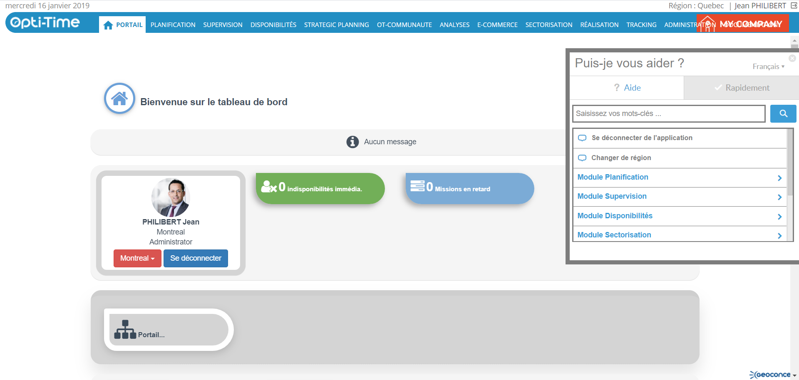

# Guided Help - NFS

**NFS Guided Help** provides step-by-step assistance within the application. Access to Guided Help is available only to users whose profile has the **DOC\_ENABLE\_WALKME** right enabled (**Doc tab > Perimeter > DOC\_ENABLE\_WALKME**).

The Guided Help system acts as an in-application guide, helping users complete tasks, providing contextual guidance, and highlighting the latest functional changes in NFS.

To access Guided Help:

1. Open the **Help** pane displayed over the application interface.
2. Select the required guide.
3. Follow the on-screen instructions to complete the guided steps.

