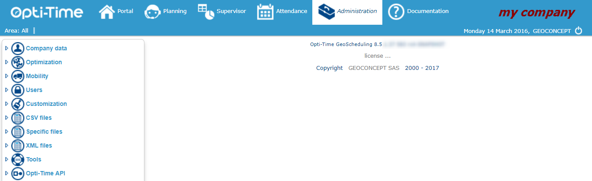

# Home Page

Access the Nomadia Administration menu by clicking on the Administration tab in the [blue band](https://mynomadia.com/privatedoc/9LLcWh7j74sENa54/optitime-doc/docs/en/otgs-reference-book/bandeau.html) at the top of the screen, or by entering the application directly if the [user profile](https://mynomadia.com/privatedoc/9LLcWh7j74sENa54/optitime-doc/docs/en/otgs-reference-book/donnees.html#RH-utilisateur) is set up to open Nomadia in the Administration module.

|                                                                                                                                                                                                     |      |
| --------------------------------------------------------------------------------------------------------------------------------------------------------------------------------------------------- | ---- |
| \[Note]                                                                                                                                                                                             | Note |
| Connection via an administrator profile is required (see the chapter called [Users](https://mynomadia.com/privatedoc/9LLcWh7j74sENa54/optitime-doc/docs/en/otgs-reference-book/utilisateurs.html)). |      |

Administration module Home page

The Home page is divided into three sections:

* The [**band**](https://mynomadia.com/privatedoc/9LLcWh7j74sENa54/optitime-doc/docs/en/otgs-reference-book/bandeau.html), at the top of the screen, enables access to the different modules making up the application
* The **menu** to the left of the screen provides access to the different data so they can be manipulated;
* A section to the right of the screen displays different screens relating to the data accessible in the Administration module.

|                                                                                                                                                                                                                                                                                                                                                                           |     |
| ------------------------------------------------------------------------------------------------------------------------------------------------------------------------------------------------------------------------------------------------------------------------------------------------------------------------------------------------------------------------- | --- |
| \[Tip]                                                                                                                                                                                                                                                                                                                                                                    | Tip |
| Displayed on the Home page is the current version number of Opti-Time installed on the server (for example, 9.0.1.42). It is worth noting this number down so it can be easily found and used as a reference when contacting the GEOCONCEPT support team. The list of enabled modules on the current installation is also displayed, with details of the current licence. |     |

The Administration module is structured into several dialogue items enabling access to the different information items needed by the application. The different dialogue items available are

* [Company data](https://mynomadia.com/privatedoc/9LLcWh7j74sENa54/optitime-doc/docs/en/otgs-reference-book/donnees.html)
* [Optimization](https://mynomadia.com/privatedoc/9LLcWh7j74sENa54/optitime-doc/docs/en/otgs-reference-book/optimisation.html)
* [Mobility](https://mynomadia.com/privatedoc/9LLcWh7j74sENa54/optitime-doc/docs/en/otgs-reference-book/mob.html)
* [Users](https://mynomadia.com/privatedoc/9LLcWh7j74sENa54/optitime-doc/docs/en/otgs-reference-book/utilisateurs.html)
* [Customization](https://mynomadia.com/privatedoc/9LLcWh7j74sENa54/optitime-doc/docs/en/otgs-reference-book/perso.html)
* [CSV files](https://mynomadia.com/privatedoc/9LLcWh7j74sENa54/optitime-doc/docs/en/otgs-reference-book/CSV.html)
* [Tools](https://mynomadia.com/privatedoc/9LLcWh7j74sENa54/optitime-doc/docs/en/otgs-reference-book/outils.html)

To access a function or data item in the menu, simply click on the corresponding link in the left-hand menu. The different data or functions are classified as follows:

* **Company data**
  * [Human resource](https://mynomadia.com/privatedoc/9LLcWh7j74sENa54/optitime-doc/docs/en/otgs-reference-book/donnees.html#RH)
  * [Function](https://mynomadia.com/privatedoc/9LLcWh7j74sENa54/optitime-doc/docs/en/otgs-reference-book/donnees.html#type-expertise)
  * [Job type](https://mynomadia.com/privatedoc/9LLcWh7j74sENa54/optitime-doc/docs/en/otgs-reference-book/donnees.html#type-poste)
  * [Subcontractor](https://mynomadia.com/privatedoc/9LLcWh7j74sENa54/optitime-doc/docs/en/otgs-reference-book/donnees.html#sous-traitants)
  * [Equipment](https://mynomadia.com/privatedoc/9LLcWh7j74sENa54/optitime-doc/docs/en/otgs-reference-book/donnees.html#materiel)
  * [Product family](https://mynomadia.com/privatedoc/9LLcWh7j74sENa54/optitime-doc/docs/en/otgs-reference-book/donnees.html#famille-produit)
    * [Product](https://mynomadia.com/privatedoc/9LLcWh7j74sENa54/optitime-doc/docs/en/otgs-reference-book/donnees.html#produit)
  * [Team](https://mynomadia.com/privatedoc/9LLcWh7j74sENa54/optitime-doc/docs/en/otgs-reference-book/donnees.html#equipe)
  * [Domain](https://mynomadia.com/privatedoc/9LLcWh7j74sENa54/optitime-doc/docs/en/otgs-reference-book/donnees.html#domaine)
  * [Area](https://mynomadia.com/privatedoc/9LLcWh7j74sENa54/optitime-doc/docs/en/otgs-reference-book/donnees.html#region)
  * [Worksite](https://mynomadia.com/privatedoc/9LLcWh7j74sENa54/optitime-doc/docs/en/otgs-reference-book/donnees.html#site-travail)
  * [Sector](https://mynomadia.com/privatedoc/9LLcWh7j74sENa54/optitime-doc/docs/en/otgs-reference-book/donnees.html#secteur)
  * [Unavailability type](https://mynomadia.com/privatedoc/9LLcWh7j74sENa54/optitime-doc/docs/en/otgs-reference-book/donnees.html#type-indispo)
  * [Exceptional location type](https://mynomadia.com/privatedoc/9LLcWh7j74sENa54/optitime-doc/docs/en/otgs-reference-book/donnees.html#type-except-loc)
  * [On-call duties](https://mynomadia.com/privatedoc/9LLcWh7j74sENa54/optitime-doc/docs/en/otgs-reference-book/donnees.html#astreintes)
    * [Day template](https://mynomadia.com/privatedoc/9LLcWh7j74sENa54/optitime-doc/docs/en/otgs-reference-book/donnees.html#modele-jour)
    * [Week template](https://mynomadia.com/privatedoc/9LLcWh7j74sENa54/optitime-doc/docs/en/otgs-reference-book/donnees.html#modele-semaine-astreinte)
  * [Skill](https://mynomadia.com/privatedoc/9LLcWh7j74sENa54/optitime-doc/docs/en/otgs-reference-book/donnees.html#competence)
  * [Authorization](https://mynomadia.com/privatedoc/9LLcWh7j74sENa54/optitime-doc/docs/en/otgs-reference-book/donnees.html#autorisation)
  * [Intervention group](https://mynomadia.com/privatedoc/9LLcWh7j74sENa54/optitime-doc/docs/en/otgs-reference-book/donnees.html#groupe-intervention)
    * [Mission type](https://mynomadia.com/privatedoc/9LLcWh7j74sENa54/optitime-doc/docs/en/otgs-reference-book/donnees.html#type-intervention)
  * [Targets](https://mynomadia.com/privatedoc/9LLcWh7j74sENa54/optitime-doc/docs/en/otgs-reference-book/donnees.html#objectifs)
  * [Activities follow up](https://mynomadia.com/privatedoc/9LLcWh7j74sENa54/optitime-doc/docs/en/otgs-reference-book/donnees.html#suivi-activite)
    * [Completion status](https://mynomadia.com/privatedoc/9LLcWh7j74sENa54/optitime-doc/docs/en/otgs-reference-book/donnees.html#etat-realisation)
    * [Follow-up](https://mynomadia.com/privatedoc/9LLcWh7j74sENa54/optitime-doc/docs/en/otgs-reference-book/donnees.html#suite)
  * [Typology](https://mynomadia.com/privatedoc/9LLcWh7j74sENa54/optitime-doc/docs/en/otgs-reference-book/_home_page_3.html)
  * [Calendars](https://mynomadia.com/privatedoc/9LLcWh7j74sENa54/optitime-doc/docs/en/otgs-reference-book/_home_page_3.html)
    * [Public holidays](https://mynomadia.com/privatedoc/9LLcWh7j74sENa54/optitime-doc/docs/en/otgs-reference-book/donnees.html#jour-ferie)
    * [Day template](https://mynomadia.com/privatedoc/9LLcWh7j74sENa54/optitime-doc/docs/en/otgs-reference-book/donnees.html#modele-jour)
    * [Week template](https://mynomadia.com/privatedoc/9LLcWh7j74sENa54/optitime-doc/docs/en/otgs-reference-book/donnees.html#modele-semaine)
    * [Sales Period](https://mynomadia.com/privatedoc/9LLcWh7j74sENa54/optitime-doc/docs/en/otgs-reference-book/donnees.html#periode-vente)
* **Optimisation**
  * [Optimization parameters](https://mynomadia.com/privatedoc/9LLcWh7j74sENa54/optitime-doc/docs/en/otgs-reference-book/optimisation.html#param-optim)
  * [Optimization planning](https://mynomadia.com/privatedoc/9LLcWh7j74sENa54/optitime-doc/docs/en/otgs-reference-book/optimisation.html#planif-optim)
  * [Activate/Deactivate an area](https://mynomadia.com/privatedoc/9LLcWh7j74sENa54/optitime-doc/docs/en/otgs-reference-book/optimisation.html#activ-region)
  * [Import/Export optim](https://mynomadia.com/privatedoc/9LLcWh7j74sENa54/optitime-doc/docs/en/otgs-reference-book/optimisation.html#impexp-optim)
* **Mobility**
  * [Vehicles](https://mynomadia.com/privatedoc/9LLcWh7j74sENa54/optitime-doc/docs/en/otgs-reference-book/mob.html#mob-vehicules)
  * [Tracking service](https://mynomadia.com/privatedoc/9LLcWh7j74sENa54/optitime-doc/docs/en/otgs-reference-book/mob.html#mob-equip-suivi)
  * [Assignments](https://mynomadia.com/privatedoc/9LLcWh7j74sENa54/optitime-doc/docs/en/otgs-reference-book/mob.html#mob-affectation)
  * [Tracking utils](https://mynomadia.com/privatedoc/9LLcWh7j74sENa54/optitime-doc/docs/en/otgs-reference-book/mob.html#util-suivi)
  * [Settings](https://mynomadia.com/privatedoc/9LLcWh7j74sENa54/optitime-doc/docs/en/otgs-reference-book/mob.html#mob-parametres)
* **Users**
  * [Profile](https://mynomadia.com/privatedoc/9LLcWh7j74sENa54/optitime-doc/docs/en/otgs-reference-book/utilisateurs.html#profil)
  * [Collection of rights](https://mynomadia.com/privatedoc/9LLcWh7j74sENa54/optitime-doc/docs/en/otgs-reference-book/utilisateurs.html#coll-droits)
  * [Access rights](https://mynomadia.com/privatedoc/9LLcWh7j74sENa54/optitime-doc/docs/en/otgs-reference-book/_home_page_3.html)
  * [Alert subscriptions](https://mynomadia.com/privatedoc/9LLcWh7j74sENa54/optitime-doc/docs/en/otgs-reference-book/utilisateurs.html#abo)
* **Customization**
  * [Application settings](https://mynomadia.com/privatedoc/9LLcWh7j74sENa54/optitime-doc/docs/en/otgs-reference-book/perso.html#config-appli)
  * [Colors](https://mynomadia.com/privatedoc/9LLcWh7j74sENa54/optitime-doc/docs/en/otgs-reference-book/perso.html#couleurs)
    * Referentials colors
    * Application colors
* **CSV files**
  * [Import CSV file](https://mynomadia.com/privatedoc/9LLcWh7j74sENa54/optitime-doc/docs/en/otgs-reference-book/CSV.html#CSV-importer)
  * [Export CSV file](https://mynomadia.com/privatedoc/9LLcWh7j74sENa54/optitime-doc/docs/en/otgs-reference-book/CSV.html#CSV-exporter)
  * [Global CSV import/export](https://mynomadia.com/privatedoc/9LLcWh7j74sENa54/optitime-doc/docs/en/otgs-reference-book/CSV.html#CSV-global)
  * [CSV import/export template](https://mynomadia.com/privatedoc/9LLcWh7j74sENa54/optitime-doc/docs/en/otgs-reference-book/CSV.html#CSV-modele)
  * [Circulation listeners](https://mynomadia.com/privatedoc/9LLcWh7j74sENa54/optitime-doc/docs/en/otgs-reference-book/CSV.html#listener)
  * [predefined export links](https://mynomadia.com/privatedoc/9LLcWh7j74sENa54/optitime-doc/docs/en/otgs-reference-book/CSV.html#export-predefini)
  * **Specific files**
    * [Export of TomTom POI](https://mynomadia.com/privatedoc/9LLcWh7j74sENa54/optitime-doc/docs/en/otgs-reference-book/CSV.html#fichiers-spec-tom-tom)
    * [Export of Masternaut POI](https://mynomadia.com/privatedoc/9LLcWh7j74sENa54/optitime-doc/docs/en/otgs-reference-book/CSV.html#fichiers-spec-master)
    * [Export of Garmin POI](https://mynomadia.com/privatedoc/9LLcWh7j74sENa54/optitime-doc/docs/en/otgs-reference-book/CSV.html#fichiers-spec-garmin)
    * [Export of KML POI](https://mynomadia.com/privatedoc/9LLcWh7j74sENa54/optitime-doc/docs/en/otgs-reference-book/CSV.html#fichiers-spec-kml)
  * [Export OT-Strategic files](https://mynomadia.com/privatedoc/9LLcWh7j74sENa54/optitime-doc/docs/en/otgs-reference-book/CSV.html#fichiers-spec-strategic)
  * **XML Files**
    * [Optimisation file](https://mynomadia.com/privatedoc/9LLcWh7j74sENa54/optitime-doc/docs/en/otgs-reference-book/CSV.html#XML-optim)
    * [Reference files](https://mynomadia.com/privatedoc/9LLcWh7j74sENa54/optitime-doc/docs/en/otgs-reference-book/_home_page_3.html)
    * [Appointment request file](https://mynomadia.com/privatedoc/9LLcWh7j74sENa54/optitime-doc/docs/en/otgs-reference-book/_home_page_3.html)
    * [Circulation file](https://mynomadia.com/privatedoc/9LLcWh7j74sENa54/optitime-doc/docs/en/otgs-reference-book/CSV.html#XML-circulation)
    * [Customization file](https://mynomadia.com/privatedoc/9LLcWh7j74sENa54/optitime-doc/docs/en/otgs-reference-book/CSV.html#XML-perso)
* **Tools**
  * [Advanced tools](https://mynomadia.com/privatedoc/9LLcWh7j74sENa54/optitime-doc/docs/en/otgs-reference-book/outils.html#MAJ-BDD)
  * [Recompute distance](https://mynomadia.com/privatedoc/9LLcWh7j74sENa54/optitime-doc/docs/en/otgs-reference-book/outils.html#recalcul-dist)
  * [Check server state](https://mynomadia.com/privatedoc/9LLcWh7j74sENa54/optitime-doc/docs/en/otgs-reference-book/_home_page_3.html)
  * [SQL query](https://mynomadia.com/privatedoc/9LLcWh7j74sENa54/optitime-doc/docs/en/otgs-reference-book/_home_page_3.html)
  * [Logs](https://mynomadia.com/privatedoc/9LLcWh7j74sENa54/optitime-doc/docs/en/otgs-reference-book/outils.html#journaux)
  * [JVM thread dump](https://mynomadia.com/privatedoc/9LLcWh7j74sENa54/optitime-doc/docs/en/otgs-reference-book/outils.html#thread-jvm)
* **Nomadia API**
  * Documentation
  * CSV export/import templates
* **MyGeoconcept**

|                                                                                                                                                                                                                                                                                                                                                                                                                                                                                                                                           |      |
| ----------------------------------------------------------------------------------------------------------------------------------------------------------------------------------------------------------------------------------------------------------------------------------------------------------------------------------------------------------------------------------------------------------------------------------------------------------------------------------------------------------------------------------------- | ---- |
| \[Note]                                                                                                                                                                                                                                                                                                                                                                                                                                                                                                                                   | Note |
| The most often used dialogue items are [Company data](https://mynomadia.com/privatedoc/9LLcWh7j74sENa54/optitime-doc/docs/en/otgs-reference-book/donnees.html), [Optimisation](https://mynomadia.com/privatedoc/9LLcWh7j74sENa54/optitime-doc/docs/en/otgs-reference-book/optimisation.html), [Users](https://mynomadia.com/privatedoc/9LLcWh7j74sENa54/optitime-doc/docs/en/otgs-reference-book/utilisateurs.html) and [CSV Files](https://mynomadia.com/privatedoc/9LLcWh7j74sENa54/optitime-doc/docs/en/otgs-reference-book/CSV.html). |      |
