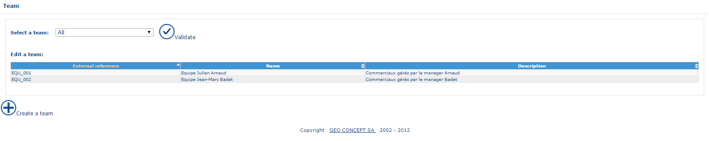
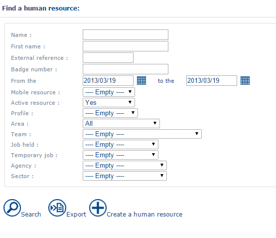
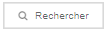
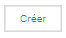
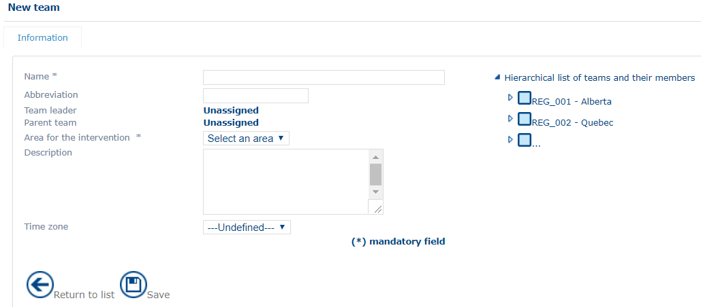
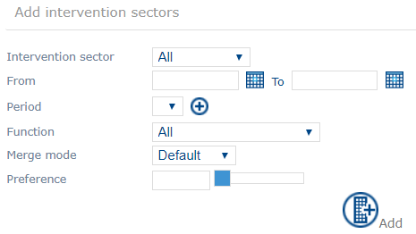
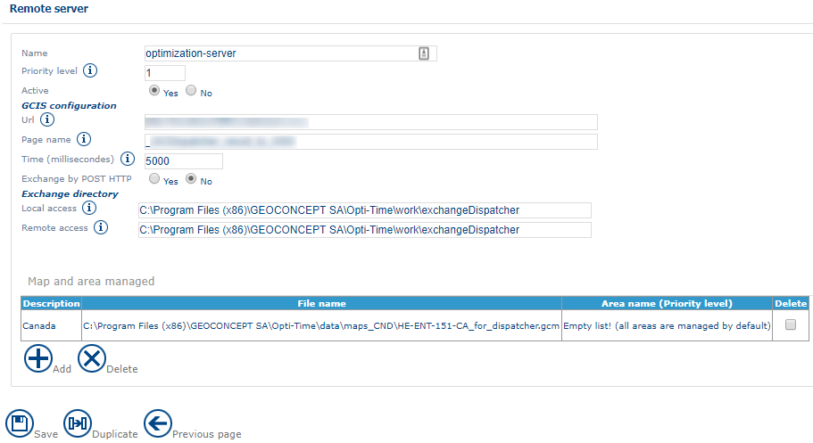
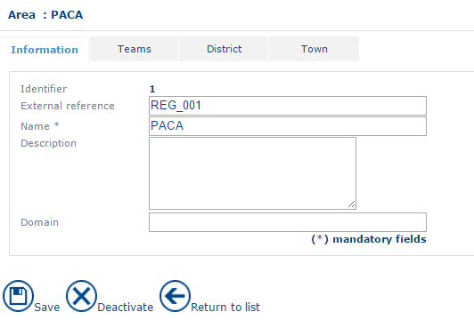
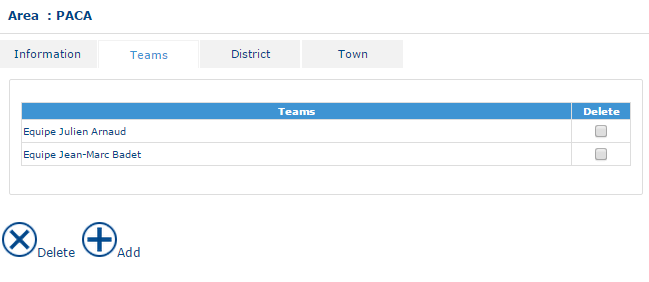
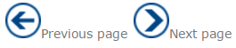

# General Principles

Administration module data are presented in the same way:

* A [home page](https://mynomadia.com/privatedoc/9LLcWh7j74sENa54/optitime-doc/docs/en/otgs-reference-book/generalites.html#generalite-liste) enabling access to records and to functions;
* A [form](https://mynomadia.com/privatedoc/9LLcWh7j74sENa54/optitime-doc/docs/en/otgs-reference-book/generalites.html#generalite-fiche) containing the information relating to the data currently being viewed.

|                                                                                                                                                                                                                                           |      |
| ----------------------------------------------------------------------------------------------------------------------------------------------------------------------------------------------------------------------------------------- | ---- |
| \[Note]                                                                                                                                                                                                                                   | Note |
| Access to data, and actions that can be applied in the form of a data item are subject to [utilisation rights](https://mynomadia.com/privatedoc/9LLcWh7j74sENa54/optitime-doc/docs/en/otgs-reference-book/utilisateurs.html#coll-droits). |      |

### Data home page

The Data home page contains the list of records present in the database.

The data presented in the list correspond to fields in the [form](https://mynomadia.com/privatedoc/9LLcWh7j74sENa54/optitime-doc/docs/en/otgs-reference-book/generalites.html#generalite-fiche) for the data. The definition of these fields is therefore given in the **form** part of the corresponding documentation.

The list may contain a header that can be used to restrict its display:

For example: Filtering on teams

In some cases, a preliminary search screen will display showing different filters serving to restrict the list display.

For example: Search for human resources

The  button provides access to the list of filtered data.

From this list, it will be possible to:

* [create a new data item](https://mynomadia.com/privatedoc/9LLcWh7j74sENa54/optitime-doc/docs/en/otgs-reference-book/generalites.html#creation)
* [consult or modify an existing data item](https://mynomadia.com/privatedoc/9LLcWh7j74sENa54/optitime-doc/docs/en/otgs-reference-book/generalites.html#modification)
* [delete or deactivate a data item](https://mynomadia.com/privatedoc/9LLcWh7j74sENa54/optitime-doc/docs/en/otgs-reference-book/generalites.html#suppression)

### Data form

The form contains saved information associated to the data item.

At the top of the screen, the record currently being edited displays. In the example below, the type of role is that of "Controller".

For example: Modifying a type of post

|                                           |         |
| ----------------------------------------- | ------- |
| \[Warning]                                | Warning |
| Mandatory fields are indicated by a star. |         |

To save a data item, click on the  button at the bottom of the form.

|                                                                                                                                                                                    |         |
| ---------------------------------------------------------------------------------------------------------------------------------------------------------------------------------- | ------- |
| \[Warning]                                                                                                                                                                         | Warning |
| Saving: When saving a data item, a unique identifier is automatically created. It cannot be modified subsequently. Only the external identifier can be modified via the interface. |         |

From the data item form, the user can:

* [delete or deactivate a data item](https://mynomadia.com/privatedoc/9LLcWh7j74sENa54/optitime-doc/docs/en/otgs-reference-book/generalites.html#suppression)
* [duplicate a data item](https://mynomadia.com/privatedoc/9LLcWh7j74sENa54/optitime-doc/docs/en/otgs-reference-book/generalites.html#duplication)

### Create a new data item

At the bottom of the [data listing](https://mynomadia.com/privatedoc/9LLcWh7j74sENa54/optitime-doc/docs/en/otgs-reference-book/generalites.html#generalite-liste), a  button allows you to enter a new data item. The application returns a blank [creation form](https://mynomadia.com/privatedoc/9LLcWh7j74sENa54/optitime-doc/docs/en/otgs-reference-book/generalites.html#generalite-fiche).

For example: Creation of a new team

### Consult or edit an existing data item

Click on a line in the [data listing](https://mynomadia.com/privatedoc/9LLcWh7j74sENa54/optitime-doc/docs/en/otgs-reference-book/generalites.html#generalite-liste), and it can be edited. The user can then access the [form](https://mynomadia.com/privatedoc/9LLcWh7j74sENa54/optitime-doc/docs/en/otgs-reference-book/generalites.html#generalite-fiche) of the corresponding data item.

When creating / consulting a data item for which the forms comprise several tabs, the user is returned to the first tab in the form.

### Adding data

Some data items will require you to add extra fields. For example, where you need to add extra intervention sectors to the resource’s existing sectors of affiliation.

In this case, the addition is made by clicking on the Add button, having first filled in the complementary data required:

For example: Adding a secondary intervention sector

### Duplicating a data item

In certain cases, it will be possible to duplicate a data item. To do this, click on Duplicate from the [form](https://mynomadia.com/privatedoc/9LLcWh7j74sENa54/optitime-doc/docs/en/otgs-reference-book/generalites.html#generalite-fiche) of the data item, and then save the new data item by clicking on .

For example: Duplicating a planning server

|                                                                                                                                          |         |
| ---------------------------------------------------------------------------------------------------------------------------------------- | ------- |
| \[Warning]                                                                                                                               | Warning |
| Be sure to give a different external reference to the duplicated object, otherwise it will replace and thereby delete the source object. |         |

### De-activating / Deleting a data item

To delete or deactivate a data item, click on  in the [form](https://mynomadia.com/privatedoc/9LLcWh7j74sENa54/optitime-doc/docs/en/otgs-reference-book/generalites.html#generalite-fiche) of the data item.

For example: De-activating an area

In certain cases, it will be possible to deactivate a data item by checking the **Delete** check-box in the [list of records](https://mynomadia.com/privatedoc/9LLcWh7j74sENa54/optitime-doc/docs/en/otgs-reference-book/generalites.html#generalite-liste) listing, and clicking on :

For example: Deleting a team

### Navigation

Navigation in the repository takes place with the help of arrows:

Navigation

|                                                                                               |         |
| --------------------------------------------------------------------------------------------- | ------- |
| \[Warning]                                                                                    | Warning |
| The **Return to list** action during a modification event invalidates any modifications made. |         |

In the remainder of this document the following areas will be described: access to data, search filters, that may vary from one data item to another, and the specificities of managing each data item.
