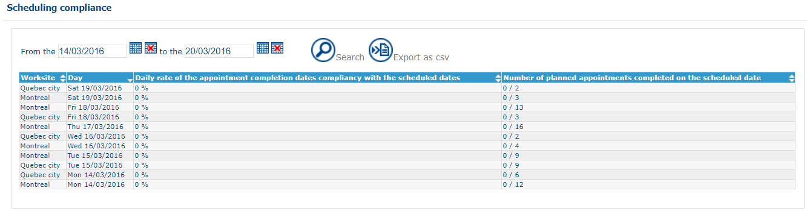

# Analyses - Scheduling Compliance

### Role

Allows tracking of the number of appointments completed by the expected date.

### Application

Degree of conformity with established planned schedules (Compliance)

The search period can be defined using the fields at the top of the page.

Click on to display the table.\
Click on  to export the result in .csv format.
