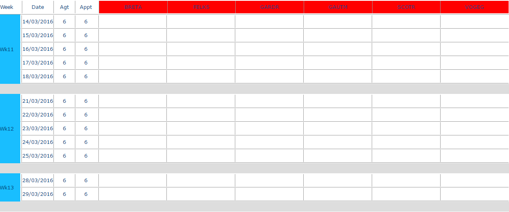

# Analyses - Unavailabilities Global Planning

### Role

View unavailabilities for resources.

### Application

Choose a team and the time window in terms of dates and click on the .png>) button to display the table.

A new page then opens containing the unavailabilities planning for the selected team in .html format:

Unavailabilities planning

