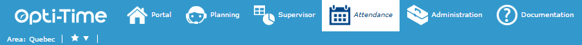

# Attendance

The Attendance module in **Opti-Time** can only be accessed if the [corresponding rights](https://mynomadia.com/privatedoc/9LLcWh7j74sENa54/optitime-doc/docs/en/otgs-reference-book/utilisateurs.html#coll-droits) (Attendance tab > **ATTENDANCEMANAGER\_GUEST**, **ATTENDANCEMANAGER\_SHOW\_AREA** and either **ATTENDANCEMANAGER\_SHOW\_WORKSITES** or **ATTENDANCEMANAGER\_SHOW\_TEAMS**) are associated to the user profile.

This is designed for use by managers and planning personnel.

It allows the user to:

* view plannings in the selection as a function of the temporary post assigned to each resource;
* easily and rapidly apply manual modifications to the resources' plannings.

Access the Attendance by clicking at the top in the [site header bar](https://mynomadia.com/privatedoc/9LLcWh7j74sENa54/optitime-doc/docs/en/otgs-reference-book/bandeau.html).

In addition to the current [area](https://mynomadia.com/privatedoc/9LLcWh7j74sENa54/optitime-doc/docs/en/otgs-reference-book/bandeau-changer-region.html), the user can enable/disable favourites for the area defined in the favourites management pane (filter on a selection of teams or worksites, corresponding by default to that defined in the [form](https://mynomadia.com/privatedoc/9LLcWh7j74sENa54/optitime-doc/docs/en/otgs-reference-book/donnees.html#RH-perimetre), but that can be adjusted and redefined here).\
If the [corresponding right](https://mynomadia.com/privatedoc/9LLcWh7j74sENa54/optitime-doc/docs/en/otgs-reference-book/utilisateurs.html#coll-droits) (Availabilities tab > Communication > **ATTENDANCEMANAGER\_VIEW\_MESSAGE** right) is associated to the user profile, access is also possible to any unread [messages](https://mynomadia.com/privatedoc/9LLcWh7j74sENa54/optitime-doc/docs/en/otgs-reference-book/call-center-menu.html#messages) that have been sent to the user, via the .png>) icon. Note that this icon will disappear once no unread messages remain.

Accessing attendance

