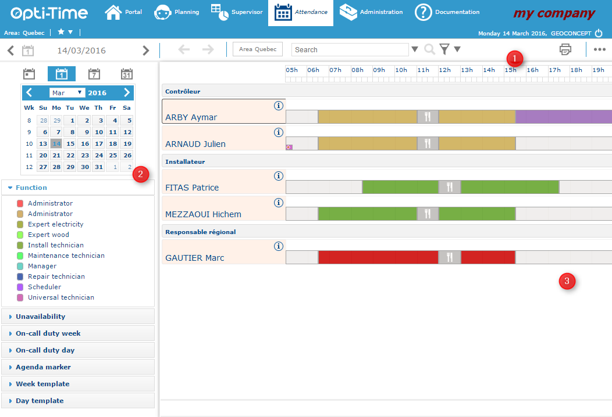

# Homepage

The home page for this module is in 3 parts:

#### Planning screen layout

The planning screen is made up of three areas: a command bar, a side menu, and the planning display.

**Command bar**

The command bar is at the top of the screen. The options available depend on your user rights.

* **Period navigation:** Use the **<** and **>** arrows to move between the displayed periods.
* **Planning navigation:** Use the \[icon] and \[icon] arrows to move between the displayed plannings.
* **Viewing perimeter:** Select an area, a worksite, or a team for the current area. If area favourites are enabled, only your favourites are offered.
  * If your profile has the **ATTENDANCEMANAGER\_SHOW\_RESOURCEUSERLISTS** right (Availabilities tab > Perimeter), you can also create your own lists of resources. Select the resources from the sites of the current area (or from its teams, depending on the **attendance.options.display > resourceUserListFilterPerimeter** parameter in the Display tab > Attendance). Each list you create appears in the **My lists** sub-menu.
* **Search field:** Quickly find a resource, team, worksite, or area.
* **Resource filter:** Narrow the display to a selection of resources within the chosen perimeter.
* **Export:** Export the displayed planning as a .csv file.
* **Print:** Print the displayed planning.
* **Services list:**
  * Display plannings in report format.
  * Print a planning summary.

**Side menu**

The side menu is on the left of the screen. It lets you choose the date and period to display, and the objects to apply to the planning.

**Date and period**

* \[icon] Displays the planning for today.
* \[icon] Displays the day planning for the selected date.
* \[icon] Displays the weekly planning for the selected date.
* \[icon] Displays the monthly planning for the selected date.
* Additional buttons let you move from one date to another.

**Objects to apply**

Drag and drop any of the following onto the planning:

* A post type
* An unavailability type
* An on-call duty week template (click the information icon to view its form)
* An on-call duty day template (hover over the information point to view its content)
* An agenda marker
* A working week template (click the information icon to view its form)
* A day template (click the information icon to view its form)

**Planning display**

The right-hand area shows the selected planning(s), grouped by post type.

* **Zoom:** Hover over the time scale to display a tooltip, where you can change the zoom level.
* **Hide resources:** Click \[icon] to hide the resources of a given post type.
* **Resource details:** Click \[icon] next to a resource's name to open an information popup, which links to that resource's form.
* **Item details:** Hover over any item in the planning to display an information popup for it.

A few notes you may want to check against your style guide:

* I standardised on "Select", "Click", and "Hover over" for UI actions.
* I turned the "possibility of…" phrasing into direct action statements, which is the usual convention in Nomadia-style procedural docs.
* The parameter and right names are kept exactly as in the source, since users will need to match them in the application.
