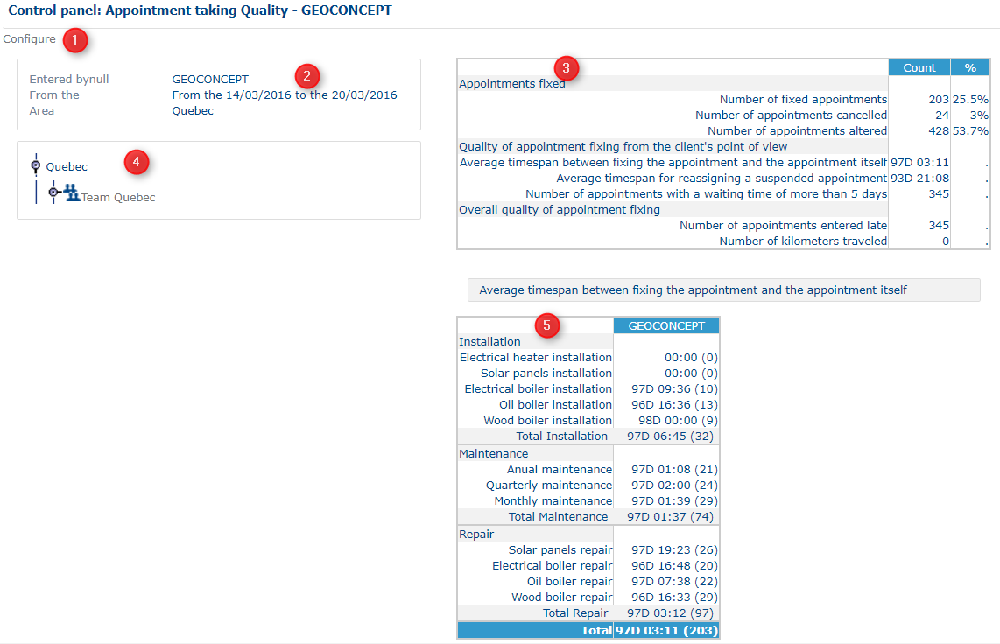

# Control Panel - Appointment taking Quality

### Role

This page provides a summary table of statistical information on appointments in terms of quality.

### Application

This table is divided up into five sections.

Control panel Appointment taking Quality

Click on Configure (1) to switch to the preceding [configuration](https://mynomadia.com/privatedoc/9LLcWh7j74sENa54/optitime-doc/docs/en/otgs-reference-book/config.html) step.

Section (2) gives information about the resource on which you want to calculate the table. The period during which the dates are displayed, along with the area.

The table (3) in the right-hand part of the screen provides 3 types of information.

* The **Appointment** theme suggests 3 indicators:
  * Number of appointments taken: these are appointments made manually and optimised, taken by the chosen resource. This value represents the total, and so 100%;
  * Number of appointments cancelled: manual and optimised appointments that have been invalidated. The number is displayed and completed by a percentage figure;
  * Number of appointments modified: manually taken and optimised appointments for which one component has been modified (date, time, resource, intervention type). The number displayed is completed by a percentage.
* The **Quality** theme offered to the customer calculates at least 5 indicators. They are all expressed in terms of a number of days (the infobox confirms this):
  * The average timespan between the making of an appointment and the visit: the time calculated between the time and the date of the taking of the appointment and those of the completion of the said appointment;
  * Average time delay when reassigning a suspended appointment: the time calculated between the time and the date of the suspension of an appointment and its reassignment;
  * Number of appointments for which the waiting time is more than 5 days between the taking of the appointment and the visit;
  * Average delay Sector N (this indicator is repeated for each of the sectors in the selected area): this is the average timespan between the taking of the appointment and the visit for all appointments in the reference sector for the visiting resource;
  * Average out of sector timespan: an area that has several sectors, and that contains a geographic space that falls «outside the sector»; you need to know the average timespan between the taking of the appointment and the visit by the resource responsible for fulfilling the appointment.
* The **General Quality** theme calculates two indicators:
  * Number of visit reports entered late: the Field Consultant resource has a timespan of n days (configurable) to produce their visit report after it has been completed. This number calculates this information so that the appointment completed and the configured timespan are taken into account in the configured period.
  * Number of kilometers travelled: this is the sum of all the kilometers travelled for all the appointments fulfilled, modified, suspended during the configured period for which the mobile resource has been assigned (only those field consultants working for the configured resource).

The hierarchical tree (4) shows all the resources for the reference area, structured in terms of teams. Clicking on each «entity», it will be possible to update the corresponding table (3). This hierarchical tree rolls out and rolls up.

Section (5) presents the average timespans that run between the taking of the appointment and the visit for each type of intervention. The turnover in brackets corresponds to the number of appointments fulfilled.
