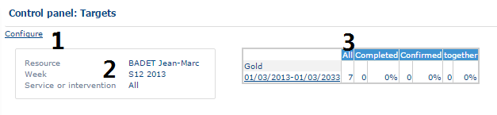

# Control Panel - Targets

### Role

This page proposes a summary table that gives statistical information on the objectives.

### Application

This table is divided into three parts.

Control panel Targets

Click on Configure (1) to switch to the preceding [configuration](https://mynomadia.com/privatedoc/9LLcWh7j74sENa54/optitime-doc/docs/en/otgs-reference-book/config.html) step.

Section (2) gives information about the resource on which to calculate the table as desired. The period or the date are displayed as well as the area or the worksite or the team. This item provides a recap on the type of offers selected during the [configuration.](https://mynomadia.com/privatedoc/9LLcWh7j74sENa54/optitime-doc/docs/en/otgs-reference-book/config.html)

The table (3) suggests in the right-hand part of the screen a summary of objectives by activity (according to the parameters defined in the configuration of the dashboard).+ Clicking on the weekly objectives for a given activity, it is possible to consult the detail of the objectives by **Activity type**, **Job type**, **Resource** or **Resource type**. The section entitled **Detail by** allows you to view the objectives according to several criteria. Choose first the display type desired, and then click on **Refresh**:

* **Activity type** allows you to obtain indicators for all the intervention types that make up an activity type;
* **Intervention type** returns indicators on each type of intervention;
* The **Resource** item allows you to obtain the indicators on each resource from the same platform;
* **Resource type** allows you to obtain indicators by role type.
