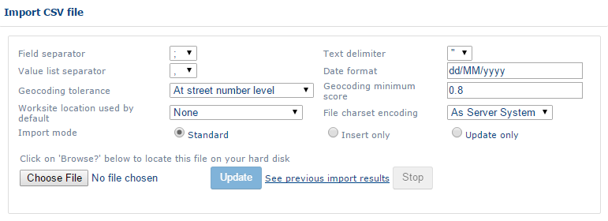
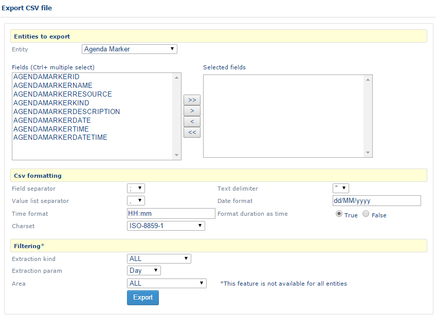
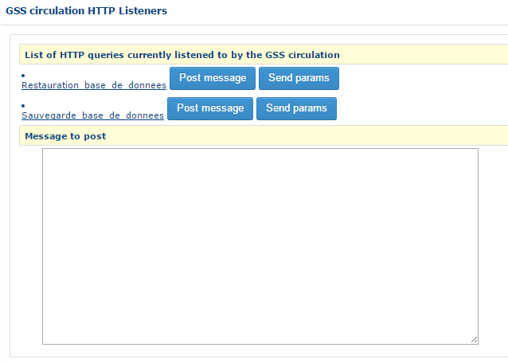
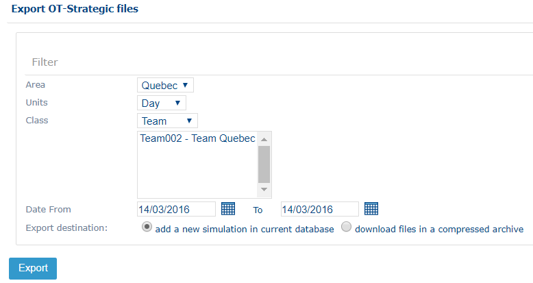
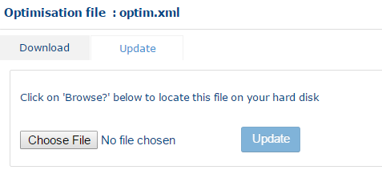

CSV files
-
Opti-Time Reference Guide

# Opti-Time Reference Guide Administration

|  |  |
| --- | --- |
| [Sidebar](https://mynomadia.com/privatedoc/9LLcWh7j74sENa54/optitime-doc/docs/en/otgs-reference-book/CSV.html# "Hide TOC tree") | [Prev](https://mynomadia.com/privatedoc/9LLcWh7j74sENa54/optitime-doc/docs/en/otgs-reference-book/perso.html) | [Up](https://mynomadia.com/privatedoc/9LLcWh7j74sENa54/optitime-doc/docs/en/otgs-reference-book/module-administration.html) | [Next](https://mynomadia.com/privatedoc/9LLcWh7j74sENa54/optitime-doc/docs/en/otgs-reference-book/outils.html) |

### CSV files

The functions described in this section allow you to manage the data presented in this document in the form of CSV files.

For example, instead of entering the mobile resources for the company one by one, it is possible to import a single CSV file.

These functions also enable retrieval of a data set for the purpose of archiving it via export functions or to rapidly modify
a large quantity of data by [exporting](https://mynomadia.com/privatedoc/9LLcWh7j74sENa54/optitime-doc/docs/en/otgs-reference-book/CSV.html#CSV-exporter "Exporting a CSV file") a CSV file, and then modifying the desired fields before [re-importing](https://mynomadia.com/privatedoc/9LLcWh7j74sENa54/optitime-doc/docs/en/otgs-reference-book/CSV.html#CSV-importer "Importing a CSV File") them.

#### Importing a CSV File

This function is available when you click on the Import CSV file link under the "[CSV files](https://mynomadia.com/privatedoc/9LLcWh7j74sENa54/optitime-doc/docs/en/otgs-reference-book/CSV.html "CSV files")" item.

The interface is divided into three sections: one enabling definition of the import format (this format should correspond
to the format of the file to import), one enabling selection of the file to import, and a Previous result button.

Interface

The information on the format to define are as follows:

- **Field separator**: this is the character separating the different columns (, ; \t : |)
- **Text delimiter**: this is the character delimiting a text zone (" ' or empty)
- **Separator of lists of values**: this is a character that separates the values in one list in a single column (, ; \t : |). This separator must be different
  from the fields separator
- **Dates format**: Formatting of date type data. By default, the dates are in the format dd/mm/yyyy (ex: 21/03/2016)
- **[Geocoding](https://mynomadia.com/privatedoc/9LLcWh7j74sENa54/optitime-doc/docs/en/otgs-reference-book/_glossary.html#geocodage) tolerance**: lowest geocoding quality accepted (for data including [address fields](https://mynomadia.com/privatedoc/9LLcWh7j74sENa54/optitime-doc/docs/en/otgs-reference-book/intro-geocodage.html "The geocoding")):

  - *On street number*: Data for which the address does not include any street number will not be imported
  - *Exclusively on street number*: Data for which the address does not include the street number will not be imported
  - *On streets*: Data where the address does not include the street name will not be imported
  - *Exclusively on streets*: Data for which the address does not include the street name will not be imported, and addresses that are more precise will
    be placed at the middle of the street
  - *On towns*: Data for which the address does not include the town name will not be imported
- Minimum geocoding score: Defines a minimum accepted geocoding quality. The geocoding score is complementary to the *Geocoding tolerance*.
- **Worksite used by default**
- **Charset of file encoding**: this is the encoding format for the file to import (*As Server System* or *utf8*)
- **Importation mode**: This is the import mode used to import data into the file.

  - *Standard*: existing data will be modified and the new data added
  - *Insertions only*: existing data will not be modified
  - *UPDATE only*: new data will not be imported

Click on the Folder button to select the file to import, and then click on Update.

The file must include the expected columns corresponding to the [Import/export CSV template](https://mynomadia.com/privatedoc/9LLcWh7j74sENa54/optitime-doc/docs/en/otgs-reference-book/CSV.html).

If the file does not include the expected columns, the following error message displays:

Column errors

At the end of the import of the file, a report error is generated as well as a summary of the import.

They can be downloaded at the end of the import, on the same page, or by clicking on Previous result for the preceding imports.

|  |  |
| --- | --- |
| [Tip] | Tip |
| The number of days imported files are kept on record is defined in the application settings (the **delayBeforeDeleteReports** parameter located in application settings > Application > Import date > import.setting) |

#### Exporting a CSV file

This function is available by clicking on the Export a CSV file link under the "[CSV files](https://mynomadia.com/privatedoc/9LLcWh7j74sENa54/optitime-doc/docs/en/otgs-reference-book/CSV.html "CSV files")" item.

The export of the CSV file includes 3 parts: **Entities to export**, **CSV Formatting**, **Filtering**.

CSV export

##### Entities to export

This section allows you to select the fields to export.

The **Entity** drop-down list contains the different types of data it is possible to export (for example: Customer, Appt, Human resource).

When you select a type of data under **Entity**, the **Fields** list is updated with all the fields it is possible to export.

To select them, click on a field, and then on the > button or click on the >> button to select them all.

To deselect them, click on a field in the **Selected fields** section, and then on the > button, or click on << to de-select all.

##### CSV formatting

In this section, you can define the format of the exported file.

The following information items are present on the screen:

- **Field separator**: this is the character separating the different columns (, ; \t : |)
- **Text delimiter**: this is a character used to delimit a zone of text (" ' or empty)
- **Separator of lists of values**: this is a character that separates the values in one list in a single column (, ; \t : |). This separator must be different
  from the fields separator
- **Date format**: Formatting of date type data. By default, the dates are in the dd/mm/yyyy (ex: 21/03/2016) format
- **Time format**: Formatting time type data. By default, times are in the following format: hh:mm (eg: 01:15)
- **Format the duration as a time**
- **Charset**: Encoding format for the file to import (*As Server System* or *utf8*)

##### Filtering

In this section, the data to export can be filtered.

The following information items are present on the screen:

- **Type of extraction**: Quantity of data to export, All (*ALL*) or the latest modified (*LASTUPDATED*)
- **Extraction parameter**: *Day*, *Week*, *Minute* (only functions with *LASTUPDATED* filter type)
- **Area**: area of affiliation for the entity

Once the fields are filled, click on the Export button to export the data.

#### Global CSV import/export

This function allows export and import in one go of all the application data.

Global Import / Export

The first part (Global import) imports all elements from the repository.

Select a file of data on your computer and click on Import.

|  |  |
| --- | --- |
| [Tip] | Tip |
| The file to import should be a .zip file containing .csv files to import (see the [importing a CSV file](https://mynomadia.com/privatedoc/9LLcWh7j74sENa54/optitime-doc/docs/en/otgs-reference-book/CSV.html#CSV-importer "Importing a CSV File") chapter). |

The second part exports all the application data.

To configure the export:

- Choose the **area** to export
- Choose the **dates** of the elements to export
- Choose the character format.

The Export button runs the export. A .zip file will be generated containing all the application files.

#### Import/export CSV template

This section comprises two parts:

- A summary page provides access to the different object templates;
- One section comprising the list of fields in the template.

Summary

The last summary link Dictionary of the data types returns to the [Type](https://mynomadia.com/privatedoc/9LLcWh7j74sENa54/optitime-doc/docs/en/otgs-reference-book/CSV.html#genre) section.

Click on a link in the summary to relocate to the corresponding object

Object field

Each field is described by the following information:

- **Fieldname**: Name of the field such as it is should appear in the imported files
- **I/E**: If the fields are available only on Import (*I*) or on export (*E*). If the field is not filled, the field is available both on import and on export.
- **Type**: type of data (ID, STRING, etc). Clicking on a type of data, the link returns at the end of the page to the [Dictionary of types of data](https://mynomadia.com/privatedoc/9LLcWh7j74sENa54/optitime-doc/docs/en/otgs-reference-book/CSV.html) section
- **Description**: description of the field
- **Example**
- **By default**: default value (if empty)

|  |  |
| --- | --- |
| [Tip] | Tip |
| The fields in bold correspond to mandatory fields. |

The Type section comprises the following columns:

- **Type name**: Name in the application
- **Single type**: Standard name (in a DBMS)
- **Family**: Family name in the application
- **Super type**: Name of a type cluster in the application
- **SQL format** Another standard name (in a DBMS)
- **Description**: Description of the type

#### Circulation listeners

Certain flow modules can be run from this interface.

They are defined inside the flow files, see the [Flow](https://mynomadia.com/privatedoc/9LLcWh7j74sENa54/optitime-doc/docs/en/otgs-reference-book/CSV.html) section.

Circulation listeners

To run the action, simply click on the http list. In some cases, the actions will require parameters, and in this case, simply
fill in the **message to send** part and click on the Post message or Send params links.

#### Predefined export links

The predefined export links are created in the [circulation](https://mynomadia.com/privatedoc/9LLcWh7j74sENa54/optitime-doc/docs/en/otgs-reference-book/CSV.html#XML-circulation "Flows file").

A predefined export link serves to perform a predefined action. For example, to execute a script in a database, perform an
import of data or a save operation on the database.

Interface

#### Specific files

##### Export of TomTom POI

POints of Interest (POI) export function

In this page, the user selects the **entity** to export selected from the drop-down list.

If needed, you can filter the export on **Area** or on **Human resource** by selecting the corresponding radio-button and selecting the area or human resource required in the drop-down list that
displays.

The Export button will create a file in .ov2 format.

##### Export of Masternaut POI

This page functions in an identical way to [points of interest export to TomTom](https://mynomadia.com/privatedoc/9LLcWh7j74sENa54/optitime-doc/docs/en/otgs-reference-book/CSV.html#fichiers-spec-tom-tom "Export of TomTom POI").

The Export button will create a file in .txt format.

##### Export of Garmin POI

This page functions in an identical way to [points of interest export to TomTom](https://mynomadia.com/privatedoc/9LLcWh7j74sENa54/optitime-doc/docs/en/otgs-reference-book/CSV.html#fichiers-spec-tom-tom "Export of TomTom POI").

The Export button will create a file in .gpx format.

##### Export of KML POI

This page functions in an identical way to [points of interest export to TomTom](https://mynomadia.com/privatedoc/9LLcWh7j74sENa54/optitime-doc/docs/en/otgs-reference-book/CSV.html#fichiers-spec-tom-tom "Export of TomTom POI").

The Export button will create a file in .kml format.

#### Export to OT Strategic

Strategic file export function

In this page, the user filters their export, with a destination location of the smoothing module ([Strategic](https://mynomadia.com/privatedoc/9LLcWh7j74sENa54/optitime-doc/docs/en/otgs-reference-book/module-strategic.html "Strategic")), on an **Area**, a **Unit** (time unit for the base display perimeter), a **Class** (organisational unit for the base display perimeter) and a **Period**.

The Export button will create a new simulation in the current database (see [Strategic module](https://mynomadia.com/privatedoc/9LLcWh7j74sENa54/optitime-doc/docs/en/otgs-reference-book/module-strategic.html "Strategic")), as a .zip compressed archive of files in .csv format.

#### XML files

A group of parameters and data are defined in a series of external XML files that can be modified locally by the administrator
and which can then be sent at the level of the application server in order to be taken into account by the application.

|  |  |
| --- | --- |
| [Tip] | Tip |
| If you are not sure of the method to use for modifying one of the files described in this section, please contact the GEOCONCEPT support team. |

##### Basic principles

The functions suggested in the following chapters are: **Download** and **Update**.

Download The download function allows you to retrieve the configuration file located on the application server.

Downloading the XML file for the optimisation

Update Update allows you to update the configuration file located on the application server.

Updating the application with the new XML file

|  |  |
| --- | --- |
| [Warning] | Warning |
| Certain parameters require you to restart the application for update to occur. Please contact your Opti-Time administrator to perform this kind of update. |

##### Optimisation file

This function is available when you click on the Optimisation file link under the "[XML files item](https://mynomadia.com/privatedoc/9LLcWh7j74sENa54/optitime-doc/docs/en/otgs-reference-book/CSV.html#XML "XML files")".

This file (called optim.xml) contains optimisation parameters that can be modified from the interface (Cf. [optimisation parameters](https://mynomadia.com/privatedoc/9LLcWh7j74sENa54/optitime-doc/docs/en/otgs-reference-book/optimisation.html#param-optim "Optimisation parameters")).

You can download and update it ([Cf. Basic principles](https://mynomadia.com/privatedoc/9LLcWh7j74sENa54/optitime-doc/docs/en/otgs-reference-book/CSV.html#XML-principe "Basic principles")).

##### Flows file

This function is available when you click on the Flow file link under the "[XML files](https://mynomadia.com/privatedoc/9LLcWh7j74sENa54/optitime-doc/docs/en/otgs-reference-book/CSV.html#XML "XML files")" item.

This mode is reserved for administrators seeking to configure exchanges of XML files between Opti-Time and an external application.
The Flow principle is explained in the relevant documentation.

In addition to download and update ([Cf. Basic principles](https://mynomadia.com/privatedoc/9LLcWh7j74sENa54/optitime-doc/docs/en/otgs-reference-book/CSV.html#XML-principe "Basic principles")), it is possible to view the file in schema form (**View** tab).

Flow schema

A link to the associated documentation is given in the **Documentation** tab.

Certain calculations include calls to functions via HTTP links available in the application, Cf. the section on [Circulation listeners](https://mynomadia.com/privatedoc/9LLcWh7j74sENa54/optitime-doc/docs/en/otgs-reference-book/CSV.html#listener "Circulation listeners").

##### XML customisation file

This function is available by clicking on the Customisation file link in the "[XML files](https://mynomadia.com/privatedoc/9LLcWh7j74sENa54/optitime-doc/docs/en/otgs-reference-book/CSV.html#XML "XML files")" item.

This mode is reserved for administrators wishing to customise the functioning of the application.

The file can be downloaded and updated via an import operation ([Cf. Basic principles](https://mynomadia.com/privatedoc/9LLcWh7j74sENa54/optitime-doc/docs/en/otgs-reference-book/CSV.html#XML-principe "Basic principles")).

---

|  |  |  |
| --- | --- | --- |
| [Prev](https://mynomadia.com/privatedoc/9LLcWh7j74sENa54/optitime-doc/docs/en/otgs-reference-book/perso.html) | [Up](https://mynomadia.com/privatedoc/9LLcWh7j74sENa54/optitime-doc/docs/en/otgs-reference-book/module-administration.html) | [Next](https://mynomadia.com/privatedoc/9LLcWh7j74sENa54/optitime-doc/docs/en/otgs-reference-book/outils.html) |
|  | [Home](https://mynomadia.com/privatedoc/9LLcWh7j74sENa54/optitime-doc/docs/en/otgs-reference-book/index.html) |  |

- [Contents](https://mynomadia.com/privatedoc/9LLcWh7j74sENa54/optitime-doc/docs/en/otgs-reference-book/CSV.html#treeDiv)
- [Search](https://mynomadia.com/privatedoc/9LLcWh7j74sENa54/optitime-doc/docs/en/otgs-reference-book/CSV.html#searchDiv)

- [Introduction](https://mynomadia.com/privatedoc/9LLcWh7j74sENa54/optitime-doc/docs/en/otgs-reference-book/_introduction.html)
  - [Defining terms](https://mynomadia.com/privatedoc/9LLcWh7j74sENa54/optitime-doc/docs/en/otgs-reference-book/_defining_terms.html)
  - [Presentation of the Reference Guide](https://mynomadia.com/privatedoc/9LLcWh7j74sENa54/optitime-doc/docs/en/otgs-reference-book/_presentation_of_the_reference_guide.html)
  - [Running the application](https://mynomadia.com/privatedoc/9LLcWh7j74sENa54/optitime-doc/docs/en/otgs-reference-book/otgs-connexion.html)
  - [The different statuses for appointments in Opti-time](https://mynomadia.com/privatedoc/9LLcWh7j74sENa54/optitime-doc/docs/en/otgs-reference-book/_the_different_statuses_for_appointments_in_opti_time.html)
    - [Status macros](https://mynomadia.com/privatedoc/9LLcWh7j74sENa54/optitime-doc/docs/en/otgs-reference-book/_the_different_statuses_for_appointments_in_opti_time.html#_status_macros)
    - [Statuses](https://mynomadia.com/privatedoc/9LLcWh7j74sENa54/optitime-doc/docs/en/otgs-reference-book/_the_different_statuses_for_appointments_in_opti_time.html#statuts)
    - [Progression steps](https://mynomadia.com/privatedoc/9LLcWh7j74sENa54/optitime-doc/docs/en/otgs-reference-book/_the_different_statuses_for_appointments_in_opti_time.html#etats-avancement)
    - [Fulfilment statuses](https://mynomadia.com/privatedoc/9LLcWh7j74sENa54/optitime-doc/docs/en/otgs-reference-book/_the_different_statuses_for_appointments_in_opti_time.html#etats-realisation)
    - [Notification statuses](https://mynomadia.com/privatedoc/9LLcWh7j74sENa54/optitime-doc/docs/en/otgs-reference-book/_the_different_statuses_for_appointments_in_opti_time.html#etats-notification)
    - [Life cycle of an appointment](https://mynomadia.com/privatedoc/9LLcWh7j74sENa54/optitime-doc/docs/en/otgs-reference-book/_the_different_statuses_for_appointments_in_opti_time.html#cycle-rdv)
  - [The geocoding](https://mynomadia.com/privatedoc/9LLcWh7j74sENa54/optitime-doc/docs/en/otgs-reference-book/intro-geocodage.html)
- [Guided Help](https://mynomadia.com/privatedoc/9LLcWh7j74sENa54/optitime-doc/docs/en/otgs-reference-book/WM.html)
- [The header bar](https://mynomadia.com/privatedoc/9LLcWh7j74sENa54/optitime-doc/docs/en/otgs-reference-book/bandeau.html)
  - [Change area](https://mynomadia.com/privatedoc/9LLcWh7j74sENa54/optitime-doc/docs/en/otgs-reference-book/bandeau-changer-region.html)
  - [Change the password](https://mynomadia.com/privatedoc/9LLcWh7j74sENa54/optitime-doc/docs/en/otgs-reference-book/bandeau-changer-mdp.html)
  - [Disconnection](https://mynomadia.com/privatedoc/9LLcWh7j74sENa54/optitime-doc/docs/en/otgs-reference-book/deco.html)
- [Portal](https://mynomadia.com/privatedoc/9LLcWh7j74sENa54/optitime-doc/docs/en/otgs-reference-book/module-portail.html)
  - [Home page](https://mynomadia.com/privatedoc/9LLcWh7j74sENa54/optitime-doc/docs/en/otgs-reference-book/_home_page.html)
  - [Planning](https://mynomadia.com/privatedoc/9LLcWh7j74sENa54/optitime-doc/docs/en/otgs-reference-book/portail-planning.html)
  - [Appointment form](https://mynomadia.com/privatedoc/9LLcWh7j74sENa54/optitime-doc/docs/en/otgs-reference-book/rendezvous.html)
  - [Tasks to be performed](https://mynomadia.com/privatedoc/9LLcWh7j74sENa54/optitime-doc/docs/en/otgs-reference-book/Tacheafaire.html)
    - [Visit reports pending](https://mynomadia.com/privatedoc/9LLcWh7j74sENa54/optitime-doc/docs/en/otgs-reference-book/Tacheafaire.html#tacheafaire1)
    - [Appointments to reschedule](https://mynomadia.com/privatedoc/9LLcWh7j74sENa54/optitime-doc/docs/en/otgs-reference-book/Tacheafaire.html#rdv-a-replanifier)
  - [Team alerts](https://mynomadia.com/privatedoc/9LLcWh7j74sENa54/optitime-doc/docs/en/otgs-reference-book/alert-equip.html)
  - [Week](https://mynomadia.com/privatedoc/9LLcWh7j74sENa54/optitime-doc/docs/en/otgs-reference-book/portail-semaine.html)
  - [Month](https://mynomadia.com/privatedoc/9LLcWh7j74sENa54/optitime-doc/docs/en/otgs-reference-book/portail-mois.html)
  - [Team schedule](https://mynomadia.com/privatedoc/9LLcWh7j74sENa54/optitime-doc/docs/en/otgs-reference-book/portail-plan-equipe.html)
  - [Area schedule](https://mynomadia.com/privatedoc/9LLcWh7j74sENa54/optitime-doc/docs/en/otgs-reference-book/portail-plan-reg.html)
  - [Worksite schedule](https://mynomadia.com/privatedoc/9LLcWh7j74sENa54/optitime-doc/docs/en/otgs-reference-book/portail-site-trav.html)
  - [Multi-Resource schedule](https://mynomadia.com/privatedoc/9LLcWh7j74sENa54/optitime-doc/docs/en/otgs-reference-book/portail-multi-res.html)
  - [Unavailabilities](https://mynomadia.com/privatedoc/9LLcWh7j74sENa54/optitime-doc/docs/en/otgs-reference-book/indisponibilite.html)
    - [One-off unavailabilities](https://mynomadia.com/privatedoc/9LLcWh7j74sENa54/optitime-doc/docs/en/otgs-reference-book/indisponibilite.html#_one_off_unavailabilities)
    - [Regular unavailabilities](https://mynomadia.com/privatedoc/9LLcWh7j74sENa54/optitime-doc/docs/en/otgs-reference-book/indisponibilite.html#_regular_unavailabilities)
    - [Handling unavailabilities](https://mynomadia.com/privatedoc/9LLcWh7j74sENa54/optitime-doc/docs/en/otgs-reference-book/indisponibilite.html#_handling_unavailabilities)
      - [Adding an unavailability](https://mynomadia.com/privatedoc/9LLcWh7j74sENa54/optitime-doc/docs/en/otgs-reference-book/indisponibilite.html#_adding_an_unavailability)
      - [Adding a multi-resource unavailability](https://mynomadia.com/privatedoc/9LLcWh7j74sENa54/optitime-doc/docs/en/otgs-reference-book/indisponibilite.html#indisponibilitesmultiressource)
      - [Unavailability form](https://mynomadia.com/privatedoc/9LLcWh7j74sENa54/optitime-doc/docs/en/otgs-reference-book/indisponibilite.html#_unavailability_form)
      - [Unplanning or reassigning appointments](https://mynomadia.com/privatedoc/9LLcWh7j74sENa54/optitime-doc/docs/en/otgs-reference-book/indisponibilite.html#_unplanning_or_reassigning_appointments)
  - [Visit reports](https://mynomadia.com/privatedoc/9LLcWh7j74sENa54/optitime-doc/docs/en/otgs-reference-book/compterendus.html)
  - [Roadbook](https://mynomadia.com/privatedoc/9LLcWh7j74sENa54/optitime-doc/docs/en/otgs-reference-book/portail-feuille-de-route.html)
  - [Global optimization](https://mynomadia.com/privatedoc/9LLcWh7j74sENa54/optitime-doc/docs/en/otgs-reference-book/portail-optim-glob.html)
    - [Export tab](https://mynomadia.com/privatedoc/9LLcWh7j74sENa54/optitime-doc/docs/en/otgs-reference-book/portail-optim-glob.html#_export_tab)
    - [Import tab](https://mynomadia.com/privatedoc/9LLcWh7j74sENa54/optitime-doc/docs/en/otgs-reference-book/portail-optim-glob.html#_import_tab)
    - [Automatic tab](https://mynomadia.com/privatedoc/9LLcWh7j74sENa54/optitime-doc/docs/en/otgs-reference-book/portail-optim-glob.html#_automatic_tab)
    - [Journal tab](https://mynomadia.com/privatedoc/9LLcWh7j74sENa54/optitime-doc/docs/en/otgs-reference-book/portail-optim-glob.html#_journal_tab)
  - [Legend](https://mynomadia.com/privatedoc/9LLcWh7j74sENa54/optitime-doc/docs/en/otgs-reference-book/portail-legende.html)
  - [Opti-Time Mobile Application](https://mynomadia.com/privatedoc/9LLcWh7j74sENa54/optitime-doc/docs/en/otgs-reference-book/portail-otm.html)
- [Planning](https://mynomadia.com/privatedoc/9LLcWh7j74sENa54/optitime-doc/docs/en/otgs-reference-book/module-planification.html)
  - [Objects in the Planning module](https://mynomadia.com/privatedoc/9LLcWh7j74sENa54/optitime-doc/docs/en/otgs-reference-book/call-center-objets.html)
    - [Forms](https://mynomadia.com/privatedoc/9LLcWh7j74sENa54/optitime-doc/docs/en/otgs-reference-book/call-center-objets.html#call-center-fiche-gral)
    - [Customer types](https://mynomadia.com/privatedoc/9LLcWh7j74sENa54/optitime-doc/docs/en/otgs-reference-book/call-center-objets.html#objets-types-client)
      - [Customer type form](https://mynomadia.com/privatedoc/9LLcWh7j74sENa54/optitime-doc/docs/en/otgs-reference-book/call-center-objets.html#type-client-fiche)
    - [Customer kinds](https://mynomadia.com/privatedoc/9LLcWh7j74sENa54/optitime-doc/docs/en/otgs-reference-book/call-center-objets.html#objets-nature-client)
      - [Customer kind form](https://mynomadia.com/privatedoc/9LLcWh7j74sENa54/optitime-doc/docs/en/otgs-reference-book/call-center-objets.html#nature-client-fiche)
    - [Customers](https://mynomadia.com/privatedoc/9LLcWh7j74sENa54/optitime-doc/docs/en/otgs-reference-book/call-center-objets.html#objets-clients)
      - [Customer form](https://mynomadia.com/privatedoc/9LLcWh7j74sENa54/optitime-doc/docs/en/otgs-reference-book/call-center-objets.html#fiche-client)
    - [Orderers](https://mynomadia.com/privatedoc/9LLcWh7j74sENa54/optitime-doc/docs/en/otgs-reference-book/call-center-objets.html#commanditaire)
      - [Orderer form](https://mynomadia.com/privatedoc/9LLcWh7j74sENa54/optitime-doc/docs/en/otgs-reference-book/call-center-objets.html#fiche-commanditaire)
    - [Appointments](https://mynomadia.com/privatedoc/9LLcWh7j74sENa54/optitime-doc/docs/en/otgs-reference-book/call-center-objets.html#objets-rdv)
      - [Appointment form](https://mynomadia.com/privatedoc/9LLcWh7j74sENa54/optitime-doc/docs/en/otgs-reference-book/call-center-objets.html#fiche-rdv)
    - [Steps in the scheduling process](https://mynomadia.com/privatedoc/9LLcWh7j74sENa54/optitime-doc/docs/en/otgs-reference-book/call-center-objets.html#_steps_in_the_scheduling_process)
      - [Qualification of the appointment](https://mynomadia.com/privatedoc/9LLcWh7j74sENa54/optitime-doc/docs/en/otgs-reference-book/call-center-objets.html#creation-rdv-demande)
      - [Appointment request](https://mynomadia.com/privatedoc/9LLcWh7j74sENa54/optitime-doc/docs/en/otgs-reference-book/call-center-objets.html#demande-rdv)
      - [Optimised appointment (real time)](https://mynomadia.com/privatedoc/9LLcWh7j74sENa54/optitime-doc/docs/en/otgs-reference-book/call-center-objets.html#planification-optimisee-rdv)
      - [Manual appointment](https://mynomadia.com/privatedoc/9LLcWh7j74sENa54/optitime-doc/docs/en/otgs-reference-book/call-center-objets.html#planification-manuelle-rdv)
    - [Setting up liaisons between appointments](https://mynomadia.com/privatedoc/9LLcWh7j74sENa54/optitime-doc/docs/en/otgs-reference-book/call-center-objets.html#contrainte-chainage)
      - [Types of liaison (chaining constraints)](https://mynomadia.com/privatedoc/9LLcWh7j74sENa54/optitime-doc/docs/en/otgs-reference-book/call-center-objets.html#Type-liaison)
      - [Linking two appointments in the interface](https://mynomadia.com/privatedoc/9LLcWh7j74sENa54/optitime-doc/docs/en/otgs-reference-book/call-center-objets.html#liaison-GUI)
    - [Unavailabilities](https://mynomadia.com/privatedoc/9LLcWh7j74sENa54/optitime-doc/docs/en/otgs-reference-book/call-center-objets.html#centre-d-appel-indisponibilite)
      - [Unavailability form](https://mynomadia.com/privatedoc/9LLcWh7j74sENa54/optitime-doc/docs/en/otgs-reference-book/call-center-objets.html#fiche-indispo)
      - [Repeated unavailability form](https://mynomadia.com/privatedoc/9LLcWh7j74sENa54/optitime-doc/docs/en/otgs-reference-book/call-center-objets.html#fiche-reduite-indispo)
    - [Exceptional locations](https://mynomadia.com/privatedoc/9LLcWh7j74sENa54/optitime-doc/docs/en/otgs-reference-book/call-center-objets.html#localisations-exceptionnelles)
      - [Exceptional location form](https://mynomadia.com/privatedoc/9LLcWh7j74sENa54/optitime-doc/docs/en/otgs-reference-book/call-center-objets.html#fiche-loc-exceptionnelle)
    - [Temporary posts](https://mynomadia.com/privatedoc/9LLcWh7j74sENa54/optitime-doc/docs/en/otgs-reference-book/call-center-objets.html#objets-postes-temp)
      - [Temporary post form](https://mynomadia.com/privatedoc/9LLcWh7j74sENa54/optitime-doc/docs/en/otgs-reference-book/call-center-objets.html#fiche-poste-temporaire)
    - [Secondary worksites](https://mynomadia.com/privatedoc/9LLcWh7j74sENa54/optitime-doc/docs/en/otgs-reference-book/call-center-objets.html#objets-sites-second)
      - [Secondary worksite form](https://mynomadia.com/privatedoc/9LLcWh7j74sENa54/optitime-doc/docs/en/otgs-reference-book/call-center-objets.html#fiche-site-second)
    - [Hotel locations](https://mynomadia.com/privatedoc/9LLcWh7j74sENa54/optitime-doc/docs/en/otgs-reference-book/call-center-objets.html#objets-hotel)
      - [Hotel location form](https://mynomadia.com/privatedoc/9LLcWh7j74sENa54/optitime-doc/docs/en/otgs-reference-book/call-center-objets.html#fiche-hotel)
    - [Agenda markers](https://mynomadia.com/privatedoc/9LLcWh7j74sENa54/optitime-doc/docs/en/otgs-reference-book/call-center-objets.html#objets-jalons)
      - [Agenda marker form](https://mynomadia.com/privatedoc/9LLcWh7j74sENa54/optitime-doc/docs/en/otgs-reference-book/call-center-objets.html#fiche-jalon)
    - [On-call duty](https://mynomadia.com/privatedoc/9LLcWh7j74sENa54/optitime-doc/docs/en/otgs-reference-book/call-center-objets.html#objets-astreinte)
      - [On-call duty form](https://mynomadia.com/privatedoc/9LLcWh7j74sENa54/optitime-doc/docs/en/otgs-reference-book/call-center-objets.html#fiche-astreinte)
    - [Locked days in the agenda](https://mynomadia.com/privatedoc/9LLcWh7j74sENa54/optitime-doc/docs/en/otgs-reference-book/call-center-objets.html#objets-journees-verr)
      - [Locked day in the agenda](https://mynomadia.com/privatedoc/9LLcWh7j74sENa54/optitime-doc/docs/en/otgs-reference-book/call-center-objets.html#fiche-journee-verrouillee)
    - [Search in the Planning module](https://mynomadia.com/privatedoc/9LLcWh7j74sENa54/optitime-doc/docs/en/otgs-reference-book/call-center-objets.html#call-center-recherche)
      - [Search filters](https://mynomadia.com/privatedoc/9LLcWh7j74sENa54/optitime-doc/docs/en/otgs-reference-book/call-center-objets.html#recherche-generique-filtre)
      - [Search result](https://mynomadia.com/privatedoc/9LLcWh7j74sENa54/optitime-doc/docs/en/otgs-reference-book/call-center-objets.html#call-center-resultat)
    - [Create an object in the Planning module](https://mynomadia.com/privatedoc/9LLcWh7j74sENa54/optitime-doc/docs/en/otgs-reference-book/call-center-objets.html#call-center-creer)
    - [Delete an object in the Planning module](https://mynomadia.com/privatedoc/9LLcWh7j74sENa54/optitime-doc/docs/en/otgs-reference-book/call-center-objets.html#call-center-supprimer)
  - [The header bar](https://mynomadia.com/privatedoc/9LLcWh7j74sENa54/optitime-doc/docs/en/otgs-reference-book/_the_header_bar.html)
    - [Favourites for the area](https://mynomadia.com/privatedoc/9LLcWh7j74sENa54/optitime-doc/docs/en/otgs-reference-book/_the_header_bar.html#_favourites_for_the_area)
    - [Recent appointments](https://mynomadia.com/privatedoc/9LLcWh7j74sENa54/optitime-doc/docs/en/otgs-reference-book/_the_header_bar.html#_recent_appointments)
    - [List of urgent appointments](https://mynomadia.com/privatedoc/9LLcWh7j74sENa54/optitime-doc/docs/en/otgs-reference-book/_the_header_bar.html#liste-rdv-urgent)
    - [List of customers on alert](https://mynomadia.com/privatedoc/9LLcWh7j74sENa54/optitime-doc/docs/en/otgs-reference-book/_the_header_bar.html#liste-clients-urgent)
    - [Unread messages](https://mynomadia.com/privatedoc/9LLcWh7j74sENa54/optitime-doc/docs/en/otgs-reference-book/_the_header_bar.html#_unread_messages)
  - [Map](https://mynomadia.com/privatedoc/9LLcWh7j74sENa54/optitime-doc/docs/en/otgs-reference-book/call-center-carte.html)
    - [Navigation](https://mynomadia.com/privatedoc/9LLcWh7j74sENa54/optitime-doc/docs/en/otgs-reference-book/call-center-carte.html#_navigation)
    - [Display](https://mynomadia.com/privatedoc/9LLcWh7j74sENa54/optitime-doc/docs/en/otgs-reference-book/call-center-carte.html#_display)
  - [The information pane](https://mynomadia.com/privatedoc/9LLcWh7j74sENa54/optitime-doc/docs/en/otgs-reference-book/call-center-cadre-info.html)
    - [Replanning appointments](https://mynomadia.com/privatedoc/9LLcWh7j74sENa54/optitime-doc/docs/en/otgs-reference-book/call-center-cadre-info.html#replanifier)
    - [Appointment counters](https://mynomadia.com/privatedoc/9LLcWh7j74sENa54/optitime-doc/docs/en/otgs-reference-book/call-center-cadre-info.html#compteurs-rdv)
  - [Menu](https://mynomadia.com/privatedoc/9LLcWh7j74sENa54/optitime-doc/docs/en/otgs-reference-book/call-center-menu.html)
    - [Change area](https://mynomadia.com/privatedoc/9LLcWh7j74sENa54/optitime-doc/docs/en/otgs-reference-book/call-center-menu.html#changer-region)
    - [Making a new appointment](https://mynomadia.com/privatedoc/9LLcWh7j74sENa54/optitime-doc/docs/en/otgs-reference-book/call-center-menu.html#prendre-nouveau-rdv)
    - [Customers](https://mynomadia.com/privatedoc/9LLcWh7j74sENa54/optitime-doc/docs/en/otgs-reference-book/call-center-menu.html#menu-clients)
      - [Customer search](https://mynomadia.com/privatedoc/9LLcWh7j74sENa54/optitime-doc/docs/en/otgs-reference-book/call-center-menu.html#menu-clients-rechercher)
      - [Searching for the company orderer](https://mynomadia.com/privatedoc/9LLcWh7j74sENa54/optitime-doc/docs/en/otgs-reference-book/call-center-menu.html#rechercher-commanditaire)
      - [Search on a customer type](https://mynomadia.com/privatedoc/9LLcWh7j74sENa54/optitime-doc/docs/en/otgs-reference-book/call-center-menu.html#rechercher-type-client)
      - [Search on customer kind](https://mynomadia.com/privatedoc/9LLcWh7j74sENa54/optitime-doc/docs/en/otgs-reference-book/call-center-menu.html#rechercher-nature-client)
      - [Create customer](https://mynomadia.com/privatedoc/9LLcWh7j74sENa54/optitime-doc/docs/en/otgs-reference-book/call-center-menu.html#menu-clients-creation)
      - [Customers panel](https://mynomadia.com/privatedoc/9LLcWh7j74sENa54/optitime-doc/docs/en/otgs-reference-book/call-center-menu.html#panier-des-clients)
      - [Making appointments for several customers](https://mynomadia.com/privatedoc/9LLcWh7j74sENa54/optitime-doc/docs/en/otgs-reference-book/call-center-menu.html#prise-rdv-clients-multiple)
      - [List of customers on alert](https://mynomadia.com/privatedoc/9LLcWh7j74sENa54/optitime-doc/docs/en/otgs-reference-book/call-center-menu.html#liste-clients-alerte)
      - [Generate periodic requests](https://mynomadia.com/privatedoc/9LLcWh7j74sENa54/optitime-doc/docs/en/otgs-reference-book/call-center-menu.html#generer-clients-recurr)
    - [Managing resources](https://mynomadia.com/privatedoc/9LLcWh7j74sENa54/optitime-doc/docs/en/otgs-reference-book/call-center-menu.html#gestion-intervenants)
      - [Handling of temporary posts](https://mynomadia.com/privatedoc/9LLcWh7j74sENa54/optitime-doc/docs/en/otgs-reference-book/call-center-menu.html#gestion-postes-temp)
      - [Assignment of secondary worksites](https://mynomadia.com/privatedoc/9LLcWh7j74sENa54/optitime-doc/docs/en/otgs-reference-book/call-center-menu.html#affectation-sites-second)
      - [View customers](https://mynomadia.com/privatedoc/9LLcWh7j74sENa54/optitime-doc/docs/en/otgs-reference-book/call-center-menu.html#visualiser-clients)
      - [On-call duty management](https://mynomadia.com/privatedoc/9LLcWh7j74sENa54/optitime-doc/docs/en/otgs-reference-book/call-center-menu.html#gestion-astreintes)
      - [Equipment assignments](https://mynomadia.com/privatedoc/9LLcWh7j74sENa54/optitime-doc/docs/en/otgs-reference-book/call-center-menu.html#affectation-materiel)
    - [Sector management](https://mynomadia.com/privatedoc/9LLcWh7j74sENa54/optitime-doc/docs/en/otgs-reference-book/call-center-menu.html#gestion-secteurs)
    - [Searching for an appointment](https://mynomadia.com/privatedoc/9LLcWh7j74sENa54/optitime-doc/docs/en/otgs-reference-book/call-center-menu.html#rechercher-rdv)
    - [List selected appointments](https://mynomadia.com/privatedoc/9LLcWh7j74sENa54/optitime-doc/docs/en/otgs-reference-book/call-center-menu.html#lister-rdv-select)
    - [Search for appointments (requested, planned, reserved, confirmed, unplanned, subcontracted)](https://mynomadia.com/privatedoc/9LLcWh7j74sENa54/optitime-doc/docs/en/otgs-reference-book/call-center-menu.html#chercher-rdv-etats)
    - [My searches](https://mynomadia.com/privatedoc/9LLcWh7j74sENa54/optitime-doc/docs/en/otgs-reference-book/call-center-menu.html#mysearch)
    - [Links between interventions](https://mynomadia.com/privatedoc/9LLcWh7j74sENa54/optitime-doc/docs/en/otgs-reference-book/call-center-menu.html#liaison-intervention)
    - [Appointment alerts](https://mynomadia.com/privatedoc/9LLcWh7j74sENa54/optitime-doc/docs/en/otgs-reference-book/call-center-menu.html#alertes-rdv)
    - [Customer gap](https://mynomadia.com/privatedoc/9LLcWh7j74sENa54/optitime-doc/docs/en/otgs-reference-book/call-center-menu.html#ecart-client)
    - [Alerts on route duration](https://mynomadia.com/privatedoc/9LLcWh7j74sENa54/optitime-doc/docs/en/otgs-reference-book/call-center-menu.html#alertes-duree-trajet)
    - [Application warning messages](https://mynomadia.com/privatedoc/9LLcWh7j74sENa54/optitime-doc/docs/en/otgs-reference-book/call-center-menu.html#alertes)
    - [Messaging service](https://mynomadia.com/privatedoc/9LLcWh7j74sENa54/optitime-doc/docs/en/otgs-reference-book/call-center-menu.html#messages)
    - [Modify the appointments of the past](https://mynomadia.com/privatedoc/9LLcWh7j74sENa54/optitime-doc/docs/en/otgs-reference-book/call-center-menu.html#modifier-rdv-passe)
      - [Modify the current status of past plannings](https://mynomadia.com/privatedoc/9LLcWh7j74sENa54/optitime-doc/docs/en/otgs-reference-book/call-center-menu.html#_modify_the_current_status_of_past_plannings)
      - [Adding an appointment to a past planning](https://mynomadia.com/privatedoc/9LLcWh7j74sENa54/optitime-doc/docs/en/otgs-reference-book/call-center-menu.html#_adding_an_appointment_to_a_past_planning)
    - [Display agendas](https://mynomadia.com/privatedoc/9LLcWh7j74sENa54/optitime-doc/docs/en/otgs-reference-book/call-center-menu.html#afficher-agendas)
    - [Handling unavailabilities](https://mynomadia.com/privatedoc/9LLcWh7j74sENa54/optitime-doc/docs/en/otgs-reference-book/call-center-menu.html#gerer-indispos)
    - [Unavailability search](https://mynomadia.com/privatedoc/9LLcWh7j74sENa54/optitime-doc/docs/en/otgs-reference-book/call-center-menu.html#rechercher-indispo)
    - [Editing the roadbook](https://mynomadia.com/privatedoc/9LLcWh7j74sENa54/optitime-doc/docs/en/otgs-reference-book/call-center-menu.html#feuille-de-route)
    - [Exceptional locations](https://mynomadia.com/privatedoc/9LLcWh7j74sENa54/optitime-doc/docs/en/otgs-reference-book/call-center-menu.html#rechercher-loc-exceptionnelles)
    - [Hotel locations](https://mynomadia.com/privatedoc/9LLcWh7j74sENa54/optitime-doc/docs/en/otgs-reference-book/call-center-menu.html#emplacement-hotel)
    - [Locked day](https://mynomadia.com/privatedoc/9LLcWh7j74sENa54/optitime-doc/docs/en/otgs-reference-book/call-center-menu.html#journee-verrouilee)
    - [Manage agenda markers](https://mynomadia.com/privatedoc/9LLcWh7j74sENa54/optitime-doc/docs/en/otgs-reference-book/call-center-menu.html#gerer-jalons)
    - [Vehicles tracking](https://mynomadia.com/privatedoc/9LLcWh7j74sENa54/optitime-doc/docs/en/otgs-reference-book/call-center-menu.html#suivi-vehicule)
    - [Compute a route](https://mynomadia.com/privatedoc/9LLcWh7j74sENa54/optitime-doc/docs/en/otgs-reference-book/call-center-menu.html#calc-iti)
    - [Convert coordinates into Lat/Lon](https://mynomadia.com/privatedoc/9LLcWh7j74sENa54/optitime-doc/docs/en/otgs-reference-book/call-center-menu.html#convertir-lat-lon)
    - [Search around](https://mynomadia.com/privatedoc/9LLcWh7j74sENa54/optitime-doc/docs/en/otgs-reference-book/call-center-menu.html#rechercher-environs)
    - [Verify circulation for the planning](https://mynomadia.com/privatedoc/9LLcWh7j74sENa54/optitime-doc/docs/en/otgs-reference-book/call-center-menu.html#circulation-planning)
    - [Predefined exports list](https://mynomadia.com/privatedoc/9LLcWh7j74sENa54/optitime-doc/docs/en/otgs-reference-book/call-center-menu.html#liste-exports-predef)
    - [Custom reports](https://mynomadia.com/privatedoc/9LLcWh7j74sENa54/optitime-doc/docs/en/otgs-reference-book/call-center-menu.html#liste-rapports-predef)
  - [The planning](https://mynomadia.com/privatedoc/9LLcWh7j74sENa54/optitime-doc/docs/en/otgs-reference-book/call-center-agenda.html)
    - [Planning views](https://mynomadia.com/privatedoc/9LLcWh7j74sENa54/optitime-doc/docs/en/otgs-reference-book/call-center-agenda.html#selection-vues)
      - [Agenda kind](https://mynomadia.com/privatedoc/9LLcWh7j74sENa54/optitime-doc/docs/en/otgs-reference-book/call-center-agenda.html#_agenda_kind)
      - [Period](https://mynomadia.com/privatedoc/9LLcWh7j74sENa54/optitime-doc/docs/en/otgs-reference-book/call-center-agenda.html#_period)
      - [Hierarchical level](https://mynomadia.com/privatedoc/9LLcWh7j74sENa54/optitime-doc/docs/en/otgs-reference-book/call-center-agenda.html#_hierarchical_level)
      - [Route info](https://mynomadia.com/privatedoc/9LLcWh7j74sENa54/optitime-doc/docs/en/otgs-reference-book/call-center-agenda.html#info-bulle-tournee)
    - [Navigation bar](https://mynomadia.com/privatedoc/9LLcWh7j74sENa54/optitime-doc/docs/en/otgs-reference-book/call-center-agenda.html#planning-navigation)
      - [The panel](https://mynomadia.com/privatedoc/9LLcWh7j74sENa54/optitime-doc/docs/en/otgs-reference-book/call-center-agenda.html#manipuler-une-intervention-a-partir-du-panier)
      - [Navigating from one date to another](https://mynomadia.com/privatedoc/9LLcWh7j74sENa54/optitime-doc/docs/en/otgs-reference-book/call-center-agenda.html#agenda-navig)
      - [Previous or next agenda](https://mynomadia.com/privatedoc/9LLcWh7j74sENa54/optitime-doc/docs/en/otgs-reference-book/call-center-agenda.html#agenda-navig-recent)
      - [Switching the agenda](https://mynomadia.com/privatedoc/9LLcWh7j74sENa54/optitime-doc/docs/en/otgs-reference-book/call-center-agenda.html#agenda-bascule)
      - [Display the location of the resource in the map](https://mynomadia.com/privatedoc/9LLcWh7j74sENa54/optitime-doc/docs/en/otgs-reference-book/call-center-agenda.html#agenda-suivi)
      - [Display on the map](https://mynomadia.com/privatedoc/9LLcWh7j74sENa54/optitime-doc/docs/en/otgs-reference-book/call-center-agenda.html#agenda-tournees)
      - [Display the legend](https://mynomadia.com/privatedoc/9LLcWh7j74sENa54/optitime-doc/docs/en/otgs-reference-book/call-center-agenda.html#agenda-legende)
      - [Map pin](https://mynomadia.com/privatedoc/9LLcWh7j74sENa54/optitime-doc/docs/en/otgs-reference-book/call-center-agenda.html#agenda-punaise)
    - [The agenda](https://mynomadia.com/privatedoc/9LLcWh7j74sENa54/optitime-doc/docs/en/otgs-reference-book/call-center-agenda.html#call-center-agenda-rdv)
      - [Reoptimising the day](https://mynomadia.com/privatedoc/9LLcWh7j74sENa54/optitime-doc/docs/en/otgs-reference-book/call-center-agenda.html#reoptim)
      - [Move / extend objects](https://mynomadia.com/privatedoc/9LLcWh7j74sENa54/optitime-doc/docs/en/otgs-reference-book/call-center-agenda.html#deplacer-etirer)
      - [Managing appointments in the agenda](https://mynomadia.com/privatedoc/9LLcWh7j74sENa54/optitime-doc/docs/en/otgs-reference-book/call-center-agenda.html#tool-tip-rdv)
      - [Manage unavailabilities in the agenda](https://mynomadia.com/privatedoc/9LLcWh7j74sENa54/optitime-doc/docs/en/otgs-reference-book/call-center-agenda.html#tool-tip-indispo)
      - [Manage non-worked hours in the agenda](https://mynomadia.com/privatedoc/9LLcWh7j74sENa54/optitime-doc/docs/en/otgs-reference-book/call-center-agenda.html#tool-tip-horaire)
      - [Manage exceptional locations in the agenda](https://mynomadia.com/privatedoc/9LLcWh7j74sENa54/optitime-doc/docs/en/otgs-reference-book/call-center-agenda.html#tool-tip-loc-except)
      - [Managing locked agendas](https://mynomadia.com/privatedoc/9LLcWh7j74sENa54/optitime-doc/docs/en/otgs-reference-book/call-center-agenda.html#tool-tip-verr)
      - [Handling temporary posts in the agenda](https://mynomadia.com/privatedoc/9LLcWh7j74sENa54/optitime-doc/docs/en/otgs-reference-book/call-center-agenda.html#tool-tip-postes)
      - [Fill an empty agenda](https://mynomadia.com/privatedoc/9LLcWh7j74sENa54/optitime-doc/docs/en/otgs-reference-book/call-center-agenda.html#tool-tip-planning-vide)
      - [Journey time infobox](https://mynomadia.com/privatedoc/9LLcWh7j74sENa54/optitime-doc/docs/en/otgs-reference-book/call-center-agenda.html#tool-tip-trajet)
      - [The lunch break infobox](https://mynomadia.com/privatedoc/9LLcWh7j74sENa54/optitime-doc/docs/en/otgs-reference-book/call-center-agenda.html#tool-tip-pause-dej)
- [Supervisor](https://mynomadia.com/privatedoc/9LLcWh7j74sENa54/optitime-doc/docs/en/otgs-reference-book/module-supervision.html)
  - [Home page](https://mynomadia.com/privatedoc/9LLcWh7j74sENa54/optitime-doc/docs/en/otgs-reference-book/supervision-accueil.html)
    - [Menu](https://mynomadia.com/privatedoc/9LLcWh7j74sENa54/optitime-doc/docs/en/otgs-reference-book/supervision-accueil.html#_menu)
    - [Table](https://mynomadia.com/privatedoc/9LLcWh7j74sENa54/optitime-doc/docs/en/otgs-reference-book/supervision-accueil.html#_table)
  - [Journal](https://mynomadia.com/privatedoc/9LLcWh7j74sENa54/optitime-doc/docs/en/otgs-reference-book/journal.html)
    - [Journal home page](https://mynomadia.com/privatedoc/9LLcWh7j74sENa54/optitime-doc/docs/en/otgs-reference-book/journal.html#_journal_home_page)
      - [Choice of company data type](https://mynomadia.com/privatedoc/9LLcWh7j74sENa54/optitime-doc/docs/en/otgs-reference-book/journal.html#_choice_of_company_data_type)
      - [Human resource](https://mynomadia.com/privatedoc/9LLcWh7j74sENa54/optitime-doc/docs/en/otgs-reference-book/journal.html#_human_resource)
      - [Enter a customer](https://mynomadia.com/privatedoc/9LLcWh7j74sENa54/optitime-doc/docs/en/otgs-reference-book/journal.html#_enter_a_customer)
      - [Enter an identifier](https://mynomadia.com/privatedoc/9LLcWh7j74sENa54/optitime-doc/docs/en/otgs-reference-book/journal.html#_enter_an_identifier)
      - [Choice of the period](https://mynomadia.com/privatedoc/9LLcWh7j74sENa54/optitime-doc/docs/en/otgs-reference-book/journal.html#_choice_of_the_period)
      - [Validation](https://mynomadia.com/privatedoc/9LLcWh7j74sENa54/optitime-doc/docs/en/otgs-reference-book/journal.html#_validation)
    - [Result of the search](https://mynomadia.com/privatedoc/9LLcWh7j74sENa54/optitime-doc/docs/en/otgs-reference-book/journal.html#journal-resultat)
    - [Visualisation of the action](https://mynomadia.com/privatedoc/9LLcWh7j74sENa54/optitime-doc/docs/en/otgs-reference-book/journal.html#_visualisation_of_the_action)
  - [Control panel](https://mynomadia.com/privatedoc/9LLcWh7j74sENa54/optitime-doc/docs/en/otgs-reference-book/TDB.html)
    - [Role](https://mynomadia.com/privatedoc/9LLcWh7j74sENa54/optitime-doc/docs/en/otgs-reference-book/TDB.html#_role)
    - [Basic principles](https://mynomadia.com/privatedoc/9LLcWh7j74sENa54/optitime-doc/docs/en/otgs-reference-book/TDB.html#_basic_principles)
    - [Application](https://mynomadia.com/privatedoc/9LLcWh7j74sENa54/optitime-doc/docs/en/otgs-reference-book/TDB.html#_application)
  - [Control panel - Configure](https://mynomadia.com/privatedoc/9LLcWh7j74sENa54/optitime-doc/docs/en/otgs-reference-book/config.html)
    - [Role](https://mynomadia.com/privatedoc/9LLcWh7j74sENa54/optitime-doc/docs/en/otgs-reference-book/config.html#_role_2)
    - [Application](https://mynomadia.com/privatedoc/9LLcWh7j74sENa54/optitime-doc/docs/en/otgs-reference-book/config.html#_application_2)
      - [Human resources](https://mynomadia.com/privatedoc/9LLcWh7j74sENa54/optitime-doc/docs/en/otgs-reference-book/config.html#_human_resources)
      - [Period](https://mynomadia.com/privatedoc/9LLcWh7j74sENa54/optitime-doc/docs/en/otgs-reference-book/config.html#_period_2)
      - [Activities | Intervention type (optional)](https://mynomadia.com/privatedoc/9LLcWh7j74sENa54/optitime-doc/docs/en/otgs-reference-book/config.html#_activities_intervention_type_optional)
      - [Activities | Unavailability (optional)](https://mynomadia.com/privatedoc/9LLcWh7j74sENa54/optitime-doc/docs/en/otgs-reference-book/config.html#_activities_unavailability_optional)
      - [Other](https://mynomadia.com/privatedoc/9LLcWh7j74sENa54/optitime-doc/docs/en/otgs-reference-book/config.html#_other)
  - [control panel - Interventions](https://mynomadia.com/privatedoc/9LLcWh7j74sENa54/optitime-doc/docs/en/otgs-reference-book/intervention.html)
    - [Role](https://mynomadia.com/privatedoc/9LLcWh7j74sENa54/optitime-doc/docs/en/otgs-reference-book/intervention.html#_role_3)
    - [Application](https://mynomadia.com/privatedoc/9LLcWh7j74sENa54/optitime-doc/docs/en/otgs-reference-book/intervention.html#_application_3)
  - [Control panel - Scheduling summary by day](https://mynomadia.com/privatedoc/9LLcWh7j74sENa54/optitime-doc/docs/en/otgs-reference-book/resume-jour.html)
    - [Role](https://mynomadia.com/privatedoc/9LLcWh7j74sENa54/optitime-doc/docs/en/otgs-reference-book/resume-jour.html#_role_4)
    - [Application](https://mynomadia.com/privatedoc/9LLcWh7j74sENa54/optitime-doc/docs/en/otgs-reference-book/resume-jour.html#_application_4)
  - [Control panel - Scheduling summary by week](https://mynomadia.com/privatedoc/9LLcWh7j74sENa54/optitime-doc/docs/en/otgs-reference-book/resume-semaine.html)
    - [Role](https://mynomadia.com/privatedoc/9LLcWh7j74sENa54/optitime-doc/docs/en/otgs-reference-book/resume-semaine.html#_role_5)
    - [Application](https://mynomadia.com/privatedoc/9LLcWh7j74sENa54/optitime-doc/docs/en/otgs-reference-book/resume-semaine.html#_application_5)
  - [Control panel - Availabilities](https://mynomadia.com/privatedoc/9LLcWh7j74sENa54/optitime-doc/docs/en/otgs-reference-book/dispo.html)
    - [Role](https://mynomadia.com/privatedoc/9LLcWh7j74sENa54/optitime-doc/docs/en/otgs-reference-book/dispo.html#_role_6)
    - [Application](https://mynomadia.com/privatedoc/9LLcWh7j74sENa54/optitime-doc/docs/en/otgs-reference-book/dispo.html#_application_6)
  - [Control panel - Appointment taking quantity](https://mynomadia.com/privatedoc/9LLcWh7j74sENa54/optitime-doc/docs/en/otgs-reference-book/rdv-quantite.html)
    - [Role](https://mynomadia.com/privatedoc/9LLcWh7j74sENa54/optitime-doc/docs/en/otgs-reference-book/rdv-quantite.html#_role_7)
    - [Application](https://mynomadia.com/privatedoc/9LLcWh7j74sENa54/optitime-doc/docs/en/otgs-reference-book/rdv-quantite.html#_application_7)
  - [Control panel - Appointment taking quality](https://mynomadia.com/privatedoc/9LLcWh7j74sENa54/optitime-doc/docs/en/otgs-reference-book/rdv-qualite.html)
    - [Role](https://mynomadia.com/privatedoc/9LLcWh7j74sENa54/optitime-doc/docs/en/otgs-reference-book/rdv-qualite.html#_role_8)
    - [Application](https://mynomadia.com/privatedoc/9LLcWh7j74sENa54/optitime-doc/docs/en/otgs-reference-book/rdv-qualite.html#_application_8)
  - [Control panel - Targets](https://mynomadia.com/privatedoc/9LLcWh7j74sENa54/optitime-doc/docs/en/otgs-reference-book/objectif.html)
    - [Role](https://mynomadia.com/privatedoc/9LLcWh7j74sENa54/optitime-doc/docs/en/otgs-reference-book/objectif.html#_role_9)
    - [Application](https://mynomadia.com/privatedoc/9LLcWh7j74sENa54/optitime-doc/docs/en/otgs-reference-book/objectif.html#_application_9)
  - [Analyses - Customer distance matrix](https://mynomadia.com/privatedoc/9LLcWh7j74sENa54/optitime-doc/docs/en/otgs-reference-book/distancier.html)
    - [Role](https://mynomadia.com/privatedoc/9LLcWh7j74sENa54/optitime-doc/docs/en/otgs-reference-book/distancier.html#_role_10)
    - [Application](https://mynomadia.com/privatedoc/9LLcWh7j74sENa54/optitime-doc/docs/en/otgs-reference-book/distancier.html#_application_10)
  - [Analyses - Customer centre of gravity matrix](https://mynomadia.com/privatedoc/9LLcWh7j74sENa54/optitime-doc/docs/en/otgs-reference-book/centre-gravite.html)
    - [Role](https://mynomadia.com/privatedoc/9LLcWh7j74sENa54/optitime-doc/docs/en/otgs-reference-book/centre-gravite.html#_role_11)
    - [Application](https://mynomadia.com/privatedoc/9LLcWh7j74sENa54/optitime-doc/docs/en/otgs-reference-book/centre-gravite.html#_application_11)
  - [Analyses- Unavailabilities global planning](https://mynomadia.com/privatedoc/9LLcWh7j74sENa54/optitime-doc/docs/en/otgs-reference-book/planing-glob-indispo.html)
    - [Role](https://mynomadia.com/privatedoc/9LLcWh7j74sENa54/optitime-doc/docs/en/otgs-reference-book/planing-glob-indispo.html#_role_12)
    - [Application](https://mynomadia.com/privatedoc/9LLcWh7j74sENa54/optitime-doc/docs/en/otgs-reference-book/planing-glob-indispo.html#_application_12)
  - [Analyses - Scheduling compliance](https://mynomadia.com/privatedoc/9LLcWh7j74sENa54/optitime-doc/docs/en/otgs-reference-book/conformite.html)
    - [Role](https://mynomadia.com/privatedoc/9LLcWh7j74sENa54/optitime-doc/docs/en/otgs-reference-book/conformite.html#_role_13)
    - [Application](https://mynomadia.com/privatedoc/9LLcWh7j74sENa54/optitime-doc/docs/en/otgs-reference-book/conformite.html#_application_13)
  - [Analyses - Overtimes](https://mynomadia.com/privatedoc/9LLcWh7j74sENa54/optitime-doc/docs/en/otgs-reference-book/heures-sup.html)
    - [Role](https://mynomadia.com/privatedoc/9LLcWh7j74sENa54/optitime-doc/docs/en/otgs-reference-book/heures-sup.html#_role_14)
    - [Application](https://mynomadia.com/privatedoc/9LLcWh7j74sENa54/optitime-doc/docs/en/otgs-reference-book/heures-sup.html#_application_14)
- [Attendance](https://mynomadia.com/privatedoc/9LLcWh7j74sENa54/optitime-doc/docs/en/otgs-reference-book/module-dispo.html)
  - [Home page](https://mynomadia.com/privatedoc/9LLcWh7j74sENa54/optitime-doc/docs/en/otgs-reference-book/_home_page_2.html)
  - [Modifying a planning manually](https://mynomadia.com/privatedoc/9LLcWh7j74sENa54/optitime-doc/docs/en/otgs-reference-book/_modifying_a_planning_manually.html)
    - [Add](https://mynomadia.com/privatedoc/9LLcWh7j74sENa54/optitime-doc/docs/en/otgs-reference-book/_modifying_a_planning_manually.html#_add)
    - [Deletion](https://mynomadia.com/privatedoc/9LLcWh7j74sENa54/optitime-doc/docs/en/otgs-reference-book/_modifying_a_planning_manually.html#_deletion)
- [Strategic](https://mynomadia.com/privatedoc/9LLcWh7j74sENa54/optitime-doc/docs/en/otgs-reference-book/module-strategic.html)
  - [Creating a study](https://mynomadia.com/privatedoc/9LLcWh7j74sENa54/optitime-doc/docs/en/otgs-reference-book/new_simul.html)
  - [Study of a simulation](https://mynomadia.com/privatedoc/9LLcWh7j74sENa54/optitime-doc/docs/en/otgs-reference-book/_study_of_a_simulation.html)
- [Sectorization](https://mynomadia.com/privatedoc/9LLcWh7j74sENa54/optitime-doc/docs/en/otgs-reference-book/module-sectorisation.html)
- [Fulfilment](https://mynomadia.com/privatedoc/9LLcWh7j74sENa54/optitime-doc/docs/en/otgs-reference-book/module-fulfilment.html)
- [Tracking](https://mynomadia.com/privatedoc/9LLcWh7j74sENa54/optitime-doc/docs/en/otgs-reference-book/module-tracking.html)
- [Administration](https://mynomadia.com/privatedoc/9LLcWh7j74sENa54/optitime-doc/docs/en/otgs-reference-book/module-administration.html)
  - [Home page](https://mynomadia.com/privatedoc/9LLcWh7j74sENa54/optitime-doc/docs/en/otgs-reference-book/_home_page_3.html)
  - [General principles](https://mynomadia.com/privatedoc/9LLcWh7j74sENa54/optitime-doc/docs/en/otgs-reference-book/generalites.html)
    - [Data home page](https://mynomadia.com/privatedoc/9LLcWh7j74sENa54/optitime-doc/docs/en/otgs-reference-book/generalites.html#generalite-liste)
    - [Data form](https://mynomadia.com/privatedoc/9LLcWh7j74sENa54/optitime-doc/docs/en/otgs-reference-book/generalites.html#generalite-fiche)
    - [Create a new data item](https://mynomadia.com/privatedoc/9LLcWh7j74sENa54/optitime-doc/docs/en/otgs-reference-book/generalites.html#creation)
    - [Consult or edit an existing data item](https://mynomadia.com/privatedoc/9LLcWh7j74sENa54/optitime-doc/docs/en/otgs-reference-book/generalites.html#modification)
    - [Adding data](https://mynomadia.com/privatedoc/9LLcWh7j74sENa54/optitime-doc/docs/en/otgs-reference-book/generalites.html#ajout)
    - [Duplicating a data item](https://mynomadia.com/privatedoc/9LLcWh7j74sENa54/optitime-doc/docs/en/otgs-reference-book/generalites.html#duplication)
    - [De-activating / Deleting a data item](https://mynomadia.com/privatedoc/9LLcWh7j74sENa54/optitime-doc/docs/en/otgs-reference-book/generalites.html#suppression)
    - [Navigation](https://mynomadia.com/privatedoc/9LLcWh7j74sENa54/optitime-doc/docs/en/otgs-reference-book/generalites.html#navigation)
  - [Company data](https://mynomadia.com/privatedoc/9LLcWh7j74sENa54/optitime-doc/docs/en/otgs-reference-book/donnees.html)
    - [Human resource](https://mynomadia.com/privatedoc/9LLcWh7j74sENa54/optitime-doc/docs/en/otgs-reference-book/donnees.html#RH)
      - [List of human resources](https://mynomadia.com/privatedoc/9LLcWh7j74sENa54/optitime-doc/docs/en/otgs-reference-book/donnees.html#_list_of_human_resources)
      - [Resource form](https://mynomadia.com/privatedoc/9LLcWh7j74sENa54/optitime-doc/docs/en/otgs-reference-book/donnees.html#fiche-ressource)
      - [Information tab](https://mynomadia.com/privatedoc/9LLcWh7j74sENa54/optitime-doc/docs/en/otgs-reference-book/donnees.html#RH-info)
      - [Assignment tab](https://mynomadia.com/privatedoc/9LLcWh7j74sENa54/optitime-doc/docs/en/otgs-reference-book/donnees.html#RH-affectation)
      - [Address tab](https://mynomadia.com/privatedoc/9LLcWh7j74sENa54/optitime-doc/docs/en/otgs-reference-book/donnees.html#RH-adresse)
      - [User tab](https://mynomadia.com/privatedoc/9LLcWh7j74sENa54/optitime-doc/docs/en/otgs-reference-book/donnees.html#RH-utilisateur)
      - [Perimeter tab](https://mynomadia.com/privatedoc/9LLcWh7j74sENa54/optitime-doc/docs/en/otgs-reference-book/donnees.html#RH-perimetre)
      - [Typical week tab](https://mynomadia.com/privatedoc/9LLcWh7j74sENa54/optitime-doc/docs/en/otgs-reference-book/donnees.html#RH-semaine)
      - [Limits tab](https://mynomadia.com/privatedoc/9LLcWh7j74sENa54/optitime-doc/docs/en/otgs-reference-book/donnees.html#RH-limite)
      - [Stop points tab](https://mynomadia.com/privatedoc/9LLcWh7j74sENa54/optitime-doc/docs/en/otgs-reference-book/donnees.html#RH-passage-depot)
      - [Skills tab](https://mynomadia.com/privatedoc/9LLcWh7j74sENa54/optitime-doc/docs/en/otgs-reference-book/donnees.html#RH-comp)
      - [Authorisations tab](https://mynomadia.com/privatedoc/9LLcWh7j74sENa54/optitime-doc/docs/en/otgs-reference-book/donnees.html#RH-autorisation)
      - [Priorities tab](https://mynomadia.com/privatedoc/9LLcWh7j74sENa54/optitime-doc/docs/en/otgs-reference-book/donnees.html#RH-priorite)
      - [Posts tab](https://mynomadia.com/privatedoc/9LLcWh7j74sENa54/optitime-doc/docs/en/otgs-reference-book/donnees.html#RH-poste)
      - [Vehicle tab](https://mynomadia.com/privatedoc/9LLcWh7j74sENa54/optitime-doc/docs/en/otgs-reference-book/donnees.html#RH-vehicule)
    - [Function](https://mynomadia.com/privatedoc/9LLcWh7j74sENa54/optitime-doc/docs/en/otgs-reference-book/donnees.html#type-expertise)
      - [List of functions](https://mynomadia.com/privatedoc/9LLcWh7j74sENa54/optitime-doc/docs/en/otgs-reference-book/donnees.html#_list_of_functions)
      - [Form for the function](https://mynomadia.com/privatedoc/9LLcWh7j74sENa54/optitime-doc/docs/en/otgs-reference-book/donnees.html#_form_for_the_function)
      - [Information tab](https://mynomadia.com/privatedoc/9LLcWh7j74sENa54/optitime-doc/docs/en/otgs-reference-book/donnees.html#_information_tab)
      - [Work week tab](https://mynomadia.com/privatedoc/9LLcWh7j74sENa54/optitime-doc/docs/en/otgs-reference-book/donnees.html#_work_week_tab)
      - [Limits tab](https://mynomadia.com/privatedoc/9LLcWh7j74sENa54/optitime-doc/docs/en/otgs-reference-book/donnees.html#_limits_tab)
      - [Priorities tab](https://mynomadia.com/privatedoc/9LLcWh7j74sENa54/optitime-doc/docs/en/otgs-reference-book/donnees.html#_priorities_tab)
    - [Job type](https://mynomadia.com/privatedoc/9LLcWh7j74sENa54/optitime-doc/docs/en/otgs-reference-book/donnees.html#type-poste)
      - [List of job types](https://mynomadia.com/privatedoc/9LLcWh7j74sENa54/optitime-doc/docs/en/otgs-reference-book/donnees.html#_list_of_job_types)
      - [Form for the job type](https://mynomadia.com/privatedoc/9LLcWh7j74sENa54/optitime-doc/docs/en/otgs-reference-book/donnees.html#_form_for_the_job_type)
      - [Information tab](https://mynomadia.com/privatedoc/9LLcWh7j74sENa54/optitime-doc/docs/en/otgs-reference-book/donnees.html#_information_tab_2)
      - [Work week tab](https://mynomadia.com/privatedoc/9LLcWh7j74sENa54/optitime-doc/docs/en/otgs-reference-book/donnees.html#_work_week_tab_2)
      - [Priorities tab](https://mynomadia.com/privatedoc/9LLcWh7j74sENa54/optitime-doc/docs/en/otgs-reference-book/donnees.html#_priorities_tab_2)
    - [Subcontractor](https://mynomadia.com/privatedoc/9LLcWh7j74sENa54/optitime-doc/docs/en/otgs-reference-book/donnees.html#sous-traitants)
      - [List of subcontractors](https://mynomadia.com/privatedoc/9LLcWh7j74sENa54/optitime-doc/docs/en/otgs-reference-book/donnees.html#_list_of_subcontractors)
      - [Form for the subcontractor](https://mynomadia.com/privatedoc/9LLcWh7j74sENa54/optitime-doc/docs/en/otgs-reference-book/donnees.html#_form_for_the_subcontractor)
    - [Equipment](https://mynomadia.com/privatedoc/9LLcWh7j74sENa54/optitime-doc/docs/en/otgs-reference-book/donnees.html#materiel)
      - [List of equipments](https://mynomadia.com/privatedoc/9LLcWh7j74sENa54/optitime-doc/docs/en/otgs-reference-book/donnees.html#_list_of_equipments)
      - [Form for the equipment](https://mynomadia.com/privatedoc/9LLcWh7j74sENa54/optitime-doc/docs/en/otgs-reference-book/donnees.html#_form_for_the_equipment)
    - [Product family](https://mynomadia.com/privatedoc/9LLcWh7j74sENa54/optitime-doc/docs/en/otgs-reference-book/donnees.html#famille-produit)
      - [List of product families](https://mynomadia.com/privatedoc/9LLcWh7j74sENa54/optitime-doc/docs/en/otgs-reference-book/donnees.html#_list_of_product_families)
      - [Form for the product family](https://mynomadia.com/privatedoc/9LLcWh7j74sENa54/optitime-doc/docs/en/otgs-reference-book/donnees.html#_form_for_the_product_family)
    - [Product (Product family)](https://mynomadia.com/privatedoc/9LLcWh7j74sENa54/optitime-doc/docs/en/otgs-reference-book/donnees.html#produit)
      - [List of products](https://mynomadia.com/privatedoc/9LLcWh7j74sENa54/optitime-doc/docs/en/otgs-reference-book/donnees.html#_list_of_products)
      - [Form for the product](https://mynomadia.com/privatedoc/9LLcWh7j74sENa54/optitime-doc/docs/en/otgs-reference-book/donnees.html#_form_for_the_product)
    - [Team](https://mynomadia.com/privatedoc/9LLcWh7j74sENa54/optitime-doc/docs/en/otgs-reference-book/donnees.html#equipe)
      - [List of teams](https://mynomadia.com/privatedoc/9LLcWh7j74sENa54/optitime-doc/docs/en/otgs-reference-book/donnees.html#_list_of_teams)
      - [Form for the team](https://mynomadia.com/privatedoc/9LLcWh7j74sENa54/optitime-doc/docs/en/otgs-reference-book/donnees.html#_form_for_the_team)
      - [Information tab](https://mynomadia.com/privatedoc/9LLcWh7j74sENa54/optitime-doc/docs/en/otgs-reference-book/donnees.html#_information_tab_3)
      - [Members tab](https://mynomadia.com/privatedoc/9LLcWh7j74sENa54/optitime-doc/docs/en/otgs-reference-book/donnees.html#_members_tab)
      - [Team leader tab](https://mynomadia.com/privatedoc/9LLcWh7j74sENa54/optitime-doc/docs/en/otgs-reference-book/donnees.html#equipe-chef)
      - [Parent team tab](https://mynomadia.com/privatedoc/9LLcWh7j74sENa54/optitime-doc/docs/en/otgs-reference-book/donnees.html#equipe-mere)
    - [Domain](https://mynomadia.com/privatedoc/9LLcWh7j74sENa54/optitime-doc/docs/en/otgs-reference-book/donnees.html#domaine)
      - [List of domains](https://mynomadia.com/privatedoc/9LLcWh7j74sENa54/optitime-doc/docs/en/otgs-reference-book/donnees.html#_list_of_domains)
      - [Domain form](https://mynomadia.com/privatedoc/9LLcWh7j74sENa54/optitime-doc/docs/en/otgs-reference-book/donnees.html#_domain_form)
    - [Area](https://mynomadia.com/privatedoc/9LLcWh7j74sENa54/optitime-doc/docs/en/otgs-reference-book/donnees.html#region)
      - [List of Areas](https://mynomadia.com/privatedoc/9LLcWh7j74sENa54/optitime-doc/docs/en/otgs-reference-book/donnees.html#_list_of_areas)
      - [Form for an Area](https://mynomadia.com/privatedoc/9LLcWh7j74sENa54/optitime-doc/docs/en/otgs-reference-book/donnees.html#_form_for_an_area)
      - [Information tab](https://mynomadia.com/privatedoc/9LLcWh7j74sENa54/optitime-doc/docs/en/otgs-reference-book/donnees.html#_information_tab_4)
      - [Teams tab](https://mynomadia.com/privatedoc/9LLcWh7j74sENa54/optitime-doc/docs/en/otgs-reference-book/donnees.html#_teams_tab)
      - [District tab](https://mynomadia.com/privatedoc/9LLcWh7j74sENa54/optitime-doc/docs/en/otgs-reference-book/donnees.html#_district_tab)
      - [Town tab](https://mynomadia.com/privatedoc/9LLcWh7j74sENa54/optitime-doc/docs/en/otgs-reference-book/donnees.html#_town_tab)
    - [Worksite](https://mynomadia.com/privatedoc/9LLcWh7j74sENa54/optitime-doc/docs/en/otgs-reference-book/donnees.html#site-travail)
      - [List of worksites](https://mynomadia.com/privatedoc/9LLcWh7j74sENa54/optitime-doc/docs/en/otgs-reference-book/donnees.html#_list_of_worksites)
      - [Worksite form](https://mynomadia.com/privatedoc/9LLcWh7j74sENa54/optitime-doc/docs/en/otgs-reference-book/donnees.html#_worksite_form)
    - [Sector (or Intervention sector)](https://mynomadia.com/privatedoc/9LLcWh7j74sENa54/optitime-doc/docs/en/otgs-reference-book/donnees.html#secteur)
      - [List of sectors](https://mynomadia.com/privatedoc/9LLcWh7j74sENa54/optitime-doc/docs/en/otgs-reference-book/donnees.html#_list_of_sectors)
      - [Form for a Sector](https://mynomadia.com/privatedoc/9LLcWh7j74sENa54/optitime-doc/docs/en/otgs-reference-book/donnees.html#_form_for_a_sector)
      - [Information tab](https://mynomadia.com/privatedoc/9LLcWh7j74sENa54/optitime-doc/docs/en/otgs-reference-book/donnees.html#_information_tab_5)
      - [Address tab](https://mynomadia.com/privatedoc/9LLcWh7j74sENa54/optitime-doc/docs/en/otgs-reference-book/donnees.html#_address_tab)
      - [Towns tab](https://mynomadia.com/privatedoc/9LLcWh7j74sENa54/optitime-doc/docs/en/otgs-reference-book/donnees.html#_towns_tab)
      - [Resources tab](https://mynomadia.com/privatedoc/9LLcWh7j74sENa54/optitime-doc/docs/en/otgs-reference-book/donnees.html#_resources_tab)
    - [Unavailability type](https://mynomadia.com/privatedoc/9LLcWh7j74sENa54/optitime-doc/docs/en/otgs-reference-book/donnees.html#type-indispo)
      - [List of unavailability types](https://mynomadia.com/privatedoc/9LLcWh7j74sENa54/optitime-doc/docs/en/otgs-reference-book/donnees.html#_list_of_unavailability_types)
      - [Unavailability type form](https://mynomadia.com/privatedoc/9LLcWh7j74sENa54/optitime-doc/docs/en/otgs-reference-book/donnees.html#_unavailability_type_form)
    - [Exceptional location type](https://mynomadia.com/privatedoc/9LLcWh7j74sENa54/optitime-doc/docs/en/otgs-reference-book/donnees.html#type-except-loc)
      - [List of exceptional location types](https://mynomadia.com/privatedoc/9LLcWh7j74sENa54/optitime-doc/docs/en/otgs-reference-book/donnees.html#_list_of_exceptional_location_types)
      - [Form for the exceptional location type](https://mynomadia.com/privatedoc/9LLcWh7j74sENa54/optitime-doc/docs/en/otgs-reference-book/donnees.html#_form_for_the_exceptional_location_type)
    - [On-call duties](https://mynomadia.com/privatedoc/9LLcWh7j74sENa54/optitime-doc/docs/en/otgs-reference-book/donnees.html#astreintes)
      - [On-call duty template](https://mynomadia.com/privatedoc/9LLcWh7j74sENa54/optitime-doc/docs/en/otgs-reference-book/donnees.html#modele-jour-astreinte)
      - [On-call duties, week template](https://mynomadia.com/privatedoc/9LLcWh7j74sENa54/optitime-doc/docs/en/otgs-reference-book/donnees.html#modele-semaine-astreinte)
    - [Skill](https://mynomadia.com/privatedoc/9LLcWh7j74sENa54/optitime-doc/docs/en/otgs-reference-book/donnees.html#competence)
      - [List of skills](https://mynomadia.com/privatedoc/9LLcWh7j74sENa54/optitime-doc/docs/en/otgs-reference-book/donnees.html#_list_of_skills)
      - [Skill form](https://mynomadia.com/privatedoc/9LLcWh7j74sENa54/optitime-doc/docs/en/otgs-reference-book/donnees.html#_skill_form)
    - [Authorisation](https://mynomadia.com/privatedoc/9LLcWh7j74sENa54/optitime-doc/docs/en/otgs-reference-book/donnees.html#autorisation)
      - [List of authorisations](https://mynomadia.com/privatedoc/9LLcWh7j74sENa54/optitime-doc/docs/en/otgs-reference-book/donnees.html#_list_of_authorisations)
      - [Authorisation form](https://mynomadia.com/privatedoc/9LLcWh7j74sENa54/optitime-doc/docs/en/otgs-reference-book/donnees.html#_authorisation_form)
    - [Interventions group](https://mynomadia.com/privatedoc/9LLcWh7j74sENa54/optitime-doc/docs/en/otgs-reference-book/donnees.html#groupe-intervention)
      - [List of intervention groups](https://mynomadia.com/privatedoc/9LLcWh7j74sENa54/optitime-doc/docs/en/otgs-reference-book/donnees.html#_list_of_intervention_groups)
      - [Interventions group form](https://mynomadia.com/privatedoc/9LLcWh7j74sENa54/optitime-doc/docs/en/otgs-reference-book/donnees.html#_interventions_group_form)
    - [Intervention type (Intervention group)](https://mynomadia.com/privatedoc/9LLcWh7j74sENa54/optitime-doc/docs/en/otgs-reference-book/donnees.html#type-intervention)
      - [List of intervention types](https://mynomadia.com/privatedoc/9LLcWh7j74sENa54/optitime-doc/docs/en/otgs-reference-book/donnees.html#_list_of_intervention_types)
      - [Intervention type form](https://mynomadia.com/privatedoc/9LLcWh7j74sENa54/optitime-doc/docs/en/otgs-reference-book/donnees.html#_intervention_type_form)
    - [Targets](https://mynomadia.com/privatedoc/9LLcWh7j74sENa54/optitime-doc/docs/en/otgs-reference-book/donnees.html#objectifs)
      - [List of targets](https://mynomadia.com/privatedoc/9LLcWh7j74sENa54/optitime-doc/docs/en/otgs-reference-book/donnees.html#_list_of_targets)
      - [Form for a target](https://mynomadia.com/privatedoc/9LLcWh7j74sENa54/optitime-doc/docs/en/otgs-reference-book/donnees.html#_form_for_a_target)
    - [Follow-up](https://mynomadia.com/privatedoc/9LLcWh7j74sENa54/optitime-doc/docs/en/otgs-reference-book/donnees.html#suivi-activite)
      - [Completion status](https://mynomadia.com/privatedoc/9LLcWh7j74sENa54/optitime-doc/docs/en/otgs-reference-book/donnees.html#etat-realisation)
      - [Follow-up](https://mynomadia.com/privatedoc/9LLcWh7j74sENa54/optitime-doc/docs/en/otgs-reference-book/donnees.html#suite)
    - [Typology](https://mynomadia.com/privatedoc/9LLcWh7j74sENa54/optitime-doc/docs/en/otgs-reference-book/donnees.html#typogoly)
    - [Calendars](https://mynomadia.com/privatedoc/9LLcWh7j74sENa54/optitime-doc/docs/en/otgs-reference-book/donnees.html#_calendars)
      - [Public holidays](https://mynomadia.com/privatedoc/9LLcWh7j74sENa54/optitime-doc/docs/en/otgs-reference-book/donnees.html#jour-ferie)
      - [Day template](https://mynomadia.com/privatedoc/9LLcWh7j74sENa54/optitime-doc/docs/en/otgs-reference-book/donnees.html#modele-jour)
      - [Week template](https://mynomadia.com/privatedoc/9LLcWh7j74sENa54/optitime-doc/docs/en/otgs-reference-book/donnees.html#modele-semaine)
      - [Sales period](https://mynomadia.com/privatedoc/9LLcWh7j74sENa54/optitime-doc/docs/en/otgs-reference-book/donnees.html#periode-vente)
  - [Optimisation](https://mynomadia.com/privatedoc/9LLcWh7j74sENa54/optitime-doc/docs/en/otgs-reference-book/optimisation.html)
    - [Optimisation parameters](https://mynomadia.com/privatedoc/9LLcWh7j74sENa54/optitime-doc/docs/en/otgs-reference-book/optimisation.html#param-optim)
      - [Management of optimization profiles](https://mynomadia.com/privatedoc/9LLcWh7j74sENa54/optitime-doc/docs/en/otgs-reference-book/optimisation.html#profil-optim)
      - [Description of optimization parameters](https://mynomadia.com/privatedoc/9LLcWh7j74sENa54/optitime-doc/docs/en/otgs-reference-book/optimisation.html#_description_of_optimization_parameters)
      - [Parameters that are common to both optimization modes](https://mynomadia.com/privatedoc/9LLcWh7j74sENa54/optitime-doc/docs/en/otgs-reference-book/optimisation.html#_parameters_that_are_common_to_both_optimization_modes)
      - [Parameters relating to a real time optimization](https://mynomadia.com/privatedoc/9LLcWh7j74sENa54/optitime-doc/docs/en/otgs-reference-book/optimisation.html#_parameters_relating_to_a_real_time_optimization)
      - [Parameters relating to batch optimization](https://mynomadia.com/privatedoc/9LLcWh7j74sENa54/optitime-doc/docs/en/otgs-reference-book/optimisation.html#param-batch)
    - [Optimisation planning](https://mynomadia.com/privatedoc/9LLcWh7j74sENa54/optitime-doc/docs/en/otgs-reference-book/optimisation.html#planif-optim)
      - [Service tab](https://mynomadia.com/privatedoc/9LLcWh7j74sENa54/optitime-doc/docs/en/otgs-reference-book/optimisation.html#optim-service)
      - [Optimisation tab](https://mynomadia.com/privatedoc/9LLcWh7j74sENa54/optitime-doc/docs/en/otgs-reference-book/optimisation.html#optim-optim)
      - [Trigger event tab](https://mynomadia.com/privatedoc/9LLcWh7j74sENa54/optitime-doc/docs/en/otgs-reference-book/optimisation.html#planif-event)
      - [Activation period tab](https://mynomadia.com/privatedoc/9LLcWh7j74sENa54/optitime-doc/docs/en/otgs-reference-book/optimisation.html#planif-periode)
      - [Remote server tab](https://mynomadia.com/privatedoc/9LLcWh7j74sENa54/optitime-doc/docs/en/otgs-reference-book/optimisation.html#optim-serveur)
      - [Journal tab](https://mynomadia.com/privatedoc/9LLcWh7j74sENa54/optitime-doc/docs/en/otgs-reference-book/optimisation.html#optim-journal)
    - [Activate/Deactivate an area](https://mynomadia.com/privatedoc/9LLcWh7j74sENa54/optitime-doc/docs/en/otgs-reference-book/optimisation.html#activ-region)
    - [Import/Export optim](https://mynomadia.com/privatedoc/9LLcWh7j74sENa54/optitime-doc/docs/en/otgs-reference-book/optimisation.html#impexp-optim)
  - [Mobility](https://mynomadia.com/privatedoc/9LLcWh7j74sENa54/optitime-doc/docs/en/otgs-reference-book/mob.html)
    - [Vehicles](https://mynomadia.com/privatedoc/9LLcWh7j74sENa54/optitime-doc/docs/en/otgs-reference-book/mob.html#mob-vehicules)
      - [List of vehicles](https://mynomadia.com/privatedoc/9LLcWh7j74sENa54/optitime-doc/docs/en/otgs-reference-book/mob.html#_list_of_vehicles)
      - [Form for the vehicle](https://mynomadia.com/privatedoc/9LLcWh7j74sENa54/optitime-doc/docs/en/otgs-reference-book/mob.html#_form_for_the_vehicle)
    - [Tracking device](https://mynomadia.com/privatedoc/9LLcWh7j74sENa54/optitime-doc/docs/en/otgs-reference-book/mob.html#mob-equip-suivi)
      - [List of tracking devices](https://mynomadia.com/privatedoc/9LLcWh7j74sENa54/optitime-doc/docs/en/otgs-reference-book/mob.html#_list_of_tracking_devices)
      - [Tracking device form](https://mynomadia.com/privatedoc/9LLcWh7j74sENa54/optitime-doc/docs/en/otgs-reference-book/mob.html#_tracking_device_form)
    - [Assignments](https://mynomadia.com/privatedoc/9LLcWh7j74sENa54/optitime-doc/docs/en/otgs-reference-book/mob.html#mob-affectation)
      - [List of assignments](https://mynomadia.com/privatedoc/9LLcWh7j74sENa54/optitime-doc/docs/en/otgs-reference-book/mob.html#_list_of_assignments)
      - [Assignment form](https://mynomadia.com/privatedoc/9LLcWh7j74sENa54/optitime-doc/docs/en/otgs-reference-book/mob.html#_assignment_form)
    - [Tracking utils](https://mynomadia.com/privatedoc/9LLcWh7j74sENa54/optitime-doc/docs/en/otgs-reference-book/mob.html#util-suivi)
    - [Settings](https://mynomadia.com/privatedoc/9LLcWh7j74sENa54/optitime-doc/docs/en/otgs-reference-book/mob.html#mob-parametres)
  - [User handling](https://mynomadia.com/privatedoc/9LLcWh7j74sENa54/optitime-doc/docs/en/otgs-reference-book/utilisateurs.html)
    - [Profile](https://mynomadia.com/privatedoc/9LLcWh7j74sENa54/optitime-doc/docs/en/otgs-reference-book/utilisateurs.html#profil)
      - [List of profiles](https://mynomadia.com/privatedoc/9LLcWh7j74sENa54/optitime-doc/docs/en/otgs-reference-book/utilisateurs.html#_list_of_profiles)
      - [Form for a profile](https://mynomadia.com/privatedoc/9LLcWh7j74sENa54/optitime-doc/docs/en/otgs-reference-book/utilisateurs.html#_form_for_a_profile)
    - [Collection of rights](https://mynomadia.com/privatedoc/9LLcWh7j74sENa54/optitime-doc/docs/en/otgs-reference-book/utilisateurs.html#coll-droits)
      - [List of collections of rights](https://mynomadia.com/privatedoc/9LLcWh7j74sENa54/optitime-doc/docs/en/otgs-reference-book/utilisateurs.html#_list_of_collections_of_rights)
      - [Form for a collection of rights](https://mynomadia.com/privatedoc/9LLcWh7j74sENa54/optitime-doc/docs/en/otgs-reference-book/utilisateurs.html#_form_for_a_collection_of_rights)
    - [Access rights](https://mynomadia.com/privatedoc/9LLcWh7j74sENa54/optitime-doc/docs/en/otgs-reference-book/utilisateurs.html#droits)
      - [List of access rights](https://mynomadia.com/privatedoc/9LLcWh7j74sENa54/optitime-doc/docs/en/otgs-reference-book/utilisateurs.html#_list_of_access_rights)
      - [Access right form](https://mynomadia.com/privatedoc/9LLcWh7j74sENa54/optitime-doc/docs/en/otgs-reference-book/utilisateurs.html#_access_right_form)
    - [Subscription to alerts](https://mynomadia.com/privatedoc/9LLcWh7j74sENa54/optitime-doc/docs/en/otgs-reference-book/utilisateurs.html#abo)
  - [Customization](https://mynomadia.com/privatedoc/9LLcWh7j74sENa54/optitime-doc/docs/en/otgs-reference-book/perso.html)
    - [Application settings](https://mynomadia.com/privatedoc/9LLcWh7j74sENa54/optitime-doc/docs/en/otgs-reference-book/perso.html#config-appli)
    - [Colors](https://mynomadia.com/privatedoc/9LLcWh7j74sENa54/optitime-doc/docs/en/otgs-reference-book/perso.html#couleurs)
  - [CSV files](https://mynomadia.com/privatedoc/9LLcWh7j74sENa54/optitime-doc/docs/en/otgs-reference-book/CSV.html)
    - [Importing a CSV File](https://mynomadia.com/privatedoc/9LLcWh7j74sENa54/optitime-doc/docs/en/otgs-reference-book/CSV.html#CSV-importer)
    - [Exporting a CSV file](https://mynomadia.com/privatedoc/9LLcWh7j74sENa54/optitime-doc/docs/en/otgs-reference-book/CSV.html#CSV-exporter)
      - [Entities to export](https://mynomadia.com/privatedoc/9LLcWh7j74sENa54/optitime-doc/docs/en/otgs-reference-book/CSV.html#_entities_to_export)
      - [CSV formatting](https://mynomadia.com/privatedoc/9LLcWh7j74sENa54/optitime-doc/docs/en/otgs-reference-book/CSV.html#_csv_formatting)
      - [Filtering](https://mynomadia.com/privatedoc/9LLcWh7j74sENa54/optitime-doc/docs/en/otgs-reference-book/CSV.html#_filtering)
    - [Global CSV import/export](https://mynomadia.com/privatedoc/9LLcWh7j74sENa54/optitime-doc/docs/en/otgs-reference-book/CSV.html#CSV-global)
    - [Import/export CSV template](https://mynomadia.com/privatedoc/9LLcWh7j74sENa54/optitime-doc/docs/en/otgs-reference-book/CSV.html#CSV-modele)
    - [Circulation listeners](https://mynomadia.com/privatedoc/9LLcWh7j74sENa54/optitime-doc/docs/en/otgs-reference-book/CSV.html#listener)
    - [Predefined export links](https://mynomadia.com/privatedoc/9LLcWh7j74sENa54/optitime-doc/docs/en/otgs-reference-book/CSV.html#export-predefini)
    - [Specific files](https://mynomadia.com/privatedoc/9LLcWh7j74sENa54/optitime-doc/docs/en/otgs-reference-book/CSV.html#fichiers-spec)
      - [Export of TomTom POI](https://mynomadia.com/privatedoc/9LLcWh7j74sENa54/optitime-doc/docs/en/otgs-reference-book/CSV.html#fichiers-spec-tom-tom)
      - [Export of Masternaut POI](https://mynomadia.com/privatedoc/9LLcWh7j74sENa54/optitime-doc/docs/en/otgs-reference-book/CSV.html#fichiers-spec-master)
      - [Export of Garmin POI](https://mynomadia.com/privatedoc/9LLcWh7j74sENa54/optitime-doc/docs/en/otgs-reference-book/CSV.html#fichiers-spec-garmin)
      - [Export of KML POI](https://mynomadia.com/privatedoc/9LLcWh7j74sENa54/optitime-doc/docs/en/otgs-reference-book/CSV.html#fichiers-spec-kml)
    - [Export to OT Strategic](https://mynomadia.com/privatedoc/9LLcWh7j74sENa54/optitime-doc/docs/en/otgs-reference-book/CSV.html#fichiers-spec-strategic)
    - [XML files](https://mynomadia.com/privatedoc/9LLcWh7j74sENa54/optitime-doc/docs/en/otgs-reference-book/CSV.html#XML)
      - [Basic principles](https://mynomadia.com/privatedoc/9LLcWh7j74sENa54/optitime-doc/docs/en/otgs-reference-book/CSV.html#XML-principe)
      - [Optimisation file](https://mynomadia.com/privatedoc/9LLcWh7j74sENa54/optitime-doc/docs/en/otgs-reference-book/CSV.html#XML-optim)
      - [Flows file](https://mynomadia.com/privatedoc/9LLcWh7j74sENa54/optitime-doc/docs/en/otgs-reference-book/CSV.html#XML-circulation)
      - [XML customisation file](https://mynomadia.com/privatedoc/9LLcWh7j74sENa54/optitime-doc/docs/en/otgs-reference-book/CSV.html#XML-perso)
  - [Tools](https://mynomadia.com/privatedoc/9LLcWh7j74sENa54/optitime-doc/docs/en/otgs-reference-book/outils.html)
    - [Advanced tools](https://mynomadia.com/privatedoc/9LLcWh7j74sENa54/optitime-doc/docs/en/otgs-reference-book/outils.html#MAJ-BDD)
      - [Stagger dates](https://mynomadia.com/privatedoc/9LLcWh7j74sENa54/optitime-doc/docs/en/otgs-reference-book/outils.html#_stagger_dates)
      - [Update journey distances and times](https://mynomadia.com/privatedoc/9LLcWh7j74sENa54/optitime-doc/docs/en/otgs-reference-book/outils.html#_update_journey_distances_and_times)
      - [List of journeys that are impossible with the distance server used](https://mynomadia.com/privatedoc/9LLcWh7j74sENa54/optitime-doc/docs/en/otgs-reference-book/outils.html#_list_of_journeys_that_are_impossible_with_the_distance_server_used)
      - [Renew the repository cache.](https://mynomadia.com/privatedoc/9LLcWh7j74sENa54/optitime-doc/docs/en/otgs-reference-book/outils.html#_renew_the_repository_cache)
    - [Recompute distance and time](https://mynomadia.com/privatedoc/9LLcWh7j74sENa54/optitime-doc/docs/en/otgs-reference-book/outils.html#recalcul-dist)
    - [Verify server status](https://mynomadia.com/privatedoc/9LLcWh7j74sENa54/optitime-doc/docs/en/otgs-reference-book/outils.html#etat-serveurs)
    - [SQL query](https://mynomadia.com/privatedoc/9LLcWh7j74sENa54/optitime-doc/docs/en/otgs-reference-book/outils.html#requete-SQL)
    - [Journals](https://mynomadia.com/privatedoc/9LLcWh7j74sENa54/optitime-doc/docs/en/otgs-reference-book/outils.html#journaux)
    - [JVM thread dump](https://mynomadia.com/privatedoc/9LLcWh7j74sENa54/optitime-doc/docs/en/otgs-reference-book/outils.html#thread-jvm)
  - [Opti-Time API](https://mynomadia.com/privatedoc/9LLcWh7j74sENa54/optitime-doc/docs/en/otgs-reference-book/api.html)
    - [Documentation](https://mynomadia.com/privatedoc/9LLcWh7j74sENa54/optitime-doc/docs/en/otgs-reference-book/api.html#_documentation)
    - [Import/export CSV template](https://mynomadia.com/privatedoc/9LLcWh7j74sENa54/optitime-doc/docs/en/otgs-reference-book/api.html#_import_export_csv_template)
  - [MyGeoconcept](https://mynomadia.com/privatedoc/9LLcWh7j74sENa54/optitime-doc/docs/en/otgs-reference-book/mygc.html)
- [Appendices](https://mynomadia.com/privatedoc/9LLcWh7j74sENa54/optitime-doc/docs/en/otgs-reference-book/_appendices.html)
  - [Access rights](https://mynomadia.com/privatedoc/9LLcWh7j74sENa54/optitime-doc/docs/en/otgs-reference-book/annexes-droits.html)
    - [(fr) Portail](https://mynomadia.com/privatedoc/9LLcWh7j74sENa54/optitime-doc/docs/en/otgs-reference-book/annexes-droits.html#_fr_portail)
      - [(fr) Périmètre](https://mynomadia.com/privatedoc/9LLcWh7j74sENa54/optitime-doc/docs/en/otgs-reference-book/annexes-droits.html#_fr_perimetre)
      - [(fr) Agenda](https://mynomadia.com/privatedoc/9LLcWh7j74sENa54/optitime-doc/docs/en/otgs-reference-book/annexes-droits.html#_fr_agenda)
      - [(fr) Communication](https://mynomadia.com/privatedoc/9LLcWh7j74sENa54/optitime-doc/docs/en/otgs-reference-book/annexes-droits.html#_fr_communication)
      - [(fr) Optimisation](https://mynomadia.com/privatedoc/9LLcWh7j74sENa54/optitime-doc/docs/en/otgs-reference-book/annexes-droits.html#_fr_optimisation)
      - [(fr) Indisponibilités](https://mynomadia.com/privatedoc/9LLcWh7j74sENa54/optitime-doc/docs/en/otgs-reference-book/annexes-droits.html#_fr_indisponibilites)
    - [(fr) Planification](https://mynomadia.com/privatedoc/9LLcWh7j74sENa54/optitime-doc/docs/en/otgs-reference-book/annexes-droits.html#_fr_planification)
      - [(fr) Périmètre](https://mynomadia.com/privatedoc/9LLcWh7j74sENa54/optitime-doc/docs/en/otgs-reference-book/annexes-droits.html#_fr_perimetre_2)
      - [(fr) Client](https://mynomadia.com/privatedoc/9LLcWh7j74sENa54/optitime-doc/docs/en/otgs-reference-book/annexes-droits.html#_fr_client)
      - [(fr) Rendez-vous](https://mynomadia.com/privatedoc/9LLcWh7j74sENa54/optitime-doc/docs/en/otgs-reference-book/annexes-droits.html#_fr_rendez_vous)
      - [(fr) Liste de rendez-vous](https://mynomadia.com/privatedoc/9LLcWh7j74sENa54/optitime-doc/docs/en/otgs-reference-book/annexes-droits.html#_fr_liste_de_rendez_vous)
      - [Planification](https://mynomadia.com/privatedoc/9LLcWh7j74sENa54/optitime-doc/docs/en/otgs-reference-book/annexes-droits.html#_planification)
      - [(fr) Interactions avec l’agenda](https://mynomadia.com/privatedoc/9LLcWh7j74sENa54/optitime-doc/docs/en/otgs-reference-book/annexes-droits.html#_fr_interactions_avec_l_8217_agenda)
      - [(fr) Agenda](https://mynomadia.com/privatedoc/9LLcWh7j74sENa54/optitime-doc/docs/en/otgs-reference-book/annexes-droits.html#_fr_agenda_2)
      - [(fr) Communication](https://mynomadia.com/privatedoc/9LLcWh7j74sENa54/optitime-doc/docs/en/otgs-reference-book/annexes-droits.html#_fr_communication_2)
      - [(fr) Cartographie](https://mynomadia.com/privatedoc/9LLcWh7j74sENa54/optitime-doc/docs/en/otgs-reference-book/annexes-droits.html#_fr_cartographie)
      - [(fr) Nuitée](https://mynomadia.com/privatedoc/9LLcWh7j74sENa54/optitime-doc/docs/en/otgs-reference-book/annexes-droits.html#_fr_nuitee)
      - [(fr) Suivi temps réel](https://mynomadia.com/privatedoc/9LLcWh7j74sENa54/optitime-doc/docs/en/otgs-reference-book/annexes-droits.html#_fr_suivi_temps_reel)
      - [(fr) Gestion de ressource](https://mynomadia.com/privatedoc/9LLcWh7j74sENa54/optitime-doc/docs/en/otgs-reference-book/annexes-droits.html#_fr_gestion_de_ressource)
      - [(fr) Indisponibilités](https://mynomadia.com/privatedoc/9LLcWh7j74sENa54/optitime-doc/docs/en/otgs-reference-book/annexes-droits.html#_fr_indisponibilites_2)
      - [(fr) Action personnalisée](https://mynomadia.com/privatedoc/9LLcWh7j74sENa54/optitime-doc/docs/en/otgs-reference-book/annexes-droits.html#_fr_action_personnalisee)
      - [(fr) Autres](https://mynomadia.com/privatedoc/9LLcWh7j74sENa54/optitime-doc/docs/en/otgs-reference-book/annexes-droits.html#_fr_autres)
    - [(fr) Supervision](https://mynomadia.com/privatedoc/9LLcWh7j74sENa54/optitime-doc/docs/en/otgs-reference-book/annexes-droits.html#_fr_supervision)
      - [(fr) Périmètre](https://mynomadia.com/privatedoc/9LLcWh7j74sENa54/optitime-doc/docs/en/otgs-reference-book/annexes-droits.html#_fr_perimetre_3)
      - [(fr) Contrôle](https://mynomadia.com/privatedoc/9LLcWh7j74sENa54/optitime-doc/docs/en/otgs-reference-book/annexes-droits.html#_fr_controle)
      - [(fr) Statistiques](https://mynomadia.com/privatedoc/9LLcWh7j74sENa54/optitime-doc/docs/en/otgs-reference-book/annexes-droits.html#_fr_statistiques)
      - [(fr) Autres](https://mynomadia.com/privatedoc/9LLcWh7j74sENa54/optitime-doc/docs/en/otgs-reference-book/annexes-droits.html#_fr_autres_2)
    - [(fr) Disponibilités](https://mynomadia.com/privatedoc/9LLcWh7j74sENa54/optitime-doc/docs/en/otgs-reference-book/annexes-droits.html#_fr_disponibilites)
      - [(fr) Périmètre](https://mynomadia.com/privatedoc/9LLcWh7j74sENa54/optitime-doc/docs/en/otgs-reference-book/annexes-droits.html#_fr_perimetre_4)
      - [(fr) Poste](https://mynomadia.com/privatedoc/9LLcWh7j74sENa54/optitime-doc/docs/en/otgs-reference-book/annexes-droits.html#_fr_poste)
      - [(fr) Jour d’astreinte](https://mynomadia.com/privatedoc/9LLcWh7j74sENa54/optitime-doc/docs/en/otgs-reference-book/annexes-droits.html#_fr_jour_d_8217_astreinte)
      - [(fr) Semaine d’astreinte](https://mynomadia.com/privatedoc/9LLcWh7j74sENa54/optitime-doc/docs/en/otgs-reference-book/annexes-droits.html#_fr_semaine_d_8217_astreinte)
      - [(fr) Indisponibilité](https://mynomadia.com/privatedoc/9LLcWh7j74sENa54/optitime-doc/docs/en/otgs-reference-book/annexes-droits.html#_fr_indisponibilite)
      - [(fr) Jalon](https://mynomadia.com/privatedoc/9LLcWh7j74sENa54/optitime-doc/docs/en/otgs-reference-book/annexes-droits.html#_fr_jalon)
      - [(fr) Jour de travail](https://mynomadia.com/privatedoc/9LLcWh7j74sENa54/optitime-doc/docs/en/otgs-reference-book/annexes-droits.html#_fr_jour_de_travail)
      - [(fr) Semaine de travail](https://mynomadia.com/privatedoc/9LLcWh7j74sENa54/optitime-doc/docs/en/otgs-reference-book/annexes-droits.html#_fr_semaine_de_travail)
      - [(fr) Rapports](https://mynomadia.com/privatedoc/9LLcWh7j74sENa54/optitime-doc/docs/en/otgs-reference-book/annexes-droits.html#_fr_rapports)
      - [(fr) Impression](https://mynomadia.com/privatedoc/9LLcWh7j74sENa54/optitime-doc/docs/en/otgs-reference-book/annexes-droits.html#_fr_impression)
      - [(fr) Communication](https://mynomadia.com/privatedoc/9LLcWh7j74sENa54/optitime-doc/docs/en/otgs-reference-book/annexes-droits.html#_fr_communication_3)
    - [(fr) Strategic](https://mynomadia.com/privatedoc/9LLcWh7j74sENa54/optitime-doc/docs/en/otgs-reference-book/annexes-droits.html#_fr_strategic)
      - [(fr) Périmètre](https://mynomadia.com/privatedoc/9LLcWh7j74sENa54/optitime-doc/docs/en/otgs-reference-book/annexes-droits.html#_fr_perimetre_5)
    - [(fr) Mon application 1](https://mynomadia.com/privatedoc/9LLcWh7j74sENa54/optitime-doc/docs/en/otgs-reference-book/annexes-droits.html#_fr_mon_application_1)
      - [(fr) Périmètre](https://mynomadia.com/privatedoc/9LLcWh7j74sENa54/optitime-doc/docs/en/otgs-reference-book/annexes-droits.html#_fr_perimetre_6)
    - [(fr) Sectorisation](https://mynomadia.com/privatedoc/9LLcWh7j74sENa54/optitime-doc/docs/en/otgs-reference-book/annexes-droits.html#_fr_sectorisation)
      - [(fr) Périmètre](https://mynomadia.com/privatedoc/9LLcWh7j74sENa54/optitime-doc/docs/en/otgs-reference-book/annexes-droits.html#_fr_perimetre_7)
    - [(fr) Réalisation](https://mynomadia.com/privatedoc/9LLcWh7j74sENa54/optitime-doc/docs/en/otgs-reference-book/annexes-droits.html#_fr_realisation)
      - [(fr) Périmètre](https://mynomadia.com/privatedoc/9LLcWh7j74sENa54/optitime-doc/docs/en/otgs-reference-book/annexes-droits.html#_fr_perimetre_8)
    - [(fr) Tracking](https://mynomadia.com/privatedoc/9LLcWh7j74sENa54/optitime-doc/docs/en/otgs-reference-book/annexes-droits.html#_fr_tracking)
      - [(fr) Périmètre](https://mynomadia.com/privatedoc/9LLcWh7j74sENa54/optitime-doc/docs/en/otgs-reference-book/annexes-droits.html#_fr_perimetre_9)
    - [(fr) Administration](https://mynomadia.com/privatedoc/9LLcWh7j74sENa54/optitime-doc/docs/en/otgs-reference-book/annexes-droits.html#_fr_administration)
      - [(fr) Périmètre](https://mynomadia.com/privatedoc/9LLcWh7j74sENa54/optitime-doc/docs/en/otgs-reference-book/annexes-droits.html#_fr_perimetre_10)
      - [(fr) Accès global](https://mynomadia.com/privatedoc/9LLcWh7j74sENa54/optitime-doc/docs/en/otgs-reference-book/annexes-droits.html#_fr_acces_global)
      - [(fr) Intervenant](https://mynomadia.com/privatedoc/9LLcWh7j74sENa54/optitime-doc/docs/en/otgs-reference-book/annexes-droits.html#_fr_intervenant)
      - [(fr) Poste](https://mynomadia.com/privatedoc/9LLcWh7j74sENa54/optitime-doc/docs/en/otgs-reference-book/annexes-droits.html#_fr_poste_2)
      - [(fr) Equipe](https://mynomadia.com/privatedoc/9LLcWh7j74sENa54/optitime-doc/docs/en/otgs-reference-book/annexes-droits.html#_fr_equipe)
      - [(fr) Site de travail](https://mynomadia.com/privatedoc/9LLcWh7j74sENa54/optitime-doc/docs/en/otgs-reference-book/annexes-droits.html#_fr_site_de_travail)
      - [(fr) Domaine](https://mynomadia.com/privatedoc/9LLcWh7j74sENa54/optitime-doc/docs/en/otgs-reference-book/annexes-droits.html#_fr_domaine)
      - [(fr) Sous-traitant](https://mynomadia.com/privatedoc/9LLcWh7j74sENa54/optitime-doc/docs/en/otgs-reference-book/annexes-droits.html#_fr_sous_traitant)
      - [(fr) Matériel](https://mynomadia.com/privatedoc/9LLcWh7j74sENa54/optitime-doc/docs/en/otgs-reference-book/annexes-droits.html#_fr_materiel)
      - [(fr) Région](https://mynomadia.com/privatedoc/9LLcWh7j74sENa54/optitime-doc/docs/en/otgs-reference-book/annexes-droits.html#_fr_region)
      - [(fr) Secteur](https://mynomadia.com/privatedoc/9LLcWh7j74sENa54/optitime-doc/docs/en/otgs-reference-book/annexes-droits.html#_fr_secteur)
      - [(fr) Type d’indisponibilité](https://mynomadia.com/privatedoc/9LLcWh7j74sENa54/optitime-doc/docs/en/otgs-reference-book/annexes-droits.html#_fr_type_d_8217_indisponibilite)
      - [(fr) Modèle d’astreinte](https://mynomadia.com/privatedoc/9LLcWh7j74sENa54/optitime-doc/docs/en/otgs-reference-book/annexes-droits.html#_fr_modele_d_8217_astreinte)
      - [(fr) Produit](https://mynomadia.com/privatedoc/9LLcWh7j74sENa54/optitime-doc/docs/en/otgs-reference-book/annexes-droits.html#_fr_produit)
      - [(fr) Famille de produits](https://mynomadia.com/privatedoc/9LLcWh7j74sENa54/optitime-doc/docs/en/otgs-reference-book/annexes-droits.html#_fr_famille_de_produits)
      - [(fr) Véhicule](https://mynomadia.com/privatedoc/9LLcWh7j74sENa54/optitime-doc/docs/en/otgs-reference-book/annexes-droits.html#_fr_vehicule)
      - [(fr) Equipement de suivi](https://mynomadia.com/privatedoc/9LLcWh7j74sENa54/optitime-doc/docs/en/otgs-reference-book/annexes-droits.html#_fr_equipement_de_suivi)
      - [(fr) Affectation RH véhicule](https://mynomadia.com/privatedoc/9LLcWh7j74sENa54/optitime-doc/docs/en/otgs-reference-book/annexes-droits.html#_fr_affectation_rh_vehicule)
      - [(fr) Compétence](https://mynomadia.com/privatedoc/9LLcWh7j74sENa54/optitime-doc/docs/en/otgs-reference-book/annexes-droits.html#_fr_competence)
      - [(fr) Autorisation](https://mynomadia.com/privatedoc/9LLcWh7j74sENa54/optitime-doc/docs/en/otgs-reference-book/annexes-droits.html#_fr_autorisation)
      - [(fr) Type d’intervention](https://mynomadia.com/privatedoc/9LLcWh7j74sENa54/optitime-doc/docs/en/otgs-reference-book/annexes-droits.html#_fr_type_d_8217_intervention)
      - [(fr) Objectif](https://mynomadia.com/privatedoc/9LLcWh7j74sENa54/optitime-doc/docs/en/otgs-reference-book/annexes-droits.html#_fr_objectif)
      - [(fr) Suivi de l’activité](https://mynomadia.com/privatedoc/9LLcWh7j74sENa54/optitime-doc/docs/en/otgs-reference-book/annexes-droits.html#_fr_suivi_de_l_8217_activite)
      - [(fr) Calendrier](https://mynomadia.com/privatedoc/9LLcWh7j74sENa54/optitime-doc/docs/en/otgs-reference-book/annexes-droits.html#_fr_calendrier)
      - [(fr) Configuration](https://mynomadia.com/privatedoc/9LLcWh7j74sENa54/optitime-doc/docs/en/otgs-reference-book/annexes-droits.html#_fr_configuration)
      - [(fr) Optimisation](https://mynomadia.com/privatedoc/9LLcWh7j74sENa54/optitime-doc/docs/en/otgs-reference-book/annexes-droits.html#_fr_optimisation_2)
      - [(fr) Echanges techniques](https://mynomadia.com/privatedoc/9LLcWh7j74sENa54/optitime-doc/docs/en/otgs-reference-book/annexes-droits.html#_fr_echanges_techniques)
      - [(fr) Type de localisation exceptionnelle](https://mynomadia.com/privatedoc/9LLcWh7j74sENa54/optitime-doc/docs/en/otgs-reference-book/annexes-droits.html#_fr_type_de_localisation_exceptionnelle)
      - [(fr) Typologie](https://mynomadia.com/privatedoc/9LLcWh7j74sENa54/optitime-doc/docs/en/otgs-reference-book/annexes-droits.html#_fr_typologie)
      - [(fr) Autres](https://mynomadia.com/privatedoc/9LLcWh7j74sENa54/optitime-doc/docs/en/otgs-reference-book/annexes-droits.html#_fr_autres_3)
    - [(fr) Documentation](https://mynomadia.com/privatedoc/9LLcWh7j74sENa54/optitime-doc/docs/en/otgs-reference-book/annexes-droits.html#_fr_documentation)
      - [(fr) Périmètre](https://mynomadia.com/privatedoc/9LLcWh7j74sENa54/optitime-doc/docs/en/otgs-reference-book/annexes-droits.html#_fr_perimetre_11)
  - [Optimization parameters](https://mynomadia.com/privatedoc/9LLcWh7j74sENa54/optitime-doc/docs/en/otgs-reference-book/annexes-parametres.html)
    - [(fr) Common parameters](https://mynomadia.com/privatedoc/9LLcWh7j74sENa54/optitime-doc/docs/en/otgs-reference-book/annexes-parametres.html#_fr_common_parameters)
    - [(fr) Realtime parameters](https://mynomadia.com/privatedoc/9LLcWh7j74sENa54/optitime-doc/docs/en/otgs-reference-book/annexes-parametres.html#_fr_realtime_parameters)
    - [(fr) Batch parameters](https://mynomadia.com/privatedoc/9LLcWh7j74sENa54/optitime-doc/docs/en/otgs-reference-book/annexes-parametres.html#_fr_batch_parameters)
  - [Customizable parameters](https://mynomadia.com/privatedoc/9LLcWh7j74sENa54/optitime-doc/docs/en/otgs-reference-book/annexes-custom.html)
    - [(fr) MY\_ACTIONS](https://mynomadia.com/privatedoc/9LLcWh7j74sENa54/optitime-doc/docs/en/otgs-reference-book/annexes-custom.html#_fr_my_actions)
      - [(fr) APPOINTMENT](https://mynomadia.com/privatedoc/9LLcWh7j74sENa54/optitime-doc/docs/en/otgs-reference-book/annexes-custom.html#_fr_appointment)
      - [(fr) CUSTOMER](https://mynomadia.com/privatedoc/9LLcWh7j74sENa54/optitime-doc/docs/en/otgs-reference-book/annexes-custom.html#_fr_customer)
      - [(fr) PROJECT](https://mynomadia.com/privatedoc/9LLcWh7j74sENa54/optitime-doc/docs/en/otgs-reference-book/annexes-custom.html#_fr_project)
      - [(fr) UNAVAILABILITY](https://mynomadia.com/privatedoc/9LLcWh7j74sENa54/optitime-doc/docs/en/otgs-reference-book/annexes-custom.html#_fr_unavailability)
    - [(fr) OTHERS](https://mynomadia.com/privatedoc/9LLcWh7j74sENa54/optitime-doc/docs/en/otgs-reference-book/annexes-custom.html#_fr_others)
      - [OTHERS](https://mynomadia.com/privatedoc/9LLcWh7j74sENa54/optitime-doc/docs/en/otgs-reference-book/annexes-custom.html#_others)
- [Glossary](https://mynomadia.com/privatedoc/9LLcWh7j74sENa54/optitime-doc/docs/en/otgs-reference-book/_glossary.html)

[Search Highlighter (On/Off)](https://mynomadia.com/privatedoc/9LLcWh7j74sENa54/optitime-doc/docs/en/otgs-reference-book/CSV.html#)
