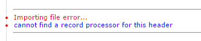
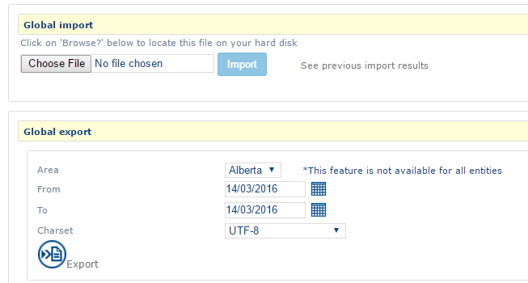
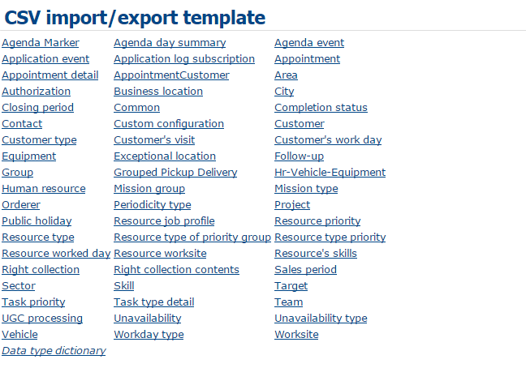
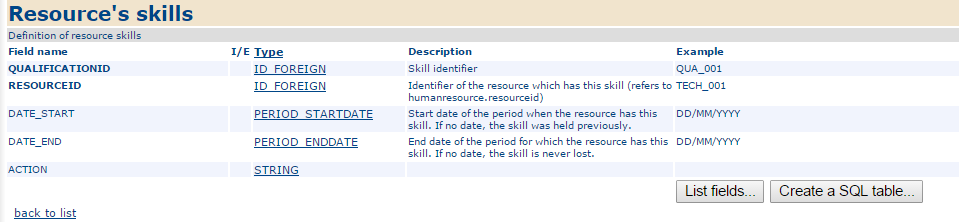
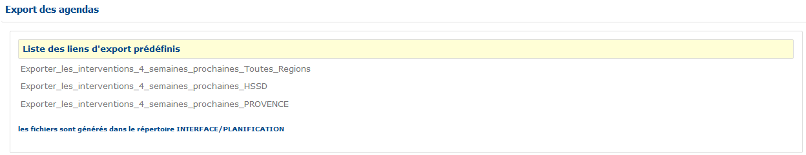
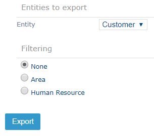
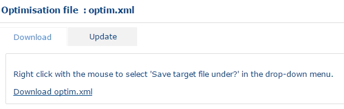
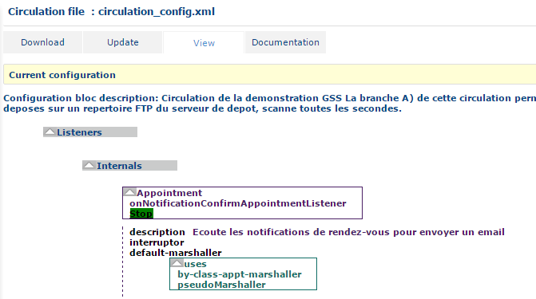

# CSV Files

The functions described in this section allow you to manage the data presented in this document in the form of CSV files.

For example, instead of entering the mobile resources for the company one by one, it is possible to import a single CSV file.

These functions also enable retrieval of a data set for the purpose of archiving it via export functions or to rapidly modify a large quantity of data by [exporting](https://mynomadia.com/privatedoc/9LLcWh7j74sENa54/optitime-doc/docs/en/otgs-reference-book/CSV.html#CSV-exporter) a CSV file, and then modifying the desired fields before [re-importing](https://mynomadia.com/privatedoc/9LLcWh7j74sENa54/optitime-doc/docs/en/otgs-reference-book/CSV.html#CSV-importer) them.

### Importing a CSV File

This function is available when you click on the Import CSV file link under the "[CSV files](https://mynomadia.com/privatedoc/9LLcWh7j74sENa54/optitime-doc/docs/en/otgs-reference-book/CSV.html)" item.

The interface is divided into three sections: one enabling definition of the import format (this format should correspond to the format of the file to import), one enabling selection of the file to import, and a Previous result button.

Interface

The information on the format to define are as follows:

* **Field separator**: this is the character separating the different columns (, ; \t : |)
* **Text delimiter**: this is the character delimiting a text zone (" ' or empty)
* **Separator of lists of values**: this is a character that separates the values in one list in a single column (, ; \t : |). This separator must be different from the fields separator
* **Dates format**: Formatting of date type data. By default, the dates are in the format dd/mm/yyyy (ex: 21/03/2016)
* [**Geocoding**](https://mynomadia.com/privatedoc/9LLcWh7j74sENa54/optitime-doc/docs/en/otgs-reference-book/_glossary.html#geocodage) **tolerance**: lowest geocoding quality accepted (for data including [address fields](https://mynomadia.com/privatedoc/9LLcWh7j74sENa54/optitime-doc/docs/en/otgs-reference-book/intro-geocodage.html)):
  * _On street number_: Data for which the address does not include any street number will not be imported
  * _Exclusively on street number_: Data for which the address does not include the street number will not be imported
  * _On streets_: Data where the address does not include the street name will not be imported
  * _Exclusively on streets_: Data for which the address does not include the street name will not be imported, and addresses that are more precise will be placed at the middle of the street
  * _On towns_: Data for which the address does not include the town name will not be imported
* Minimum geocoding score: Defines a minimum accepted geocoding quality. The geocoding score is complementary to the _Geocoding tolerance_.
* **Worksite used by default**
* **Charset of file encoding**: this is the encoding format for the file to import (_As Server System_ or _utf8_)
* **Importation mode**: This is the import mode used to import data into the file.
  * _Standard_: existing data will be modified and the new data added
  * _Insertions only_: existing data will not be modified
  * _UPDATE only_: new data will not be imported

Click on the Folder button to select the file to import, and then click on Update.

The file must include the expected columns corresponding to the [Import/export CSV template](https://mynomadia.com/privatedoc/9LLcWh7j74sENa54/optitime-doc/docs/en/otgs-reference-book/CSV.html).

If the file does not include the expected columns, the following error message displays:

Column errors

At the end of the import of the file, a report error is generated as well as a summary of the import.

They can be downloaded at the end of the import, on the same page, or by clicking on Previous result for the preceding imports.

|                                                                                                                                                                                                                       |     |
| --------------------------------------------------------------------------------------------------------------------------------------------------------------------------------------------------------------------- | --- |
| \[Tip]                                                                                                                                                                                                                | Tip |
| The number of days imported files are kept on record is defined in the application settings (the **delayBeforeDeleteReports** parameter located in application settings > Application > Import date > import.setting) |     |

### Exporting a CSV file

This function is available by clicking on the Export a CSV file link under the "[CSV files](https://mynomadia.com/privatedoc/9LLcWh7j74sENa54/optitime-doc/docs/en/otgs-reference-book/CSV.html)" item.

The export of the CSV file includes 3 parts: **Entities to export**, **CSV Formatting**, **Filtering**.

CSV export

#### Entities to export

This section allows you to select the fields to export.

The **Entity** drop-down list contains the different types of data it is possible to export (for example: Customer, Appt, Human resource).

When you select a type of data under **Entity**, the **Fields** list is updated with all the fields it is possible to export.

To select them, click on a field, and then on the > button or click on the >> button to select them all.

To deselect them, click on a field in the **Selected fields** section, and then on the > button, or click on << to de-select all.

#### CSV formatting

In this section, you can define the format of the exported file.

The following information items are present on the screen:

* **Field separator**: this is the character separating the different columns (, ; \t : |)
* **Text delimiter**: this is a character used to delimit a zone of text (" ' or empty)
* **Separator of lists of values**: this is a character that separates the values in one list in a single column (, ; \t : |). This separator must be different from the fields separator
* **Date format**: Formatting of date type data. By default, the dates are in the dd/mm/yyyy (ex: 21/03/2016) format
* **Time format**: Formatting time type data. By default, times are in the following format: hh:mm (eg: 01:15)
* **Format the duration as a time**
* **Charset**: Encoding format for the file to import (_As Server System_ or _utf8_)

#### Filtering

In this section, the data to export can be filtered.

The following information items are present on the screen:

* **Type of extraction**: Quantity of data to export, All (_ALL_) or the latest modified (_LASTUPDATED_)
* **Extraction parameter**: _Day_, _Week_, _Minute_ (only functions with _LASTUPDATED_ filter type)
* **Area**: area of affiliation for the entity

Once the fields are filled, click on the Export button to export the data.

### Global CSV import/export

This function allows export and import in one go of all the application data.

Global Import / Export

The first part (Global import) imports all elements from the repository.

Select a file of data on your computer and click on Import.

|                                                                                                                                                                                                                                      |     |
| ------------------------------------------------------------------------------------------------------------------------------------------------------------------------------------------------------------------------------------ | --- |
| \[Tip]                                                                                                                                                                                                                               | Tip |
| The file to import should be a .zip file containing .csv files to import (see the [importing a CSV file](https://mynomadia.com/privatedoc/9LLcWh7j74sENa54/optitime-doc/docs/en/otgs-reference-book/CSV.html#CSV-importer) chapter). |     |

The second part exports all the application data.

To configure the export:

* Choose the **area** to export
* Choose the **dates** of the elements to export
* Choose the character format.

The Export button runs the export. A .zip file will be generated containing all the application files.

### Import/export CSV template

This section comprises two parts:

* A summary page provides access to the different object templates;
* One section comprising the list of fields in the template.

Summary

The last summary link Dictionary of the data types returns to the [Type](https://mynomadia.com/privatedoc/9LLcWh7j74sENa54/optitime-doc/docs/en/otgs-reference-book/CSV.html#genre) section.

Click on a link in the summary to relocate to the corresponding object

Object field

Each field is described by the following information:

* **Fieldname**: Name of the field such as it is should appear in the imported files
* **I/E**: If the fields are available only on Import (_I_) or on export (_E_). If the field is not filled, the field is available both on import and on export.
* **Type**: type of data (ID, STRING, etc). Clicking on a type of data, the link returns at the end of the page to the [Dictionary of types of data](https://mynomadia.com/privatedoc/9LLcWh7j74sENa54/optitime-doc/docs/en/otgs-reference-book/CSV.html) section
* **Description**: description of the field
* **Example**
* **By default**: default value (if empty)

|                                                    |     |
| -------------------------------------------------- | --- |
| \[Tip]                                             | Tip |
| The fields in bold correspond to mandatory fields. |     |

The Type section comprises the following columns:

* **Type name**: Name in the application
* **Single type**: Standard name (in a DBMS)
* **Family**: Family name in the application
* **Super type**: Name of a type cluster in the application
* **SQL format** Another standard name (in a DBMS)
* **Description**: Description of the type

### Circulation listeners

Certain flow modules can be run from this interface.

They are defined inside the flow files, see the [Flow](https://mynomadia.com/privatedoc/9LLcWh7j74sENa54/optitime-doc/docs/en/otgs-reference-book/CSV.html) section.

Circulation listeners

To run the action, simply click on the http list. In some cases, the actions will require parameters, and in this case, simply fill in the **message to send** part and click on the Post message or Send params links.

### Predefined export links

The predefined export links are created in the [circulation](https://mynomadia.com/privatedoc/9LLcWh7j74sENa54/optitime-doc/docs/en/otgs-reference-book/CSV.html#XML-circulation).

A predefined export link serves to perform a predefined action. For example, to execute a script in a database, perform an import of data or a save operation on the database.

Interface

### Specific files

#### Export of TomTom POI

POints of Interest (POI) export function

In this page, the user selects the **entity** to export selected from the drop-down list.

If needed, you can filter the export on **Area** or on **Human resource** by selecting the corresponding radio-button and selecting the area or human resource required in the drop-down list that displays.

The Export button will create a file in .ov2 format.

#### Export of Masternaut POI

This page functions in an identical way to [points of interest export to TomTom](https://mynomadia.com/privatedoc/9LLcWh7j74sENa54/optitime-doc/docs/en/otgs-reference-book/CSV.html#fichiers-spec-tom-tom).

The Export button will create a file in .txt format.

#### Export of Garmin POI

This page functions in an identical way to [points of interest export to TomTom](https://mynomadia.com/privatedoc/9LLcWh7j74sENa54/optitime-doc/docs/en/otgs-reference-book/CSV.html#fichiers-spec-tom-tom).

The Export button will create a file in .gpx format.

#### Export of KML POI

This page functions in an identical way to [points of interest export to TomTom](https://mynomadia.com/privatedoc/9LLcWh7j74sENa54/optitime-doc/docs/en/otgs-reference-book/CSV.html#fichiers-spec-tom-tom).

The Export button will create a file in .kml format.

### Export to OT Strategic

Strategic file export function

In this page, the user filters their export, with a destination location of the smoothing module ([Strategic](https://mynomadia.com/privatedoc/9LLcWh7j74sENa54/optitime-doc/docs/en/otgs-reference-book/module-strategic.html)), on an **Area**, a **Unit** (time unit for the base display perimeter), a **Class** (organisational unit for the base display perimeter) and a **Period**.

The Export button will create a new simulation in the current database (see [Strategic module](https://mynomadia.com/privatedoc/9LLcWh7j74sENa54/optitime-doc/docs/en/otgs-reference-book/module-strategic.html)), as a .zip compressed archive of files in .csv format.

### XML files

A group of parameters and data are defined in a series of external XML files that can be modified locally by the administrator and which can then be sent at the level of the application server in order to be taken into account by the application.

|                                                                                                                                                |     |
| ---------------------------------------------------------------------------------------------------------------------------------------------- | --- |
| \[Tip]                                                                                                                                         | Tip |
| If you are not sure of the method to use for modifying one of the files described in this section, please contact the GEOCONCEPT support team. |     |

#### Basic principles

The functions suggested in the following chapters are: **Download** and **Update**.

Download The download function allows you to retrieve the configuration file located on the application server.

Downloading the XML file for the optimisation

Update Update allows you to update the configuration file located on the application server.

Updating the application with the new XML file

|                                                                                                                                                            |         |
| ---------------------------------------------------------------------------------------------------------------------------------------------------------- | ------- |
| \[Warning]                                                                                                                                                 | Warning |
| Certain parameters require you to restart the application for update to occur. Please contact your Opti-Time administrator to perform this kind of update. |         |

#### Optimisation file

This function is available when you click on the Optimisation file link under the "[XML files item](https://mynomadia.com/privatedoc/9LLcWh7j74sENa54/optitime-doc/docs/en/otgs-reference-book/CSV.html#XML)".

This file (called optim.xml) contains optimisation parameters that can be modified from the interface (Cf. [optimisation parameters](https://mynomadia.com/privatedoc/9LLcWh7j74sENa54/optitime-doc/docs/en/otgs-reference-book/optimisation.html#param-optim)).

You can download and update it ([Cf. Basic principles](https://mynomadia.com/privatedoc/9LLcWh7j74sENa54/optitime-doc/docs/en/otgs-reference-book/CSV.html#XML-principe)).

#### Flows file

This function is available when you click on the Flow file link under the "[XML files](https://mynomadia.com/privatedoc/9LLcWh7j74sENa54/optitime-doc/docs/en/otgs-reference-book/CSV.html#XML)" item.

This mode is reserved for administrators seeking to configure exchanges of XML files between Opti-Time and an external application. The Flow principle is explained in the relevant documentation.

In addition to download and update ([Cf. Basic principles](https://mynomadia.com/privatedoc/9LLcWh7j74sENa54/optitime-doc/docs/en/otgs-reference-book/CSV.html#XML-principe)), it is possible to view the file in schema form (**View** tab).

Flow schema

A link to the associated documentation is given in the **Documentation** tab.

Certain calculations include calls to functions via HTTP links available in the application, Cf. the section on [Circulation listeners](https://mynomadia.com/privatedoc/9LLcWh7j74sENa54/optitime-doc/docs/en/otgs-reference-book/CSV.html#listener).

#### XML customisation file

This function is available by clicking on the Customisation file link in the "[XML files](https://mynomadia.com/privatedoc/9LLcWh7j74sENa54/optitime-doc/docs/en/otgs-reference-book/CSV.html#XML)" item.

This mode is reserved for administrators wishing to customise the functioning of the application.

The file can be downloaded and updated via an import operation ([Cf. Basic principles](https://mynomadia.com/privatedoc/9LLcWh7j74sENa54/optitime-doc/docs/en/otgs-reference-book/CSV.html#XML-principe)).
