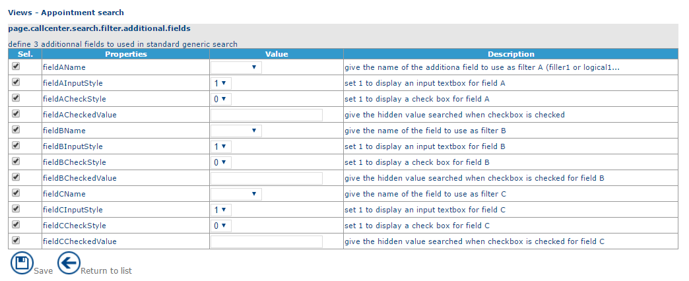
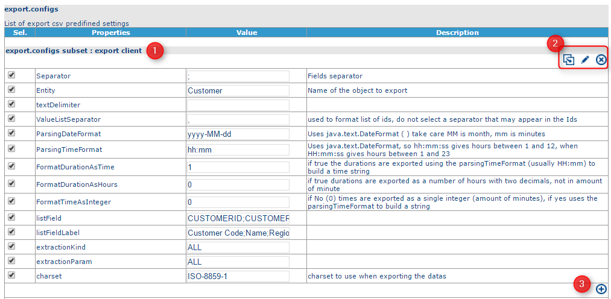
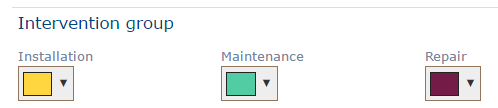
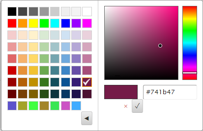

# Customization

Parameters are organised in groups of parameters distributed over 5 tabs:

* VIEWS: allows you to manage parameters relating to views.
* DISPLAY: allows you to manage parameters relating to display.
* OPTIMIZATION: allows you to manage parameters relating to the optimisation.
* APPLICATION: allows you to manage global application parameters such as the **Opti-Time Mobile** parameters.
* MY\_ACTIONS: allows handling of parameters relating to customized actions.
* OTHERS: allows you to manage other parameters.

The Save button saves the parameters in the database.

To modify a parameter, click on a line in the page of parameter groups to display the list of associated parameters:

List of settings

* The first column allows you to select a parameter to modify.
* The **Properties** column contains the name of the parameter.
* The **Value** column contains the value of the parameter that it will be possible to modify.
* The **Description** column contains a description in English of the behaviour of the parameter.

To modify a parameter, modify the **Value** field and click on Save.

**Configurable fields**

Some parameters can be customised.

For example: export parameters:

Export parameters

1. Name of the predefined export
2. Buttons to:
   * duplicate the predefined export
   * modify the name of a predefined export
   * delete the predefined export
3. Add a parameter

|                                                                                                                                                                                                                                           |     |
| ----------------------------------------------------------------------------------------------------------------------------------------------------------------------------------------------------------------------------------------- | --- |
| \[Tip]                                                                                                                                                                                                                                    | Tip |
| Parameters that are not selected (unchecked check-box in the first column) use the value defined in the [custom.xml](https://mynomadia.com/privatedoc/9LLcWh7j74sENa54/optitime-doc/docs/en/otgs-reference-book/CSV.html#XML-perso) file. |     |

|                                                                                                                                                |         |
| ---------------------------------------------------------------------------------------------------------------------------------------------- | ------- |
| \[Warning]                                                                                                                                     | Warning |
| These parameters influence the general behaviour of the application (imports, optimisations, interface, etc.) and should be handled with care. |         |

|                                                                                                                                                                                                                  |     |
| ---------------------------------------------------------------------------------------------------------------------------------------------------------------------------------------------------------------- | --- |
| \[Tip]                                                                                                                                                                                                           | Tip |
| In earlier versions of the application, these parameters were contained in the [custom.xml](https://mynomadia.com/privatedoc/9LLcWh7j74sENa54/optitime-doc/docs/en/otgs-reference-book/CSV.html#XML-perso) file. |     |

### Colors

This section allows you to define colours for items in the [planning](https://mynomadia.com/privatedoc/9LLcWh7j74sENa54/optitime-doc/docs/en/otgs-reference-book/call-center-agenda.html).

To modify a colour, click on the colour to modify and choose the desired colour either by selecting a colour, or by entering its HTML code in the right-hand section (to access this option, you need to click on the > button).

The Save button saves any modifications made.\
These colours will then be visible in the [planning](https://mynomadia.com/privatedoc/9LLcWh7j74sENa54/optitime-doc/docs/en/otgs-reference-book/call-center-agenda.html).

For example: intervention groups

Here, for example, the repair [intervention group](https://mynomadia.com/privatedoc/9LLcWh7j74sENa54/optitime-doc/docs/en/otgs-reference-book/donnees.html#groupe-intervention) will display in purple and the installation intervention group in yellow.

Choosing a colour

The **Colours** function comprises two links that allow you to modify the following information:

**Referential colors**

|                                                                                                                                                                                                             |     |
| ----------------------------------------------------------------------------------------------------------------------------------------------------------------------------------------------------------- | --- |
| \[Tip]                                                                                                                                                                                                      | Tip |
| The **Area** drop-down list serves to define the different colour palettes for each [area](https://mynomadia.com/privatedoc/9LLcWh7j74sENa54/optitime-doc/docs/en/otgs-reference-book/donnees.html#region). |     |

* Intervention groups
* [job types](https://mynomadia.com/privatedoc/9LLcWh7j74sENa54/optitime-doc/docs/en/otgs-reference-book/donnees.html#type-poste)
* [functions](https://mynomadia.com/privatedoc/9LLcWh7j74sENa54/optitime-doc/docs/en/otgs-reference-book/donnees.html#type-expertise)
* [unavailability types](https://mynomadia.com/privatedoc/9LLcWh7j74sENa54/optitime-doc/docs/en/otgs-reference-book/donnees.html#type-indispo)
* [day templates](https://mynomadia.com/privatedoc/9LLcWh7j74sENa54/optitime-doc/docs/en/otgs-reference-book/donnees.html#modele-jour)
* [week templates](https://mynomadia.com/privatedoc/9LLcWh7j74sENa54/optitime-doc/docs/en/otgs-reference-book/donnees.html#modele-semaine)
* [agenda markers](https://mynomadia.com/privatedoc/9LLcWh7j74sENa54/optitime-doc/docs/en/otgs-reference-book/call-center-objets.html#objets-jalons)
* [sectors](https://mynomadia.com/privatedoc/9LLcWh7j74sENa54/optitime-doc/docs/en/otgs-reference-book/donnees.html#secteur)
* [customer types](https://mynomadia.com/privatedoc/9LLcWh7j74sENa54/optitime-doc/docs/en/otgs-reference-book/call-center-objets.html#objets-types-client)
* [customer kinds](https://mynomadia.com/privatedoc/9LLcWh7j74sENa54/optitime-doc/docs/en/otgs-reference-book/call-center-objets.html#objets-nature-client)

**Application colors**

* The unavailability type (worked/non-worked)
* [appointment states](https://mynomadia.com/privatedoc/9LLcWh7j74sENa54/optitime-doc/docs/en/otgs-reference-book/_the_different_statuses_for_appointments_in_opti_time.html#statuts)
* The other elements in the planning (such as night away, lunch break, holidays, journey, etc)
* The colour of the [band](https://mynomadia.com/privatedoc/9LLcWh7j74sENa54/optitime-doc/docs/en/otgs-reference-book/bandeau.html)
