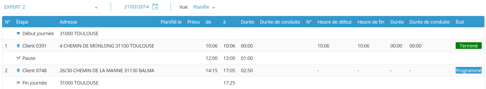

# Fullfilment

**NFS** Fulfilment module is only accessible if the [corresponding right](https://mynomadia.com/privatedoc/9LLcWh7j74sENa54/optitime-doc/docs/en/otgs-reference-book/utilisateurs.html#coll-droits) (Fulfilment tab > Perimeter > **FULFILMENT\_GUEST** right) is associated to the user profile.

This module permits tracking of the fulfilment of routes in real time thanks to uploads from the field sent by users of the **Opti-Time Mobile** mobile app who are on their rounds visiting customers.

#### Route page layout

The page is divided into two areas: the navigation bar at the top and the list of visits below it.

**Navigation bar**

The navigation bar is at the top of the page. Use it to display the route of one resource on a chosen date.

**List of visits**

The list below the navigation bar shows the visits to be completed on the selected route, along with information about how each visit is progressing. It includes the following columns:

* **Start time:** Shows the time at which the mobile app user confirmed the start of the visit using the **Begin** action.
* **End time:** Shows the time at which the mobile app user confirmed the end of the visit using the **Finish** action.
* **Status:** Shows the current status of the visit. The value depends on the actions the mobile app user has performed in the mobile app.
