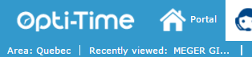
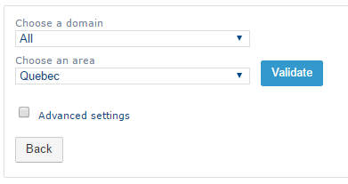
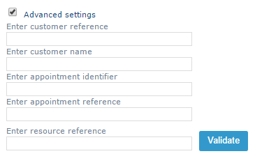

# Change the Area

To change the current area:

1. In the **header bar**, click the name of the current area.

2. In the **Choose an area** drop-down list, select the required area.

You can also use the list to **filter and quickly find an area**.

If you need to change the area to find an appointment located outside the current area:

1. Select the **Advanced settings** check box.
2. Search for the required area using a **reference or customer name**, **appointment**, or **resource reference**.
3. Select the relevant result to change the current area.

4. Click on the Validate button to display the chosen area.
