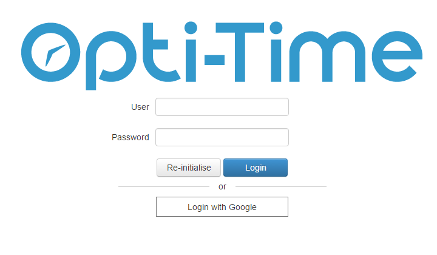
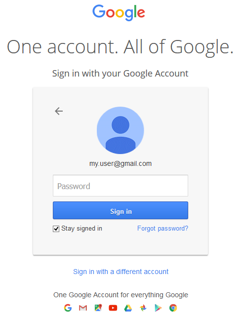
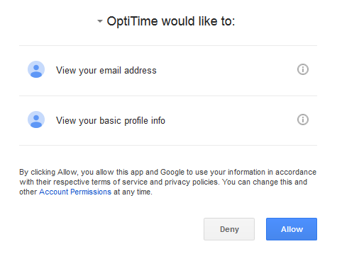
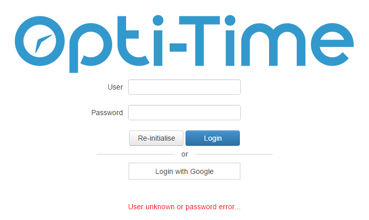

# Running the Application

**NFS** can be accessed through a web browser or the mobile application, depending on the deployment.

**Web Application**

To access NFS in **Web mode**:

1. Open a supported web browser.
2. Enter the NFS URL provided by your site administrator. The URL typically follows this format:\
   `http://server:port/application/`
3. Enter your login credentials when prompted.

**Mobile Application**

To access NFS through the **mobile application**

1. Open the NFS mobile application.
2. Enter the **login** and **password** associated with your user account.
3. Sign in to access the application.

**Access portal**

**Identification**

Once the identifier elements have been entered, the user [gains access to the application](https://mynomadia.com/privatedoc/9LLcWh7j74sENa54/optitime-doc/docs/en/otgs-reference-book/otgs-connexion.html#intro-access-appli).

**Authenticating through Single Sign-On (SSO)**

A sample authentication use-case

|                                                                                                    |         |
| -------------------------------------------------------------------------------------------------- | ------- |
| \[Warning]                                                                                         | Warning |
| Pre-requisites: enable SSO and its Google Apps provider only, in the application instance settings |         |

#### Sign in with Google

1. Open the **NFS application URL** in your web browser.
2. On the login page, click **Login with Google**.
3. You are redirected to the **Google sign-in page** to authenticate using your Google account.
4. Enter your Google account credentials and complete the authentication process.
5. After successful authentication, you are redirected to the **NFS application**.

* Enter your **Google Workspace or Gmail account credentials** and submit the form. If the credentials are valid, you are authenticated and redirected back to the **NFS application**.

* If no NFS user account is associated with your Google account email address, access to the application is denied.

* If an NFS user account is associated with your Google account email address, NFS grants access using the corresponding user account.

**Signing into the application**

Once authenticated, the user is therefore redirected, as a function of the profile, to one of the following modules: [the portal](https://mynomadia.com/privatedoc/9LLcWh7j74sENa54/optitime-doc/docs/en/otgs-reference-book/module-portail.html), [the planning module](https://mynomadia.com/privatedoc/9LLcWh7j74sENa54/optitime-doc/docs/en/otgs-reference-book/module-planification.html), [the supervision module](https://mynomadia.com/privatedoc/9LLcWh7j74sENa54/optitime-doc/docs/en/otgs-reference-book/module-supervision.html), [the attendance module](https://mynomadia.com/privatedoc/9LLcWh7j74sENa54/optitime-doc/docs/en/otgs-reference-book/module-dispo.html), [the strategic module](https://mynomadia.com/privatedoc/9LLcWh7j74sENa54/optitime-doc/docs/en/otgs-reference-book/module-strategic.html) or [the administration module](https://mynomadia.com/privatedoc/9LLcWh7j74sENa54/optitime-doc/docs/en/otgs-reference-book/module-administration.html).

|                                                                                                                                                                                                                                                                         |      |
| ----------------------------------------------------------------------------------------------------------------------------------------------------------------------------------------------------------------------------------------------------------------------- | ---- |
| \[Note]                                                                                                                                                                                                                                                                 | Note |
| See also: - EXPLOITATION > Configuring SSO access in Opti-Time - REFERENCE GUIDE > Administration > Company data > Human resources > [User tab](https://mynomadia.com/privatedoc/9LLcWh7j74sENa54/optitime-doc/docs/en/otgs-reference-book/donnees.html#RH-utilisateur) |      |
