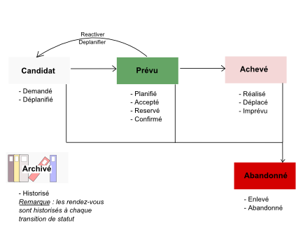
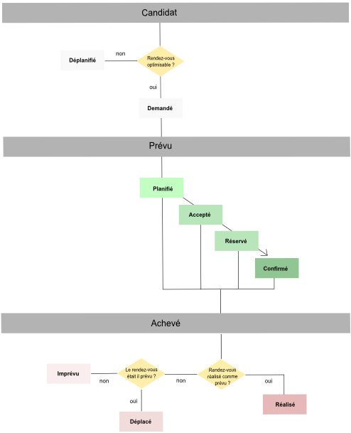

# The different statuses for appointments in Opti-time

Opti-Time Reference Guide

## Opti-Time Reference Guide Introduction

|                                                                                                                                                                  |                                                                                                                        |
| ---------------------------------------------------------------------------------------------------------------------------------------------------------------- | ---------------------------------------------------------------------------------------------------------------------- |
| [Sidebar](https://mynomadia.com/privatedoc/9LLcWh7j74sENa54/optitime-doc/docs/en/otgs-reference-book/_the_different_statuses_for_appointments_in_opti_time.html) | [Prev](https://mynomadia.com/privatedoc/9LLcWh7j74sENa54/optitime-doc/docs/en/otgs-reference-book/otgs-connexion.html) |

## The different statuses for appointments in Opti-time

An appointment is a planned meeting between a resource in the field and their customer. In **Opti-Time** the appointment has a status that indicates the changing status of an appointment over time. The status allows the user and the application to distinguish one appointment from another, and to fine tune the behaviour within the application of the appointment accordingly.

So for example, an appointment that has been confirmed on the telephone between a customer and a planner has a strong level of commitment for the enterprise that prevents anyone from moving the appointment in the schedule. To signal this commitment, the user can **confirm** the appointment. The appointment will then be in the planning, and the assigned resource, date, time and so on **can no longer be changed**.

### Status macros

To improve identification, search and counting of appointments, the statuses have been grouped into five categories, or **status macros**:

1. **Candidate**: the appointments are not in the planning but are in a holding group awaiting integration in the planning;
2. **Planned**: the appointment is in the planning and waiting to be fulfilled;
3. **Fulfilled**: the appointment has been performed or not in accordance with the planning;
4. **Cancelled**: the appointment is deleted from the planning;
5. **Archived**: the appointment information items are journalised following a change of status.

Appointments can change from one status to another or from one status macro to another according to certain rules.

* **Candidate** appointments become **planned** and then **fulfilled** when the visit has taken place;
* An appointment that has been **planned** can be _re-activated_ or _unplanned_ and can become a **candidate** once again;
* An appointment can be **cancelled** from any status macro;
* Finally, after each change to status is made, a trace of the old and new statuses is stored under **archived** appointments.

Possible transitions between status macros

### Statuses

The names, codes and behaviours of statuses are stored in the tables below. Each table corresponds to a status macro.

Candidate appointments

|            |          |                                                                                                                                                                                                     |
| ---------- | -------- | --------------------------------------------------------------------------------------------------------------------------------------------------------------------------------------------------- |
| **Status** | **Code** | **Description**                                                                                                                                                                                     |
| Requested  | 21       | The appointment is not in the planning, and the resource, the date and time are not fixed.                                                                                                          |
| Suspended  | 6        | The appointment has been taken out of the planning and cannot be optimised automatically. It is awaiting application of some kind of action (re-activation, planning, or cancellation) by the user. |

Planned appointments

|            |          |                                                                                                              |
| ---------- | -------- | ------------------------------------------------------------------------------------------------------------ |
| **Status** | **Code** | **Description**                                                                                              |
| Planned    | 2        | The appointment is in the planning, the resource, the date and the time may change.                          |
| Accepted   | 28       | The appointment is in the planning, the date and the time may change, but the resource **CANNOT** change     |
| Reserved   | 30       | The appointment is in the planning, the resource may change, however the date and the time **CANNOT** change |
| Confirmed  | 31       | The appointment is in the planning, the resource, the date and the time **CANNOT BE CHANGED**.               |

Fulfilled appointments

|            |          |                                                                                                                   |
| ---------- | -------- | ----------------------------------------------------------------------------------------------------------------- |
| **Status** | **Code** | **Description**                                                                                                   |
| Realized   | 3        | The appointment has been made and declared as fulfilled in conformity with the event planned                      |
| Shifted    | 33       | The appointment has been made and declared as fulfilled, but not in conformity with events as planned             |
| Happened   | 35       | The appointment has been made and declared as fulfilled, but it was not planned (planned, reserved, or confirmed) |

Cancelled appointments

|            |          |                                                                          |
| ---------- | -------- | ------------------------------------------------------------------------ |
| **Status** | **Code** | **Description**                                                          |
| Removed    | 12       | The appointment has been cancelled even though it is still in a planning |
| Abandonned | 10       | The appointment has been cancelled even though it is still a candidate   |

Appointments set aside

|              |          |                                                                                            |
| ------------ | -------- | ------------------------------------------------------------------------------------------ |
| **Status**   | **Code** | **Description**                                                                            |
| Ignored      | 9        | The appointment is no longer part of the application up until a point where it is restored |
| Externalized | 32       | The appointment has been fulfilled by a subcontractor                                      |

Appointments that have been archived

|            |          |                                                                                         |
| ---------- | -------- | --------------------------------------------------------------------------------------- |
| **Status** | **Code** | **Description**                                                                         |
| Historized | 40       | These appointments are not treated. They are stored in journal form in the application. |

### Progression steps

When an appointment is taken on board by a resource, a second status serves to track its progress. This is the _`PROGRESSIONSTEP`_ field in the [CSV exchange template](https://mynomadia.com/privatedoc/9LLcWh7j74sENa54/optitime-doc/docs/en/otgs-reference-book/CSV.html#CSV-modele). The names, codes and behaviours of statuses are described in the table below.

|                 |          |                                                                                                                                                                    |
| --------------- | -------- | ------------------------------------------------------------------------------------------------------------------------------------------------------------------ |
| **Status**      | **Code** | **Description**                                                                                                                                                    |
| In preparation  | -10      | The appointment is saved, but not in Opti-Time - possible associated statuses: 21                                                                                  |
| Scheduling      | 0        | Default value. The appointment is saved in Opti-Time - possible associated statuses: 21, 2, 6, 29, 30, 31                                                          |
| Back scheduling | 2        | The appointment has not been fulfilled as planned, and has been reactivated                                                                                        |
| Merged          | 3        | The appointment is cancelled, because it has been merged with another appointment - possible associated statuses: 21                                               |
| Supported       | 5        | The appointment has been accepted by the mobile resource - possible associated statuses: 21, 2                                                                     |
| Ongoing         | 10       | The appointment is under way, the resource has confirmed they are in the process of fulfilling the mission - possible associated statuses: 2, 2, 30, 31, 3, 33, 35 |
| Partially done  | 15       | The appointment is partially completed - possible associated statuses: 3, 33, 35, 10, 12                                                                           |
| Completed       | 20       | The appointment has been completed - possible associated statuses: 3, 33, 35, 10, 12                                                                               |
| Closed          | 100      | The appointment is closed (administratively, legally, financially) - possible associated statuses: 3, 33, 35, 10, 12                                               |

### Fulfilment statuses

Fulfilment statuses follow uploading of the relevant fulfilment data from the Opti-Time Mobile app, via a web service, CSV or SQL. This will consist of the _`ACHIEVEMENT_STATUS`_ and _`ACHIEVEMENT_RESOURCES`_ fields of the [CSV exchange model](https://mynomadia.com/privatedoc/9LLcWh7j74sENa54/optitime-doc/docs/en/otgs-reference-book/CSV.html#CSV-modele). The names, codes and behaviours of the statuses are given in the table below.

|                                                        |          |                                                                                   |
| ------------------------------------------------------ | -------- | --------------------------------------------------------------------------------- |
| **Status**                                             | **Code** | **Description**                                                                   |
| None                                                   | 0        | No status                                                                         |
| Started (STATUS\_STARTED)                              | 1        | Fulfilment has commenced                                                          |
| Interrupted-On hold (STATUS\_STOPPED)                  | 2        | Fulfilment has stopped or been interrupted (put on hold)                          |
| Restarted (STATUS\_RESUMED)                            | 3        | Fulfilment has resumed (following a pause/interruption)                           |
| Terminated (STATUS\_TERMINATED)                        | 4        | Fulfilment completed                                                              |
| Journey started (STATUS\_TRIP\_STARTED)                | 5        | The journey to the fulfilment location has started                                |
| Journey completed (STATUS\_TRIP\_TERMINATED)           | 6        | The journey to the fulfilment location has terminated                             |
| Journey interrupted or on hold (STATUS\_TRIP\_STOPPED) | 7        | The journey to the fulfilment location is interrupted (put on hold)               |
| Journey resumed (STATUS\_TRIP\_RESUMED)                | 8        | The journey to the fulfilment location has resumed (following interruption/pause) |
| Unsuccessful (STATUS\_UNSUCCESSFUL)                    | 9        | Fulfilment was unsuccessful                                                       |
| Unsuccessful journey (STATUS\_TRIP\_UNSUCCCESSFUL)     | 10       | The journey to the fulfilment location has been unsuccessful                      |

### Notification statuses

Notification statuses are linked to the cycle of the send/receive and then accept/reject data for the appointment, as handled by the **Opti-Time Mobile** mobile app.

|            |          |                                                        |
| ---------- | -------- | ------------------------------------------------------ |
| **Status** | **Code** | **Description**                                        |
| Not sent   | 0        | Appointment has not been sent to the resource’s device |
| Sent       | 1        | The appointment has been sent to the resource          |
| Received   | 2        | The appointment has been received by the resource      |
| Accepted   | 3        | The appointment has been accepted by the resource      |
| Rejected   | 4        | The appointment has been rejected by the resource      |

### Life cycle of an appointment

In **Opti-Time** the appointment is subject to a series of status changes. The latter are triggered when a planning is optimised, by a manual planning event, or when a planning is updated though the import of data.

The appointment follows a life cycle that is subject to rules dictated by the sequence of statuses assigned to the appointment. Depending on the way situations develop, the appointment can evolve in different ways. The schema below shows the generic life-cycle of an appointment.

|                                                                                                                                                                                                                                                                                                                                                                                                                                             |         |
| ------------------------------------------------------------------------------------------------------------------------------------------------------------------------------------------------------------------------------------------------------------------------------------------------------------------------------------------------------------------------------------------------------------------------------------------- | ------- |
| \[Warning]                                                                                                                                                                                                                                                                                                                                                                                                                                  | Warning |
| The **removed** and **cancelled** statuses do not feature in the logigram below. The user must be aware that an appointment, whatever its status, can be **cancelled** at any stage in its life cycle. Finally, note that an appointment does not always follow the same linear cycle. A planned appointment, for example, can be **unplanned** or **re-activated** and find itself back in the status macro of **candidate** appointments. |         |

Life cycle of an appointment

***

|                                                                                                                        |                                                                                                                     |                                                                                                                         |
| ---------------------------------------------------------------------------------------------------------------------- | ------------------------------------------------------------------------------------------------------------------- | ----------------------------------------------------------------------------------------------------------------------- |
| [Prev](https://mynomadia.com/privatedoc/9LLcWh7j74sENa54/optitime-doc/docs/en/otgs-reference-book/otgs-connexion.html) | [Up](https://mynomadia.com/privatedoc/9LLcWh7j74sENa54/optitime-doc/docs/en/otgs-reference-book/_introduction.html) | [Next](https://mynomadia.com/privatedoc/9LLcWh7j74sENa54/optitime-doc/docs/en/otgs-reference-book/intro-geocodage.html) |
|                                                                                                                        | [Home](https://mynomadia.com/privatedoc/9LLcWh7j74sENa54/optitime-doc/docs/en/otgs-reference-book/index.html)       |                                                                                                                         |

* [Contents](https://mynomadia.com/privatedoc/9LLcWh7j74sENa54/optitime-doc/docs/en/otgs-reference-book/_the_different_statuses_for_appointments_in_opti_time.html#treeDiv)
* [Search](https://mynomadia.com/privatedoc/9LLcWh7j74sENa54/optitime-doc/docs/en/otgs-reference-book/_the_different_statuses_for_appointments_in_opti_time.html#searchDiv)

* [Introduction](https://mynomadia.com/privatedoc/9LLcWh7j74sENa54/optitime-doc/docs/en/otgs-reference-book/_introduction.html)
  * [Defining terms](https://mynomadia.com/privatedoc/9LLcWh7j74sENa54/optitime-doc/docs/en/otgs-reference-book/_defining_terms.html)
  * [Presentation of the Reference Guide](https://mynomadia.com/privatedoc/9LLcWh7j74sENa54/optitime-doc/docs/en/otgs-reference-book/_presentation_of_the_reference_guide.html)
  * [Running the application](https://mynomadia.com/privatedoc/9LLcWh7j74sENa54/optitime-doc/docs/en/otgs-reference-book/otgs-connexion.html)
  * [The different statuses for appointments in Opti-time](https://mynomadia.com/privatedoc/9LLcWh7j74sENa54/optitime-doc/docs/en/otgs-reference-book/_the_different_statuses_for_appointments_in_opti_time.html)
    * [Status macros](https://mynomadia.com/privatedoc/9LLcWh7j74sENa54/optitime-doc/docs/en/otgs-reference-book/_the_different_statuses_for_appointments_in_opti_time.html#_status_macros)
    * [Statuses](https://mynomadia.com/privatedoc/9LLcWh7j74sENa54/optitime-doc/docs/en/otgs-reference-book/_the_different_statuses_for_appointments_in_opti_time.html#statuts)
    * [Progression steps](https://mynomadia.com/privatedoc/9LLcWh7j74sENa54/optitime-doc/docs/en/otgs-reference-book/_the_different_statuses_for_appointments_in_opti_time.html#etats-avancement)
    * [Fulfilment statuses](https://mynomadia.com/privatedoc/9LLcWh7j74sENa54/optitime-doc/docs/en/otgs-reference-book/_the_different_statuses_for_appointments_in_opti_time.html#etats-realisation)
    * [Notification statuses](https://mynomadia.com/privatedoc/9LLcWh7j74sENa54/optitime-doc/docs/en/otgs-reference-book/_the_different_statuses_for_appointments_in_opti_time.html#etats-notification)
    * [Life cycle of an appointment](https://mynomadia.com/privatedoc/9LLcWh7j74sENa54/optitime-doc/docs/en/otgs-reference-book/_the_different_statuses_for_appointments_in_opti_time.html#cycle-rdv)
  * [The geocoding](https://mynomadia.com/privatedoc/9LLcWh7j74sENa54/optitime-doc/docs/en/otgs-reference-book/intro-geocodage.html)
* [Guided Help](https://mynomadia.com/privatedoc/9LLcWh7j74sENa54/optitime-doc/docs/en/otgs-reference-book/WM.html)
* [The header bar](https://mynomadia.com/privatedoc/9LLcWh7j74sENa54/optitime-doc/docs/en/otgs-reference-book/bandeau.html)
  * [Change area](https://mynomadia.com/privatedoc/9LLcWh7j74sENa54/optitime-doc/docs/en/otgs-reference-book/bandeau-changer-region.html)
  * [Change the password](https://mynomadia.com/privatedoc/9LLcWh7j74sENa54/optitime-doc/docs/en/otgs-reference-book/bandeau-changer-mdp.html)
  * [Disconnection](https://mynomadia.com/privatedoc/9LLcWh7j74sENa54/optitime-doc/docs/en/otgs-reference-book/deco.html)
* [Portal](https://mynomadia.com/privatedoc/9LLcWh7j74sENa54/optitime-doc/docs/en/otgs-reference-book/module-portail.html)
  * [Home page](https://mynomadia.com/privatedoc/9LLcWh7j74sENa54/optitime-doc/docs/en/otgs-reference-book/_home_page.html)
  * [Planning](https://mynomadia.com/privatedoc/9LLcWh7j74sENa54/optitime-doc/docs/en/otgs-reference-book/portail-planning.html)
  * [Appointment form](https://mynomadia.com/privatedoc/9LLcWh7j74sENa54/optitime-doc/docs/en/otgs-reference-book/rendezvous.html)
  * [Tasks to be performed](https://mynomadia.com/privatedoc/9LLcWh7j74sENa54/optitime-doc/docs/en/otgs-reference-book/Tacheafaire.html)
    * [Visit reports pending](https://mynomadia.com/privatedoc/9LLcWh7j74sENa54/optitime-doc/docs/en/otgs-reference-book/Tacheafaire.html#tacheafaire1)
    * [Appointments to reschedule](https://mynomadia.com/privatedoc/9LLcWh7j74sENa54/optitime-doc/docs/en/otgs-reference-book/Tacheafaire.html#rdv-a-replanifier)
  * [Team alerts](https://mynomadia.com/privatedoc/9LLcWh7j74sENa54/optitime-doc/docs/en/otgs-reference-book/alert-equip.html)
  * [Week](https://mynomadia.com/privatedoc/9LLcWh7j74sENa54/optitime-doc/docs/en/otgs-reference-book/portail-semaine.html)
  * [Month](https://mynomadia.com/privatedoc/9LLcWh7j74sENa54/optitime-doc/docs/en/otgs-reference-book/portail-mois.html)
  * [Team schedule](https://mynomadia.com/privatedoc/9LLcWh7j74sENa54/optitime-doc/docs/en/otgs-reference-book/portail-plan-equipe.html)
  * [Area schedule](https://mynomadia.com/privatedoc/9LLcWh7j74sENa54/optitime-doc/docs/en/otgs-reference-book/portail-plan-reg.html)
  * [Worksite schedule](https://mynomadia.com/privatedoc/9LLcWh7j74sENa54/optitime-doc/docs/en/otgs-reference-book/portail-site-trav.html)
  * [Multi-Resource schedule](https://mynomadia.com/privatedoc/9LLcWh7j74sENa54/optitime-doc/docs/en/otgs-reference-book/portail-multi-res.html)
  * [Unavailabilities](https://mynomadia.com/privatedoc/9LLcWh7j74sENa54/optitime-doc/docs/en/otgs-reference-book/indisponibilite.html)
    * [One-off unavailabilities](https://mynomadia.com/privatedoc/9LLcWh7j74sENa54/optitime-doc/docs/en/otgs-reference-book/indisponibilite.html#_one_off_unavailabilities)
    * [Regular unavailabilities](https://mynomadia.com/privatedoc/9LLcWh7j74sENa54/optitime-doc/docs/en/otgs-reference-book/indisponibilite.html#_regular_unavailabilities)
    * [Handling unavailabilities](https://mynomadia.com/privatedoc/9LLcWh7j74sENa54/optitime-doc/docs/en/otgs-reference-book/indisponibilite.html#_handling_unavailabilities)
      * [Adding an unavailability](https://mynomadia.com/privatedoc/9LLcWh7j74sENa54/optitime-doc/docs/en/otgs-reference-book/indisponibilite.html#_adding_an_unavailability)
      * [Adding a multi-resource unavailability](https://mynomadia.com/privatedoc/9LLcWh7j74sENa54/optitime-doc/docs/en/otgs-reference-book/indisponibilite.html#indisponibilitesmultiressource)
      * [Unavailability form](https://mynomadia.com/privatedoc/9LLcWh7j74sENa54/optitime-doc/docs/en/otgs-reference-book/indisponibilite.html#_unavailability_form)
      * [Unplanning or reassigning appointments](https://mynomadia.com/privatedoc/9LLcWh7j74sENa54/optitime-doc/docs/en/otgs-reference-book/indisponibilite.html#_unplanning_or_reassigning_appointments)
  * [Visit reports](https://mynomadia.com/privatedoc/9LLcWh7j74sENa54/optitime-doc/docs/en/otgs-reference-book/compterendus.html)
  * [Roadbook](https://mynomadia.com/privatedoc/9LLcWh7j74sENa54/optitime-doc/docs/en/otgs-reference-book/portail-feuille-de-route.html)
  * [Global optimization](https://mynomadia.com/privatedoc/9LLcWh7j74sENa54/optitime-doc/docs/en/otgs-reference-book/portail-optim-glob.html)
    * [Export tab](https://mynomadia.com/privatedoc/9LLcWh7j74sENa54/optitime-doc/docs/en/otgs-reference-book/portail-optim-glob.html#_export_tab)
    * [Import tab](https://mynomadia.com/privatedoc/9LLcWh7j74sENa54/optitime-doc/docs/en/otgs-reference-book/portail-optim-glob.html#_import_tab)
    * [Automatic tab](https://mynomadia.com/privatedoc/9LLcWh7j74sENa54/optitime-doc/docs/en/otgs-reference-book/portail-optim-glob.html#_automatic_tab)
    * [Journal tab](https://mynomadia.com/privatedoc/9LLcWh7j74sENa54/optitime-doc/docs/en/otgs-reference-book/portail-optim-glob.html#_journal_tab)
  * [Legend](https://mynomadia.com/privatedoc/9LLcWh7j74sENa54/optitime-doc/docs/en/otgs-reference-book/portail-legende.html)
  * [Opti-Time Mobile Application](https://mynomadia.com/privatedoc/9LLcWh7j74sENa54/optitime-doc/docs/en/otgs-reference-book/portail-otm.html)
* [Planning](https://mynomadia.com/privatedoc/9LLcWh7j74sENa54/optitime-doc/docs/en/otgs-reference-book/module-planification.html)
  * [Objects in the Planning module](https://mynomadia.com/privatedoc/9LLcWh7j74sENa54/optitime-doc/docs/en/otgs-reference-book/call-center-objets.html)
    * [Forms](https://mynomadia.com/privatedoc/9LLcWh7j74sENa54/optitime-doc/docs/en/otgs-reference-book/call-center-objets.html#call-center-fiche-gral)
    * [Customer types](https://mynomadia.com/privatedoc/9LLcWh7j74sENa54/optitime-doc/docs/en/otgs-reference-book/call-center-objets.html#objets-types-client)
      * [Customer type form](https://mynomadia.com/privatedoc/9LLcWh7j74sENa54/optitime-doc/docs/en/otgs-reference-book/call-center-objets.html#type-client-fiche)
    * [Customer kinds](https://mynomadia.com/privatedoc/9LLcWh7j74sENa54/optitime-doc/docs/en/otgs-reference-book/call-center-objets.html#objets-nature-client)
      * [Customer kind form](https://mynomadia.com/privatedoc/9LLcWh7j74sENa54/optitime-doc/docs/en/otgs-reference-book/call-center-objets.html#nature-client-fiche)
    * [Customers](https://mynomadia.com/privatedoc/9LLcWh7j74sENa54/optitime-doc/docs/en/otgs-reference-book/call-center-objets.html#objets-clients)
      * [Customer form](https://mynomadia.com/privatedoc/9LLcWh7j74sENa54/optitime-doc/docs/en/otgs-reference-book/call-center-objets.html#fiche-client)
    * [Orderers](https://mynomadia.com/privatedoc/9LLcWh7j74sENa54/optitime-doc/docs/en/otgs-reference-book/call-center-objets.html#commanditaire)
      * [Orderer form](https://mynomadia.com/privatedoc/9LLcWh7j74sENa54/optitime-doc/docs/en/otgs-reference-book/call-center-objets.html#fiche-commanditaire)
    * [Appointments](https://mynomadia.com/privatedoc/9LLcWh7j74sENa54/optitime-doc/docs/en/otgs-reference-book/call-center-objets.html#objets-rdv)
      * [Appointment form](https://mynomadia.com/privatedoc/9LLcWh7j74sENa54/optitime-doc/docs/en/otgs-reference-book/call-center-objets.html#fiche-rdv)
    * [Steps in the scheduling process](https://mynomadia.com/privatedoc/9LLcWh7j74sENa54/optitime-doc/docs/en/otgs-reference-book/call-center-objets.html#_steps_in_the_scheduling_process)
      * [Qualification of the appointment](https://mynomadia.com/privatedoc/9LLcWh7j74sENa54/optitime-doc/docs/en/otgs-reference-book/call-center-objets.html#creation-rdv-demande)
      * [Appointment request](https://mynomadia.com/privatedoc/9LLcWh7j74sENa54/optitime-doc/docs/en/otgs-reference-book/call-center-objets.html#demande-rdv)
      * [Optimised appointment (real time)](https://mynomadia.com/privatedoc/9LLcWh7j74sENa54/optitime-doc/docs/en/otgs-reference-book/call-center-objets.html#planification-optimisee-rdv)
      * [Manual appointment](https://mynomadia.com/privatedoc/9LLcWh7j74sENa54/optitime-doc/docs/en/otgs-reference-book/call-center-objets.html#planification-manuelle-rdv)
    * [Setting up liaisons between appointments](https://mynomadia.com/privatedoc/9LLcWh7j74sENa54/optitime-doc/docs/en/otgs-reference-book/call-center-objets.html#contrainte-chainage)
      * [Types of liaison (chaining constraints)](https://mynomadia.com/privatedoc/9LLcWh7j74sENa54/optitime-doc/docs/en/otgs-reference-book/call-center-objets.html#Type-liaison)
      * [Linking two appointments in the interface](https://mynomadia.com/privatedoc/9LLcWh7j74sENa54/optitime-doc/docs/en/otgs-reference-book/call-center-objets.html#liaison-GUI)
    * [Unavailabilities](https://mynomadia.com/privatedoc/9LLcWh7j74sENa54/optitime-doc/docs/en/otgs-reference-book/call-center-objets.html#centre-d-appel-indisponibilite)
      * [Unavailability form](https://mynomadia.com/privatedoc/9LLcWh7j74sENa54/optitime-doc/docs/en/otgs-reference-book/call-center-objets.html#fiche-indispo)
      * [Repeated unavailability form](https://mynomadia.com/privatedoc/9LLcWh7j74sENa54/optitime-doc/docs/en/otgs-reference-book/call-center-objets.html#fiche-reduite-indispo)
    * [Exceptional locations](https://mynomadia.com/privatedoc/9LLcWh7j74sENa54/optitime-doc/docs/en/otgs-reference-book/call-center-objets.html#localisations-exceptionnelles)
      * [Exceptional location form](https://mynomadia.com/privatedoc/9LLcWh7j74sENa54/optitime-doc/docs/en/otgs-reference-book/call-center-objets.html#fiche-loc-exceptionnelle)
    * [Temporary posts](https://mynomadia.com/privatedoc/9LLcWh7j74sENa54/optitime-doc/docs/en/otgs-reference-book/call-center-objets.html#objets-postes-temp)
      * [Temporary post form](https://mynomadia.com/privatedoc/9LLcWh7j74sENa54/optitime-doc/docs/en/otgs-reference-book/call-center-objets.html#fiche-poste-temporaire)
    * [Secondary worksites](https://mynomadia.com/privatedoc/9LLcWh7j74sENa54/optitime-doc/docs/en/otgs-reference-book/call-center-objets.html#objets-sites-second)
      * [Secondary worksite form](https://mynomadia.com/privatedoc/9LLcWh7j74sENa54/optitime-doc/docs/en/otgs-reference-book/call-center-objets.html#fiche-site-second)
    * [Hotel locations](https://mynomadia.com/privatedoc/9LLcWh7j74sENa54/optitime-doc/docs/en/otgs-reference-book/call-center-objets.html#objets-hotel)
      * [Hotel location form](https://mynomadia.com/privatedoc/9LLcWh7j74sENa54/optitime-doc/docs/en/otgs-reference-book/call-center-objets.html#fiche-hotel)
    * [Agenda markers](https://mynomadia.com/privatedoc/9LLcWh7j74sENa54/optitime-doc/docs/en/otgs-reference-book/call-center-objets.html#objets-jalons)
      * [Agenda marker form](https://mynomadia.com/privatedoc/9LLcWh7j74sENa54/optitime-doc/docs/en/otgs-reference-book/call-center-objets.html#fiche-jalon)
    * [On-call duty](https://mynomadia.com/privatedoc/9LLcWh7j74sENa54/optitime-doc/docs/en/otgs-reference-book/call-center-objets.html#objets-astreinte)
      * [On-call duty form](https://mynomadia.com/privatedoc/9LLcWh7j74sENa54/optitime-doc/docs/en/otgs-reference-book/call-center-objets.html#fiche-astreinte)
    * [Locked days in the agenda](https://mynomadia.com/privatedoc/9LLcWh7j74sENa54/optitime-doc/docs/en/otgs-reference-book/call-center-objets.html#objets-journees-verr)
      * [Locked day in the agenda](https://mynomadia.com/privatedoc/9LLcWh7j74sENa54/optitime-doc/docs/en/otgs-reference-book/call-center-objets.html#fiche-journee-verrouillee)
    * [Search in the Planning module](https://mynomadia.com/privatedoc/9LLcWh7j74sENa54/optitime-doc/docs/en/otgs-reference-book/call-center-objets.html#call-center-recherche)
      * [Search filters](https://mynomadia.com/privatedoc/9LLcWh7j74sENa54/optitime-doc/docs/en/otgs-reference-book/call-center-objets.html#recherche-generique-filtre)
      * [Search result](https://mynomadia.com/privatedoc/9LLcWh7j74sENa54/optitime-doc/docs/en/otgs-reference-book/call-center-objets.html#call-center-resultat)
    * [Create an object in the Planning module](https://mynomadia.com/privatedoc/9LLcWh7j74sENa54/optitime-doc/docs/en/otgs-reference-book/call-center-objets.html#call-center-creer)
    * [Delete an object in the Planning module](https://mynomadia.com/privatedoc/9LLcWh7j74sENa54/optitime-doc/docs/en/otgs-reference-book/call-center-objets.html#call-center-supprimer)
  * [The header bar](https://mynomadia.com/privatedoc/9LLcWh7j74sENa54/optitime-doc/docs/en/otgs-reference-book/_the_header_bar.html)
    * [Favourites for the area](https://mynomadia.com/privatedoc/9LLcWh7j74sENa54/optitime-doc/docs/en/otgs-reference-book/_the_header_bar.html#_favourites_for_the_area)
    * [Recent appointments](https://mynomadia.com/privatedoc/9LLcWh7j74sENa54/optitime-doc/docs/en/otgs-reference-book/_the_header_bar.html#_recent_appointments)
    * [List of urgent appointments](https://mynomadia.com/privatedoc/9LLcWh7j74sENa54/optitime-doc/docs/en/otgs-reference-book/_the_header_bar.html#liste-rdv-urgent)
    * [List of customers on alert](https://mynomadia.com/privatedoc/9LLcWh7j74sENa54/optitime-doc/docs/en/otgs-reference-book/_the_header_bar.html#liste-clients-urgent)
    * [Unread messages](https://mynomadia.com/privatedoc/9LLcWh7j74sENa54/optitime-doc/docs/en/otgs-reference-book/_the_header_bar.html#_unread_messages)
  * [Map](https://mynomadia.com/privatedoc/9LLcWh7j74sENa54/optitime-doc/docs/en/otgs-reference-book/call-center-carte.html)
    * [Navigation](https://mynomadia.com/privatedoc/9LLcWh7j74sENa54/optitime-doc/docs/en/otgs-reference-book/call-center-carte.html#_navigation)
    * [Display](https://mynomadia.com/privatedoc/9LLcWh7j74sENa54/optitime-doc/docs/en/otgs-reference-book/call-center-carte.html#_display)
  * [The information pane](https://mynomadia.com/privatedoc/9LLcWh7j74sENa54/optitime-doc/docs/en/otgs-reference-book/call-center-cadre-info.html)
    * [Replanning appointments](https://mynomadia.com/privatedoc/9LLcWh7j74sENa54/optitime-doc/docs/en/otgs-reference-book/call-center-cadre-info.html#replanifier)
    * [Appointment counters](https://mynomadia.com/privatedoc/9LLcWh7j74sENa54/optitime-doc/docs/en/otgs-reference-book/call-center-cadre-info.html#compteurs-rdv)
  * [Menu](https://mynomadia.com/privatedoc/9LLcWh7j74sENa54/optitime-doc/docs/en/otgs-reference-book/call-center-menu.html)
    * [Change area](https://mynomadia.com/privatedoc/9LLcWh7j74sENa54/optitime-doc/docs/en/otgs-reference-book/call-center-menu.html#changer-region)
    * [Making a new appointment](https://mynomadia.com/privatedoc/9LLcWh7j74sENa54/optitime-doc/docs/en/otgs-reference-book/call-center-menu.html#prendre-nouveau-rdv)
    * [Customers](https://mynomadia.com/privatedoc/9LLcWh7j74sENa54/optitime-doc/docs/en/otgs-reference-book/call-center-menu.html#menu-clients)
      * [Customer search](https://mynomadia.com/privatedoc/9LLcWh7j74sENa54/optitime-doc/docs/en/otgs-reference-book/call-center-menu.html#menu-clients-rechercher)
      * [Searching for the company orderer](https://mynomadia.com/privatedoc/9LLcWh7j74sENa54/optitime-doc/docs/en/otgs-reference-book/call-center-menu.html#rechercher-commanditaire)
      * [Search on a customer type](https://mynomadia.com/privatedoc/9LLcWh7j74sENa54/optitime-doc/docs/en/otgs-reference-book/call-center-menu.html#rechercher-type-client)
      * [Search on customer kind](https://mynomadia.com/privatedoc/9LLcWh7j74sENa54/optitime-doc/docs/en/otgs-reference-book/call-center-menu.html#rechercher-nature-client)
      * [Create customer](https://mynomadia.com/privatedoc/9LLcWh7j74sENa54/optitime-doc/docs/en/otgs-reference-book/call-center-menu.html#menu-clients-creation)
      * [Customers panel](https://mynomadia.com/privatedoc/9LLcWh7j74sENa54/optitime-doc/docs/en/otgs-reference-book/call-center-menu.html#panier-des-clients)
      * [Making appointments for several customers](https://mynomadia.com/privatedoc/9LLcWh7j74sENa54/optitime-doc/docs/en/otgs-reference-book/call-center-menu.html#prise-rdv-clients-multiple)
      * [List of customers on alert](https://mynomadia.com/privatedoc/9LLcWh7j74sENa54/optitime-doc/docs/en/otgs-reference-book/call-center-menu.html#liste-clients-alerte)
      * [Generate periodic requests](https://mynomadia.com/privatedoc/9LLcWh7j74sENa54/optitime-doc/docs/en/otgs-reference-book/call-center-menu.html#generer-clients-recurr)
    * [Managing resources](https://mynomadia.com/privatedoc/9LLcWh7j74sENa54/optitime-doc/docs/en/otgs-reference-book/call-center-menu.html#gestion-intervenants)
      * [Handling of temporary posts](https://mynomadia.com/privatedoc/9LLcWh7j74sENa54/optitime-doc/docs/en/otgs-reference-book/call-center-menu.html#gestion-postes-temp)
      * [Assignment of secondary worksites](https://mynomadia.com/privatedoc/9LLcWh7j74sENa54/optitime-doc/docs/en/otgs-reference-book/call-center-menu.html#affectation-sites-second)
      * [View customers](https://mynomadia.com/privatedoc/9LLcWh7j74sENa54/optitime-doc/docs/en/otgs-reference-book/call-center-menu.html#visualiser-clients)
      * [On-call duty management](https://mynomadia.com/privatedoc/9LLcWh7j74sENa54/optitime-doc/docs/en/otgs-reference-book/call-center-menu.html#gestion-astreintes)
      * [Equipment assignments](https://mynomadia.com/privatedoc/9LLcWh7j74sENa54/optitime-doc/docs/en/otgs-reference-book/call-center-menu.html#affectation-materiel)
    * [Sector management](https://mynomadia.com/privatedoc/9LLcWh7j74sENa54/optitime-doc/docs/en/otgs-reference-book/call-center-menu.html#gestion-secteurs)
    * [Searching for an appointment](https://mynomadia.com/privatedoc/9LLcWh7j74sENa54/optitime-doc/docs/en/otgs-reference-book/call-center-menu.html#rechercher-rdv)
    * [List selected appointments](https://mynomadia.com/privatedoc/9LLcWh7j74sENa54/optitime-doc/docs/en/otgs-reference-book/call-center-menu.html#lister-rdv-select)
    * [Search for appointments (requested, planned, reserved, confirmed, unplanned, subcontracted)](https://mynomadia.com/privatedoc/9LLcWh7j74sENa54/optitime-doc/docs/en/otgs-reference-book/call-center-menu.html#chercher-rdv-etats)
    * [My searches](https://mynomadia.com/privatedoc/9LLcWh7j74sENa54/optitime-doc/docs/en/otgs-reference-book/call-center-menu.html#mysearch)
    * [Links between interventions](https://mynomadia.com/privatedoc/9LLcWh7j74sENa54/optitime-doc/docs/en/otgs-reference-book/call-center-menu.html#liaison-intervention)
    * [Appointment alerts](https://mynomadia.com/privatedoc/9LLcWh7j74sENa54/optitime-doc/docs/en/otgs-reference-book/call-center-menu.html#alertes-rdv)
    * [Customer gap](https://mynomadia.com/privatedoc/9LLcWh7j74sENa54/optitime-doc/docs/en/otgs-reference-book/call-center-menu.html#ecart-client)
    * [Alerts on route duration](https://mynomadia.com/privatedoc/9LLcWh7j74sENa54/optitime-doc/docs/en/otgs-reference-book/call-center-menu.html#alertes-duree-trajet)
    * [Application warning messages](https://mynomadia.com/privatedoc/9LLcWh7j74sENa54/optitime-doc/docs/en/otgs-reference-book/call-center-menu.html#alertes)
    * [Messaging service](https://mynomadia.com/privatedoc/9LLcWh7j74sENa54/optitime-doc/docs/en/otgs-reference-book/call-center-menu.html#messages)
    * [Modify the appointments of the past](https://mynomadia.com/privatedoc/9LLcWh7j74sENa54/optitime-doc/docs/en/otgs-reference-book/call-center-menu.html#modifier-rdv-passe)
      * [Modify the current status of past plannings](https://mynomadia.com/privatedoc/9LLcWh7j74sENa54/optitime-doc/docs/en/otgs-reference-book/call-center-menu.html#_modify_the_current_status_of_past_plannings)
      * [Adding an appointment to a past planning](https://mynomadia.com/privatedoc/9LLcWh7j74sENa54/optitime-doc/docs/en/otgs-reference-book/call-center-menu.html#_adding_an_appointment_to_a_past_planning)
    * [Display agendas](https://mynomadia.com/privatedoc/9LLcWh7j74sENa54/optitime-doc/docs/en/otgs-reference-book/call-center-menu.html#afficher-agendas)
    * [Handling unavailabilities](https://mynomadia.com/privatedoc/9LLcWh7j74sENa54/optitime-doc/docs/en/otgs-reference-book/call-center-menu.html#gerer-indispos)
    * [Unavailability search](https://mynomadia.com/privatedoc/9LLcWh7j74sENa54/optitime-doc/docs/en/otgs-reference-book/call-center-menu.html#rechercher-indispo)
    * [Editing the roadbook](https://mynomadia.com/privatedoc/9LLcWh7j74sENa54/optitime-doc/docs/en/otgs-reference-book/call-center-menu.html#feuille-de-route)
    * [Exceptional locations](https://mynomadia.com/privatedoc/9LLcWh7j74sENa54/optitime-doc/docs/en/otgs-reference-book/call-center-menu.html#rechercher-loc-exceptionnelles)
    * [Hotel locations](https://mynomadia.com/privatedoc/9LLcWh7j74sENa54/optitime-doc/docs/en/otgs-reference-book/call-center-menu.html#emplacement-hotel)
    * [Locked day](https://mynomadia.com/privatedoc/9LLcWh7j74sENa54/optitime-doc/docs/en/otgs-reference-book/call-center-menu.html#journee-verrouilee)
    * [Manage agenda markers](https://mynomadia.com/privatedoc/9LLcWh7j74sENa54/optitime-doc/docs/en/otgs-reference-book/call-center-menu.html#gerer-jalons)
    * [Vehicles tracking](https://mynomadia.com/privatedoc/9LLcWh7j74sENa54/optitime-doc/docs/en/otgs-reference-book/call-center-menu.html#suivi-vehicule)
    * [Compute a route](https://mynomadia.com/privatedoc/9LLcWh7j74sENa54/optitime-doc/docs/en/otgs-reference-book/call-center-menu.html#calc-iti)
    * [Convert coordinates into Lat/Lon](https://mynomadia.com/privatedoc/9LLcWh7j74sENa54/optitime-doc/docs/en/otgs-reference-book/call-center-menu.html#convertir-lat-lon)
    * [Search around](https://mynomadia.com/privatedoc/9LLcWh7j74sENa54/optitime-doc/docs/en/otgs-reference-book/call-center-menu.html#rechercher-environs)
    * [Verify circulation for the planning](https://mynomadia.com/privatedoc/9LLcWh7j74sENa54/optitime-doc/docs/en/otgs-reference-book/call-center-menu.html#circulation-planning)
    * [Predefined exports list](https://mynomadia.com/privatedoc/9LLcWh7j74sENa54/optitime-doc/docs/en/otgs-reference-book/call-center-menu.html#liste-exports-predef)
    * [Custom reports](https://mynomadia.com/privatedoc/9LLcWh7j74sENa54/optitime-doc/docs/en/otgs-reference-book/call-center-menu.html#liste-rapports-predef)
  * [The planning](https://mynomadia.com/privatedoc/9LLcWh7j74sENa54/optitime-doc/docs/en/otgs-reference-book/call-center-agenda.html)
    * [Planning views](https://mynomadia.com/privatedoc/9LLcWh7j74sENa54/optitime-doc/docs/en/otgs-reference-book/call-center-agenda.html#selection-vues)
      * [Agenda kind](https://mynomadia.com/privatedoc/9LLcWh7j74sENa54/optitime-doc/docs/en/otgs-reference-book/call-center-agenda.html#_agenda_kind)
      * [Period](https://mynomadia.com/privatedoc/9LLcWh7j74sENa54/optitime-doc/docs/en/otgs-reference-book/call-center-agenda.html#_period)
      * [Hierarchical level](https://mynomadia.com/privatedoc/9LLcWh7j74sENa54/optitime-doc/docs/en/otgs-reference-book/call-center-agenda.html#_hierarchical_level)
      * [Route info](https://mynomadia.com/privatedoc/9LLcWh7j74sENa54/optitime-doc/docs/en/otgs-reference-book/call-center-agenda.html#info-bulle-tournee)
    * [Navigation bar](https://mynomadia.com/privatedoc/9LLcWh7j74sENa54/optitime-doc/docs/en/otgs-reference-book/call-center-agenda.html#planning-navigation)
      * [The panel](https://mynomadia.com/privatedoc/9LLcWh7j74sENa54/optitime-doc/docs/en/otgs-reference-book/call-center-agenda.html#manipuler-une-intervention-a-partir-du-panier)
      * [Navigating from one date to another](https://mynomadia.com/privatedoc/9LLcWh7j74sENa54/optitime-doc/docs/en/otgs-reference-book/call-center-agenda.html#agenda-navig)
      * [Previous or next agenda](https://mynomadia.com/privatedoc/9LLcWh7j74sENa54/optitime-doc/docs/en/otgs-reference-book/call-center-agenda.html#agenda-navig-recent)
      * [Switching the agenda](https://mynomadia.com/privatedoc/9LLcWh7j74sENa54/optitime-doc/docs/en/otgs-reference-book/call-center-agenda.html#agenda-bascule)
      * [Display the location of the resource in the map](https://mynomadia.com/privatedoc/9LLcWh7j74sENa54/optitime-doc/docs/en/otgs-reference-book/call-center-agenda.html#agenda-suivi)
      * [Display on the map](https://mynomadia.com/privatedoc/9LLcWh7j74sENa54/optitime-doc/docs/en/otgs-reference-book/call-center-agenda.html#agenda-tournees)
      * [Display the legend](https://mynomadia.com/privatedoc/9LLcWh7j74sENa54/optitime-doc/docs/en/otgs-reference-book/call-center-agenda.html#agenda-legende)
      * [Map pin](https://mynomadia.com/privatedoc/9LLcWh7j74sENa54/optitime-doc/docs/en/otgs-reference-book/call-center-agenda.html#agenda-punaise)
    * [The agenda](https://mynomadia.com/privatedoc/9LLcWh7j74sENa54/optitime-doc/docs/en/otgs-reference-book/call-center-agenda.html#call-center-agenda-rdv)
      * [Reoptimising the day](https://mynomadia.com/privatedoc/9LLcWh7j74sENa54/optitime-doc/docs/en/otgs-reference-book/call-center-agenda.html#reoptim)
      * [Move / extend objects](https://mynomadia.com/privatedoc/9LLcWh7j74sENa54/optitime-doc/docs/en/otgs-reference-book/call-center-agenda.html#deplacer-etirer)
      * [Managing appointments in the agenda](https://mynomadia.com/privatedoc/9LLcWh7j74sENa54/optitime-doc/docs/en/otgs-reference-book/call-center-agenda.html#tool-tip-rdv)
      * [Manage unavailabilities in the agenda](https://mynomadia.com/privatedoc/9LLcWh7j74sENa54/optitime-doc/docs/en/otgs-reference-book/call-center-agenda.html#tool-tip-indispo)
      * [Manage non-worked hours in the agenda](https://mynomadia.com/privatedoc/9LLcWh7j74sENa54/optitime-doc/docs/en/otgs-reference-book/call-center-agenda.html#tool-tip-horaire)
      * [Manage exceptional locations in the agenda](https://mynomadia.com/privatedoc/9LLcWh7j74sENa54/optitime-doc/docs/en/otgs-reference-book/call-center-agenda.html#tool-tip-loc-except)
      * [Managing locked agendas](https://mynomadia.com/privatedoc/9LLcWh7j74sENa54/optitime-doc/docs/en/otgs-reference-book/call-center-agenda.html#tool-tip-verr)
      * [Handling temporary posts in the agenda](https://mynomadia.com/privatedoc/9LLcWh7j74sENa54/optitime-doc/docs/en/otgs-reference-book/call-center-agenda.html#tool-tip-postes)
      * [Fill an empty agenda](https://mynomadia.com/privatedoc/9LLcWh7j74sENa54/optitime-doc/docs/en/otgs-reference-book/call-center-agenda.html#tool-tip-planning-vide)
      * [Journey time infobox](https://mynomadia.com/privatedoc/9LLcWh7j74sENa54/optitime-doc/docs/en/otgs-reference-book/call-center-agenda.html#tool-tip-trajet)
      * [The lunch break infobox](https://mynomadia.com/privatedoc/9LLcWh7j74sENa54/optitime-doc/docs/en/otgs-reference-book/call-center-agenda.html#tool-tip-pause-dej)
* [Supervisor](https://mynomadia.com/privatedoc/9LLcWh7j74sENa54/optitime-doc/docs/en/otgs-reference-book/module-supervision.html)
  * [Home page](https://mynomadia.com/privatedoc/9LLcWh7j74sENa54/optitime-doc/docs/en/otgs-reference-book/supervision-accueil.html)
    * [Menu](https://mynomadia.com/privatedoc/9LLcWh7j74sENa54/optitime-doc/docs/en/otgs-reference-book/supervision-accueil.html#_menu)
    * [Table](https://mynomadia.com/privatedoc/9LLcWh7j74sENa54/optitime-doc/docs/en/otgs-reference-book/supervision-accueil.html#_table)
  * [Journal](https://mynomadia.com/privatedoc/9LLcWh7j74sENa54/optitime-doc/docs/en/otgs-reference-book/journal.html)
    * [Journal home page](https://mynomadia.com/privatedoc/9LLcWh7j74sENa54/optitime-doc/docs/en/otgs-reference-book/journal.html#_journal_home_page)
      * [Choice of company data type](https://mynomadia.com/privatedoc/9LLcWh7j74sENa54/optitime-doc/docs/en/otgs-reference-book/journal.html#_choice_of_company_data_type)
      * [Human resource](https://mynomadia.com/privatedoc/9LLcWh7j74sENa54/optitime-doc/docs/en/otgs-reference-book/journal.html#_human_resource)
      * [Enter a customer](https://mynomadia.com/privatedoc/9LLcWh7j74sENa54/optitime-doc/docs/en/otgs-reference-book/journal.html#_enter_a_customer)
      * [Enter an identifier](https://mynomadia.com/privatedoc/9LLcWh7j74sENa54/optitime-doc/docs/en/otgs-reference-book/journal.html#_enter_an_identifier)
      * [Choice of the period](https://mynomadia.com/privatedoc/9LLcWh7j74sENa54/optitime-doc/docs/en/otgs-reference-book/journal.html#_choice_of_the_period)
      * [Validation](https://mynomadia.com/privatedoc/9LLcWh7j74sENa54/optitime-doc/docs/en/otgs-reference-book/journal.html#_validation)
    * [Result of the search](https://mynomadia.com/privatedoc/9LLcWh7j74sENa54/optitime-doc/docs/en/otgs-reference-book/journal.html#journal-resultat)
    * [Visualisation of the action](https://mynomadia.com/privatedoc/9LLcWh7j74sENa54/optitime-doc/docs/en/otgs-reference-book/journal.html#_visualisation_of_the_action)
  * [Control panel](https://mynomadia.com/privatedoc/9LLcWh7j74sENa54/optitime-doc/docs/en/otgs-reference-book/TDB.html)
    * [Role](https://mynomadia.com/privatedoc/9LLcWh7j74sENa54/optitime-doc/docs/en/otgs-reference-book/TDB.html#_role)
    * [Basic principles](https://mynomadia.com/privatedoc/9LLcWh7j74sENa54/optitime-doc/docs/en/otgs-reference-book/TDB.html#_basic_principles)
    * [Application](https://mynomadia.com/privatedoc/9LLcWh7j74sENa54/optitime-doc/docs/en/otgs-reference-book/TDB.html#_application)
  * [Control panel - Configure](https://mynomadia.com/privatedoc/9LLcWh7j74sENa54/optitime-doc/docs/en/otgs-reference-book/config.html)
    * [Role](https://mynomadia.com/privatedoc/9LLcWh7j74sENa54/optitime-doc/docs/en/otgs-reference-book/config.html#_role_2)
    * [Application](https://mynomadia.com/privatedoc/9LLcWh7j74sENa54/optitime-doc/docs/en/otgs-reference-book/config.html#_application_2)
      * [Human resources](https://mynomadia.com/privatedoc/9LLcWh7j74sENa54/optitime-doc/docs/en/otgs-reference-book/config.html#_human_resources)
      * [Period](https://mynomadia.com/privatedoc/9LLcWh7j74sENa54/optitime-doc/docs/en/otgs-reference-book/config.html#_period_2)
      * [Activities | Intervention type (optional)](https://mynomadia.com/privatedoc/9LLcWh7j74sENa54/optitime-doc/docs/en/otgs-reference-book/config.html#_activities_intervention_type_optional)
      * [Activities | Unavailability (optional)](https://mynomadia.com/privatedoc/9LLcWh7j74sENa54/optitime-doc/docs/en/otgs-reference-book/config.html#_activities_unavailability_optional)
      * [Other](https://mynomadia.com/privatedoc/9LLcWh7j74sENa54/optitime-doc/docs/en/otgs-reference-book/config.html#_other)
  * [control panel - Interventions](https://mynomadia.com/privatedoc/9LLcWh7j74sENa54/optitime-doc/docs/en/otgs-reference-book/intervention.html)
    * [Role](https://mynomadia.com/privatedoc/9LLcWh7j74sENa54/optitime-doc/docs/en/otgs-reference-book/intervention.html#_role_3)
    * [Application](https://mynomadia.com/privatedoc/9LLcWh7j74sENa54/optitime-doc/docs/en/otgs-reference-book/intervention.html#_application_3)
  * [Control panel - Scheduling summary by day](https://mynomadia.com/privatedoc/9LLcWh7j74sENa54/optitime-doc/docs/en/otgs-reference-book/resume-jour.html)
    * [Role](https://mynomadia.com/privatedoc/9LLcWh7j74sENa54/optitime-doc/docs/en/otgs-reference-book/resume-jour.html#_role_4)
    * [Application](https://mynomadia.com/privatedoc/9LLcWh7j74sENa54/optitime-doc/docs/en/otgs-reference-book/resume-jour.html#_application_4)
  * [Control panel - Scheduling summary by week](https://mynomadia.com/privatedoc/9LLcWh7j74sENa54/optitime-doc/docs/en/otgs-reference-book/resume-semaine.html)
    * [Role](https://mynomadia.com/privatedoc/9LLcWh7j74sENa54/optitime-doc/docs/en/otgs-reference-book/resume-semaine.html#_role_5)
    * [Application](https://mynomadia.com/privatedoc/9LLcWh7j74sENa54/optitime-doc/docs/en/otgs-reference-book/resume-semaine.html#_application_5)
  * [Control panel - Availabilities](https://mynomadia.com/privatedoc/9LLcWh7j74sENa54/optitime-doc/docs/en/otgs-reference-book/dispo.html)
    * [Role](https://mynomadia.com/privatedoc/9LLcWh7j74sENa54/optitime-doc/docs/en/otgs-reference-book/dispo.html#_role_6)
    * [Application](https://mynomadia.com/privatedoc/9LLcWh7j74sENa54/optitime-doc/docs/en/otgs-reference-book/dispo.html#_application_6)
  * [Control panel - Appointment taking quantity](https://mynomadia.com/privatedoc/9LLcWh7j74sENa54/optitime-doc/docs/en/otgs-reference-book/rdv-quantite.html)
    * [Role](https://mynomadia.com/privatedoc/9LLcWh7j74sENa54/optitime-doc/docs/en/otgs-reference-book/rdv-quantite.html#_role_7)
    * [Application](https://mynomadia.com/privatedoc/9LLcWh7j74sENa54/optitime-doc/docs/en/otgs-reference-book/rdv-quantite.html#_application_7)
  * [Control panel - Appointment taking quality](https://mynomadia.com/privatedoc/9LLcWh7j74sENa54/optitime-doc/docs/en/otgs-reference-book/rdv-qualite.html)
    * [Role](https://mynomadia.com/privatedoc/9LLcWh7j74sENa54/optitime-doc/docs/en/otgs-reference-book/rdv-qualite.html#_role_8)
    * [Application](https://mynomadia.com/privatedoc/9LLcWh7j74sENa54/optitime-doc/docs/en/otgs-reference-book/rdv-qualite.html#_application_8)
  * [Control panel - Targets](https://mynomadia.com/privatedoc/9LLcWh7j74sENa54/optitime-doc/docs/en/otgs-reference-book/objectif.html)
    * [Role](https://mynomadia.com/privatedoc/9LLcWh7j74sENa54/optitime-doc/docs/en/otgs-reference-book/objectif.html#_role_9)
    * [Application](https://mynomadia.com/privatedoc/9LLcWh7j74sENa54/optitime-doc/docs/en/otgs-reference-book/objectif.html#_application_9)
  * [Analyses - Customer distance matrix](https://mynomadia.com/privatedoc/9LLcWh7j74sENa54/optitime-doc/docs/en/otgs-reference-book/distancier.html)
    * [Role](https://mynomadia.com/privatedoc/9LLcWh7j74sENa54/optitime-doc/docs/en/otgs-reference-book/distancier.html#_role_10)
    * [Application](https://mynomadia.com/privatedoc/9LLcWh7j74sENa54/optitime-doc/docs/en/otgs-reference-book/distancier.html#_application_10)
  * [Analyses - Customer centre of gravity matrix](https://mynomadia.com/privatedoc/9LLcWh7j74sENa54/optitime-doc/docs/en/otgs-reference-book/centre-gravite.html)
    * [Role](https://mynomadia.com/privatedoc/9LLcWh7j74sENa54/optitime-doc/docs/en/otgs-reference-book/centre-gravite.html#_role_11)
    * [Application](https://mynomadia.com/privatedoc/9LLcWh7j74sENa54/optitime-doc/docs/en/otgs-reference-book/centre-gravite.html#_application_11)
  * [Analyses- Unavailabilities global planning](https://mynomadia.com/privatedoc/9LLcWh7j74sENa54/optitime-doc/docs/en/otgs-reference-book/planing-glob-indispo.html)
    * [Role](https://mynomadia.com/privatedoc/9LLcWh7j74sENa54/optitime-doc/docs/en/otgs-reference-book/planing-glob-indispo.html#_role_12)
    * [Application](https://mynomadia.com/privatedoc/9LLcWh7j74sENa54/optitime-doc/docs/en/otgs-reference-book/planing-glob-indispo.html#_application_12)
  * [Analyses - Scheduling compliance](https://mynomadia.com/privatedoc/9LLcWh7j74sENa54/optitime-doc/docs/en/otgs-reference-book/conformite.html)
    * [Role](https://mynomadia.com/privatedoc/9LLcWh7j74sENa54/optitime-doc/docs/en/otgs-reference-book/conformite.html#_role_13)
    * [Application](https://mynomadia.com/privatedoc/9LLcWh7j74sENa54/optitime-doc/docs/en/otgs-reference-book/conformite.html#_application_13)
  * [Analyses - Overtimes](https://mynomadia.com/privatedoc/9LLcWh7j74sENa54/optitime-doc/docs/en/otgs-reference-book/heures-sup.html)
    * [Role](https://mynomadia.com/privatedoc/9LLcWh7j74sENa54/optitime-doc/docs/en/otgs-reference-book/heures-sup.html#_role_14)
    * [Application](https://mynomadia.com/privatedoc/9LLcWh7j74sENa54/optitime-doc/docs/en/otgs-reference-book/heures-sup.html#_application_14)
* [Attendance](https://mynomadia.com/privatedoc/9LLcWh7j74sENa54/optitime-doc/docs/en/otgs-reference-book/module-dispo.html)
  * [Home page](https://mynomadia.com/privatedoc/9LLcWh7j74sENa54/optitime-doc/docs/en/otgs-reference-book/_home_page_2.html)
  * [Modifying a planning manually](https://mynomadia.com/privatedoc/9LLcWh7j74sENa54/optitime-doc/docs/en/otgs-reference-book/_modifying_a_planning_manually.html)
    * [Add](https://mynomadia.com/privatedoc/9LLcWh7j74sENa54/optitime-doc/docs/en/otgs-reference-book/_modifying_a_planning_manually.html#_add)
    * [Deletion](https://mynomadia.com/privatedoc/9LLcWh7j74sENa54/optitime-doc/docs/en/otgs-reference-book/_modifying_a_planning_manually.html#_deletion)
* [Strategic](https://mynomadia.com/privatedoc/9LLcWh7j74sENa54/optitime-doc/docs/en/otgs-reference-book/module-strategic.html)
  * [Creating a study](https://mynomadia.com/privatedoc/9LLcWh7j74sENa54/optitime-doc/docs/en/otgs-reference-book/new_simul.html)
  * [Study of a simulation](https://mynomadia.com/privatedoc/9LLcWh7j74sENa54/optitime-doc/docs/en/otgs-reference-book/_study_of_a_simulation.html)
* [Sectorization](https://mynomadia.com/privatedoc/9LLcWh7j74sENa54/optitime-doc/docs/en/otgs-reference-book/module-sectorisation.html)
* [Fulfilment](https://mynomadia.com/privatedoc/9LLcWh7j74sENa54/optitime-doc/docs/en/otgs-reference-book/module-fulfilment.html)
* [Tracking](https://mynomadia.com/privatedoc/9LLcWh7j74sENa54/optitime-doc/docs/en/otgs-reference-book/module-tracking.html)
* [Administration](https://mynomadia.com/privatedoc/9LLcWh7j74sENa54/optitime-doc/docs/en/otgs-reference-book/module-administration.html)
  * [Home page](https://mynomadia.com/privatedoc/9LLcWh7j74sENa54/optitime-doc/docs/en/otgs-reference-book/_home_page_3.html)
  * [General principles](https://mynomadia.com/privatedoc/9LLcWh7j74sENa54/optitime-doc/docs/en/otgs-reference-book/generalites.html)
    * [Data home page](https://mynomadia.com/privatedoc/9LLcWh7j74sENa54/optitime-doc/docs/en/otgs-reference-book/generalites.html#generalite-liste)
    * [Data form](https://mynomadia.com/privatedoc/9LLcWh7j74sENa54/optitime-doc/docs/en/otgs-reference-book/generalites.html#generalite-fiche)
    * [Create a new data item](https://mynomadia.com/privatedoc/9LLcWh7j74sENa54/optitime-doc/docs/en/otgs-reference-book/generalites.html#creation)
    * [Consult or edit an existing data item](https://mynomadia.com/privatedoc/9LLcWh7j74sENa54/optitime-doc/docs/en/otgs-reference-book/generalites.html#modification)
    * [Adding data](https://mynomadia.com/privatedoc/9LLcWh7j74sENa54/optitime-doc/docs/en/otgs-reference-book/generalites.html#ajout)
    * [Duplicating a data item](https://mynomadia.com/privatedoc/9LLcWh7j74sENa54/optitime-doc/docs/en/otgs-reference-book/generalites.html#duplication)
    * [De-activating / Deleting a data item](https://mynomadia.com/privatedoc/9LLcWh7j74sENa54/optitime-doc/docs/en/otgs-reference-book/generalites.html#suppression)
    * [Navigation](https://mynomadia.com/privatedoc/9LLcWh7j74sENa54/optitime-doc/docs/en/otgs-reference-book/generalites.html#navigation)
  * [Company data](https://mynomadia.com/privatedoc/9LLcWh7j74sENa54/optitime-doc/docs/en/otgs-reference-book/donnees.html)
    * [Human resource](https://mynomadia.com/privatedoc/9LLcWh7j74sENa54/optitime-doc/docs/en/otgs-reference-book/donnees.html#RH)
      * [List of human resources](https://mynomadia.com/privatedoc/9LLcWh7j74sENa54/optitime-doc/docs/en/otgs-reference-book/donnees.html#_list_of_human_resources)
      * [Resource form](https://mynomadia.com/privatedoc/9LLcWh7j74sENa54/optitime-doc/docs/en/otgs-reference-book/donnees.html#fiche-ressource)
      * [Information tab](https://mynomadia.com/privatedoc/9LLcWh7j74sENa54/optitime-doc/docs/en/otgs-reference-book/donnees.html#RH-info)
      * [Assignment tab](https://mynomadia.com/privatedoc/9LLcWh7j74sENa54/optitime-doc/docs/en/otgs-reference-book/donnees.html#RH-affectation)
      * [Address tab](https://mynomadia.com/privatedoc/9LLcWh7j74sENa54/optitime-doc/docs/en/otgs-reference-book/donnees.html#RH-adresse)
      * [User tab](https://mynomadia.com/privatedoc/9LLcWh7j74sENa54/optitime-doc/docs/en/otgs-reference-book/donnees.html#RH-utilisateur)
      * [Perimeter tab](https://mynomadia.com/privatedoc/9LLcWh7j74sENa54/optitime-doc/docs/en/otgs-reference-book/donnees.html#RH-perimetre)
      * [Typical week tab](https://mynomadia.com/privatedoc/9LLcWh7j74sENa54/optitime-doc/docs/en/otgs-reference-book/donnees.html#RH-semaine)
      * [Limits tab](https://mynomadia.com/privatedoc/9LLcWh7j74sENa54/optitime-doc/docs/en/otgs-reference-book/donnees.html#RH-limite)
      * [Stop points tab](https://mynomadia.com/privatedoc/9LLcWh7j74sENa54/optitime-doc/docs/en/otgs-reference-book/donnees.html#RH-passage-depot)
      * [Skills tab](https://mynomadia.com/privatedoc/9LLcWh7j74sENa54/optitime-doc/docs/en/otgs-reference-book/donnees.html#RH-comp)
      * [Authorisations tab](https://mynomadia.com/privatedoc/9LLcWh7j74sENa54/optitime-doc/docs/en/otgs-reference-book/donnees.html#RH-autorisation)
      * [Priorities tab](https://mynomadia.com/privatedoc/9LLcWh7j74sENa54/optitime-doc/docs/en/otgs-reference-book/donnees.html#RH-priorite)
      * [Posts tab](https://mynomadia.com/privatedoc/9LLcWh7j74sENa54/optitime-doc/docs/en/otgs-reference-book/donnees.html#RH-poste)
      * [Vehicle tab](https://mynomadia.com/privatedoc/9LLcWh7j74sENa54/optitime-doc/docs/en/otgs-reference-book/donnees.html#RH-vehicule)
    * [Function](https://mynomadia.com/privatedoc/9LLcWh7j74sENa54/optitime-doc/docs/en/otgs-reference-book/donnees.html#type-expertise)
      * [List of functions](https://mynomadia.com/privatedoc/9LLcWh7j74sENa54/optitime-doc/docs/en/otgs-reference-book/donnees.html#_list_of_functions)
      * [Form for the function](https://mynomadia.com/privatedoc/9LLcWh7j74sENa54/optitime-doc/docs/en/otgs-reference-book/donnees.html#_form_for_the_function)
      * [Information tab](https://mynomadia.com/privatedoc/9LLcWh7j74sENa54/optitime-doc/docs/en/otgs-reference-book/donnees.html#_information_tab)
      * [Work week tab](https://mynomadia.com/privatedoc/9LLcWh7j74sENa54/optitime-doc/docs/en/otgs-reference-book/donnees.html#_work_week_tab)
      * [Limits tab](https://mynomadia.com/privatedoc/9LLcWh7j74sENa54/optitime-doc/docs/en/otgs-reference-book/donnees.html#_limits_tab)
      * [Priorities tab](https://mynomadia.com/privatedoc/9LLcWh7j74sENa54/optitime-doc/docs/en/otgs-reference-book/donnees.html#_priorities_tab)
    * [Job type](https://mynomadia.com/privatedoc/9LLcWh7j74sENa54/optitime-doc/docs/en/otgs-reference-book/donnees.html#type-poste)
      * [List of job types](https://mynomadia.com/privatedoc/9LLcWh7j74sENa54/optitime-doc/docs/en/otgs-reference-book/donnees.html#_list_of_job_types)
      * [Form for the job type](https://mynomadia.com/privatedoc/9LLcWh7j74sENa54/optitime-doc/docs/en/otgs-reference-book/donnees.html#_form_for_the_job_type)
      * [Information tab](https://mynomadia.com/privatedoc/9LLcWh7j74sENa54/optitime-doc/docs/en/otgs-reference-book/donnees.html#_information_tab_2)
      * [Work week tab](https://mynomadia.com/privatedoc/9LLcWh7j74sENa54/optitime-doc/docs/en/otgs-reference-book/donnees.html#_work_week_tab_2)
      * [Priorities tab](https://mynomadia.com/privatedoc/9LLcWh7j74sENa54/optitime-doc/docs/en/otgs-reference-book/donnees.html#_priorities_tab_2)
    * [Subcontractor](https://mynomadia.com/privatedoc/9LLcWh7j74sENa54/optitime-doc/docs/en/otgs-reference-book/donnees.html#sous-traitants)
      * [List of subcontractors](https://mynomadia.com/privatedoc/9LLcWh7j74sENa54/optitime-doc/docs/en/otgs-reference-book/donnees.html#_list_of_subcontractors)
      * [Form for the subcontractor](https://mynomadia.com/privatedoc/9LLcWh7j74sENa54/optitime-doc/docs/en/otgs-reference-book/donnees.html#_form_for_the_subcontractor)
    * [Equipment](https://mynomadia.com/privatedoc/9LLcWh7j74sENa54/optitime-doc/docs/en/otgs-reference-book/donnees.html#materiel)
      * [List of equipments](https://mynomadia.com/privatedoc/9LLcWh7j74sENa54/optitime-doc/docs/en/otgs-reference-book/donnees.html#_list_of_equipments)
      * [Form for the equipment](https://mynomadia.com/privatedoc/9LLcWh7j74sENa54/optitime-doc/docs/en/otgs-reference-book/donnees.html#_form_for_the_equipment)
    * [Product family](https://mynomadia.com/privatedoc/9LLcWh7j74sENa54/optitime-doc/docs/en/otgs-reference-book/donnees.html#famille-produit)
      * [List of product families](https://mynomadia.com/privatedoc/9LLcWh7j74sENa54/optitime-doc/docs/en/otgs-reference-book/donnees.html#_list_of_product_families)
      * [Form for the product family](https://mynomadia.com/privatedoc/9LLcWh7j74sENa54/optitime-doc/docs/en/otgs-reference-book/donnees.html#_form_for_the_product_family)
    * [Product (Product family)](https://mynomadia.com/privatedoc/9LLcWh7j74sENa54/optitime-doc/docs/en/otgs-reference-book/donnees.html#produit)
      * [List of products](https://mynomadia.com/privatedoc/9LLcWh7j74sENa54/optitime-doc/docs/en/otgs-reference-book/donnees.html#_list_of_products)
      * [Form for the product](https://mynomadia.com/privatedoc/9LLcWh7j74sENa54/optitime-doc/docs/en/otgs-reference-book/donnees.html#_form_for_the_product)
    * [Team](https://mynomadia.com/privatedoc/9LLcWh7j74sENa54/optitime-doc/docs/en/otgs-reference-book/donnees.html#equipe)
      * [List of teams](https://mynomadia.com/privatedoc/9LLcWh7j74sENa54/optitime-doc/docs/en/otgs-reference-book/donnees.html#_list_of_teams)
      * [Form for the team](https://mynomadia.com/privatedoc/9LLcWh7j74sENa54/optitime-doc/docs/en/otgs-reference-book/donnees.html#_form_for_the_team)
      * [Information tab](https://mynomadia.com/privatedoc/9LLcWh7j74sENa54/optitime-doc/docs/en/otgs-reference-book/donnees.html#_information_tab_3)
      * [Members tab](https://mynomadia.com/privatedoc/9LLcWh7j74sENa54/optitime-doc/docs/en/otgs-reference-book/donnees.html#_members_tab)
      * [Team leader tab](https://mynomadia.com/privatedoc/9LLcWh7j74sENa54/optitime-doc/docs/en/otgs-reference-book/donnees.html#equipe-chef)
      * [Parent team tab](https://mynomadia.com/privatedoc/9LLcWh7j74sENa54/optitime-doc/docs/en/otgs-reference-book/donnees.html#equipe-mere)
    * [Domain](https://mynomadia.com/privatedoc/9LLcWh7j74sENa54/optitime-doc/docs/en/otgs-reference-book/donnees.html#domaine)
      * [List of domains](https://mynomadia.com/privatedoc/9LLcWh7j74sENa54/optitime-doc/docs/en/otgs-reference-book/donnees.html#_list_of_domains)
      * [Domain form](https://mynomadia.com/privatedoc/9LLcWh7j74sENa54/optitime-doc/docs/en/otgs-reference-book/donnees.html#_domain_form)
    * [Area](https://mynomadia.com/privatedoc/9LLcWh7j74sENa54/optitime-doc/docs/en/otgs-reference-book/donnees.html#region)
      * [List of Areas](https://mynomadia.com/privatedoc/9LLcWh7j74sENa54/optitime-doc/docs/en/otgs-reference-book/donnees.html#_list_of_areas)
      * [Form for an Area](https://mynomadia.com/privatedoc/9LLcWh7j74sENa54/optitime-doc/docs/en/otgs-reference-book/donnees.html#_form_for_an_area)
      * [Information tab](https://mynomadia.com/privatedoc/9LLcWh7j74sENa54/optitime-doc/docs/en/otgs-reference-book/donnees.html#_information_tab_4)
      * [Teams tab](https://mynomadia.com/privatedoc/9LLcWh7j74sENa54/optitime-doc/docs/en/otgs-reference-book/donnees.html#_teams_tab)
      * [District tab](https://mynomadia.com/privatedoc/9LLcWh7j74sENa54/optitime-doc/docs/en/otgs-reference-book/donnees.html#_district_tab)
      * [Town tab](https://mynomadia.com/privatedoc/9LLcWh7j74sENa54/optitime-doc/docs/en/otgs-reference-book/donnees.html#_town_tab)
    * [Worksite](https://mynomadia.com/privatedoc/9LLcWh7j74sENa54/optitime-doc/docs/en/otgs-reference-book/donnees.html#site-travail)
      * [List of worksites](https://mynomadia.com/privatedoc/9LLcWh7j74sENa54/optitime-doc/docs/en/otgs-reference-book/donnees.html#_list_of_worksites)
      * [Worksite form](https://mynomadia.com/privatedoc/9LLcWh7j74sENa54/optitime-doc/docs/en/otgs-reference-book/donnees.html#_worksite_form)
    * [Sector (or Intervention sector)](https://mynomadia.com/privatedoc/9LLcWh7j74sENa54/optitime-doc/docs/en/otgs-reference-book/donnees.html#secteur)
      * [List of sectors](https://mynomadia.com/privatedoc/9LLcWh7j74sENa54/optitime-doc/docs/en/otgs-reference-book/donnees.html#_list_of_sectors)
      * [Form for a Sector](https://mynomadia.com/privatedoc/9LLcWh7j74sENa54/optitime-doc/docs/en/otgs-reference-book/donnees.html#_form_for_a_sector)
      * [Information tab](https://mynomadia.com/privatedoc/9LLcWh7j74sENa54/optitime-doc/docs/en/otgs-reference-book/donnees.html#_information_tab_5)
      * [Address tab](https://mynomadia.com/privatedoc/9LLcWh7j74sENa54/optitime-doc/docs/en/otgs-reference-book/donnees.html#_address_tab)
      * [Towns tab](https://mynomadia.com/privatedoc/9LLcWh7j74sENa54/optitime-doc/docs/en/otgs-reference-book/donnees.html#_towns_tab)
      * [Resources tab](https://mynomadia.com/privatedoc/9LLcWh7j74sENa54/optitime-doc/docs/en/otgs-reference-book/donnees.html#_resources_tab)
    * [Unavailability type](https://mynomadia.com/privatedoc/9LLcWh7j74sENa54/optitime-doc/docs/en/otgs-reference-book/donnees.html#type-indispo)
      * [List of unavailability types](https://mynomadia.com/privatedoc/9LLcWh7j74sENa54/optitime-doc/docs/en/otgs-reference-book/donnees.html#_list_of_unavailability_types)
      * [Unavailability type form](https://mynomadia.com/privatedoc/9LLcWh7j74sENa54/optitime-doc/docs/en/otgs-reference-book/donnees.html#_unavailability_type_form)
    * [Exceptional location type](https://mynomadia.com/privatedoc/9LLcWh7j74sENa54/optitime-doc/docs/en/otgs-reference-book/donnees.html#type-except-loc)
      * [List of exceptional location types](https://mynomadia.com/privatedoc/9LLcWh7j74sENa54/optitime-doc/docs/en/otgs-reference-book/donnees.html#_list_of_exceptional_location_types)
      * [Form for the exceptional location type](https://mynomadia.com/privatedoc/9LLcWh7j74sENa54/optitime-doc/docs/en/otgs-reference-book/donnees.html#_form_for_the_exceptional_location_type)
    * [On-call duties](https://mynomadia.com/privatedoc/9LLcWh7j74sENa54/optitime-doc/docs/en/otgs-reference-book/donnees.html#astreintes)
      * [On-call duty template](https://mynomadia.com/privatedoc/9LLcWh7j74sENa54/optitime-doc/docs/en/otgs-reference-book/donnees.html#modele-jour-astreinte)
      * [On-call duties, week template](https://mynomadia.com/privatedoc/9LLcWh7j74sENa54/optitime-doc/docs/en/otgs-reference-book/donnees.html#modele-semaine-astreinte)
    * [Skill](https://mynomadia.com/privatedoc/9LLcWh7j74sENa54/optitime-doc/docs/en/otgs-reference-book/donnees.html#competence)
      * [List of skills](https://mynomadia.com/privatedoc/9LLcWh7j74sENa54/optitime-doc/docs/en/otgs-reference-book/donnees.html#_list_of_skills)
      * [Skill form](https://mynomadia.com/privatedoc/9LLcWh7j74sENa54/optitime-doc/docs/en/otgs-reference-book/donnees.html#_skill_form)
    * [Authorisation](https://mynomadia.com/privatedoc/9LLcWh7j74sENa54/optitime-doc/docs/en/otgs-reference-book/donnees.html#autorisation)
      * [List of authorisations](https://mynomadia.com/privatedoc/9LLcWh7j74sENa54/optitime-doc/docs/en/otgs-reference-book/donnees.html#_list_of_authorisations)
      * [Authorisation form](https://mynomadia.com/privatedoc/9LLcWh7j74sENa54/optitime-doc/docs/en/otgs-reference-book/donnees.html#_authorisation_form)
    * [Interventions group](https://mynomadia.com/privatedoc/9LLcWh7j74sENa54/optitime-doc/docs/en/otgs-reference-book/donnees.html#groupe-intervention)
      * [List of intervention groups](https://mynomadia.com/privatedoc/9LLcWh7j74sENa54/optitime-doc/docs/en/otgs-reference-book/donnees.html#_list_of_intervention_groups)
      * [Interventions group form](https://mynomadia.com/privatedoc/9LLcWh7j74sENa54/optitime-doc/docs/en/otgs-reference-book/donnees.html#_interventions_group_form)
    * [Intervention type (Intervention group)](https://mynomadia.com/privatedoc/9LLcWh7j74sENa54/optitime-doc/docs/en/otgs-reference-book/donnees.html#type-intervention)
      * [List of intervention types](https://mynomadia.com/privatedoc/9LLcWh7j74sENa54/optitime-doc/docs/en/otgs-reference-book/donnees.html#_list_of_intervention_types)
      * [Intervention type form](https://mynomadia.com/privatedoc/9LLcWh7j74sENa54/optitime-doc/docs/en/otgs-reference-book/donnees.html#_intervention_type_form)
    * [Targets](https://mynomadia.com/privatedoc/9LLcWh7j74sENa54/optitime-doc/docs/en/otgs-reference-book/donnees.html#objectifs)
      * [List of targets](https://mynomadia.com/privatedoc/9LLcWh7j74sENa54/optitime-doc/docs/en/otgs-reference-book/donnees.html#_list_of_targets)
      * [Form for a target](https://mynomadia.com/privatedoc/9LLcWh7j74sENa54/optitime-doc/docs/en/otgs-reference-book/donnees.html#_form_for_a_target)
    * [Follow-up](https://mynomadia.com/privatedoc/9LLcWh7j74sENa54/optitime-doc/docs/en/otgs-reference-book/donnees.html#suivi-activite)
      * [Completion status](https://mynomadia.com/privatedoc/9LLcWh7j74sENa54/optitime-doc/docs/en/otgs-reference-book/donnees.html#etat-realisation)
      * [Follow-up](https://mynomadia.com/privatedoc/9LLcWh7j74sENa54/optitime-doc/docs/en/otgs-reference-book/donnees.html#suite)
    * [Typology](https://mynomadia.com/privatedoc/9LLcWh7j74sENa54/optitime-doc/docs/en/otgs-reference-book/donnees.html#typogoly)
    * [Calendars](https://mynomadia.com/privatedoc/9LLcWh7j74sENa54/optitime-doc/docs/en/otgs-reference-book/donnees.html#_calendars)
      * [Public holidays](https://mynomadia.com/privatedoc/9LLcWh7j74sENa54/optitime-doc/docs/en/otgs-reference-book/donnees.html#jour-ferie)
      * [Day template](https://mynomadia.com/privatedoc/9LLcWh7j74sENa54/optitime-doc/docs/en/otgs-reference-book/donnees.html#modele-jour)
      * [Week template](https://mynomadia.com/privatedoc/9LLcWh7j74sENa54/optitime-doc/docs/en/otgs-reference-book/donnees.html#modele-semaine)
      * [Sales period](https://mynomadia.com/privatedoc/9LLcWh7j74sENa54/optitime-doc/docs/en/otgs-reference-book/donnees.html#periode-vente)
  * [Optimisation](https://mynomadia.com/privatedoc/9LLcWh7j74sENa54/optitime-doc/docs/en/otgs-reference-book/optimisation.html)
    * [Optimisation parameters](https://mynomadia.com/privatedoc/9LLcWh7j74sENa54/optitime-doc/docs/en/otgs-reference-book/optimisation.html#param-optim)
      * [Management of optimization profiles](https://mynomadia.com/privatedoc/9LLcWh7j74sENa54/optitime-doc/docs/en/otgs-reference-book/optimisation.html#profil-optim)
      * [Description of optimization parameters](https://mynomadia.com/privatedoc/9LLcWh7j74sENa54/optitime-doc/docs/en/otgs-reference-book/optimisation.html#_description_of_optimization_parameters)
      * [Parameters that are common to both optimization modes](https://mynomadia.com/privatedoc/9LLcWh7j74sENa54/optitime-doc/docs/en/otgs-reference-book/optimisation.html#_parameters_that_are_common_to_both_optimization_modes)
      * [Parameters relating to a real time optimization](https://mynomadia.com/privatedoc/9LLcWh7j74sENa54/optitime-doc/docs/en/otgs-reference-book/optimisation.html#_parameters_relating_to_a_real_time_optimization)
      * [Parameters relating to batch optimization](https://mynomadia.com/privatedoc/9LLcWh7j74sENa54/optitime-doc/docs/en/otgs-reference-book/optimisation.html#param-batch)
    * [Optimisation planning](https://mynomadia.com/privatedoc/9LLcWh7j74sENa54/optitime-doc/docs/en/otgs-reference-book/optimisation.html#planif-optim)
      * [Service tab](https://mynomadia.com/privatedoc/9LLcWh7j74sENa54/optitime-doc/docs/en/otgs-reference-book/optimisation.html#optim-service)
      * [Optimisation tab](https://mynomadia.com/privatedoc/9LLcWh7j74sENa54/optitime-doc/docs/en/otgs-reference-book/optimisation.html#optim-optim)
      * [Trigger event tab](https://mynomadia.com/privatedoc/9LLcWh7j74sENa54/optitime-doc/docs/en/otgs-reference-book/optimisation.html#planif-event)
      * [Activation period tab](https://mynomadia.com/privatedoc/9LLcWh7j74sENa54/optitime-doc/docs/en/otgs-reference-book/optimisation.html#planif-periode)
      * [Remote server tab](https://mynomadia.com/privatedoc/9LLcWh7j74sENa54/optitime-doc/docs/en/otgs-reference-book/optimisation.html#optim-serveur)
      * [Journal tab](https://mynomadia.com/privatedoc/9LLcWh7j74sENa54/optitime-doc/docs/en/otgs-reference-book/optimisation.html#optim-journal)
    * [Activate/Deactivate an area](https://mynomadia.com/privatedoc/9LLcWh7j74sENa54/optitime-doc/docs/en/otgs-reference-book/optimisation.html#activ-region)
    * [Import/Export optim](https://mynomadia.com/privatedoc/9LLcWh7j74sENa54/optitime-doc/docs/en/otgs-reference-book/optimisation.html#impexp-optim)
  * [Mobility](https://mynomadia.com/privatedoc/9LLcWh7j74sENa54/optitime-doc/docs/en/otgs-reference-book/mob.html)
    * [Vehicles](https://mynomadia.com/privatedoc/9LLcWh7j74sENa54/optitime-doc/docs/en/otgs-reference-book/mob.html#mob-vehicules)
      * [List of vehicles](https://mynomadia.com/privatedoc/9LLcWh7j74sENa54/optitime-doc/docs/en/otgs-reference-book/mob.html#_list_of_vehicles)
      * [Form for the vehicle](https://mynomadia.com/privatedoc/9LLcWh7j74sENa54/optitime-doc/docs/en/otgs-reference-book/mob.html#_form_for_the_vehicle)
    * [Tracking device](https://mynomadia.com/privatedoc/9LLcWh7j74sENa54/optitime-doc/docs/en/otgs-reference-book/mob.html#mob-equip-suivi)
      * [List of tracking devices](https://mynomadia.com/privatedoc/9LLcWh7j74sENa54/optitime-doc/docs/en/otgs-reference-book/mob.html#_list_of_tracking_devices)
      * [Tracking device form](https://mynomadia.com/privatedoc/9LLcWh7j74sENa54/optitime-doc/docs/en/otgs-reference-book/mob.html#_tracking_device_form)
    * [Assignments](https://mynomadia.com/privatedoc/9LLcWh7j74sENa54/optitime-doc/docs/en/otgs-reference-book/mob.html#mob-affectation)
      * [List of assignments](https://mynomadia.com/privatedoc/9LLcWh7j74sENa54/optitime-doc/docs/en/otgs-reference-book/mob.html#_list_of_assignments)
      * [Assignment form](https://mynomadia.com/privatedoc/9LLcWh7j74sENa54/optitime-doc/docs/en/otgs-reference-book/mob.html#_assignment_form)
    * [Tracking utils](https://mynomadia.com/privatedoc/9LLcWh7j74sENa54/optitime-doc/docs/en/otgs-reference-book/mob.html#util-suivi)
    * [Settings](https://mynomadia.com/privatedoc/9LLcWh7j74sENa54/optitime-doc/docs/en/otgs-reference-book/mob.html#mob-parametres)
  * [User handling](https://mynomadia.com/privatedoc/9LLcWh7j74sENa54/optitime-doc/docs/en/otgs-reference-book/utilisateurs.html)
    * [Profile](https://mynomadia.com/privatedoc/9LLcWh7j74sENa54/optitime-doc/docs/en/otgs-reference-book/utilisateurs.html#profil)
      * [List of profiles](https://mynomadia.com/privatedoc/9LLcWh7j74sENa54/optitime-doc/docs/en/otgs-reference-book/utilisateurs.html#_list_of_profiles)
      * [Form for a profile](https://mynomadia.com/privatedoc/9LLcWh7j74sENa54/optitime-doc/docs/en/otgs-reference-book/utilisateurs.html#_form_for_a_profile)
    * [Collection of rights](https://mynomadia.com/privatedoc/9LLcWh7j74sENa54/optitime-doc/docs/en/otgs-reference-book/utilisateurs.html#coll-droits)
      * [List of collections of rights](https://mynomadia.com/privatedoc/9LLcWh7j74sENa54/optitime-doc/docs/en/otgs-reference-book/utilisateurs.html#_list_of_collections_of_rights)
      * [Form for a collection of rights](https://mynomadia.com/privatedoc/9LLcWh7j74sENa54/optitime-doc/docs/en/otgs-reference-book/utilisateurs.html#_form_for_a_collection_of_rights)
    * [Access rights](https://mynomadia.com/privatedoc/9LLcWh7j74sENa54/optitime-doc/docs/en/otgs-reference-book/utilisateurs.html#droits)
      * [List of access rights](https://mynomadia.com/privatedoc/9LLcWh7j74sENa54/optitime-doc/docs/en/otgs-reference-book/utilisateurs.html#_list_of_access_rights)
      * [Access right form](https://mynomadia.com/privatedoc/9LLcWh7j74sENa54/optitime-doc/docs/en/otgs-reference-book/utilisateurs.html#_access_right_form)
    * [Subscription to alerts](https://mynomadia.com/privatedoc/9LLcWh7j74sENa54/optitime-doc/docs/en/otgs-reference-book/utilisateurs.html#abo)
  * [Customization](https://mynomadia.com/privatedoc/9LLcWh7j74sENa54/optitime-doc/docs/en/otgs-reference-book/perso.html)
    * [Application settings](https://mynomadia.com/privatedoc/9LLcWh7j74sENa54/optitime-doc/docs/en/otgs-reference-book/perso.html#config-appli)
    * [Colors](https://mynomadia.com/privatedoc/9LLcWh7j74sENa54/optitime-doc/docs/en/otgs-reference-book/perso.html#couleurs)
  * [CSV files](https://mynomadia.com/privatedoc/9LLcWh7j74sENa54/optitime-doc/docs/en/otgs-reference-book/CSV.html)
    * [Importing a CSV File](https://mynomadia.com/privatedoc/9LLcWh7j74sENa54/optitime-doc/docs/en/otgs-reference-book/CSV.html#CSV-importer)
    * [Exporting a CSV file](https://mynomadia.com/privatedoc/9LLcWh7j74sENa54/optitime-doc/docs/en/otgs-reference-book/CSV.html#CSV-exporter)
      * [Entities to export](https://mynomadia.com/privatedoc/9LLcWh7j74sENa54/optitime-doc/docs/en/otgs-reference-book/CSV.html#_entities_to_export)
      * [CSV formatting](https://mynomadia.com/privatedoc/9LLcWh7j74sENa54/optitime-doc/docs/en/otgs-reference-book/CSV.html#_csv_formatting)
      * [Filtering](https://mynomadia.com/privatedoc/9LLcWh7j74sENa54/optitime-doc/docs/en/otgs-reference-book/CSV.html#_filtering)
    * [Global CSV import/export](https://mynomadia.com/privatedoc/9LLcWh7j74sENa54/optitime-doc/docs/en/otgs-reference-book/CSV.html#CSV-global)
    * [Import/export CSV template](https://mynomadia.com/privatedoc/9LLcWh7j74sENa54/optitime-doc/docs/en/otgs-reference-book/CSV.html#CSV-modele)
    * [Circulation listeners](https://mynomadia.com/privatedoc/9LLcWh7j74sENa54/optitime-doc/docs/en/otgs-reference-book/CSV.html#listener)
    * [Predefined export links](https://mynomadia.com/privatedoc/9LLcWh7j74sENa54/optitime-doc/docs/en/otgs-reference-book/CSV.html#export-predefini)
    * [Specific files](https://mynomadia.com/privatedoc/9LLcWh7j74sENa54/optitime-doc/docs/en/otgs-reference-book/CSV.html#fichiers-spec)
      * [Export of TomTom POI](https://mynomadia.com/privatedoc/9LLcWh7j74sENa54/optitime-doc/docs/en/otgs-reference-book/CSV.html#fichiers-spec-tom-tom)
      * [Export of Masternaut POI](https://mynomadia.com/privatedoc/9LLcWh7j74sENa54/optitime-doc/docs/en/otgs-reference-book/CSV.html#fichiers-spec-master)
      * [Export of Garmin POI](https://mynomadia.com/privatedoc/9LLcWh7j74sENa54/optitime-doc/docs/en/otgs-reference-book/CSV.html#fichiers-spec-garmin)
      * [Export of KML POI](https://mynomadia.com/privatedoc/9LLcWh7j74sENa54/optitime-doc/docs/en/otgs-reference-book/CSV.html#fichiers-spec-kml)
    * [Export to OT Strategic](https://mynomadia.com/privatedoc/9LLcWh7j74sENa54/optitime-doc/docs/en/otgs-reference-book/CSV.html#fichiers-spec-strategic)
    * [XML files](https://mynomadia.com/privatedoc/9LLcWh7j74sENa54/optitime-doc/docs/en/otgs-reference-book/CSV.html#XML)
      * [Basic principles](https://mynomadia.com/privatedoc/9LLcWh7j74sENa54/optitime-doc/docs/en/otgs-reference-book/CSV.html#XML-principe)
      * [Optimisation file](https://mynomadia.com/privatedoc/9LLcWh7j74sENa54/optitime-doc/docs/en/otgs-reference-book/CSV.html#XML-optim)
      * [Flows file](https://mynomadia.com/privatedoc/9LLcWh7j74sENa54/optitime-doc/docs/en/otgs-reference-book/CSV.html#XML-circulation)
      * [XML customisation file](https://mynomadia.com/privatedoc/9LLcWh7j74sENa54/optitime-doc/docs/en/otgs-reference-book/CSV.html#XML-perso)
  * [Tools](https://mynomadia.com/privatedoc/9LLcWh7j74sENa54/optitime-doc/docs/en/otgs-reference-book/outils.html)
    * [Advanced tools](https://mynomadia.com/privatedoc/9LLcWh7j74sENa54/optitime-doc/docs/en/otgs-reference-book/outils.html#MAJ-BDD)
      * [Stagger dates](https://mynomadia.com/privatedoc/9LLcWh7j74sENa54/optitime-doc/docs/en/otgs-reference-book/outils.html#_stagger_dates)
      * [Update journey distances and times](https://mynomadia.com/privatedoc/9LLcWh7j74sENa54/optitime-doc/docs/en/otgs-reference-book/outils.html#_update_journey_distances_and_times)
      * [List of journeys that are impossible with the distance server used](https://mynomadia.com/privatedoc/9LLcWh7j74sENa54/optitime-doc/docs/en/otgs-reference-book/outils.html#_list_of_journeys_that_are_impossible_with_the_distance_server_used)
      * [Renew the repository cache.](https://mynomadia.com/privatedoc/9LLcWh7j74sENa54/optitime-doc/docs/en/otgs-reference-book/outils.html#_renew_the_repository_cache)
    * [Recompute distance and time](https://mynomadia.com/privatedoc/9LLcWh7j74sENa54/optitime-doc/docs/en/otgs-reference-book/outils.html#recalcul-dist)
    * [Verify server status](https://mynomadia.com/privatedoc/9LLcWh7j74sENa54/optitime-doc/docs/en/otgs-reference-book/outils.html#etat-serveurs)
    * [SQL query](https://mynomadia.com/privatedoc/9LLcWh7j74sENa54/optitime-doc/docs/en/otgs-reference-book/outils.html#requete-SQL)
    * [Journals](https://mynomadia.com/privatedoc/9LLcWh7j74sENa54/optitime-doc/docs/en/otgs-reference-book/outils.html#journaux)
    * [JVM thread dump](https://mynomadia.com/privatedoc/9LLcWh7j74sENa54/optitime-doc/docs/en/otgs-reference-book/outils.html#thread-jvm)
  * [Opti-Time API](https://mynomadia.com/privatedoc/9LLcWh7j74sENa54/optitime-doc/docs/en/otgs-reference-book/api.html)
    * [Documentation](https://mynomadia.com/privatedoc/9LLcWh7j74sENa54/optitime-doc/docs/en/otgs-reference-book/api.html#_documentation)
    * [Import/export CSV template](https://mynomadia.com/privatedoc/9LLcWh7j74sENa54/optitime-doc/docs/en/otgs-reference-book/api.html#_import_export_csv_template)
  * [MyGeoconcept](https://mynomadia.com/privatedoc/9LLcWh7j74sENa54/optitime-doc/docs/en/otgs-reference-book/mygc.html)
* [Appendices](https://mynomadia.com/privatedoc/9LLcWh7j74sENa54/optitime-doc/docs/en/otgs-reference-book/_appendices.html)
  * [Access rights](https://mynomadia.com/privatedoc/9LLcWh7j74sENa54/optitime-doc/docs/en/otgs-reference-book/annexes-droits.html)
    * [(fr) Portail](https://mynomadia.com/privatedoc/9LLcWh7j74sENa54/optitime-doc/docs/en/otgs-reference-book/annexes-droits.html#_fr_portail)
      * [(fr) Périmètre](https://mynomadia.com/privatedoc/9LLcWh7j74sENa54/optitime-doc/docs/en/otgs-reference-book/annexes-droits.html#_fr_perimetre)
      * [(fr) Agenda](https://mynomadia.com/privatedoc/9LLcWh7j74sENa54/optitime-doc/docs/en/otgs-reference-book/annexes-droits.html#_fr_agenda)
      * [(fr) Communication](https://mynomadia.com/privatedoc/9LLcWh7j74sENa54/optitime-doc/docs/en/otgs-reference-book/annexes-droits.html#_fr_communication)
      * [(fr) Optimisation](https://mynomadia.com/privatedoc/9LLcWh7j74sENa54/optitime-doc/docs/en/otgs-reference-book/annexes-droits.html#_fr_optimisation)
      * [(fr) Indisponibilités](https://mynomadia.com/privatedoc/9LLcWh7j74sENa54/optitime-doc/docs/en/otgs-reference-book/annexes-droits.html#_fr_indisponibilites)
    * [(fr) Planification](https://mynomadia.com/privatedoc/9LLcWh7j74sENa54/optitime-doc/docs/en/otgs-reference-book/annexes-droits.html#_fr_planification)
      * [(fr) Périmètre](https://mynomadia.com/privatedoc/9LLcWh7j74sENa54/optitime-doc/docs/en/otgs-reference-book/annexes-droits.html#_fr_perimetre_2)
      * [(fr) Client](https://mynomadia.com/privatedoc/9LLcWh7j74sENa54/optitime-doc/docs/en/otgs-reference-book/annexes-droits.html#_fr_client)
      * [(fr) Rendez-vous](https://mynomadia.com/privatedoc/9LLcWh7j74sENa54/optitime-doc/docs/en/otgs-reference-book/annexes-droits.html#_fr_rendez_vous)
      * [(fr) Liste de rendez-vous](https://mynomadia.com/privatedoc/9LLcWh7j74sENa54/optitime-doc/docs/en/otgs-reference-book/annexes-droits.html#_fr_liste_de_rendez_vous)
      * [Planification](https://mynomadia.com/privatedoc/9LLcWh7j74sENa54/optitime-doc/docs/en/otgs-reference-book/annexes-droits.html#_planification)
      * [(fr) Interactions avec l’agenda](https://mynomadia.com/privatedoc/9LLcWh7j74sENa54/optitime-doc/docs/en/otgs-reference-book/annexes-droits.html#_fr_interactions_avec_l_8217_agenda)
      * [(fr) Agenda](https://mynomadia.com/privatedoc/9LLcWh7j74sENa54/optitime-doc/docs/en/otgs-reference-book/annexes-droits.html#_fr_agenda_2)
      * [(fr) Communication](https://mynomadia.com/privatedoc/9LLcWh7j74sENa54/optitime-doc/docs/en/otgs-reference-book/annexes-droits.html#_fr_communication_2)
      * [(fr) Cartographie](https://mynomadia.com/privatedoc/9LLcWh7j74sENa54/optitime-doc/docs/en/otgs-reference-book/annexes-droits.html#_fr_cartographie)
      * [(fr) Nuitée](https://mynomadia.com/privatedoc/9LLcWh7j74sENa54/optitime-doc/docs/en/otgs-reference-book/annexes-droits.html#_fr_nuitee)
      * [(fr) Suivi temps réel](https://mynomadia.com/privatedoc/9LLcWh7j74sENa54/optitime-doc/docs/en/otgs-reference-book/annexes-droits.html#_fr_suivi_temps_reel)
      * [(fr) Gestion de ressource](https://mynomadia.com/privatedoc/9LLcWh7j74sENa54/optitime-doc/docs/en/otgs-reference-book/annexes-droits.html#_fr_gestion_de_ressource)
      * [(fr) Indisponibilités](https://mynomadia.com/privatedoc/9LLcWh7j74sENa54/optitime-doc/docs/en/otgs-reference-book/annexes-droits.html#_fr_indisponibilites_2)
      * [(fr) Action personnalisée](https://mynomadia.com/privatedoc/9LLcWh7j74sENa54/optitime-doc/docs/en/otgs-reference-book/annexes-droits.html#_fr_action_personnalisee)
      * [(fr) Autres](https://mynomadia.com/privatedoc/9LLcWh7j74sENa54/optitime-doc/docs/en/otgs-reference-book/annexes-droits.html#_fr_autres)
    * [(fr) Supervision](https://mynomadia.com/privatedoc/9LLcWh7j74sENa54/optitime-doc/docs/en/otgs-reference-book/annexes-droits.html#_fr_supervision)
      * [(fr) Périmètre](https://mynomadia.com/privatedoc/9LLcWh7j74sENa54/optitime-doc/docs/en/otgs-reference-book/annexes-droits.html#_fr_perimetre_3)
      * [(fr) Contrôle](https://mynomadia.com/privatedoc/9LLcWh7j74sENa54/optitime-doc/docs/en/otgs-reference-book/annexes-droits.html#_fr_controle)
      * [(fr) Statistiques](https://mynomadia.com/privatedoc/9LLcWh7j74sENa54/optitime-doc/docs/en/otgs-reference-book/annexes-droits.html#_fr_statistiques)
      * [(fr) Autres](https://mynomadia.com/privatedoc/9LLcWh7j74sENa54/optitime-doc/docs/en/otgs-reference-book/annexes-droits.html#_fr_autres_2)
    * [(fr) Disponibilités](https://mynomadia.com/privatedoc/9LLcWh7j74sENa54/optitime-doc/docs/en/otgs-reference-book/annexes-droits.html#_fr_disponibilites)
      * [(fr) Périmètre](https://mynomadia.com/privatedoc/9LLcWh7j74sENa54/optitime-doc/docs/en/otgs-reference-book/annexes-droits.html#_fr_perimetre_4)
      * [(fr) Poste](https://mynomadia.com/privatedoc/9LLcWh7j74sENa54/optitime-doc/docs/en/otgs-reference-book/annexes-droits.html#_fr_poste)
      * [(fr) Jour d’astreinte](https://mynomadia.com/privatedoc/9LLcWh7j74sENa54/optitime-doc/docs/en/otgs-reference-book/annexes-droits.html#_fr_jour_d_8217_astreinte)
      * [(fr) Semaine d’astreinte](https://mynomadia.com/privatedoc/9LLcWh7j74sENa54/optitime-doc/docs/en/otgs-reference-book/annexes-droits.html#_fr_semaine_d_8217_astreinte)
      * [(fr) Indisponibilité](https://mynomadia.com/privatedoc/9LLcWh7j74sENa54/optitime-doc/docs/en/otgs-reference-book/annexes-droits.html#_fr_indisponibilite)
      * [(fr) Jalon](https://mynomadia.com/privatedoc/9LLcWh7j74sENa54/optitime-doc/docs/en/otgs-reference-book/annexes-droits.html#_fr_jalon)
      * [(fr) Jour de travail](https://mynomadia.com/privatedoc/9LLcWh7j74sENa54/optitime-doc/docs/en/otgs-reference-book/annexes-droits.html#_fr_jour_de_travail)
      * [(fr) Semaine de travail](https://mynomadia.com/privatedoc/9LLcWh7j74sENa54/optitime-doc/docs/en/otgs-reference-book/annexes-droits.html#_fr_semaine_de_travail)
      * [(fr) Rapports](https://mynomadia.com/privatedoc/9LLcWh7j74sENa54/optitime-doc/docs/en/otgs-reference-book/annexes-droits.html#_fr_rapports)
      * [(fr) Impression](https://mynomadia.com/privatedoc/9LLcWh7j74sENa54/optitime-doc/docs/en/otgs-reference-book/annexes-droits.html#_fr_impression)
      * [(fr) Communication](https://mynomadia.com/privatedoc/9LLcWh7j74sENa54/optitime-doc/docs/en/otgs-reference-book/annexes-droits.html#_fr_communication_3)
    * [(fr) Strategic](https://mynomadia.com/privatedoc/9LLcWh7j74sENa54/optitime-doc/docs/en/otgs-reference-book/annexes-droits.html#_fr_strategic)
      * [(fr) Périmètre](https://mynomadia.com/privatedoc/9LLcWh7j74sENa54/optitime-doc/docs/en/otgs-reference-book/annexes-droits.html#_fr_perimetre_5)
    * [(fr) Mon application 1](https://mynomadia.com/privatedoc/9LLcWh7j74sENa54/optitime-doc/docs/en/otgs-reference-book/annexes-droits.html#_fr_mon_application_1)
      * [(fr) Périmètre](https://mynomadia.com/privatedoc/9LLcWh7j74sENa54/optitime-doc/docs/en/otgs-reference-book/annexes-droits.html#_fr_perimetre_6)
    * [(fr) Sectorisation](https://mynomadia.com/privatedoc/9LLcWh7j74sENa54/optitime-doc/docs/en/otgs-reference-book/annexes-droits.html#_fr_sectorisation)
      * [(fr) Périmètre](https://mynomadia.com/privatedoc/9LLcWh7j74sENa54/optitime-doc/docs/en/otgs-reference-book/annexes-droits.html#_fr_perimetre_7)
    * [(fr) Réalisation](https://mynomadia.com/privatedoc/9LLcWh7j74sENa54/optitime-doc/docs/en/otgs-reference-book/annexes-droits.html#_fr_realisation)
      * [(fr) Périmètre](https://mynomadia.com/privatedoc/9LLcWh7j74sENa54/optitime-doc/docs/en/otgs-reference-book/annexes-droits.html#_fr_perimetre_8)
    * [(fr) Tracking](https://mynomadia.com/privatedoc/9LLcWh7j74sENa54/optitime-doc/docs/en/otgs-reference-book/annexes-droits.html#_fr_tracking)
      * [(fr) Périmètre](https://mynomadia.com/privatedoc/9LLcWh7j74sENa54/optitime-doc/docs/en/otgs-reference-book/annexes-droits.html#_fr_perimetre_9)
    * [(fr) Administration](https://mynomadia.com/privatedoc/9LLcWh7j74sENa54/optitime-doc/docs/en/otgs-reference-book/annexes-droits.html#_fr_administration)
      * [(fr) Périmètre](https://mynomadia.com/privatedoc/9LLcWh7j74sENa54/optitime-doc/docs/en/otgs-reference-book/annexes-droits.html#_fr_perimetre_10)
      * [(fr) Accès global](https://mynomadia.com/privatedoc/9LLcWh7j74sENa54/optitime-doc/docs/en/otgs-reference-book/annexes-droits.html#_fr_acces_global)
      * [(fr) Intervenant](https://mynomadia.com/privatedoc/9LLcWh7j74sENa54/optitime-doc/docs/en/otgs-reference-book/annexes-droits.html#_fr_intervenant)
      * [(fr) Poste](https://mynomadia.com/privatedoc/9LLcWh7j74sENa54/optitime-doc/docs/en/otgs-reference-book/annexes-droits.html#_fr_poste_2)
      * [(fr) Equipe](https://mynomadia.com/privatedoc/9LLcWh7j74sENa54/optitime-doc/docs/en/otgs-reference-book/annexes-droits.html#_fr_equipe)
      * [(fr) Site de travail](https://mynomadia.com/privatedoc/9LLcWh7j74sENa54/optitime-doc/docs/en/otgs-reference-book/annexes-droits.html#_fr_site_de_travail)
      * [(fr) Domaine](https://mynomadia.com/privatedoc/9LLcWh7j74sENa54/optitime-doc/docs/en/otgs-reference-book/annexes-droits.html#_fr_domaine)
      * [(fr) Sous-traitant](https://mynomadia.com/privatedoc/9LLcWh7j74sENa54/optitime-doc/docs/en/otgs-reference-book/annexes-droits.html#_fr_sous_traitant)
      * [(fr) Matériel](https://mynomadia.com/privatedoc/9LLcWh7j74sENa54/optitime-doc/docs/en/otgs-reference-book/annexes-droits.html#_fr_materiel)
      * [(fr) Région](https://mynomadia.com/privatedoc/9LLcWh7j74sENa54/optitime-doc/docs/en/otgs-reference-book/annexes-droits.html#_fr_region)
      * [(fr) Secteur](https://mynomadia.com/privatedoc/9LLcWh7j74sENa54/optitime-doc/docs/en/otgs-reference-book/annexes-droits.html#_fr_secteur)
      * [(fr) Type d’indisponibilité](https://mynomadia.com/privatedoc/9LLcWh7j74sENa54/optitime-doc/docs/en/otgs-reference-book/annexes-droits.html#_fr_type_d_8217_indisponibilite)
      * [(fr) Modèle d’astreinte](https://mynomadia.com/privatedoc/9LLcWh7j74sENa54/optitime-doc/docs/en/otgs-reference-book/annexes-droits.html#_fr_modele_d_8217_astreinte)
      * [(fr) Produit](https://mynomadia.com/privatedoc/9LLcWh7j74sENa54/optitime-doc/docs/en/otgs-reference-book/annexes-droits.html#_fr_produit)
      * [(fr) Famille de produits](https://mynomadia.com/privatedoc/9LLcWh7j74sENa54/optitime-doc/docs/en/otgs-reference-book/annexes-droits.html#_fr_famille_de_produits)
      * [(fr) Véhicule](https://mynomadia.com/privatedoc/9LLcWh7j74sENa54/optitime-doc/docs/en/otgs-reference-book/annexes-droits.html#_fr_vehicule)
      * [(fr) Equipement de suivi](https://mynomadia.com/privatedoc/9LLcWh7j74sENa54/optitime-doc/docs/en/otgs-reference-book/annexes-droits.html#_fr_equipement_de_suivi)
      * [(fr) Affectation RH véhicule](https://mynomadia.com/privatedoc/9LLcWh7j74sENa54/optitime-doc/docs/en/otgs-reference-book/annexes-droits.html#_fr_affectation_rh_vehicule)
      * [(fr) Compétence](https://mynomadia.com/privatedoc/9LLcWh7j74sENa54/optitime-doc/docs/en/otgs-reference-book/annexes-droits.html#_fr_competence)
      * [(fr) Autorisation](https://mynomadia.com/privatedoc/9LLcWh7j74sENa54/optitime-doc/docs/en/otgs-reference-book/annexes-droits.html#_fr_autorisation)
      * [(fr) Type d’intervention](https://mynomadia.com/privatedoc/9LLcWh7j74sENa54/optitime-doc/docs/en/otgs-reference-book/annexes-droits.html#_fr_type_d_8217_intervention)
      * [(fr) Objectif](https://mynomadia.com/privatedoc/9LLcWh7j74sENa54/optitime-doc/docs/en/otgs-reference-book/annexes-droits.html#_fr_objectif)
      * [(fr) Suivi de l’activité](https://mynomadia.com/privatedoc/9LLcWh7j74sENa54/optitime-doc/docs/en/otgs-reference-book/annexes-droits.html#_fr_suivi_de_l_8217_activite)
      * [(fr) Calendrier](https://mynomadia.com/privatedoc/9LLcWh7j74sENa54/optitime-doc/docs/en/otgs-reference-book/annexes-droits.html#_fr_calendrier)
      * [(fr) Configuration](https://mynomadia.com/privatedoc/9LLcWh7j74sENa54/optitime-doc/docs/en/otgs-reference-book/annexes-droits.html#_fr_configuration)
      * [(fr) Optimisation](https://mynomadia.com/privatedoc/9LLcWh7j74sENa54/optitime-doc/docs/en/otgs-reference-book/annexes-droits.html#_fr_optimisation_2)
      * [(fr) Echanges techniques](https://mynomadia.com/privatedoc/9LLcWh7j74sENa54/optitime-doc/docs/en/otgs-reference-book/annexes-droits.html#_fr_echanges_techniques)
      * [(fr) Type de localisation exceptionnelle](https://mynomadia.com/privatedoc/9LLcWh7j74sENa54/optitime-doc/docs/en/otgs-reference-book/annexes-droits.html#_fr_type_de_localisation_exceptionnelle)
      * [(fr) Typologie](https://mynomadia.com/privatedoc/9LLcWh7j74sENa54/optitime-doc/docs/en/otgs-reference-book/annexes-droits.html#_fr_typologie)
      * [(fr) Autres](https://mynomadia.com/privatedoc/9LLcWh7j74sENa54/optitime-doc/docs/en/otgs-reference-book/annexes-droits.html#_fr_autres_3)
    * [(fr) Documentation](https://mynomadia.com/privatedoc/9LLcWh7j74sENa54/optitime-doc/docs/en/otgs-reference-book/annexes-droits.html#_fr_documentation)
      * [(fr) Périmètre](https://mynomadia.com/privatedoc/9LLcWh7j74sENa54/optitime-doc/docs/en/otgs-reference-book/annexes-droits.html#_fr_perimetre_11)
  * [Optimization parameters](https://mynomadia.com/privatedoc/9LLcWh7j74sENa54/optitime-doc/docs/en/otgs-reference-book/annexes-parametres.html)
    * [(fr) Common parameters](https://mynomadia.com/privatedoc/9LLcWh7j74sENa54/optitime-doc/docs/en/otgs-reference-book/annexes-parametres.html#_fr_common_parameters)
    * [(fr) Realtime parameters](https://mynomadia.com/privatedoc/9LLcWh7j74sENa54/optitime-doc/docs/en/otgs-reference-book/annexes-parametres.html#_fr_realtime_parameters)
    * [(fr) Batch parameters](https://mynomadia.com/privatedoc/9LLcWh7j74sENa54/optitime-doc/docs/en/otgs-reference-book/annexes-parametres.html#_fr_batch_parameters)
  * [Customizable parameters](https://mynomadia.com/privatedoc/9LLcWh7j74sENa54/optitime-doc/docs/en/otgs-reference-book/annexes-custom.html)
    * [(fr) MY\_ACTIONS](https://mynomadia.com/privatedoc/9LLcWh7j74sENa54/optitime-doc/docs/en/otgs-reference-book/annexes-custom.html#_fr_my_actions)
      * [(fr) APPOINTMENT](https://mynomadia.com/privatedoc/9LLcWh7j74sENa54/optitime-doc/docs/en/otgs-reference-book/annexes-custom.html#_fr_appointment)
      * [(fr) CUSTOMER](https://mynomadia.com/privatedoc/9LLcWh7j74sENa54/optitime-doc/docs/en/otgs-reference-book/annexes-custom.html#_fr_customer)
      * [(fr) PROJECT](https://mynomadia.com/privatedoc/9LLcWh7j74sENa54/optitime-doc/docs/en/otgs-reference-book/annexes-custom.html#_fr_project)
      * [(fr) UNAVAILABILITY](https://mynomadia.com/privatedoc/9LLcWh7j74sENa54/optitime-doc/docs/en/otgs-reference-book/annexes-custom.html#_fr_unavailability)
    * [(fr) OTHERS](https://mynomadia.com/privatedoc/9LLcWh7j74sENa54/optitime-doc/docs/en/otgs-reference-book/annexes-custom.html#_fr_others)
      * [OTHERS](https://mynomadia.com/privatedoc/9LLcWh7j74sENa54/optitime-doc/docs/en/otgs-reference-book/annexes-custom.html#_others)
* [Glossary](https://mynomadia.com/privatedoc/9LLcWh7j74sENa54/optitime-doc/docs/en/otgs-reference-book/_glossary.html)

[Search Highlighter (On/Off)](https://mynomadia.com/privatedoc/9LLcWh7j74sENa54/optitime-doc/docs/en/otgs-reference-book/_the_different_statuses_for_appointments_in_opti_time.html)
