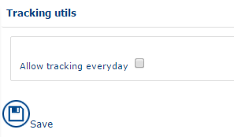
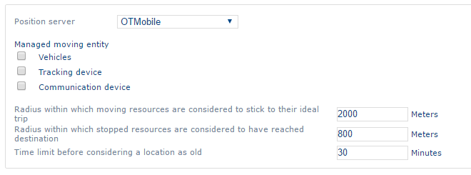

# Mobility

### Vehicles

Vehicles used for declaring a CO2 emissions rate used in the application statistics, as well as to track journeys for the vehicle by adding to it a [tracking device](https://mynomadia.com/privatedoc/9LLcWh7j74sENa54/optitime-doc/docs/en/otgs-reference-book/mob.html#mob-equip-suivi).

It is possible to [create](https://mynomadia.com/privatedoc/9LLcWh7j74sENa54/optitime-doc/docs/en/otgs-reference-book/generalites.html#creation), [consult](https://mynomadia.com/privatedoc/9LLcWh7j74sENa54/optitime-doc/docs/en/otgs-reference-book/generalites.html#modification) or [delete](https://mynomadia.com/privatedoc/9LLcWh7j74sENa54/optitime-doc/docs/en/otgs-reference-book/generalites.html#suppression) a vehicle.

#### List of vehicles

Access the [list](https://mynomadia.com/privatedoc/9LLcWh7j74sENa54/optitime-doc/docs/en/otgs-reference-book/generalites.html#generalite-liste) of vehicles by clicking on the Mobility > Vehicles link in the menu.

#### Form for the vehicle

The [form](https://mynomadia.com/privatedoc/9LLcWh7j74sENa54/optitime-doc/docs/en/otgs-reference-book/generalites.html#generalite-fiche) of the vehicle has just one tab.

The interface shows, for each vehicle, the following data:

* **Name** of the vehicle: it is unique;
* **Abbreviation**;
* **Routing profile**. A drop-down list offers a choice of preconfigured vehicles (car, truck, light delivery vehicle, delivery van, bus, emergency vehicle, emergency lorry or truck, taxi, bicycle, pedestrian) with technical specificities (average speeds, accessibility to different types of roads…) which will then be taken into account for the calculation of tailored itineraries.
* **Area**: the area in which the vehicle will be available. This field is mandatory.
* **Fleet**: descriptive field indicating the fleet to which the vehicle belonged;
* The vehicle **kind**: figure between 1 and 5 enabling the differentiation between the vehicles
* A brief **description** of the subcontractor;
* **CO2 emissions**: the CO2 emissions rate for the vehicle
* **Maximum speed of the vehicle**: speed restriction for the vehicle for the purpose of route calculations
* **Kilometer cost** for the vehicle
* **Daily cost** of the vehicle
* **Manufacture date** for the vehicle
* **Next MOT date** for the vehicle
* **Maximum quantity, at the time of departure, and on return** (2 quantity fields 1 and 2): defines the vehicle capacity, the quantity loaded at the departure and arrival of the vehicle.

### Tracking device

The tracking devices enable uploading of GPS coordinates.

It is possible to [create](https://mynomadia.com/privatedoc/9LLcWh7j74sENa54/optitime-doc/docs/en/otgs-reference-book/generalites.html#creation), [consult](https://mynomadia.com/privatedoc/9LLcWh7j74sENa54/optitime-doc/docs/en/otgs-reference-book/generalites.html#modification) or [delete](https://mynomadia.com/privatedoc/9LLcWh7j74sENa54/optitime-doc/docs/en/otgs-reference-book/generalites.html#suppression) a tracking device.

#### List of tracking devices

Access the [list](https://mynomadia.com/privatedoc/9LLcWh7j74sENa54/optitime-doc/docs/en/otgs-reference-book/generalites.html#generalite-liste) of tracking devices by clicking on the Tracking device link in the menu.

#### Tracking device form

The [form](https://mynomadia.com/privatedoc/9LLcWh7j74sENa54/optitime-doc/docs/en/otgs-reference-book/generalites.html#generalite-fiche) of the tracking device has just one tab.

The interface shows, for each device, the following data:

* the **external reference**;
* The **Name** of the device: it is unique;
* A **Abbreviation**;
* The **Area** in which the team will be available. This field is mandatory.
* A concise **description**.

### Assignments

This section establishes the link between the [resources](https://mynomadia.com/privatedoc/9LLcWh7j74sENa54/optitime-doc/docs/en/otgs-reference-book/donnees.html#RH), [vehicles](https://mynomadia.com/privatedoc/9LLcWh7j74sENa54/optitime-doc/docs/en/otgs-reference-book/mob.html#mob-vehicules) and the [tracking devices](https://mynomadia.com/privatedoc/9LLcWh7j74sENa54/optitime-doc/docs/en/otgs-reference-book/mob.html#mob-equip-suivi).

It is possible to [create](https://mynomadia.com/privatedoc/9LLcWh7j74sENa54/optitime-doc/docs/en/otgs-reference-book/generalites.html#creation), [consult](https://mynomadia.com/privatedoc/9LLcWh7j74sENa54/optitime-doc/docs/en/otgs-reference-book/generalites.html#modification) or [delete](https://mynomadia.com/privatedoc/9LLcWh7j74sENa54/optitime-doc/docs/en/otgs-reference-book/generalites.html#suppression) a assignment.

#### List of assignments

Access the [list](https://mynomadia.com/privatedoc/9LLcWh7j74sENa54/optitime-doc/docs/en/otgs-reference-book/generalites.html#generalite-liste) of assignments by clicking on the Assignments link in the menu.

#### Assignment form

The [form](https://mynomadia.com/privatedoc/9LLcWh7j74sENa54/optitime-doc/docs/en/otgs-reference-book/generalites.html#generalite-fiche) of the assignment has just one tab.

The interface shows, for each assignment, the following data:

* **The resource** on which the vehicle will be assigned to the vehicle and the tracking device;
* The **Area** concerned by the assignment:
* The **Only show unassigned vehicles and tracking devices** check-box allows you to filter on the following drop-down lists.
* the **Vehicle**;
* The **tracking device**;
* The **date** and the **time** of the start of the assignment:
* The **date** and **time** of the end of the assignment;

### Tracking utils

To access the tracking devices, click on the Mobility > Tracking devices link in the menu.

Interface

### Settings

The parameters are set to enable uploading of GPS positions.

List of settings

You can define the following parameters:

* The **Positions server**: select the position server corresponding to your device. By default, the drop-down list contains the following items: OTMobile, Calendrier Office 365, TomTom Webfleet, TomTom Webfleet SOAP, Masternaut, Orange, Simulateur, Ornicar, Ocean.
* The **Managed moving entity**: defines which object will serve as a reference for GPS coordinates. The following objects can be selected:
  * Vehicles
  * Tracking device
  * Communication device
* **Radius within which moving resources are considered to stick to their ideal trip** - allows you to define an alert when the resource deviates from their planned itinerary
* **Radius within which stopped resources are considered to have reached destination**: allows you to define an alert if the resource has stopped at a certain distance from the appointment location.
* **Time limit before considering a location as old** allows you to define an alert for resources whose location has not been refreshed for a certain time.

The .png>) saves the parameters.
