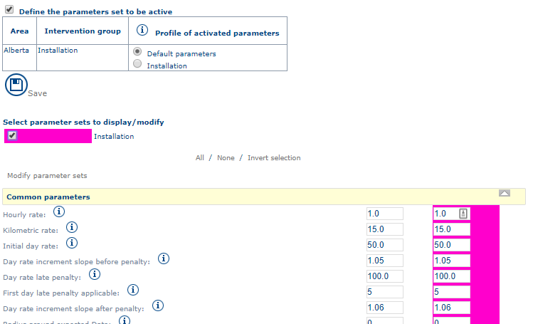
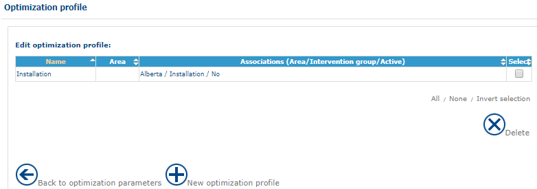
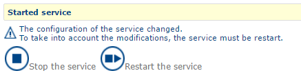
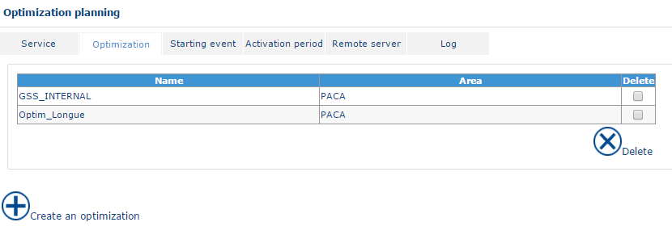
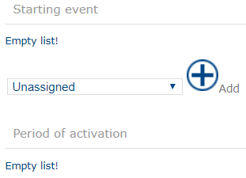
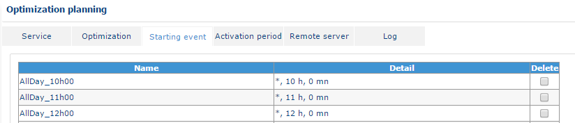
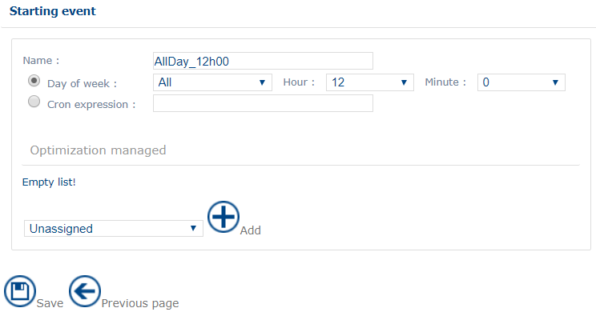
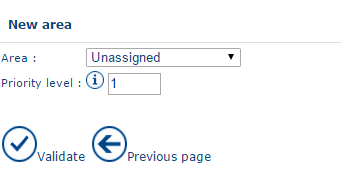
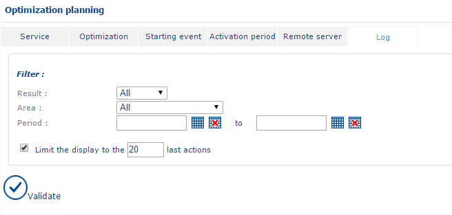

Optimisation
-
Opti-Time Reference Guide

# Opti-Time Reference Guide Administration

|  |  |
| --- | --- |
| [Sidebar](https://mynomadia.com/privatedoc/9LLcWh7j74sENa54/optitime-doc/docs/en/otgs-reference-book/optimisation.html# "Hide TOC tree") | [Prev](https://mynomadia.com/privatedoc/9LLcWh7j74sENa54/optitime-doc/docs/en/otgs-reference-book/donnees.html) | [Up](https://mynomadia.com/privatedoc/9LLcWh7j74sENa54/optitime-doc/docs/en/otgs-reference-book/module-administration.html) | [Next](https://mynomadia.com/privatedoc/9LLcWh7j74sENa54/optitime-doc/docs/en/otgs-reference-book/mob.html) |

### Optimisation

In the definition section, we introduced the notion of real time optimization and global batch optimization.
In this dialogue, it is possible to define optimization parameters that will be taken into account by the optimization engines
in [real time](https://mynomadia.com/privatedoc/9LLcWh7j74sENa54/optitime-doc/docs/en/otgs-reference-book/optimisation.html) and [batch](https://mynomadia.com/privatedoc/9LLcWh7j74sENa54/optitime-doc/docs/en/otgs-reference-book/_glossary.html#batch) modes.

#### Optimisation parameters

The optimization parameters can be accessed by clicking on the Optimisation parameters link in the menu.

The optimization of appointments in Opti-Time depends on a group of parameters that allow you to express the cost of a solution
and particular constraints. The configuration is applied by means of an interface available in the Administration module of Opti-Time.
The parameters enable the user to express preferences or constraints. For example, the enterprise does not accept that the
resource spends a night in a hotel if the distance is below a given threshold. This threshold is defined in the optimization
parameters.

Preview of some of the optimization parameters

|  |  |
| --- | --- |
| [Warning] | Warning |
| **Types of parameter values**  Certain values have clear units (for example, the maximum n number of nights away from the site) but this is not always the case. In effect, the different values of parameters can be classified into 4 types:  - a value with a unit: the units for the value will be written between brackets. For example, *Confirmation time (in days)*; - a cost value: a comparative value (this is not a real value) that represents the preference. For example, the value of the   parameter *Cost per night away from the site* is comparative. In general, it will be 5 times higher than an hourly rate; - a rate. for example, the *Increase in appointment cost for each late day*; - options: the user chooses the value from a limited series of values. For example, the *Night used* parameter that indicates whether a resource can sleep away from the site. Only Yes or No are possible answers. |

##### Management of optimization profiles

Opti-Time is supplied with a default optimization profile that is valid for all areas defined in the application.
The administrator can create other optimization profiles in order to harmonise the optimization parameters with the characteristics
of an area.

If no association has been created between an optimization profile and an area, it is the **Default Optimisation Profile** that prevails.

**List of optimization profiles**

The [list](https://mynomadia.com/privatedoc/9LLcWh7j74sENa54/optitime-doc/docs/en/otgs-reference-book/generalites.html#generalite-liste "Data home page") of optimization profiles is available when you click on the Modify parameter profiles link.

It is possible to [create](https://mynomadia.com/privatedoc/9LLcWh7j74sENa54/optitime-doc/docs/en/otgs-reference-book/generalites.html#creation "Create a new data item"), [consult](https://mynomadia.com/privatedoc/9LLcWh7j74sENa54/optitime-doc/docs/en/otgs-reference-book/generalites.html#modification "Consult or edit an existing data item") or [delete](https://mynomadia.com/privatedoc/9LLcWh7j74sENa54/optitime-doc/docs/en/otgs-reference-book/generalites.html#suppression "De-activating / Deleting a data item") optimization profiles.

List of optimization profiles

**Optimisation profile form**

Setting up a new optimization profile

The [form](https://mynomadia.com/privatedoc/9LLcWh7j74sENa54/optitime-doc/docs/en/otgs-reference-book/generalites.html#generalite-fiche "Data form") for an optimization profile includes the following fields:

- The internal **Identifier** for the optimization profile.
- The **Name** field allows you to enter an optimization profile name.
- The **Description** field allows you to enter a few words of description of the optimization profile
- The **Colour** field allows you to define a colour for the optimization profile.

You can [add](https://mynomadia.com/privatedoc/9LLcWh7j74sENa54/optitime-doc/docs/en/otgs-reference-book/generalites.html#ajout "Adding data") and [delete](https://mynomadia.com/privatedoc/9LLcWh7j74sENa54/optitime-doc/docs/en/otgs-reference-book/generalites.html#suppression "De-activating / Deleting a data item") [Areas](https://mynomadia.com/privatedoc/9LLcWh7j74sENa54/optitime-doc/docs/en/otgs-reference-book/donnees.html#region "Area") and [Intervention groups](https://mynomadia.com/privatedoc/9LLcWh7j74sENa54/optitime-doc/docs/en/otgs-reference-book/donnees.html#groupe-intervention "Interventions group").

##### Description of optimization parameters

|  |  |
| --- | --- |
| [Warning] | Warning |
| The optimization parameters allow you to steer or orientate the results of optimizations. Great care and/or expertise is required when manipulating these parameters. |

|  |  |
| --- | --- |
| [Note] | Note |
| Each cost enters into the calculation of a solution to the optimization problem submitted to the optimization engine. This problem may result in the insertion of an appointment in a route (Real time optimization) or the optimization of a series of appointments on a given number of days and resources. Different solutions are generated and the global cost is used to classify the suggestions (real time) or to choose the best (batch) solution. |

The full list of optimization parameters is available in the [appendices](https://mynomadia.com/privatedoc/9LLcWh7j74sENa54/optitime-doc/docs/en/otgs-reference-book/annexes-parametres.html "Optimization parameters").

##### Parameters that are common to both optimization modes

- **Hourly cost**: Cost of one hour of travel or intervention in a route.
- **Kilometer cost**: Cost of a kilometre travelled by a resource on a route.

  |  |  |
  | --- | --- |
  | [Tip] | Tip |
  | Ratio between hourly cost and kilometer cost: 1 hour corresponds to 50 kms for an average speed of 50km/h. To give priority to the distance as compared to the duration, the kilometer cost must be 50 times greater than the hourly cost. |
- **Initial day rate**: This allows you to add a per-day cost for days elapsed between the earliest date for the appointment and the first day of
  the optimization.
- **Parameters linked to late penalties**. Below is an example summarising the complete range of parameters in a table of penalties and costs as a function of days
  elapsed.

  - **Rate of increase in daily cost (before late penalties)**: multiplication factor increasing the cost for each day elapsed before the **First day of application of the late penalty**. In the example below, the value of this parameter is defined at 1.05, the cost increases by 5% each day preceding the day
    of application of the late penalty.
  - **Late penalty**: Numeric constant that represents an additional weighting to the three parameters above influencing the general score in
    this way. The higher this value, the more the score will be adversely affected. In our example below, the value of this parameter
    is set to 10.
  - **First day of application of late penalty**: Number of days after which the late penalty is applied. In the example below, the value of this number of days is equal
    to 5.
  - **Rate of increase in the daily cost after a late penalty**: Multiplication factor increasing the cost for each day spent after the **First day of application of the late penalty**. In the example below, the value of this parameter is defined as 1.06. The cost therefore increases by 6% each day after
    the first day of application of the late penalty.
  - **Radius around expected date**: Number of days possible around the expected date. If the parameter is equal to 0, the expected date is exclusive; if it
    is equal to -1, all days are accepted. In any event, the expected date minimises the late cost function.

    **Example:**
    for a resource who has an empty planning (each day is equivalent from the point of view of travel, the total cost is equal
    to c), we therefore obtain the following costs:

    Example of a table of penalties and costs as a function of days elapsed.

    | Day | 0 | 1 | 2 | 3 | 4 | 5 | 6 |
    | --- | --- | --- | --- | --- | --- | --- | --- |
    | Formula | c | 1.05c | (1.05)²c | (1.05)^3.c | (1.05)^4.c | 1.1((1.06)^4.c + 10) | 1.1²((1.06)^4.c + 10) |
    | Cost | 10 | 10.5 | 11 | 11.5 | 12 | 19 | 20.5 |

    In this example, day 0 corresponds to the first day of the optimization.

    |  |  |
    | --- | --- |
    | [Warning] | Warning |
    | If the values of the parameters **Coefficient before application of late penalties** and/or **Coefficient after the application of late penalties** are set to zero, the calculation of the cost on these parameters is equal to zero (see the formula above). To avoid taking these parameters into account, you have to declare them as 1. To ensure the cost increases as a function of time, give a value that is higher than 1 to these parameters. To ensure the cost reduces over time, you need to give them a value included between 0 and 1. |
  - **Confirmation delay (in days)**: Number of days before a reserved appointment passes automatically into a status of confirmed.
  - **Reservation period (in days)**: Number of days before a planned appointment passes automatically into reserved status.
  - The **Snap to grid for appointment start times** option forces the application to suggest start times for the appointment according to a regular time interval in minutes.
    For example, for an appointment that is possible from 8.23am onwards, the application will propose the appointment for 8.25am
    for a 5-minute step or 8.30am if the step is configured at 10 minutes. The steps available are none, 5m, 10m, 15m, 20m, 30m
    and 60m.

    |  |  |
    | --- | --- |
    | [Warning] | Warning |
    | This parameter can add a gap between appointments in the agenda. It reduces the optimization performance as a result. |
  - **Cost of not using a favourite day**: Added cost when the day is a non-favourite day, that is, not preferred by the customer. Favourite days are configured in
    the handling of known customers (cf. [Planning](https://mynomadia.com/privatedoc/9LLcWh7j74sENa54/optitime-doc/docs/en/otgs-reference-book/optimisation.html) module). For example, a customer prefers to be visited on Mondays. The possible suggestions for appointments for the other
    days will be penalised with an additional cost applied.
  - The **Cost of not using a preferred resource** is the cost added for the utilisation of a non-preferred resource as compared with utilisation of a preferred resource. A
    client can be assigned to resources referred to as preferred. But the application is capable of proposing non-preferred resources
    in the case where there would be no other choice, and this allows you to retain a certain flexibility. This cost allows you
    to penalise the choice of a non-preferred resource.
  - **Access time (in minutes)**: this duration defines the sum of two durations:

    - the time spent between the stopping of the vehicle and the arrival itself at the customer’s premises;
    - the time spent between the end of the visit to the customer and the departure of the vehicle.

      This field handles accessibility to a site by measuring it.  
      This time can therefore vary according to which customers are to be visited. The content of this field is duplicated on route
      stops.
  - **Add the fixed duration between two appointments with the same location**: *Yes*, adds the **access time** to two appointments of the same geographic location. *No*, when two appointments are situated at the same place, the additional access time is not added between the two appointments,
    the travel times and access times are therefore null.

    |  |  |
    | --- | --- |
    | [Warning] | Warning |
    | This parameter adds a gap between appointments in the agenda. |
- **Parameters linked to the handling of nights away**

  - The **Cost of a night away from home**, if this cost is lower than the cost incurred by returning to the address registered for the end of the working day, a night
    away from home is suggested.
  - **Minimum journey duration to justify a night away**: This permits definition of a minimum travel time above which a night away may be suggested. Reducing this time increases
    the suggestions for nights away. It is overdefined by the parameters for the resource ([Limits tab](https://mynomadia.com/privatedoc/9LLcWh7j74sENa54/optitime-doc/docs/en/otgs-reference-book/donnees.html#RH-limite "Limits tab")).
  - **Maximum number of nights away per week**: Defines a maximum number of nights away suggested. It is overdefined by the parameters for the resource ([Limits tab](https://mynomadia.com/privatedoc/9LLcWh7j74sENa54/optitime-doc/docs/en/otgs-reference-book/donnees.html#RH-limite "Limits tab")).
  - **Overrun ratio for journey overlap on overnight morning**: Percentage of overrun on the authorised time to cause an overlap on the days after nights away.
  - **Overrun ratio for journey overlap on overnight morning**: Percentage of overrun of the authorised time to enable overlap on the evenings of nights away.
  - **Journey gain factor expected for overnight away**: Factor (as a percentage) of the gain in travel time gained by the deployment of nights away. Increasing this value reduces
    the number of nights away.

##### Parameters relating to a real time optimization

- **Number of solutions found**: Maximum number of slots suggested for an appointment by the optimization.

  - **Maximum number per day**: Maximum number of timeslots suggested per day. The best timeslots are suggested. (If the value is 0, the setting is not
    used)
  - **Only one day per resource**: If Yes, then a timeslot will only be suggested per day and per resource. If No, there is no limit.
  - **Time grid step (in minutes)**: Step (in minutes) defining a time grid according to the following parameters: (if the value is 0, the parameter is not used)

    - **Time start of grid**: application source for the grid step. By default, the step is applied from midnight (00:00).
    - **Step extended to all days**: If Yes, the step is extended to all the days being sought (the time grid covers all days). If No, then the grid is the same
      for all days (the time grid is independent of the day)
    - **Maximum number per cell**: Maximum number of slots presented in each cell of the grid. The best slots are suggested. (If the value is 0, the parameter
      is not used.)
    - **Maximum number per resource and per cell**: Maximum number of slots suggested per resource in each cell of the grid. The best slots are suggested. (If the value is
      0, the parameter is not used.)
    - **Solutions suggested at each step**: If Yes, then the slots are suggested at each step of the grid to fill in the maximum number of cells. The parameter limiting
      the number of slots suggested is not used in this case.
  - **Presentation of solutions with the same cost**: Solutions with the same cost can be sorted chronologically, or in reverse chronological order, or by limiting the time spent
    with other activities in the planning
  - **Position of suggested timeslots**: Position of timeslots suggested other than at the start or end of the day on days that are filled or on empty days. The
    timeslots are suggested between two locations L1 and L2. Several choices are possible: either, exclusively close to the time
    of L1, or exclusively close to the time L2, or both close to the time of L1 and the time of L2, or exclusively close to the
    geolocation the shortest journey time away from the appointment to be scheduled.

    - **First timeslots in a filled day**: Position suggested timeslots at the start of a day already containing geolocated activities. The timeslots are suggested
      between two geolocations L1 and L2. Several choices are possible: either exclusively close to the time of L1, or exclusively
      close to the time of L2, or both close to the time of L1 and close to the time of L2, or exclusively close to the geolocation
      with the shortest journey time from the appointment to schedule.
    - **Last timeslots for a filled day**: Position of timeslots suggested at the end of a day already containing geolocated activities. Timeslots are suggested between
      two geolocations L1 and L2. Several choices are possible: either exclusively close to the time of L1, or exclusively close
      to the time of L2, or both close to the time of L1, and close to the time of L2, or exclusively close to the geolocation with
      the shortest journey time in relation to the appointment to be scheduled.
    - **After a non-worked unavailability**: Position of timeslots suggested after a non-worked unavailability. The timeslots are suggested between two geolocations
      L1 and L2. Several choices are possible: either exclusively close to the time of L1, or exclusively close to the time of L2,
      or both close to the time of L1 and close to the time of L2, or exclusively close to the geolocation with the shortest journey
      time to the appointment to schedule.
    - **Before a non-worked unavailability**: Position of suggested timeslots before a non-worked unavailability. The timeslots are suggested between two geolocations
      L1 and L2. Several choices are possible: either exclusively close to the time of L1, or exclusively close to the time of L2,
      or both close to the time of L1 and close to the time of L2, or exclusively close to the location with the shortes journey
      time to the appointment to be scheduled.
  - **Maximum cost of the suggested timeslot**: Maximum cost authorised for the suggested timeslot. (If this value is exceeded and greater than 0 the timeslot is not suggested.)
  - **Maximum number of minutes for the outward journey**: Maximum number of minutes of travel authorised for the outward journey to the appointment. (If this value is exceeded, and
    greater than 0, then the timeslot is not suggested.)
  - **Maximum number of minutes for the return journey**: Maximum number of minutes of authorised journey time for the return journey from the appointment. (If this value is exceeded
    and greater than 0 then the timeslot is not suggested.)
  - **Maximum number for the total minutes (Outward/Return)**: Maximum number of minutes of authorised travel for the sum of the outward and return journey times to and from the appointment.
    (If this value is exceeded and greater than 0, the timeslot is not suggested.)
  - **Maximum number of minutes journey time per day**: Maximum number of authorised travel time per day. (If this value is exceeded and greater than 0, the timeslot is not suggested).
  - **Maximum number of kms for the outward journey**: Maximum number of kilometers authorised for the outward journey to the appointment. (If this value is exceeded and greater
    than 0, the timeslot is not suggested.)
  - **Maximum number of kms for the return journey**: Maximum number of kilometers authorised for the return journey from the appointment. (If this value is exceeded and greater
    than 0 the timeslot is not suggested.)
  - **Maximum number of kms total (Outward/Return)**: Maximum number of kilometers authorised for the sum of the outward and return journeys to and from the appointment. (If
    this value is exceeded and greater than 0, the timeslot is not suggested.)
  - **Maximum number of kms per day**: Maximum number of authorised travel kms per day. (If this value is exceeded, and greater than 0, the timeslot is not suggested.)
  - **Maximum cost of the timeslot suggested without any alert**: Maximum cost authorised without alert for the suggested timeslot. (If this value is exceeded and is greater than 0, the
    timeslot is suggested with an alert.)
  - **Maximum number of minutes for the outward journey without alert**: Maximum authorised cost without alert for the suggested timeslot. (If this value is exceeded and is greater than 0, the
    timeslot is suggested with an alert.)
  - **Maximum number of minutes for the return journey without an alert**: Maximum number of minutes authorised journey time without an alert for the return journey from the appointment. (If this
    value is exceeded and greater than 0 the timeslot is suggested with an alert.)
  - **Maximum number of minutes in total (Outward/Return) without alert**: Maximum number of minutes of authorised journey time without alert for the sum of outward and return journey time to and
    from the appointment. (If this value is exceeded or greater than 0 the timeslot is suggested with an alert.)
  - **Maximum number of journey minutes per day without alert**: Maximum number of authorised journey time in minutes without alert, per day. (If this value is exceeded and greater than
    0, the timeslot is suggested with an alert.)
  - **Maximum number of kms for the outward journey without alert**: Maximum number of kilometers authorised without alert for the outward journey to the appointment. (If this value is exceeded
    and greater than 0, the timeslot is suggested with an alert).
  - **Maximum number of kms for the return journey without an alert**: Maximum number of kilometers authorised without an alert for the return journey from the appointment. (If this value is
    exceeded and greater than 0, the timeslot is suggested with an alert.)
  - **Maximum number of kms in total (Outward/Return) without alert**: Maximum number of kilometers authorised without alert for the sum of the outward and return journeys to and from the appointment.
    (If this value is exceeded and greater than 0 the timeslot is suggested with an alert.)
  - **Maximum number of kms per day without alert**: Maximum number of kms of authorised travel per day without alert. (If this value is exceeded and greater than 0, the timeslot
    is suggested with an alert.)
- **Method to set slipping time interval for confirmed appointments (only for confirmed or reserved appointments)**: Enables definition of how the theoretical time of passage is communicated.

  |  |  |
  | --- | --- |
  | [Tip] | Tip |
  | There are several possibilities:  - *None*: no information is given; - *On the day*: the appointment takes place during the day in question; - *On the half day*: the appointment takes place during the morning or the afternoon; - *Maximum delay*: the appointment must take place at the latest at a given time; - *Maximum advance*: the appointment must take place at the earliest at a given time; - *More or less*: the indicated visit time will be at more or less a time defined according to the following parameter (*Slipping time interval for communicated appointments*). For example, the application calculates a theoretical visit time of 11.30am; the timeslot communicated is a probable visit   time between 10.30am and 12.30pm if the duration of the interval has been defined at 60 minutes. - *By timeslot*: the indicated visit time takes the parameter into account (Slipping time interval for communicated appointments, and *Reference times* for the calculation of the arrival time interval of communicated appointments). This makes it possible to communicate to   the client rounded up visiting times. For example, if the theoretical visit time is set at 10.23am, the *Reference time of slipping interval* parameter for the calculation of the arrival time interval for communicated appointments is set at 00.00 and if the parameter   for the *Slipping time interval* duration for communicated appointments is set to 120 minutes, the timeslot to communicate to the client is a probable visit   time of between 10am and 12 midday. |

  - **Slipping time interval duration (confirmed appointments)**: Duration in minutes of the time interval used in the parameter seen above (*Method to set slipping time interval for communicated appointment*). This parameter is taken into account only in the following modes: *More or less*, *Maximum advance*, *Maximum delay* and *By slot*.
  - **Reference time of slipping intervals (confirmed appointments)**: Reference time from which the slots are calculated. If a value of 00:00 is indicated, the slots are calculated from 00:00.

    For example:
    If the *By timeslot* parameter is chosen in the calculation mode with a duration of 2h, the slots calculated will be 00:00-02:00 ; 02:00-04:00 ;
    04:00-06:00, etc.
    If a visit is planned for 10.16h, the slot to communicate will therefore be 10.00-12.00.
- **Method to set slipping time interval for planned appointments**: this parameter is only applied to appointments with a planned status.

  - **Slipping time interval duration (planned appointments)**: Parameter applied only to appointments with a planned status.
  - **Reference time of slipping interval (planned appointments)**: parameter applied only to appointments with a planned status.
- **Method to set slipping time interval for planned appointments**: delay to apply in minutes (with an offset of 5 minutes, 14.55 is considered as belonging to the time interval 15.00-15.15h
  if the timespan is set to 15 minutes;
- **Appointment duration taken into account in the baseline time**:

  - *Yes*: the time slot suggested covers the whole of the appointment. For a *Slipping time interval duration* of 60 minutes and an appointment defined at 10.30h for a duration of 2 hours, the application will suggest a timeslot 10.00-13.00.
  - *No*: the timeslot suggested contains the start time for the appointment. For a *Slipping time interval* of 60 minutes and an appointment defined at 10.30h for a duration of 2 hours, the application will suggest a timeslot of
    10.00-11.00.

|  |  |
| --- | --- |
| [Tip] | Tip |
| The 4 following parameters enable prefilling of the search interface for a timeslot (planning of an appointment). |

- **Earliest appointment time**: earliest time of the start of planned appointments.
- **Latest appointment time**: Latest start time for planned appointments.
- **Alternative earliest appointment time**: Another default value for the earliest appointment start time.
- **Alternative latest appointment time**: Another default value for the latest appointment start time.
- **Search start day**: Number of days (counting from today) from which the search for free timeslots will start in a real time optimization.
- **Search last day**: number of days (counting from today) from which the search for free timeslots will terminate in a real time optimization.
- **Search day**: Default value for the search day in relation to the current day, for an appointment optimised on a chosen day.
- **Factor applied to prioritise the type of intervention**: added cost for a difference of 1% between the priorities of 2 resources for a same type of task (cf. [priority of resources](https://mynomadia.com/privatedoc/9LLcWh7j74sENa54/optitime-doc/docs/en/otgs-reference-book/donnees.html#RH-priorite "Priorities tab")).
- **Out of sector surcharge**: cost associated to an appointment located out of sector.
- **Split appointment surcharge**: cost added per split appointment (divided up into several parts in the day).

  |  |  |
  | --- | --- |
  | [Warning] | Warning |
  | A high value will prevent the engine from splitting an appointment in order to place it in the schedule. This can reduce the quality of the optimization. |
- **Parameters linked to the handling of multi-day appointments**

  - **Minimum duration of a multi-day appointment**: Minimum duration that an appointment must take to be splittable at the end of a working day.
  - **Minimum duration placed on first/last day for a multi-day appointment**: when an appointment must be split to be performed over several days, the parts of this appointment placed on the first and
    last days may not exceed the value defined in this field.
  - **Add free time before fist slot** (case of an appointment, at least 2 days): enables a multi-slot appointment to be offset (by at least 2 days) in such a way
    as to have a significant time to apply for an appointment that would have started at least the day before. This offset is
    applied on the morning of the start of the appointment, and therefore frees up some free time. The application will try to
    offset the appointment in order to respect the minimum duration of a split timeslot. The possible values for this parameter
    are *yes* (to accept the addition of a free time interval) or *no* (to not accept the addition of a free time interval).
  - **A single activity performed on the first day of a multi-day appointment**: prevents the scheduling of another appointment on the first day of an appointment scheduled over several days.
  - **Maximum duration of appointment on last day to force it back to previous day** (case of an appointment lasting at least 2 days): maximum duration of the appointment (on the last day) that can be brought
    back into the previous day while increasing the working day of the day before.
    If this value is set to zero, forcing it to the day before will be impossible.
- **Cost of days discontinuity**: cost added to an appointment scheduled over several days. If a solution is possible without splitting the appointment over
  several days, it will be given priority.

  - **An appointment on several days can be interrupted by a full-day unavailability**: Option to stagger an appointment over several days so it can be finished after one or several daily unavailabilities.
  - **An appointment on several days can be interrupted by another**: an option exists to staggeer an appointment over several days, in between other appointments.
  - **An appointment on several days can be interrupted**: Possibility of interrupting an appointment that takes place over several days to insert another appointment. The time lost
    on that appointment is replaced as a priority on the last day of the intervention, and then if this is insufficient, by forcing
    the appointment each evening using the value of the Maximum duration for last timeslot, that can be forced the day before.

    - **Possible interruption possible for a whole day**: The option to interrupt an appointment and to not fulfill the appointment for a full day, to enable another appointment
      to be inserted in its place.
    - **Ability to complete the appointment one day later**: The option to terminate an appointment lasting several days a day late, to enable another appointment to be inserted during
      the period.
  - **An appointment on several days can continue the next day before the client opens**: option to start the appointment earlier, before the customer opens, every day, and excluding the first day of the appointment.
    In effect, on the first day of the appointment, the resource will have to always arrive in the customer’s opening hours time
    window.
  - **An appointment on several days can continue after the customer closes**: option to pursue an appointment over several days after the customer closes, and this is possible every day the ongoing
    appointment continues.
  - **An appointment on one day can continue after the customer closes**: option to pursue an appointment on one day after the customer closes.
- **Minimum slot duration (split appointment)**: when an appointment must be split in order to be performed over several times within a single day (for example: on either
  side of the lunch break) the sections of this appointment have as a minimum duration, the value defined in this field.
- **Mobilisation cost for a resource (common override)**: a fixed cost added for each new route. When a value is present in the [batch optimization parameter](https://mynomadia.com/privatedoc/9LLcWh7j74sENa54/optitime-doc/docs/en/otgs-reference-book/optimisation.html#param-batch "Parameters relating to batch optimization") *Cost of mobilisation of a resource*, while it is the value defined in this last field that counts.

  |  |  |
  | --- | --- |
  | [Tip] | Tip |
  | A high value for this field will favour the filling of routes (with less resources mobilised). Conversely, a low value for this field will favour the mobilisation of resources. |
- **Cost of mobilising the resource at D0**: cost added to the first appointment of the resource’s day today (Working Day) in real time optimization.
- **Cost of an appointment not placed today**: added cost for an appointment that has not been suggested for the day, today (Working Day). This cost is used to give priority
  to possible whole Working Day appointments.
- **Costs linked to unplanning an appointment**

  - **Cost of unplanning a planned appointment**: Fixed cost added for each unplanned appointment for planning another appointment in its place. This parameter therefore
    specifies the cost of unplanning an appointment to make room for another appointment.
  - **Cost per hour of unplanning a planned appointment**: added cost for each hour of appointment with planned status unplanned so another appointment can be scheduled in its place.
  - **Cost of unplanning a reserved appointment**: added fixed cost for each reserved appointment that is unplanned for the purpose of scheduling another appointment in its
    place.
  - **Cost per hour of unplanning a reserved appointment**: the added cost for each hour of reserved appointment being unplanned in order to schedule another appointment in its place.
  - **Cost of unplanning a confirmed appointment**: additional fixed cost for each confirmed appointment being unplanned in order to schedule another appointment in its place.
  - **Cost per hour of unplanning a confirmed appointment**: Additional fixed cost for each hour of confirmed appointment being unplanned in order to schedule another appointment in
    its place.
  - **Possible unplanning of reserved appointments on RTO *search +***: this parameter allows you to choose to make it possible to take reserved appointments out of the planning to schedule another
    appointment in real time optimization mode.
  - **Possible unplanning of confirmed appointments on RTO "search +"**: this parameter allows you to choose to make it possible to take confirmed appointments out of the planning to schedule another
    appointment in real time optimization mode.
  - **Possible unplanning of appointments with meeting on RTO "search +"**: this parameter allows you to choose to make it possible to take interventions out of the planning with appointments in order
    to schedule another appointment in real time optimization mode.
  - **Possible unplanning of marked appointments on RTO "search +"**: this parameter allows you to choose to make it possible to take marked appointments out of the planning to schedule another
    appointment in its place, in real time optimization mode.
  - **Cost of unplanning a work-related unavailability**: cost above which a worked unavailability can be unplanned (by scheduling an appointment in real time).
  - **Cost per hour of unplanning a work-related unavailability**: added fixed cost per hour of worked unavailability. The total cost for this unavailability defines the cost above which
    this unavailability can be unplanned (by scheduling an appointment in real time).
  - **Cost of unplanning a non-work related unavailability**: the cost above which a non-worked unavailability can be unplanned (by planning an appointment in real time).
  - **Cost per hour of unplanning a non-worked unavailability**: added fixed cost per hour of non-worked unavailability. The total cost for this unavailability defines the cost above which
    this unavailability can be unplanned (by the scheduling of an appointment in real time).
- **Cost for non-delivery**: cost above which an appointment is not planned. This is the cost of an unfulfilled intervention with a 50% priority. By
  default, this cost has a value of 0 and the cost of non-delivery is unaffected by the duration of the intervention.
- **Hourly rate for non-delivery**: added cost per hour of appointment. It is therefore proportional to the duration of the appointment. The total cost constitutes
  a threshold over and above which the appointment is not planned. It is the hourly cost of an unfulfilled standard priority
  intervention. By default, this cost has a value of 0 and the cost of non-delivery is unaffected by the appointment duration.

  |  |  |
  | --- | --- |
  | [Tip] | Tip |
  | If this value is too low, it can happen that certain appointments are not scheduled in [batch optimization](https://mynomadia.com/privatedoc/9LLcWh7j74sENa54/optitime-doc/docs/en/otgs-reference-book/_glossary.html#batch) mode. |
- **Maximum cost of a journey without alert**: cost above which an alert is displayed when the appointment is suggested. The parameter is not used if set to zero.
- **Maximum radius (in km)**: maximum radius (in kilometers) of the circle that has as its centre the departure point for the day. It defines the circle
  in which appointments are possible. The parameter is not used when the value is set to 0.

  - **Radius calculated by the road**: if Yes, then the radius is calculated by the road network route, if No, then it is calculated as a straight line (as the
    crow flies).
- **Minimum time between two appointments considered too far apart**: limiting value (in minutes) above which two appointments are considered as being too far apart, as this results in the application
  of the associated cost. The parameter is not used if set to zero.

  - **Time overcost for two appointments considered too far apart**: added hourly surcharge when two appointments are considered as being too far apart (cf. previous parameter).
- **Minimum distance between two appointments considered too far apart**: Limit value (in kilometers) above which two appointments are considered too far apart, and this results in the application
  of the associated cost. The parameter is not used if set to zero.

  - **Kilometer overcost for two appointments considered too far**: Kilometer overcost added when two appointments are considered to be too far apart (cf. previous parameters).
- **Cost of not using a mission type favorite weekday (real-time context)**: added cost for an appointment scheduled on a non-favorite day in relation to the [intervention type](https://mynomadia.com/privatedoc/9LLcWh7j74sENa54/optitime-doc/docs/en/otgs-reference-book/donnees.html#type-intervention "Intervention type (Intervention group)").
- **Favorite first days**: days of the week numbered from 1 to 7 (Monday = 1, Sunday = 7) favorite first day of a multi-day appointment (separated
  by semi-colons). To the non-favorite days will be added an additional cost (cf. the next parameter).

  - **Cost of not using a favorite first day**: cost added when a multi-day appointment starts with an unidentified day in the previous parameter.

    |  |  |
    | --- | --- |
    | [Tip] | Tip |
    | To prevent a multi-day appointment from being scheduled on a Friday and so being split by a weekend, enter the value 1;2;3;4 in the *Favorite first days* parameter and enter a high value in the *Cost of not using a favorite first day*. |
- **Favorite last days**: same procedure as for *Favorite first days* for the last day of a multi-day appointment

  - **Cost of not using a favorite last day**: same procedure as for *Cost of not using a favorite first day* for the last day of a multi-day appointment

    |  |  |
    | --- | --- |
    | [Tip] | Tip |
    | To prevent a multi-day appointment from finishing on a Monday, and so from being split by a weekend, enter a value of 2;3;4;5 in the *Favorite last days* parameter and enter a high value in the *Cost of not using a last favorite day* parameter. |
- **Night away used**: this allows you to activate, or not, the scheduling of nights away with real time optimization.

  - **Non-favorite night away used**: this allows you to activate or not the scheduling of a non-defined night away in the resource form and the [Limits tab](https://mynomadia.com/privatedoc/9LLcWh7j74sENa54/optitime-doc/docs/en/otgs-reference-book/donnees.html#RH-limite "Limits tab"). This parameter therefore enables the optimising staff member to suggest a night away when it was initially not authorised.

    - **Cost of non-favorite night away**: added cost for scheduling an appointment on an evening not defined in the resource form and the [Limits tab](https://mynomadia.com/privatedoc/9LLcWh7j74sENa54/optitime-doc/docs/en/otgs-reference-book/donnees.html#RH-limite "Limits tab")
- **Scheduling with compressed journey time (Utilisation subject to certain limitations!)**: Scheduling with the possibility of reducing journey times. Care must be taken, as this type of utilisation limits, or even
  prohibits, a global optimization subsequently.

  - **Maximum number of compressed minutes**: Maximum number of minutes allowed for reducing a journey time
  - **Maximum percentage of compression**: Maximum percentage of a journey duration that can be used to reduce a journey
  - **Minimum number of minutes**: Minimum number of minutes for the journey following compression.
  - **Cost of the compression of journeys**: Fixed added cost for scheduling an appointment with compressed journey time
  - **Cost per minute of compression of journeys**: Added cost per minute of journey compression, that is, per minute of reduced journey time.
- **Scheduling with compressed duration (Utilisation subject to certain limitations!)**: Scheduling with the option to reduce the appointment duration. Care is needed! This utilisation limits, or even prohibits,
  a global optimization subsequently.

  - **Maximum number of compressed minutes**: Maximum number of minutes authorised for reduction of the appointment duration
  - **Maximum compression percentage**: Maximum percentage of minutes authorised for reducing the appointment duration as a function of the initial appointment
    duration
  - **Minimum number of minutes**: Minimum number of minutes for the appointment after compression. (1 minute will be the smallest authorised value for an
    appointment)
  - **Compression cost for an appointment**; Fixed added cost for scheduling an appointment with reduced intervention duration
  - **Cost per minute for compression of an appointment**: Added cost per minute for compression of an appointment, that is per minute of reduced appointment.
- **Alert for an already scheduled client**: an alert given when an appointment it taken on a chosen day, when either the resource has already visited the customer,
  or they will be visiting this customer soon over the next few days.

  - **Number of days before**: Maximum number of days before a chosen day for making an appointment, raising an alert if the resource has already visited
    this customer, or if they will be visiting this customer shortly in this interval preceding the chosen day.
  - **Number of days maximum after**: maximum number of days after a chosen day for making an appointment, raising an alert if the resource has already visited
    this customer, or if they will be visiting the customer soon within this interval following the chosen day.
- **Display solution cost as a chart**: this enables display of gross costs in the suggestions during a real time optimization (the value must be set to *no*) or to assign stars (the value must be set to *yes*). A suggestion with five stars is the most effective (low cost solution) and a suggestion with one star is least effective
  (i.e. very costly). If a graphical representation is chosen, the following parameter will have to be configured.

  - **Intervals used to display the solution cost on chart**: allows you to define the ranges of costs corresponding to the different stars (graphical display mode for costs). For example,
    a cost falling between 0 and 100 corresponds to a 4-star graphical representation and so on. The user can redefine the delimiters
    themselves, to reflect company policy.
- **Second customer availability slots**: if Yes, then an input zone for a second time window for customer availability is suggested in the real time appointment
  making page.
- **Search for a staggered appointment solution**: this parameter, often called "Push through" allows the application, if it is set to *Yes* to "force" appointments that have already been planned, in order to suggest more solutions.

##### Parameters relating to batch optimization

- **Earliest time for batch**: corresponds to the earliest time a planned batch appointment can start.
- **Latest time for batch**: corresponds to the latest time a planned batch appointment can start.
- **Hourly rate for non-delivery**: added cost per hour of appointment. It is therefore proportional to the duration of the appointment. The total cost constitutes
  a threshold over and above which the appointment is not planned. It is the hourly cost of an unfulfilled standard priority
  intervention. By default, this cost has a value of 0 and the cost of non-delivery is unaffected by the appointment duration.
- **Priority cost for type of intervention (overdefined for a batch optimization)**: added cost for a 1% difference between the priorities of 2 resources for a same type of task (cf. [resource priority](https://mynomadia.com/privatedoc/9LLcWh7j74sENa54/optitime-doc/docs/en/otgs-reference-book/donnees.html#RH-priorite "Priorities tab")).
- **Cost of mobilising the resource**: this is the special cost for the first appointment for a resource in the day. It is a multiplication factor. It is set to
  less than 1 to favour filling of empty days, or higher than 1 to favour filling of days that have already started.
- **Grade cost**: Multiplication factor increasing the cost in relation to the experience of the resource (junior, confirmed, expert) (cf.
  [Skills tab in the resource form](https://mynomadia.com/privatedoc/9LLcWh7j74sENa54/optitime-doc/docs/en/otgs-reference-book/donnees.html#RH-comp "Skills tab")). The more experienced the resource, the lower the cost. With a high cost, the optimization engine will give more priority
  to experienced resources to perform interventions.
- **Cost of not using a mission type favorite weekday (overdefined for a batch optimization)**: added cost for an appointment scheduled on a non-favorite day in relation to the [intervention type](https://mynomadia.com/privatedoc/9LLcWh7j74sENa54/optitime-doc/docs/en/otgs-reference-book/donnees.html#type-intervention "Intervention type (Intervention group)").
- **Overcost per kilometer on first or last journey**: kilometer cost added to the first and last journey. If negative, favours long journeys towards a group of distant visit
  points. This cost is assigned through the sensitivity of the resource to the first and last journeys, and must be set sufficiently
  high to be taken into account.
- **Start-up time (in minutes)**: duration before departure to get to the next appointment (example: the end of the appointment is set to 14.30pm, but the
  resource will really depart for their next visit at 14.40pm, in time to arrive at their vehicle and to perform jobs such as
  putting away equipment or tools…).
- **Origin of delay cost curve**: specifies the position of the minimum late cost during the period of fulfilling the appointment.
- **Day bonus rate for overdue appointments**: method for calculating the bonus lowering the daily cost of past or late appointments in relation to the search period.

  - **Bonus for outdated cancellation time**: day from which the bonus for an outdated appointment has a value of 0. Expressed in % of the search period (0.5 of a period
    of 30 days signifies the 15th day).
- **Lead/lag ratio**: the lead/lag ratio used in the stagger templates. If set to 1, a day in advance is equivalent to a day behind, if set to
  0, only late days are taken into account.
- **Assignment to sites ignored if the appointment has a required resource**: if an appointment has a required resource, the worksite assignment constraint is no longer verified (true by default).
- **Skills ignored if the appointment has a required resource**: if an appointment has a required resource, the requirement for skills are no longer verified (true by default).
- **Ignore task types if visit has a required resource**: if an appointment has a required resource, the preferences for task types are not taken into account (true by default).

#### Optimisation planning

Optimisation management is performed by clicking on the Optimisation planning link in the menu.

The interface has six tabs: [service](https://mynomadia.com/privatedoc/9LLcWh7j74sENa54/optitime-doc/docs/en/otgs-reference-book/optimisation.html#optim-service "Service tab"), [optimisation](https://mynomadia.com/privatedoc/9LLcWh7j74sENa54/optitime-doc/docs/en/otgs-reference-book/optimisation.html#optim-optim "Optimisation tab"), [trigger event](https://mynomadia.com/privatedoc/9LLcWh7j74sENa54/optitime-doc/docs/en/otgs-reference-book/optimisation.html#planif-event "Trigger event tab"), [period of activation](https://mynomadia.com/privatedoc/9LLcWh7j74sENa54/optitime-doc/docs/en/otgs-reference-book/optimisation.html#planif-periode "Activation period tab"), [remote server](https://mynomadia.com/privatedoc/9LLcWh7j74sENa54/optitime-doc/docs/en/otgs-reference-book/optimisation.html#optim-serveur "Remote server tab"), and [journal](https://mynomadia.com/privatedoc/9LLcWh7j74sENa54/optitime-doc/docs/en/otgs-reference-book/optimisation.html#optim-journal "Journal tab"), described below.

##### Service tab

This section allows the user to stop or restart the service. It is also possible to run optimisations manually.

The  button allows the user to refresh the page content.

Management of the optimisation service

(1) Optimization services

This part indicates whether the service is started or stopped.

Click on **Start the service** to activate the automated optimisation.  
Click on **Stop the service** to deactivate an automated optimisation.

When the modifications have been applied, it is necessary to **Restart the service** for them to be taken into account:

Restarting the optimisation service

|  |  |
| --- | --- |
| [Warning] | Warning |
| In this case, all optimisations in progress are stopped and lost. |

(2) **Optimisations in progress**

In this part, the application lists all optimisations that are in the course of being optimised.

Optimisation in progress

You can view the names of all optimisations currently in progress, the area they apply to, the optimisations' programmed start
and end times, the triggering event (automated or user triggered event) as well as the optimisation server.

The Stop button interrupts the optimisation currently in progress. A certain time elapses before the optimisation stops. A result
is imported following this action.

The  button allows you to cancel the optimisation. No result will be imported.

(3) **Planned optimisations**

Lists all optimisations likely to be run automatically.

(4) **Possible manual optimisations**

Lists all the optimisations likely to be triggered manually.
It is possible to filter resources that will be used for the optimisation as well as the dates between which the agendas of
resources will be able to be modified by the optimisation.

It is also possible to redefine the optimisation duration as well as the [heuristic](https://mynomadia.com/privatedoc/9LLcWh7j74sENa54/optitime-doc/docs/en/otgs-reference-book/optimisation.html).

The  button allows you to start the optimisation.

|  |  |
| --- | --- |
| [Note] | Note |
| If no filter is defined, it is the options defined in the [Optimisation](https://mynomadia.com/privatedoc/9LLcWh7j74sENa54/optitime-doc/docs/en/otgs-reference-book/optimisation.html#optim-optim "Optimisation tab") tab that will be used.  The list of heuristics is defined in the [next chapter](https://mynomadia.com/privatedoc/9LLcWh7j74sENa54/optitime-doc/docs/en/otgs-reference-book/optimisation.html#optim-optim "Optimisation tab"). |

##### Optimisation tab

This section allows you to define which optimisations to apply, either automatically, or manually (cf. [previous chapter](https://mynomadia.com/privatedoc/9LLcWh7j74sENa54/optitime-doc/docs/en/otgs-reference-book/optimisation.html#optim-service "Service tab")).

An optimisation can be created, consulted, or modified following the standard procedure ([Cf. General points](https://mynomadia.com/privatedoc/9LLcWh7j74sENa54/optitime-doc/docs/en/otgs-reference-book/generalites.html "General principles")).

**List of saved optimisations**

The interface displays the [list](https://mynomadia.com/privatedoc/9LLcWh7j74sENa54/optitime-doc/docs/en/otgs-reference-book/generalites.html#generalite-liste "Data home page") of saved optimisations

List of optimisations

**Form for an optimisation**

Optimisation form

The optimisation [form](https://mynomadia.com/privatedoc/9LLcWh7j74sENa54/optitime-doc/docs/en/otgs-reference-book/generalites.html#generalite-fiche "Data form") comprises the following information:

- **Name**: this field serves to give a name to the optimisation created;
- **Area**: the user indicates an area to optimise;
- **Optimisation period**: two values must be supplied: the first value corresponds to the offset of the optimisation period as compared with the date
  of its triggering and the second corresponds to the number of days in the calendar taken into account in the optimisation
  from the first value;
- **Optimisation duration**: this field indicates the duration of the optimisation by the optimisation engine in minutes. This is the maximum optimisation
  duration granted;
- **Exchange directory**: this field indicates the filepath for the exchange directory of files generated by the optimisation engine on the server
  on which Opti-Time is installed;
- **Active**: *yes* the optimisation is functional; *no*, the optimisation is in standby mode;
- **Type of optimisation**: *Rapid*, only requested appointments are processed, and the other appointments already present in the plannings are not modified.
  *Total*, all appointments (except confirmed appointments) are re-optimised;
- **Generation of recurring appointments before optimisation**: *Yes*, the appointments of regular customers (cf. [Management of known clients](https://mynomadia.com/privatedoc/9LLcWh7j74sENa54/optitime-doc/docs/en/otgs-reference-book/optimisation.html)) are automatically generated in the optimisation period defined above.
  *No*, no appointment with regular clients is generated in the optimisation period;
- **Generation of nights away before optimisation**: *Yes*, the nights away will be added during the optimisation as a function of the parameters defined in the [resource form](https://mynomadia.com/privatedoc/9LLcWh7j74sENa54/optitime-doc/docs/en/otgs-reference-book/donnees.html#RH-limite "Limits tab") and [optimisation parameters](https://mynomadia.com/privatedoc/9LLcWh7j74sENa54/optitime-doc/docs/en/otgs-reference-book/optimisation.html#param-optim "Optimisation parameters");
  *No*, no night away will be generated during the optimisation.
- **Utilisation of sales periods**: *Yes* (the creation of a sales period is required), the sales periods are respected in the optimisation period defined above. *No*, the sales periods are not taken into account;
- **Status of optimisation period results**: this defines the number of days after the start of the optimisation period for appointments to automatically progress to
  a confirmed status. It will be possible to define a delay on the following days in terms of the number of days during which
  appointments have reserved status. For example, all appointments at D-2 must be confirmed (the time and the resource are known)
  and between D-2 and D-5 all appointments are reserved (the time is known, but not the resource).
  In this case, values 2 and 3 respectively must be entered.

Clicking on **Advanced parameters**, the following additional information display:

Advanced parameters

- [**Heuristic**](https://mynomadia.com/privatedoc/9LLcWh7j74sENa54/optitime-doc/docs/en/otgs-reference-book/optimisation.html):

  - *High (Default)*
  - *Fill with routes (H5)*
  - *Improvement (H4)*
  - *Insert by visit (H1)*
  - *Add visit (H2)*
  - *Fill with visits (H6)*
  - *Addition by sector (H9)*
  - *Low*: utilisation of the [real time optimisation](https://mynomadia.com/privatedoc/9LLcWh7j74sENa54/optitime-doc/docs/en/otgs-reference-book/optimisation.html) engine
- **Subset**:

  - *None*: by default, the optimisation is not split up into sections
  - *Resource*: the optimisation is divided up into several packets (one per resource)
  - *Worksite*: the optimisation is split up into several packets (one per work site)

|  |  |
| --- | --- |
| [Tip] | Tip |
| Breaking the optimisation down into sub-sets is recommended in the following cases: customers always visited by the same resource (sub-set: resource) or resources don’t have a worksite or secondary sector (subset: worksite) |

- **Pre-optimisation of rounds (circuit routes)**: adds a phase before the optimisation enabling positioning/placement of linked appointments or circuits
- **Pre-optimisation of appointments having a duration of at least**: adds a phase before the optimisation enabling the scheduling of long appointments
- **Duration of the pre-optimisation**: duration of the scheduling phase for long appointments (as a percentage in relation to the duration of the optimisation)
- **Appointments with requested status are not optimised**: The optimisation will not take into account appointments with a requested [status](https://mynomadia.com/privatedoc/9LLcWh7j74sENa54/optitime-doc/docs/en/otgs-reference-book/_the_different_statuses_for_appointments_in_opti_time.html#statuts "Statuses").
- **Appointments with a planned status cannot change day**: appointments with a planned [status](https://mynomadia.com/privatedoc/9LLcWh7j74sENa54/optitime-doc/docs/en/otgs-reference-book/_the_different_statuses_for_appointments_in_opti_time.html#statuts "Statuses") cannot change day during the optimisation
- **Appointments with a planned status cannot change resource**: you will not be able to change resource for an appointment with a planned [status](https://mynomadia.com/privatedoc/9LLcWh7j74sENa54/optitime-doc/docs/en/otgs-reference-book/_the_different_statuses_for_appointments_in_opti_time.html#statuts "Statuses") during the optimisation
- **Appointments with planned status will remain scheduled**: you will not be able to unplan appointments with a planned [status](https://mynomadia.com/privatedoc/9LLcWh7j74sENa54/optitime-doc/docs/en/otgs-reference-book/_the_different_statuses_for_appointments_in_opti_time.html#statuts "Statuses") during the optimisation
- **Optimisation of appointments with a planned status before, and up to T1 -**: enables reoptimisation of appointments with planned status dating from before the optimisation period. The value in Days
  enables determination of the date from which the planned appointments will remain in the planning (from T1)
- **Appointments with an optimised planned status before T1 will not be reactivated if they have not been scheduled**: appointments with a planned [status](https://mynomadia.com/privatedoc/9LLcWh7j74sENa54/optitime-doc/docs/en/otgs-reference-book/_the_different_statuses_for_appointments_in_opti_time.html#statuts "Statuses") scheduled before and up to T1 will not be unplanned during an optimisation if it is not possible to replan them.
- **Post-optimisation of appointments having a duration of at least**: Adds a phase after the optimisation enabling the scheduling of long appointments
- **Status of results over the optimisation period**:

  - *first days in confirmed status*
  - *subsequent days with reserved status*

|  |  |
| --- | --- |
| [Note] | Note |
| The minimum duration for an appointment to be considered as long is defined by the [optimisation parameter](https://mynomadia.com/privatedoc/9LLcWh7j74sENa54/optitime-doc/docs/en/otgs-reference-book/optimisation.html#param-optim "Optimisation parameters") *Minimum duration for a multi-day appointment*  If neither the *Pre-optimisation of appointments with duration of at least* parameter nor the *Post-optimisation of appointments with duration of at least* parameter is checked, the multi-day appointments will not be optimised. |

**Trigger event** and **Activation period**

In this part, the application lists all optimisations that are in the course of being optimised.

Association of a trigger event to an optimisation

The optimisation will be launched by the chosen trigger event.

The optimisation will only be visible in the [Service](https://mynomadia.com/privatedoc/9LLcWh7j74sENa54/optitime-doc/docs/en/otgs-reference-book/optimisation.html) tab during the chosen period of activation.

##### Trigger event tab

The user must define trigger events to run a series of optimisations automatically. A trigger event can be shared by several
optimisations if one wants them all to start automatically at the same time.

It is possible to [create](https://mynomadia.com/privatedoc/9LLcWh7j74sENa54/optitime-doc/docs/en/otgs-reference-book/generalites.html#creation "Create a new data item"), [consult](https://mynomadia.com/privatedoc/9LLcWh7j74sENa54/optitime-doc/docs/en/otgs-reference-book/generalites.html#modification "Consult or edit an existing data item") or [delete](https://mynomadia.com/privatedoc/9LLcWh7j74sENa54/optitime-doc/docs/en/otgs-reference-book/generalites.html#suppression "De-activating / Deleting a data item") a trigger event.

**List of trigger events**

The interface displays the [list](https://mynomadia.com/privatedoc/9LLcWh7j74sENa54/optitime-doc/docs/en/otgs-reference-book/generalites.html#generalite-liste "Data home page") of trigger events:

List of trigger events

**Trigger event form**

Trigger event

The [form](https://mynomadia.com/privatedoc/9LLcWh7j74sENa54/optitime-doc/docs/en/otgs-reference-book/generalites.html#generalite-fiche "Data form") for trigger events regroups the following fields:

- **Name**: this field serves to give a name to a trigger event; this name is chosen by the user, but it must not include any special
  characters (space, etc..);
- **Day of the week**: this field determines the days the optimisation is to be run;
- **Time in hours and minutes**: these fields serve to determine at which moment of the day the optimisation is run.
- **Triggered optimisation**: In this section, it is possible to [add](https://mynomadia.com/privatedoc/9LLcWh7j74sENa54/optitime-doc/docs/en/otgs-reference-book/generalites.html#ajout "Adding data") to this trigger event one or several optimisations and to [delete](https://mynomadia.com/privatedoc/9LLcWh7j74sENa54/optitime-doc/docs/en/otgs-reference-book/generalites.html#suppression "De-activating / Deleting a data item") one or several associated optimisations.

|  |  |
| --- | --- |
| [Note] | Note |
| It is also possible to define a trigger for optimisation in the optimisation form ([Optimisation tab](https://mynomadia.com/privatedoc/9LLcWh7j74sENa54/optitime-doc/docs/en/otgs-reference-book/optimisation.html#optim-optim "Optimisation tab")) |

##### Activation period tab

This section enables declaration to the application of possible automated optimisation periods available for the different
optimisations (Cf. [Optimisation tab](https://mynomadia.com/privatedoc/9LLcWh7j74sENa54/optitime-doc/docs/en/otgs-reference-book/optimisation.html#optim-optim "Optimisation tab"))

You can [create](https://mynomadia.com/privatedoc/9LLcWh7j74sENa54/optitime-doc/docs/en/otgs-reference-book/generalites.html#creation "Create a new data item"), [consult](https://mynomadia.com/privatedoc/9LLcWh7j74sENa54/optitime-doc/docs/en/otgs-reference-book/generalites.html#modification "Consult or edit an existing data item") or [delete](https://mynomadia.com/privatedoc/9LLcWh7j74sENa54/optitime-doc/docs/en/otgs-reference-book/generalites.html#suppression "De-activating / Deleting a data item") a period of activation.

**List of activation periods**

The interface displays the [list](https://mynomadia.com/privatedoc/9LLcWh7j74sENa54/optitime-doc/docs/en/otgs-reference-book/generalites.html#generalite-liste "Data home page") of periods of activation:

List of periods of activation

**Form for an activation period**

The [form](https://mynomadia.com/privatedoc/9LLcWh7j74sENa54/optitime-doc/docs/en/otgs-reference-book/generalites.html#generalite-fiche "Data form") for a period of activation regroups the following fields:

Activation period

- **Name**: this field enables a name to be given to the activation period created;
- **Period of activation**: two values must be supplied; the first value corresponds to the offset of the optimisation period in relation to its trigger
  date, and the second corresponds to the number of calendar days taken into account in the optimisation from the first value;
- **Triggered optimisation**: In this section you can [add](https://mynomadia.com/privatedoc/9LLcWh7j74sENa54/optitime-doc/docs/en/otgs-reference-book/generalites.html#ajout "Adding data") to this activation period one or several optimisations and [delete](https://mynomadia.com/privatedoc/9LLcWh7j74sENa54/optitime-doc/docs/en/otgs-reference-book/generalites.html#suppression "De-activating / Deleting a data item") one or several associated optimisations.

|  |  |
| --- | --- |
| [Note] | Note |
| It is also possible to define the period of activation for n optimisations in the optimisation form ([Optimisation tab](https://mynomadia.com/privatedoc/9LLcWh7j74sENa54/optitime-doc/docs/en/otgs-reference-book/optimisation.html#optim-optim "Optimisation tab")) |

##### Remote server tab

This section requests you indicate to Opti-Time the locations of all servers from which batch optimisations are performed.

It is possible to have several remote servers to enable several optimisations to run simultaneously.

It is possible to [create](https://mynomadia.com/privatedoc/9LLcWh7j74sENa54/optitime-doc/docs/en/otgs-reference-book/generalites.html#creation "Create a new data item"), [consult](https://mynomadia.com/privatedoc/9LLcWh7j74sENa54/optitime-doc/docs/en/otgs-reference-book/generalites.html#modification "Consult or edit an existing data item") or [delete](https://mynomadia.com/privatedoc/9LLcWh7j74sENa54/optitime-doc/docs/en/otgs-reference-book/generalites.html#suppression "De-activating / Deleting a data item") an access to a remote server.

**List of remote servers**

The interface displays the [list](https://mynomadia.com/privatedoc/9LLcWh7j74sENa54/optitime-doc/docs/en/otgs-reference-book/generalites.html#generalite-liste "Data home page") of remote servers:

List of remote optimisation servers

**Form for a remote optimisation server**

Remote server form

The [form](https://mynomadia.com/privatedoc/9LLcWh7j74sENa54/optitime-doc/docs/en/otgs-reference-book/generalites.html#generalite-fiche "Data form") for a remote server regroups the following fields:

- **Name**: this field requests the name of the remote optimisation server; this name is chosen by the user, but must not include any
  special characters (space..);
- **Priority level**: Priority of the remote server in relation to the other remote servers handling the same area;
- **Active**: *Yes*: the optimisation server is available for handling optimisations; *No*: it is not available.
- **URL**: this field must indicate the filepath to access GCIS (for example: <http://monserveur:port/Scripts/gcis.exe>);
- **Page Name**: this field indicates the name of the GCIS page; this page is the one that has been saved in the GCIS administration at the
  time of installation;
- **Delay**: this field corresponds to the period between 2 requests from Opti-Time to the optimisation engine on the progress status
  for the optimisation. The default time is 5,000 milliseconds.
- **Local access**: this field contains the local filepath for files generated by the optimisation engine at the end of the optimisation (for
  example, C:\OptimisationFiles\);
- **Remote access**: this field contains the filepath enabling Opti-Time to go and search for the files generated by the optimisation engine
  on the remote server (for example, c).
- **Map and areas handled**

A remote server stores one or several areas to optimise. The user assigns one priority to each area, on each remote server.

An area can be stored several times on different remote servers with a different priority. When the optimisation is launched,
the system examines each of the areas to optimise, and triggers the work after having examined the priority.

|  |  |
| --- | --- |
| [Tip] | Tip |
| If an area is stored on different remote servers, it is strongly recommended different periods are optimised without any overlap. |

It is possible to [add](https://mynomadia.com/privatedoc/9LLcWh7j74sENa54/optitime-doc/docs/en/otgs-reference-book/generalites.html#ajout "Adding data"), [consult](https://mynomadia.com/privatedoc/9LLcWh7j74sENa54/optitime-doc/docs/en/otgs-reference-book/generalites.html#modification "Consult or edit an existing data item") or [delete](https://mynomadia.com/privatedoc/9LLcWh7j74sENa54/optitime-doc/docs/en/otgs-reference-book/generalites.html#suppression "De-activating / Deleting a data item") a managed map.

The map must be added before associating an area to it subsequently.

The [form](https://mynomadia.com/privatedoc/9LLcWh7j74sENa54/optitime-doc/docs/en/otgs-reference-book/generalites.html#generalite-fiche "Data form") of a managed map comprises the following fields:

Add a Geoconcept map

- **Access path**: directory of cartographic files (.GCM/.GCR)
- **Description**; Free field
- **Active**: *Yes*: this map is used for the optimisation; *No*: this map is not utilised
- **Areas managed**

This section allows you to [associate](https://mynomadia.com/privatedoc/9LLcWh7j74sENa54/optitime-doc/docs/en/otgs-reference-book/generalites.html#ajout "Adding data") areas to this map and to [delete](https://mynomadia.com/privatedoc/9LLcWh7j74sENa54/optitime-doc/docs/en/otgs-reference-book/generalites.html#suppression "De-activating / Deleting a data item") associations.

|  |  |
| --- | --- |
| [Tip] | Tip |
| It is at this moment that you can assign a priority to areas to be treated. |

Form for an associated area

The [form](https://mynomadia.com/privatedoc/9LLcWh7j74sENa54/optitime-doc/docs/en/otgs-reference-book/generalites.html#generalite-fiche "Data form") for an associated area regroups the following fields:

- **Area**: Name of the [area](https://mynomadia.com/privatedoc/9LLcWh7j74sENa54/optitime-doc/docs/en/otgs-reference-book/donnees.html#region "Area") to assign
- **Priority level**: Level of priority for the area in relation to other managed areas

|  |  |
| --- | --- |
| [Note] | Note |
| A priority level 1 takes precedence over a priority level 2. |

##### Journal tab

The results of preceding optimisations are stored on the server and it is possible to consult them from this screen.

It is possible to filter the [list](https://mynomadia.com/privatedoc/9LLcWh7j74sENa54/optitime-doc/docs/en/otgs-reference-book/generalites.html#generalite-liste "Data home page") of optimisation results:

Journal filter

- **Result**:

  - *All*: displays all optimisation journals
  - *In error*: only displays the optimisation journals in error (for which the result has not been imported)
  - *OK*: displays the optimisation journals for which the result has been imported
- **Area**: enables limitation of the display to the optimisations for a [area](https://mynomadia.com/privatedoc/9LLcWh7j74sENa54/optitime-doc/docs/en/otgs-reference-book/donnees.html#region "Area")
- **Period**: allows filtering on optimisation date
- **Limits the display to the n last actions**: displays the number of lines defined in the corresponding check-box.

Clicking on Validate, the reports display:

List of optimisation results

Clicking on the report of an optimisation result, a new window appears with the report on the optimisation:

Optimisation report

The optimisation report comprises the following items:

- **Optimisation** gives the name of the optimisation, of the optimised area, and of the trigger event;
- **Server** gives the name and URL of the server where the optimisation is run;
- **Time** indicates the start and the end of the optimisation;
- **Error** displays the code and error messages in the case of an error during the optimisation;
- **GssXmlOut.xml** Source file for the optimisation before it is treated by the optimisation engine;
- **GssXmlIn.xml**: result file, before its import into the application;
- **GssErrorWarning.txt** : Text file describing all error and warning messages that could take place during optimisation;
- **GssLog.txt**: journal file describing all actions from the time of export to the optimisation engine to the importation of appointments
  into Opti-Time as well as the whole of the optimisation process via the optimisation engine.

Download files: this enables download of all files in the form of a compressed archive.

Download the summary: summary file for the optimisation. Includes general information concerning the optimisation (duration, number of scheduled
appointments, non-scheduled appointments…)

#### Activate/Deactivate an area

**Activate/Deactivate an area** lists the areas and gives their status. The administrator can manually deactivate an area, or re-activate it. It is also
possible to know whether an area is deactivated by an automated process of optimisation for example.

Access the function by clicking on the Activate/Deactivate an area link in the menu.

List of the statuses of areas

The **Status** column can take the following statuses;

- **V** signifies that the area is activated;
- **X** signifies that the area is deactivated;
- **X with a panel** The area is temporarily deactivated via an automated optimisation process.

To activate/deactivate an area, check/uncheck the check-boxes for areas to activate/deactivate and then click on Validate.

|  |  |
| --- | --- |
| [Warning] | Warning |
| The deactivation of an area prevents users from acting on all functions linked to the plannings (confirm, plan, unplan, appointments or add, modify unavailabilities…). |

A message also warns the user the area is locked. Nevertheless, users can continue to input requested appointments since there
is no notion, at this stage, of scheduling or planning.

#### Import/Export optim

In this function, you will be presented with the option to create [optimizations](https://mynomadia.com/privatedoc/9LLcWh7j74sENa54/optitime-doc/docs/en/otgs-reference-book/portail-optim-glob.html "Global optimization") by file.

---

|  |  |  |
| --- | --- | --- |
| [Prev](https://mynomadia.com/privatedoc/9LLcWh7j74sENa54/optitime-doc/docs/en/otgs-reference-book/donnees.html) | [Up](https://mynomadia.com/privatedoc/9LLcWh7j74sENa54/optitime-doc/docs/en/otgs-reference-book/module-administration.html) | [Next](https://mynomadia.com/privatedoc/9LLcWh7j74sENa54/optitime-doc/docs/en/otgs-reference-book/mob.html) |
|  | [Home](https://mynomadia.com/privatedoc/9LLcWh7j74sENa54/optitime-doc/docs/en/otgs-reference-book/index.html) |  |

- [Contents](https://mynomadia.com/privatedoc/9LLcWh7j74sENa54/optitime-doc/docs/en/otgs-reference-book/optimisation.html#treeDiv)
- [Search](https://mynomadia.com/privatedoc/9LLcWh7j74sENa54/optitime-doc/docs/en/otgs-reference-book/optimisation.html#searchDiv)

- [Introduction](https://mynomadia.com/privatedoc/9LLcWh7j74sENa54/optitime-doc/docs/en/otgs-reference-book/_introduction.html)
  - [Defining terms](https://mynomadia.com/privatedoc/9LLcWh7j74sENa54/optitime-doc/docs/en/otgs-reference-book/_defining_terms.html)
  - [Presentation of the Reference Guide](https://mynomadia.com/privatedoc/9LLcWh7j74sENa54/optitime-doc/docs/en/otgs-reference-book/_presentation_of_the_reference_guide.html)
  - [Running the application](https://mynomadia.com/privatedoc/9LLcWh7j74sENa54/optitime-doc/docs/en/otgs-reference-book/otgs-connexion.html)
  - [The different statuses for appointments in Opti-time](https://mynomadia.com/privatedoc/9LLcWh7j74sENa54/optitime-doc/docs/en/otgs-reference-book/_the_different_statuses_for_appointments_in_opti_time.html)
    - [Status macros](https://mynomadia.com/privatedoc/9LLcWh7j74sENa54/optitime-doc/docs/en/otgs-reference-book/_the_different_statuses_for_appointments_in_opti_time.html#_status_macros)
    - [Statuses](https://mynomadia.com/privatedoc/9LLcWh7j74sENa54/optitime-doc/docs/en/otgs-reference-book/_the_different_statuses_for_appointments_in_opti_time.html#statuts)
    - [Progression steps](https://mynomadia.com/privatedoc/9LLcWh7j74sENa54/optitime-doc/docs/en/otgs-reference-book/_the_different_statuses_for_appointments_in_opti_time.html#etats-avancement)
    - [Fulfilment statuses](https://mynomadia.com/privatedoc/9LLcWh7j74sENa54/optitime-doc/docs/en/otgs-reference-book/_the_different_statuses_for_appointments_in_opti_time.html#etats-realisation)
    - [Notification statuses](https://mynomadia.com/privatedoc/9LLcWh7j74sENa54/optitime-doc/docs/en/otgs-reference-book/_the_different_statuses_for_appointments_in_opti_time.html#etats-notification)
    - [Life cycle of an appointment](https://mynomadia.com/privatedoc/9LLcWh7j74sENa54/optitime-doc/docs/en/otgs-reference-book/_the_different_statuses_for_appointments_in_opti_time.html#cycle-rdv)
  - [The geocoding](https://mynomadia.com/privatedoc/9LLcWh7j74sENa54/optitime-doc/docs/en/otgs-reference-book/intro-geocodage.html)
- [Guided Help](https://mynomadia.com/privatedoc/9LLcWh7j74sENa54/optitime-doc/docs/en/otgs-reference-book/WM.html)
- [The header bar](https://mynomadia.com/privatedoc/9LLcWh7j74sENa54/optitime-doc/docs/en/otgs-reference-book/bandeau.html)
  - [Change area](https://mynomadia.com/privatedoc/9LLcWh7j74sENa54/optitime-doc/docs/en/otgs-reference-book/bandeau-changer-region.html)
  - [Change the password](https://mynomadia.com/privatedoc/9LLcWh7j74sENa54/optitime-doc/docs/en/otgs-reference-book/bandeau-changer-mdp.html)
  - [Disconnection](https://mynomadia.com/privatedoc/9LLcWh7j74sENa54/optitime-doc/docs/en/otgs-reference-book/deco.html)
- [Portal](https://mynomadia.com/privatedoc/9LLcWh7j74sENa54/optitime-doc/docs/en/otgs-reference-book/module-portail.html)
  - [Home page](https://mynomadia.com/privatedoc/9LLcWh7j74sENa54/optitime-doc/docs/en/otgs-reference-book/_home_page.html)
  - [Planning](https://mynomadia.com/privatedoc/9LLcWh7j74sENa54/optitime-doc/docs/en/otgs-reference-book/portail-planning.html)
  - [Appointment form](https://mynomadia.com/privatedoc/9LLcWh7j74sENa54/optitime-doc/docs/en/otgs-reference-book/rendezvous.html)
  - [Tasks to be performed](https://mynomadia.com/privatedoc/9LLcWh7j74sENa54/optitime-doc/docs/en/otgs-reference-book/Tacheafaire.html)
    - [Visit reports pending](https://mynomadia.com/privatedoc/9LLcWh7j74sENa54/optitime-doc/docs/en/otgs-reference-book/Tacheafaire.html#tacheafaire1)
    - [Appointments to reschedule](https://mynomadia.com/privatedoc/9LLcWh7j74sENa54/optitime-doc/docs/en/otgs-reference-book/Tacheafaire.html#rdv-a-replanifier)
  - [Team alerts](https://mynomadia.com/privatedoc/9LLcWh7j74sENa54/optitime-doc/docs/en/otgs-reference-book/alert-equip.html)
  - [Week](https://mynomadia.com/privatedoc/9LLcWh7j74sENa54/optitime-doc/docs/en/otgs-reference-book/portail-semaine.html)
  - [Month](https://mynomadia.com/privatedoc/9LLcWh7j74sENa54/optitime-doc/docs/en/otgs-reference-book/portail-mois.html)
  - [Team schedule](https://mynomadia.com/privatedoc/9LLcWh7j74sENa54/optitime-doc/docs/en/otgs-reference-book/portail-plan-equipe.html)
  - [Area schedule](https://mynomadia.com/privatedoc/9LLcWh7j74sENa54/optitime-doc/docs/en/otgs-reference-book/portail-plan-reg.html)
  - [Worksite schedule](https://mynomadia.com/privatedoc/9LLcWh7j74sENa54/optitime-doc/docs/en/otgs-reference-book/portail-site-trav.html)
  - [Multi-Resource schedule](https://mynomadia.com/privatedoc/9LLcWh7j74sENa54/optitime-doc/docs/en/otgs-reference-book/portail-multi-res.html)
  - [Unavailabilities](https://mynomadia.com/privatedoc/9LLcWh7j74sENa54/optitime-doc/docs/en/otgs-reference-book/indisponibilite.html)
    - [One-off unavailabilities](https://mynomadia.com/privatedoc/9LLcWh7j74sENa54/optitime-doc/docs/en/otgs-reference-book/indisponibilite.html#_one_off_unavailabilities)
    - [Regular unavailabilities](https://mynomadia.com/privatedoc/9LLcWh7j74sENa54/optitime-doc/docs/en/otgs-reference-book/indisponibilite.html#_regular_unavailabilities)
    - [Handling unavailabilities](https://mynomadia.com/privatedoc/9LLcWh7j74sENa54/optitime-doc/docs/en/otgs-reference-book/indisponibilite.html#_handling_unavailabilities)
      - [Adding an unavailability](https://mynomadia.com/privatedoc/9LLcWh7j74sENa54/optitime-doc/docs/en/otgs-reference-book/indisponibilite.html#_adding_an_unavailability)
      - [Adding a multi-resource unavailability](https://mynomadia.com/privatedoc/9LLcWh7j74sENa54/optitime-doc/docs/en/otgs-reference-book/indisponibilite.html#indisponibilitesmultiressource)
      - [Unavailability form](https://mynomadia.com/privatedoc/9LLcWh7j74sENa54/optitime-doc/docs/en/otgs-reference-book/indisponibilite.html#_unavailability_form)
      - [Unplanning or reassigning appointments](https://mynomadia.com/privatedoc/9LLcWh7j74sENa54/optitime-doc/docs/en/otgs-reference-book/indisponibilite.html#_unplanning_or_reassigning_appointments)
  - [Visit reports](https://mynomadia.com/privatedoc/9LLcWh7j74sENa54/optitime-doc/docs/en/otgs-reference-book/compterendus.html)
  - [Roadbook](https://mynomadia.com/privatedoc/9LLcWh7j74sENa54/optitime-doc/docs/en/otgs-reference-book/portail-feuille-de-route.html)
  - [Global optimization](https://mynomadia.com/privatedoc/9LLcWh7j74sENa54/optitime-doc/docs/en/otgs-reference-book/portail-optim-glob.html)
    - [Export tab](https://mynomadia.com/privatedoc/9LLcWh7j74sENa54/optitime-doc/docs/en/otgs-reference-book/portail-optim-glob.html#_export_tab)
    - [Import tab](https://mynomadia.com/privatedoc/9LLcWh7j74sENa54/optitime-doc/docs/en/otgs-reference-book/portail-optim-glob.html#_import_tab)
    - [Automatic tab](https://mynomadia.com/privatedoc/9LLcWh7j74sENa54/optitime-doc/docs/en/otgs-reference-book/portail-optim-glob.html#_automatic_tab)
    - [Journal tab](https://mynomadia.com/privatedoc/9LLcWh7j74sENa54/optitime-doc/docs/en/otgs-reference-book/portail-optim-glob.html#_journal_tab)
  - [Legend](https://mynomadia.com/privatedoc/9LLcWh7j74sENa54/optitime-doc/docs/en/otgs-reference-book/portail-legende.html)
  - [Opti-Time Mobile Application](https://mynomadia.com/privatedoc/9LLcWh7j74sENa54/optitime-doc/docs/en/otgs-reference-book/portail-otm.html)
- [Planning](https://mynomadia.com/privatedoc/9LLcWh7j74sENa54/optitime-doc/docs/en/otgs-reference-book/module-planification.html)
  - [Objects in the Planning module](https://mynomadia.com/privatedoc/9LLcWh7j74sENa54/optitime-doc/docs/en/otgs-reference-book/call-center-objets.html)
    - [Forms](https://mynomadia.com/privatedoc/9LLcWh7j74sENa54/optitime-doc/docs/en/otgs-reference-book/call-center-objets.html#call-center-fiche-gral)
    - [Customer types](https://mynomadia.com/privatedoc/9LLcWh7j74sENa54/optitime-doc/docs/en/otgs-reference-book/call-center-objets.html#objets-types-client)
      - [Customer type form](https://mynomadia.com/privatedoc/9LLcWh7j74sENa54/optitime-doc/docs/en/otgs-reference-book/call-center-objets.html#type-client-fiche)
    - [Customer kinds](https://mynomadia.com/privatedoc/9LLcWh7j74sENa54/optitime-doc/docs/en/otgs-reference-book/call-center-objets.html#objets-nature-client)
      - [Customer kind form](https://mynomadia.com/privatedoc/9LLcWh7j74sENa54/optitime-doc/docs/en/otgs-reference-book/call-center-objets.html#nature-client-fiche)
    - [Customers](https://mynomadia.com/privatedoc/9LLcWh7j74sENa54/optitime-doc/docs/en/otgs-reference-book/call-center-objets.html#objets-clients)
      - [Customer form](https://mynomadia.com/privatedoc/9LLcWh7j74sENa54/optitime-doc/docs/en/otgs-reference-book/call-center-objets.html#fiche-client)
    - [Orderers](https://mynomadia.com/privatedoc/9LLcWh7j74sENa54/optitime-doc/docs/en/otgs-reference-book/call-center-objets.html#commanditaire)
      - [Orderer form](https://mynomadia.com/privatedoc/9LLcWh7j74sENa54/optitime-doc/docs/en/otgs-reference-book/call-center-objets.html#fiche-commanditaire)
    - [Appointments](https://mynomadia.com/privatedoc/9LLcWh7j74sENa54/optitime-doc/docs/en/otgs-reference-book/call-center-objets.html#objets-rdv)
      - [Appointment form](https://mynomadia.com/privatedoc/9LLcWh7j74sENa54/optitime-doc/docs/en/otgs-reference-book/call-center-objets.html#fiche-rdv)
    - [Steps in the scheduling process](https://mynomadia.com/privatedoc/9LLcWh7j74sENa54/optitime-doc/docs/en/otgs-reference-book/call-center-objets.html#_steps_in_the_scheduling_process)
      - [Qualification of the appointment](https://mynomadia.com/privatedoc/9LLcWh7j74sENa54/optitime-doc/docs/en/otgs-reference-book/call-center-objets.html#creation-rdv-demande)
      - [Appointment request](https://mynomadia.com/privatedoc/9LLcWh7j74sENa54/optitime-doc/docs/en/otgs-reference-book/call-center-objets.html#demande-rdv)
      - [Optimised appointment (real time)](https://mynomadia.com/privatedoc/9LLcWh7j74sENa54/optitime-doc/docs/en/otgs-reference-book/call-center-objets.html#planification-optimisee-rdv)
      - [Manual appointment](https://mynomadia.com/privatedoc/9LLcWh7j74sENa54/optitime-doc/docs/en/otgs-reference-book/call-center-objets.html#planification-manuelle-rdv)
    - [Setting up liaisons between appointments](https://mynomadia.com/privatedoc/9LLcWh7j74sENa54/optitime-doc/docs/en/otgs-reference-book/call-center-objets.html#contrainte-chainage)
      - [Types of liaison (chaining constraints)](https://mynomadia.com/privatedoc/9LLcWh7j74sENa54/optitime-doc/docs/en/otgs-reference-book/call-center-objets.html#Type-liaison)
      - [Linking two appointments in the interface](https://mynomadia.com/privatedoc/9LLcWh7j74sENa54/optitime-doc/docs/en/otgs-reference-book/call-center-objets.html#liaison-GUI)
    - [Unavailabilities](https://mynomadia.com/privatedoc/9LLcWh7j74sENa54/optitime-doc/docs/en/otgs-reference-book/call-center-objets.html#centre-d-appel-indisponibilite)
      - [Unavailability form](https://mynomadia.com/privatedoc/9LLcWh7j74sENa54/optitime-doc/docs/en/otgs-reference-book/call-center-objets.html#fiche-indispo)
      - [Repeated unavailability form](https://mynomadia.com/privatedoc/9LLcWh7j74sENa54/optitime-doc/docs/en/otgs-reference-book/call-center-objets.html#fiche-reduite-indispo)
    - [Exceptional locations](https://mynomadia.com/privatedoc/9LLcWh7j74sENa54/optitime-doc/docs/en/otgs-reference-book/call-center-objets.html#localisations-exceptionnelles)
      - [Exceptional location form](https://mynomadia.com/privatedoc/9LLcWh7j74sENa54/optitime-doc/docs/en/otgs-reference-book/call-center-objets.html#fiche-loc-exceptionnelle)
    - [Temporary posts](https://mynomadia.com/privatedoc/9LLcWh7j74sENa54/optitime-doc/docs/en/otgs-reference-book/call-center-objets.html#objets-postes-temp)
      - [Temporary post form](https://mynomadia.com/privatedoc/9LLcWh7j74sENa54/optitime-doc/docs/en/otgs-reference-book/call-center-objets.html#fiche-poste-temporaire)
    - [Secondary worksites](https://mynomadia.com/privatedoc/9LLcWh7j74sENa54/optitime-doc/docs/en/otgs-reference-book/call-center-objets.html#objets-sites-second)
      - [Secondary worksite form](https://mynomadia.com/privatedoc/9LLcWh7j74sENa54/optitime-doc/docs/en/otgs-reference-book/call-center-objets.html#fiche-site-second)
    - [Hotel locations](https://mynomadia.com/privatedoc/9LLcWh7j74sENa54/optitime-doc/docs/en/otgs-reference-book/call-center-objets.html#objets-hotel)
      - [Hotel location form](https://mynomadia.com/privatedoc/9LLcWh7j74sENa54/optitime-doc/docs/en/otgs-reference-book/call-center-objets.html#fiche-hotel)
    - [Agenda markers](https://mynomadia.com/privatedoc/9LLcWh7j74sENa54/optitime-doc/docs/en/otgs-reference-book/call-center-objets.html#objets-jalons)
      - [Agenda marker form](https://mynomadia.com/privatedoc/9LLcWh7j74sENa54/optitime-doc/docs/en/otgs-reference-book/call-center-objets.html#fiche-jalon)
    - [On-call duty](https://mynomadia.com/privatedoc/9LLcWh7j74sENa54/optitime-doc/docs/en/otgs-reference-book/call-center-objets.html#objets-astreinte)
      - [On-call duty form](https://mynomadia.com/privatedoc/9LLcWh7j74sENa54/optitime-doc/docs/en/otgs-reference-book/call-center-objets.html#fiche-astreinte)
    - [Locked days in the agenda](https://mynomadia.com/privatedoc/9LLcWh7j74sENa54/optitime-doc/docs/en/otgs-reference-book/call-center-objets.html#objets-journees-verr)
      - [Locked day in the agenda](https://mynomadia.com/privatedoc/9LLcWh7j74sENa54/optitime-doc/docs/en/otgs-reference-book/call-center-objets.html#fiche-journee-verrouillee)
    - [Search in the Planning module](https://mynomadia.com/privatedoc/9LLcWh7j74sENa54/optitime-doc/docs/en/otgs-reference-book/call-center-objets.html#call-center-recherche)
      - [Search filters](https://mynomadia.com/privatedoc/9LLcWh7j74sENa54/optitime-doc/docs/en/otgs-reference-book/call-center-objets.html#recherche-generique-filtre)
      - [Search result](https://mynomadia.com/privatedoc/9LLcWh7j74sENa54/optitime-doc/docs/en/otgs-reference-book/call-center-objets.html#call-center-resultat)
    - [Create an object in the Planning module](https://mynomadia.com/privatedoc/9LLcWh7j74sENa54/optitime-doc/docs/en/otgs-reference-book/call-center-objets.html#call-center-creer)
    - [Delete an object in the Planning module](https://mynomadia.com/privatedoc/9LLcWh7j74sENa54/optitime-doc/docs/en/otgs-reference-book/call-center-objets.html#call-center-supprimer)
  - [The header bar](https://mynomadia.com/privatedoc/9LLcWh7j74sENa54/optitime-doc/docs/en/otgs-reference-book/_the_header_bar.html)
    - [Favourites for the area](https://mynomadia.com/privatedoc/9LLcWh7j74sENa54/optitime-doc/docs/en/otgs-reference-book/_the_header_bar.html#_favourites_for_the_area)
    - [Recent appointments](https://mynomadia.com/privatedoc/9LLcWh7j74sENa54/optitime-doc/docs/en/otgs-reference-book/_the_header_bar.html#_recent_appointments)
    - [List of urgent appointments](https://mynomadia.com/privatedoc/9LLcWh7j74sENa54/optitime-doc/docs/en/otgs-reference-book/_the_header_bar.html#liste-rdv-urgent)
    - [List of customers on alert](https://mynomadia.com/privatedoc/9LLcWh7j74sENa54/optitime-doc/docs/en/otgs-reference-book/_the_header_bar.html#liste-clients-urgent)
    - [Unread messages](https://mynomadia.com/privatedoc/9LLcWh7j74sENa54/optitime-doc/docs/en/otgs-reference-book/_the_header_bar.html#_unread_messages)
  - [Map](https://mynomadia.com/privatedoc/9LLcWh7j74sENa54/optitime-doc/docs/en/otgs-reference-book/call-center-carte.html)
    - [Navigation](https://mynomadia.com/privatedoc/9LLcWh7j74sENa54/optitime-doc/docs/en/otgs-reference-book/call-center-carte.html#_navigation)
    - [Display](https://mynomadia.com/privatedoc/9LLcWh7j74sENa54/optitime-doc/docs/en/otgs-reference-book/call-center-carte.html#_display)
  - [The information pane](https://mynomadia.com/privatedoc/9LLcWh7j74sENa54/optitime-doc/docs/en/otgs-reference-book/call-center-cadre-info.html)
    - [Replanning appointments](https://mynomadia.com/privatedoc/9LLcWh7j74sENa54/optitime-doc/docs/en/otgs-reference-book/call-center-cadre-info.html#replanifier)
    - [Appointment counters](https://mynomadia.com/privatedoc/9LLcWh7j74sENa54/optitime-doc/docs/en/otgs-reference-book/call-center-cadre-info.html#compteurs-rdv)
  - [Menu](https://mynomadia.com/privatedoc/9LLcWh7j74sENa54/optitime-doc/docs/en/otgs-reference-book/call-center-menu.html)
    - [Change area](https://mynomadia.com/privatedoc/9LLcWh7j74sENa54/optitime-doc/docs/en/otgs-reference-book/call-center-menu.html#changer-region)
    - [Making a new appointment](https://mynomadia.com/privatedoc/9LLcWh7j74sENa54/optitime-doc/docs/en/otgs-reference-book/call-center-menu.html#prendre-nouveau-rdv)
    - [Customers](https://mynomadia.com/privatedoc/9LLcWh7j74sENa54/optitime-doc/docs/en/otgs-reference-book/call-center-menu.html#menu-clients)
      - [Customer search](https://mynomadia.com/privatedoc/9LLcWh7j74sENa54/optitime-doc/docs/en/otgs-reference-book/call-center-menu.html#menu-clients-rechercher)
      - [Searching for the company orderer](https://mynomadia.com/privatedoc/9LLcWh7j74sENa54/optitime-doc/docs/en/otgs-reference-book/call-center-menu.html#rechercher-commanditaire)
      - [Search on a customer type](https://mynomadia.com/privatedoc/9LLcWh7j74sENa54/optitime-doc/docs/en/otgs-reference-book/call-center-menu.html#rechercher-type-client)
      - [Search on customer kind](https://mynomadia.com/privatedoc/9LLcWh7j74sENa54/optitime-doc/docs/en/otgs-reference-book/call-center-menu.html#rechercher-nature-client)
      - [Create customer](https://mynomadia.com/privatedoc/9LLcWh7j74sENa54/optitime-doc/docs/en/otgs-reference-book/call-center-menu.html#menu-clients-creation)
      - [Customers panel](https://mynomadia.com/privatedoc/9LLcWh7j74sENa54/optitime-doc/docs/en/otgs-reference-book/call-center-menu.html#panier-des-clients)
      - [Making appointments for several customers](https://mynomadia.com/privatedoc/9LLcWh7j74sENa54/optitime-doc/docs/en/otgs-reference-book/call-center-menu.html#prise-rdv-clients-multiple)
      - [List of customers on alert](https://mynomadia.com/privatedoc/9LLcWh7j74sENa54/optitime-doc/docs/en/otgs-reference-book/call-center-menu.html#liste-clients-alerte)
      - [Generate periodic requests](https://mynomadia.com/privatedoc/9LLcWh7j74sENa54/optitime-doc/docs/en/otgs-reference-book/call-center-menu.html#generer-clients-recurr)
    - [Managing resources](https://mynomadia.com/privatedoc/9LLcWh7j74sENa54/optitime-doc/docs/en/otgs-reference-book/call-center-menu.html#gestion-intervenants)
      - [Handling of temporary posts](https://mynomadia.com/privatedoc/9LLcWh7j74sENa54/optitime-doc/docs/en/otgs-reference-book/call-center-menu.html#gestion-postes-temp)
      - [Assignment of secondary worksites](https://mynomadia.com/privatedoc/9LLcWh7j74sENa54/optitime-doc/docs/en/otgs-reference-book/call-center-menu.html#affectation-sites-second)
      - [View customers](https://mynomadia.com/privatedoc/9LLcWh7j74sENa54/optitime-doc/docs/en/otgs-reference-book/call-center-menu.html#visualiser-clients)
      - [On-call duty management](https://mynomadia.com/privatedoc/9LLcWh7j74sENa54/optitime-doc/docs/en/otgs-reference-book/call-center-menu.html#gestion-astreintes)
      - [Equipment assignments](https://mynomadia.com/privatedoc/9LLcWh7j74sENa54/optitime-doc/docs/en/otgs-reference-book/call-center-menu.html#affectation-materiel)
    - [Sector management](https://mynomadia.com/privatedoc/9LLcWh7j74sENa54/optitime-doc/docs/en/otgs-reference-book/call-center-menu.html#gestion-secteurs)
    - [Searching for an appointment](https://mynomadia.com/privatedoc/9LLcWh7j74sENa54/optitime-doc/docs/en/otgs-reference-book/call-center-menu.html#rechercher-rdv)
    - [List selected appointments](https://mynomadia.com/privatedoc/9LLcWh7j74sENa54/optitime-doc/docs/en/otgs-reference-book/call-center-menu.html#lister-rdv-select)
    - [Search for appointments (requested, planned, reserved, confirmed, unplanned, subcontracted)](https://mynomadia.com/privatedoc/9LLcWh7j74sENa54/optitime-doc/docs/en/otgs-reference-book/call-center-menu.html#chercher-rdv-etats)
    - [My searches](https://mynomadia.com/privatedoc/9LLcWh7j74sENa54/optitime-doc/docs/en/otgs-reference-book/call-center-menu.html#mysearch)
    - [Links between interventions](https://mynomadia.com/privatedoc/9LLcWh7j74sENa54/optitime-doc/docs/en/otgs-reference-book/call-center-menu.html#liaison-intervention)
    - [Appointment alerts](https://mynomadia.com/privatedoc/9LLcWh7j74sENa54/optitime-doc/docs/en/otgs-reference-book/call-center-menu.html#alertes-rdv)
    - [Customer gap](https://mynomadia.com/privatedoc/9LLcWh7j74sENa54/optitime-doc/docs/en/otgs-reference-book/call-center-menu.html#ecart-client)
    - [Alerts on route duration](https://mynomadia.com/privatedoc/9LLcWh7j74sENa54/optitime-doc/docs/en/otgs-reference-book/call-center-menu.html#alertes-duree-trajet)
    - [Application warning messages](https://mynomadia.com/privatedoc/9LLcWh7j74sENa54/optitime-doc/docs/en/otgs-reference-book/call-center-menu.html#alertes)
    - [Messaging service](https://mynomadia.com/privatedoc/9LLcWh7j74sENa54/optitime-doc/docs/en/otgs-reference-book/call-center-menu.html#messages)
    - [Modify the appointments of the past](https://mynomadia.com/privatedoc/9LLcWh7j74sENa54/optitime-doc/docs/en/otgs-reference-book/call-center-menu.html#modifier-rdv-passe)
      - [Modify the current status of past plannings](https://mynomadia.com/privatedoc/9LLcWh7j74sENa54/optitime-doc/docs/en/otgs-reference-book/call-center-menu.html#_modify_the_current_status_of_past_plannings)
      - [Adding an appointment to a past planning](https://mynomadia.com/privatedoc/9LLcWh7j74sENa54/optitime-doc/docs/en/otgs-reference-book/call-center-menu.html#_adding_an_appointment_to_a_past_planning)
    - [Display agendas](https://mynomadia.com/privatedoc/9LLcWh7j74sENa54/optitime-doc/docs/en/otgs-reference-book/call-center-menu.html#afficher-agendas)
    - [Handling unavailabilities](https://mynomadia.com/privatedoc/9LLcWh7j74sENa54/optitime-doc/docs/en/otgs-reference-book/call-center-menu.html#gerer-indispos)
    - [Unavailability search](https://mynomadia.com/privatedoc/9LLcWh7j74sENa54/optitime-doc/docs/en/otgs-reference-book/call-center-menu.html#rechercher-indispo)
    - [Editing the roadbook](https://mynomadia.com/privatedoc/9LLcWh7j74sENa54/optitime-doc/docs/en/otgs-reference-book/call-center-menu.html#feuille-de-route)
    - [Exceptional locations](https://mynomadia.com/privatedoc/9LLcWh7j74sENa54/optitime-doc/docs/en/otgs-reference-book/call-center-menu.html#rechercher-loc-exceptionnelles)
    - [Hotel locations](https://mynomadia.com/privatedoc/9LLcWh7j74sENa54/optitime-doc/docs/en/otgs-reference-book/call-center-menu.html#emplacement-hotel)
    - [Locked day](https://mynomadia.com/privatedoc/9LLcWh7j74sENa54/optitime-doc/docs/en/otgs-reference-book/call-center-menu.html#journee-verrouilee)
    - [Manage agenda markers](https://mynomadia.com/privatedoc/9LLcWh7j74sENa54/optitime-doc/docs/en/otgs-reference-book/call-center-menu.html#gerer-jalons)
    - [Vehicles tracking](https://mynomadia.com/privatedoc/9LLcWh7j74sENa54/optitime-doc/docs/en/otgs-reference-book/call-center-menu.html#suivi-vehicule)
    - [Compute a route](https://mynomadia.com/privatedoc/9LLcWh7j74sENa54/optitime-doc/docs/en/otgs-reference-book/call-center-menu.html#calc-iti)
    - [Convert coordinates into Lat/Lon](https://mynomadia.com/privatedoc/9LLcWh7j74sENa54/optitime-doc/docs/en/otgs-reference-book/call-center-menu.html#convertir-lat-lon)
    - [Search around](https://mynomadia.com/privatedoc/9LLcWh7j74sENa54/optitime-doc/docs/en/otgs-reference-book/call-center-menu.html#rechercher-environs)
    - [Verify circulation for the planning](https://mynomadia.com/privatedoc/9LLcWh7j74sENa54/optitime-doc/docs/en/otgs-reference-book/call-center-menu.html#circulation-planning)
    - [Predefined exports list](https://mynomadia.com/privatedoc/9LLcWh7j74sENa54/optitime-doc/docs/en/otgs-reference-book/call-center-menu.html#liste-exports-predef)
    - [Custom reports](https://mynomadia.com/privatedoc/9LLcWh7j74sENa54/optitime-doc/docs/en/otgs-reference-book/call-center-menu.html#liste-rapports-predef)
  - [The planning](https://mynomadia.com/privatedoc/9LLcWh7j74sENa54/optitime-doc/docs/en/otgs-reference-book/call-center-agenda.html)
    - [Planning views](https://mynomadia.com/privatedoc/9LLcWh7j74sENa54/optitime-doc/docs/en/otgs-reference-book/call-center-agenda.html#selection-vues)
      - [Agenda kind](https://mynomadia.com/privatedoc/9LLcWh7j74sENa54/optitime-doc/docs/en/otgs-reference-book/call-center-agenda.html#_agenda_kind)
      - [Period](https://mynomadia.com/privatedoc/9LLcWh7j74sENa54/optitime-doc/docs/en/otgs-reference-book/call-center-agenda.html#_period)
      - [Hierarchical level](https://mynomadia.com/privatedoc/9LLcWh7j74sENa54/optitime-doc/docs/en/otgs-reference-book/call-center-agenda.html#_hierarchical_level)
      - [Route info](https://mynomadia.com/privatedoc/9LLcWh7j74sENa54/optitime-doc/docs/en/otgs-reference-book/call-center-agenda.html#info-bulle-tournee)
    - [Navigation bar](https://mynomadia.com/privatedoc/9LLcWh7j74sENa54/optitime-doc/docs/en/otgs-reference-book/call-center-agenda.html#planning-navigation)
      - [The panel](https://mynomadia.com/privatedoc/9LLcWh7j74sENa54/optitime-doc/docs/en/otgs-reference-book/call-center-agenda.html#manipuler-une-intervention-a-partir-du-panier)
      - [Navigating from one date to another](https://mynomadia.com/privatedoc/9LLcWh7j74sENa54/optitime-doc/docs/en/otgs-reference-book/call-center-agenda.html#agenda-navig)
      - [Previous or next agenda](https://mynomadia.com/privatedoc/9LLcWh7j74sENa54/optitime-doc/docs/en/otgs-reference-book/call-center-agenda.html#agenda-navig-recent)
      - [Switching the agenda](https://mynomadia.com/privatedoc/9LLcWh7j74sENa54/optitime-doc/docs/en/otgs-reference-book/call-center-agenda.html#agenda-bascule)
      - [Display the location of the resource in the map](https://mynomadia.com/privatedoc/9LLcWh7j74sENa54/optitime-doc/docs/en/otgs-reference-book/call-center-agenda.html#agenda-suivi)
      - [Display on the map](https://mynomadia.com/privatedoc/9LLcWh7j74sENa54/optitime-doc/docs/en/otgs-reference-book/call-center-agenda.html#agenda-tournees)
      - [Display the legend](https://mynomadia.com/privatedoc/9LLcWh7j74sENa54/optitime-doc/docs/en/otgs-reference-book/call-center-agenda.html#agenda-legende)
      - [Map pin](https://mynomadia.com/privatedoc/9LLcWh7j74sENa54/optitime-doc/docs/en/otgs-reference-book/call-center-agenda.html#agenda-punaise)
    - [The agenda](https://mynomadia.com/privatedoc/9LLcWh7j74sENa54/optitime-doc/docs/en/otgs-reference-book/call-center-agenda.html#call-center-agenda-rdv)
      - [Reoptimising the day](https://mynomadia.com/privatedoc/9LLcWh7j74sENa54/optitime-doc/docs/en/otgs-reference-book/call-center-agenda.html#reoptim)
      - [Move / extend objects](https://mynomadia.com/privatedoc/9LLcWh7j74sENa54/optitime-doc/docs/en/otgs-reference-book/call-center-agenda.html#deplacer-etirer)
      - [Managing appointments in the agenda](https://mynomadia.com/privatedoc/9LLcWh7j74sENa54/optitime-doc/docs/en/otgs-reference-book/call-center-agenda.html#tool-tip-rdv)
      - [Manage unavailabilities in the agenda](https://mynomadia.com/privatedoc/9LLcWh7j74sENa54/optitime-doc/docs/en/otgs-reference-book/call-center-agenda.html#tool-tip-indispo)
      - [Manage non-worked hours in the agenda](https://mynomadia.com/privatedoc/9LLcWh7j74sENa54/optitime-doc/docs/en/otgs-reference-book/call-center-agenda.html#tool-tip-horaire)
      - [Manage exceptional locations in the agenda](https://mynomadia.com/privatedoc/9LLcWh7j74sENa54/optitime-doc/docs/en/otgs-reference-book/call-center-agenda.html#tool-tip-loc-except)
      - [Managing locked agendas](https://mynomadia.com/privatedoc/9LLcWh7j74sENa54/optitime-doc/docs/en/otgs-reference-book/call-center-agenda.html#tool-tip-verr)
      - [Handling temporary posts in the agenda](https://mynomadia.com/privatedoc/9LLcWh7j74sENa54/optitime-doc/docs/en/otgs-reference-book/call-center-agenda.html#tool-tip-postes)
      - [Fill an empty agenda](https://mynomadia.com/privatedoc/9LLcWh7j74sENa54/optitime-doc/docs/en/otgs-reference-book/call-center-agenda.html#tool-tip-planning-vide)
      - [Journey time infobox](https://mynomadia.com/privatedoc/9LLcWh7j74sENa54/optitime-doc/docs/en/otgs-reference-book/call-center-agenda.html#tool-tip-trajet)
      - [The lunch break infobox](https://mynomadia.com/privatedoc/9LLcWh7j74sENa54/optitime-doc/docs/en/otgs-reference-book/call-center-agenda.html#tool-tip-pause-dej)
- [Supervisor](https://mynomadia.com/privatedoc/9LLcWh7j74sENa54/optitime-doc/docs/en/otgs-reference-book/module-supervision.html)
  - [Home page](https://mynomadia.com/privatedoc/9LLcWh7j74sENa54/optitime-doc/docs/en/otgs-reference-book/supervision-accueil.html)
    - [Menu](https://mynomadia.com/privatedoc/9LLcWh7j74sENa54/optitime-doc/docs/en/otgs-reference-book/supervision-accueil.html#_menu)
    - [Table](https://mynomadia.com/privatedoc/9LLcWh7j74sENa54/optitime-doc/docs/en/otgs-reference-book/supervision-accueil.html#_table)
  - [Journal](https://mynomadia.com/privatedoc/9LLcWh7j74sENa54/optitime-doc/docs/en/otgs-reference-book/journal.html)
    - [Journal home page](https://mynomadia.com/privatedoc/9LLcWh7j74sENa54/optitime-doc/docs/en/otgs-reference-book/journal.html#_journal_home_page)
      - [Choice of company data type](https://mynomadia.com/privatedoc/9LLcWh7j74sENa54/optitime-doc/docs/en/otgs-reference-book/journal.html#_choice_of_company_data_type)
      - [Human resource](https://mynomadia.com/privatedoc/9LLcWh7j74sENa54/optitime-doc/docs/en/otgs-reference-book/journal.html#_human_resource)
      - [Enter a customer](https://mynomadia.com/privatedoc/9LLcWh7j74sENa54/optitime-doc/docs/en/otgs-reference-book/journal.html#_enter_a_customer)
      - [Enter an identifier](https://mynomadia.com/privatedoc/9LLcWh7j74sENa54/optitime-doc/docs/en/otgs-reference-book/journal.html#_enter_an_identifier)
      - [Choice of the period](https://mynomadia.com/privatedoc/9LLcWh7j74sENa54/optitime-doc/docs/en/otgs-reference-book/journal.html#_choice_of_the_period)
      - [Validation](https://mynomadia.com/privatedoc/9LLcWh7j74sENa54/optitime-doc/docs/en/otgs-reference-book/journal.html#_validation)
    - [Result of the search](https://mynomadia.com/privatedoc/9LLcWh7j74sENa54/optitime-doc/docs/en/otgs-reference-book/journal.html#journal-resultat)
    - [Visualisation of the action](https://mynomadia.com/privatedoc/9LLcWh7j74sENa54/optitime-doc/docs/en/otgs-reference-book/journal.html#_visualisation_of_the_action)
  - [Control panel](https://mynomadia.com/privatedoc/9LLcWh7j74sENa54/optitime-doc/docs/en/otgs-reference-book/TDB.html)
    - [Role](https://mynomadia.com/privatedoc/9LLcWh7j74sENa54/optitime-doc/docs/en/otgs-reference-book/TDB.html#_role)
    - [Basic principles](https://mynomadia.com/privatedoc/9LLcWh7j74sENa54/optitime-doc/docs/en/otgs-reference-book/TDB.html#_basic_principles)
    - [Application](https://mynomadia.com/privatedoc/9LLcWh7j74sENa54/optitime-doc/docs/en/otgs-reference-book/TDB.html#_application)
  - [Control panel - Configure](https://mynomadia.com/privatedoc/9LLcWh7j74sENa54/optitime-doc/docs/en/otgs-reference-book/config.html)
    - [Role](https://mynomadia.com/privatedoc/9LLcWh7j74sENa54/optitime-doc/docs/en/otgs-reference-book/config.html#_role_2)
    - [Application](https://mynomadia.com/privatedoc/9LLcWh7j74sENa54/optitime-doc/docs/en/otgs-reference-book/config.html#_application_2)
      - [Human resources](https://mynomadia.com/privatedoc/9LLcWh7j74sENa54/optitime-doc/docs/en/otgs-reference-book/config.html#_human_resources)
      - [Period](https://mynomadia.com/privatedoc/9LLcWh7j74sENa54/optitime-doc/docs/en/otgs-reference-book/config.html#_period_2)
      - [Activities | Intervention type (optional)](https://mynomadia.com/privatedoc/9LLcWh7j74sENa54/optitime-doc/docs/en/otgs-reference-book/config.html#_activities_intervention_type_optional)
      - [Activities | Unavailability (optional)](https://mynomadia.com/privatedoc/9LLcWh7j74sENa54/optitime-doc/docs/en/otgs-reference-book/config.html#_activities_unavailability_optional)
      - [Other](https://mynomadia.com/privatedoc/9LLcWh7j74sENa54/optitime-doc/docs/en/otgs-reference-book/config.html#_other)
  - [control panel - Interventions](https://mynomadia.com/privatedoc/9LLcWh7j74sENa54/optitime-doc/docs/en/otgs-reference-book/intervention.html)
    - [Role](https://mynomadia.com/privatedoc/9LLcWh7j74sENa54/optitime-doc/docs/en/otgs-reference-book/intervention.html#_role_3)
    - [Application](https://mynomadia.com/privatedoc/9LLcWh7j74sENa54/optitime-doc/docs/en/otgs-reference-book/intervention.html#_application_3)
  - [Control panel - Scheduling summary by day](https://mynomadia.com/privatedoc/9LLcWh7j74sENa54/optitime-doc/docs/en/otgs-reference-book/resume-jour.html)
    - [Role](https://mynomadia.com/privatedoc/9LLcWh7j74sENa54/optitime-doc/docs/en/otgs-reference-book/resume-jour.html#_role_4)
    - [Application](https://mynomadia.com/privatedoc/9LLcWh7j74sENa54/optitime-doc/docs/en/otgs-reference-book/resume-jour.html#_application_4)
  - [Control panel - Scheduling summary by week](https://mynomadia.com/privatedoc/9LLcWh7j74sENa54/optitime-doc/docs/en/otgs-reference-book/resume-semaine.html)
    - [Role](https://mynomadia.com/privatedoc/9LLcWh7j74sENa54/optitime-doc/docs/en/otgs-reference-book/resume-semaine.html#_role_5)
    - [Application](https://mynomadia.com/privatedoc/9LLcWh7j74sENa54/optitime-doc/docs/en/otgs-reference-book/resume-semaine.html#_application_5)
  - [Control panel - Availabilities](https://mynomadia.com/privatedoc/9LLcWh7j74sENa54/optitime-doc/docs/en/otgs-reference-book/dispo.html)
    - [Role](https://mynomadia.com/privatedoc/9LLcWh7j74sENa54/optitime-doc/docs/en/otgs-reference-book/dispo.html#_role_6)
    - [Application](https://mynomadia.com/privatedoc/9LLcWh7j74sENa54/optitime-doc/docs/en/otgs-reference-book/dispo.html#_application_6)
  - [Control panel - Appointment taking quantity](https://mynomadia.com/privatedoc/9LLcWh7j74sENa54/optitime-doc/docs/en/otgs-reference-book/rdv-quantite.html)
    - [Role](https://mynomadia.com/privatedoc/9LLcWh7j74sENa54/optitime-doc/docs/en/otgs-reference-book/rdv-quantite.html#_role_7)
    - [Application](https://mynomadia.com/privatedoc/9LLcWh7j74sENa54/optitime-doc/docs/en/otgs-reference-book/rdv-quantite.html#_application_7)
  - [Control panel - Appointment taking quality](https://mynomadia.com/privatedoc/9LLcWh7j74sENa54/optitime-doc/docs/en/otgs-reference-book/rdv-qualite.html)
    - [Role](https://mynomadia.com/privatedoc/9LLcWh7j74sENa54/optitime-doc/docs/en/otgs-reference-book/rdv-qualite.html#_role_8)
    - [Application](https://mynomadia.com/privatedoc/9LLcWh7j74sENa54/optitime-doc/docs/en/otgs-reference-book/rdv-qualite.html#_application_8)
  - [Control panel - Targets](https://mynomadia.com/privatedoc/9LLcWh7j74sENa54/optitime-doc/docs/en/otgs-reference-book/objectif.html)
    - [Role](https://mynomadia.com/privatedoc/9LLcWh7j74sENa54/optitime-doc/docs/en/otgs-reference-book/objectif.html#_role_9)
    - [Application](https://mynomadia.com/privatedoc/9LLcWh7j74sENa54/optitime-doc/docs/en/otgs-reference-book/objectif.html#_application_9)
  - [Analyses - Customer distance matrix](https://mynomadia.com/privatedoc/9LLcWh7j74sENa54/optitime-doc/docs/en/otgs-reference-book/distancier.html)
    - [Role](https://mynomadia.com/privatedoc/9LLcWh7j74sENa54/optitime-doc/docs/en/otgs-reference-book/distancier.html#_role_10)
    - [Application](https://mynomadia.com/privatedoc/9LLcWh7j74sENa54/optitime-doc/docs/en/otgs-reference-book/distancier.html#_application_10)
  - [Analyses - Customer centre of gravity matrix](https://mynomadia.com/privatedoc/9LLcWh7j74sENa54/optitime-doc/docs/en/otgs-reference-book/centre-gravite.html)
    - [Role](https://mynomadia.com/privatedoc/9LLcWh7j74sENa54/optitime-doc/docs/en/otgs-reference-book/centre-gravite.html#_role_11)
    - [Application](https://mynomadia.com/privatedoc/9LLcWh7j74sENa54/optitime-doc/docs/en/otgs-reference-book/centre-gravite.html#_application_11)
  - [Analyses- Unavailabilities global planning](https://mynomadia.com/privatedoc/9LLcWh7j74sENa54/optitime-doc/docs/en/otgs-reference-book/planing-glob-indispo.html)
    - [Role](https://mynomadia.com/privatedoc/9LLcWh7j74sENa54/optitime-doc/docs/en/otgs-reference-book/planing-glob-indispo.html#_role_12)
    - [Application](https://mynomadia.com/privatedoc/9LLcWh7j74sENa54/optitime-doc/docs/en/otgs-reference-book/planing-glob-indispo.html#_application_12)
  - [Analyses - Scheduling compliance](https://mynomadia.com/privatedoc/9LLcWh7j74sENa54/optitime-doc/docs/en/otgs-reference-book/conformite.html)
    - [Role](https://mynomadia.com/privatedoc/9LLcWh7j74sENa54/optitime-doc/docs/en/otgs-reference-book/conformite.html#_role_13)
    - [Application](https://mynomadia.com/privatedoc/9LLcWh7j74sENa54/optitime-doc/docs/en/otgs-reference-book/conformite.html#_application_13)
  - [Analyses - Overtimes](https://mynomadia.com/privatedoc/9LLcWh7j74sENa54/optitime-doc/docs/en/otgs-reference-book/heures-sup.html)
    - [Role](https://mynomadia.com/privatedoc/9LLcWh7j74sENa54/optitime-doc/docs/en/otgs-reference-book/heures-sup.html#_role_14)
    - [Application](https://mynomadia.com/privatedoc/9LLcWh7j74sENa54/optitime-doc/docs/en/otgs-reference-book/heures-sup.html#_application_14)
- [Attendance](https://mynomadia.com/privatedoc/9LLcWh7j74sENa54/optitime-doc/docs/en/otgs-reference-book/module-dispo.html)
  - [Home page](https://mynomadia.com/privatedoc/9LLcWh7j74sENa54/optitime-doc/docs/en/otgs-reference-book/_home_page_2.html)
  - [Modifying a planning manually](https://mynomadia.com/privatedoc/9LLcWh7j74sENa54/optitime-doc/docs/en/otgs-reference-book/_modifying_a_planning_manually.html)
    - [Add](https://mynomadia.com/privatedoc/9LLcWh7j74sENa54/optitime-doc/docs/en/otgs-reference-book/_modifying_a_planning_manually.html#_add)
    - [Deletion](https://mynomadia.com/privatedoc/9LLcWh7j74sENa54/optitime-doc/docs/en/otgs-reference-book/_modifying_a_planning_manually.html#_deletion)
- [Strategic](https://mynomadia.com/privatedoc/9LLcWh7j74sENa54/optitime-doc/docs/en/otgs-reference-book/module-strategic.html)
  - [Creating a study](https://mynomadia.com/privatedoc/9LLcWh7j74sENa54/optitime-doc/docs/en/otgs-reference-book/new_simul.html)
  - [Study of a simulation](https://mynomadia.com/privatedoc/9LLcWh7j74sENa54/optitime-doc/docs/en/otgs-reference-book/_study_of_a_simulation.html)
- [Sectorization](https://mynomadia.com/privatedoc/9LLcWh7j74sENa54/optitime-doc/docs/en/otgs-reference-book/module-sectorisation.html)
- [Fulfilment](https://mynomadia.com/privatedoc/9LLcWh7j74sENa54/optitime-doc/docs/en/otgs-reference-book/module-fulfilment.html)
- [Tracking](https://mynomadia.com/privatedoc/9LLcWh7j74sENa54/optitime-doc/docs/en/otgs-reference-book/module-tracking.html)
- [Administration](https://mynomadia.com/privatedoc/9LLcWh7j74sENa54/optitime-doc/docs/en/otgs-reference-book/module-administration.html)
  - [Home page](https://mynomadia.com/privatedoc/9LLcWh7j74sENa54/optitime-doc/docs/en/otgs-reference-book/_home_page_3.html)
  - [General principles](https://mynomadia.com/privatedoc/9LLcWh7j74sENa54/optitime-doc/docs/en/otgs-reference-book/generalites.html)
    - [Data home page](https://mynomadia.com/privatedoc/9LLcWh7j74sENa54/optitime-doc/docs/en/otgs-reference-book/generalites.html#generalite-liste)
    - [Data form](https://mynomadia.com/privatedoc/9LLcWh7j74sENa54/optitime-doc/docs/en/otgs-reference-book/generalites.html#generalite-fiche)
    - [Create a new data item](https://mynomadia.com/privatedoc/9LLcWh7j74sENa54/optitime-doc/docs/en/otgs-reference-book/generalites.html#creation)
    - [Consult or edit an existing data item](https://mynomadia.com/privatedoc/9LLcWh7j74sENa54/optitime-doc/docs/en/otgs-reference-book/generalites.html#modification)
    - [Adding data](https://mynomadia.com/privatedoc/9LLcWh7j74sENa54/optitime-doc/docs/en/otgs-reference-book/generalites.html#ajout)
    - [Duplicating a data item](https://mynomadia.com/privatedoc/9LLcWh7j74sENa54/optitime-doc/docs/en/otgs-reference-book/generalites.html#duplication)
    - [De-activating / Deleting a data item](https://mynomadia.com/privatedoc/9LLcWh7j74sENa54/optitime-doc/docs/en/otgs-reference-book/generalites.html#suppression)
    - [Navigation](https://mynomadia.com/privatedoc/9LLcWh7j74sENa54/optitime-doc/docs/en/otgs-reference-book/generalites.html#navigation)
  - [Company data](https://mynomadia.com/privatedoc/9LLcWh7j74sENa54/optitime-doc/docs/en/otgs-reference-book/donnees.html)
    - [Human resource](https://mynomadia.com/privatedoc/9LLcWh7j74sENa54/optitime-doc/docs/en/otgs-reference-book/donnees.html#RH)
      - [List of human resources](https://mynomadia.com/privatedoc/9LLcWh7j74sENa54/optitime-doc/docs/en/otgs-reference-book/donnees.html#_list_of_human_resources)
      - [Resource form](https://mynomadia.com/privatedoc/9LLcWh7j74sENa54/optitime-doc/docs/en/otgs-reference-book/donnees.html#fiche-ressource)
      - [Information tab](https://mynomadia.com/privatedoc/9LLcWh7j74sENa54/optitime-doc/docs/en/otgs-reference-book/donnees.html#RH-info)
      - [Assignment tab](https://mynomadia.com/privatedoc/9LLcWh7j74sENa54/optitime-doc/docs/en/otgs-reference-book/donnees.html#RH-affectation)
      - [Address tab](https://mynomadia.com/privatedoc/9LLcWh7j74sENa54/optitime-doc/docs/en/otgs-reference-book/donnees.html#RH-adresse)
      - [User tab](https://mynomadia.com/privatedoc/9LLcWh7j74sENa54/optitime-doc/docs/en/otgs-reference-book/donnees.html#RH-utilisateur)
      - [Perimeter tab](https://mynomadia.com/privatedoc/9LLcWh7j74sENa54/optitime-doc/docs/en/otgs-reference-book/donnees.html#RH-perimetre)
      - [Typical week tab](https://mynomadia.com/privatedoc/9LLcWh7j74sENa54/optitime-doc/docs/en/otgs-reference-book/donnees.html#RH-semaine)
      - [Limits tab](https://mynomadia.com/privatedoc/9LLcWh7j74sENa54/optitime-doc/docs/en/otgs-reference-book/donnees.html#RH-limite)
      - [Stop points tab](https://mynomadia.com/privatedoc/9LLcWh7j74sENa54/optitime-doc/docs/en/otgs-reference-book/donnees.html#RH-passage-depot)
      - [Skills tab](https://mynomadia.com/privatedoc/9LLcWh7j74sENa54/optitime-doc/docs/en/otgs-reference-book/donnees.html#RH-comp)
      - [Authorisations tab](https://mynomadia.com/privatedoc/9LLcWh7j74sENa54/optitime-doc/docs/en/otgs-reference-book/donnees.html#RH-autorisation)
      - [Priorities tab](https://mynomadia.com/privatedoc/9LLcWh7j74sENa54/optitime-doc/docs/en/otgs-reference-book/donnees.html#RH-priorite)
      - [Posts tab](https://mynomadia.com/privatedoc/9LLcWh7j74sENa54/optitime-doc/docs/en/otgs-reference-book/donnees.html#RH-poste)
      - [Vehicle tab](https://mynomadia.com/privatedoc/9LLcWh7j74sENa54/optitime-doc/docs/en/otgs-reference-book/donnees.html#RH-vehicule)
    - [Function](https://mynomadia.com/privatedoc/9LLcWh7j74sENa54/optitime-doc/docs/en/otgs-reference-book/donnees.html#type-expertise)
      - [List of functions](https://mynomadia.com/privatedoc/9LLcWh7j74sENa54/optitime-doc/docs/en/otgs-reference-book/donnees.html#_list_of_functions)
      - [Form for the function](https://mynomadia.com/privatedoc/9LLcWh7j74sENa54/optitime-doc/docs/en/otgs-reference-book/donnees.html#_form_for_the_function)
      - [Information tab](https://mynomadia.com/privatedoc/9LLcWh7j74sENa54/optitime-doc/docs/en/otgs-reference-book/donnees.html#_information_tab)
      - [Work week tab](https://mynomadia.com/privatedoc/9LLcWh7j74sENa54/optitime-doc/docs/en/otgs-reference-book/donnees.html#_work_week_tab)
      - [Limits tab](https://mynomadia.com/privatedoc/9LLcWh7j74sENa54/optitime-doc/docs/en/otgs-reference-book/donnees.html#_limits_tab)
      - [Priorities tab](https://mynomadia.com/privatedoc/9LLcWh7j74sENa54/optitime-doc/docs/en/otgs-reference-book/donnees.html#_priorities_tab)
    - [Job type](https://mynomadia.com/privatedoc/9LLcWh7j74sENa54/optitime-doc/docs/en/otgs-reference-book/donnees.html#type-poste)
      - [List of job types](https://mynomadia.com/privatedoc/9LLcWh7j74sENa54/optitime-doc/docs/en/otgs-reference-book/donnees.html#_list_of_job_types)
      - [Form for the job type](https://mynomadia.com/privatedoc/9LLcWh7j74sENa54/optitime-doc/docs/en/otgs-reference-book/donnees.html#_form_for_the_job_type)
      - [Information tab](https://mynomadia.com/privatedoc/9LLcWh7j74sENa54/optitime-doc/docs/en/otgs-reference-book/donnees.html#_information_tab_2)
      - [Work week tab](https://mynomadia.com/privatedoc/9LLcWh7j74sENa54/optitime-doc/docs/en/otgs-reference-book/donnees.html#_work_week_tab_2)
      - [Priorities tab](https://mynomadia.com/privatedoc/9LLcWh7j74sENa54/optitime-doc/docs/en/otgs-reference-book/donnees.html#_priorities_tab_2)
    - [Subcontractor](https://mynomadia.com/privatedoc/9LLcWh7j74sENa54/optitime-doc/docs/en/otgs-reference-book/donnees.html#sous-traitants)
      - [List of subcontractors](https://mynomadia.com/privatedoc/9LLcWh7j74sENa54/optitime-doc/docs/en/otgs-reference-book/donnees.html#_list_of_subcontractors)
      - [Form for the subcontractor](https://mynomadia.com/privatedoc/9LLcWh7j74sENa54/optitime-doc/docs/en/otgs-reference-book/donnees.html#_form_for_the_subcontractor)
    - [Equipment](https://mynomadia.com/privatedoc/9LLcWh7j74sENa54/optitime-doc/docs/en/otgs-reference-book/donnees.html#materiel)
      - [List of equipments](https://mynomadia.com/privatedoc/9LLcWh7j74sENa54/optitime-doc/docs/en/otgs-reference-book/donnees.html#_list_of_equipments)
      - [Form for the equipment](https://mynomadia.com/privatedoc/9LLcWh7j74sENa54/optitime-doc/docs/en/otgs-reference-book/donnees.html#_form_for_the_equipment)
    - [Product family](https://mynomadia.com/privatedoc/9LLcWh7j74sENa54/optitime-doc/docs/en/otgs-reference-book/donnees.html#famille-produit)
      - [List of product families](https://mynomadia.com/privatedoc/9LLcWh7j74sENa54/optitime-doc/docs/en/otgs-reference-book/donnees.html#_list_of_product_families)
      - [Form for the product family](https://mynomadia.com/privatedoc/9LLcWh7j74sENa54/optitime-doc/docs/en/otgs-reference-book/donnees.html#_form_for_the_product_family)
    - [Product (Product family)](https://mynomadia.com/privatedoc/9LLcWh7j74sENa54/optitime-doc/docs/en/otgs-reference-book/donnees.html#produit)
      - [List of products](https://mynomadia.com/privatedoc/9LLcWh7j74sENa54/optitime-doc/docs/en/otgs-reference-book/donnees.html#_list_of_products)
      - [Form for the product](https://mynomadia.com/privatedoc/9LLcWh7j74sENa54/optitime-doc/docs/en/otgs-reference-book/donnees.html#_form_for_the_product)
    - [Team](https://mynomadia.com/privatedoc/9LLcWh7j74sENa54/optitime-doc/docs/en/otgs-reference-book/donnees.html#equipe)
      - [List of teams](https://mynomadia.com/privatedoc/9LLcWh7j74sENa54/optitime-doc/docs/en/otgs-reference-book/donnees.html#_list_of_teams)
      - [Form for the team](https://mynomadia.com/privatedoc/9LLcWh7j74sENa54/optitime-doc/docs/en/otgs-reference-book/donnees.html#_form_for_the_team)
      - [Information tab](https://mynomadia.com/privatedoc/9LLcWh7j74sENa54/optitime-doc/docs/en/otgs-reference-book/donnees.html#_information_tab_3)
      - [Members tab](https://mynomadia.com/privatedoc/9LLcWh7j74sENa54/optitime-doc/docs/en/otgs-reference-book/donnees.html#_members_tab)
      - [Team leader tab](https://mynomadia.com/privatedoc/9LLcWh7j74sENa54/optitime-doc/docs/en/otgs-reference-book/donnees.html#equipe-chef)
      - [Parent team tab](https://mynomadia.com/privatedoc/9LLcWh7j74sENa54/optitime-doc/docs/en/otgs-reference-book/donnees.html#equipe-mere)
    - [Domain](https://mynomadia.com/privatedoc/9LLcWh7j74sENa54/optitime-doc/docs/en/otgs-reference-book/donnees.html#domaine)
      - [List of domains](https://mynomadia.com/privatedoc/9LLcWh7j74sENa54/optitime-doc/docs/en/otgs-reference-book/donnees.html#_list_of_domains)
      - [Domain form](https://mynomadia.com/privatedoc/9LLcWh7j74sENa54/optitime-doc/docs/en/otgs-reference-book/donnees.html#_domain_form)
    - [Area](https://mynomadia.com/privatedoc/9LLcWh7j74sENa54/optitime-doc/docs/en/otgs-reference-book/donnees.html#region)
      - [List of Areas](https://mynomadia.com/privatedoc/9LLcWh7j74sENa54/optitime-doc/docs/en/otgs-reference-book/donnees.html#_list_of_areas)
      - [Form for an Area](https://mynomadia.com/privatedoc/9LLcWh7j74sENa54/optitime-doc/docs/en/otgs-reference-book/donnees.html#_form_for_an_area)
      - [Information tab](https://mynomadia.com/privatedoc/9LLcWh7j74sENa54/optitime-doc/docs/en/otgs-reference-book/donnees.html#_information_tab_4)
      - [Teams tab](https://mynomadia.com/privatedoc/9LLcWh7j74sENa54/optitime-doc/docs/en/otgs-reference-book/donnees.html#_teams_tab)
      - [District tab](https://mynomadia.com/privatedoc/9LLcWh7j74sENa54/optitime-doc/docs/en/otgs-reference-book/donnees.html#_district_tab)
      - [Town tab](https://mynomadia.com/privatedoc/9LLcWh7j74sENa54/optitime-doc/docs/en/otgs-reference-book/donnees.html#_town_tab)
    - [Worksite](https://mynomadia.com/privatedoc/9LLcWh7j74sENa54/optitime-doc/docs/en/otgs-reference-book/donnees.html#site-travail)
      - [List of worksites](https://mynomadia.com/privatedoc/9LLcWh7j74sENa54/optitime-doc/docs/en/otgs-reference-book/donnees.html#_list_of_worksites)
      - [Worksite form](https://mynomadia.com/privatedoc/9LLcWh7j74sENa54/optitime-doc/docs/en/otgs-reference-book/donnees.html#_worksite_form)
    - [Sector (or Intervention sector)](https://mynomadia.com/privatedoc/9LLcWh7j74sENa54/optitime-doc/docs/en/otgs-reference-book/donnees.html#secteur)
      - [List of sectors](https://mynomadia.com/privatedoc/9LLcWh7j74sENa54/optitime-doc/docs/en/otgs-reference-book/donnees.html#_list_of_sectors)
      - [Form for a Sector](https://mynomadia.com/privatedoc/9LLcWh7j74sENa54/optitime-doc/docs/en/otgs-reference-book/donnees.html#_form_for_a_sector)
      - [Information tab](https://mynomadia.com/privatedoc/9LLcWh7j74sENa54/optitime-doc/docs/en/otgs-reference-book/donnees.html#_information_tab_5)
      - [Address tab](https://mynomadia.com/privatedoc/9LLcWh7j74sENa54/optitime-doc/docs/en/otgs-reference-book/donnees.html#_address_tab)
      - [Towns tab](https://mynomadia.com/privatedoc/9LLcWh7j74sENa54/optitime-doc/docs/en/otgs-reference-book/donnees.html#_towns_tab)
      - [Resources tab](https://mynomadia.com/privatedoc/9LLcWh7j74sENa54/optitime-doc/docs/en/otgs-reference-book/donnees.html#_resources_tab)
    - [Unavailability type](https://mynomadia.com/privatedoc/9LLcWh7j74sENa54/optitime-doc/docs/en/otgs-reference-book/donnees.html#type-indispo)
      - [List of unavailability types](https://mynomadia.com/privatedoc/9LLcWh7j74sENa54/optitime-doc/docs/en/otgs-reference-book/donnees.html#_list_of_unavailability_types)
      - [Unavailability type form](https://mynomadia.com/privatedoc/9LLcWh7j74sENa54/optitime-doc/docs/en/otgs-reference-book/donnees.html#_unavailability_type_form)
    - [Exceptional location type](https://mynomadia.com/privatedoc/9LLcWh7j74sENa54/optitime-doc/docs/en/otgs-reference-book/donnees.html#type-except-loc)
      - [List of exceptional location types](https://mynomadia.com/privatedoc/9LLcWh7j74sENa54/optitime-doc/docs/en/otgs-reference-book/donnees.html#_list_of_exceptional_location_types)
      - [Form for the exceptional location type](https://mynomadia.com/privatedoc/9LLcWh7j74sENa54/optitime-doc/docs/en/otgs-reference-book/donnees.html#_form_for_the_exceptional_location_type)
    - [On-call duties](https://mynomadia.com/privatedoc/9LLcWh7j74sENa54/optitime-doc/docs/en/otgs-reference-book/donnees.html#astreintes)
      - [On-call duty template](https://mynomadia.com/privatedoc/9LLcWh7j74sENa54/optitime-doc/docs/en/otgs-reference-book/donnees.html#modele-jour-astreinte)
      - [On-call duties, week template](https://mynomadia.com/privatedoc/9LLcWh7j74sENa54/optitime-doc/docs/en/otgs-reference-book/donnees.html#modele-semaine-astreinte)
    - [Skill](https://mynomadia.com/privatedoc/9LLcWh7j74sENa54/optitime-doc/docs/en/otgs-reference-book/donnees.html#competence)
      - [List of skills](https://mynomadia.com/privatedoc/9LLcWh7j74sENa54/optitime-doc/docs/en/otgs-reference-book/donnees.html#_list_of_skills)
      - [Skill form](https://mynomadia.com/privatedoc/9LLcWh7j74sENa54/optitime-doc/docs/en/otgs-reference-book/donnees.html#_skill_form)
    - [Authorisation](https://mynomadia.com/privatedoc/9LLcWh7j74sENa54/optitime-doc/docs/en/otgs-reference-book/donnees.html#autorisation)
      - [List of authorisations](https://mynomadia.com/privatedoc/9LLcWh7j74sENa54/optitime-doc/docs/en/otgs-reference-book/donnees.html#_list_of_authorisations)
      - [Authorisation form](https://mynomadia.com/privatedoc/9LLcWh7j74sENa54/optitime-doc/docs/en/otgs-reference-book/donnees.html#_authorisation_form)
    - [Interventions group](https://mynomadia.com/privatedoc/9LLcWh7j74sENa54/optitime-doc/docs/en/otgs-reference-book/donnees.html#groupe-intervention)
      - [List of intervention groups](https://mynomadia.com/privatedoc/9LLcWh7j74sENa54/optitime-doc/docs/en/otgs-reference-book/donnees.html#_list_of_intervention_groups)
      - [Interventions group form](https://mynomadia.com/privatedoc/9LLcWh7j74sENa54/optitime-doc/docs/en/otgs-reference-book/donnees.html#_interventions_group_form)
    - [Intervention type (Intervention group)](https://mynomadia.com/privatedoc/9LLcWh7j74sENa54/optitime-doc/docs/en/otgs-reference-book/donnees.html#type-intervention)
      - [List of intervention types](https://mynomadia.com/privatedoc/9LLcWh7j74sENa54/optitime-doc/docs/en/otgs-reference-book/donnees.html#_list_of_intervention_types)
      - [Intervention type form](https://mynomadia.com/privatedoc/9LLcWh7j74sENa54/optitime-doc/docs/en/otgs-reference-book/donnees.html#_intervention_type_form)
    - [Targets](https://mynomadia.com/privatedoc/9LLcWh7j74sENa54/optitime-doc/docs/en/otgs-reference-book/donnees.html#objectifs)
      - [List of targets](https://mynomadia.com/privatedoc/9LLcWh7j74sENa54/optitime-doc/docs/en/otgs-reference-book/donnees.html#_list_of_targets)
      - [Form for a target](https://mynomadia.com/privatedoc/9LLcWh7j74sENa54/optitime-doc/docs/en/otgs-reference-book/donnees.html#_form_for_a_target)
    - [Follow-up](https://mynomadia.com/privatedoc/9LLcWh7j74sENa54/optitime-doc/docs/en/otgs-reference-book/donnees.html#suivi-activite)
      - [Completion status](https://mynomadia.com/privatedoc/9LLcWh7j74sENa54/optitime-doc/docs/en/otgs-reference-book/donnees.html#etat-realisation)
      - [Follow-up](https://mynomadia.com/privatedoc/9LLcWh7j74sENa54/optitime-doc/docs/en/otgs-reference-book/donnees.html#suite)
    - [Typology](https://mynomadia.com/privatedoc/9LLcWh7j74sENa54/optitime-doc/docs/en/otgs-reference-book/donnees.html#typogoly)
    - [Calendars](https://mynomadia.com/privatedoc/9LLcWh7j74sENa54/optitime-doc/docs/en/otgs-reference-book/donnees.html#_calendars)
      - [Public holidays](https://mynomadia.com/privatedoc/9LLcWh7j74sENa54/optitime-doc/docs/en/otgs-reference-book/donnees.html#jour-ferie)
      - [Day template](https://mynomadia.com/privatedoc/9LLcWh7j74sENa54/optitime-doc/docs/en/otgs-reference-book/donnees.html#modele-jour)
      - [Week template](https://mynomadia.com/privatedoc/9LLcWh7j74sENa54/optitime-doc/docs/en/otgs-reference-book/donnees.html#modele-semaine)
      - [Sales period](https://mynomadia.com/privatedoc/9LLcWh7j74sENa54/optitime-doc/docs/en/otgs-reference-book/donnees.html#periode-vente)
  - [Optimisation](https://mynomadia.com/privatedoc/9LLcWh7j74sENa54/optitime-doc/docs/en/otgs-reference-book/optimisation.html)
    - [Optimisation parameters](https://mynomadia.com/privatedoc/9LLcWh7j74sENa54/optitime-doc/docs/en/otgs-reference-book/optimisation.html#param-optim)
      - [Management of optimization profiles](https://mynomadia.com/privatedoc/9LLcWh7j74sENa54/optitime-doc/docs/en/otgs-reference-book/optimisation.html#profil-optim)
      - [Description of optimization parameters](https://mynomadia.com/privatedoc/9LLcWh7j74sENa54/optitime-doc/docs/en/otgs-reference-book/optimisation.html#_description_of_optimization_parameters)
      - [Parameters that are common to both optimization modes](https://mynomadia.com/privatedoc/9LLcWh7j74sENa54/optitime-doc/docs/en/otgs-reference-book/optimisation.html#_parameters_that_are_common_to_both_optimization_modes)
      - [Parameters relating to a real time optimization](https://mynomadia.com/privatedoc/9LLcWh7j74sENa54/optitime-doc/docs/en/otgs-reference-book/optimisation.html#_parameters_relating_to_a_real_time_optimization)
      - [Parameters relating to batch optimization](https://mynomadia.com/privatedoc/9LLcWh7j74sENa54/optitime-doc/docs/en/otgs-reference-book/optimisation.html#param-batch)
    - [Optimisation planning](https://mynomadia.com/privatedoc/9LLcWh7j74sENa54/optitime-doc/docs/en/otgs-reference-book/optimisation.html#planif-optim)
      - [Service tab](https://mynomadia.com/privatedoc/9LLcWh7j74sENa54/optitime-doc/docs/en/otgs-reference-book/optimisation.html#optim-service)
      - [Optimisation tab](https://mynomadia.com/privatedoc/9LLcWh7j74sENa54/optitime-doc/docs/en/otgs-reference-book/optimisation.html#optim-optim)
      - [Trigger event tab](https://mynomadia.com/privatedoc/9LLcWh7j74sENa54/optitime-doc/docs/en/otgs-reference-book/optimisation.html#planif-event)
      - [Activation period tab](https://mynomadia.com/privatedoc/9LLcWh7j74sENa54/optitime-doc/docs/en/otgs-reference-book/optimisation.html#planif-periode)
      - [Remote server tab](https://mynomadia.com/privatedoc/9LLcWh7j74sENa54/optitime-doc/docs/en/otgs-reference-book/optimisation.html#optim-serveur)
      - [Journal tab](https://mynomadia.com/privatedoc/9LLcWh7j74sENa54/optitime-doc/docs/en/otgs-reference-book/optimisation.html#optim-journal)
    - [Activate/Deactivate an area](https://mynomadia.com/privatedoc/9LLcWh7j74sENa54/optitime-doc/docs/en/otgs-reference-book/optimisation.html#activ-region)
    - [Import/Export optim](https://mynomadia.com/privatedoc/9LLcWh7j74sENa54/optitime-doc/docs/en/otgs-reference-book/optimisation.html#impexp-optim)
  - [Mobility](https://mynomadia.com/privatedoc/9LLcWh7j74sENa54/optitime-doc/docs/en/otgs-reference-book/mob.html)
    - [Vehicles](https://mynomadia.com/privatedoc/9LLcWh7j74sENa54/optitime-doc/docs/en/otgs-reference-book/mob.html#mob-vehicules)
      - [List of vehicles](https://mynomadia.com/privatedoc/9LLcWh7j74sENa54/optitime-doc/docs/en/otgs-reference-book/mob.html#_list_of_vehicles)
      - [Form for the vehicle](https://mynomadia.com/privatedoc/9LLcWh7j74sENa54/optitime-doc/docs/en/otgs-reference-book/mob.html#_form_for_the_vehicle)
    - [Tracking device](https://mynomadia.com/privatedoc/9LLcWh7j74sENa54/optitime-doc/docs/en/otgs-reference-book/mob.html#mob-equip-suivi)
      - [List of tracking devices](https://mynomadia.com/privatedoc/9LLcWh7j74sENa54/optitime-doc/docs/en/otgs-reference-book/mob.html#_list_of_tracking_devices)
      - [Tracking device form](https://mynomadia.com/privatedoc/9LLcWh7j74sENa54/optitime-doc/docs/en/otgs-reference-book/mob.html#_tracking_device_form)
    - [Assignments](https://mynomadia.com/privatedoc/9LLcWh7j74sENa54/optitime-doc/docs/en/otgs-reference-book/mob.html#mob-affectation)
      - [List of assignments](https://mynomadia.com/privatedoc/9LLcWh7j74sENa54/optitime-doc/docs/en/otgs-reference-book/mob.html#_list_of_assignments)
      - [Assignment form](https://mynomadia.com/privatedoc/9LLcWh7j74sENa54/optitime-doc/docs/en/otgs-reference-book/mob.html#_assignment_form)
    - [Tracking utils](https://mynomadia.com/privatedoc/9LLcWh7j74sENa54/optitime-doc/docs/en/otgs-reference-book/mob.html#util-suivi)
    - [Settings](https://mynomadia.com/privatedoc/9LLcWh7j74sENa54/optitime-doc/docs/en/otgs-reference-book/mob.html#mob-parametres)
  - [User handling](https://mynomadia.com/privatedoc/9LLcWh7j74sENa54/optitime-doc/docs/en/otgs-reference-book/utilisateurs.html)
    - [Profile](https://mynomadia.com/privatedoc/9LLcWh7j74sENa54/optitime-doc/docs/en/otgs-reference-book/utilisateurs.html#profil)
      - [List of profiles](https://mynomadia.com/privatedoc/9LLcWh7j74sENa54/optitime-doc/docs/en/otgs-reference-book/utilisateurs.html#_list_of_profiles)
      - [Form for a profile](https://mynomadia.com/privatedoc/9LLcWh7j74sENa54/optitime-doc/docs/en/otgs-reference-book/utilisateurs.html#_form_for_a_profile)
    - [Collection of rights](https://mynomadia.com/privatedoc/9LLcWh7j74sENa54/optitime-doc/docs/en/otgs-reference-book/utilisateurs.html#coll-droits)
      - [List of collections of rights](https://mynomadia.com/privatedoc/9LLcWh7j74sENa54/optitime-doc/docs/en/otgs-reference-book/utilisateurs.html#_list_of_collections_of_rights)
      - [Form for a collection of rights](https://mynomadia.com/privatedoc/9LLcWh7j74sENa54/optitime-doc/docs/en/otgs-reference-book/utilisateurs.html#_form_for_a_collection_of_rights)
    - [Access rights](https://mynomadia.com/privatedoc/9LLcWh7j74sENa54/optitime-doc/docs/en/otgs-reference-book/utilisateurs.html#droits)
      - [List of access rights](https://mynomadia.com/privatedoc/9LLcWh7j74sENa54/optitime-doc/docs/en/otgs-reference-book/utilisateurs.html#_list_of_access_rights)
      - [Access right form](https://mynomadia.com/privatedoc/9LLcWh7j74sENa54/optitime-doc/docs/en/otgs-reference-book/utilisateurs.html#_access_right_form)
    - [Subscription to alerts](https://mynomadia.com/privatedoc/9LLcWh7j74sENa54/optitime-doc/docs/en/otgs-reference-book/utilisateurs.html#abo)
  - [Customization](https://mynomadia.com/privatedoc/9LLcWh7j74sENa54/optitime-doc/docs/en/otgs-reference-book/perso.html)
    - [Application settings](https://mynomadia.com/privatedoc/9LLcWh7j74sENa54/optitime-doc/docs/en/otgs-reference-book/perso.html#config-appli)
    - [Colors](https://mynomadia.com/privatedoc/9LLcWh7j74sENa54/optitime-doc/docs/en/otgs-reference-book/perso.html#couleurs)
  - [CSV files](https://mynomadia.com/privatedoc/9LLcWh7j74sENa54/optitime-doc/docs/en/otgs-reference-book/CSV.html)
    - [Importing a CSV File](https://mynomadia.com/privatedoc/9LLcWh7j74sENa54/optitime-doc/docs/en/otgs-reference-book/CSV.html#CSV-importer)
    - [Exporting a CSV file](https://mynomadia.com/privatedoc/9LLcWh7j74sENa54/optitime-doc/docs/en/otgs-reference-book/CSV.html#CSV-exporter)
      - [Entities to export](https://mynomadia.com/privatedoc/9LLcWh7j74sENa54/optitime-doc/docs/en/otgs-reference-book/CSV.html#_entities_to_export)
      - [CSV formatting](https://mynomadia.com/privatedoc/9LLcWh7j74sENa54/optitime-doc/docs/en/otgs-reference-book/CSV.html#_csv_formatting)
      - [Filtering](https://mynomadia.com/privatedoc/9LLcWh7j74sENa54/optitime-doc/docs/en/otgs-reference-book/CSV.html#_filtering)
    - [Global CSV import/export](https://mynomadia.com/privatedoc/9LLcWh7j74sENa54/optitime-doc/docs/en/otgs-reference-book/CSV.html#CSV-global)
    - [Import/export CSV template](https://mynomadia.com/privatedoc/9LLcWh7j74sENa54/optitime-doc/docs/en/otgs-reference-book/CSV.html#CSV-modele)
    - [Circulation listeners](https://mynomadia.com/privatedoc/9LLcWh7j74sENa54/optitime-doc/docs/en/otgs-reference-book/CSV.html#listener)
    - [Predefined export links](https://mynomadia.com/privatedoc/9LLcWh7j74sENa54/optitime-doc/docs/en/otgs-reference-book/CSV.html#export-predefini)
    - [Specific files](https://mynomadia.com/privatedoc/9LLcWh7j74sENa54/optitime-doc/docs/en/otgs-reference-book/CSV.html#fichiers-spec)
      - [Export of TomTom POI](https://mynomadia.com/privatedoc/9LLcWh7j74sENa54/optitime-doc/docs/en/otgs-reference-book/CSV.html#fichiers-spec-tom-tom)
      - [Export of Masternaut POI](https://mynomadia.com/privatedoc/9LLcWh7j74sENa54/optitime-doc/docs/en/otgs-reference-book/CSV.html#fichiers-spec-master)
      - [Export of Garmin POI](https://mynomadia.com/privatedoc/9LLcWh7j74sENa54/optitime-doc/docs/en/otgs-reference-book/CSV.html#fichiers-spec-garmin)
      - [Export of KML POI](https://mynomadia.com/privatedoc/9LLcWh7j74sENa54/optitime-doc/docs/en/otgs-reference-book/CSV.html#fichiers-spec-kml)
    - [Export to OT Strategic](https://mynomadia.com/privatedoc/9LLcWh7j74sENa54/optitime-doc/docs/en/otgs-reference-book/CSV.html#fichiers-spec-strategic)
    - [XML files](https://mynomadia.com/privatedoc/9LLcWh7j74sENa54/optitime-doc/docs/en/otgs-reference-book/CSV.html#XML)
      - [Basic principles](https://mynomadia.com/privatedoc/9LLcWh7j74sENa54/optitime-doc/docs/en/otgs-reference-book/CSV.html#XML-principe)
      - [Optimisation file](https://mynomadia.com/privatedoc/9LLcWh7j74sENa54/optitime-doc/docs/en/otgs-reference-book/CSV.html#XML-optim)
      - [Flows file](https://mynomadia.com/privatedoc/9LLcWh7j74sENa54/optitime-doc/docs/en/otgs-reference-book/CSV.html#XML-circulation)
      - [XML customisation file](https://mynomadia.com/privatedoc/9LLcWh7j74sENa54/optitime-doc/docs/en/otgs-reference-book/CSV.html#XML-perso)
  - [Tools](https://mynomadia.com/privatedoc/9LLcWh7j74sENa54/optitime-doc/docs/en/otgs-reference-book/outils.html)
    - [Advanced tools](https://mynomadia.com/privatedoc/9LLcWh7j74sENa54/optitime-doc/docs/en/otgs-reference-book/outils.html#MAJ-BDD)
      - [Stagger dates](https://mynomadia.com/privatedoc/9LLcWh7j74sENa54/optitime-doc/docs/en/otgs-reference-book/outils.html#_stagger_dates)
      - [Update journey distances and times](https://mynomadia.com/privatedoc/9LLcWh7j74sENa54/optitime-doc/docs/en/otgs-reference-book/outils.html#_update_journey_distances_and_times)
      - [List of journeys that are impossible with the distance server used](https://mynomadia.com/privatedoc/9LLcWh7j74sENa54/optitime-doc/docs/en/otgs-reference-book/outils.html#_list_of_journeys_that_are_impossible_with_the_distance_server_used)
      - [Renew the repository cache.](https://mynomadia.com/privatedoc/9LLcWh7j74sENa54/optitime-doc/docs/en/otgs-reference-book/outils.html#_renew_the_repository_cache)
    - [Recompute distance and time](https://mynomadia.com/privatedoc/9LLcWh7j74sENa54/optitime-doc/docs/en/otgs-reference-book/outils.html#recalcul-dist)
    - [Verify server status](https://mynomadia.com/privatedoc/9LLcWh7j74sENa54/optitime-doc/docs/en/otgs-reference-book/outils.html#etat-serveurs)
    - [SQL query](https://mynomadia.com/privatedoc/9LLcWh7j74sENa54/optitime-doc/docs/en/otgs-reference-book/outils.html#requete-SQL)
    - [Journals](https://mynomadia.com/privatedoc/9LLcWh7j74sENa54/optitime-doc/docs/en/otgs-reference-book/outils.html#journaux)
    - [JVM thread dump](https://mynomadia.com/privatedoc/9LLcWh7j74sENa54/optitime-doc/docs/en/otgs-reference-book/outils.html#thread-jvm)
  - [Opti-Time API](https://mynomadia.com/privatedoc/9LLcWh7j74sENa54/optitime-doc/docs/en/otgs-reference-book/api.html)
    - [Documentation](https://mynomadia.com/privatedoc/9LLcWh7j74sENa54/optitime-doc/docs/en/otgs-reference-book/api.html#_documentation)
    - [Import/export CSV template](https://mynomadia.com/privatedoc/9LLcWh7j74sENa54/optitime-doc/docs/en/otgs-reference-book/api.html#_import_export_csv_template)
  - [MyGeoconcept](https://mynomadia.com/privatedoc/9LLcWh7j74sENa54/optitime-doc/docs/en/otgs-reference-book/mygc.html)
- [Appendices](https://mynomadia.com/privatedoc/9LLcWh7j74sENa54/optitime-doc/docs/en/otgs-reference-book/_appendices.html)
  - [Access rights](https://mynomadia.com/privatedoc/9LLcWh7j74sENa54/optitime-doc/docs/en/otgs-reference-book/annexes-droits.html)
    - [(fr) Portail](https://mynomadia.com/privatedoc/9LLcWh7j74sENa54/optitime-doc/docs/en/otgs-reference-book/annexes-droits.html#_fr_portail)
      - [(fr) Périmètre](https://mynomadia.com/privatedoc/9LLcWh7j74sENa54/optitime-doc/docs/en/otgs-reference-book/annexes-droits.html#_fr_perimetre)
      - [(fr) Agenda](https://mynomadia.com/privatedoc/9LLcWh7j74sENa54/optitime-doc/docs/en/otgs-reference-book/annexes-droits.html#_fr_agenda)
      - [(fr) Communication](https://mynomadia.com/privatedoc/9LLcWh7j74sENa54/optitime-doc/docs/en/otgs-reference-book/annexes-droits.html#_fr_communication)
      - [(fr) Optimisation](https://mynomadia.com/privatedoc/9LLcWh7j74sENa54/optitime-doc/docs/en/otgs-reference-book/annexes-droits.html#_fr_optimisation)
      - [(fr) Indisponibilités](https://mynomadia.com/privatedoc/9LLcWh7j74sENa54/optitime-doc/docs/en/otgs-reference-book/annexes-droits.html#_fr_indisponibilites)
    - [(fr) Planification](https://mynomadia.com/privatedoc/9LLcWh7j74sENa54/optitime-doc/docs/en/otgs-reference-book/annexes-droits.html#_fr_planification)
      - [(fr) Périmètre](https://mynomadia.com/privatedoc/9LLcWh7j74sENa54/optitime-doc/docs/en/otgs-reference-book/annexes-droits.html#_fr_perimetre_2)
      - [(fr) Client](https://mynomadia.com/privatedoc/9LLcWh7j74sENa54/optitime-doc/docs/en/otgs-reference-book/annexes-droits.html#_fr_client)
      - [(fr) Rendez-vous](https://mynomadia.com/privatedoc/9LLcWh7j74sENa54/optitime-doc/docs/en/otgs-reference-book/annexes-droits.html#_fr_rendez_vous)
      - [(fr) Liste de rendez-vous](https://mynomadia.com/privatedoc/9LLcWh7j74sENa54/optitime-doc/docs/en/otgs-reference-book/annexes-droits.html#_fr_liste_de_rendez_vous)
      - [Planification](https://mynomadia.com/privatedoc/9LLcWh7j74sENa54/optitime-doc/docs/en/otgs-reference-book/annexes-droits.html#_planification)
      - [(fr) Interactions avec l’agenda](https://mynomadia.com/privatedoc/9LLcWh7j74sENa54/optitime-doc/docs/en/otgs-reference-book/annexes-droits.html#_fr_interactions_avec_l_8217_agenda)
      - [(fr) Agenda](https://mynomadia.com/privatedoc/9LLcWh7j74sENa54/optitime-doc/docs/en/otgs-reference-book/annexes-droits.html#_fr_agenda_2)
      - [(fr) Communication](https://mynomadia.com/privatedoc/9LLcWh7j74sENa54/optitime-doc/docs/en/otgs-reference-book/annexes-droits.html#_fr_communication_2)
      - [(fr) Cartographie](https://mynomadia.com/privatedoc/9LLcWh7j74sENa54/optitime-doc/docs/en/otgs-reference-book/annexes-droits.html#_fr_cartographie)
      - [(fr) Nuitée](https://mynomadia.com/privatedoc/9LLcWh7j74sENa54/optitime-doc/docs/en/otgs-reference-book/annexes-droits.html#_fr_nuitee)
      - [(fr) Suivi temps réel](https://mynomadia.com/privatedoc/9LLcWh7j74sENa54/optitime-doc/docs/en/otgs-reference-book/annexes-droits.html#_fr_suivi_temps_reel)
      - [(fr) Gestion de ressource](https://mynomadia.com/privatedoc/9LLcWh7j74sENa54/optitime-doc/docs/en/otgs-reference-book/annexes-droits.html#_fr_gestion_de_ressource)
      - [(fr) Indisponibilités](https://mynomadia.com/privatedoc/9LLcWh7j74sENa54/optitime-doc/docs/en/otgs-reference-book/annexes-droits.html#_fr_indisponibilites_2)
      - [(fr) Action personnalisée](https://mynomadia.com/privatedoc/9LLcWh7j74sENa54/optitime-doc/docs/en/otgs-reference-book/annexes-droits.html#_fr_action_personnalisee)
      - [(fr) Autres](https://mynomadia.com/privatedoc/9LLcWh7j74sENa54/optitime-doc/docs/en/otgs-reference-book/annexes-droits.html#_fr_autres)
    - [(fr) Supervision](https://mynomadia.com/privatedoc/9LLcWh7j74sENa54/optitime-doc/docs/en/otgs-reference-book/annexes-droits.html#_fr_supervision)
      - [(fr) Périmètre](https://mynomadia.com/privatedoc/9LLcWh7j74sENa54/optitime-doc/docs/en/otgs-reference-book/annexes-droits.html#_fr_perimetre_3)
      - [(fr) Contrôle](https://mynomadia.com/privatedoc/9LLcWh7j74sENa54/optitime-doc/docs/en/otgs-reference-book/annexes-droits.html#_fr_controle)
      - [(fr) Statistiques](https://mynomadia.com/privatedoc/9LLcWh7j74sENa54/optitime-doc/docs/en/otgs-reference-book/annexes-droits.html#_fr_statistiques)
      - [(fr) Autres](https://mynomadia.com/privatedoc/9LLcWh7j74sENa54/optitime-doc/docs/en/otgs-reference-book/annexes-droits.html#_fr_autres_2)
    - [(fr) Disponibilités](https://mynomadia.com/privatedoc/9LLcWh7j74sENa54/optitime-doc/docs/en/otgs-reference-book/annexes-droits.html#_fr_disponibilites)
      - [(fr) Périmètre](https://mynomadia.com/privatedoc/9LLcWh7j74sENa54/optitime-doc/docs/en/otgs-reference-book/annexes-droits.html#_fr_perimetre_4)
      - [(fr) Poste](https://mynomadia.com/privatedoc/9LLcWh7j74sENa54/optitime-doc/docs/en/otgs-reference-book/annexes-droits.html#_fr_poste)
      - [(fr) Jour d’astreinte](https://mynomadia.com/privatedoc/9LLcWh7j74sENa54/optitime-doc/docs/en/otgs-reference-book/annexes-droits.html#_fr_jour_d_8217_astreinte)
      - [(fr) Semaine d’astreinte](https://mynomadia.com/privatedoc/9LLcWh7j74sENa54/optitime-doc/docs/en/otgs-reference-book/annexes-droits.html#_fr_semaine_d_8217_astreinte)
      - [(fr) Indisponibilité](https://mynomadia.com/privatedoc/9LLcWh7j74sENa54/optitime-doc/docs/en/otgs-reference-book/annexes-droits.html#_fr_indisponibilite)
      - [(fr) Jalon](https://mynomadia.com/privatedoc/9LLcWh7j74sENa54/optitime-doc/docs/en/otgs-reference-book/annexes-droits.html#_fr_jalon)
      - [(fr) Jour de travail](https://mynomadia.com/privatedoc/9LLcWh7j74sENa54/optitime-doc/docs/en/otgs-reference-book/annexes-droits.html#_fr_jour_de_travail)
      - [(fr) Semaine de travail](https://mynomadia.com/privatedoc/9LLcWh7j74sENa54/optitime-doc/docs/en/otgs-reference-book/annexes-droits.html#_fr_semaine_de_travail)
      - [(fr) Rapports](https://mynomadia.com/privatedoc/9LLcWh7j74sENa54/optitime-doc/docs/en/otgs-reference-book/annexes-droits.html#_fr_rapports)
      - [(fr) Impression](https://mynomadia.com/privatedoc/9LLcWh7j74sENa54/optitime-doc/docs/en/otgs-reference-book/annexes-droits.html#_fr_impression)
      - [(fr) Communication](https://mynomadia.com/privatedoc/9LLcWh7j74sENa54/optitime-doc/docs/en/otgs-reference-book/annexes-droits.html#_fr_communication_3)
    - [(fr) Strategic](https://mynomadia.com/privatedoc/9LLcWh7j74sENa54/optitime-doc/docs/en/otgs-reference-book/annexes-droits.html#_fr_strategic)
      - [(fr) Périmètre](https://mynomadia.com/privatedoc/9LLcWh7j74sENa54/optitime-doc/docs/en/otgs-reference-book/annexes-droits.html#_fr_perimetre_5)
    - [(fr) Mon application 1](https://mynomadia.com/privatedoc/9LLcWh7j74sENa54/optitime-doc/docs/en/otgs-reference-book/annexes-droits.html#_fr_mon_application_1)
      - [(fr) Périmètre](https://mynomadia.com/privatedoc/9LLcWh7j74sENa54/optitime-doc/docs/en/otgs-reference-book/annexes-droits.html#_fr_perimetre_6)
    - [(fr) Sectorisation](https://mynomadia.com/privatedoc/9LLcWh7j74sENa54/optitime-doc/docs/en/otgs-reference-book/annexes-droits.html#_fr_sectorisation)
      - [(fr) Périmètre](https://mynomadia.com/privatedoc/9LLcWh7j74sENa54/optitime-doc/docs/en/otgs-reference-book/annexes-droits.html#_fr_perimetre_7)
    - [(fr) Réalisation](https://mynomadia.com/privatedoc/9LLcWh7j74sENa54/optitime-doc/docs/en/otgs-reference-book/annexes-droits.html#_fr_realisation)
      - [(fr) Périmètre](https://mynomadia.com/privatedoc/9LLcWh7j74sENa54/optitime-doc/docs/en/otgs-reference-book/annexes-droits.html#_fr_perimetre_8)
    - [(fr) Tracking](https://mynomadia.com/privatedoc/9LLcWh7j74sENa54/optitime-doc/docs/en/otgs-reference-book/annexes-droits.html#_fr_tracking)
      - [(fr) Périmètre](https://mynomadia.com/privatedoc/9LLcWh7j74sENa54/optitime-doc/docs/en/otgs-reference-book/annexes-droits.html#_fr_perimetre_9)
    - [(fr) Administration](https://mynomadia.com/privatedoc/9LLcWh7j74sENa54/optitime-doc/docs/en/otgs-reference-book/annexes-droits.html#_fr_administration)
      - [(fr) Périmètre](https://mynomadia.com/privatedoc/9LLcWh7j74sENa54/optitime-doc/docs/en/otgs-reference-book/annexes-droits.html#_fr_perimetre_10)
      - [(fr) Accès global](https://mynomadia.com/privatedoc/9LLcWh7j74sENa54/optitime-doc/docs/en/otgs-reference-book/annexes-droits.html#_fr_acces_global)
      - [(fr) Intervenant](https://mynomadia.com/privatedoc/9LLcWh7j74sENa54/optitime-doc/docs/en/otgs-reference-book/annexes-droits.html#_fr_intervenant)
      - [(fr) Poste](https://mynomadia.com/privatedoc/9LLcWh7j74sENa54/optitime-doc/docs/en/otgs-reference-book/annexes-droits.html#_fr_poste_2)
      - [(fr) Equipe](https://mynomadia.com/privatedoc/9LLcWh7j74sENa54/optitime-doc/docs/en/otgs-reference-book/annexes-droits.html#_fr_equipe)
      - [(fr) Site de travail](https://mynomadia.com/privatedoc/9LLcWh7j74sENa54/optitime-doc/docs/en/otgs-reference-book/annexes-droits.html#_fr_site_de_travail)
      - [(fr) Domaine](https://mynomadia.com/privatedoc/9LLcWh7j74sENa54/optitime-doc/docs/en/otgs-reference-book/annexes-droits.html#_fr_domaine)
      - [(fr) Sous-traitant](https://mynomadia.com/privatedoc/9LLcWh7j74sENa54/optitime-doc/docs/en/otgs-reference-book/annexes-droits.html#_fr_sous_traitant)
      - [(fr) Matériel](https://mynomadia.com/privatedoc/9LLcWh7j74sENa54/optitime-doc/docs/en/otgs-reference-book/annexes-droits.html#_fr_materiel)
      - [(fr) Région](https://mynomadia.com/privatedoc/9LLcWh7j74sENa54/optitime-doc/docs/en/otgs-reference-book/annexes-droits.html#_fr_region)
      - [(fr) Secteur](https://mynomadia.com/privatedoc/9LLcWh7j74sENa54/optitime-doc/docs/en/otgs-reference-book/annexes-droits.html#_fr_secteur)
      - [(fr) Type d’indisponibilité](https://mynomadia.com/privatedoc/9LLcWh7j74sENa54/optitime-doc/docs/en/otgs-reference-book/annexes-droits.html#_fr_type_d_8217_indisponibilite)
      - [(fr) Modèle d’astreinte](https://mynomadia.com/privatedoc/9LLcWh7j74sENa54/optitime-doc/docs/en/otgs-reference-book/annexes-droits.html#_fr_modele_d_8217_astreinte)
      - [(fr) Produit](https://mynomadia.com/privatedoc/9LLcWh7j74sENa54/optitime-doc/docs/en/otgs-reference-book/annexes-droits.html#_fr_produit)
      - [(fr) Famille de produits](https://mynomadia.com/privatedoc/9LLcWh7j74sENa54/optitime-doc/docs/en/otgs-reference-book/annexes-droits.html#_fr_famille_de_produits)
      - [(fr) Véhicule](https://mynomadia.com/privatedoc/9LLcWh7j74sENa54/optitime-doc/docs/en/otgs-reference-book/annexes-droits.html#_fr_vehicule)
      - [(fr) Equipement de suivi](https://mynomadia.com/privatedoc/9LLcWh7j74sENa54/optitime-doc/docs/en/otgs-reference-book/annexes-droits.html#_fr_equipement_de_suivi)
      - [(fr) Affectation RH véhicule](https://mynomadia.com/privatedoc/9LLcWh7j74sENa54/optitime-doc/docs/en/otgs-reference-book/annexes-droits.html#_fr_affectation_rh_vehicule)
      - [(fr) Compétence](https://mynomadia.com/privatedoc/9LLcWh7j74sENa54/optitime-doc/docs/en/otgs-reference-book/annexes-droits.html#_fr_competence)
      - [(fr) Autorisation](https://mynomadia.com/privatedoc/9LLcWh7j74sENa54/optitime-doc/docs/en/otgs-reference-book/annexes-droits.html#_fr_autorisation)
      - [(fr) Type d’intervention](https://mynomadia.com/privatedoc/9LLcWh7j74sENa54/optitime-doc/docs/en/otgs-reference-book/annexes-droits.html#_fr_type_d_8217_intervention)
      - [(fr) Objectif](https://mynomadia.com/privatedoc/9LLcWh7j74sENa54/optitime-doc/docs/en/otgs-reference-book/annexes-droits.html#_fr_objectif)
      - [(fr) Suivi de l’activité](https://mynomadia.com/privatedoc/9LLcWh7j74sENa54/optitime-doc/docs/en/otgs-reference-book/annexes-droits.html#_fr_suivi_de_l_8217_activite)
      - [(fr) Calendrier](https://mynomadia.com/privatedoc/9LLcWh7j74sENa54/optitime-doc/docs/en/otgs-reference-book/annexes-droits.html#_fr_calendrier)
      - [(fr) Configuration](https://mynomadia.com/privatedoc/9LLcWh7j74sENa54/optitime-doc/docs/en/otgs-reference-book/annexes-droits.html#_fr_configuration)
      - [(fr) Optimisation](https://mynomadia.com/privatedoc/9LLcWh7j74sENa54/optitime-doc/docs/en/otgs-reference-book/annexes-droits.html#_fr_optimisation_2)
      - [(fr) Echanges techniques](https://mynomadia.com/privatedoc/9LLcWh7j74sENa54/optitime-doc/docs/en/otgs-reference-book/annexes-droits.html#_fr_echanges_techniques)
      - [(fr) Type de localisation exceptionnelle](https://mynomadia.com/privatedoc/9LLcWh7j74sENa54/optitime-doc/docs/en/otgs-reference-book/annexes-droits.html#_fr_type_de_localisation_exceptionnelle)
      - [(fr) Typologie](https://mynomadia.com/privatedoc/9LLcWh7j74sENa54/optitime-doc/docs/en/otgs-reference-book/annexes-droits.html#_fr_typologie)
      - [(fr) Autres](https://mynomadia.com/privatedoc/9LLcWh7j74sENa54/optitime-doc/docs/en/otgs-reference-book/annexes-droits.html#_fr_autres_3)
    - [(fr) Documentation](https://mynomadia.com/privatedoc/9LLcWh7j74sENa54/optitime-doc/docs/en/otgs-reference-book/annexes-droits.html#_fr_documentation)
      - [(fr) Périmètre](https://mynomadia.com/privatedoc/9LLcWh7j74sENa54/optitime-doc/docs/en/otgs-reference-book/annexes-droits.html#_fr_perimetre_11)
  - [Optimization parameters](https://mynomadia.com/privatedoc/9LLcWh7j74sENa54/optitime-doc/docs/en/otgs-reference-book/annexes-parametres.html)
    - [(fr) Common parameters](https://mynomadia.com/privatedoc/9LLcWh7j74sENa54/optitime-doc/docs/en/otgs-reference-book/annexes-parametres.html#_fr_common_parameters)
    - [(fr) Realtime parameters](https://mynomadia.com/privatedoc/9LLcWh7j74sENa54/optitime-doc/docs/en/otgs-reference-book/annexes-parametres.html#_fr_realtime_parameters)
    - [(fr) Batch parameters](https://mynomadia.com/privatedoc/9LLcWh7j74sENa54/optitime-doc/docs/en/otgs-reference-book/annexes-parametres.html#_fr_batch_parameters)
  - [Customizable parameters](https://mynomadia.com/privatedoc/9LLcWh7j74sENa54/optitime-doc/docs/en/otgs-reference-book/annexes-custom.html)
    - [(fr) MY\_ACTIONS](https://mynomadia.com/privatedoc/9LLcWh7j74sENa54/optitime-doc/docs/en/otgs-reference-book/annexes-custom.html#_fr_my_actions)
      - [(fr) APPOINTMENT](https://mynomadia.com/privatedoc/9LLcWh7j74sENa54/optitime-doc/docs/en/otgs-reference-book/annexes-custom.html#_fr_appointment)
      - [(fr) CUSTOMER](https://mynomadia.com/privatedoc/9LLcWh7j74sENa54/optitime-doc/docs/en/otgs-reference-book/annexes-custom.html#_fr_customer)
      - [(fr) PROJECT](https://mynomadia.com/privatedoc/9LLcWh7j74sENa54/optitime-doc/docs/en/otgs-reference-book/annexes-custom.html#_fr_project)
      - [(fr) UNAVAILABILITY](https://mynomadia.com/privatedoc/9LLcWh7j74sENa54/optitime-doc/docs/en/otgs-reference-book/annexes-custom.html#_fr_unavailability)
    - [(fr) OTHERS](https://mynomadia.com/privatedoc/9LLcWh7j74sENa54/optitime-doc/docs/en/otgs-reference-book/annexes-custom.html#_fr_others)
      - [OTHERS](https://mynomadia.com/privatedoc/9LLcWh7j74sENa54/optitime-doc/docs/en/otgs-reference-book/annexes-custom.html#_others)
- [Glossary](https://mynomadia.com/privatedoc/9LLcWh7j74sENa54/optitime-doc/docs/en/otgs-reference-book/_glossary.html)

[Search Highlighter (On/Off)](https://mynomadia.com/privatedoc/9LLcWh7j74sENa54/optitime-doc/docs/en/otgs-reference-book/optimisation.html#)
