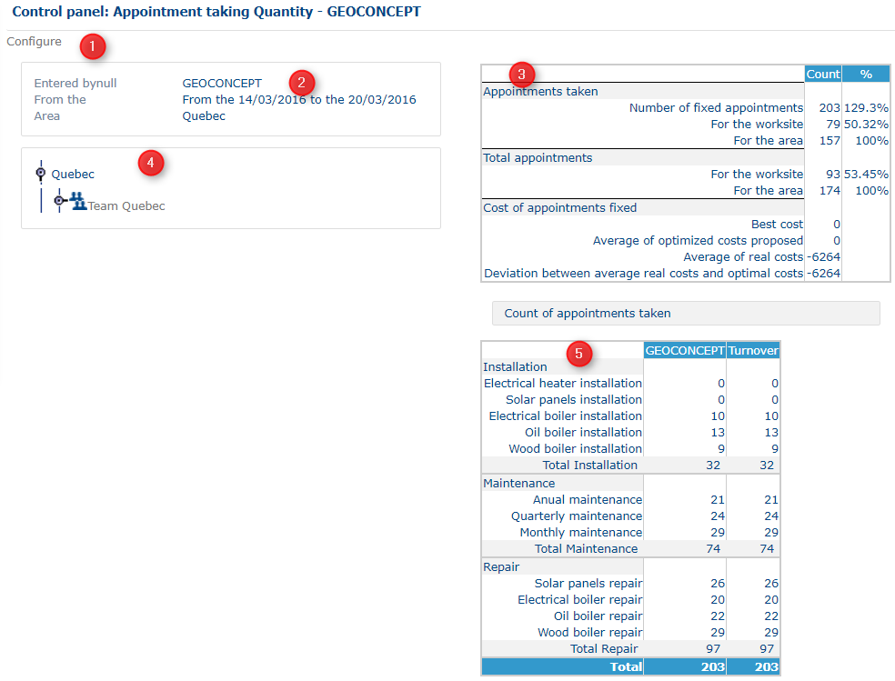

# Control Panel - Appointment taking Quantity

### Role

This page provides a summary table of statistical information on appointments in terms of quantity.

### Application

This table is divided up into five sections.

Control panel Appointment taking quantity

Click on Configure (1) to switch to the preceding [configuration](https://mynomadia.com/privatedoc/9LLcWh7j74sENa54/optitime-doc/docs/en/otgs-reference-book/config.html) step.

The section labelled (2) informs the user about the resource on which the table is to be calculated. The period of the date are displayed, as well as the area.

The table (3) in the right-hand part of the screen provides information concerning appointments and their quality (cost of appointments taken)

* **Number of appointments taken**: this will consist of manually made and optimized appointments made by the chosen resource. The number displayed is completed by a percentage
* **Total number of appointments on the site**: manually made and optimized appointments taken by all resources on the site
* **Total number of appointments for the area**: this is the sum of the two preceding values, the appointments taken by the resource connected, and those taken for the whole of the site.

The last value being 100, the two first values are expressed as a percentage.

In terms of quality, four indicators are calculated concerning costs. This information only concerns optimized appointments (and not those taken manually). Each time an appointment is taken, a cost is calculated as a function of the different constraints (time, unavailabilities). An appointment therefore has a real cost, and a best cost:

* **Best cost**: value for any appointment calculated that optimises the constraints. This value must tend towards the lowest value possible
* **Average of optimum costs suggested**: total of the best costs for appointments suggested during the taking of appointments corresponding to the period and to the resource configured, that you divide by the total number of appointments
* **Average of real costs**: this is the sum of costs calculated for each appointment taken for the period and for the configured resource, divided by the total number of appointments. When the latter two values are quite similar, this means that the resource who is taking the appointments places as much value as possible on making appointments at the best possible cost.
* **Gap between the average of real and optimum costs**: difference between the average of optimum costs suggested and the average of the real costs.

The hierarchical tree (4) shows all the resources for the reference area, structured in terms of teams. Clicking on each «entity», it will be possible to update the corresponding table (3). This hierarchical tree rolls out and rolls up.

The table labelled (5) summarises the number of appointments made and the turnover generated by intervention type.
