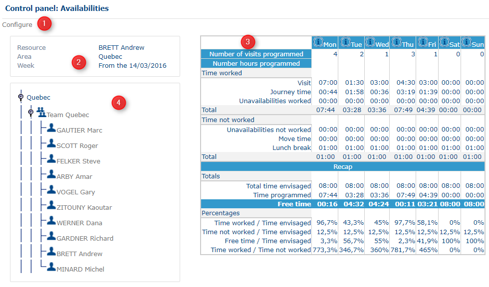

# Control Panel - Availabilities

### Role

This page proposes a summary table of the different unavailability's [configured](https://mynomadia.com/privatedoc/9LLcWh7j74sENa54/optitime-doc/docs/en/otgs-reference-book/config.html) previously.

### Application

The table of availabilities is in four parts.

Control panel for availabilities

1. Click **Configure (1)** to return to the previous configuration step.
2.  Section **(2)** displays a summary of the parameters configured for unavailabilities:

    * **Resource**, **team**, or **worksite** name.
    * **Reference area**.
    * **Current date**.

    The availability table displays information for the current day only.
3.  The table in section **(3)** displays all resources selected during the configuration. It provides the following information:

    * Number of **programmed visits**.
    * Number of **programmed hours**, broken down into visits, worked and non-worked unavailabilities, journey times, and free times.

    Time values are displayed in hours and minutes. The information is calculated for each day of the current week. The **total programmed hours** for each day do not include free time.
4. The hierarchical tree in section **(4)** displays all resources associated with the reference area, organized by team. Expand or collapse the tree as required. Select an entity to update the corresponding information in table **(3)**.
5. In some cases, alert messages are displayed above or within the table to notify the supervisor of specific situations that require attention.
