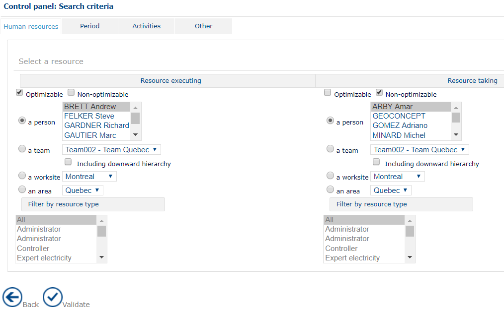
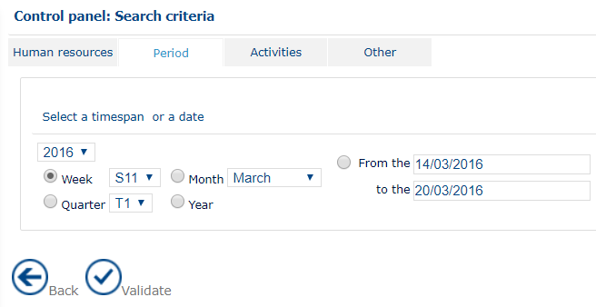
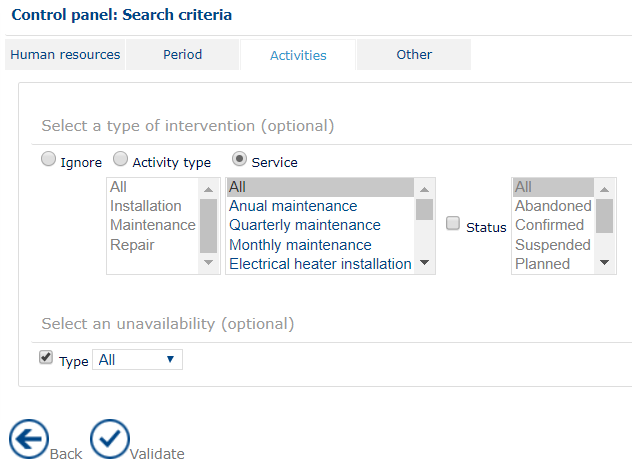
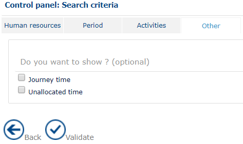

# Control Panel - Configure

### Role

Configuring the control panel is essential to fine tune the calculations the control panel will have to handle.

### Application

Configuring the control panel involves setting parameters for the different families of search criteria.

Configuration of the control panel

Validate button will mean the selected parameters are taken into account. The next step is to select a type of statistical table to apply the configuration established.

#### Human resources

Two resources need to be configured:

* The executive resource, that is the mobile resource
* The resource responsible for entering data on the system, that is the person saving the appointment in the application.

For each of these, several types of resource can be selected:

* **Optimizable** or **non-optimizable**
* **A person**: the drop-down list suggests all the supervisor resources connected, and from these, one must be selected
* **A team**: in the supervisor’s area, the list allows a choice of a team on which you might want to obtain statistics
* **A worksite**: several sites can exist in the reference area. The list allows you to filter the one on which you want to obtain information
* **An area**.

It is possible to filter the search results by type of resource. The type of resource will correspond to the type of post assigned for each resource.

#### Period

Configuring the control panel to define the period

Having selected the resources on which the supervisor wants to obtain information, five options enable filtering on the type of timespan:

* Date: having first selected the year, adjust as appropriate:
  * Week: each numbered week of the year is suggested;
  * Month: the twelve months of the year are suggested;
  * Quarter: the four, numbered, quarters of the year are available;
  * Year: the years 2000 to 2030 are accessible
* Period (From the…to the): two zones are reserved for activation of a calendar and choice of a personalized period.

|                                                                                   |     |
| --------------------------------------------------------------------------------- | --- |
| \[Tip]                                                                            | Tip |
| By default, the default values suggested are those corresponding to today’s date. |     |

#### Activities | Intervention type (optional)

Configuring the control panel for the types of interventions

* Select the **Ignore** check box to disable the selection of an intervention type.
* Select the **Activity type** check box to choose one or more activity types. Each activity type can include multiple intervention types. To select multiple activity types, hold **CTRL** or **SHIFT** while making your selections.
* The **Status** option is optional. Select the check box to filter interventions by status. You can select **Cancelled**, **Confirmed**, **Completed**, **Requested but unplanned**, or **Unplanned**.
* Select **Display all** to display the status of all information items based on the selected intervention type.

#### Activities | Unavailability (optional)

The different types of unavailability are suggested in a drop-down list. It is possible to select them all.

The **Type** check-box, when unchecked, will disable selection of an unavailability type.

#### Other

Two options may complete the control panel: calculation of journey time or free time.

Activation of journey time options and free time options

