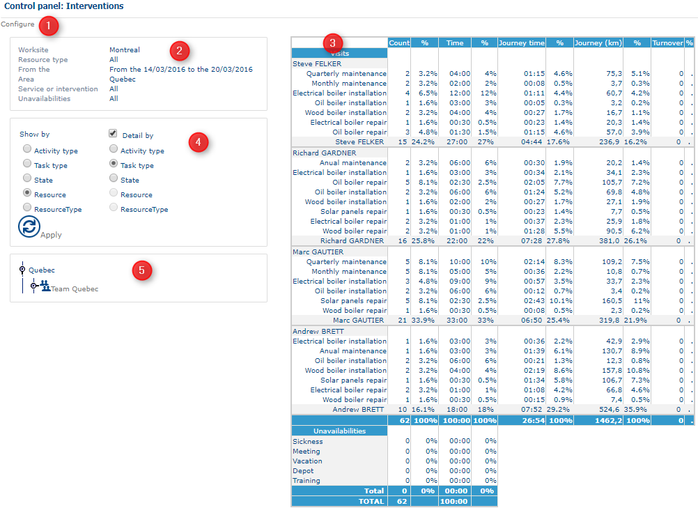

# Control Panel - Interventions

### Role

This page shows a summary table of different interventions [configured](https://mynomadia.com/privatedoc/9LLcWh7j74sENa54/optitime-doc/docs/en/otgs-reference-book/config.html) previously.

### Application

The table of interventions is divided up into five parts.

Interventions control panel

Click on Configure (1) to switch to the preceding [configuration](https://mynomadia.com/privatedoc/9LLcWh7j74sENa54/optitime-doc/docs/en/otgs-reference-book/config.html) step.

Section (2) summarises the series of parameters specified in the [configuration](https://mynomadia.com/privatedoc/9LLcWh7j74sENa54/optitime-doc/docs/en/otgs-reference-book/config.html) step.

The table in section **(3)** displays all interventions selected during the configuration, including **appointments** and **unavailabilities**, along with the selected time-related options, such as **journey time** and **free time**.

For each item, the table displays:

* The **number of appointments or unavailabilities**.
* The corresponding **time duration**, expressed in hours and minutes.
* The **percentage** of each intervention type based on the number of items and the total time.

The combined percentages of appointments and unavailabilities add up to **100%**.

**Journey time** and **free time** are displayed separately in a dedicated table. Journey time distinguishes between:

* Time spent travelling to **fulfilled appointments**.
* Expected journey time for **confirmed appointments** that are yet to be fulfilled.

Journey time is displayed in hours and minutes and is calculated based on the distance travelled using the road network.

**Free time** is added to complete the overall time distribution to **100%**.

The item labelled (4) allows the user to browse interventions according to several criteria, and to choose whether to look at the detail or not. Select first the type of display required:

* **Activity type** will enable retrieval of indicators for all intervention types making up an activity type;
* **Intervention type** returns indicators on each type of intervention;
* **Status** provides indicators as a function of the appointment’s status;
* **Resource** returns indicators on each resource from the same platform;
* **Resource type** allows you to obtain indicators by role type.

Next, you can display statistical indicators for each type of display. To obtain detailed indicators, it will be necesssary to check the **Detail by** check-box, and then select the type of detail required:

* **Activity type** only functions with the display by **Status** or **Resource** or **Resource type**;
* **Task type** functions with all displays, except **Task type**;
* **Status** functions with all displays except **Status**;
* **Resource** functions with all displays except **Resource**;
* **Resource type** functions with the display by **Activity type**, **Task type**, or **Status**.

Click on the  button to update the table (3).

The hierarchical tree presents all the resources form the reference area, organised by team. Clicking on each «entity», it is possible to update the corresponding table (3). This hierarchical tree rolls out and rolls up.

Sometimes, explicit alert messages can complete the table to inform the supervisor of a situation.

|                                                                                                              |     |
| ------------------------------------------------------------------------------------------------------------ | --- |
| \[Tip]                                                                                                       | Tip |
| The time spent corresponds to the number of hours and minutes worked in addition to the legal working hours. |     |
