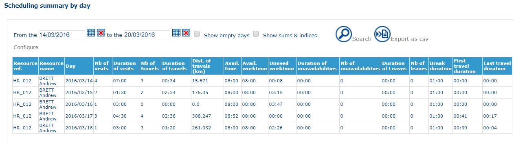

# Control Panel - Scheduling Summary by Day

### Role

This page shows a summary table of statistics linked to travel on the part of resources [configured](https://mynomadia.com/privatedoc/9LLcWh7j74sENa54/optitime-doc/docs/en/otgs-reference-book/config.html) previously (kilometers travelled, journey time, number of visits fulfilled, visit time, unused working time, etc).

### Application

First, you need to define the search period on plannings. The table display can be [reconfigured](https://mynomadia.com/privatedoc/9LLcWh7j74sENa54/optitime-doc/docs/en/otgs-reference-book/config.html) by clicking on Configure.

If the **Display empty days** check-box is checked, the table displays all plannings, even if they are empty.

If the **Display totals and indices** check-box is checked, the following columns are added to the table, and a total line is added at the end:

* Journey (kms)/nb of visits
* Travel duration/Visit duration
* Visit duration/Working time
* Period worked / Working hours

Summary of daily plannings

Click on the  button to run a search on plannings.\
Click on  to export the data from the table in a text file.
