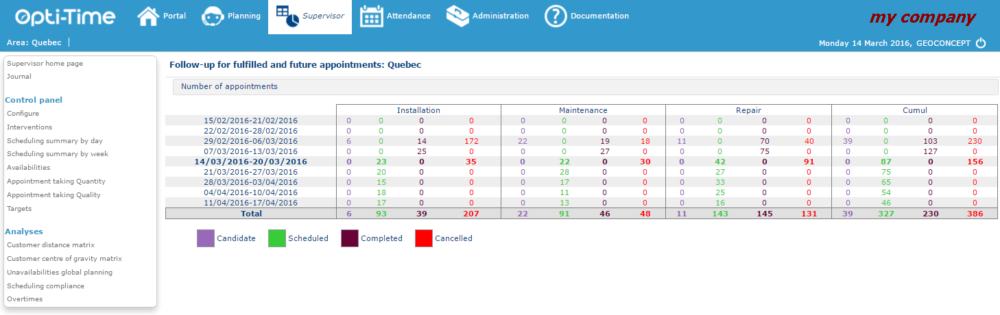

# Home Page

NFS supervisor module is accessed by clicking on the Supervisor tab in the blue toolbar at the top of the screen, or directly by entering the application if the [user profile](https://mynomadia.com/privatedoc/9LLcWh7j74sENa54/optitime-doc/docs/en/otgs-reference-book/donnees.html#RH-utilisateur) is configured to open Opti-Time on this module.

|                                                                                                                                                                                                                               |      |
| ----------------------------------------------------------------------------------------------------------------------------------------------------------------------------------------------------------------------------- | ---- |
| \[Note]                                                                                                                                                                                                                       | Note |
| You will need to be connected using a profile that has access to the supervisor role (see the chapter [Users](https://mynomadia.com/privatedoc/9LLcWh7j74sENa54/optitime-doc/docs/en/otgs-reference-book/utilisateurs.html)). |      |

Supervisor home page:

The Supervisor home page contains a menu (situated at the left of the screen) and a table (situated on the right of the screen).

### Menu

The Supervisor module menu comprises two parts:

* The [Control panel](https://mynomadia.com/privatedoc/9LLcWh7j74sENa54/optitime-doc/docs/en/otgs-reference-book/TDB.html) section: this section displays statistical summaries concerning appointments and unavailabilities, enabling tracking and steering of the mobile work force’s activities.
* The [Analyses](https://mynomadia.com/privatedoc/9LLcWh7j74sENa54/optitime-doc/docs/en/otgs-reference-book/distancier.html) section: this section generates reports and indicators on appointments completed, and on the sectorisation performed.

|                                                                                                                                                                                               |     |
| --------------------------------------------------------------------------------------------------------------------------------------------------------------------------------------------- | --- |
| \[Tip]                                                                                                                                                                                        | Tip |
| The reports contained in the "Control panel" section must be [configured](https://mynomadia.com/privatedoc/9LLcWh7j74sENa54/optitime-doc/docs/en/otgs-reference-book/config.html) beforehand. |     |

The menu contains the following items:

* [**Supervisor home page**](https://mynomadia.com/privatedoc/9LLcWh7j74sENa54/optitime-doc/docs/en/otgs-reference-book/supervision-accueil.html)
* [**Journal**](https://mynomadia.com/privatedoc/9LLcWh7j74sENa54/optitime-doc/docs/en/otgs-reference-book/journal.html)
* **Control panel**
  * [Configure](https://mynomadia.com/privatedoc/9LLcWh7j74sENa54/optitime-doc/docs/en/otgs-reference-book/config.html)
  * [Interventions](https://mynomadia.com/privatedoc/9LLcWh7j74sENa54/optitime-doc/docs/en/otgs-reference-book/intervention.html)
  * [Scheduling summary by day](https://mynomadia.com/privatedoc/9LLcWh7j74sENa54/optitime-doc/docs/en/otgs-reference-book/resume-jour.html)
  * [Scheduling summary by week](https://mynomadia.com/privatedoc/9LLcWh7j74sENa54/optitime-doc/docs/en/otgs-reference-book/resume-semaine.html)
  * [Availabilities](https://mynomadia.com/privatedoc/9LLcWh7j74sENa54/optitime-doc/docs/en/otgs-reference-book/dispo.html)
  * [Appointment taking Quantity](https://mynomadia.com/privatedoc/9LLcWh7j74sENa54/optitime-doc/docs/en/otgs-reference-book/rdv-quantite.html)
  * [Appointment taking Quality](https://mynomadia.com/privatedoc/9LLcWh7j74sENa54/optitime-doc/docs/en/otgs-reference-book/rdv-qualite.html)
  * [Targets](https://mynomadia.com/privatedoc/9LLcWh7j74sENa54/optitime-doc/docs/en/otgs-reference-book/objectif.html)
* **Analyses**
  * [Customer distance matrix](https://mynomadia.com/privatedoc/9LLcWh7j74sENa54/optitime-doc/docs/en/otgs-reference-book/distancier.html)
  * [Customer center of gravity matrix](https://mynomadia.com/privatedoc/9LLcWh7j74sENa54/optitime-doc/docs/en/otgs-reference-book/supervision-accueil.html)
  * [Unavailabilities global planning](https://mynomadia.com/privatedoc/9LLcWh7j74sENa54/optitime-doc/docs/en/otgs-reference-book/supervision-accueil.html)
  * [Scheduling compliance](https://mynomadia.com/privatedoc/9LLcWh7j74sENa54/optitime-doc/docs/en/otgs-reference-book/conformite.html)
  * [Overtimes](https://mynomadia.com/privatedoc/9LLcWh7j74sENa54/optitime-doc/docs/en/otgs-reference-book/heures-sup.html)

### Table

The right-hand section **Track past and future appointments** provides a weekly summary of the different appointments for the area.

By default, the table indicates the quantity of candidate, planned, fulfilled or cancelled appointments (cf. [Appointment statuses](https://mynomadia.com/privatedoc/9LLcWh7j74sENa54/optitime-doc/docs/en/otgs-reference-book/_the_different_statuses_for_appointments_in_opti_time.html#statuts)) in each type of intervention: however all these are entirely [configurable](https://mynomadia.com/privatedoc/9LLcWh7j74sENa54/optitime-doc/docs/en/otgs-reference-book/perso.html#config-appli).

By default, the table displays the number of appointments in the current week, for the 4 previous, and the 4 subsequent weeks.

At the extreme right of the table, a **Cumulated** column allows you to display the number of appointments, for all the intervention types taken together.

|                                                                                                                                                              |     |
| ------------------------------------------------------------------------------------------------------------------------------------------------------------ | --- |
| \[Tip]                                                                                                                                                       | Tip |
| The appointment statuses displayed, as well as the weeks corresponding to the lines on the table are all configurable. Contact your Opti-Time administrator. |     |

|                                                                                                                                                     |      |
| --------------------------------------------------------------------------------------------------------------------------------------------------- | ---- |
| \[Note]                                                                                                                                             | Note |
| You can return at any time to the Supervisor home page by clicking on the Supervisor home page link situated in the menu on the left of the screen. |      |
