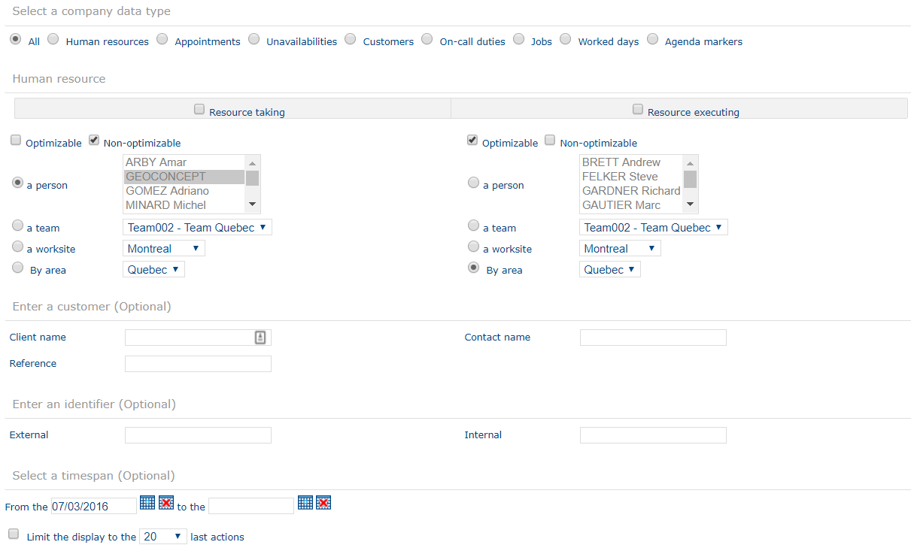
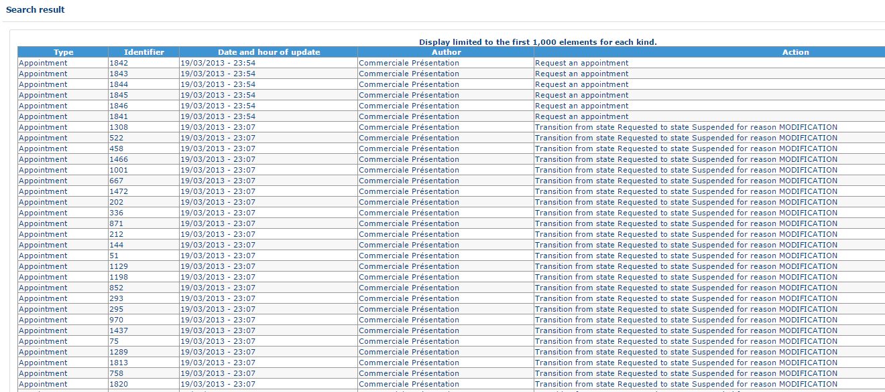
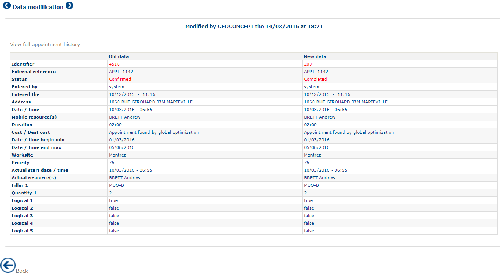
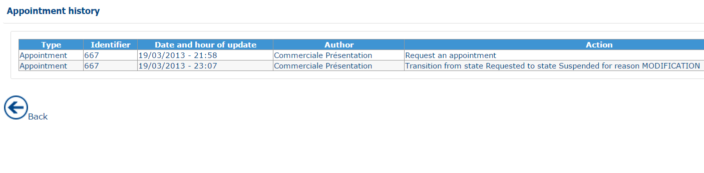

# Journal

Depending on the [rights](https://mynomadia.com/privatedoc/9LLcWh7j74sENa54/optitime-doc/docs/en/otgs-reference-book/utilisateurs.html#coll-droits) granted to the user, the journal allows you to consult the history of actions taken relating to human resources, appointments, unavailabilities, customers, on-call duties, jobs, worked days and agenda markers.

An entry in the journal corresponds to an **action** performed by à user (**resource taking**) on an **object** (see the list above) assigned as required to an **executive resource**.

A first filter page allows you to target the data to display according to criteria : action, taking resource, object characteristics, customer and executive resource.

Next, the list of filtered entries displays, enabling viewing of the modifications made to a given object.

### Journal home page

Access to the journal home page is via a click on the Journal in the Supervisor module menu.

Configuring the journal

Filters are divided into 5 sections.

#### Choice of company data type

This is the type of action performed by an Opti-Time user that has resulted in changes being made to an appointment, an unavailability, etc … or that has resulted in changes being applied to all these objects types.

An appointment can have the following statuses:

* _All_: displays all actions
* _Appointment planned:_ action of confirming an appointment (manual or automated)
* _Appointment unplanned_: the action of unplanning an appointment (manual or automated)
* _Appointment unplanned by an appointment_: appointment that has been reactivated or suspended following the registering of another appointment
* _Appointment unplanned by an unavailability_: appointment having been re-activated or suspended following the registering of an unavailability
* _Appointment accepted_
* _Reservation of planned appointment_
* _Confirmation of planned appointment_
* _Appointment withdrawn_
* _Appointment cancellation_: action of cancelling an appointment (manual or by batch)
* _Appointment cancelled by the client:_ action of cancelling an appointment by the client
* _Appointment cancelled by the company_: action of cancelling an appointment by the Opti-Time user
* _Appointment ignored_
* _Appointment completed as planned_
* _Appointment completed out of planning_;
* _Unplanned appointment completion_.

Other objects (unavailabilities, restrictions or constraints etc) the possible statuses are as follows:

* _All_: displays all actions
* _Object creation_: the action of creating an object
* _Object deletion_: the action of deleting an object

#### Human resource

You can filter on the **taking resources** (Opti-Time users) as well as on the **executive resources** (workers or technicians) by checking the corresponding check-boxes.

|                                                                                                                                                                                                                      |      |
| -------------------------------------------------------------------------------------------------------------------------------------------------------------------------------------------------------------------- | ---- |
| \[Note]                                                                                                                                                                                                              | Note |
| While all actions can be linked to one user (planning, modification, etc), the actions do not all relate to one resource (for example, modification of an appointment requested where there is no resource request). |      |

For a resource (taking or executing) several filters are available:

* **Mobile** or **Non-mobile**: allows you to filter defined resources as mobile or non-mobile in the [resource form](https://mynomadia.com/privatedoc/9LLcWh7j74sENa54/optitime-doc/docs/en/otgs-reference-book/donnees.html#RH-info);
* **a person**: allows you to designate the person or persons (using the CTRL or SHIFT keys) concerned (executing or taking);
* **a team**: allows you to select all resources belonging to a given team;
* **a worksite**: allows you to select all resources belonging to a given work site;
* **by area**: allows you to select all resources belonging to a given area.

|                                                                                                                                                                                                                           |      |
| ------------------------------------------------------------------------------------------------------------------------------------------------------------------------------------------------------------------------- | ---- |
| \[Note]                                                                                                                                                                                                                   | Note |
| To ensure that selection by area, team or person functions, the resources must be associated to a [team](https://mynomadia.com/privatedoc/9LLcWh7j74sENa54/optitime-doc/docs/en/otgs-reference-book/donnees.html#equipe). |      |

#### Enter a customer

* **Name of the customer**: corresponds to the business name as registered on the [customer form](https://mynomadia.com/privatedoc/9LLcWh7j74sENa54/optitime-doc/docs/en/otgs-reference-book/journal.html);
* **Contact name**: corresponds to the name of the main contact for this customer;
* **Reference**: corresponds to the customer’s [external reference](https://mynomadia.com/privatedoc/9LLcWh7j74sENa54/optitime-doc/docs/en/otgs-reference-book/_glossary.html#Extref).

#### Enter an identifier

* **External**: [external reference](https://mynomadia.com/privatedoc/9LLcWh7j74sENa54/optitime-doc/docs/en/otgs-reference-book/_glossary.html#Extref) of the modified object;
* **Internal**: internal reference of the modified object.

#### Choice of the period

The choice of the date is made by clicking on the calendars.

* **From the**: corresponds to the earliest date in the search period;
* **To the**: corresponds to the latest date of the search period;
* **Limit the display to the X last actions** allows you to display only the X last results returned.

#### Validation

The Validate button calculates and displays a table corresponding to the different configured criteria.

### Result of the search

Result of the search

The results are displayed in inverse chronological order.

The fields displayed are the following:

* **Type**: the type of object concerned;
* **Identifier**: internal identifier for the object;
* **Date and time of the modification**: date and time of the action that led to the modification of the object;
* **Author**: user responsible for the modification;
* **Action**: an action that led to the modification being made (for example: an appointment request).

### Visualisation of the action

Clicking on a line of the [search result](https://mynomadia.com/privatedoc/9LLcWh7j74sENa54/optitime-doc/docs/en/otgs-reference-book/journal.html#journal-resultat), you gain access to the various associated items of information.

Display of information items associated to a journal event

This table displays data associated to the event under a heading of "New data".\
The "Old The **Data** column is populated only when the status of an event changes, such as when a planned appointment is fulfilled or an unavailability is cancelled.

The table displays the user who modified the event, along with the **date and time** of the modification.

Click **See full appointment history** to view the complete history and lifecycle of the appointment.

Click on the  button to display the previous step, that is, the journal calculated as a function of selected parameters.
