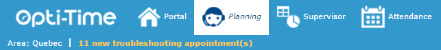
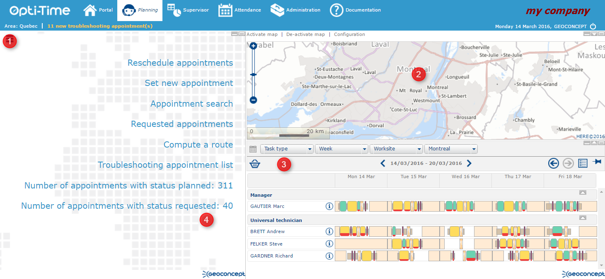

# Planning

The Planning module is an **NFS** planning module designed for planning personnel or on-line advisors, personal assistants. It can be used by resources working in the field as a visualisation tool. It serves to:

* take appointments manually or in an optimised form.&#x20;
* modify, reschedule or cancel appointments.&#x20;
* search for appointments taking many different criteria into account.&#x20;
* manage client portfolios thanks to an integrated CRM.&#x20;
* monitor the coherence of plannings via lists of warnings and alerts.&#x20;
* save visit reports for appointments, whether they are fulfilled or not.&#x20;
* save resources' unavailabilities
* consult plannings for the different structures within the organisation.&#x20;
* download and consult roadboooks.&#x20;
* manage types of post.&#x20;
* track vehicles in the field (tracking).&#x20;
* localise clients, appointments and routes on the map.&#x20;

Access the Planning module by clicking at the top left of the [site header](https://mynomadia.com/privatedoc/9LLcWh7j74sENa54/optitime-doc/docs/en/otgs-reference-book/bandeau.html).

Accessing the call centre

The Planning module is made up of four parts:

1. [Menu](https://mynomadia.com/privatedoc/9LLcWh7j74sENa54/optitime-doc/docs/en/otgs-reference-book/call-center-menu.html);
2. [Map](https://mynomadia.com/privatedoc/9LLcWh7j74sENa54/optitime-doc/docs/en/otgs-reference-book/call-center-carte.html);
3. [Planning](https://mynomadia.com/privatedoc/9LLcWh7j74sENa54/optitime-doc/docs/en/otgs-reference-book/call-center-agenda.html);
4. [Information display frame](https://mynomadia.com/privatedoc/9LLcWh7j74sENa54/optitime-doc/docs/en/otgs-reference-book/call-center-cadre-info.html).

The four panes making up the call centre

The three frames correspond to the map, the planning and the information display, and can all be resized using the buttons located at the top right of each frame .

*  allows you to stretch the frame downwards.&#x20;
*  allows you to stretch the frame upwards.&#x20;
*  allows you to hide the frame.&#x20;
*  allows you to display the frame in full screen mode.

Finally, the sides of the frames can be extended with the mouse giving you the option for manual resizing as required.

|                                                                                                                                                                                                                         |      |
| ----------------------------------------------------------------------------------------------------------------------------------------------------------------------------------------------------------------------- | ---- |
| \[Note]                                                                                                                                                                                                                 | Note |
| The default size of the frames is defined and initialized by the resizing of the cartographic pane in the `Maptool.xml` file. If these frames are then resized manually, their sizes will be saved in a browser cookie. |      |

We will start by describing the objects that make up the Planning module.
