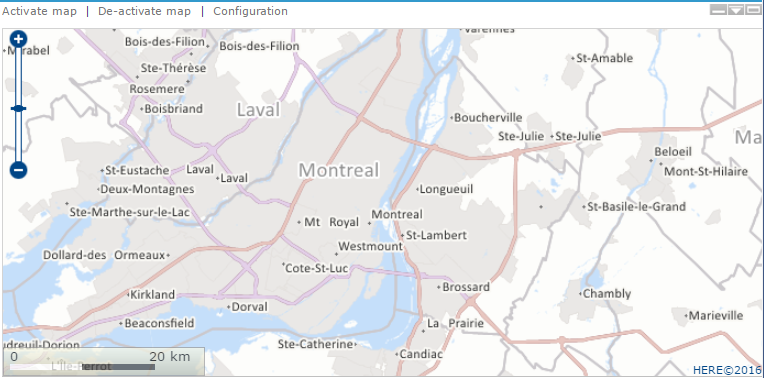
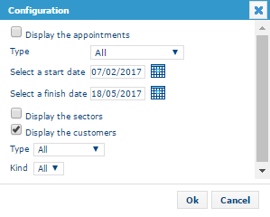
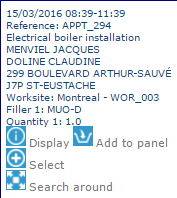
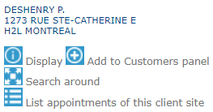

# Map

The map is situated in a frame reserved for this purpose at the top right of the Planning module screen. By default, this will be a background picture of a route from the Here geographic database.

|                                                                                                                                           |     |
| ----------------------------------------------------------------------------------------------------------------------------------------- | --- |
| \[Tip]                                                                                                                                    | Tip |
| The map of France installed by default also includes borderland countries such as Spain, Luxemburg, Switzerland, Germany, Italy, Belgium… |     |

### Navigation

Position the mouse pointer over the map. The cursor changes to a hand, allowing you to **pan** and move around the map.

You can **zoom in or zoom out** using the slider on the left side of the map or the **mouse wheel**.

A **scale** displayed at the bottom-left of the map indicates the current map scale and helps you estimate distances.

### Display

A series of buttons above the map allows you to **activate** or **deactivate** the map.

Use the **Configuration** function to select the information displayed on the map. The displayed information is automatically limited according to the **perimeter defined for the user**.

|                                                                                                                                                                        |      |
| ---------------------------------------------------------------------------------------------------------------------------------------------------------------------- | ---- |
| \[Note]                                                                                                                                                                | Note |
| This pane also serves to display a view from an external application or again, from an internet site, when the user clicks on a specific link in the information pane. |      |

**Display the appointments**

* Checking the **Display the appointments** check-box, it will be possible to display the appointments on the map. These appear in the form of points, coloured according to the [legend](https://mynomadia.com/privatedoc/9LLcWh7j74sENa54/optitime-doc/docs/en/otgs-reference-book/call-center-agenda.html#agenda-legende).
* When you click on an appointment in the map, the following tool-tip displays:

* The Display button displays the [appointment form](https://mynomadia.com/privatedoc/9LLcWh7j74sENa54/optitime-doc/docs/en/otgs-reference-book/call-center-objets.html#fiche-rdv).
* The Add to panel button adds the appointment to the [panel](https://mynomadia.com/privatedoc/9LLcWh7j74sENa54/optitime-doc/docs/en/otgs-reference-book/call-center-agenda.html#manipuler-une-intervention-a-partir-du-panier).
* The Select button adds the appointment to the [list of selected appointments](https://mynomadia.com/privatedoc/9LLcWh7j74sENa54/optitime-doc/docs/en/otgs-reference-book/call-center-carte.html).
* The Search around button [searches on objects nearby](https://mynomadia.com/privatedoc/9LLcWh7j74sENa54/optitime-doc/docs/en/otgs-reference-book/call-center-menu.html#rechercher-environs) the appointment.

**Display the sectors**

Checking **Display the sectors**, the locations for the [sectors](https://mynomadia.com/privatedoc/9LLcWh7j74sENa54/optitime-doc/docs/en/otgs-reference-book/donnees.html#secteur) display on the map.

|                                                                                                                                                                                                                   |         |
| ----------------------------------------------------------------------------------------------------------------------------------------------------------------------------------------------------------------- | ------- |
| \[Warning]                                                                                                                                                                                                        | Warning |
| For the display to function, you must have saved the towns in the form of at least one [sector](https://mynomadia.com/privatedoc/9LLcWh7j74sENa54/optitime-doc/docs/en/otgs-reference-book/donnees.html#secteur). |         |

**Display the customers**

* Checking **Display the customers**, the locations of the [customers](https://mynomadia.com/privatedoc/9LLcWh7j74sENa54/optitime-doc/docs/en/otgs-reference-book/call-center-objets.html#objets-clients) display on the map.
* Clicking on a customer in the map, the user can display the following tool-tip:

* The Display button displays the [customer form](https://mynomadia.com/privatedoc/9LLcWh7j74sENa54/optitime-doc/docs/en/otgs-reference-book/call-center-objets.html#fiche-client).
* The Add to customers panel button allows you to add the customer to the [panel](https://mynomadia.com/privatedoc/9LLcWh7j74sENa54/optitime-doc/docs/en/otgs-reference-book/call-center-menu.html#panier-des-clients).
* The Search around button enables a [search on objects nearby](https://mynomadia.com/privatedoc/9LLcWh7j74sENa54/optitime-doc/docs/en/otgs-reference-book/call-center-menu.html#rechercher-environs) the customer.

The List appointments for this client site button lists appointments created using this customer as a starting point.
