# Menu

The menu of the Planning module is run via the  button located at the top left of the screen. By default, the button is inactive and the menu is therefore hidden. To display it, simply move the mouse over it. The button changes colour  and the user can consult the menu functions.

|                                                                                                                                                                                                                                                                                  |      |
| -------------------------------------------------------------------------------------------------------------------------------------------------------------------------------------------------------------------------------------------------------------------------------- | ---- |
| \[Note]                                                                                                                                                                                                                                                                          | Note |
| Functions can be displayed or hidden by [rights](https://mynomadia.com/privatedoc/9LLcWh7j74sENa54/optitime-doc/docs/en/otgs-reference-book/utilisateurs.html#coll-droits). In this way, the number of items present in the menu may vary depending on the current user profile. |      |

The menu functions are as follows:

* [Change area](https://mynomadia.com/privatedoc/9LLcWh7j74sENa54/optitime-doc/docs/en/otgs-reference-book/call-center-menu.html#changer-region)
* [Set new appointment](https://mynomadia.com/privatedoc/9LLcWh7j74sENa54/optitime-doc/docs/en/otgs-reference-book/call-center-menu.html#prendre-nouveau-rdv)
* [Customers](https://mynomadia.com/privatedoc/9LLcWh7j74sENa54/optitime-doc/docs/en/otgs-reference-book/call-center-menu.html#menu-clients)
  * [Search for customers](https://mynomadia.com/privatedoc/9LLcWh7j74sENa54/optitime-doc/docs/en/otgs-reference-book/call-center-menu.html#menu-clients-rechercher)
  * [Create customer](https://mynomadia.com/privatedoc/9LLcWh7j74sENa54/optitime-doc/docs/en/otgs-reference-book/call-center-menu.html#menu-clients-creation)
  * [Customers panel](https://mynomadia.com/privatedoc/9LLcWh7j74sENa54/optitime-doc/docs/en/otgs-reference-book/call-center-menu.html#panier-des-clients)
  * [Customer alerts list](https://mynomadia.com/privatedoc/9LLcWh7j74sENa54/optitime-doc/docs/en/otgs-reference-book/call-center-menu.html)
  * [Generate periodic requests](https://mynomadia.com/privatedoc/9LLcWh7j74sENa54/optitime-doc/docs/en/otgs-reference-book/call-center-menu.html#generer-clients-recurr)
* [Resources management](https://mynomadia.com/privatedoc/9LLcWh7j74sENa54/optitime-doc/docs/en/otgs-reference-book/call-center-menu.html#gestion-intervenants)
  * [Temporary job management](https://mynomadia.com/privatedoc/9LLcWh7j74sENa54/optitime-doc/docs/en/otgs-reference-book/call-center-menu.html#gestion-postes-temp)
  * [Secondary worksites assignments management](https://mynomadia.com/privatedoc/9LLcWh7j74sENa54/optitime-doc/docs/en/otgs-reference-book/call-center-menu.html#affectation-sites-second)
  * [Display customers](https://mynomadia.com/privatedoc/9LLcWh7j74sENa54/optitime-doc/docs/en/otgs-reference-book/call-center-menu.html#visualiser-clients)
  * [On-call duty management](https://mynomadia.com/privatedoc/9LLcWh7j74sENa54/optitime-doc/docs/en/otgs-reference-book/call-center-menu.html#gestion-astreintes)
  * [Equipment assignments](https://mynomadia.com/privatedoc/9LLcWh7j74sENa54/optitime-doc/docs/en/otgs-reference-book/call-center-menu.html#affectation-materiel)
* [Sector management](https://mynomadia.com/privatedoc/9LLcWh7j74sENa54/optitime-doc/docs/en/otgs-reference-book/call-center-menu.html#gestion-secteurs)
* [Appointment search](https://mynomadia.com/privatedoc/9LLcWh7j74sENa54/optitime-doc/docs/en/otgs-reference-book/call-center-menu.html#rechercher-rdv)
* [Selected appointment list](https://mynomadia.com/privatedoc/9LLcWh7j74sENa54/optitime-doc/docs/en/otgs-reference-book/call-center-menu.html#lister-rdv-select)
* Requested, planned, reserved, confirmed, unplanned, externalized [appointments](https://mynomadia.com/privatedoc/9LLcWh7j74sENa54/optitime-doc/docs/en/otgs-reference-book/call-center-menu.html#chercher-rdv-etats)
* [My searches](https://mynomadia.com/privatedoc/9LLcWh7j74sENa54/optitime-doc/docs/en/otgs-reference-book/call-center-menu.html#mysearch)
* [Links between interventions](https://mynomadia.com/privatedoc/9LLcWh7j74sENa54/optitime-doc/docs/en/otgs-reference-book/call-center-menu.html#liaison-intervention)
* [Appointment alerts](https://mynomadia.com/privatedoc/9LLcWh7j74sENa54/optitime-doc/docs/en/otgs-reference-book/call-center-menu.html)
* [Customer gap](https://mynomadia.com/privatedoc/9LLcWh7j74sENa54/optitime-doc/docs/en/otgs-reference-book/call-center-menu.html#ecart-client)
* [Alerts on route duration](https://mynomadia.com/privatedoc/9LLcWh7j74sENa54/optitime-doc/docs/en/otgs-reference-book/call-center-menu.html#alertes-duree-trajet)
* [Application alerts](https://mynomadia.com/privatedoc/9LLcWh7j74sENa54/optitime-doc/docs/en/otgs-reference-book/call-center-menu.html#alertes)
* [Messaging service](https://mynomadia.com/privatedoc/9LLcWh7j74sENa54/optitime-doc/docs/en/otgs-reference-book/call-center-menu.html#messages)
* [Modify appointments in the past](https://mynomadia.com/privatedoc/9LLcWh7j74sENa54/optitime-doc/docs/en/otgs-reference-book/call-center-menu.html#modifier-rdv-passe)
* [Display planners](https://mynomadia.com/privatedoc/9LLcWh7j74sENa54/optitime-doc/docs/en/otgs-reference-book/call-center-menu.html#afficher-agendas)
* [Unavailabilities](https://mynomadia.com/privatedoc/9LLcWh7j74sENa54/optitime-doc/docs/en/otgs-reference-book/call-center-menu.html#gerer-indispos)
* [Unavailability search](https://mynomadia.com/privatedoc/9LLcWh7j74sENa54/optitime-doc/docs/en/otgs-reference-book/call-center-menu.html#rechercher-indispo)
* [Route sheet](https://mynomadia.com/privatedoc/9LLcWh7j74sENa54/optitime-doc/docs/en/otgs-reference-book/call-center-menu.html)
* [Exceptional locations](https://mynomadia.com/privatedoc/9LLcWh7j74sENa54/optitime-doc/docs/en/otgs-reference-book/call-center-menu.html)
* [Hotel locations](https://mynomadia.com/privatedoc/9LLcWh7j74sENa54/optitime-doc/docs/en/otgs-reference-book/call-center-menu.html#emplacement-hotel)
* [Locked day](https://mynomadia.com/privatedoc/9LLcWh7j74sENa54/optitime-doc/docs/en/otgs-reference-book/call-center-menu.html)
* [Manage agenda markers](https://mynomadia.com/privatedoc/9LLcWh7j74sENa54/optitime-doc/docs/en/otgs-reference-book/call-center-menu.html#gerer-jalons)
* [Vehicles tracking](https://mynomadia.com/privatedoc/9LLcWh7j74sENa54/optitime-doc/docs/en/otgs-reference-book/call-center-menu.html#suivi-vehicule)
* [Compute a route](https://mynomadia.com/privatedoc/9LLcWh7j74sENa54/optitime-doc/docs/en/otgs-reference-book/call-center-menu.html)
* [Convert coordinates into Lat/Lon](https://mynomadia.com/privatedoc/9LLcWh7j74sENa54/optitime-doc/docs/en/otgs-reference-book/call-center-menu.html#convertir-lat-lon)
* [Search around](https://mynomadia.com/privatedoc/9LLcWh7j74sENa54/optitime-doc/docs/en/otgs-reference-book/call-center-menu.html#rechercher-environs)
* [Check traffic for the schedule](https://mynomadia.com/privatedoc/9LLcWh7j74sENa54/optitime-doc/docs/en/otgs-reference-book/call-center-menu.html)
* [Predefined exports list](https://mynomadia.com/privatedoc/9LLcWh7j74sENa54/optitime-doc/docs/en/otgs-reference-book/call-center-menu.html#liste-exports-predef)
* [Custom reports](https://mynomadia.com/privatedoc/9LLcWh7j74sENa54/optitime-doc/docs/en/otgs-reference-book/call-center-menu.html#liste-rapports-predef)

### Change area

This function returns you to the [change area](https://mynomadia.com/privatedoc/9LLcWh7j74sENa54/optitime-doc/docs/en/otgs-reference-book/bandeau-changer-region.html) function in the header bar.

### Making a new appointment

This function allows you to make an appointment without revealing the identity of the customer.

Making an appointment - customer information

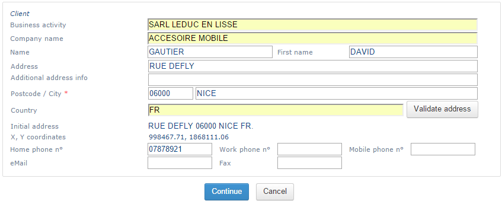

The time information is entered, this will be the information needed to identify the customer: their **name**, **company name** if needed, **name** and **first name** for a company contact, the full **address** of the site of the intended intervention, the different **telephone numbers**.

* The validation of the address is described in the [geocoding](https://mynomadia.com/privatedoc/9LLcWh7j74sENa54/optitime-doc/docs/en/otgs-reference-book/intro-geocodage.html) chapter.
* The Cancel button cancels the taking of the appointment.
* The Continue button takes you to the [qualification of the appointment](https://mynomadia.com/privatedoc/9LLcWh7j74sENa54/optitime-doc/docs/en/otgs-reference-book/call-center-objets.html#creation-rdv-demande) window.

|                                                                                 |      |
| ------------------------------------------------------------------------------- | ---- |
| \[Note]                                                                         | Note |
| The customer will be created on completion of the appointment taking operation. |      |

### Customers

In some companies, it is current practice to carry out maintenance visits or sales rounds for [customers](https://mynomadia.com/privatedoc/9LLcWh7j74sENa54/optitime-doc/docs/en/otgs-reference-book/call-center-objets.html#objets-clients) who are already known to the company. It can even happen that certain technicians are assigned by default to certain [customers](https://mynomadia.com/privatedoc/9LLcWh7j74sENa54/optitime-doc/docs/en/otgs-reference-book/call-center-objets.html#objets-clients). In order to avoid entering information that is already known about [customers](https://mynomadia.com/privatedoc/9LLcWh7j74sENa54/optitime-doc/docs/en/otgs-reference-book/call-center-objets.html#objets-clients), the application suggests saving a [customer](https://mynomadia.com/privatedoc/9LLcWh7j74sENa54/optitime-doc/docs/en/otgs-reference-book/call-center-objets.html#objets-clients) database to facilitate the taking of appointments.

The Customers menu presents the following options:

* [**Customer search**](https://mynomadia.com/privatedoc/9LLcWh7j74sENa54/optitime-doc/docs/en/otgs-reference-book/call-center-menu.html#menu-clients-rechercher)
* [**Create customer**](https://mynomadia.com/privatedoc/9LLcWh7j74sENa54/optitime-doc/docs/en/otgs-reference-book/call-center-menu.html#menu-clients-creation)
* [**Customers panel**](https://mynomadia.com/privatedoc/9LLcWh7j74sENa54/optitime-doc/docs/en/otgs-reference-book/call-center-menu.html#panier-des-clients)
* [**Customer alerts list**](https://mynomadia.com/privatedoc/9LLcWh7j74sENa54/optitime-doc/docs/en/otgs-reference-book/call-center-menu.html)
* [**Generate periodic requests**](https://mynomadia.com/privatedoc/9LLcWh7j74sENa54/optitime-doc/docs/en/otgs-reference-book/call-center-menu.html#generer-clients-recurr)

#### Customer search

* The principle of the search functions is described in the [Search in the Planning module](https://mynomadia.com/privatedoc/9LLcWh7j74sENa54/optitime-doc/docs/en/otgs-reference-book/call-center-objets.html#call-center-recherche) chapter.
* The search fields are described in the [customer form](https://mynomadia.com/privatedoc/9LLcWh7j74sENa54/optitime-doc/docs/en/otgs-reference-book/call-center-objets.html#fiche-client).
* This page allows you to [create](https://mynomadia.com/privatedoc/9LLcWh7j74sENa54/optitime-doc/docs/en/otgs-reference-book/call-center-objets.html#call-center-creer) or modify a customer.

In the page header, depending on the configuration, a series of links serve to:

* [Show Customers panel](https://mynomadia.com/privatedoc/9LLcWh7j74sENa54/optitime-doc/docs/en/otgs-reference-book/call-center-menu.html#panier-des-clients)
* [Orderer search](https://mynomadia.com/privatedoc/9LLcWh7j74sENa54/optitime-doc/docs/en/otgs-reference-book/call-center-menu.html#rechercher-commanditaire)
* [Customer type search](https://mynomadia.com/privatedoc/9LLcWh7j74sENa54/optitime-doc/docs/en/otgs-reference-book/call-center-menu.html#rechercher-type-client)
* [Customer kind search](https://mynomadia.com/privatedoc/9LLcWh7j74sENa54/optitime-doc/docs/en/otgs-reference-book/call-center-menu.html#rechercher-nature-client)

**Result of the search**

Table of results

After running the search, a count on the number of lines is suggested as well as the count on lines displayed.

|                                                                                                                                                          |     |
| -------------------------------------------------------------------------------------------------------------------------------------------------------- | --- |
| \[Tip]                                                                                                                                                   | Tip |
| The display limit is [configurable](https://mynomadia.com/privatedoc/9LLcWh7j74sENa54/optitime-doc/docs/en/otgs-reference-book/perso.html#config-appli). |     |

The table has the same [basic functionalities](https://mynomadia.com/privatedoc/9LLcWh7j74sENa54/optitime-doc/docs/en/otgs-reference-book/call-center-objets.html#call-center-recherche) as the other tables in Opti-Time.

|                                                                                                    |     |
| -------------------------------------------------------------------------------------------------- | --- |
| \[Tip]                                                                                             | Tip |
| The buttons located in the table header allow you to apply operations to all objects in the table. |     |

The presence of buttons on each line in the table serves to apply certain actions without having to enter in the customer form. Here are a few of the possible actions:

* The  button allows you to add the customer to the panel;
* The  button serves to make an appointment with the customer, at which point you are redirected to the [qualification of the appointment](https://mynomadia.com/privatedoc/9LLcWh7j74sENa54/optitime-doc/docs/en/otgs-reference-book/call-center-objets.html#creation-rdv-demande) page;
* The  button localises the customer on the [map](https://mynomadia.com/privatedoc/9LLcWh7j74sENa54/optitime-doc/docs/en/otgs-reference-book/call-center-carte.html);
*   The  button lists all the appointments for the customer;

    The list of appointments for this customer then display:

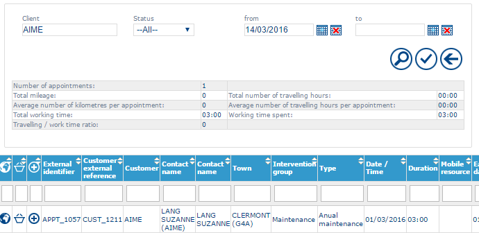

The first part allows you to [refine the search](https://mynomadia.com/privatedoc/9LLcWh7j74sENa54/optitime-doc/docs/en/otgs-reference-book/call-center-objets.html#recherche-generique-filtre).

The second part presents statistics on all appointments displayed (**Number of appointments**, **Number of kilometers travelled**, **Working hours**, etc.)

Finally, the list of appointments allows you to display the [appointment form](https://mynomadia.com/privatedoc/9LLcWh7j74sENa54/optitime-doc/docs/en/otgs-reference-book/call-center-objets.html#fiche-rdv) by clicking on one line of the [result](https://mynomadia.com/privatedoc/9LLcWh7j74sENa54/optitime-doc/docs/en/otgs-reference-book/call-center-objets.html#call-center-resultat).

To display the [customer form](https://mynomadia.com/privatedoc/9LLcWh7j74sENa54/optitime-doc/docs/en/otgs-reference-book/call-center-objets.html#fiche-client), click on the corresponding line in the table of results.

#### Searching for the company orderer

This function allows you to [create](https://mynomadia.com/privatedoc/9LLcWh7j74sENa54/optitime-doc/docs/en/otgs-reference-book/call-center-objets.html#call-center-creer), modify, or delete an orderer ([see the customer form](https://mynomadia.com/privatedoc/9LLcWh7j74sENa54/optitime-doc/docs/en/otgs-reference-book/call-center-objets.html#type-client-fiche)).

Purchasing orderer search window

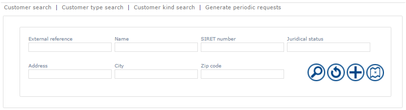

The principle of the search functions is described in the [Search in the Planning module](https://mynomadia.com/privatedoc/9LLcWh7j74sENa54/optitime-doc/docs/en/otgs-reference-book/call-center-objets.html#call-center-recherche) chapter.

The search fields are described in the [orderer form](https://mynomadia.com/privatedoc/9LLcWh7j74sENa54/optitime-doc/docs/en/otgs-reference-book/call-center-objets.html#fiche-commanditaire).

Click on the [orderer](https://mynomadia.com/privatedoc/9LLcWh7j74sENa54/optitime-doc/docs/en/otgs-reference-book/call-center-objets.html#commanditaire) in the list to go back to the corresponding [form](https://mynomadia.com/privatedoc/9LLcWh7j74sENa54/optitime-doc/docs/en/otgs-reference-book/call-center-objets.html#fiche-commanditaire).

The  button returns you to the [orderer form](https://mynomadia.com/privatedoc/9LLcWh7j74sENa54/optitime-doc/docs/en/otgs-reference-book/call-center-objets.html#fiche-commanditaire) in creation mode.

#### Search on a customer type

This function allows you to search, [create](https://mynomadia.com/privatedoc/9LLcWh7j74sENa54/optitime-doc/docs/en/otgs-reference-book/call-center-objets.html#call-center-creer) or change a customer type.

Searching on customer types

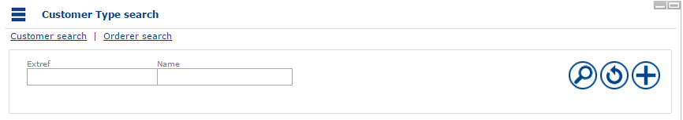

The principle of the search functions is described in the [Search in the Planning module](https://mynomadia.com/privatedoc/9LLcWh7j74sENa54/optitime-doc/docs/en/otgs-reference-book/call-center-objets.html#call-center-recherche) chapter.

The search fields are described in the [customer type form](https://mynomadia.com/privatedoc/9LLcWh7j74sENa54/optitime-doc/docs/en/otgs-reference-book/call-center-objets.html#type-client-fiche).

The  button allows you to add a new customer type. This returns you to the [customer type form](https://mynomadia.com/privatedoc/9LLcWh7j74sENa54/optitime-doc/docs/en/otgs-reference-book/call-center-objets.html#type-client-fiche) in creation mode.

#### Search on customer kind

This function allows you to search, [create](https://mynomadia.com/privatedoc/9LLcWh7j74sENa54/optitime-doc/docs/en/otgs-reference-book/call-center-objets.html#call-center-creer) or change a customer according to its kind.

Search on customer kind

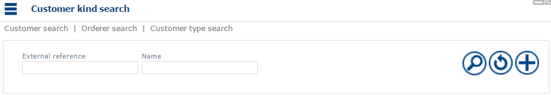

The principle of the search functions is described in the [Search in the Planning module](https://mynomadia.com/privatedoc/9LLcWh7j74sENa54/optitime-doc/docs/en/otgs-reference-book/call-center-objets.html#call-center-recherche) chapter.

The search fields are described in the [customer kind form](https://mynomadia.com/privatedoc/9LLcWh7j74sENa54/optitime-doc/docs/en/otgs-reference-book/call-center-objets.html#nature-client-fiche).

The  button serves to add a new customer kind. This takes you back to the [customer kind form](https://mynomadia.com/privatedoc/9LLcWh7j74sENa54/optitime-doc/docs/en/otgs-reference-book/call-center-objets.html#nature-client-fiche) in creation mode.

#### Create customer

This page allows you to [create](https://mynomadia.com/privatedoc/9LLcWh7j74sENa54/optitime-doc/docs/en/otgs-reference-book/call-center-objets.html#fiche-client) a customer.

In the page header, depending on the configuration, a series of links serve to:

* [Customer search](https://mynomadia.com/privatedoc/9LLcWh7j74sENa54/optitime-doc/docs/en/otgs-reference-book/call-center-menu.html#menu-clients-rechercher)
* [Show Customers panel](https://mynomadia.com/privatedoc/9LLcWh7j74sENa54/optitime-doc/docs/en/otgs-reference-book/call-center-menu.html#panier-des-clients)

#### Customers panel

This page allows you to assign actions to a selection of customers:

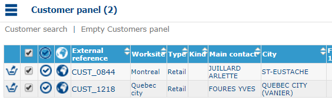

The [search result](https://mynomadia.com/privatedoc/9LLcWh7j74sENa54/optitime-doc/docs/en/otgs-reference-book/call-center-objets.html#call-center-resultat) presents the customers in the panel.

Clicking on a line, you can access the [customer form](https://mynomadia.com/privatedoc/9LLcWh7j74sENa54/optitime-doc/docs/en/otgs-reference-book/call-center-objets.html#fiche-client).

* The Customer search link takes you back to the [customer search](https://mynomadia.com/privatedoc/9LLcWh7j74sENa54/optitime-doc/docs/en/otgs-reference-book/call-center-menu.html#menu-clients-rechercher) function;
* The Empty panel link removes the appointments from the customer panel;
* The  button removes an appointment selected in the customer panel;
* The  button allows you to deselect appointments;
* The  button allows you to make an appointment with the customer, and then be sent back to the [qualification of the appointment](https://mynomadia.com/privatedoc/9LLcWh7j74sENa54/optitime-doc/docs/en/otgs-reference-book/call-center-objets.html#creation-rdv-demande) page. If you click on this button in the header of the result table, you can access the [set appointment for several customers](https://mynomadia.com/privatedoc/9LLcWh7j74sENa54/optitime-doc/docs/en/otgs-reference-book/call-center-menu.html#prise-rdv-clients-multiple) function.
* The  button displays the customer(s) on the map.

#### Making appointments for several customers

This function is only accessible from the [customer panel](https://mynomadia.com/privatedoc/9LLcWh7j74sENa54/optitime-doc/docs/en/otgs-reference-book/call-center-menu.html#panier-des-clients).

Making appointments for several customers

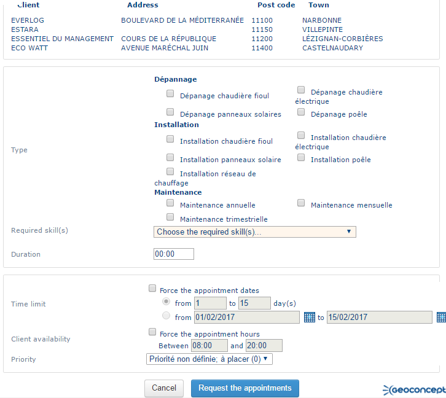

A first section reminds you of the list of customers concerned.

The second part presents the same fields as the [qualification of the appointment](https://mynomadia.com/privatedoc/9LLcWh7j74sENa54/optitime-doc/docs/en/otgs-reference-book/call-center-objets.html#creation-rdv-demande).

* The Cancel button allows you to return to the customer panel;
* The Request appointments button creates appointments with a _Requested_ [status](https://mynomadia.com/privatedoc/9LLcWh7j74sENa54/optitime-doc/docs/en/otgs-reference-book/_the_different_statuses_for_appointments_in_opti_time.html#statuts).

A [table](https://mynomadia.com/privatedoc/9LLcWh7j74sENa54/optitime-doc/docs/en/otgs-reference-book/call-center-objets.html#call-center-resultat) summarizes the appointments created:

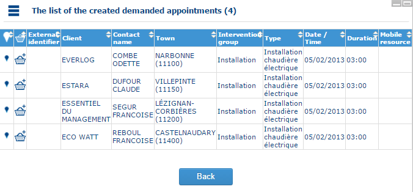

From this list, you can add the requested appointments to the [panel](https://mynomadia.com/privatedoc/9LLcWh7j74sENa54/optitime-doc/docs/en/otgs-reference-book/call-center-agenda.html#manipuler-une-intervention-a-partir-du-panier) by clicking on the panel opposite an appointment or in the table header.

The Back button allows you to go back to the customer panel.

#### List of customers on alert

See the chapter on [List of customer alerts](https://mynomadia.com/privatedoc/9LLcWh7j74sENa54/optitime-doc/docs/en/otgs-reference-book/_the_header_bar.html#liste-clients-urgent) in the header bar.

#### Generate periodic requests

This page enables automated generation of visits for customers as a function of a predefined visiting period.

Generation of recurring visits

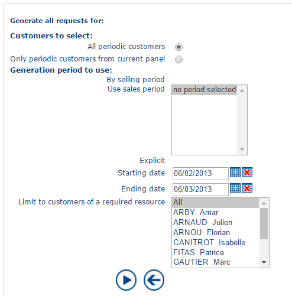

The visit generation page contains the following fields:

* **Customers to select**
  * All recurring customers: all customers for whom the _recurring customer_ check-box in the [customer form](https://mynomadia.com/privatedoc/9LLcWh7j74sENa54/optitime-doc/docs/en/otgs-reference-book/call-center-objets.html#fiche-client-projet) is checked, will be selected.
  * Recurring customers in the panel only: only customers present in the [customer panel](https://mynomadia.com/privatedoc/9LLcWh7j74sENa54/optitime-doc/docs/en/otgs-reference-book/call-center-menu.html#panier-des-clients) and for whom the _regular customer_ check-box in the [customer form](https://mynomadia.com/privatedoc/9LLcWh7j74sENa54/optitime-doc/docs/en/otgs-reference-book/call-center-objets.html#fiche-client-projet) is checked will be selected.
* **Generation period to use**
  * By sales period: the generation will be applied to the selected [sales periods](https://mynomadia.com/privatedoc/9LLcWh7j74sENa54/optitime-doc/docs/en/otgs-reference-book/donnees.html#periode-vente).
  * Explicit: the generation will be between the **period start date** and the **period end date** as selected.
* **Limit to customers of a required resource**: the generation will be limited to those customers who have the resource selected as a required resource in the [customer form](https://mynomadia.com/privatedoc/9LLcWh7j74sENa54/optitime-doc/docs/en/otgs-reference-book/call-center-objets.html#fiche-client-affectation).

The  button allows you to run the generation of visits between the two dates.

The  button takes you back to the previous page.

|                                                                                                                                                                                                                                  |     |
| -------------------------------------------------------------------------------------------------------------------------------------------------------------------------------------------------------------------------------- | --- |
| \[Tip]                                                                                                                                                                                                                           | Tip |
| The generation will be applied according to the settings defined in the [customer form](https://mynomadia.com/privatedoc/9LLcWh7j74sENa54/optitime-doc/docs/en/otgs-reference-book/call-center-objets.html#fiche-client-projet). |     |

### Managing resources

The resource management part includes the following functions:

* [temporary job management](https://mynomadia.com/privatedoc/9LLcWh7j74sENa54/optitime-doc/docs/en/otgs-reference-book/call-center-menu.html#gestion-postes-temp)
* [secondary worksites assignments management](https://mynomadia.com/privatedoc/9LLcWh7j74sENa54/optitime-doc/docs/en/otgs-reference-book/call-center-menu.html#affectation-sites-second)
* [display customers](https://mynomadia.com/privatedoc/9LLcWh7j74sENa54/optitime-doc/docs/en/otgs-reference-book/call-center-menu.html#visualiser-clients)
* [on-call duty management](https://mynomadia.com/privatedoc/9LLcWh7j74sENa54/optitime-doc/docs/en/otgs-reference-book/call-center-menu.html#gestion-astreintes)
* [equipment assignements](https://mynomadia.com/privatedoc/9LLcWh7j74sENa54/optitime-doc/docs/en/otgs-reference-book/call-center-menu.html#affectation-materiel)

#### Handling of temporary posts

This page allows the user to search, [create](https://mynomadia.com/privatedoc/9LLcWh7j74sENa54/optitime-doc/docs/en/otgs-reference-book/call-center-objets.html#call-center-creer), modify or [delete](https://mynomadia.com/privatedoc/9LLcWh7j74sENa54/optitime-doc/docs/en/otgs-reference-book/call-center-objets.html#call-center-supprimer) the [temporary posts](https://mynomadia.com/privatedoc/9LLcWh7j74sENa54/optitime-doc/docs/en/otgs-reference-book/call-center-objets.html#objets-postes-temp) of resources.

Main page for managing temporary posts

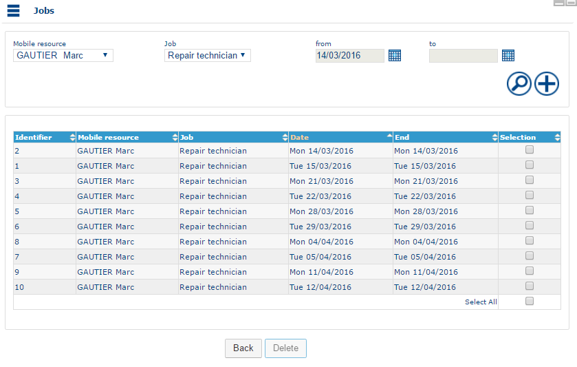

The principle of the search functions is described in the [Search in the Planning module](https://mynomadia.com/privatedoc/9LLcWh7j74sENa54/optitime-doc/docs/en/otgs-reference-book/call-center-objets.html#call-center-recherche) chapter.

The search fields are described in the [temporary post form](https://mynomadia.com/privatedoc/9LLcWh7j74sENa54/optitime-doc/docs/en/otgs-reference-book/call-center-objets.html#fiche-poste-temporaire).

The  button serves to add a new temporary post. It returns you to the [form](https://mynomadia.com/privatedoc/9LLcWh7j74sENa54/optitime-doc/docs/en/otgs-reference-book/call-center-objets.html#fiche-poste-temporaire) in creation mode.

#### Assignment of secondary worksites

* This page allows you to search, [create](https://mynomadia.com/privatedoc/9LLcWh7j74sENa54/optitime-doc/docs/en/otgs-reference-book/call-center-menu.html), modify or [delete](https://mynomadia.com/privatedoc/9LLcWh7j74sENa54/optitime-doc/docs/en/otgs-reference-book/call-center-menu.html) the [secondary worksites](https://mynomadia.com/privatedoc/9LLcWh7j74sENa54/optitime-doc/docs/en/otgs-reference-book/call-center-objets.html#objets-sites-second) of resources.
* The search page contains [search](https://mynomadia.com/privatedoc/9LLcWh7j74sENa54/optitime-doc/docs/en/otgs-reference-book/call-center-objets.html#call-center-recherche) fields as well as a list of worksites that have already been saved.
* The search fields are described in the [secondary worksite form](https://mynomadia.com/privatedoc/9LLcWh7j74sENa54/optitime-doc/docs/en/otgs-reference-book/call-center-objets.html#fiche-site-second).
* Click on a line in the table to access the [secondary worksite form](https://mynomadia.com/privatedoc/9LLcWh7j74sENa54/optitime-doc/docs/en/otgs-reference-book/call-center-objets.html#fiche-site-second) in modification mode.
* The  button adds a new secondary site. It returns the [secondary worksite](https://mynomadia.com/privatedoc/9LLcWh7j74sENa54/optitime-doc/docs/en/otgs-reference-book/call-center-objets.html#fiche-site-second) in creation mode.

#### View customers

This page allows you to see customers assigned to the resource selected in the drop-down list.

The search page contains [search](https://mynomadia.com/privatedoc/9LLcWh7j74sENa54/optitime-doc/docs/en/otgs-reference-book/call-center-objets.html#call-center-recherche) fields as well as a list of on-call duties that have already been saved.

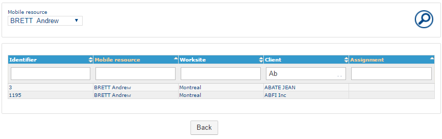

#### On-call duty management

* This page allows you to search, [create](https://mynomadia.com/privatedoc/9LLcWh7j74sENa54/optitime-doc/docs/en/otgs-reference-book/call-center-objets.html#call-center-creer), modify or [delete](https://mynomadia.com/privatedoc/9LLcWh7j74sENa54/optitime-doc/docs/en/otgs-reference-book/call-center-objets.html#call-center-supprimer) [on-call duty items](https://mynomadia.com/privatedoc/9LLcWh7j74sENa54/optitime-doc/docs/en/otgs-reference-book/call-center-objets.html#objets-astreinte) for resources.
* The search page contains [search](https://mynomadia.com/privatedoc/9LLcWh7j74sENa54/optitime-doc/docs/en/otgs-reference-book/call-center-objets.html#call-center-recherche) fields as well as a list of on-call duties that have already been saved.
* The search fields are described in the [on-call duty form](https://mynomadia.com/privatedoc/9LLcWh7j74sENa54/optitime-doc/docs/en/otgs-reference-book/call-center-objets.html#fiche-astreinte).
* Click on a line in the table to access the [on-call duty form](https://mynomadia.com/privatedoc/9LLcWh7j74sENa54/optitime-doc/docs/en/otgs-reference-book/call-center-objets.html#fiche-astreinte) in modification mode.
* The  button allows you to add a new on-call duty. It returns the user to the [on-call duty form](https://mynomadia.com/privatedoc/9LLcWh7j74sENa54/optitime-doc/docs/en/otgs-reference-book/call-center-objets.html#fiche-astreinte) in creation mode.

#### Equipment assignments

* This page allows the user to search, [create](https://mynomadia.com/privatedoc/9LLcWh7j74sENa54/optitime-doc/docs/en/otgs-reference-book/call-center-objets.html#call-center-creer), edit or [delete](https://mynomadia.com/privatedoc/9LLcWh7j74sENa54/optitime-doc/docs/en/otgs-reference-book/call-center-objets.html#call-center-supprimer) an assignment between previously created [equipment](https://mynomadia.com/privatedoc/9LLcWh7j74sENa54/optitime-doc/docs/en/otgs-reference-book/donnees.html#materiel) and existing [resources](https://mynomadia.com/privatedoc/9LLcWh7j74sENa54/optitime-doc/docs/en/otgs-reference-book/donnees.html#RH).
* The search page contains [search](https://mynomadia.com/privatedoc/9LLcWh7j74sENa54/optitime-doc/docs/en/otgs-reference-book/call-center-objets.html#recherche-generique-filtre) fields and a list of pre-saved assignments.

### Sector management

The next page opens or closes sectors.

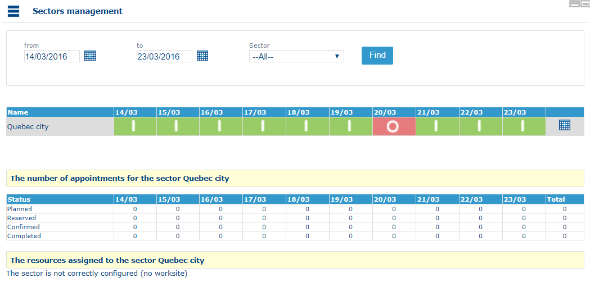

* The first part allows you to [refine the search](https://mynomadia.com/privatedoc/9LLcWh7j74sENa54/optitime-doc/docs/en/otgs-reference-book/call-center-objets.html#recherche-generique-filtre) on sectors by selecting the dates along with a sector.
* In the list of sectors, sectors that are closed over the period are in red, while open sectors are in green.\
  To close / open a sector, simply click on an open / closed sector.
* To define an opening / closing timeslot you can click on the  button.\
  It is then possible to define an opening / closing period:

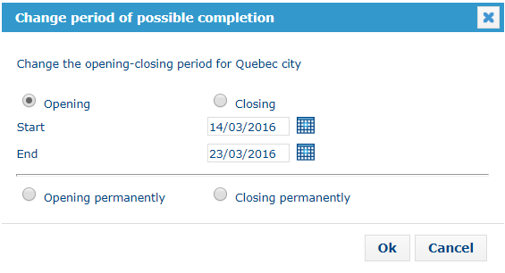

Finally, two tables at the bottom of the page display the number of appointments and resources for the sector selected in the list of sectors.

|                                                                                                           |         |
| --------------------------------------------------------------------------------------------------------- | ------- |
| \[Warning]                                                                                                | Warning |
| It will not be possible to plan any appointments if the sector is closed, except in manual planning mode. |         |

### Searching for an appointment

This page serves to search for one or several [appointments](https://mynomadia.com/privatedoc/9LLcWh7j74sENa54/optitime-doc/docs/en/otgs-reference-book/call-center-objets.html#objets-rdv) as a function of known data on these appointments.

|                                                                                                                                                                                                              |     |
| ------------------------------------------------------------------------------------------------------------------------------------------------------------------------------------------------------------ | --- |
| \[Tip]                                                                                                                                                                                                       | Tip |
| Only appointments in the same [area](https://mynomadia.com/privatedoc/9LLcWh7j74sENa54/optitime-doc/docs/en/otgs-reference-book/call-center-menu.html#changer-region) as the one selected will be displayed. |     |

|                                                                                                                                                 |     |
| ----------------------------------------------------------------------------------------------------------------------------------------------- | --- |
| \[Tip]                                                                                                                                          | Tip |
| You can save search criteria by clicking at the top on Recent searches. This tool also lets you reload an earlier search, delete, or rename it. |     |

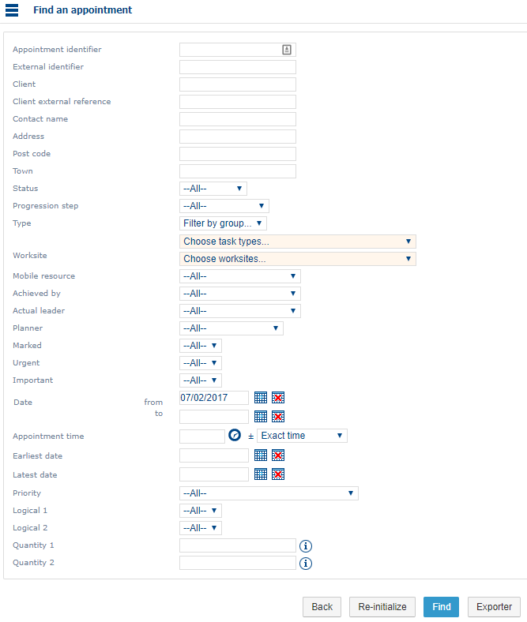

* The principle of the search functions is described in the [Search in the Planning module](https://mynomadia.com/privatedoc/9LLcWh7j74sENa54/optitime-doc/docs/en/otgs-reference-book/call-center-objets.html#call-center-recherche) chapter.
* Search fields can be customised in the [Application Configuration](https://mynomadia.com/privatedoc/9LLcWh7j74sENa54/optitime-doc/docs/en/otgs-reference-book/perso.html#config-appli), and are described in the [appointment form](https://mynomadia.com/privatedoc/9LLcWh7j74sENa54/optitime-doc/docs/en/otgs-reference-book/call-center-objets.html#fiche-rdv).

**Result of the search**

Table of results

|                                                                                                             |     |
| ----------------------------------------------------------------------------------------------------------- | --- |
| \[Tip]                                                                                                      | Tip |
| The buttons located in the table header allow you to apply various actions on all the objects in the table. |     |

The presence of buttons on each line in the table serves to apply certain actions without having to enter in the appointment form. Here are a few of the possible actions:

* The  button serves to add the appointment to the [list of selected appointments](https://mynomadia.com/privatedoc/9LLcWh7j74sENa54/optitime-doc/docs/en/otgs-reference-book/call-center-menu.html#lister-rdv-select);
* The  button serves to locate the appointment in the [map](https://mynomadia.com/privatedoc/9LLcWh7j74sENa54/optitime-doc/docs/en/otgs-reference-book/call-center-carte.html);
* The  button will add this intervention to the [panel](https://mynomadia.com/privatedoc/9LLcWh7j74sENa54/optitime-doc/docs/en/otgs-reference-book/call-center-agenda.html#manipuler-une-intervention-a-partir-du-panier).

Clicking on one of the appointments found opens the [form](https://mynomadia.com/privatedoc/9LLcWh7j74sENa54/optitime-doc/docs/en/otgs-reference-book/call-center-menu.html).

### List selected appointments

* This function displays all appointments selected in the lists of appointments via the  button.
* The [table of results](https://mynomadia.com/privatedoc/9LLcWh7j74sENa54/optitime-doc/docs/en/otgs-reference-book/call-center-objets.html#call-center-resultat) has [buttons common to appointment lists](https://mynomadia.com/privatedoc/9LLcWh7j74sENa54/optitime-doc/docs/en/otgs-reference-book/call-center-objets.html#boutons-liste-rdv).

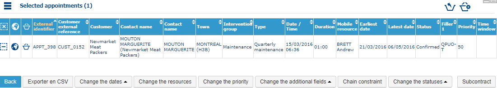

This list also has two buttons located top right:

*  that lets you add all the appointments in the [panel](https://mynomadia.com/privatedoc/9LLcWh7j74sENa54/optitime-doc/docs/en/otgs-reference-book/call-center-agenda.html#manipuler-une-intervention-a-partir-du-panier) to the selection.
*  that lets you add all selected apppointments to the [panel](https://mynomadia.com/privatedoc/9LLcWh7j74sENa54/optitime-doc/docs/en/otgs-reference-book/call-center-agenda.html#manipuler-une-intervention-a-partir-du-panier).

### Search for appointments (requested, planned, reserved, confirmed, unplanned, subcontracted)

* Depending on the [rights](https://mynomadia.com/privatedoc/9LLcWh7j74sENa54/optitime-doc/docs/en/otgs-reference-book/utilisateurs.html#coll-droits) granted to the user, they can access predefined searches, or filtered searches on appointment status.
* For example, the Search on requested appointments link serves to search for appointments with a _Requested_ [status](https://mynomadia.com/privatedoc/9LLcWh7j74sENa54/optitime-doc/docs/en/otgs-reference-book/_the_different_statuses_for_appointments_in_opti_time.html#statuts).
* Each of the links opens a first screen that suggests filtering on date, on resource (or subcontractor), on worksite and on intervention type.

Search on status

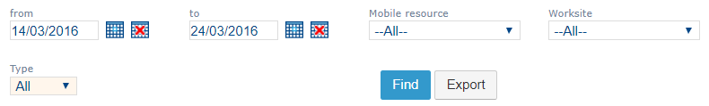

* The principle of the search functions is described in the [Search in the Planning module](https://mynomadia.com/privatedoc/9LLcWh7j74sENa54/optitime-doc/docs/en/otgs-reference-book/call-center-objets.html#call-center-recherche) chapter.
* The Search button returns you to the [list of results](https://mynomadia.com/privatedoc/9LLcWh7j74sENa54/optitime-doc/docs/en/otgs-reference-book/call-center-objets.html#call-center-resultat).\
  Clicking on one of the appointments found in the list opens the [appointment form](https://mynomadia.com/privatedoc/9LLcWh7j74sENa54/optitime-doc/docs/en/otgs-reference-book/call-center-objets.html#fiche-rdv).
* The Export button allows you to retrieve a .csv file for the search.

### My searches

|                                                                                                                                                                                                                                           |         |
| ----------------------------------------------------------------------------------------------------------------------------------------------------------------------------------------------------------------------------------------- | ------- |
| \[Warning]                                                                                                                                                                                                                                | Warning |
| To access a predefined search, you need to have the corresponding [right](https://mynomadia.com/privatedoc/9LLcWh7j74sENa54/optitime-doc/docs/en/otgs-reference-book/utilisateurs.html#coll-droits) given by the Opti-Time administrator. |         |

This menu lets you access configured searches in the [Configuring the application](https://mynomadia.com/privatedoc/9LLcWh7j74sENa54/optitime-doc/docs/en/otgs-reference-book/perso.html#config-appli) menu of the Administration module.\
Rapid access links to these predefined queries can also be displayed in the [information pane](https://mynomadia.com/privatedoc/9LLcWh7j74sENa54/optitime-doc/docs/en/otgs-reference-book/call-center-cadre-info.html).

The [table of results](https://mynomadia.com/privatedoc/9LLcWh7j74sENa54/optitime-doc/docs/en/otgs-reference-book/call-center-menu.html#resultat-recherche-rdv) is comparable to that obtained with a standard search.

### Links between interventions

|                                                                                                                                                                                                                                                                             |         |
| --------------------------------------------------------------------------------------------------------------------------------------------------------------------------------------------------------------------------------------------------------------------------- | ------- |
| \[Warning]                                                                                                                                                                                                                                                                  | Warning |
| To access this menu, you need to have the corresponding [right](https://mynomadia.com/privatedoc/9LLcWh7j74sENa54/optitime-doc/docs/en/otgs-reference-book/utilisateurs.html#coll-droits) given by the Opti-Time administrator (**CALLCENTER\_SEARCH\_CHAIN\_CONSTRAINT**). |         |

This function lets you search for appointments associated to [chaining constraints](https://mynomadia.com/privatedoc/9LLcWh7j74sENa54/optitime-doc/docs/en/otgs-reference-book/call-center-objets.html#contrainte-chainage).

The Reactivate button lets you recall the scheduling for all appointments contained in the selected chain(s).\
The Export button lets you retrieve the .csv file for the search.\
Click on a result line to open the form for this chaining constraint. It will then be possible to edit as required to add or delete an appointment, or apply any other additional action, for example change the appointment status or edit selected appointment dates.

### Appointment alerts

This function returns you to the [appointment counters](https://mynomadia.com/privatedoc/9LLcWh7j74sENa54/optitime-doc/docs/en/otgs-reference-book/call-center-cadre-info.html#compteurs-rdv) function.

### Customer gap

This function is used to [search](https://mynomadia.com/privatedoc/9LLcWh7j74sENa54/optitime-doc/docs/en/otgs-reference-book/call-center-objets.html#call-center-recherche) for [appointments](https://mynomadia.com/privatedoc/9LLcWh7j74sENa54/optitime-doc/docs/en/otgs-reference-book/call-center-objets.html#objets-rdv) for which the recurrence of customers constraint defined in the [customer form](https://mynomadia.com/privatedoc/9LLcWh7j74sENa54/optitime-doc/docs/en/otgs-reference-book/call-center-objets.html#fiche-client-projet) is not respected.

The result is given in the form of a list of appointments, the fields of which are defined in the [appointment section](https://mynomadia.com/privatedoc/9LLcWh7j74sENa54/optitime-doc/docs/en/otgs-reference-book/call-center-objets.html#fiche-rdv).

### Alerts on route duration

This allows you to filter on:

* Date
* Mobile resource
* Status
* Worksite
* Maximum journey time or distance (in minutes or km): minimum journey duration or distance

The search options are described in the [Search](https://mynomadia.com/privatedoc/9LLcWh7j74sENa54/optitime-doc/docs/en/otgs-reference-book/call-center-objets.html#recherche-generique-filtre) chapter.

The [search results](https://mynomadia.com/privatedoc/9LLcWh7j74sENa54/optitime-doc/docs/en/otgs-reference-book/call-center-menu.html#resultat-recherche-client) present a list of customers.

### Application warning messages

This menu provides access to application alert messages subscribed to in the [@menu(Administration)](https://mynomadia.com/privatedoc/9LLcWh7j74sENa54/optitime-doc/docs/en/otgs-reference-book/utilisateurs.html#abo) module: these constitute the journal of technical exchanges and modifications made in the background to the application, like, for example:

* results of CSV imports: success, error, etc. ;
* webservice calls;
* modifications made to optimisation parameters;
* etc.

This allows a technical user to track and diagnose the events having an impact on the application.

Application warning message screen

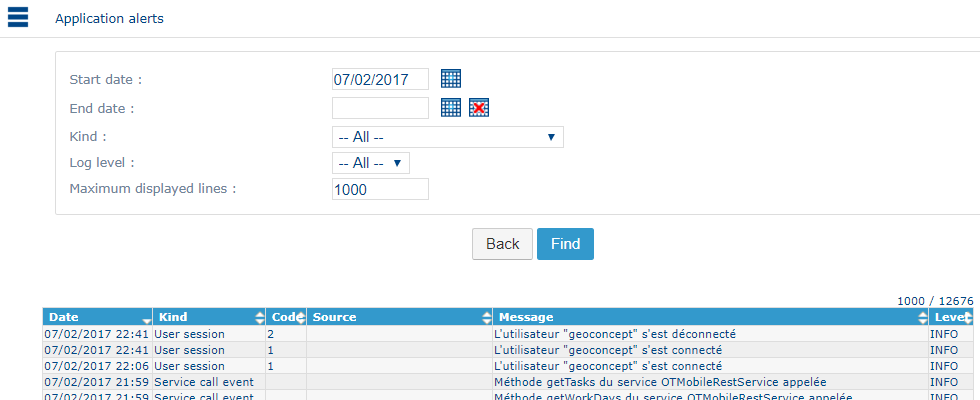

The principle of the search functions is described in the [Search in the Planning module](https://mynomadia.com/privatedoc/9LLcWh7j74sENa54/optitime-doc/docs/en/otgs-reference-book/call-center-objets.html#call-center-recherche) chapter.

### Messaging service

This menu provides access to a full messaging service for the purpose of consulting, writing, sending or deleting messages exchanged between users.\
The user can refresh this list at any time by clicking on the  button located at the top right of the information pane.

This messaging manager displays messages in table form showing their status: unread, received, sent or all these (_read_, _answered_, _sent_, _draft_). Each column can be sorted.\
When you click on a line, the details of the corresponding message appear (sender, recipient, issue date, publication start and end dates, message body text).\
Various actions can then be applied to this message:

* mark as unread,
* reply,
* delete.

You can also write a new message by clicking on the + New message button.\
Enter:

* the recipient(s) selecting from the [resources](https://mynomadia.com/privatedoc/9LLcWh7j74sENa54/optitime-doc/docs/en/otgs-reference-book/donnees.html#RH) and [teams](https://mynomadia.com/privatedoc/9LLcWh7j74sENa54/optitime-doc/docs/en/otgs-reference-book/donnees.html#equipe) for the current area (or from one or several available if the area favourites are enabled),
* (optional) a notification start date in the case of a delayed sending action,
* (optional) a notification end date where an expiry date is applied,
* the body of the message.

It will then be possible to send the message or save it as a draft.

### Modify the appointments of the past

This page modifies the characteristics of a past appointment, and notably declares that it has been fulfilled and under what conditions.

It also enables resources' past agendas to be put into correspondence with routes fulfilled by adding appointments;

#### Modify the current status of past plannings

The first window requests you choose, via a resource and a date, the route to modify.

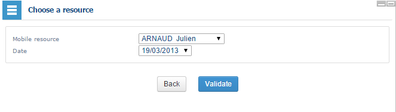

The application searches for, and lists the appointments likely to be modified.

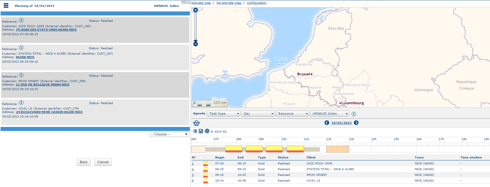

For each appointment, certain characteristics are given as reference, for example, the address, the date, the status and the time window. A drop-down menu proposes to modify the default value **Do nothing**:

* **Do nothing** does not modify the appointment;
*   **Modify** allows you to modify the timeslot(s);

    |                                                             |     |
    | ----------------------------------------------------------- | --- |
    | \[Tip]                                                      | Tip |
    | In this mode, the timeslot times can be edited as required. |     |
* It is possible to add several time windows clicking on the  button.
* The  button deletes the time windows.
* Click on the  button having first made any modifications required. You can then cancel all the modifications applied by clicking on the  button.
* **Reactivate** enables the appointment to return to _Requested_ status.
* **Fulfilled** serves to signal that the appointment has been fulfilled and to fill in any additional information relating to the fulfilment of the appointment (income generated, status of the task in hand, Follow-up required, and different comment lines that can be filled in).
* **Unplan** allows you to exit from the appointment in the planning.

#### Adding an appointment to a past planning

* An appointment can be added to a past planning of a resource. For example, an appointment planned for the next day may have been fulfilled ahead of time (an emergency, a timeslot liberated unexpectedly, etc).
* Click on the "Choose" drop-down menu at the bottom of the window and select "Add an appointment".
* A window proposes to search on requested, planned and confirmed appointments. It will be possible to define a certain number of criteria to recover the appointment(s) that must be added to the planning. Once the form has been filled, click on Search to run the search.
* Search on appointments likely to be added to a past planning.

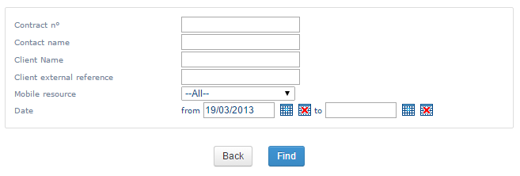

* The application proposes to list the appointments found, and you then just have to click on the appointment to add to the past planning.
* Before the final validation of the addition of this appointment, the operator must indicate the time window for the intervention at the customer’s premises. They must also supply details of the start and end time of the appointment, and if appropriate, the actual duration.

### Display agendas

This function reinitialises the [planning](https://mynomadia.com/privatedoc/9LLcWh7j74sENa54/optitime-doc/docs/en/otgs-reference-book/call-center-agenda.html).

### Handling unavailabilities

This page serves to [add](https://mynomadia.com/privatedoc/9LLcWh7j74sENa54/optitime-doc/docs/en/otgs-reference-book/call-center-objets.html#call-center-creer) or [delete](https://mynomadia.com/privatedoc/9LLcWh7j74sENa54/optitime-doc/docs/en/otgs-reference-book/call-center-objets.html#call-center-supprimer) [unavailabilities](https://mynomadia.com/privatedoc/9LLcWh7j74sENa54/optitime-doc/docs/en/otgs-reference-book/call-center-objets.html#centre-d-appel-indisponibilite) to plannings managed by the user. It will be possible to create unavailabilities for one or several resources simultaneously (handling of meetings) to supply details of appointment times, predefined or free, a recurrence, to overwrite an address, or add a commentary etc.

This page is described in the [Unavailability form](https://mynomadia.com/privatedoc/9LLcWh7j74sENa54/optitime-doc/docs/en/otgs-reference-book/call-center-objets.html#fiche-indispo) chapter.

### Unavailability search

This page allows you to search, [create](https://mynomadia.com/privatedoc/9LLcWh7j74sENa54/optitime-doc/docs/en/otgs-reference-book/call-center-objets.html#call-center-creer), modify or [delete](https://mynomadia.com/privatedoc/9LLcWh7j74sENa54/optitime-doc/docs/en/otgs-reference-book/call-center-objets.html#call-center-supprimer) [unavailabilities](https://mynomadia.com/privatedoc/9LLcWh7j74sENa54/optitime-doc/docs/en/otgs-reference-book/call-center-objets.html#centre-d-appel-indisponibilite).

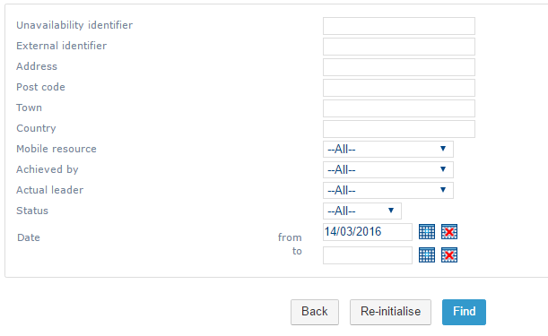

* The search page contains [search](https://mynomadia.com/privatedoc/9LLcWh7j74sENa54/optitime-doc/docs/en/otgs-reference-book/call-center-objets.html#call-center-recherche) fields. Clicking on Search, the [list](https://mynomadia.com/privatedoc/9LLcWh7j74sENa54/optitime-doc/docs/en/otgs-reference-book/call-center-objets.html#call-center-resultat) of unavailabilities displays.
* The search fields are described in the [unavailabilities](https://mynomadia.com/privatedoc/9LLcWh7j74sENa54/optitime-doc/docs/en/otgs-reference-book/call-center-objets.html#fiche-indispo) form.
* Click on a line in the search result to access the [reduced unavailability form](https://mynomadia.com/privatedoc/9LLcWh7j74sENa54/optitime-doc/docs/en/otgs-reference-book/call-center-objets.html#fiche-reduite-indispo).

|                                                                                                                                          |     |
| ---------------------------------------------------------------------------------------------------------------------------------------- | --- |
| \[Tip]                                                                                                                                   | Tip |
| The Selected unavailabilities link lists unavailabilities selected in the result list via the images/ref/buttons/bouton-add2.png button. |     |

### Editing the roadbook

This function displays and describes the different appointments and scheduled interventions for a chosen duration (day/week) for a connected resource/team.

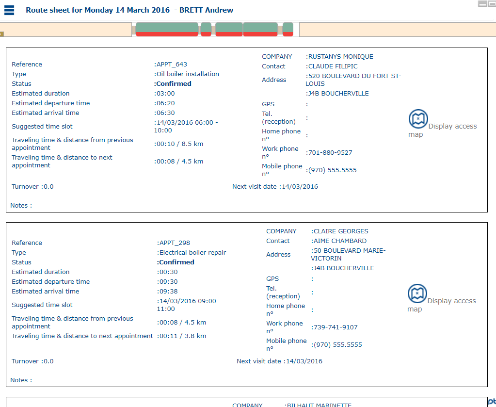

The screen shows the forecasted planning for the chosen duration.

The roadbook describes all the different interventions of the day by type and in chronological order.\
For each appointment, different items of information are suggested that vary depending on the type of intervention.\
For each event in the day an access plan is provided by clicking on the  button.\
Opening the access plan opens a floating window showing the map centered on the event, shown as a circular symbol indicating the appointment time.\
This window can be resized on the screen, so it can be enlarged or reduced to match the space reserved for the map. Certain graphical manipulations are possible via the utilisation of the vertical bar, at the top left of the window:

* Move the cursor towards the + to perform a zoom on the map (the mouse wheel can perform the same function if need be);
* Move the cursor towards the – to perform a zoom-out on the map (or use the mouse wheel);
* Hold down the left-hand button on the mouse and slide the cursor to pan the map.

Exporting the roadbook in pdf format

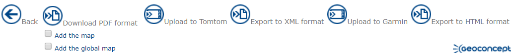

The user can generate a file in .pdf format from the roadbook to display it on the screen.\
The **Add detailed maps** check-box inserts the map in the `.pdf` file.

|                                                                                                                |     |
| -------------------------------------------------------------------------------------------------------------- | --- |
| \[Tip]                                                                                                         | Tip |
| The **Add global map** check-box is operational only if the map display is configured on GCIS, and not on HTC. |     |

You can also generate a file in Garmin, TomTom, HTML or xml format in order to be able to read the roadbook in a GPS navigation application.

Click on Back to redisplay the last week’s planning viewed.

### Exceptional locations

This menu serves to search, [create](https://mynomadia.com/privatedoc/9LLcWh7j74sENa54/optitime-doc/docs/en/otgs-reference-book/call-center-objets.html#call-center-creer) and [delete](https://mynomadia.com/privatedoc/9LLcWh7j74sENa54/optitime-doc/docs/en/otgs-reference-book/call-center-objets.html#call-center-supprimer) [exceptional locations](https://mynomadia.com/privatedoc/9LLcWh7j74sENa54/optitime-doc/docs/en/otgs-reference-book/call-center-objets.html#localisations-exceptionnelles).

Search for exceptional locations

* The principle of the search functions is described in the [Search in the Planning module](https://mynomadia.com/privatedoc/9LLcWh7j74sENa54/optitime-doc/docs/en/otgs-reference-book/call-center-objets.html#call-center-recherche) chapter.
* The search fields are described in the [exceptional location form](https://mynomadia.com/privatedoc/9LLcWh7j74sENa54/optitime-doc/docs/en/otgs-reference-book/call-center-objets.html#fiche-loc-exceptionnelle).
* The  button runs an analysis of the panel of appointments to plan, and suggests exceptional locations to fulfil distant appointments.
* Clicking on a line in the result list returns you to the [exceptional location form](https://mynomadia.com/privatedoc/9LLcWh7j74sENa54/optitime-doc/docs/en/otgs-reference-book/call-center-objets.html#fiche-loc-exceptionnelle).
* The Forced mode check-box makes it possible to ignore journey times when deleting an exceptional location.
* The Confirm/Unconfirm button allows you to change the status of the selected exceptional locations from _confirmed_ to _to confirm_ and vice versa.

|                                                                                                                                                                                                             |     |
| ----------------------------------------------------------------------------------------------------------------------------------------------------------------------------------------------------------- | --- |
| \[Tip]                                                                                                                                                                                                      | Tip |
| Unconfirmed exceptional locations can be modified during a [batch optimisation](https://mynomadia.com/privatedoc/9LLcWh7j74sENa54/optitime-doc/docs/en/otgs-reference-book/optimisation.html#planif-optim). |     |

### Hotel locations

This page allows you to search, [create](https://mynomadia.com/privatedoc/9LLcWh7j74sENa54/optitime-doc/docs/en/otgs-reference-book/call-center-objets.html#call-center-creer) and [delete](https://mynomadia.com/privatedoc/9LLcWh7j74sENa54/optitime-doc/docs/en/otgs-reference-book/call-center-objets.html#call-center-supprimer) [hotels](https://mynomadia.com/privatedoc/9LLcWh7j74sENa54/optitime-doc/docs/en/otgs-reference-book/call-center-objets.html#objets-hotel).

Search screen for hotel locations

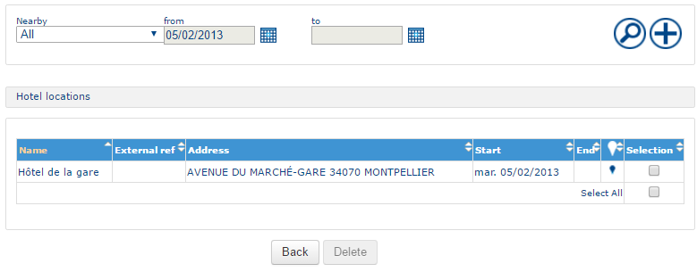

* The principle of the search functions is described in the [Search in the Planning module](https://mynomadia.com/privatedoc/9LLcWh7j74sENa54/optitime-doc/docs/en/otgs-reference-book/call-center-objets.html#call-center-recherche) chapter.
* The **Close to** field allows you to filter on towns including presaved hotels.
* The search fields are described in the [hotel location form](https://mynomadia.com/privatedoc/9LLcWh7j74sENa54/optitime-doc/docs/en/otgs-reference-book/call-center-objets.html#fiche-hotel).
* Clicking on a line in the result table returns you to the [hotel location form](https://mynomadia.com/privatedoc/9LLcWh7j74sENa54/optitime-doc/docs/en/otgs-reference-book/call-center-objets.html#fiche-hotel).

### Locked day

This page allows you to search and [create](https://mynomadia.com/privatedoc/9LLcWh7j74sENa54/optitime-doc/docs/en/otgs-reference-book/call-center-objets.html#call-center-creer) [locked days](https://mynomadia.com/privatedoc/9LLcWh7j74sENa54/optitime-doc/docs/en/otgs-reference-book/call-center-objets.html#objets-journees-verr) in resources' agendas.

Search screen for locked days

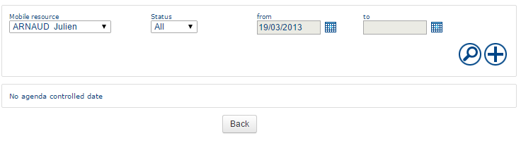

The principle of the search functions is described in the [Search in the Planning module](https://mynomadia.com/privatedoc/9LLcWh7j74sENa54/optitime-doc/docs/en/otgs-reference-book/call-center-objets.html#call-center-recherche) chapter.

The search fields are [configurable](https://mynomadia.com/privatedoc/9LLcWh7j74sENa54/optitime-doc/docs/en/otgs-reference-book/perso.html#config-appli), they are described in the [locked day form in the agenda](https://mynomadia.com/privatedoc/9LLcWh7j74sENa54/optitime-doc/docs/en/otgs-reference-book/call-center-objets.html#fiche-journee-verrouillee).

|                                                                               |      |
| ----------------------------------------------------------------------------- | ---- |
| \[Note]                                                                       | Note |
| Before version 8.4, only the **Closed** status is handled by the application. |      |

* Clicking on a line in the result table displays the corresponding [locked day form](https://mynomadia.com/privatedoc/9LLcWh7j74sENa54/optitime-doc/docs/en/otgs-reference-book/call-center-objets.html#fiche-journee-verrouillee).
* The  button serves to create a new locked day for the resource selected in the drop-down list. This button opens the [locked day form](https://mynomadia.com/privatedoc/9LLcWh7j74sENa54/optitime-doc/docs/en/otgs-reference-book/call-center-objets.html#fiche-journee-verrouillee) in edit mode.

### Manage agenda markers

This page serves to search, [create](https://mynomadia.com/privatedoc/9LLcWh7j74sENa54/optitime-doc/docs/en/otgs-reference-book/call-center-objets.html#call-center-creer), modify or [delete](https://mynomadia.com/privatedoc/9LLcWh7j74sENa54/optitime-doc/docs/en/otgs-reference-book/call-center-objets.html#call-center-supprimer) [agenda markers](https://mynomadia.com/privatedoc/9LLcWh7j74sENa54/optitime-doc/docs/en/otgs-reference-book/call-center-objets.html#objets-jalons).

Agenda marker search screen

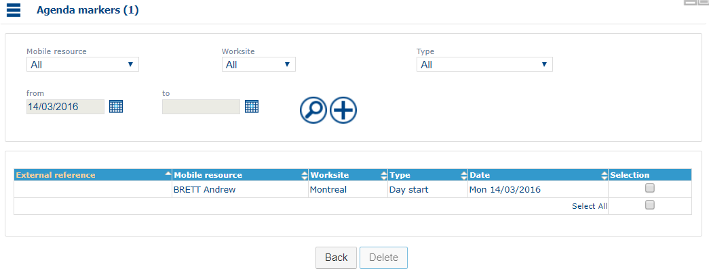

* The principle of the search functions is described in the [Search in the Planning module](https://mynomadia.com/privatedoc/9LLcWh7j74sENa54/optitime-doc/docs/en/otgs-reference-book/call-center-objets.html#call-center-recherche) chapter.
* The search fields described in the [agenda marker form](https://mynomadia.com/privatedoc/9LLcWh7j74sENa54/optitime-doc/docs/en/otgs-reference-book/call-center-objets.html#fiche-jalon).
* Clicking on a line in the result table returns you to the [agenda marker form](https://mynomadia.com/privatedoc/9LLcWh7j74sENa54/optitime-doc/docs/en/otgs-reference-book/call-center-objets.html#fiche-jalon).
* The  button allows you to create an agenda marker for the resource selected in the drop-down list. This button opens the [agenda marker form](https://mynomadia.com/privatedoc/9LLcWh7j74sENa54/optitime-doc/docs/en/otgs-reference-book/call-center-objets.html#fiche-jalon) in edit mode.

### Vehicles tracking

This function allows you, for a given worksite, to list and map the last known position of [vehicles](https://mynomadia.com/privatedoc/9LLcWh7j74sENa54/optitime-doc/docs/en/otgs-reference-book/mob.html#mob-vehicules) with an on-board [tracking device](https://mynomadia.com/privatedoc/9LLcWh7j74sENa54/optitime-doc/docs/en/otgs-reference-book/mob.html#mob-equip-suivi) [assigned](https://mynomadia.com/privatedoc/9LLcWh7j74sENa54/optitime-doc/docs/en/otgs-reference-book/mob.html#mob-affectation) to a resource for a given period.

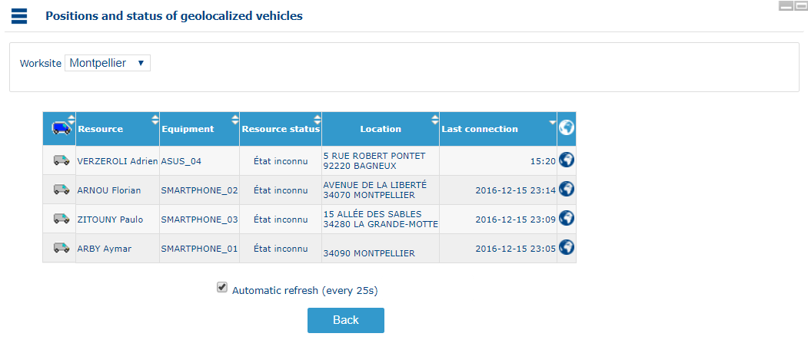

This assume that the application has been configured so it is associated to a [positions server](https://mynomadia.com/privatedoc/9LLcWh7j74sENa54/optitime-doc/docs/en/otgs-reference-book/mob.html#mob-parametres).

### Compute a route

This function calculates a route and displays the route sheet or roadbook.

The first page of the function comprises the following fields:

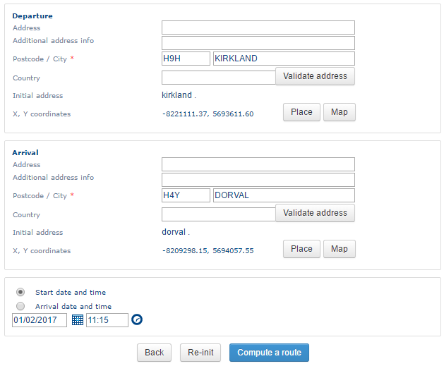

* In the **Start** section, you will need to enter the start [address](https://mynomadia.com/privatedoc/9LLcWh7j74sENa54/optitime-doc/docs/en/otgs-reference-book/intro-geocodage.html).
* In the **Arrival** section, enter the arrival [address](https://mynomadia.com/privatedoc/9LLcWh7j74sENa54/optitime-doc/docs/en/otgs-reference-book/intro-geocodage.html).
* Next, it is possible to choose either the **start time** or the **arrival time**, and a **vehicle profile** lets you choose from a variety of preconfigured vehicles (car, truck, light delivery vehicle, delivery truck, bus, emergency vehicle, emergency truck, taxi, bicycle, pedestrian) with technical specificities (average speeds, access restrictions to various types of road…) that will then be taken into account for the calculation.

|                                                                         |         |
| ----------------------------------------------------------------------- | ------- |
| \[Warning]                                                              | Warning |
| The arrival / departure times only operate if a suitable graph is used. |         |

|                                                                                                                                                                                                                                                                                                                                                                                                                                                  |     |
| ------------------------------------------------------------------------------------------------------------------------------------------------------------------------------------------------------------------------------------------------------------------------------------------------------------------------------------------------------------------------------------------------------------------------------------------------ | --- |
| \[Tip]                                                                                                                                                                                                                                                                                                                                                                                                                                           | Tip |
| **Opti-Time** lets you define different speeds as a function of defined time windows so that changing traffic conditions throughout the day can be taken into account. These speed profiles (_Speed Patterns_) must be enabled and defined from the Administration module (Customization > Configuration > Application > Itinerary computation > SmartRouting > isSpeedPatternUsed and allSpeedPatternInterval). They will then be applied here. |     |

* The Reset button reinitialisess all fields.
* The Compute route button runs the calculation.
* The second page comprises the result of the route calculation:

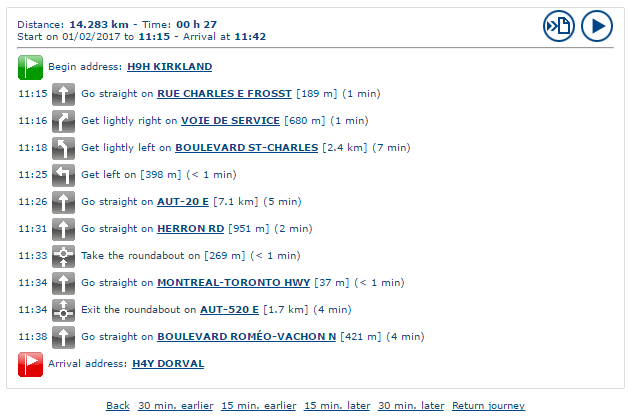

* The  Export button exports the results.
* The  Start button displays the journey on the map as a series of route steps.
* Zoom-in on a particular step in the route simply by clicking on it.
* The Back link returns you to the first page.
* The 15-30 minutes before / after link moves the departure times forwards or back (if the graph installed permits this).
* The Return journey link returns you to the first page, reversing the start and arrival addresses.

### Convert coordinates into Lat/Lon

This function allows you to calculate the coordinates of an address in Latitude/Longitude (that is, in terms of geographic coordinates).

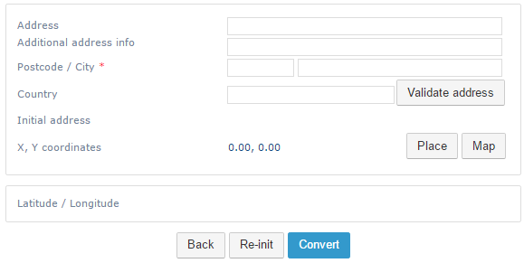

This page contains [address](https://mynomadia.com/privatedoc/9LLcWh7j74sENa54/optitime-doc/docs/en/otgs-reference-book/intro-geocodage.html) fields.

The Convert button runs the calculation and returns the coordinates in Latitude/Longitude in the lower frame.

### Search around

This function displays the worksites, vehicles, clients, hotels, or appointments nearby an address.

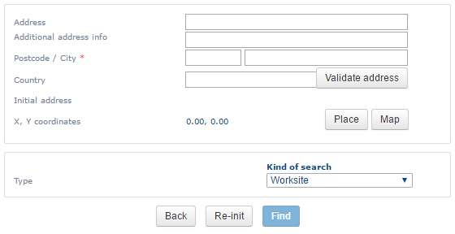

* This page contains an [address](https://mynomadia.com/privatedoc/9LLcWh7j74sENa54/optitime-doc/docs/en/otgs-reference-book/intro-geocodage.html) section.
* A drop-down list in which the desired object type can be selected.
* The Search button searches for selected objects in the drop-down list of the saved address.
* The following [result list](https://mynomadia.com/privatedoc/9LLcWh7j74sENa54/optitime-doc/docs/en/otgs-reference-book/call-center-objets.html#call-center-resultat) then displays:

Search around

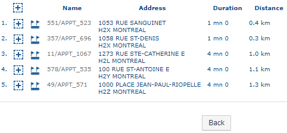

* If the search is applied to customers or appointments, the  button allows you to add the customer to the [customer panel](https://mynomadia.com/privatedoc/9LLcWh7j74sENa54/optitime-doc/docs/en/otgs-reference-book/call-center-menu.html#panier-des-clients), or the appointment to the [list of selected appointments](https://mynomadia.com/privatedoc/9LLcWh7j74sENa54/optitime-doc/docs/en/otgs-reference-book/call-center-menu.html#lister-rdv-select), respectively.
* The  button runs a [route calculation](https://mynomadia.com/privatedoc/9LLcWh7j74sENa54/optitime-doc/docs/en/otgs-reference-book/call-center-menu.html#calc-iti) between the address entered and the corresponding object.
* Clicking on the name of the object returns you to the [form](https://mynomadia.com/privatedoc/9LLcWh7j74sENa54/optitime-doc/docs/en/otgs-reference-book/call-center-objets.html#call-center-fiche-gral).

### Verify circulation for the planning

This function allows you to verify whether the planning suggested is compatible with the current traffic status.

View of traffic

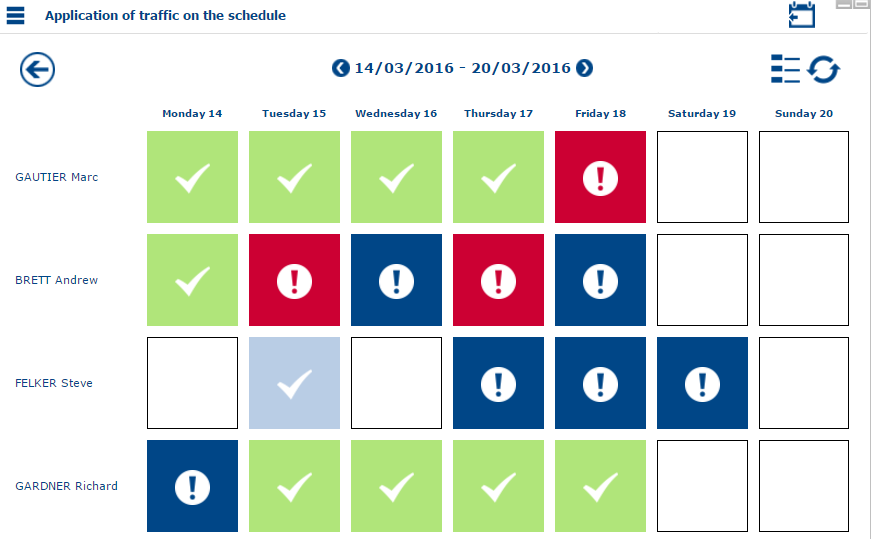

* The  button displays the status of traffic corresponding to the view displayed in the [planning](https://mynomadia.com/privatedoc/9LLcWh7j74sENa54/optitime-doc/docs/en/otgs-reference-book/call-center-agenda.html#selection-vues).
* The  button displays the legend for the page:

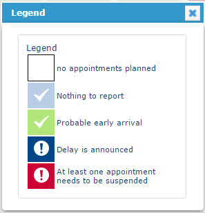

* The  button takes you back to the preceding traffic status.
* The  button refreshes the traffic status.
* Clicking on a check-box in the traffic status displays the next appointment management page:

Manage traffic

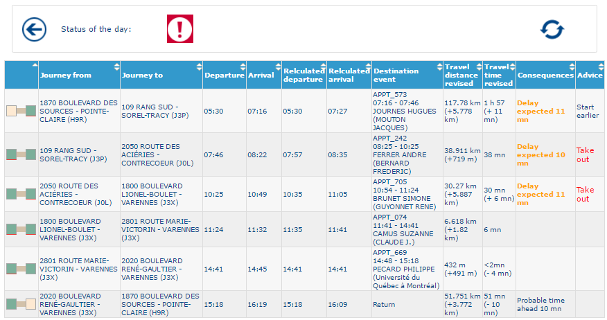

The first column represents the confirmed appointment graphically: the 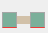 image represents the position of the appointment in the planning. The appointment concerned is represented by the second item in the image.

The **Journey from** field gives the start address for the mission.

The **Journey to** field gives the arrival address for the mission.

The **Departure** and **Arrival** fields give the departure and arrival times for the appointment.

The **Recalculated departure** and **Recalculated arrival** fields give the departure and arrival times for the appointment following recalculation of the journey time while taking the traffic into account.

The **Destination event** field gives the name and address of the next event in the planning.

The **Travel distance revised** and **Travel time revised** fields give the distance and the time of travel, recalculated to take the traffic into account.

The **Consequences** field gives details of any delay or late arrival anticipated.

The **Advice** field gives any relevant scheduling advice. For example, the Remove link allows you to remove the appointment from the planning.

|                                                                                                                                                                            |      |
| -------------------------------------------------------------------------------------------------------------------------------------------------------------------------- | ---- |
| \[Note]                                                                                                                                                                    | Note |
| Traffic conditions are available only if a graph that permits this is used. The traffic status is calculated statistically and may deviate from the reality on the ground. |      |

### Predefined exports list

Predefined exports will allow export in .csv format of data according to the fields predefined in the [application settings](https://mynomadia.com/privatedoc/9LLcWh7j74sENa54/optitime-doc/docs/en/otgs-reference-book/perso.html#config-appli).

Planning

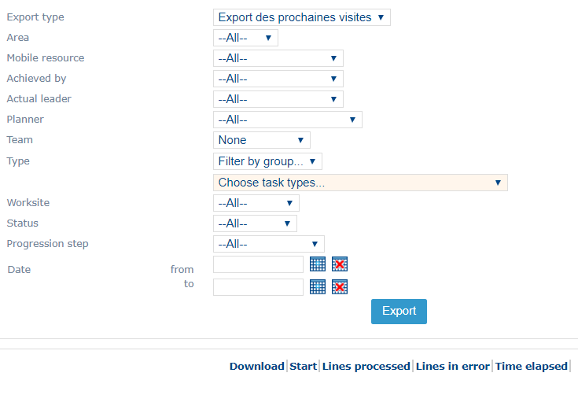

The interface allows you to filter the predefined export as a function of the following fields:

* **Export type**: list containing the names of any predefined exports
* The **area**
* The **Mobile resource**
* **Achieved by**
* **Actual leader**
* The **planner**
* The **team**
* The **type**
* The **worksite**
* The appointments [**status**](https://mynomadia.com/privatedoc/9LLcWh7j74sENa54/optitime-doc/docs/en/otgs-reference-book/_the_different_statuses_for_appointments_in_opti_time.html#statuts)
* The appointments [**progression step**](https://mynomadia.com/privatedoc/9LLcWh7j74sENa54/optitime-doc/docs/en/otgs-reference-book/_the_different_statuses_for_appointments_in_opti_time.html#etats-avancement)
* The **date**

The Export button retrieves the .csv file containing the desired export.

Below, a table summarises information about the export (number of lines exported, execution times, etc.)

|                                                                                                                                                                                   |         |
| --------------------------------------------------------------------------------------------------------------------------------------------------------------------------------- | ------- |
| \[Warning]                                                                                                                                                                        | Warning |
| Some filters are not possible, as their utilisation will depend on the type of export selected. For example, for an export of Customer type, the Status filter will not function. |         |

### Custom reports

This function is identical to that of [predefined exports](https://mynomadia.com/privatedoc/9LLcWh7j74sENa54/optitime-doc/docs/en/otgs-reference-book/call-center-menu.html#liste-exports-predef) except that it is not based on the [application settings](https://mynomadia.com/privatedoc/9LLcWh7j74sENa54/optitime-doc/docs/en/otgs-reference-book/perso.html#config-appli), but on the .sql files stored in the ad hoc directory on the server.
