# Objects in the Planning Module

Opti-Time Reference Guide

[](https://mynomadia.com/privatedoc/9LLcWh7j74sENa54/optitime-doc/docs/en/otgs-reference-book/index.html)

## Opti-Time Reference Guide Planning

|                                                                                                                               |                                                                                                                              |
| ----------------------------------------------------------------------------------------------------------------------------- | ---------------------------------------------------------------------------------------------------------------------------- |
| [Sidebar](https://mynomadia.com/privatedoc/9LLcWh7j74sENa54/optitime-doc/docs/en/otgs-reference-book/call-center-objets.html) | [Prev](https://mynomadia.com/privatedoc/9LLcWh7j74sENa54/optitime-doc/docs/en/otgs-reference-book/module-planification.html) |

## Objects in the Planning module

The Planning module handles the following objects:

* [Customer types](https://mynomadia.com/privatedoc/9LLcWh7j74sENa54/optitime-doc/docs/en/otgs-reference-book/call-center-objets.html#objets-types-client);
* [Customer kinds](https://mynomadia.com/privatedoc/9LLcWh7j74sENa54/optitime-doc/docs/en/otgs-reference-book/call-center-objets.html#objets-nature-client);
* [Customers](https://mynomadia.com/privatedoc/9LLcWh7j74sENa54/optitime-doc/docs/en/otgs-reference-book/call-center-objets.html#objets-clients);
* [Orderers](https://mynomadia.com/privatedoc/9LLcWh7j74sENa54/optitime-doc/docs/en/otgs-reference-book/call-center-objets.html#commanditaire);
* [Appointments](https://mynomadia.com/privatedoc/9LLcWh7j74sENa54/optitime-doc/docs/en/otgs-reference-book/call-center-objets.html#objets-rdv);
* [Unavailabilities](https://mynomadia.com/privatedoc/9LLcWh7j74sENa54/optitime-doc/docs/en/otgs-reference-book/call-center-objets.html#centre-d-appel-indisponibilite);
* [Exceptional locations](https://mynomadia.com/privatedoc/9LLcWh7j74sENa54/optitime-doc/docs/en/otgs-reference-book/call-center-objets.html#localisations-exceptionnelles);
* [Temporary posts](https://mynomadia.com/privatedoc/9LLcWh7j74sENa54/optitime-doc/docs/en/otgs-reference-book/call-center-objets.html#objets-postes-temp);
* [Secondary worksites](https://mynomadia.com/privatedoc/9LLcWh7j74sENa54/optitime-doc/docs/en/otgs-reference-book/call-center-objets.html#objets-sites-second);
* [Hotel locations](https://mynomadia.com/privatedoc/9LLcWh7j74sENa54/optitime-doc/docs/en/otgs-reference-book/call-center-objets.html#objets-hotel);
* [Agenda markers](https://mynomadia.com/privatedoc/9LLcWh7j74sENa54/optitime-doc/docs/en/otgs-reference-book/call-center-objets.html#objets-jalons);
* [On-call duties](https://mynomadia.com/privatedoc/9LLcWh7j74sENa54/optitime-doc/docs/en/otgs-reference-book/call-center-objets.html#objets-astreinte);
* [Locked days](https://mynomadia.com/privatedoc/9LLcWh7j74sENa54/optitime-doc/docs/en/otgs-reference-book/call-center-objets.html#objets-journees-verr).

In principle, the objects in the Planning module include a generic [search](https://mynomadia.com/privatedoc/9LLcWh7j74sENa54/optitime-doc/docs/en/otgs-reference-book/call-center-objets.html#call-center-recherche) function that allows you to find an object that has been created already in the application, to add new ones, or to delete them.

Each object has a form, the behavior of which is described in the [next chapter](https://mynomadia.com/privatedoc/9LLcWh7j74sENa54/optitime-doc/docs/en/otgs-reference-book/call-center-objets.html#call-center-fiche-gral).

|                                                                                                                                                                                  |      |
| -------------------------------------------------------------------------------------------------------------------------------------------------------------------------------- | ---- |
| \[Note]                                                                                                                                                                          | Note |
| Other objects are handled in the [administration module](https://mynomadia.com/privatedoc/9LLcWh7j74sENa54/optitime-doc/docs/en/otgs-reference-book/module-administration.html). |      |

### Forms

The forms include fields that are described in the different chapters relating to the objects handled.

In edit mode (creation or modification), the form takes the following format:

Example: Customer type form

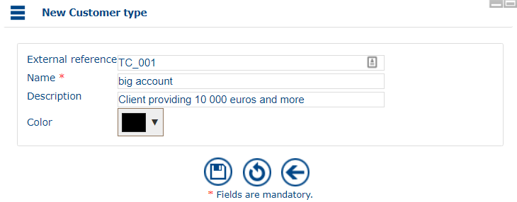

The  button allows you to save the modifications made in the form.

The 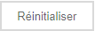 button resets the whole of the form.

The  button takes you back to the previous page.

|                                                                                                          |      |
| -------------------------------------------------------------------------------------------------------- | ---- |
| \[Note]                                                                                                  | Note |
| Some forms have additional buttons that will be described in the chapters for the corresponding objects. |      |

### Customer types

Customer types are groups of customers arranged to suit your purpose. You don’t have to use customer types if this is inappropriate.

#### Customer type form

The [form](https://mynomadia.com/privatedoc/9LLcWh7j74sENa54/optitime-doc/docs/en/otgs-reference-book/call-center-objets.html#call-center-fiche-gral) for the customer type is accessible after searching for a customer type in the [(Customer type search)](https://mynomadia.com/privatedoc/9LLcWh7j74sENa54/optitime-doc/docs/en/otgs-reference-book/call-center-menu.html#rechercher-type-client) menu.

Customer type form


The form contains the following fields:

* **External reference**;
* **Name** (mandatory);
* **Description**;
* **Colour**: allows you to give a custom [colour](https://mynomadia.com/privatedoc/9LLcWh7j74sENa54/optitime-doc/docs/en/otgs-reference-book/perso.html#couleurs) to the customer type in the plannings.

### Customer kinds

The customer kinds grouping allows you to categorise customers according to a second level of classification (in addition to the [Customer types](https://mynomadia.com/privatedoc/9LLcWh7j74sENa54/optitime-doc/docs/en/otgs-reference-book/call-center-objets.html#objets-types-client) grouping).

#### Customer kind form

The [form](https://mynomadia.com/privatedoc/9LLcWh7j74sENa54/optitime-doc/docs/en/otgs-reference-book/call-center-objets.html#call-center-fiche-gral) for customer kind is accessible following a search for a customer kind in the [(customer kind search)](https://mynomadia.com/privatedoc/9LLcWh7j74sENa54/optitime-doc/docs/en/otgs-reference-book/call-center-menu.html#rechercher-nature-client) menu.

The form contains the following fields:

* **External reference**;
* **Name**;
* **Description**;
* **Colour**: allows you to assign a custom [colour](https://mynomadia.com/privatedoc/9LLcWh7j74sENa54/optitime-doc/docs/en/otgs-reference-book/perso.html#couleurs) to the cutomer kind in the plannings.

### Customers

You must have at least one customer to whom you can associate appointments.

Customers may be displayed on the map.

#### Customer form

The customer [form](https://mynomadia.com/privatedoc/9LLcWh7j74sENa54/optitime-doc/docs/en/otgs-reference-book/call-center-objets.html#call-center-fiche-gral) is accessible using the following functions:

* [Customer type search](https://mynomadia.com/privatedoc/9LLcWh7j74sENa54/optitime-doc/docs/en/otgs-reference-book/call-center-menu.html#rechercher-type-client) in the menu;
* Via the [appointment form](https://mynomadia.com/privatedoc/9LLcWh7j74sENa54/optitime-doc/docs/en/otgs-reference-book/call-center-objets.html#fiche-rdv) by clicking on the customer info icon;
* Via the [appointment info-box popup](https://mynomadia.com/privatedoc/9LLcWh7j74sENa54/optitime-doc/docs/en/otgs-reference-book/call-center-agenda.html#tool-tip-rdv) in the planning.

The customer form includes 7 tabs:

* the [Details](https://mynomadia.com/privatedoc/9LLcWh7j74sENa54/optitime-doc/docs/en/otgs-reference-book/call-center-objets.html#fiche-client-details) tab;
* the [Address](https://mynomadia.com/privatedoc/9LLcWh7j74sENa54/optitime-doc/docs/en/otgs-reference-book/call-center-objets.html#fiche-client-adresse) tab;
* the [Contacts](https://mynomadia.com/privatedoc/9LLcWh7j74sENa54/optitime-doc/docs/en/otgs-reference-book/call-center-objets.html#fiche-client-contacts) tab;
* the [Project](https://mynomadia.com/privatedoc/9LLcWh7j74sENa54/optitime-doc/docs/en/otgs-reference-book/call-center-objets.html#fiche-client-projet) tab;
* the [Assignments](https://mynomadia.com/privatedoc/9LLcWh7j74sENa54/optitime-doc/docs/en/otgs-reference-book/call-center-objets.html#fiche-client-affectation) tab;
* the [Timetable](https://mynomadia.com/privatedoc/9LLcWh7j74sENa54/optitime-doc/docs/en/otgs-reference-book/call-center-objets.html#fiche-client-edt) tab;
* the [Preferences](https://mynomadia.com/privatedoc/9LLcWh7j74sENa54/optitime-doc/docs/en/otgs-reference-book/call-center-objets.html#fiche-client-pref) tab.

This also allows you to perform specific actions using the following buttons:

* The 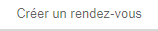 button allows an appointment to be made for the selected customer.
* The  button allows you to add the selected customer to the [customers panel](https://mynomadia.com/privatedoc/9LLcWh7j74sENa54/optitime-doc/docs/en/otgs-reference-book/call-center-menu.html#panier-des-clients).
* The  button [searches on objects nearby](https://mynomadia.com/privatedoc/9LLcWh7j74sENa54/optitime-doc/docs/en/otgs-reference-book/call-center-menu.html#rechercher-environs) the selected customer.
* The  button allows you to display the [List of appointments](https://mynomadia.com/privatedoc/9LLcWh7j74sENa54/optitime-doc/docs/en/otgs-reference-book/call-center-menu.html#liste-rdv-client) associated with the selected customer.
* The  button applies all the modifications made to this customer to all the saved appointment requests for this customer.
* The  button displays the weekly planning for a customer.
* The  buttons display the monthly planning for the customer.

**Customer form (Details tab)**

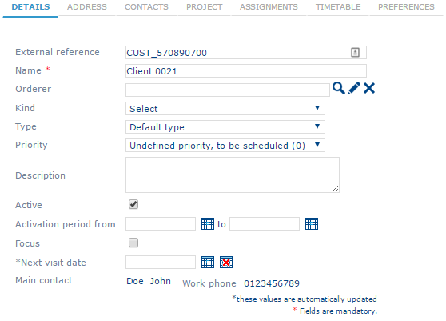

*   Here you will find general information about the customer such as its external reference number, its name (mandatory), its orderer, its kind, its type (mandatory), its priority and a description.

    |                                                                                                                                                                                                                                                                 |     |
    | --------------------------------------------------------------------------------------------------------------------------------------------------------------------------------------------------------------------------------------------------------------- | --- |
    | \[Tip]                                                                                                                                                                                                                                                          | Tip |
    | When it is not defined, the priority is normal. If the user wishes to give less priority to the scheduling of an appointment, they must define a value lower than 50, or conversely a value of more than 50 if the appointment is to be given greater priority. |     |

    The _`Orderer`_ field cannot be filled directly, but its content must be searched for via the  button. This executes the [orderer search](https://mynomadia.com/privatedoc/9LLcWh7j74sENa54/optitime-doc/docs/en/otgs-reference-book/call-center-menu.html#rechercher-commanditaire).
*

To find out more about orderers, see the [next chapter](https://mynomadia.com/privatedoc/9LLcWh7j74sENa54/optitime-doc/docs/en/otgs-reference-book/call-center-objets.html#commanditaire).

*

If no purchasing orderer details have been saved, it is possible to create them by clicking on the  button.

*

At this point, you can access the [orderer form](https://mynomadia.com/privatedoc/9LLcWh7j74sENa54/optitime-doc/docs/en/otgs-reference-book/call-center-objets.html#fiche-commanditaire) in edit mode.

*

If the user wants to unassign the customer purchasing contact this can be done using the  button.

*   The **Active** check-box should be checked for all active customers.

    |                                                                                                                                                                                                                                                          |         |
    | -------------------------------------------------------------------------------------------------------------------------------------------------------------------------------------------------------------------------------------------------------- | ------- |
    | \[Warning]                                                                                                                                                                                                                                               | Warning |
    | When this check-box is unchecked, the automated generation and placement of requests for appointments is impossible. Conversely, if requested or planned appointments exist for inactive customers, it will still be possible to place them via the OTR. |         |
* **Activation period** defines a period during which the generation of a visit is possible.
* The **Focus** check-box can be checked so the customer can be found again more rapidly with the [search function](https://mynomadia.com/privatedoc/9LLcWh7j74sENa54/optitime-doc/docs/en/otgs-reference-book/call-center-menu.html#menu-clients-rechercher).
* **Last visit** designates the date of the last visit.
* **The next visit** designates the date anticipated for the next planned, reserved and confirmed appointment.
* Finally, the information for the [main contact](https://mynomadia.com/privatedoc/9LLcWh7j74sENa54/optitime-doc/docs/en/otgs-reference-book/call-center-objets.html#fiche-client-contacts) are displayed at the bottom of the form.

**Customer form (Address tab)**

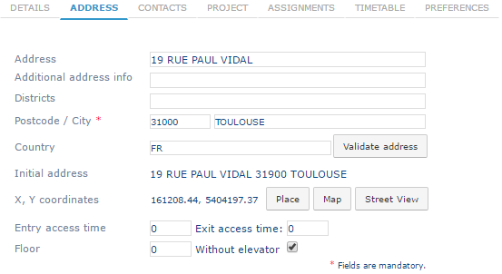

The address fields are described in the [geocoding](https://mynomadia.com/privatedoc/9LLcWh7j74sENa54/optitime-doc/docs/en/otgs-reference-book/intro-geocodage.html) chapter.

The Address tab contains the following additional fields:

* **Entry access time**: this information field gives the time it takes to access the customer (not used in the planning itself)
* **Exit access time**: information field providing the time needed to exit from the customer’s premises (not used in the planning itself)
* **Floor level**: customer floor level
* **Without elevator**: indicates whether a lift operates to access the customer

**Customer form (Contacts tab)**

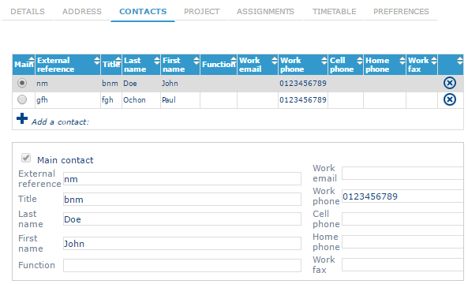

This page includes the list of pre-saved contacts as well as a frame allowing you to modify the information for the selected contact.

Contact information for customers are as follows:

* **Main contact**: this allows you to define the main contact. This will be the contact who will receive confirmation emails if this option is enabled under [circulation](https://mynomadia.com/privatedoc/9LLcWh7j74sENa54/optitime-doc/docs/en/otgs-reference-book/CSV.html#XML-circulation).
* **External reference**;
* **Title**: the contact’s title (Mrs, Mr, Dr, etc);
* The **last name** and **first name** for the contact;
* The **Function** in the organisation held by the contact;
* The contact’s address details (**Work email, telephone and fax**).

For a customer, you can add one or several contacts by clicking on the  button.

The customer fields are then reset.

The  button allows you to save the contact.

Finally, the  button enables deletion of a contact.

**Customer form (Project tab)**

For a specific customer, it is possible to define appointments in advance that are _regular appointments_. For example, a salesperson must visit their customer at least twice a month or a technician must perform security checks at least once a year.

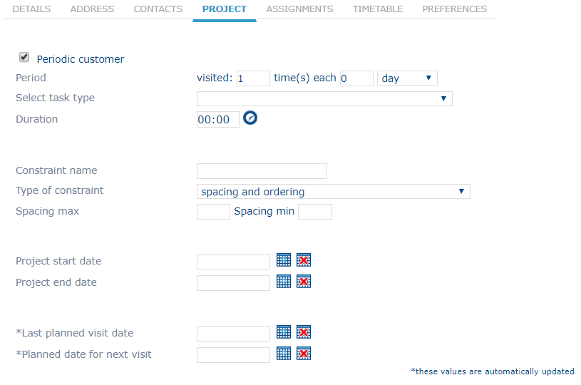

Fields in the Project tab are as follows:

* **Periodic customer** check-box: if this option is checked, the application will be capable of generating an appointment automatically on the anniversary date.
* the **Periodicity** defines how often visits will be planned for this customer. For example, for a visit that must take place twice per month, put 2 in the first text field, 1 in the second, and select "month" in the drop-down list.
* the **Task type** contains the list of all the types of tasks saved in the [Administration module](https://mynomadia.com/privatedoc/9LLcWh7j74sENa54/optitime-doc/docs/en/otgs-reference-book/donnees.html#type-intervention). The visits generated will be assigned the type of task as selected.
* the **duration** of visits generated.
*   it is also possible to define a [chaining constraint](https://mynomadia.com/privatedoc/9LLcWh7j74sENa54/optitime-doc/docs/en/otgs-reference-book/call-center-objets.html#contrainte-chainage) linking the appointments associated to this customer site.

    |                                                                                                                                                                                                                                                    |         |
    | -------------------------------------------------------------------------------------------------------------------------------------------------------------------------------------------------------------------------------------------------- | ------- |
    | \[Warning]                                                                                                                                                                                                                                         | Warning |
    | The name of the constraint allows you to identify the appointments that are concerned by the constraint. It must therefore be unique, as otherwise there will always be a risk of linking appointments that should not be linked via a constraint. |         |
*

|                                                                                                                                                                                                                                                                                                                                                                                                                             |     |
| --------------------------------------------------------------------------------------------------------------------------------------------------------------------------------------------------------------------------------------------------------------------------------------------------------------------------------------------------------------------------------------------------------------------------- | --- |
| \[Tip]                                                                                                                                                                                                                                                                                                                                                                                                                      | Tip |
| The most frequently used constraints are: - **spacing and ordering**: this defines the minimum and maximum gaps that can exist between visits. For example, there must be at least 20 days between two visits on a customer site where the customer must be visited every month. - **Separate day**: in the case of sites to be visited several times a week, this ensures that the visits are not grouped on the same day. |     |

* the **Project start and end dates** that indicate the dates interval within which appointments will be generated
* **Last planned visit date**: date the last time an appointment was generated
*   **Planned date for the next visit**: date of the next generation, that will also be the earliest date for the appointment generated

    |                                                                                                                                              |     |
    | -------------------------------------------------------------------------------------------------------------------------------------------- | --- |
    | \[Tip]                                                                                                                                       | Tip |
    | The _Last planned visit date_ and _Planned date for the next visit_ fields are updated automatically as a function of the last optimisation. |     |

|                                                                                                                                                                                                                                                                                                                                                                                                                                                                                                                                                                                                                                                                                                                                                                                                                                                                                                                                                                                                                                                                                                                 |      |
| --------------------------------------------------------------------------------------------------------------------------------------------------------------------------------------------------------------------------------------------------------------------------------------------------------------------------------------------------------------------------------------------------------------------------------------------------------------------------------------------------------------------------------------------------------------------------------------------------------------------------------------------------------------------------------------------------------------------------------------------------------------------------------------------------------------------------------------------------------------------------------------------------------------------------------------------------------------------------------------------------------------------------------------------------------------------------------------------------------------- | ---- |
| \[Note]                                                                                                                                                                                                                                                                                                                                                                                                                                                                                                                                                                                                                                                                                                                                                                                                                                                                                                                                                                                                                                                                                                         | Note |
| If the [application configuration](https://mynomadia.com/privatedoc/9LLcWh7j74sENa54/optitime-doc/docs/en/otgs-reference-book/perso.html#config-appli) allows it, (Display tab > CRM > crm.customer.project > _multipleProjects_ set to TRUE), this tab allows you to create **several projects** so appointments can be taken with different repeat settings for the same customer. images/ref/planification/definir-plusieurs-projets.png Click on the Add a project link. The project form includes 5 tabs: - **Details** tab: here we find the same fields as described for a mono-project above; - **Extra details** tab; - **Preferences** tab; - **Timetable** tab: allows you to define favourite opening days and times specific to the appointments that will be created for this project; - **Closings** tab: allows you to associate closing periods to this project. Once data entry is complete, click on the Add visit button to make an appointment that will be included in the cycle of the current project. The List visits button allows you to list appointments created for this project. |      |

**Customer form (Assignments tab)**

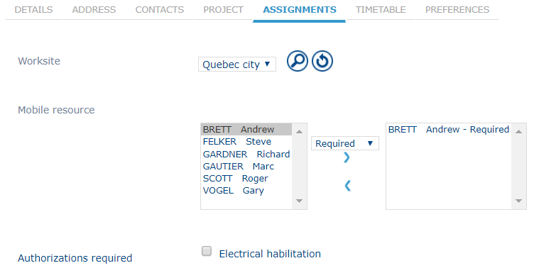

The first part of this tab allows you to modify the association of the customer to a **worksite**.\
The  is used to search for worksites sorted by dstance.\
The  button positions the site on _none_.

The second part of the tab allows you to define resource preferences for appointments to be fulfilled with this customer: select one or several resources in the left-hand pane, then select the status of the resources in the central list (if the [application configuration](https://mynomadia.com/privatedoc/9LLcWh7j74sENa54/optitime-doc/docs/en/otgs-reference-book/perso.html#config-appli) allows this), and finally, use the right arrow to move these resources in the right-hand window and so define your preferences.

|                                                                                                                                                                                                                                     |         |
| ----------------------------------------------------------------------------------------------------------------------------------------------------------------------------------------------------------------------------------- | ------- |
| \[Warning]                                                                                                                                                                                                                          | Warning |
| **Required** signifies: mandatory resource. **Desired** signifies: Preferred resource (but the others remain possible). **Undesirable** signifies that the appointments of this customer will never be attributed to this resource. |         |

|                                                                                                                                                                                                                                                                                                                                                                                                                                                                                                                                                                                                                |     |
| -------------------------------------------------------------------------------------------------------------------------------------------------------------------------------------------------------------------------------------------------------------------------------------------------------------------------------------------------------------------------------------------------------------------------------------------------------------------------------------------------------------------------------------------------------------------------------------------------------------- | --- |
| \[Tip]                                                                                                                                                                                                                                                                                                                                                                                                                                                                                                                                                                                                         | Tip |
| It is possible to combine statuses. For example: - **with several resources required**: the appointments will be attributed exclusively to a resource among those required, to the exclusion of all the others; - **with one or several resources required and one or several desired resources**: the appointments will be attributed in preference to the required resources, and if not, to the desired resources, to the exclusion of any other; - **with one or several desired resources** : the appointments will be attributed in preference to the desired resources, and if not, to other resources. |     |

Finally, if the [application configuration](https://mynomadia.com/privatedoc/9LLcWh7j74sENa54/optitime-doc/docs/en/otgs-reference-book/perso.html#config-appli) allows this, it is possible to request that certain [authorizations](https://mynomadia.com/privatedoc/9LLcWh7j74sENa54/optitime-doc/docs/en/otgs-reference-book/donnees.html#autorisation) have been granted for the resource, by checking the relevant check-boxes.

**Customer form (Timetable tab)**

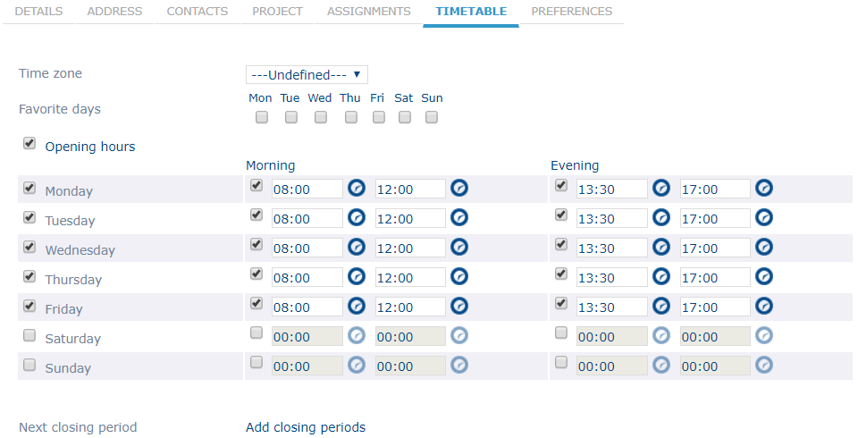

The customer availability constraint has been taken into account in order to improve the quality of the appointment taking.

First, select the **local time zone** to which they are affiliated.

The **favorite days** checked will be favored by the optimisation engine, but this does not prevent planning on another day, unlike the closure of a day as described above.

Check the **Opening hours** check-box (the check-box may be checked by default if the [application configuration](https://mynomadia.com/privatedoc/9LLcWh7j74sENa54/optitime-doc/docs/en/otgs-reference-book/perso.html#config-appli) allows this (Display tab > CRM > page.crm.openinghours.defaulthours > _enabled_ set to TRUE) to define the times customers are available on each day of the week, including a midday closure.

|                                                                                                                                                       |     |
| ----------------------------------------------------------------------------------------------------------------------------------------------------- | --- |
| \[Tip]                                                                                                                                                | Tip |
| For a specific day, if all values are set to 00:00 or if the check-box corresponding to the day is unchecked, the customer is not available that day. |     |

Finally it is possible to define **periods of closure** for the customer, for example to handle annual holidays in the month of August.

If a series of closing hours have already been saved for this customer, they will appear in this part of the form.

Click on the Add closing periods link to access the following page:

Handling periods of closure for a customer

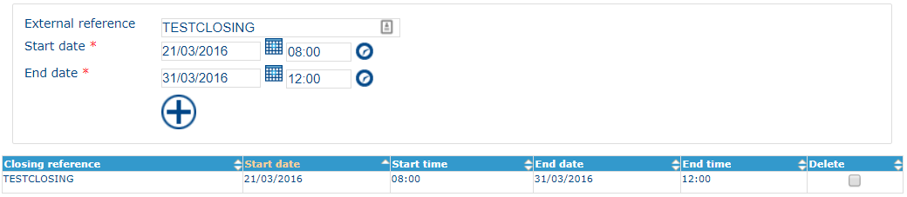

|                                                                                                                                            |      |
| ------------------------------------------------------------------------------------------------------------------------------------------ | ---- |
| \[Note]                                                                                                                                    | Note |
| Addition of a period of closure automatically results in its being saved. You don’t need to save this when returning to the customer form. |      |

**Customer form (Preferences tab)**

This tab can be configured. It displays the different additional fields for the customer. It is possible to display / hide fields in the [Application settings](https://mynomadia.com/privatedoc/9LLcWh7j74sENa54/optitime-doc/docs/en/otgs-reference-book/perso.html#config-appli) menu.

The fields for each customer can now be entered.

### Orderers

The orderer can, for example, be a central administration, a referring entity, or a main site. An orderer may have several customers affiliated to it.

#### Orderer form

Access to the [form](https://mynomadia.com/privatedoc/9LLcWh7j74sENa54/optitime-doc/docs/en/otgs-reference-book/call-center-objets.html#call-center-fiche-gral) of the orderer can be made via the [customer form](https://mynomadia.com/privatedoc/9LLcWh7j74sENa54/optitime-doc/docs/en/otgs-reference-book/call-center-objets.html#fiche-client) or via the [orderer search](https://mynomadia.com/privatedoc/9LLcWh7j74sENa54/optitime-doc/docs/en/otgs-reference-book/call-center-menu.html#rechercher-commanditaire) function.

Orderer form in edit mode

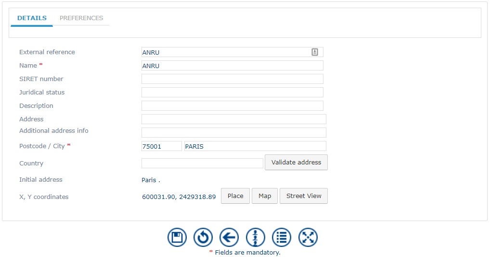

The orderer form includes 2 tabs:

* [Details](https://mynomadia.com/privatedoc/9LLcWh7j74sENa54/optitime-doc/docs/en/otgs-reference-book/call-center-objets.html#fiche-commanditaire-details) tab;
* [Preferences](https://mynomadia.com/privatedoc/9LLcWh7j74sENa54/optitime-doc/docs/en/otgs-reference-book/call-center-objets.html#fiche-commanditaire-pref) tab.

This also allows you to perform specific actions using the following buttons:

* The  button displays the [customer list](https://mynomadia.com/privatedoc/9LLcWh7j74sENa54/optitime-doc/docs/en/otgs-reference-book/call-center-menu.html#resultat-recherche-client) associated to the selected orderer.
* The  button displays the [appointment list](https://mynomadia.com/privatedoc/9LLcWh7j74sENa54/optitime-doc/docs/en/otgs-reference-book/call-center-menu.html#liste-rdv-client) associated to the selected project orderer.
* The  button allows you to [search for objects nearby](https://mynomadia.com/privatedoc/9LLcWh7j74sENa54/optitime-doc/docs/en/otgs-reference-book/call-center-menu.html#rechercher-environs) the selected orderer.

**Project orderer form (Details tab)**

The form contains the following fields:

* The external reference
* The name
* The SIRET number
* The juridical status
* A description
* The address fields are described in the [geocoding](https://mynomadia.com/privatedoc/9LLcWh7j74sENa54/optitime-doc/docs/en/otgs-reference-book/intro-geocodage.html) chapter.

|                                                                                     |     |
| ----------------------------------------------------------------------------------- | --- |
| \[Tip]                                                                              | Tip |
| Certain items of information are mandatory such as the **Name** and **Town** field. |     |

**Project orderer form (Preferences tab)**

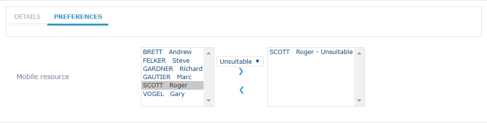

This tab allows you to define resource preferences for appointments to be made with customers associated to this orderer: select one or several resources in the left-hand window, and then use the right arrow to move the resources around in the right-hand window to define your preferences.

### Appointments

Appointments are the most important objects as regards the call centre. They are always affiliated to a [customer](https://mynomadia.com/privatedoc/9LLcWh7j74sENa54/optitime-doc/docs/en/otgs-reference-book/call-center-objets.html#objets-clients).

They will appear in a particular colour in the planning and can be displayed on the map.

New appointments are made, either:

* using the [set new appointment](https://mynomadia.com/privatedoc/9LLcWh7j74sENa54/optitime-doc/docs/en/otgs-reference-book/call-center-menu.html#prendre-nouveau-rdv) function;
* or via the customer lists, or from the [customer form](https://mynomadia.com/privatedoc/9LLcWh7j74sENa54/optitime-doc/docs/en/otgs-reference-book/call-center-objets.html#fiche-client);
* or using the [empty planning tool-tip](https://mynomadia.com/privatedoc/9LLcWh7j74sENa54/optitime-doc/docs/en/otgs-reference-book/call-center-agenda.html#tool-tip-planning-vide).

#### Appointment form

The [form](https://mynomadia.com/privatedoc/9LLcWh7j74sENa54/optitime-doc/docs/en/otgs-reference-book/call-center-objets.html#call-center-fiche-gral) for an appointment is accessible via:

* the [appointment search](https://mynomadia.com/privatedoc/9LLcWh7j74sENa54/optitime-doc/docs/en/otgs-reference-book/call-center-menu.html#rechercher-rdv);
* the [appointment search on status](https://mynomadia.com/privatedoc/9LLcWh7j74sENa54/optitime-doc/docs/en/otgs-reference-book/call-center-menu.html#chercher-rdv-etats);
* the [customer form](https://mynomadia.com/privatedoc/9LLcWh7j74sENa54/optitime-doc/docs/en/otgs-reference-book/call-center-objets.html#fiche-client);
* the [list of urgent appointments](https://mynomadia.com/privatedoc/9LLcWh7j74sENa54/optitime-doc/docs/en/otgs-reference-book/_the_header_bar.html#liste-rdv-urgent);
* [appointment counters](https://mynomadia.com/privatedoc/9LLcWh7j74sENa54/optitime-doc/docs/en/otgs-reference-book/call-center-cadre-info.html#compteurs-rdv);
* the [map](https://mynomadia.com/privatedoc/9LLcWh7j74sENa54/optitime-doc/docs/en/otgs-reference-book/call-center-carte.html);
* the [appointments information popup](https://mynomadia.com/privatedoc/9LLcWh7j74sENa54/optitime-doc/docs/en/otgs-reference-book/call-center-agenda.html#tool-tip-rdv) in the planning.

This allows you to apply [actions](https://mynomadia.com/privatedoc/9LLcWh7j74sENa54/optitime-doc/docs/en/otgs-reference-book/call-center-objets.html#rdv-boutons-action-fiche) to appointments and comprises 7 parts as follows:

1. [General](https://mynomadia.com/privatedoc/9LLcWh7j74sENa54/optitime-doc/docs/en/otgs-reference-book/call-center-objets.html#d172e2482)

|        |                                                                                                                                                                                                                                                                                                                                               |
| ------ | --------------------------------------------------------------------------------------------------------------------------------------------------------------------------------------------------------------------------------------------------------------------------------------------------------------------------------------------- |
| **1.** | **General**                                                                                                                                                                                                                                                                                                                                   |
|        | This tab contains information about the intervention such as its **identifier**, (internal identifier separated from the external identifier by a "/"), and also the **Earliest date** and **Latest date** indicating the period of time during which the intervention must be fulfilled. General images/ref/planification/onglet-general.png |

*

|                                                                                                                                                                          |         |
| ------------------------------------------------------------------------------------------------------------------------------------------------------------------------ | ------- |
| \[Warning]                                                                                                                                                               | Warning |
| You can display - in the map itself or in another window - additional information about the resource by clicking on the images/ref/buttons/bouton-informations.png link. |         |

**Customer** : This tab summarises all the information relevant to the [customer](https://mynomadia.com/privatedoc/9LLcWh7j74sENa54/optitime-doc/docs/en/otgs-reference-book/call-center-objets.html#fiche-client) such as the customer reference, name, address and [contact details](https://mynomadia.com/privatedoc/9LLcWh7j74sENa54/optitime-doc/docs/en/otgs-reference-book/call-center-objets.html#fiche-client-contacts).

```
Customer


```

\+

|                                                                                                           |         |
| --------------------------------------------------------------------------------------------------------- | ------- |
| \[Warning]                                                                                                | Warning |
| You can access the full customer form by clicking on the images/ref/buttons/bouton-informations.png link. |         |

**Communication** : This tab summarises the information to be communicated on the subject of the intervention such as the time slot, the time, the resource, the type of intervention, and any equipment needed.

```
Communication


|  |  |
| --- | --- |
| [Warning] | Warning |
| Clicking on the images/ref/buttons/bouton-informations.png button located at the level of the type of intervention, an infobox indicates the [competencies](https://mynomadia.com/privatedoc/9LLcWh7j74sENa54/optitime-doc/docs/en/otgs-reference-book/donnees.html#competence "Skill") needed for the fulfilment of the intervention.  This button can also be found at the level of the selected resource, and enables information such as the duration of the intervention to be obtained, along with the distance and journey time from the previous intervention, and journey time to the next. |
```

**Fulfilment status** : This tab summarises the information relating to the state of play on the intervention, and enables the user to fill in details of this status.

```
Fulfilment status


Several statuses are available: Indeterminate status, Unfulfilled, Fulfilled, Unable to fulfill. These are described in the
[Progression steps](https://mynomadia.com/privatedoc/9LLcWh7j74sENa54/optitime-doc/docs/en/otgs-reference-book/_the_different_statuses_for_appointments_in_opti_time.html#etats-avancement "Progression steps") chapter.
```

\+

|                                                                                                                                                                                   |      |
| --------------------------------------------------------------------------------------------------------------------------------------------------------------------------------- | ---- |
| \[Note]                                                                                                                                                                           | Note |
| If the user selects as status **Fulfilled** they will then be able to fill in the **Intervention report**, this option only being available for the fulfilled appointment status. |      |

**Additional data** : Depending on the rights granted to the user, this tab enables him to associate a document to the intervention, as well as various information items such as quantities.

```
Complementary data tab


```

**Comments** : This tab allows the user to add a commentary on the intervention. This commentary is only available when consulting the planning.

```
Comments tab


```

**Messages** : This tab allows the user to consult any [messages](https://mynomadia.com/privatedoc/9LLcWh7j74sENa54/optitime-doc/docs/en/otgs-reference-book/call-center-menu.html#messages) exchanged on the subject of this intervention and/or to create new messages.

```
Messages tab


```

**Constraints** : This tab allows the user to add a chaining constraint to the intervention by clicking on the  button.

```
Constraints tab


```

The constraints are described in the [chaining constraint](https://mynomadia.com/privatedoc/9LLcWh7j74sENa54/optitime-doc/docs/en/otgs-reference-book/call-center-objets.html#contrainte-chainage) chapter.

**Action buttons**

A series of different action buttons are available

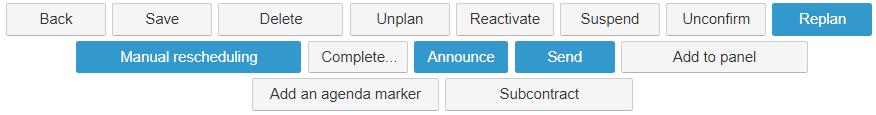

The following actions can be applied from an appointment form:

* The Back button takes you back to the last screen;
* The Save button allows the user to save all the modifications made to the appointment form;
* The Delete button deletes the appointment. The user must indicate whether the intervention has been deleted by the customer or by the company. Once the deletion has been validated, it will take on a [status](https://mynomadia.com/privatedoc/9LLcWh7j74sENa54/optitime-doc/docs/en/otgs-reference-book/_the_different_statuses_for_appointments_in_opti_time.html#statuts) _Cancelled_ status;
* The Unplan button restores the [status](https://mynomadia.com/privatedoc/9LLcWh7j74sENa54/optitime-doc/docs/en/otgs-reference-book/_the_different_statuses_for_appointments_in_opti_time.html#statuts) of the appointment to what it was previously;
* The Reactivate button restores the daily planning of the selected appointment. The appointment status then changes to a _Requested_ [status](https://mynomadia.com/privatedoc/9LLcWh7j74sENa54/optitime-doc/docs/en/otgs-reference-book/_the_different_statuses_for_appointments_in_opti_time.html#statuts), and is added to the [panel](https://mynomadia.com/privatedoc/9LLcWh7j74sENa54/optitime-doc/docs/en/otgs-reference-book/call-center-agenda.html#manipuler-une-intervention-a-partir-du-panier);
* The Suspend button results in the same outcome as unplanning with one exception: the suspended appointments will not be optimisable by the [batch](https://mynomadia.com/privatedoc/9LLcWh7j74sENa54/optitime-doc/docs/en/otgs-reference-book/_glossary.html#batch) or the [OTR](https://mynomadia.com/privatedoc/9LLcWh7j74sENa54/optitime-doc/docs/en/otgs-reference-book/call-center-objets.html);
* The Unconfirm button changes the status of the appointment from a _Confirmed_ [status](https://mynomadia.com/privatedoc/9LLcWh7j74sENa54/optitime-doc/docs/en/otgs-reference-book/_the_different_statuses_for_appointments_in_opti_time.html#statuts) to a _Planned_ [status](https://mynomadia.com/privatedoc/9LLcWh7j74sENa54/optitime-doc/docs/en/otgs-reference-book/_the_different_statuses_for_appointments_in_opti_time.html#statuts);
* The Plan/Replan button returns the user to the [real-time planning](https://mynomadia.com/privatedoc/9LLcWh7j74sENa54/optitime-doc/docs/en/otgs-reference-book/call-center-objets.html#planification-optimisee-rdv) page;
* The Manual scheduling/Manual rescheduling button returns the user to the [Manual planning](https://mynomadia.com/privatedoc/9LLcWh7j74sENa54/optitime-doc/docs/en/otgs-reference-book/call-center-objets.html#planification-manuelle-rdv) page;
*   The Complete… button changes the appointment [status](https://mynomadia.com/privatedoc/9LLcWh7j74sENa54/optitime-doc/docs/en/otgs-reference-book/_the_different_statuses_for_appointments_in_opti_time.html#statuts) to _Completed_.\
    You will need to have filled in the following completion form beforehand:

    Completion status form

    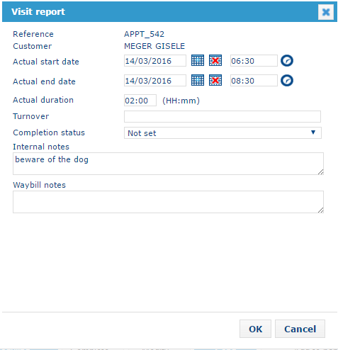
* The Transform button (visible whenever the appointment is requested) opens a page in which you can rapidly apply pre-configured modifications such as the modification of earliest and latest dates, for example.
*   The Modify… button allows you to modify the information items that cannot be edited in the form itself.

    Modify appointment form

    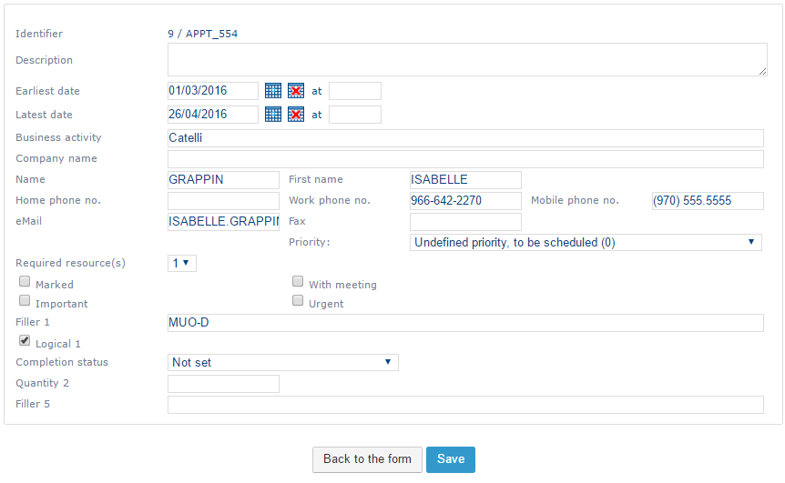
*

The Save button saves the modifications and the Back to the form button takes you back to the appointment form.

* The Announce button creates a configurable [circulation listener](https://mynomadia.com/privatedoc/9LLcWh7j74sENa54/optitime-doc/docs/en/otgs-reference-book/CSV.html#listener), for example, when sending a pre-formatted message to all the customer appointment contacts in the list.
*   The Send button allows you to signal that the technician has been informed about the appointment. The  icon displays opposite the name of the resource concerned.

    |                                                                                                                                                                                                                                                                       |     |
    | --------------------------------------------------------------------------------------------------------------------------------------------------------------------------------------------------------------------------------------------------------------------- | --- |
    | \[Tip]                                                                                                                                                                                                                                                                | Tip |
    | The appointment then changes status so it now has a status of [notification status](https://mynomadia.com/privatedoc/9LLcWh7j74sENa54/optitime-doc/docs/en/otgs-reference-book/_the_different_statuses_for_appointments_in_opti_time.html#etats-notification) "sent". |     |
* The Add to panel button adds the appointment to the [panel](https://mynomadia.com/privatedoc/9LLcWh7j74sENa54/optitime-doc/docs/en/otgs-reference-book/call-center-agenda.html#manipuler-une-intervention-a-partir-du-panier);
* The Add an agenda marker button returns you to the Add a new [agenda marker](https://mynomadia.com/privatedoc/9LLcWh7j74sENa54/optitime-doc/docs/en/otgs-reference-book/call-center-menu.html#gerer-jalons) function;
* Visit report (button visible if the appointment is fulfilled) authorises the resource to complete the information in the appointment form once the latter has been set up; the user must fill in any notes, modify the status of the appointment if this needs updating (fulfilled, unfulfilled) and raise an explanatory report for the visit if fulfilled.
* The Subcontract button changes the appointment [status](https://mynomadia.com/privatedoc/9LLcWh7j74sENa54/optitime-doc/docs/en/otgs-reference-book/_the_different_statuses_for_appointments_in_opti_time.html#statuts) to _Externalised_.

### Steps in the scheduling process

The planning process is made up of several steps:

#### Qualification of the appointment

The [validation of the solution](https://mynomadia.com/privatedoc/9LLcWh7j74sENa54/optitime-doc/docs/en/otgs-reference-book/call-center-objets.html#planification-confirmation) suggested by the application. Where an optimisation is being performed, several timeslots may be suggested for scheduling the appointment. The validation of the appointment is possible when you [set a new appointment](https://mynomadia.com/privatedoc/9LLcWh7j74sENa54/optitime-doc/docs/en/otgs-reference-book/call-center-menu.html#prendre-nouveau-rdv) or when you make an appointment for an existing customer having first performed a [customer search](https://mynomadia.com/privatedoc/9LLcWh7j74sENa54/optitime-doc/docs/en/otgs-reference-book/call-center-menu.html#menu-clients-rechercher).

Optimisation request

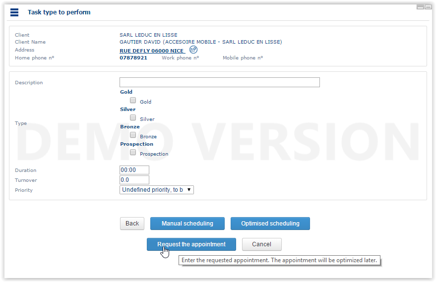

Qualification consists of filling in at least the **Intervention type**, the **duration** of the appointment and a **description**.

|                                                                                                                                                                                                                                                                                                                                                                                                                                                                                                                                                                                                                                                                                                                                                                                                                                                                                                                                                                                                                                                                                                                                                                                                                |      |
| -------------------------------------------------------------------------------------------------------------------------------------------------------------------------------------------------------------------------------------------------------------------------------------------------------------------------------------------------------------------------------------------------------------------------------------------------------------------------------------------------------------------------------------------------------------------------------------------------------------------------------------------------------------------------------------------------------------------------------------------------------------------------------------------------------------------------------------------------------------------------------------------------------------------------------------------------------------------------------------------------------------------------------------------------------------------------------------------------------------------------------------------------------------------------------------------------------------- | ---- |
| \[Note]                                                                                                                                                                                                                                                                                                                                                                                                                                                                                                                                                                                                                                                                                                                                                                                                                                                                                                                                                                                                                                                                                                                                                                                                        | Note |
| You can modify the address by clicking on the button beside the address. The modification of the address is described in the [geocoding](https://mynomadia.com/privatedoc/9LLcWh7j74sENa54/optitime-doc/docs/en/otgs-reference-book/intro-geocodage.html) chapter. This address serves to identify the [intervention sector](https://mynomadia.com/privatedoc/9LLcWh7j74sENa54/optitime-doc/docs/en/otgs-reference-book/call-center-objets.html) concerned at the time scheduling of the associated appointment takes place. To do this, you will need to enable: - the _Customization > Configuration > Display > Address > address.district.codification > cityInDistrictSubstringIndexes_ parameter, that generates the INSEE code from the IRIS code returned by [geocoding](https://mynomadia.com/privatedoc/9LLcWh7j74sENa54/optitime-doc/docs/en/otgs-reference-book/intro-geocodage.html); - the _Customization > Configuration > Application > Agents > appointment.completion.agent.districting > codeZoneWorksite and codeZoneWorksite.ordering_ agent, which takes the INSEE code as starting point to go and search for the unique correspondence among towns added to the various saved sectors. |      |

Once the intervention has been qualified, the user can [**request an appointment**](https://mynomadia.com/privatedoc/9LLcWh7j74sENa54/optitime-doc/docs/en/otgs-reference-book/call-center-objets.html#demande-rdv), requesting [**optimised scheduling**](https://mynomadia.com/privatedoc/9LLcWh7j74sENa54/optitime-doc/docs/en/otgs-reference-book/call-center-objets.html#planification-optimisee-rdv) or [**manual scheduling**](https://mynomadia.com/privatedoc/9LLcWh7j74sENa54/optitime-doc/docs/en/otgs-reference-book/call-center-objets.html#planification-manuelle-rdv) as required.

#### Appointment request

Request an appointment with period of fulfilment

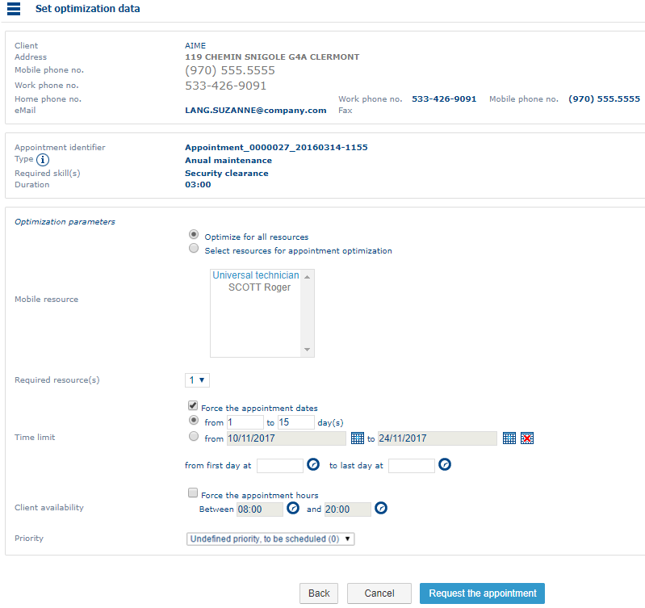

In this screen, the user terminates the qualification of the appointment by filling in the following information:

* **Resource** allows you to force which mobile resources will be assigned to perform the appointment. To do this, select the _Select resources to optimise_ radio-button, and then select the resource(s) to be used.
* A **Time limit** can be set to restrict the possible scope for the scheduling. First check the _Force the appointment dates_ check-box, and then select the earliest date required as well as the latest possible date in terms of a number of days, or by selecting dates using the popup calendars.

Similarly, you can define a time on the first (or last) day of the appointment being scheduled before (or after) which the appointment will not be scheduled.

* **Client availability** allows you to set times when the client is available.
*   **Priority**: the more urgent the appointment is, the more likely it is that it will be scheduled by the application in the event of an overload on the plannings generally.

    |                                                                                                                                           |     |
    | ----------------------------------------------------------------------------------------------------------------------------------------- | --- |
    | \[Tip]                                                                                                                                    | Tip |
    | A priority of 100 should be used sparingly, and only for the most urgent appointments. A priority of 0 is equivalent to a priority of 50. |     |

It is possible to **cancel** the appointment request or confirm it by clicking on **Request an appointment**. An appointment is then created with a [status](https://mynomadia.com/privatedoc/9LLcWh7j74sENa54/optitime-doc/docs/en/otgs-reference-book/_the_different_statuses_for_appointments_in_opti_time.html#statuts) of _Requested_ and so can be automatically scheduled by the batch optimisation engine.

#### Optimised appointment (real time)

Once the appointment has been [qualified](https://mynomadia.com/privatedoc/9LLcWh7j74sENa54/optitime-doc/docs/en/otgs-reference-book/call-center-objets.html#creation-rdv-demande), it will be possible to request that the application calculates the best opportunities as a function of the constraints imposed: these are the optimised, or optimised in real time functions, as opposed to [cold optimisation](https://mynomadia.com/privatedoc/9LLcWh7j74sENa54/optitime-doc/docs/en/otgs-reference-book/optimisation.html#planif-optim)).

Configuration window for the search for an optimised appointment

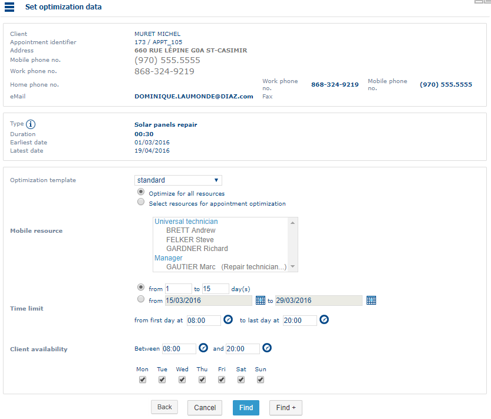

Here, the fields are similar to those for the [appointment request](https://mynomadia.com/privatedoc/9LLcWh7j74sENa54/optitime-doc/docs/en/otgs-reference-book/call-center-objets.html#demande-rdv).

In addition, you can specify an [optimization profile](https://mynomadia.com/privatedoc/9LLcWh7j74sENa54/optitime-doc/docs/en/otgs-reference-book/optimisation.html#profil-optim) and the days on which the appointment will not be scheduled, by unchecking these as required at the end of the page.

You will be able to cancel the scheduling by clicking on the Cancel button.

The Search or Search + buttons run the search on suggestions from the application and display the [results](https://mynomadia.com/privatedoc/9LLcWh7j74sENa54/optitime-doc/docs/en/otgs-reference-book/call-center-objets.html).

|                                                                                                                                                                                                                                                                                                                                                                   |         |
| ----------------------------------------------------------------------------------------------------------------------------------------------------------------------------------------------------------------------------------------------------------------------------------------------------------------------------------------------------------------- | ------- |
| \[Warning]                                                                                                                                                                                                                                                                                                                                                        | Warning |
| In the case of a multi-resource appointment, if the **Select resources to optimise** option is activated, you need to select as many resources as are necessary to fulfil the appointment. The Search + function returns suggestions on the timeslots already taken by authorising the engine to extract from the agendas any appointments with a planned status. |         |

Result of an optimisation via the Search + button

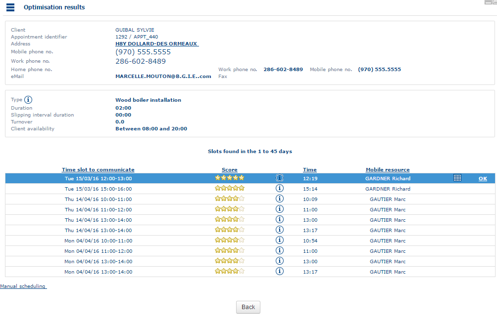

|                                                                                                                                                                                                                                                                                                                                                                                                                                                              |      |
| ------------------------------------------------------------------------------------------------------------------------------------------------------------------------------------------------------------------------------------------------------------------------------------------------------------------------------------------------------------------------------------------------------------------------------------------------------------ | ---- |
| \[Note]                                                                                                                                                                                                                                                                                                                                                                                                                                                      | Note |
| If the table is displayed following utilisation of the [Search +](https://mynomadia.com/privatedoc/9LLcWh7j74sENa54/optitime-doc/docs/en/otgs-reference-book/call-center-objets.html#planification-optimisee-rdv) function, a images/ref/buttons/avertissement.png symbol indicates that one or several planned appointments must be unplanned once this operation is completed. Moving the mouse over the item reveals the detailed information in a popup. |      |

In the upper part of the screen is a summary of the information present in the [appointment form](https://mynomadia.com/privatedoc/9LLcWh7j74sENa54/optitime-doc/docs/en/otgs-reference-book/call-center-objets.html#fiche-rdv).

Below, a listing of all appointment opportunities corresponding to the request expressed is displayed.

This list is sorted in order of cost suitability (best compromise between the date, the resource’s qualification and the journey distance to arrive at the appointment).\
The lower the cost of the route plan suggestion, the higher its suitability, and the better the suggestion.

|                                                                                                                                                                                                                                                                                        |     |
| -------------------------------------------------------------------------------------------------------------------------------------------------------------------------------------------------------------------------------------------------------------------------------------- | --- |
| \[Tip]                                                                                                                                                                                                                                                                                 | Tip |
| A stars system can be configured to represent this suitability visually. To do this, activate the [optimization setting](https://mynomadia.com/privatedoc/9LLcWh7j74sENa54/optitime-doc/docs/en/otgs-reference-book/optimisation.html#param-optim) _Display solution cost as a chart_. |     |

The table suggests, for each of the potential resources, over and above the time window, the cost as well as the presenting time calculated for the appointment. Moving the mouse cursor over the item displays an information popup associated to the cost giving the different information items explaining the cost value (the journey time added in relation to the appointments already fixed, the extra distance and the time needed…).

The Agenda icon on the line of a suggested timeslot displays the agenda for the day in question and the corresponding resources in the [planning](https://mynomadia.com/privatedoc/9LLcWh7j74sENa54/optitime-doc/docs/en/otgs-reference-book/call-center-objets.html) section.

The OK link validates the choice of appointment and returns the user to the confirmation page.

Confirmation of the suggestion

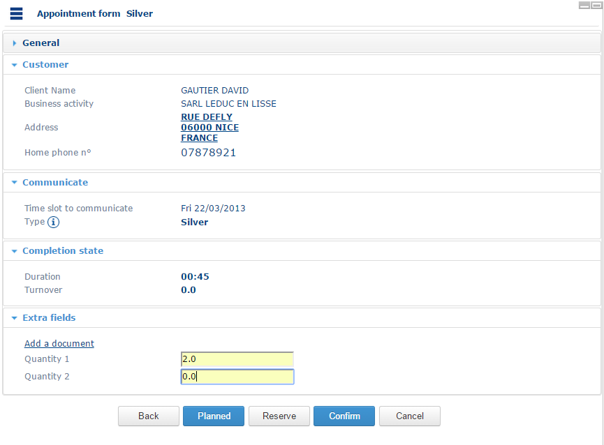

The information in the [Appointment form](https://mynomadia.com/privatedoc/9LLcWh7j74sENa54/optitime-doc/docs/en/otgs-reference-book/call-center-objets.html#fiche-rdv) is then shown. It is also possible to enter additonal notes if necessary.

Click on the Confirm button to confirm the taking of the appointment and switch to the appointment home page.

Click on the Back button to go back to the previous step.

Click on the Subcontract button to change the appointment [status](https://mynomadia.com/privatedoc/9LLcWh7j74sENa54/optitime-doc/docs/en/otgs-reference-book/_the_different_statuses_for_appointments_in_opti_time.html#statuts) to _Externalised_.

#### Manual appointment

Unlike [optimised scheduling](https://mynomadia.com/privatedoc/9LLcWh7j74sENa54/optitime-doc/docs/en/otgs-reference-book/call-center-objets.html#planification-optimisee-rdv), manual scheduling forces the resource(s) used, as well as the date and time of the appointment. It will therefore be possible to override some scheduling constraints.

Manual appointment taking

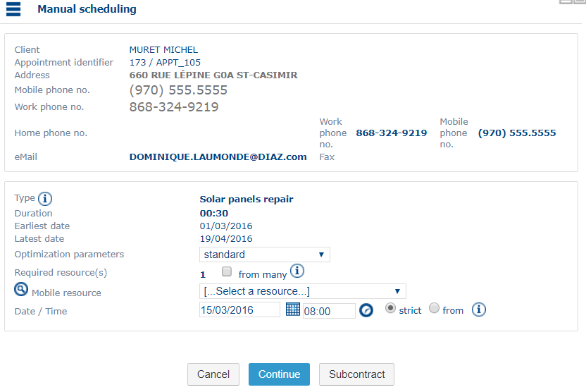

The manual scheduling function copies, in the first part, the information from the [appointment form](https://mynomadia.com/privatedoc/9LLcWh7j74sENa54/optitime-doc/docs/en/otgs-reference-book/call-center-objets.html#fiche-rdv).

You will need to specify an [optimization profile](https://mynomadia.com/privatedoc/9LLcWh7j74sENa54/optitime-doc/docs/en/otgs-reference-book/optimisation.html#profil-optim).

The resource type is adjusted in relation to the type of intervention selected (as a function of competencies) and a drop-down list allows you to choose the resource among those assigned to the area on which the call taker works.\
While it is not necessary or mandatory to choose a precise resource, it is possible to allow the application to choose from all the resources able to make the journey by checking the **several** option.

The first thing to do is choose a **date** and a **time** for the appointment in the two editable zones provided.\
If the **Precise** option is chosen, the application verifies whether it will be possible to place the intervention at the time indicated.\
If the **From** option is chosen, the application will search for the best solution from the indicated time.

|                                                                                                                                                                                                                                                                                                                                                                                                                                                                                                             |     |
| ----------------------------------------------------------------------------------------------------------------------------------------------------------------------------------------------------------------------------------------------------------------------------------------------------------------------------------------------------------------------------------------------------------------------------------------------------------------------------------------------------------- | --- |
| \[Tip]                                                                                                                                                                                                                                                                                                                                                                                                                                                                                                      | Tip |
| The [planning](https://mynomadia.com/privatedoc/9LLcWh7j74sENa54/optitime-doc/docs/en/otgs-reference-book/call-center-agenda.html) is automatically updated with the planning for the selected resource(s) on the chosen date. The call taker can then confirm the availability of the potential resource and modify the three main variables as required: resource, date and day. The button to the left of the **resource** allows you to refresh the list of resources as a function of the chosen date. |     |

The Continue button allows you to see which constraints will be forced by the scheduling, or to confirm the solution, if constraint override is not used.

The Subcontract button changes the appointment [status](https://mynomadia.com/privatedoc/9LLcWh7j74sENa54/optitime-doc/docs/en/otgs-reference-book/_the_different_statuses_for_appointments_in_opti_time.html#statuts) to _Externalised_.

Displaying forced constraints where override has been used

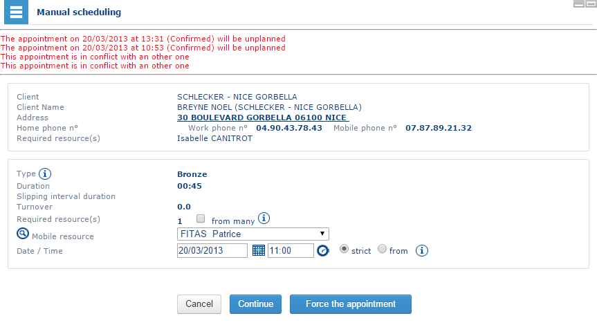

Where one or several constraints must be forced to enable the appointment to be scheduled at the chosen time, a series of warning messages display in red at the top of the screen.

Messages may concern the unplanning of an appointment or unavailability, a time constraint of the resource or of the client, or again a constraint on the assignment of the resource.

|                                                                                                                                                                                                                                                                                          |      |
| ---------------------------------------------------------------------------------------------------------------------------------------------------------------------------------------------------------------------------------------------------------------------------------------- | ---- |
| \[Note]                                                                                                                                                                                                                                                                                  | Note |
| If an appointment is unplanned, the appointment(s) that have been unplanned will display automatically in the [panel](https://mynomadia.com/privatedoc/9LLcWh7j74sENa54/optitime-doc/docs/en/otgs-reference-book/call-center-agenda.html#manipuler-une-intervention-a-partir-du-panier). |      |

|                                                                                                                                                                                                                                                                                                                                                                                                                                                                            |     |
| -------------------------------------------------------------------------------------------------------------------------------------------------------------------------------------------------------------------------------------------------------------------------------------------------------------------------------------------------------------------------------------------------------------------------------------------------------------------------- | --- |
| \[Tip]                                                                                                                                                                                                                                                                                                                                                                                                                                                                     | Tip |
| You can authorise superimposition at the time a positioning action is made without unplanning other appointments or unavailabilities. To do this, configure the various _Manual placement with overlap_ [optimization parameters](https://mynomadia.com/privatedoc/9LLcWh7j74sENa54/optitime-doc/docs/en/otgs-reference-book/optimisation.html#param-optim) and the _CALLCENTER\_FORCE\_IMPOSE\_APP\_WITH\_OVERLAPS_ right. A Overlap the appointment button then appears. |     |

A [confirmation](https://mynomadia.com/privatedoc/9LLcWh7j74sENa54/optitime-doc/docs/en/otgs-reference-book/call-center-objets.html#planification-confirmation) screen allows you to complete the appointment-making operation.

### Setting up liaisons between appointments

Liaisons between appointments (appointments that are to take place simultaneously or that must respect a minimum gap between them, etc.) are modelled by chaining constraints.

A chain is composed of different appointments and features a liaison type.

|                                                                                                                                                                                                                                 |         |
| ------------------------------------------------------------------------------------------------------------------------------------------------------------------------------------------------------------------------------- | ------- |
| \[Warning]                                                                                                                                                                                                                      | Warning |
| Excepted for the **stapling** liaison type, the chain can be inserted in an incomplete form if some constraints are not suitable. This means that the presence of all the member items of a constraint chain is not guaranteed. |         |

#### Types of liaison (chaining constraints)

*   **Spacing and ordering**: guarantees that between one appointment and the next a certain minimum or maximum delay is respected. The minimum and maximum time delays taken into account are the values defined in the _Minimum delay_ and _Maximum delay_ fields. This type of constraint also allows you to be able to manage the sequencing in the schedule (ie the ordering of appointments) by the application (field\_Scheduling order\_ defined in section 2 on the screen).

    Example 1: all appointments must follow one another with 1 or 2 days gap between them. Therefore you need to specify in the _Minimum gap_ field a value of 1, and in the _Maximum gap_ field, a value of 2.

    Example 2: all appointments must be completed on the same day. Therefore, you will need to specify a value of 0 in the _Minimum gap_ and _Maximum gap_ fields.
*   **Same resource**: Guarantees that the appointments in the chain will be planned on the same resource.

    |                                                                                                                                                                                                                                |         |
    | ------------------------------------------------------------------------------------------------------------------------------------------------------------------------------------------------------------------------------ | ------- |
    | \[Warning]                                                                                                                                                                                                                     | Warning |
    | - If the constraint is not compatible with the required resources, or with resources that are refused, preferred, or assigned, the complete chain will be rejected. - This liaison type does not apply in multi-resource mode. |         |
*   **Unbreakable**: Guarantees that ALL appointments are completed, one after the other (without other appointments being inserted between them).

    |                                                                                                                                                   |         |
    | ------------------------------------------------------------------------------------------------------------------------------------------------- | ------- |
    | \[Warning]                                                                                                                                        | Warning |
    | This type of constraint is not applicable in batch optimisation mode with Dispatcher. Functions only in pre-scheduling by real time optimisation. |         |
*

|                                                     |      |
| --------------------------------------------------- | ---- |
| \[Note]                                             | Note |
| This is non-selectable via the Opti-Time interface. |      |

* **Grouped (maximum spacing from start)**: all appointments in the chain must be completed within a maximum timespan in relation to the first appointment (maximum timespan between the first appointment 1 and the last). For example, all appointments in the chain must be completed within a timespan of 2 days counting from the 1st appointment.
* **Same resource and grouped**: Guarantees that the appointments are scheduled one after the other (with other appointments inserted between them a possibility), on the same resource and on the defined maximal time interval.
* **Delayed (Minimum gap in relation to the first)**: all appointments in the string must take place after a certain timespan starting from the first appointment (i.e. the time interval between appointment 1 and the next ones). For example, respecting an interval of 3 days after the first appointment before scheduling all the following ones.
* **Same resource and delayed**: Guarantees that appointments are scheduled one after another (with the option of placing other appointments in between them), on the same resource and respecting a certain time delay between the first and subsequent appointments.
*   **Circuit (same resource, unbreakable, grouped)**: Guarantees that appointments are scheduled one after the other (without other appointments in between them), on the same resource and on the maximum time space defined as a function of the defined order.

    |                                                                                                                                                                                                                                                                                    |         |
    | ---------------------------------------------------------------------------------------------------------------------------------------------------------------------------------------------------------------------------------------------------------------------------------- | ------- |
    | \[Warning]                                                                                                                                                                                                                                                                         | Warning |
    | So that this constraint functions in a batch optimisation, you need to activate the pre-optimisation phase of circuits in the [optimization parameters](https://mynomadia.com/privatedoc/9LLcWh7j74sENa54/optitime-doc/docs/en/otgs-reference-book/optimisation.html#optim-optim). |         |
* **Same start time**: Guarantees that the appointments in the series will be scheduled at the same time (same day, same time).
*   **Separate day**: Guarantees that the appointments in the chain will be planned on different days.

    |                                                                                                                                          |         |
    | ---------------------------------------------------------------------------------------------------------------------------------------- | ------- |
    | \[Warning]                                                                                                                               | Warning |
    | If the chaining constraint is incompatible with the imposed appointment dates, their positioning in the schedule will not be guaranteed. |         |
* **Ordered route**: Guarantees that the appointments are placed one after another (with the option of placing other appointments in between them), on the same resource and on the same day.
* **Ordered circuit (sequenced route, unbreakable)**: Guarantees that appointments are placed one after the other (without other appointments scheduled in between them), on the same resource and on the same day.
*   **Stapling**: All the appointments in the series are "stapled together" so they can be taken as a single long appointment and scheduled as such. This guarantees that ALL appointments in the series will be scheduled one after another in sequence (without any other appointments in between them) on the same resource at the same site.

    |                                                                                                                                                   |         |
    | ------------------------------------------------------------------------------------------------------------------------------------------------- | ------- |
    | \[Warning]                                                                                                                                        | Warning |
    | This type of constraint is not applicable in batch optimisation mode with Dispatcher. Functions only in pre-scheduling by real time optimisation. |         |

#### Linking two appointments in the interface

|                                                                                                                                                                                                                                                                      |         |
| -------------------------------------------------------------------------------------------------------------------------------------------------------------------------------------------------------------------------------------------------------------------- | ------- |
| \[Warning]                                                                                                                                                                                                                                                           | Warning |
| To be able to create or modify a chaining constraint, you need to have the corresponding [rights](https://mynomadia.com/privatedoc/9LLcWh7j74sENa54/optitime-doc/docs/en/otgs-reference-book/utilisateurs.html#coll-droits) assigned by the Opti-Time administrator. |         |

At the bottom of the [appointment form](https://mynomadia.com/privatedoc/9LLcWh7j74sENa54/optitime-doc/docs/en/otgs-reference-book/call-center-objets.html#fiche-rdv), in the section called **Chaining constraints**, the existing constraints display if there are any:

Appointment form

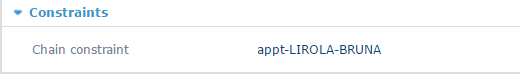

If not, it will be possible to create one by clicking on the  button.

|                                                                     |      |
| ------------------------------------------------------------------- | ---- |
| \[Note]                                                             | Note |
| It is preferable only to create one single constraint per customer. |      |

The chaining constraint screen comprises two parts: the first allows you to specify the liaison constraints and the second allows you to specify the constraints specific to each linked appointment.

Creating a new constraint

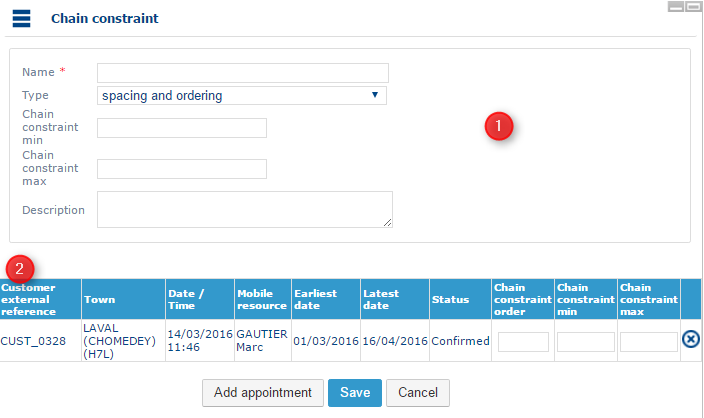

Once in this screen, it will be necessary to fill in values for the following fields:

(Part 1)

* **Name**: unique identifier for the constraint chain. Each chain must have a different name. In effect, all the appointments having a chaining constraint with the same name will be linked between them. This field is mandatory.
* **Type**: Type of chaining constraint. The different types of constraint are defined below (section [Types of liaison](https://mynomadia.com/privatedoc/9LLcWh7j74sENa54/optitime-doc/docs/en/otgs-reference-book/call-center-objets.html#Type-liaison)).
* **Minimum gap**: A gap of 0 days signifies «the same day». This gap takes as reference the first day of the intervention (even for appointments taking place over several days)
* **Minimum gap**: A gap of 0 days signifies "the same day". This gap takes as reference the first day of the intervention (even for appointments taking place over several days)
* **Description**: Text field allowing you to give a description to the chaining constraint.

(Part 2)

In part 2, you will find appointments associated to the constraint chain.

For each associated appointment, the following fields are present:

* Customer delivered: external customer reference
* Town: town where the customer is located
* Date / Time: date and time of the appointment in the schedule (if an appointment has been placed there)
* Resource: resource assigned to the appointment (if the appointment has been scheduled)
* Earliest date: the earliest date for the appointment
* Latest date: latest scheduling date for the appointment
* Status: completion status of the appointment
*   Sequencing order: order of the appointment in the chain. The application will try in this case to plan appointments in the order requested.

    |                                          |         |
    | ---------------------------------------- | ------- |
    | \[Warning]                               | Warning |
    | Only for chainings of the _Circuit_ type |         |
* Minimum spacing: minimum gap between appointments (overload of the value specified in Part 1)
* Maximum spacing: maximum gap between appointments (overload the value specified in Part 1)

|                                                                                                                                                                                   |      |
| --------------------------------------------------------------------------------------------------------------------------------------------------------------------------------- | ---- |
| \[Note]                                                                                                                                                                           | Note |
| When a constraint is not utilised (placement sequence, minimum or maximum spacing) you will need to either NOT put the value in the corresponding field, or assign a value of -1. |      |

To delete appointments from a constraint chain, click on the  cross opposite the appointment concerned, on the right of the table, in modification mode.

To modify the specific constraints for each appointment in the constraint chain, click on the Edit button.

To save the constraint chain, click on Save.

To delete the constraint chain, click on the Delete button at the bottom of the page.

### Unavailabilities

Unavailabilities appear with a specific colouring in the planning. They are always geolocated, and can therefore be displayed on the map.

#### Unavailability form

The [form](https://mynomadia.com/privatedoc/9LLcWh7j74sENa54/optitime-doc/docs/en/otgs-reference-book/call-center-objets.html#call-center-fiche-gral) for the unavailability is accessible via:

* the [unavailabilities management](https://mynomadia.com/privatedoc/9LLcWh7j74sENa54/optitime-doc/docs/en/otgs-reference-book/call-center-menu.html#gerer-indispos) form;
* the [search for unavailabilities](https://mynomadia.com/privatedoc/9LLcWh7j74sENa54/optitime-doc/docs/en/otgs-reference-book/call-center-menu.html#rechercher-indispo) function;
* using the [unavailability tool-tip](https://mynomadia.com/privatedoc/9LLcWh7j74sENa54/optitime-doc/docs/en/otgs-reference-book/call-center-agenda.html#tool-tip-indispo).

Unavailabilities management page

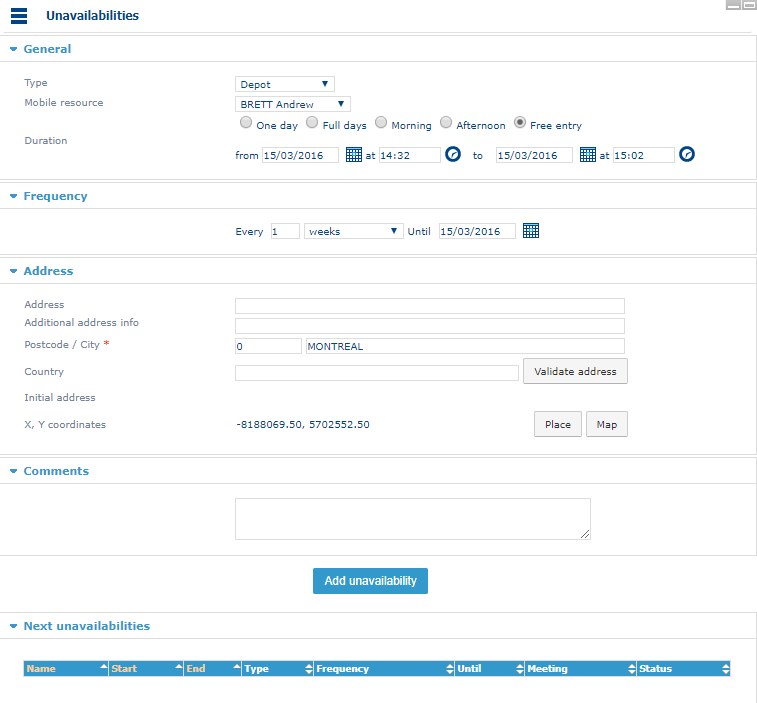

It is divided into five sections:

1. [General](https://mynomadia.com/privatedoc/9LLcWh7j74sENa54/optitime-doc/docs/en/otgs-reference-book/call-center-objets.html#d172e3137)

|        |                                                                            |
| ------ | -------------------------------------------------------------------------- |
| **1.** | **General**                                                                |
|        | Choice of unavailability type images/ref/planification/indispo-general.png |

*

In this section, we have:

*

\* Selection of the **Unavailability type** in the first of the drop-down menus. This contains all the types of unavailability that have been configured in the [administration module](https://mynomadia.com/privatedoc/9LLcWh7j74sENa54/optitime-doc/docs/en/otgs-reference-book/donnees.html#type-indispo). \* Selection of the **Resource** to which the unavailability will be added.

*

|                                                                                                                                                                                                                                                                                                                         |     |
| ----------------------------------------------------------------------------------------------------------------------------------------------------------------------------------------------------------------------------------------------------------------------------------------------------------------------- | --- |
| \[Tip]                                                                                                                                                                                                                                                                                                                  | Tip |
| Depending on the configuration of the [unavailability type](https://mynomadia.com/privatedoc/9LLcWh7j74sENa54/optitime-doc/docs/en/otgs-reference-book/donnees.html#type-indispo) (mono/multi-resource), the user interface will propose either a simple selection of a single resource, or a multi-resource selection. |     |

*

Click on the  button to the right of the list of resources to activate multiple selection mode (only in the event that a multi-resource type of unavailability is chosen).

*

This mode adds participants to the meeting either one by one (_'Resources_' radio button selected), or team by team (_'team_' radio button selected), or post profile by post profile (_'Profile_' radio button selected).

*

Select an item in the left-hand list and click on the  button to add to the selection list.

*

The  button adds all the items in the list on the left to the selection.

*

To remove an item from the selection list, click on it to select it and then click on the  button to remove it.

*

The  button serves to remove all the resources from the selection list.

*

|                                                                       |     |
| --------------------------------------------------------------------- | --- |
| \[Tip]                                                                | Tip |
| A new Meeting field is available to give an objective to the meeting. |     |

*

Finally, the  button allows you to exit the multiple selection mode.

*

\* The permitted **duration** for the unavailability.

*

Several options are proposed for the definition of the unavailability duration.

*

| Radio button | Description                                                                                                                                                                        |
| ------------ | ---------------------------------------------------------------------------------------------------------------------------------------------------------------------------------- |
| One day      | The unavailability will be created on a complete day, depending on the working hours of the resource                                                                               |
| Full days    | The unavailability will be created over several complete days, depending on the working hours of the resource.                                                                     |
| Morning      | The unavailability will be created for the chosen day, for the morning, that is for the start time up until the start time for the lunch break time window.                        |
| Afternoon    | The unavailability will be created for the chosen day on the afternoon, that is on the end of the time window for the lunch break up until the time of the end of the working day. |
| Free entry   | The user should themselves fill in the bounds on their unavailability                                                                                                              |

*

|                                                                                                                                                                 |     |
| --------------------------------------------------------------------------------------------------------------------------------------------------------------- | --- |
| \[Tip]                                                                                                                                                          | Tip |
| In the case of a multi-resource unavailability it is the hours of the first resource on the list that are taken as a reference in the time constraints methods. |     |

*

|                                                                                                                                                  |         |
| ------------------------------------------------------------------------------------------------------------------------------------------------ | ------- |
| \[Warning]                                                                                                                                       | Warning |
| As a function of the option chosen, the calendar or the time-picker are greyed out If not, the user can overwrite the initial information items. |         |

**Frequency** : In this part, the user can define a recurrence associated to the unavailability in the course of being created, so that it will be repeated.

```
The date to enter in the Up until field serves to give an end date to the recurrence of the unavailability.
```

**Address** : In the Address block, the user can overwrite the address of the unavailability. Address fields are described in the [geocoding](https://mynomadia.com/privatedoc/9LLcWh7j74sENa54/optitime-doc/docs/en/otgs-reference-book/intro-geocodage.html) chapter.

```
|  |  |
| --- | --- |
| [Tip] | Tip |
| For some types of unavailability, the address may be entered automatically as the home address of the resource, or as the address of their main work area. |
```

**Comments** : The field present in this block enables the user to enter a comment line that will be visible in the summary form for the unavailability.

**Next unavailabilities** : This section displays the unavailabilities that have already been recorded for the selected resource(s).

```
Clicking in the list allows you to access the [repeated unavailability form](https://mynomadia.com/privatedoc/9LLcWh7j74sENa54/optitime-doc/docs/en/otgs-reference-book/call-center-objets.html#fiche-reduite-indispo "Repeated unavailability form").
```

The Add unavailability button allows you to finalise the creation of an unavailability.

|                                                                                                                                                                                                                                                               |      |
| ------------------------------------------------------------------------------------------------------------------------------------------------------------------------------------------------------------------------------------------------------------- | ---- |
| \[Note]                                                                                                                                                                                                                                                       | Note |
| In Opti-Time, an unavailability is a time period during which the resource is not available to fufill an appointment. Any optimisations in progress will therefore not place any intervention on the time windows that have been entered as unavailabilities. |      |

|                                                                                                                                                                 |         |
| --------------------------------------------------------------------------------------------------------------------------------------------------------------- | ------- |
| \[Warning]                                                                                                                                                      | Warning |
| It may be the case, for example, in the case of a lengthy unavailability, that clashes exist in the planning of appointments or with existing unavailabilities. |         |

**In the case of a conflict between appointments**, the application will identify the conflicts and suggest three possible actions:

Handling of conflicts between appointments

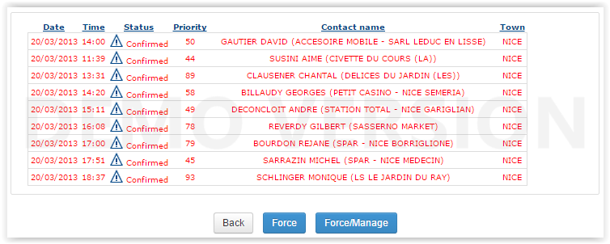

* The Back button cancels the entry of the unavailability and enables modification of the parameters.
* The Force button will create the unavailability by taking the appointments out of the planning. Any **planned** appointments will be reinstated with their original **requested** status, and the **confirmed** appointments will be reassigned a status of **suspended**.
* The Force/Manage button will create the unavailability and will seek to replace the conflicting appointments, in the same time slot if this is possible, or on another timeslot. The **planned** appointments that would not have been replaced will be reassigned a status of **requested** and the **confirmed** appointments will be reassigned a status of **suspended**.

**In the case of a conflict with another unavailability**, the application will suggest a Force button forcing the creation of the new unavailability. In this case, the unavailability created will be superposed on the unavailability in conflict. This can create inconsistencies in the planning that invalidate the process of planning on the day in question.

#### Repeated unavailability form

Repeated unavailability form

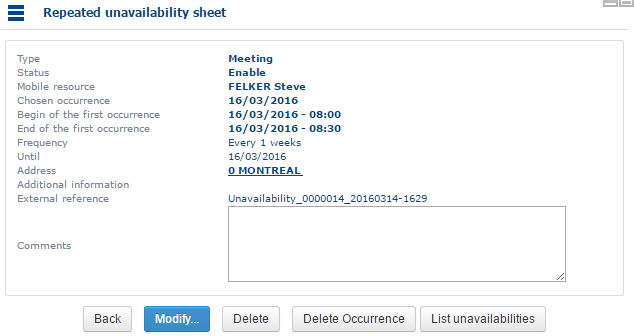

The fields present in the repeated unavailability form are the same as those in the [unavailability form](https://mynomadia.com/privatedoc/9LLcWh7j74sENa54/optitime-doc/docs/en/otgs-reference-book/call-center-objets.html#fiche-indispo).

The Back button returns you to the previous page.

The Modify… button returns the user to the [unavailability form](https://mynomadia.com/privatedoc/9LLcWh7j74sENa54/optitime-doc/docs/en/otgs-reference-book/call-center-objets.html#fiche-indispo).

The Delete button deletes the unavailability (in the case of a regular unavailability, all the occurrences will be deleted).

The Delete occurrence button deletes only the occurrence selected in the case of a repeated unavailability.

### Exceptional locations

Exceptional locations are temporary addresses for the start and end of routes. Typically it is here that nights away will be handled if the resources are called upon to perform overnight missions.

They can also be used to model:

* an exceptional location in the morning only (or the evening);
* a modification to the start and end times of the resource’s working day;

They are recorded in the resources' plannings in a [custom colour](https://mynomadia.com/privatedoc/9LLcWh7j74sENa54/optitime-doc/docs/en/otgs-reference-book/call-center-agenda.html#agenda-legende).

|                                                       |      |
| ----------------------------------------------------- | ---- |
| \[Note]                                               | Note |
| Exceptional locations must have an associated address |      |

#### Exceptional location form

The [form](https://mynomadia.com/privatedoc/9LLcWh7j74sENa54/optitime-doc/docs/en/otgs-reference-book/call-center-objets.html#call-center-fiche-gral) for an exceptional location is accessible either:

* via the [exceptional locations search](https://mynomadia.com/privatedoc/9LLcWh7j74sENa54/optitime-doc/docs/en/otgs-reference-book/call-center-objets.html);
* or via the [exceptional location tool-tip](https://mynomadia.com/privatedoc/9LLcWh7j74sENa54/optitime-doc/docs/en/otgs-reference-book/call-center-agenda.html#tool-tip-loc-except)

It comprises 3 parts:

**Part 1: Usual locations**

Exceptional location form - part 1

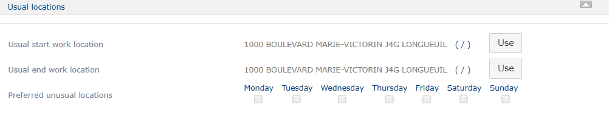

The **Usual start / end work location** corresponds to the start / end address for the working day for the resource as defined in their [form](https://mynomadia.com/privatedoc/9LLcWh7j74sENa54/optitime-doc/docs/en/otgs-reference-book/donnees.html#RH-adresse).

Clicking on an address, the location displays on the map.

Click on the Use button to fill in the address of the location for the night away, (part 2 below) using the corresponding address.

**Nights away** take the values defined in the [resource form](https://mynomadia.com/privatedoc/9LLcWh7j74sENa54/optitime-doc/docs/en/otgs-reference-book/donnees.html#RH-semaine).

**Part 2: View an exceptional location**

Exceptional location form - part 2

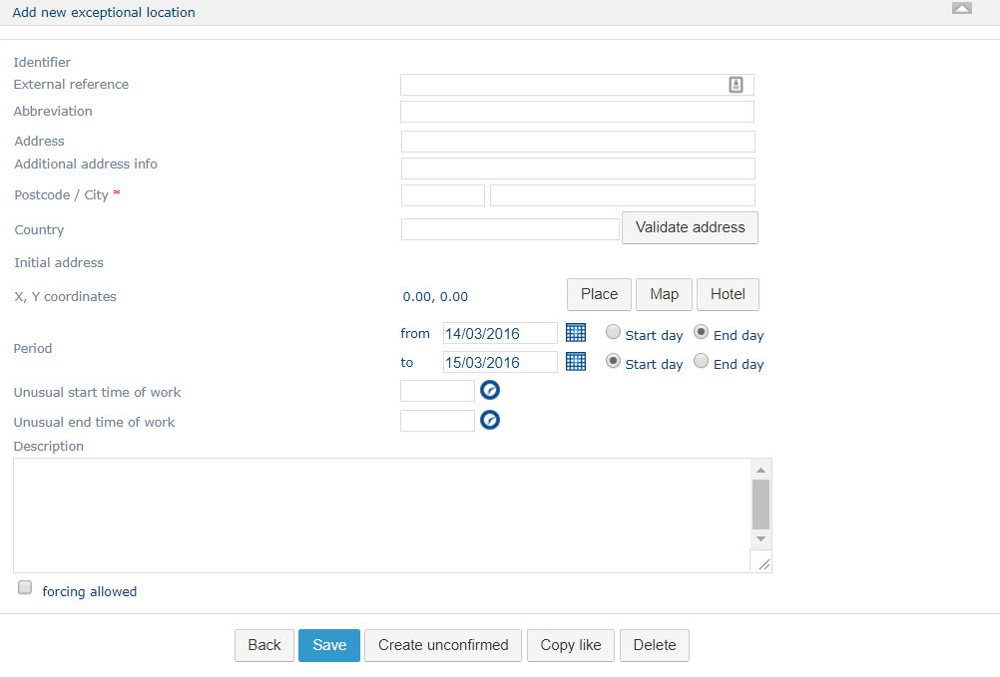

This section contains information about the exceptional location:

* The **Identifier** generated automatically for the exceptional location
* The **External reference** for the exceptional location
* The **Abbreviation** for the exceptional location
*   The **Status** of the exceptional location: confirmed or to confirm

    |                                                                                                                                                                                                               |     |
    | ------------------------------------------------------------------------------------------------------------------------------------------------------------------------------------------------------------- | --- |
    | \[Tip]                                                                                                                                                                                                        | Tip |
    | Unconfirmed exceptional locations may be modified when using [batch optimisation](https://mynomadia.com/privatedoc/9LLcWh7j74sENa54/optitime-doc/docs/en/otgs-reference-book/optimisation.html#planif-optim). |     |
* The [**address**](https://mynomadia.com/privatedoc/9LLcWh7j74sENa54/optitime-doc/docs/en/otgs-reference-book/intro-geocodage.html) section\
  The Hotel button allows you to add a hotel, selecting it on the map from a predefined list of [hotels](https://mynomadia.com/privatedoc/9LLcWh7j74sENa54/optitime-doc/docs/en/otgs-reference-book/call-center-objets.html#objets-hotel).
* The fields allow you to set the start and end dates/times for the exceptional location
* A **Description**
*   A **Forcing allowed** mode means you can force the addition of the unavailability in the event of a clash in the planning.

    |                                                                       |         |
    | --------------------------------------------------------------------- | ------- |
    | \[Warning]                                                            | Warning |
    | This mode will result in other items in the planning being unplanned. |         |

The Save button allows you to create the exceptional location with the information entered in the file.\
The Confirm/Unconfirm button allows you to change the status of the exceptional location from _confirmed_ to _to confirm_ and vice versa. Confirmed exceptional locations can no longer be cancelled or moved during a future [batch optimization](https://mynomadia.com/privatedoc/9LLcWh7j74sENa54/optitime-doc/docs/en/otgs-reference-book/optimisation.html#planif-optim).\
The Copy like button allows you to create a new exceptional location with the information entered in the file.

**Part 3: Next exceptional locations**

This part comprises a table of the next exceptional locations for the resource.

### Temporary posts

A resource has a main post that defines their default competency profile: the list of intervention types they are competent to perform.

Thanks to this functionality, it is possible to provisionally replace the main post by another. To authorise a maintenance technician, for example, to perform breakdown recovery during a week where there is a workload peak.

You can create, modify or delete a secondary post.

#### Temporary post form

The [form](https://mynomadia.com/privatedoc/9LLcWh7j74sENa54/optitime-doc/docs/en/otgs-reference-book/call-center-objets.html#call-center-fiche-gral) for a temporary post is accessible either:

* via the [temporary post management](https://mynomadia.com/privatedoc/9LLcWh7j74sENa54/optitime-doc/docs/en/otgs-reference-book/call-center-menu.html#gestion-postes-temp) function;
* via the [post type tool-tip](https://mynomadia.com/privatedoc/9LLcWh7j74sENa54/optitime-doc/docs/en/otgs-reference-book/call-center-agenda.html#tool-tip-postes).

Temporary post form

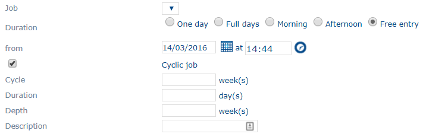

The form contains the following fields:

* **Job**: serves to select the [type of post](https://mynomadia.com/privatedoc/9LLcWh7j74sENa54/optitime-doc/docs/en/otgs-reference-book/donnees.html#type-poste) to assign to the resource
* **Duration**
* **From**: date from which the resource will assume the secondary post
* **To**: date of the end of assignment to the temporary post (only if the **Cyclic job** check-box is NOT checked)
* **Daily** (only if the **Cyclical task** check-box is checked)
* **Cycle** (only if the **Cyclic job** check-box is checked): the frequency in terms of per week occurrences of the assignment
* **Duration**: duration for the assignment in days
* **Depth**: date, in weeks, from the start date, at which the assignment stops

|                                                                                                                                 |         |
| ------------------------------------------------------------------------------------------------------------------------------- | ------- |
| \[Warning]                                                                                                                      | Warning |
| This form applies any changes to the assignment: Temporary post form (modification) images/ref/planification/poste-temp-mod.png |         |

### Secondary worksites

Secondary worksites allow you to assign temporarily to the resource, either an additional worksite, or another worksite that replaces the usual work site for the resource.

#### Secondary worksite form

The [form](https://mynomadia.com/privatedoc/9LLcWh7j74sENa54/optitime-doc/docs/en/otgs-reference-book/call-center-objets.html#call-center-fiche-gral) for a secondary worksite is accessible via the [assign secondary worksites](https://mynomadia.com/privatedoc/9LLcWh7j74sENa54/optitime-doc/docs/en/otgs-reference-book/call-center-menu.html#affectation-sites-second) function.

The principle is the same as for [temporary posts](https://mynomadia.com/privatedoc/9LLcWh7j74sENa54/optitime-doc/docs/en/otgs-reference-book/call-center-objets.html#fiche-poste-temporaire).

The fields are described in the resource’s form and the [Assignment](https://mynomadia.com/privatedoc/9LLcWh7j74sENa54/optitime-doc/docs/en/otgs-reference-book/donnees.html#RH-affectation) tab.

### Hotel locations

The locations of hotels allow you to position a [Night away](https://mynomadia.com/privatedoc/9LLcWh7j74sENa54/optitime-doc/docs/en/otgs-reference-book/call-center-objets.html#localisations-exceptionnelles) quickly.

#### Hotel location form

The [form](https://mynomadia.com/privatedoc/9LLcWh7j74sENa54/optitime-doc/docs/en/otgs-reference-book/call-center-objets.html#call-center-fiche-gral) for a hotel is accessed via the [hotel location](https://mynomadia.com/privatedoc/9LLcWh7j74sENa54/optitime-doc/docs/en/otgs-reference-book/call-center-menu.html#emplacement-hotel) function.

The form contains the following fields:

* An **Identifier** (field saved automatically when creating a new hotel location)
* An **External reference**
* A **Name**
* [**Address**](https://mynomadia.com/privatedoc/9LLcWh7j74sENa54/optitime-doc/docs/en/otgs-reference-book/intro-geocodage.html) fields
* A **Period** of availability for the hotel
* A **Description**

### Agenda markers

The agenda markers for items displayed in the planning.

Unlike other items in the planning, the agenda marker does not need to have an address.

It may serve to define the start and end times for an appointment, or a real appointment time.

Display of agenda markers in the planning

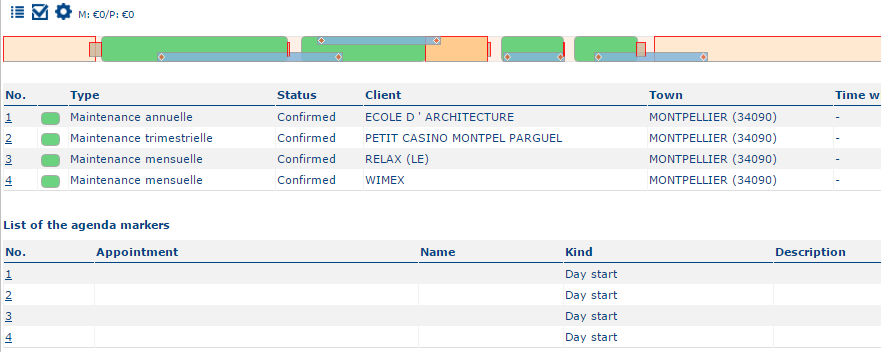

The agenda markers are the purple coloured bars in the planning, including a bullet point at the start and end of the bar.

|                             |     |
| --------------------------- | --- |
| \[Tip]                      | Tip |
| Agenda markers may overlap. |     |

#### Agenda marker form

The [form](https://mynomadia.com/privatedoc/9LLcWh7j74sENa54/optitime-doc/docs/en/otgs-reference-book/call-center-objets.html#call-center-fiche-gral) for an agenda marker is accessible via:

* using the [manage agenda markers](https://mynomadia.com/privatedoc/9LLcWh7j74sENa54/optitime-doc/docs/en/otgs-reference-book/call-center-menu.html#gerer-jalons) function;
* via the [appointment form](https://mynomadia.com/privatedoc/9LLcWh7j74sENa54/optitime-doc/docs/en/otgs-reference-book/call-center-objets.html#fiche-rdv).

Agenda marker form

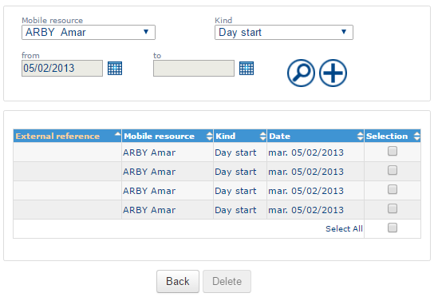

The form contains the following fields:

* An **Identifier** filled automatically as the new agenda marker is created
* The **External reference** for the agenda marker
* The **Name** of the agenda marker
* The name of the **Resource** to select in a list
* The **Marker type**(information field). A type of marker can be selected from the following values:
  * Day start
  * Day end
  * Appointment commitment
  * Call
  * Minor alert
  * Major alert
  * Date
* The **date** and **time** for the agenda marker
* The **Duration** for the agenda marker
* A **description** of the agenda marker
* The **intervention identifier** if the marker is linked to an intervention.

### On-call duty

The [on-call duty types](https://mynomadia.com/privatedoc/9LLcWh7j74sENa54/optitime-doc/docs/en/otgs-reference-book/donnees.html#astreintes) are defined in the administration module. You will find more information about on-call duties in this menu.

#### On-call duty form

The [form](https://mynomadia.com/privatedoc/9LLcWh7j74sENa54/optitime-doc/docs/en/otgs-reference-book/call-center-objets.html#call-center-fiche-gral) for an on-call duty is accessible via the [on-call duty management](https://mynomadia.com/privatedoc/9LLcWh7j74sENa54/optitime-doc/docs/en/otgs-reference-book/call-center-menu.html#gestion-astreintes) function.

Creation page for an on-call duty

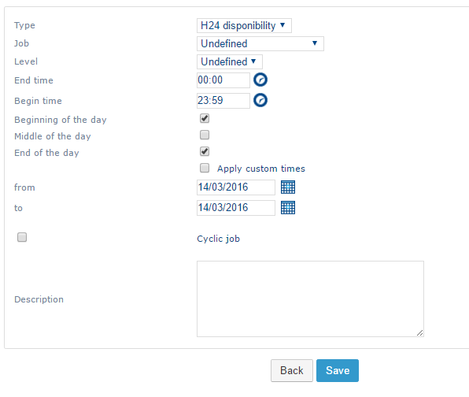

The page contains the following items:

* The **Type** of on-call duty: drop-down list containing predefined [types of on-call duties](https://mynomadia.com/privatedoc/9LLcWh7j74sENa54/optitime-doc/docs/en/otgs-reference-book/donnees.html#astreintes)
* The **post** for which the resource will be on duty and containing the predefined [Functions](https://mynomadia.com/privatedoc/9LLcWh7j74sENa54/optitime-doc/docs/en/otgs-reference-book/donnees.html#type-expertise) and [Job types](https://mynomadia.com/privatedoc/9LLcWh7j74sENa54/optitime-doc/docs/en/otgs-reference-book/donnees.html#type-poste).
* The **from** and **to** dates allowing you to define the start and end dates for the on-call duty.
*   The **Cyclic job** field that defines the regularity of the On-call duty if necesssary (check the check-box)

    Cyclic job

    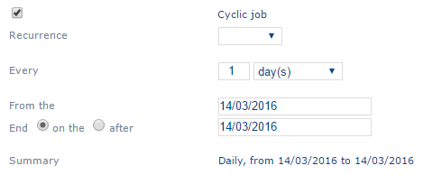

The other fields are defined in the [On-call duty day template](https://mynomadia.com/privatedoc/9LLcWh7j74sENa54/optitime-doc/docs/en/otgs-reference-book/donnees.html#modele-jour-astreinte) chapter.

### Locked days in the agenda

A locked day is a day for which no optimisation is possible. Whatever their status, appointments present will not be replayed and no new appointment can be set automatically.

#### Locked day in the agenda

The [form](https://mynomadia.com/privatedoc/9LLcWh7j74sENa54/optitime-doc/docs/en/otgs-reference-book/call-center-objets.html#call-center-fiche-gral) for a locked day in the agenda is accessible:

* via the [locked day in the menu](https://mynomadia.com/privatedoc/9LLcWh7j74sENa54/optitime-doc/docs/en/otgs-reference-book/call-center-objets.html) function;
* via the tool-tip for a non-worked time.

The creation form and the editing form do not differ except for the presence in the latter of the Delete button.

Creation page for a locked day

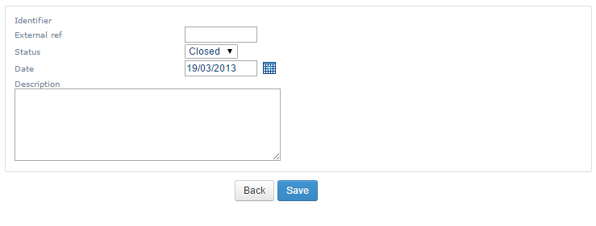

The user can give an identifier to the locked day (External reference). The user should then choose the status and the date, and can also enter a description.

Click on the Save button to validate the creation of the locked day.

|                                                                                                                                                          |     |
| -------------------------------------------------------------------------------------------------------------------------------------------------------- | --- |
| \[Tip]                                                                                                                                                   | Tip |
| Following the creation, the day for the resource is greyed out in the planning and a padlock appears beside its name to indicate that the day is locked. |     |

### Search in the Planning module

The basic principles are the same, but, depending on the object sought, the items available may vary.

Search filters are [configurable](https://mynomadia.com/privatedoc/9LLcWh7j74sENa54/optitime-doc/docs/en/otgs-reference-book/perso.html#config-appli).

The search comprises a [filters](https://mynomadia.com/privatedoc/9LLcWh7j74sENa54/optitime-doc/docs/en/otgs-reference-book/call-center-objets.html#recherche-generique-filtre) part, and a [result](https://mynomadia.com/privatedoc/9LLcWh7j74sENa54/optitime-doc/docs/en/otgs-reference-book/call-center-objets.html#call-center-resultat) part.

Below, for objects in the Planning module, are the associated search functions:

| Object name                                                                                                                                                               | Link to the search function                                                                                                                                                             |
| ------------------------------------------------------------------------------------------------------------------------------------------------------------------------- | --------------------------------------------------------------------------------------------------------------------------------------------------------------------------------------- |
| [customer types](https://mynomadia.com/privatedoc/9LLcWh7j74sENa54/optitime-doc/docs/en/otgs-reference-book/call-center-objets.html#objets-types-client)                  | [Search for a customer type](https://mynomadia.com/privatedoc/9LLcWh7j74sENa54/optitime-doc/docs/en/otgs-reference-book/call-center-menu.html#rechercher-type-client)                   |
| [customer kinds](https://mynomadia.com/privatedoc/9LLcWh7j74sENa54/optitime-doc/docs/en/otgs-reference-book/call-center-objets.html#objets-nature-client)                 | [Customer kind search](https://mynomadia.com/privatedoc/9LLcWh7j74sENa54/optitime-doc/docs/en/otgs-reference-book/call-center-menu.html#rechercher-nature-client)                       |
| [customers](https://mynomadia.com/privatedoc/9LLcWh7j74sENa54/optitime-doc/docs/en/otgs-reference-book/call-center-objets.html#objets-clients)                            | [Search](https://mynomadia.com/privatedoc/9LLcWh7j74sENa54/optitime-doc/docs/en/otgs-reference-book/call-center-menu.html#menu-clients-rechercher)                                      |
| [orderers](https://mynomadia.com/privatedoc/9LLcWh7j74sENa54/optitime-doc/docs/en/otgs-reference-book/call-center-objets.html#commanditaire)                              | [Orderer search](https://mynomadia.com/privatedoc/9LLcWh7j74sENa54/optitime-doc/docs/en/otgs-reference-book/call-center-menu.html#rechercher-commanditaire)                             |
| [appointment](https://mynomadia.com/privatedoc/9LLcWh7j74sENa54/optitime-doc/docs/en/otgs-reference-book/call-center-objets.html#objets-rdv)                              | [Appointment search](https://mynomadia.com/privatedoc/9LLcWh7j74sENa54/optitime-doc/docs/en/otgs-reference-book/call-center-menu.html#rechercher-rdv)                                   |
| [unavailabilities](https://mynomadia.com/privatedoc/9LLcWh7j74sENa54/optitime-doc/docs/en/otgs-reference-book/call-center-objets.html#centre-d-appel-indisponibilite)     | [Unavailabilities](https://mynomadia.com/privatedoc/9LLcWh7j74sENa54/optitime-doc/docs/en/otgs-reference-book/call-center-menu.html#gerer-indispos)                                     |
| [exceptional locations](https://mynomadia.com/privatedoc/9LLcWh7j74sENa54/optitime-doc/docs/en/otgs-reference-book/call-center-objets.html#localisations-exceptionnelles) | [Exceptional locations](https://mynomadia.com/privatedoc/9LLcWh7j74sENa54/optitime-doc/docs/en/otgs-reference-book/call-center-objets.html)                                             |
| [hotel locations](https://mynomadia.com/privatedoc/9LLcWh7j74sENa54/optitime-doc/docs/en/otgs-reference-book/call-center-objets.html#objets-hotel)                        | [Hotel locations](https://mynomadia.com/privatedoc/9LLcWh7j74sENa54/optitime-doc/docs/en/otgs-reference-book/call-center-menu.html#emplacement-hotel)                                   |
| [temporary posts](https://mynomadia.com/privatedoc/9LLcWh7j74sENa54/optitime-doc/docs/en/otgs-reference-book/call-center-objets.html#objets-postes-temp)                  | [Temporary job management](https://mynomadia.com/privatedoc/9LLcWh7j74sENa54/optitime-doc/docs/en/otgs-reference-book/call-center-menu.html#gestion-postes-temp)                        |
| [secondary worksites](https://mynomadia.com/privatedoc/9LLcWh7j74sENa54/optitime-doc/docs/en/otgs-reference-book/call-center-objets.html#objets-sites-second)             | [Secondary worksites assignments management](https://mynomadia.com/privatedoc/9LLcWh7j74sENa54/optitime-doc/docs/en/otgs-reference-book/call-center-menu.html#affectation-sites-second) |
| [agenda markers](https://mynomadia.com/privatedoc/9LLcWh7j74sENa54/optitime-doc/docs/en/otgs-reference-book/call-center-objets.html#objets-jalons)                        | [Manage agenda markers](https://mynomadia.com/privatedoc/9LLcWh7j74sENa54/optitime-doc/docs/en/otgs-reference-book/call-center-menu.html#gerer-jalons)                                  |
| [on-call duty](https://mynomadia.com/privatedoc/9LLcWh7j74sENa54/optitime-doc/docs/en/otgs-reference-book/call-center-objets.html#objets-astreinte)                       | [On-call duty management](https://mynomadia.com/privatedoc/9LLcWh7j74sENa54/optitime-doc/docs/en/otgs-reference-book/call-center-menu.html#gestion-astreintes)                          |
| [locked days](https://mynomadia.com/privatedoc/9LLcWh7j74sENa54/optitime-doc/docs/en/otgs-reference-book/call-center-objets.html#objets-journees-verr)                    | [Locked day](https://mynomadia.com/privatedoc/9LLcWh7j74sENa54/optitime-doc/docs/en/otgs-reference-book/call-center-objets.html)                                                        |

#### Search filters

The search function is made up of one section containing the fields that can be used to filter the search, and the action buttons.

Example: Customer search

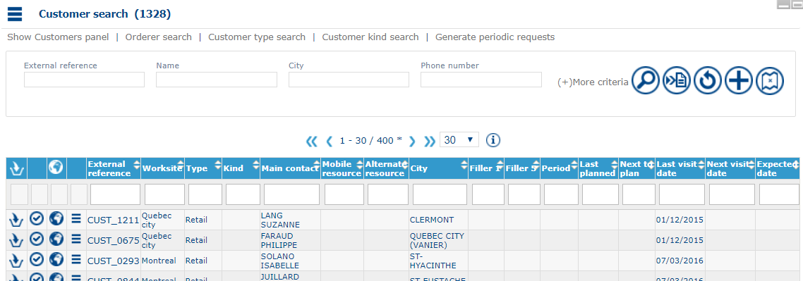

The  button runs the search and displays the [results list](https://mynomadia.com/privatedoc/9LLcWh7j74sENa54/optitime-doc/docs/en/otgs-reference-book/call-center-objets.html#call-center-resultat).

The 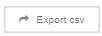 button exports the table of the result of a search on customers in .csv format.

The  button resets the search filters.

The  button creates an object (here, a customer type object).

The 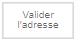 button enables verification of whether the town or post code declared correspond to those of the geocoding repository.

Clicking on the (+)More criteria button, the user can search for customers as a function of their type (whether it is active or not) or as a function of customer priority, search all customers assigned to a specified rresource, or search for customers that need visiting periodically (so-called «regular customers»).

#### Search result

The results are presented in table form, and include standard browsing and sort functions. A series of action buttons allow you to perform actions on one part, or all, of the results.

Some lists can also be filtered.

Example: List of appointments

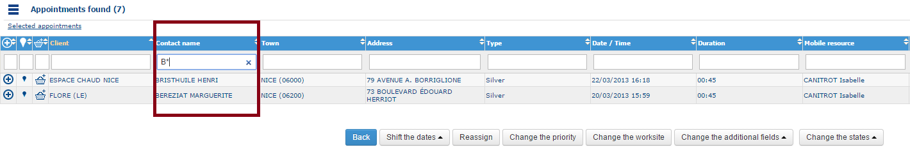

With free text entry in the filter field, the content of the table can be restricted to the elements corresponding to the filter.\
This filter is of the `Starting with` type, that is, that all the records with a filter field value starting with the entry value will be retained.\
It is possible to escape from characters by including a `*` in the filter parameter.\
For example, the search above returns all appointments of the **Installation** type. Entering in the filter the **Intervention type** a value of `*panel`, we will only filter on installation of solar panels.

Clicking on one line in the results of the search, you will arrive at the [form](https://mynomadia.com/privatedoc/9LLcWh7j74sENa54/optitime-doc/docs/en/otgs-reference-book/call-center-objets.html#call-center-fiche-gral) of the corresponding object.

In some lists, a series of buttons present in the result table allow direct access to some functions:

* The Select button allows you to select items in the list.
* The  button displays the item on the map
* The  runs an [optimised scheduling](https://mynomadia.com/privatedoc/9LLcWh7j74sENa54/optitime-doc/docs/en/otgs-reference-book/call-center-objets.html#planification-optimisee-rdv) operation for the appointment
* The  button allows you to add the appointment to the panel

A series of buttons are present at the bottom of the results lists depending on the rights the user has:

* The Back button takes you back to the search form (the parameters in which have been stored).
* The Export in CSV button exports the table obtained in the form of a file (column separator: commas) for editing in Excel © for example.
* You can delete some objects by selecting them in the result list (_Selection_ column) and clicking on the delete button.

**Additional action buttons for lists of appointments**

Action buttons for appointment lists

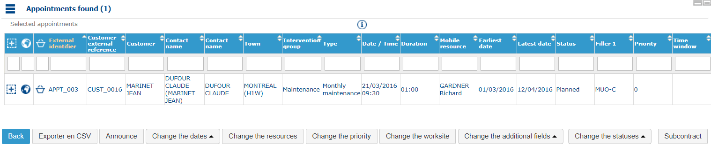

The Announce button creates a configurable [circulation listener](https://mynomadia.com/privatedoc/9LLcWh7j74sENa54/optitime-doc/docs/en/otgs-reference-book/CSV.html#listener), for example, when sending a pre-formatted message to all the customer appointment contacts in the list.

The Change the dates button modifies the start and end dates for appointments in the list. This modification can be applied in several ways:

* Push the earliest start date: adds the defined number of days to the earliest dates for appointments in the list;
* Advance the earliest start date: allows you to bring earliest dates forward by a certain number of days for appointments in the list;
* Change the earliest start date: defines an earliest date that will be applied to all appointments in the list;
* Push the latest end date: defines a latest date that will be applied to all the appointments in the list;
* Advance the latest end date: brings forward the latest dates of appointments in the list by the defined number of days;
* Change the latest end date: adds the defined number of days to the latest dates for appointments in the list;
* Push the planned date: allows you to add the defined number of days to the scheduled dates of appointments in the list;
* Advance the planned date: allows you to subtract the defined number of days from the scheduled dates for appointments in the list;
* Change the periode of possible completion: allows you to redefine earliest and latest dates possible to be applied to all appointments in the list.

|                                                                                                                           |      |
| ------------------------------------------------------------------------------------------------------------------------- | ---- |
| \[Note]                                                                                                                   | Note |
| If the appointments in the list do not have an earliest or latest date defined, today’s date will be used as a reference. |      |

The Modify resources button allows you to define preferences for the resources (required, desired, refused) assigned to appointments in the list. This then displays the following window:

Reassign resources

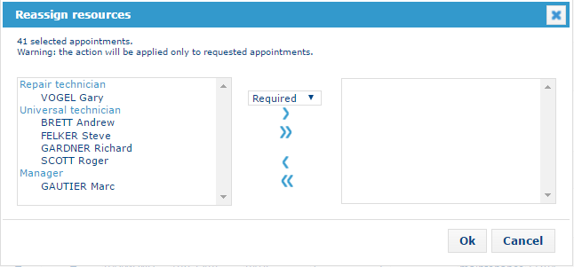

In this window, it will be possible to modify how resources are classified in relation to appointments, as desired, required, or refused.

|                                                                                                                                                                                                                                         |         |
| --------------------------------------------------------------------------------------------------------------------------------------------------------------------------------------------------------------------------------------- | ------- |
| \[Warning]                                                                                                                                                                                                                              | Warning |
| This function only applies for appointments with a _Requested_ [status](https://mynomadia.com/privatedoc/9LLcWh7j74sENa54/optitime-doc/docs/en/otgs-reference-book/_the_different_statuses_for_appointments_in_opti_time.html#statuts). |         |

The Modify priority button defines a new priority value for the appointments in the list.

The Modify worksite button is used to change the worksite associated with each appointment in the list. It displays in the following window:

Modify worksites

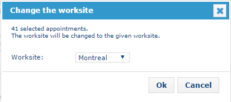

In this window, it will be possible to change the worksites linked to the appointment.

The Modify additional data button modifies the Miscellaneous, Logical, Quantity and Dates fields for appointments in the list.

The Modify statuses button modifies the [status](https://mynomadia.com/privatedoc/9LLcWh7j74sENa54/optitime-doc/docs/en/otgs-reference-book/_the_different_statuses_for_appointments_in_opti_time.html#statuts) of appointments in the list.

The Subcontract button redefines appointments in the list to _Externalised_ [status](https://mynomadia.com/privatedoc/9LLcWh7j74sENa54/optitime-doc/docs/en/otgs-reference-book/_the_different_statuses_for_appointments_in_opti_time.html#statuts).

|                                                                                                                                                                                                                                            |         |
| ------------------------------------------------------------------------------------------------------------------------------------------------------------------------------------------------------------------------------------------ | ------- |
| \[Warning]                                                                                                                                                                                                                                 | Warning |
| All changes to status are not possible in these actions when performed in batch mode: for example, it is not possible to move a list of **candidate** appointments to _Confirmed_ status in this way (because they are not in a planning). |         |

**The action buttons on customer lists**

The Modify dates button:

* Modify the date of the last visit: this allows you to modify the date of the last visit indicated in the [customer form](https://mynomadia.com/privatedoc/9LLcWh7j74sENa54/optitime-doc/docs/en/otgs-reference-book/call-center-objets.html#fiche-client)
* Modify the date of the next visit: this allows you to modify the date of the next visit indicated in the [customer form](https://mynomadia.com/privatedoc/9LLcWh7j74sENa54/optitime-doc/docs/en/otgs-reference-book/call-center-objets.html#fiche-client)

The Modify the type button allows you to modify the [customer type](https://mynomadia.com/privatedoc/9LLcWh7j74sENa54/optitime-doc/docs/en/otgs-reference-book/call-center-objets.html#objets-types-client). The following window then displays:

Change customer type

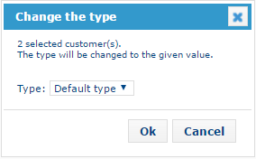

The Modify the kind button allows you to modify the [customer kind](https://mynomadia.com/privatedoc/9LLcWh7j74sENa54/optitime-doc/docs/en/otgs-reference-book/call-center-objets.html#objets-nature-client). The following window then displays:

Change customer kind

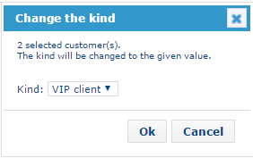

The Change the focus button allows you to modify the customer focus. The following window then displays:

Change customer focus

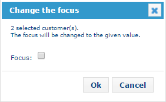

The Change additional data button allows you to change the Miscellaneous, Logical, Quantity and Dates fields for customers in the list.

### Create an object in the Planning module

An object is created via the [search for this type of object](https://mynomadia.com/privatedoc/9LLcWh7j74sENa54/optitime-doc/docs/en/otgs-reference-book/call-center-objets.html#call-center-recherche) function.

The  button allows you to create an object.

### Delete an object in the Planning module

Depending on the type of object, it will be possible to delete or de-activate this via the [form](https://mynomadia.com/privatedoc/9LLcWh7j74sENa54/optitime-doc/docs/en/otgs-reference-book/call-center-objets.html#call-center-fiche-gral) of the object or via the [object search](https://mynomadia.com/privatedoc/9LLcWh7j74sENa54/optitime-doc/docs/en/otgs-reference-book/call-center-objets.html#call-center-recherche) function.

To delete an object from its form, simply click on the Delete button.

To delete an object via the search function, select the object(s) to delete and click on Delete.

Example: delete an exceptional location

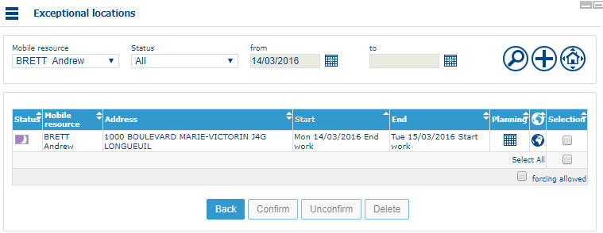

|                                                 |      |
| ----------------------------------------------- | ---- |
| \[Note]                                         | Note |
| Some objects cannot be deleted or de-activated. |      |

***

|                                                                                                                              |                                                                                                                            |                                                                                                                         |
| ---------------------------------------------------------------------------------------------------------------------------- | -------------------------------------------------------------------------------------------------------------------------- | ----------------------------------------------------------------------------------------------------------------------- |
| [Prev](https://mynomadia.com/privatedoc/9LLcWh7j74sENa54/optitime-doc/docs/en/otgs-reference-book/module-planification.html) | [Up](https://mynomadia.com/privatedoc/9LLcWh7j74sENa54/optitime-doc/docs/en/otgs-reference-book/module-planification.html) | [Next](https://mynomadia.com/privatedoc/9LLcWh7j74sENa54/optitime-doc/docs/en/otgs-reference-book/_the_header_bar.html) |
|                                                                                                                              | [Home](https://mynomadia.com/privatedoc/9LLcWh7j74sENa54/optitime-doc/docs/en/otgs-reference-book/index.html)              |                                                                                                                         |

* [Contents](https://mynomadia.com/privatedoc/9LLcWh7j74sENa54/optitime-doc/docs/en/otgs-reference-book/call-center-objets.html#treeDiv)
* [Search](https://mynomadia.com/privatedoc/9LLcWh7j74sENa54/optitime-doc/docs/en/otgs-reference-book/call-center-objets.html#searchDiv)


* [Introduction](https://mynomadia.com/privatedoc/9LLcWh7j74sENa54/optitime-doc/docs/en/otgs-reference-book/_introduction.html)
  * [Defining terms](https://mynomadia.com/privatedoc/9LLcWh7j74sENa54/optitime-doc/docs/en/otgs-reference-book/_defining_terms.html)
  * [Presentation of the Reference Guide](https://mynomadia.com/privatedoc/9LLcWh7j74sENa54/optitime-doc/docs/en/otgs-reference-book/_presentation_of_the_reference_guide.html)
  * [Running the application](https://mynomadia.com/privatedoc/9LLcWh7j74sENa54/optitime-doc/docs/en/otgs-reference-book/otgs-connexion.html)
  * [The different statuses for appointments in Opti-time](https://mynomadia.com/privatedoc/9LLcWh7j74sENa54/optitime-doc/docs/en/otgs-reference-book/_the_different_statuses_for_appointments_in_opti_time.html)
    * [Status macros](https://mynomadia.com/privatedoc/9LLcWh7j74sENa54/optitime-doc/docs/en/otgs-reference-book/_the_different_statuses_for_appointments_in_opti_time.html#_status_macros)
    * [Statuses](https://mynomadia.com/privatedoc/9LLcWh7j74sENa54/optitime-doc/docs/en/otgs-reference-book/_the_different_statuses_for_appointments_in_opti_time.html#statuts)
    * [Progression steps](https://mynomadia.com/privatedoc/9LLcWh7j74sENa54/optitime-doc/docs/en/otgs-reference-book/_the_different_statuses_for_appointments_in_opti_time.html#etats-avancement)
    * [Fulfilment statuses](https://mynomadia.com/privatedoc/9LLcWh7j74sENa54/optitime-doc/docs/en/otgs-reference-book/_the_different_statuses_for_appointments_in_opti_time.html#etats-realisation)
    * [Notification statuses](https://mynomadia.com/privatedoc/9LLcWh7j74sENa54/optitime-doc/docs/en/otgs-reference-book/_the_different_statuses_for_appointments_in_opti_time.html#etats-notification)
    * [Life cycle of an appointment](https://mynomadia.com/privatedoc/9LLcWh7j74sENa54/optitime-doc/docs/en/otgs-reference-book/_the_different_statuses_for_appointments_in_opti_time.html#cycle-rdv)
  * [The geocoding](https://mynomadia.com/privatedoc/9LLcWh7j74sENa54/optitime-doc/docs/en/otgs-reference-book/intro-geocodage.html)
* [Guided Help](https://mynomadia.com/privatedoc/9LLcWh7j74sENa54/optitime-doc/docs/en/otgs-reference-book/WM.html)
* [The header bar](https://mynomadia.com/privatedoc/9LLcWh7j74sENa54/optitime-doc/docs/en/otgs-reference-book/bandeau.html)
  * [Change area](https://mynomadia.com/privatedoc/9LLcWh7j74sENa54/optitime-doc/docs/en/otgs-reference-book/bandeau-changer-region.html)
  * [Change the password](https://mynomadia.com/privatedoc/9LLcWh7j74sENa54/optitime-doc/docs/en/otgs-reference-book/bandeau-changer-mdp.html)
  * [Disconnection](https://mynomadia.com/privatedoc/9LLcWh7j74sENa54/optitime-doc/docs/en/otgs-reference-book/deco.html)
* [Portal](https://mynomadia.com/privatedoc/9LLcWh7j74sENa54/optitime-doc/docs/en/otgs-reference-book/module-portail.html)
  * [Home page](https://mynomadia.com/privatedoc/9LLcWh7j74sENa54/optitime-doc/docs/en/otgs-reference-book/_home_page.html)
  * [Planning](https://mynomadia.com/privatedoc/9LLcWh7j74sENa54/optitime-doc/docs/en/otgs-reference-book/portail-planning.html)
  * [Appointment form](https://mynomadia.com/privatedoc/9LLcWh7j74sENa54/optitime-doc/docs/en/otgs-reference-book/rendezvous.html)
  * [Tasks to be performed](https://mynomadia.com/privatedoc/9LLcWh7j74sENa54/optitime-doc/docs/en/otgs-reference-book/Tacheafaire.html)
    * [Visit reports pending](https://mynomadia.com/privatedoc/9LLcWh7j74sENa54/optitime-doc/docs/en/otgs-reference-book/Tacheafaire.html#tacheafaire1)
    * [Appointments to reschedule](https://mynomadia.com/privatedoc/9LLcWh7j74sENa54/optitime-doc/docs/en/otgs-reference-book/Tacheafaire.html#rdv-a-replanifier)
  * [Team alerts](https://mynomadia.com/privatedoc/9LLcWh7j74sENa54/optitime-doc/docs/en/otgs-reference-book/alert-equip.html)
  * [Week](https://mynomadia.com/privatedoc/9LLcWh7j74sENa54/optitime-doc/docs/en/otgs-reference-book/portail-semaine.html)
  * [Month](https://mynomadia.com/privatedoc/9LLcWh7j74sENa54/optitime-doc/docs/en/otgs-reference-book/portail-mois.html)
  * [Team schedule](https://mynomadia.com/privatedoc/9LLcWh7j74sENa54/optitime-doc/docs/en/otgs-reference-book/portail-plan-equipe.html)
  * [Area schedule](https://mynomadia.com/privatedoc/9LLcWh7j74sENa54/optitime-doc/docs/en/otgs-reference-book/portail-plan-reg.html)
  * [Worksite schedule](https://mynomadia.com/privatedoc/9LLcWh7j74sENa54/optitime-doc/docs/en/otgs-reference-book/portail-site-trav.html)
  * [Multi-Resource schedule](https://mynomadia.com/privatedoc/9LLcWh7j74sENa54/optitime-doc/docs/en/otgs-reference-book/portail-multi-res.html)
  * [Unavailabilities](https://mynomadia.com/privatedoc/9LLcWh7j74sENa54/optitime-doc/docs/en/otgs-reference-book/indisponibilite.html)
    * [One-off unavailabilities](https://mynomadia.com/privatedoc/9LLcWh7j74sENa54/optitime-doc/docs/en/otgs-reference-book/indisponibilite.html#_one_off_unavailabilities)
    * [Regular unavailabilities](https://mynomadia.com/privatedoc/9LLcWh7j74sENa54/optitime-doc/docs/en/otgs-reference-book/indisponibilite.html#_regular_unavailabilities)
    * [Handling unavailabilities](https://mynomadia.com/privatedoc/9LLcWh7j74sENa54/optitime-doc/docs/en/otgs-reference-book/indisponibilite.html#_handling_unavailabilities)
      * [Adding an unavailability](https://mynomadia.com/privatedoc/9LLcWh7j74sENa54/optitime-doc/docs/en/otgs-reference-book/indisponibilite.html#_adding_an_unavailability)
      * [Adding a multi-resource unavailability](https://mynomadia.com/privatedoc/9LLcWh7j74sENa54/optitime-doc/docs/en/otgs-reference-book/indisponibilite.html#indisponibilitesmultiressource)
      * [Unavailability form](https://mynomadia.com/privatedoc/9LLcWh7j74sENa54/optitime-doc/docs/en/otgs-reference-book/indisponibilite.html#_unavailability_form)
      * [Unplanning or reassigning appointments](https://mynomadia.com/privatedoc/9LLcWh7j74sENa54/optitime-doc/docs/en/otgs-reference-book/indisponibilite.html#_unplanning_or_reassigning_appointments)
  * [Visit reports](https://mynomadia.com/privatedoc/9LLcWh7j74sENa54/optitime-doc/docs/en/otgs-reference-book/compterendus.html)
  * [Roadbook](https://mynomadia.com/privatedoc/9LLcWh7j74sENa54/optitime-doc/docs/en/otgs-reference-book/portail-feuille-de-route.html)
  * [Global optimization](https://mynomadia.com/privatedoc/9LLcWh7j74sENa54/optitime-doc/docs/en/otgs-reference-book/portail-optim-glob.html)
    * [Export tab](https://mynomadia.com/privatedoc/9LLcWh7j74sENa54/optitime-doc/docs/en/otgs-reference-book/portail-optim-glob.html#_export_tab)
    * [Import tab](https://mynomadia.com/privatedoc/9LLcWh7j74sENa54/optitime-doc/docs/en/otgs-reference-book/portail-optim-glob.html#_import_tab)
    * [Automatic tab](https://mynomadia.com/privatedoc/9LLcWh7j74sENa54/optitime-doc/docs/en/otgs-reference-book/portail-optim-glob.html#_automatic_tab)
    * [Journal tab](https://mynomadia.com/privatedoc/9LLcWh7j74sENa54/optitime-doc/docs/en/otgs-reference-book/portail-optim-glob.html#_journal_tab)
  * [Legend](https://mynomadia.com/privatedoc/9LLcWh7j74sENa54/optitime-doc/docs/en/otgs-reference-book/portail-legende.html)
  * [Opti-Time Mobile Application](https://mynomadia.com/privatedoc/9LLcWh7j74sENa54/optitime-doc/docs/en/otgs-reference-book/portail-otm.html)
* [Planning](https://mynomadia.com/privatedoc/9LLcWh7j74sENa54/optitime-doc/docs/en/otgs-reference-book/module-planification.html)
  * [Objects in the Planning module](https://mynomadia.com/privatedoc/9LLcWh7j74sENa54/optitime-doc/docs/en/otgs-reference-book/call-center-objets.html)
    * [Forms](https://mynomadia.com/privatedoc/9LLcWh7j74sENa54/optitime-doc/docs/en/otgs-reference-book/call-center-objets.html#call-center-fiche-gral)
    * [Customer types](https://mynomadia.com/privatedoc/9LLcWh7j74sENa54/optitime-doc/docs/en/otgs-reference-book/call-center-objets.html#objets-types-client)
      * [Customer type form](https://mynomadia.com/privatedoc/9LLcWh7j74sENa54/optitime-doc/docs/en/otgs-reference-book/call-center-objets.html#type-client-fiche)
    * [Customer kinds](https://mynomadia.com/privatedoc/9LLcWh7j74sENa54/optitime-doc/docs/en/otgs-reference-book/call-center-objets.html#objets-nature-client)
      * [Customer kind form](https://mynomadia.com/privatedoc/9LLcWh7j74sENa54/optitime-doc/docs/en/otgs-reference-book/call-center-objets.html#nature-client-fiche)
    * [Customers](https://mynomadia.com/privatedoc/9LLcWh7j74sENa54/optitime-doc/docs/en/otgs-reference-book/call-center-objets.html#objets-clients)
      * [Customer form](https://mynomadia.com/privatedoc/9LLcWh7j74sENa54/optitime-doc/docs/en/otgs-reference-book/call-center-objets.html#fiche-client)
    * [Orderers](https://mynomadia.com/privatedoc/9LLcWh7j74sENa54/optitime-doc/docs/en/otgs-reference-book/call-center-objets.html#commanditaire)
      * [Orderer form](https://mynomadia.com/privatedoc/9LLcWh7j74sENa54/optitime-doc/docs/en/otgs-reference-book/call-center-objets.html#fiche-commanditaire)
    * [Appointments](https://mynomadia.com/privatedoc/9LLcWh7j74sENa54/optitime-doc/docs/en/otgs-reference-book/call-center-objets.html#objets-rdv)
      * [Appointment form](https://mynomadia.com/privatedoc/9LLcWh7j74sENa54/optitime-doc/docs/en/otgs-reference-book/call-center-objets.html#fiche-rdv)
    * [Steps in the scheduling process](https://mynomadia.com/privatedoc/9LLcWh7j74sENa54/optitime-doc/docs/en/otgs-reference-book/call-center-objets.html#_steps_in_the_scheduling_process)
      * [Qualification of the appointment](https://mynomadia.com/privatedoc/9LLcWh7j74sENa54/optitime-doc/docs/en/otgs-reference-book/call-center-objets.html#creation-rdv-demande)
      * [Appointment request](https://mynomadia.com/privatedoc/9LLcWh7j74sENa54/optitime-doc/docs/en/otgs-reference-book/call-center-objets.html#demande-rdv)
      * [Optimised appointment (real time)](https://mynomadia.com/privatedoc/9LLcWh7j74sENa54/optitime-doc/docs/en/otgs-reference-book/call-center-objets.html#planification-optimisee-rdv)
      * [Manual appointment](https://mynomadia.com/privatedoc/9LLcWh7j74sENa54/optitime-doc/docs/en/otgs-reference-book/call-center-objets.html#planification-manuelle-rdv)
    * [Setting up liaisons between appointments](https://mynomadia.com/privatedoc/9LLcWh7j74sENa54/optitime-doc/docs/en/otgs-reference-book/call-center-objets.html#contrainte-chainage)
      * [Types of liaison (chaining constraints)](https://mynomadia.com/privatedoc/9LLcWh7j74sENa54/optitime-doc/docs/en/otgs-reference-book/call-center-objets.html#Type-liaison)
      * [Linking two appointments in the interface](https://mynomadia.com/privatedoc/9LLcWh7j74sENa54/optitime-doc/docs/en/otgs-reference-book/call-center-objets.html#liaison-GUI)
    * [Unavailabilities](https://mynomadia.com/privatedoc/9LLcWh7j74sENa54/optitime-doc/docs/en/otgs-reference-book/call-center-objets.html#centre-d-appel-indisponibilite)
      * [Unavailability form](https://mynomadia.com/privatedoc/9LLcWh7j74sENa54/optitime-doc/docs/en/otgs-reference-book/call-center-objets.html#fiche-indispo)
      * [Repeated unavailability form](https://mynomadia.com/privatedoc/9LLcWh7j74sENa54/optitime-doc/docs/en/otgs-reference-book/call-center-objets.html#fiche-reduite-indispo)
    * [Exceptional locations](https://mynomadia.com/privatedoc/9LLcWh7j74sENa54/optitime-doc/docs/en/otgs-reference-book/call-center-objets.html#localisations-exceptionnelles)
      * [Exceptional location form](https://mynomadia.com/privatedoc/9LLcWh7j74sENa54/optitime-doc/docs/en/otgs-reference-book/call-center-objets.html#fiche-loc-exceptionnelle)
    * [Temporary posts](https://mynomadia.com/privatedoc/9LLcWh7j74sENa54/optitime-doc/docs/en/otgs-reference-book/call-center-objets.html#objets-postes-temp)
      * [Temporary post form](https://mynomadia.com/privatedoc/9LLcWh7j74sENa54/optitime-doc/docs/en/otgs-reference-book/call-center-objets.html#fiche-poste-temporaire)
    * [Secondary worksites](https://mynomadia.com/privatedoc/9LLcWh7j74sENa54/optitime-doc/docs/en/otgs-reference-book/call-center-objets.html#objets-sites-second)
      * [Secondary worksite form](https://mynomadia.com/privatedoc/9LLcWh7j74sENa54/optitime-doc/docs/en/otgs-reference-book/call-center-objets.html#fiche-site-second)
    * [Hotel locations](https://mynomadia.com/privatedoc/9LLcWh7j74sENa54/optitime-doc/docs/en/otgs-reference-book/call-center-objets.html#objets-hotel)
      * [Hotel location form](https://mynomadia.com/privatedoc/9LLcWh7j74sENa54/optitime-doc/docs/en/otgs-reference-book/call-center-objets.html#fiche-hotel)
    * [Agenda markers](https://mynomadia.com/privatedoc/9LLcWh7j74sENa54/optitime-doc/docs/en/otgs-reference-book/call-center-objets.html#objets-jalons)
      * [Agenda marker form](https://mynomadia.com/privatedoc/9LLcWh7j74sENa54/optitime-doc/docs/en/otgs-reference-book/call-center-objets.html#fiche-jalon)
    * [On-call duty](https://mynomadia.com/privatedoc/9LLcWh7j74sENa54/optitime-doc/docs/en/otgs-reference-book/call-center-objets.html#objets-astreinte)
      * [On-call duty form](https://mynomadia.com/privatedoc/9LLcWh7j74sENa54/optitime-doc/docs/en/otgs-reference-book/call-center-objets.html#fiche-astreinte)
    * [Locked days in the agenda](https://mynomadia.com/privatedoc/9LLcWh7j74sENa54/optitime-doc/docs/en/otgs-reference-book/call-center-objets.html#objets-journees-verr)
      * [Locked day in the agenda](https://mynomadia.com/privatedoc/9LLcWh7j74sENa54/optitime-doc/docs/en/otgs-reference-book/call-center-objets.html#fiche-journee-verrouillee)
    * [Search in the Planning module](https://mynomadia.com/privatedoc/9LLcWh7j74sENa54/optitime-doc/docs/en/otgs-reference-book/call-center-objets.html#call-center-recherche)
      * [Search filters](https://mynomadia.com/privatedoc/9LLcWh7j74sENa54/optitime-doc/docs/en/otgs-reference-book/call-center-objets.html#recherche-generique-filtre)
      * [Search result](https://mynomadia.com/privatedoc/9LLcWh7j74sENa54/optitime-doc/docs/en/otgs-reference-book/call-center-objets.html#call-center-resultat)
    * [Create an object in the Planning module](https://mynomadia.com/privatedoc/9LLcWh7j74sENa54/optitime-doc/docs/en/otgs-reference-book/call-center-objets.html#call-center-creer)
    * [Delete an object in the Planning module](https://mynomadia.com/privatedoc/9LLcWh7j74sENa54/optitime-doc/docs/en/otgs-reference-book/call-center-objets.html#call-center-supprimer)
  * [The header bar](https://mynomadia.com/privatedoc/9LLcWh7j74sENa54/optitime-doc/docs/en/otgs-reference-book/_the_header_bar.html)
    * [Favourites for the area](https://mynomadia.com/privatedoc/9LLcWh7j74sENa54/optitime-doc/docs/en/otgs-reference-book/_the_header_bar.html#_favourites_for_the_area)
    * [Recent appointments](https://mynomadia.com/privatedoc/9LLcWh7j74sENa54/optitime-doc/docs/en/otgs-reference-book/_the_header_bar.html#_recent_appointments)
    * [List of urgent appointments](https://mynomadia.com/privatedoc/9LLcWh7j74sENa54/optitime-doc/docs/en/otgs-reference-book/_the_header_bar.html#liste-rdv-urgent)
    * [List of customers on alert](https://mynomadia.com/privatedoc/9LLcWh7j74sENa54/optitime-doc/docs/en/otgs-reference-book/_the_header_bar.html#liste-clients-urgent)
    * [Unread messages](https://mynomadia.com/privatedoc/9LLcWh7j74sENa54/optitime-doc/docs/en/otgs-reference-book/_the_header_bar.html#_unread_messages)
  * [Map](https://mynomadia.com/privatedoc/9LLcWh7j74sENa54/optitime-doc/docs/en/otgs-reference-book/call-center-carte.html)
    * [Navigation](https://mynomadia.com/privatedoc/9LLcWh7j74sENa54/optitime-doc/docs/en/otgs-reference-book/call-center-carte.html#_navigation)
    * [Display](https://mynomadia.com/privatedoc/9LLcWh7j74sENa54/optitime-doc/docs/en/otgs-reference-book/call-center-carte.html#_display)
  * [The information pane](https://mynomadia.com/privatedoc/9LLcWh7j74sENa54/optitime-doc/docs/en/otgs-reference-book/call-center-cadre-info.html)
    * [Replanning appointments](https://mynomadia.com/privatedoc/9LLcWh7j74sENa54/optitime-doc/docs/en/otgs-reference-book/call-center-cadre-info.html#replanifier)
    * [Appointment counters](https://mynomadia.com/privatedoc/9LLcWh7j74sENa54/optitime-doc/docs/en/otgs-reference-book/call-center-cadre-info.html#compteurs-rdv)
  * [Menu](https://mynomadia.com/privatedoc/9LLcWh7j74sENa54/optitime-doc/docs/en/otgs-reference-book/call-center-menu.html)
    * [Change area](https://mynomadia.com/privatedoc/9LLcWh7j74sENa54/optitime-doc/docs/en/otgs-reference-book/call-center-menu.html#changer-region)
    * [Making a new appointment](https://mynomadia.com/privatedoc/9LLcWh7j74sENa54/optitime-doc/docs/en/otgs-reference-book/call-center-menu.html#prendre-nouveau-rdv)
    * [Customers](https://mynomadia.com/privatedoc/9LLcWh7j74sENa54/optitime-doc/docs/en/otgs-reference-book/call-center-menu.html#menu-clients)
      * [Customer search](https://mynomadia.com/privatedoc/9LLcWh7j74sENa54/optitime-doc/docs/en/otgs-reference-book/call-center-menu.html#menu-clients-rechercher)
      * [Searching for the company orderer](https://mynomadia.com/privatedoc/9LLcWh7j74sENa54/optitime-doc/docs/en/otgs-reference-book/call-center-menu.html#rechercher-commanditaire)
      * [Search on a customer type](https://mynomadia.com/privatedoc/9LLcWh7j74sENa54/optitime-doc/docs/en/otgs-reference-book/call-center-menu.html#rechercher-type-client)
      * [Search on customer kind](https://mynomadia.com/privatedoc/9LLcWh7j74sENa54/optitime-doc/docs/en/otgs-reference-book/call-center-menu.html#rechercher-nature-client)
      * [Create customer](https://mynomadia.com/privatedoc/9LLcWh7j74sENa54/optitime-doc/docs/en/otgs-reference-book/call-center-menu.html#menu-clients-creation)
      * [Customers panel](https://mynomadia.com/privatedoc/9LLcWh7j74sENa54/optitime-doc/docs/en/otgs-reference-book/call-center-menu.html#panier-des-clients)
      * [Making appointments for several customers](https://mynomadia.com/privatedoc/9LLcWh7j74sENa54/optitime-doc/docs/en/otgs-reference-book/call-center-menu.html#prise-rdv-clients-multiple)
      * [List of customers on alert](https://mynomadia.com/privatedoc/9LLcWh7j74sENa54/optitime-doc/docs/en/otgs-reference-book/call-center-menu.html#liste-clients-alerte)
      * [Generate periodic requests](https://mynomadia.com/privatedoc/9LLcWh7j74sENa54/optitime-doc/docs/en/otgs-reference-book/call-center-menu.html#generer-clients-recurr)
    * [Managing resources](https://mynomadia.com/privatedoc/9LLcWh7j74sENa54/optitime-doc/docs/en/otgs-reference-book/call-center-menu.html#gestion-intervenants)
      * [Handling of temporary posts](https://mynomadia.com/privatedoc/9LLcWh7j74sENa54/optitime-doc/docs/en/otgs-reference-book/call-center-menu.html#gestion-postes-temp)
      * [Assignment of secondary worksites](https://mynomadia.com/privatedoc/9LLcWh7j74sENa54/optitime-doc/docs/en/otgs-reference-book/call-center-menu.html#affectation-sites-second)
      * [View customers](https://mynomadia.com/privatedoc/9LLcWh7j74sENa54/optitime-doc/docs/en/otgs-reference-book/call-center-menu.html#visualiser-clients)
      * [On-call duty management](https://mynomadia.com/privatedoc/9LLcWh7j74sENa54/optitime-doc/docs/en/otgs-reference-book/call-center-menu.html#gestion-astreintes)
      * [Equipment assignments](https://mynomadia.com/privatedoc/9LLcWh7j74sENa54/optitime-doc/docs/en/otgs-reference-book/call-center-menu.html#affectation-materiel)
    * [Sector management](https://mynomadia.com/privatedoc/9LLcWh7j74sENa54/optitime-doc/docs/en/otgs-reference-book/call-center-menu.html#gestion-secteurs)
    * [Searching for an appointment](https://mynomadia.com/privatedoc/9LLcWh7j74sENa54/optitime-doc/docs/en/otgs-reference-book/call-center-menu.html#rechercher-rdv)
    * [List selected appointments](https://mynomadia.com/privatedoc/9LLcWh7j74sENa54/optitime-doc/docs/en/otgs-reference-book/call-center-menu.html#lister-rdv-select)
    * [Search for appointments (requested, planned, reserved, confirmed, unplanned, subcontracted)](https://mynomadia.com/privatedoc/9LLcWh7j74sENa54/optitime-doc/docs/en/otgs-reference-book/call-center-menu.html#chercher-rdv-etats)
    * [My searches](https://mynomadia.com/privatedoc/9LLcWh7j74sENa54/optitime-doc/docs/en/otgs-reference-book/call-center-menu.html#mysearch)
    * [Links between interventions](https://mynomadia.com/privatedoc/9LLcWh7j74sENa54/optitime-doc/docs/en/otgs-reference-book/call-center-menu.html#liaison-intervention)
    * [Appointment alerts](https://mynomadia.com/privatedoc/9LLcWh7j74sENa54/optitime-doc/docs/en/otgs-reference-book/call-center-menu.html#alertes-rdv)
    * [Customer gap](https://mynomadia.com/privatedoc/9LLcWh7j74sENa54/optitime-doc/docs/en/otgs-reference-book/call-center-menu.html#ecart-client)
    * [Alerts on route duration](https://mynomadia.com/privatedoc/9LLcWh7j74sENa54/optitime-doc/docs/en/otgs-reference-book/call-center-menu.html#alertes-duree-trajet)
    * [Application warning messages](https://mynomadia.com/privatedoc/9LLcWh7j74sENa54/optitime-doc/docs/en/otgs-reference-book/call-center-menu.html#alertes)
    * [Messaging service](https://mynomadia.com/privatedoc/9LLcWh7j74sENa54/optitime-doc/docs/en/otgs-reference-book/call-center-menu.html#messages)
    * [Modify the appointments of the past](https://mynomadia.com/privatedoc/9LLcWh7j74sENa54/optitime-doc/docs/en/otgs-reference-book/call-center-menu.html#modifier-rdv-passe)
      * [Modify the current status of past plannings](https://mynomadia.com/privatedoc/9LLcWh7j74sENa54/optitime-doc/docs/en/otgs-reference-book/call-center-menu.html#_modify_the_current_status_of_past_plannings)
      * [Adding an appointment to a past planning](https://mynomadia.com/privatedoc/9LLcWh7j74sENa54/optitime-doc/docs/en/otgs-reference-book/call-center-menu.html#_adding_an_appointment_to_a_past_planning)
    * [Display agendas](https://mynomadia.com/privatedoc/9LLcWh7j74sENa54/optitime-doc/docs/en/otgs-reference-book/call-center-menu.html#afficher-agendas)
    * [Handling unavailabilities](https://mynomadia.com/privatedoc/9LLcWh7j74sENa54/optitime-doc/docs/en/otgs-reference-book/call-center-menu.html#gerer-indispos)
    * [Unavailability search](https://mynomadia.com/privatedoc/9LLcWh7j74sENa54/optitime-doc/docs/en/otgs-reference-book/call-center-menu.html#rechercher-indispo)
    * [Editing the roadbook](https://mynomadia.com/privatedoc/9LLcWh7j74sENa54/optitime-doc/docs/en/otgs-reference-book/call-center-menu.html#feuille-de-route)
    * [Exceptional locations](https://mynomadia.com/privatedoc/9LLcWh7j74sENa54/optitime-doc/docs/en/otgs-reference-book/call-center-menu.html#rechercher-loc-exceptionnelles)
    * [Hotel locations](https://mynomadia.com/privatedoc/9LLcWh7j74sENa54/optitime-doc/docs/en/otgs-reference-book/call-center-menu.html#emplacement-hotel)
    * [Locked day](https://mynomadia.com/privatedoc/9LLcWh7j74sENa54/optitime-doc/docs/en/otgs-reference-book/call-center-menu.html#journee-verrouilee)
    * [Manage agenda markers](https://mynomadia.com/privatedoc/9LLcWh7j74sENa54/optitime-doc/docs/en/otgs-reference-book/call-center-menu.html#gerer-jalons)
    * [Vehicles tracking](https://mynomadia.com/privatedoc/9LLcWh7j74sENa54/optitime-doc/docs/en/otgs-reference-book/call-center-menu.html#suivi-vehicule)
    * [Compute a route](https://mynomadia.com/privatedoc/9LLcWh7j74sENa54/optitime-doc/docs/en/otgs-reference-book/call-center-menu.html#calc-iti)
    * [Convert coordinates into Lat/Lon](https://mynomadia.com/privatedoc/9LLcWh7j74sENa54/optitime-doc/docs/en/otgs-reference-book/call-center-menu.html#convertir-lat-lon)
    * [Search around](https://mynomadia.com/privatedoc/9LLcWh7j74sENa54/optitime-doc/docs/en/otgs-reference-book/call-center-menu.html#rechercher-environs)
    * [Verify circulation for the planning](https://mynomadia.com/privatedoc/9LLcWh7j74sENa54/optitime-doc/docs/en/otgs-reference-book/call-center-menu.html#circulation-planning)
    * [Predefined exports list](https://mynomadia.com/privatedoc/9LLcWh7j74sENa54/optitime-doc/docs/en/otgs-reference-book/call-center-menu.html#liste-exports-predef)
    * [Custom reports](https://mynomadia.com/privatedoc/9LLcWh7j74sENa54/optitime-doc/docs/en/otgs-reference-book/call-center-menu.html#liste-rapports-predef)
  * [The planning](https://mynomadia.com/privatedoc/9LLcWh7j74sENa54/optitime-doc/docs/en/otgs-reference-book/call-center-agenda.html)
    * [Planning views](https://mynomadia.com/privatedoc/9LLcWh7j74sENa54/optitime-doc/docs/en/otgs-reference-book/call-center-agenda.html#selection-vues)
      * [Agenda kind](https://mynomadia.com/privatedoc/9LLcWh7j74sENa54/optitime-doc/docs/en/otgs-reference-book/call-center-agenda.html#_agenda_kind)
      * [Period](https://mynomadia.com/privatedoc/9LLcWh7j74sENa54/optitime-doc/docs/en/otgs-reference-book/call-center-agenda.html#_period)
      * [Hierarchical level](https://mynomadia.com/privatedoc/9LLcWh7j74sENa54/optitime-doc/docs/en/otgs-reference-book/call-center-agenda.html#_hierarchical_level)
      * [Route info](https://mynomadia.com/privatedoc/9LLcWh7j74sENa54/optitime-doc/docs/en/otgs-reference-book/call-center-agenda.html#info-bulle-tournee)
    * [Navigation bar](https://mynomadia.com/privatedoc/9LLcWh7j74sENa54/optitime-doc/docs/en/otgs-reference-book/call-center-agenda.html#planning-navigation)
      * [The panel](https://mynomadia.com/privatedoc/9LLcWh7j74sENa54/optitime-doc/docs/en/otgs-reference-book/call-center-agenda.html#manipuler-une-intervention-a-partir-du-panier)
      * [Navigating from one date to another](https://mynomadia.com/privatedoc/9LLcWh7j74sENa54/optitime-doc/docs/en/otgs-reference-book/call-center-agenda.html#agenda-navig)
      * [Previous or next agenda](https://mynomadia.com/privatedoc/9LLcWh7j74sENa54/optitime-doc/docs/en/otgs-reference-book/call-center-agenda.html#agenda-navig-recent)
      * [Switching the agenda](https://mynomadia.com/privatedoc/9LLcWh7j74sENa54/optitime-doc/docs/en/otgs-reference-book/call-center-agenda.html#agenda-bascule)
      * [Display the location of the resource in the map](https://mynomadia.com/privatedoc/9LLcWh7j74sENa54/optitime-doc/docs/en/otgs-reference-book/call-center-agenda.html#agenda-suivi)
      * [Display on the map](https://mynomadia.com/privatedoc/9LLcWh7j74sENa54/optitime-doc/docs/en/otgs-reference-book/call-center-agenda.html#agenda-tournees)
      * [Display the legend](https://mynomadia.com/privatedoc/9LLcWh7j74sENa54/optitime-doc/docs/en/otgs-reference-book/call-center-agenda.html#agenda-legende)
      * [Map pin](https://mynomadia.com/privatedoc/9LLcWh7j74sENa54/optitime-doc/docs/en/otgs-reference-book/call-center-agenda.html#agenda-punaise)
    * [The agenda](https://mynomadia.com/privatedoc/9LLcWh7j74sENa54/optitime-doc/docs/en/otgs-reference-book/call-center-agenda.html#call-center-agenda-rdv)
      * [Reoptimising the day](https://mynomadia.com/privatedoc/9LLcWh7j74sENa54/optitime-doc/docs/en/otgs-reference-book/call-center-agenda.html#reoptim)
      * [Move / extend objects](https://mynomadia.com/privatedoc/9LLcWh7j74sENa54/optitime-doc/docs/en/otgs-reference-book/call-center-agenda.html#deplacer-etirer)
      * [Managing appointments in the agenda](https://mynomadia.com/privatedoc/9LLcWh7j74sENa54/optitime-doc/docs/en/otgs-reference-book/call-center-agenda.html#tool-tip-rdv)
      * [Manage unavailabilities in the agenda](https://mynomadia.com/privatedoc/9LLcWh7j74sENa54/optitime-doc/docs/en/otgs-reference-book/call-center-agenda.html#tool-tip-indispo)
      * [Manage non-worked hours in the agenda](https://mynomadia.com/privatedoc/9LLcWh7j74sENa54/optitime-doc/docs/en/otgs-reference-book/call-center-agenda.html#tool-tip-horaire)
      * [Manage exceptional locations in the agenda](https://mynomadia.com/privatedoc/9LLcWh7j74sENa54/optitime-doc/docs/en/otgs-reference-book/call-center-agenda.html#tool-tip-loc-except)
      * [Managing locked agendas](https://mynomadia.com/privatedoc/9LLcWh7j74sENa54/optitime-doc/docs/en/otgs-reference-book/call-center-agenda.html#tool-tip-verr)
      * [Handling temporary posts in the agenda](https://mynomadia.com/privatedoc/9LLcWh7j74sENa54/optitime-doc/docs/en/otgs-reference-book/call-center-agenda.html#tool-tip-postes)
      * [Fill an empty agenda](https://mynomadia.com/privatedoc/9LLcWh7j74sENa54/optitime-doc/docs/en/otgs-reference-book/call-center-agenda.html#tool-tip-planning-vide)
      * [Journey time infobox](https://mynomadia.com/privatedoc/9LLcWh7j74sENa54/optitime-doc/docs/en/otgs-reference-book/call-center-agenda.html#tool-tip-trajet)
      * [The lunch break infobox](https://mynomadia.com/privatedoc/9LLcWh7j74sENa54/optitime-doc/docs/en/otgs-reference-book/call-center-agenda.html#tool-tip-pause-dej)
* [Supervisor](https://mynomadia.com/privatedoc/9LLcWh7j74sENa54/optitime-doc/docs/en/otgs-reference-book/module-supervision.html)
  * [Home page](https://mynomadia.com/privatedoc/9LLcWh7j74sENa54/optitime-doc/docs/en/otgs-reference-book/supervision-accueil.html)
    * [Menu](https://mynomadia.com/privatedoc/9LLcWh7j74sENa54/optitime-doc/docs/en/otgs-reference-book/supervision-accueil.html#_menu)
    * [Table](https://mynomadia.com/privatedoc/9LLcWh7j74sENa54/optitime-doc/docs/en/otgs-reference-book/supervision-accueil.html#_table)
  * [Journal](https://mynomadia.com/privatedoc/9LLcWh7j74sENa54/optitime-doc/docs/en/otgs-reference-book/journal.html)
    * [Journal home page](https://mynomadia.com/privatedoc/9LLcWh7j74sENa54/optitime-doc/docs/en/otgs-reference-book/journal.html#_journal_home_page)
      * [Choice of company data type](https://mynomadia.com/privatedoc/9LLcWh7j74sENa54/optitime-doc/docs/en/otgs-reference-book/journal.html#_choice_of_company_data_type)
      * [Human resource](https://mynomadia.com/privatedoc/9LLcWh7j74sENa54/optitime-doc/docs/en/otgs-reference-book/journal.html#_human_resource)
      * [Enter a customer](https://mynomadia.com/privatedoc/9LLcWh7j74sENa54/optitime-doc/docs/en/otgs-reference-book/journal.html#_enter_a_customer)
      * [Enter an identifier](https://mynomadia.com/privatedoc/9LLcWh7j74sENa54/optitime-doc/docs/en/otgs-reference-book/journal.html#_enter_an_identifier)
      * [Choice of the period](https://mynomadia.com/privatedoc/9LLcWh7j74sENa54/optitime-doc/docs/en/otgs-reference-book/journal.html#_choice_of_the_period)
      * [Validation](https://mynomadia.com/privatedoc/9LLcWh7j74sENa54/optitime-doc/docs/en/otgs-reference-book/journal.html#_validation)
    * [Result of the search](https://mynomadia.com/privatedoc/9LLcWh7j74sENa54/optitime-doc/docs/en/otgs-reference-book/journal.html#journal-resultat)
    * [Visualisation of the action](https://mynomadia.com/privatedoc/9LLcWh7j74sENa54/optitime-doc/docs/en/otgs-reference-book/journal.html#_visualisation_of_the_action)
  * [Control panel](https://mynomadia.com/privatedoc/9LLcWh7j74sENa54/optitime-doc/docs/en/otgs-reference-book/TDB.html)
    * [Role](https://mynomadia.com/privatedoc/9LLcWh7j74sENa54/optitime-doc/docs/en/otgs-reference-book/TDB.html#_role)
    * [Basic principles](https://mynomadia.com/privatedoc/9LLcWh7j74sENa54/optitime-doc/docs/en/otgs-reference-book/TDB.html#_basic_principles)
    * [Application](https://mynomadia.com/privatedoc/9LLcWh7j74sENa54/optitime-doc/docs/en/otgs-reference-book/TDB.html#_application)
  * [Control panel - Configure](https://mynomadia.com/privatedoc/9LLcWh7j74sENa54/optitime-doc/docs/en/otgs-reference-book/config.html)
    * [Role](https://mynomadia.com/privatedoc/9LLcWh7j74sENa54/optitime-doc/docs/en/otgs-reference-book/config.html#_role_2)
    * [Application](https://mynomadia.com/privatedoc/9LLcWh7j74sENa54/optitime-doc/docs/en/otgs-reference-book/config.html#_application_2)
      * [Human resources](https://mynomadia.com/privatedoc/9LLcWh7j74sENa54/optitime-doc/docs/en/otgs-reference-book/config.html#_human_resources)
      * [Period](https://mynomadia.com/privatedoc/9LLcWh7j74sENa54/optitime-doc/docs/en/otgs-reference-book/config.html#_period_2)
      * [Activities | Intervention type (optional)](https://mynomadia.com/privatedoc/9LLcWh7j74sENa54/optitime-doc/docs/en/otgs-reference-book/config.html#_activities_intervention_type_optional)
      * [Activities | Unavailability (optional)](https://mynomadia.com/privatedoc/9LLcWh7j74sENa54/optitime-doc/docs/en/otgs-reference-book/config.html#_activities_unavailability_optional)
      * [Other](https://mynomadia.com/privatedoc/9LLcWh7j74sENa54/optitime-doc/docs/en/otgs-reference-book/config.html#_other)
  * [control panel - Interventions](https://mynomadia.com/privatedoc/9LLcWh7j74sENa54/optitime-doc/docs/en/otgs-reference-book/intervention.html)
    * [Role](https://mynomadia.com/privatedoc/9LLcWh7j74sENa54/optitime-doc/docs/en/otgs-reference-book/intervention.html#_role_3)
    * [Application](https://mynomadia.com/privatedoc/9LLcWh7j74sENa54/optitime-doc/docs/en/otgs-reference-book/intervention.html#_application_3)
  * [Control panel - Scheduling summary by day](https://mynomadia.com/privatedoc/9LLcWh7j74sENa54/optitime-doc/docs/en/otgs-reference-book/resume-jour.html)
    * [Role](https://mynomadia.com/privatedoc/9LLcWh7j74sENa54/optitime-doc/docs/en/otgs-reference-book/resume-jour.html#_role_4)
    * [Application](https://mynomadia.com/privatedoc/9LLcWh7j74sENa54/optitime-doc/docs/en/otgs-reference-book/resume-jour.html#_application_4)
  * [Control panel - Scheduling summary by week](https://mynomadia.com/privatedoc/9LLcWh7j74sENa54/optitime-doc/docs/en/otgs-reference-book/resume-semaine.html)
    * [Role](https://mynomadia.com/privatedoc/9LLcWh7j74sENa54/optitime-doc/docs/en/otgs-reference-book/resume-semaine.html#_role_5)
    * [Application](https://mynomadia.com/privatedoc/9LLcWh7j74sENa54/optitime-doc/docs/en/otgs-reference-book/resume-semaine.html#_application_5)
  * [Control panel - Availabilities](https://mynomadia.com/privatedoc/9LLcWh7j74sENa54/optitime-doc/docs/en/otgs-reference-book/dispo.html)
    * [Role](https://mynomadia.com/privatedoc/9LLcWh7j74sENa54/optitime-doc/docs/en/otgs-reference-book/dispo.html#_role_6)
    * [Application](https://mynomadia.com/privatedoc/9LLcWh7j74sENa54/optitime-doc/docs/en/otgs-reference-book/dispo.html#_application_6)
  * [Control panel - Appointment taking quantity](https://mynomadia.com/privatedoc/9LLcWh7j74sENa54/optitime-doc/docs/en/otgs-reference-book/rdv-quantite.html)
    * [Role](https://mynomadia.com/privatedoc/9LLcWh7j74sENa54/optitime-doc/docs/en/otgs-reference-book/rdv-quantite.html#_role_7)
    * [Application](https://mynomadia.com/privatedoc/9LLcWh7j74sENa54/optitime-doc/docs/en/otgs-reference-book/rdv-quantite.html#_application_7)
  * [Control panel - Appointment taking quality](https://mynomadia.com/privatedoc/9LLcWh7j74sENa54/optitime-doc/docs/en/otgs-reference-book/rdv-qualite.html)
    * [Role](https://mynomadia.com/privatedoc/9LLcWh7j74sENa54/optitime-doc/docs/en/otgs-reference-book/rdv-qualite.html#_role_8)
    * [Application](https://mynomadia.com/privatedoc/9LLcWh7j74sENa54/optitime-doc/docs/en/otgs-reference-book/rdv-qualite.html#_application_8)
  * [Control panel - Targets](https://mynomadia.com/privatedoc/9LLcWh7j74sENa54/optitime-doc/docs/en/otgs-reference-book/objectif.html)
    * [Role](https://mynomadia.com/privatedoc/9LLcWh7j74sENa54/optitime-doc/docs/en/otgs-reference-book/objectif.html#_role_9)
    * [Application](https://mynomadia.com/privatedoc/9LLcWh7j74sENa54/optitime-doc/docs/en/otgs-reference-book/objectif.html#_application_9)
  * [Analyses - Customer distance matrix](https://mynomadia.com/privatedoc/9LLcWh7j74sENa54/optitime-doc/docs/en/otgs-reference-book/distancier.html)
    * [Role](https://mynomadia.com/privatedoc/9LLcWh7j74sENa54/optitime-doc/docs/en/otgs-reference-book/distancier.html#_role_10)
    * [Application](https://mynomadia.com/privatedoc/9LLcWh7j74sENa54/optitime-doc/docs/en/otgs-reference-book/distancier.html#_application_10)
  * [Analyses - Customer centre of gravity matrix](https://mynomadia.com/privatedoc/9LLcWh7j74sENa54/optitime-doc/docs/en/otgs-reference-book/centre-gravite.html)
    * [Role](https://mynomadia.com/privatedoc/9LLcWh7j74sENa54/optitime-doc/docs/en/otgs-reference-book/centre-gravite.html#_role_11)
    * [Application](https://mynomadia.com/privatedoc/9LLcWh7j74sENa54/optitime-doc/docs/en/otgs-reference-book/centre-gravite.html#_application_11)
  * [Analyses- Unavailabilities global planning](https://mynomadia.com/privatedoc/9LLcWh7j74sENa54/optitime-doc/docs/en/otgs-reference-book/planing-glob-indispo.html)
    * [Role](https://mynomadia.com/privatedoc/9LLcWh7j74sENa54/optitime-doc/docs/en/otgs-reference-book/planing-glob-indispo.html#_role_12)
    * [Application](https://mynomadia.com/privatedoc/9LLcWh7j74sENa54/optitime-doc/docs/en/otgs-reference-book/planing-glob-indispo.html#_application_12)
  * [Analyses - Scheduling compliance](https://mynomadia.com/privatedoc/9LLcWh7j74sENa54/optitime-doc/docs/en/otgs-reference-book/conformite.html)
    * [Role](https://mynomadia.com/privatedoc/9LLcWh7j74sENa54/optitime-doc/docs/en/otgs-reference-book/conformite.html#_role_13)
    * [Application](https://mynomadia.com/privatedoc/9LLcWh7j74sENa54/optitime-doc/docs/en/otgs-reference-book/conformite.html#_application_13)
  * [Analyses - Overtimes](https://mynomadia.com/privatedoc/9LLcWh7j74sENa54/optitime-doc/docs/en/otgs-reference-book/heures-sup.html)
    * [Role](https://mynomadia.com/privatedoc/9LLcWh7j74sENa54/optitime-doc/docs/en/otgs-reference-book/heures-sup.html#_role_14)
    * [Application](https://mynomadia.com/privatedoc/9LLcWh7j74sENa54/optitime-doc/docs/en/otgs-reference-book/heures-sup.html#_application_14)
* [Attendance](https://mynomadia.com/privatedoc/9LLcWh7j74sENa54/optitime-doc/docs/en/otgs-reference-book/module-dispo.html)
  * [Home page](https://mynomadia.com/privatedoc/9LLcWh7j74sENa54/optitime-doc/docs/en/otgs-reference-book/_home_page_2.html)
  * [Modifying a planning manually](https://mynomadia.com/privatedoc/9LLcWh7j74sENa54/optitime-doc/docs/en/otgs-reference-book/_modifying_a_planning_manually.html)
    * [Add](https://mynomadia.com/privatedoc/9LLcWh7j74sENa54/optitime-doc/docs/en/otgs-reference-book/_modifying_a_planning_manually.html#_add)
    * [Deletion](https://mynomadia.com/privatedoc/9LLcWh7j74sENa54/optitime-doc/docs/en/otgs-reference-book/_modifying_a_planning_manually.html#_deletion)
* [Strategic](https://mynomadia.com/privatedoc/9LLcWh7j74sENa54/optitime-doc/docs/en/otgs-reference-book/module-strategic.html)
  * [Creating a study](https://mynomadia.com/privatedoc/9LLcWh7j74sENa54/optitime-doc/docs/en/otgs-reference-book/new_simul.html)
  * [Study of a simulation](https://mynomadia.com/privatedoc/9LLcWh7j74sENa54/optitime-doc/docs/en/otgs-reference-book/_study_of_a_simulation.html)
* [Sectorization](https://mynomadia.com/privatedoc/9LLcWh7j74sENa54/optitime-doc/docs/en/otgs-reference-book/module-sectorisation.html)
* [Fulfilment](https://mynomadia.com/privatedoc/9LLcWh7j74sENa54/optitime-doc/docs/en/otgs-reference-book/module-fulfilment.html)
* [Tracking](https://mynomadia.com/privatedoc/9LLcWh7j74sENa54/optitime-doc/docs/en/otgs-reference-book/module-tracking.html)
* [Administration](https://mynomadia.com/privatedoc/9LLcWh7j74sENa54/optitime-doc/docs/en/otgs-reference-book/module-administration.html)
  * [Home page](https://mynomadia.com/privatedoc/9LLcWh7j74sENa54/optitime-doc/docs/en/otgs-reference-book/_home_page_3.html)
  * [General principles](https://mynomadia.com/privatedoc/9LLcWh7j74sENa54/optitime-doc/docs/en/otgs-reference-book/generalites.html)
    * [Data home page](https://mynomadia.com/privatedoc/9LLcWh7j74sENa54/optitime-doc/docs/en/otgs-reference-book/generalites.html#generalite-liste)
    * [Data form](https://mynomadia.com/privatedoc/9LLcWh7j74sENa54/optitime-doc/docs/en/otgs-reference-book/generalites.html#generalite-fiche)
    * [Create a new data item](https://mynomadia.com/privatedoc/9LLcWh7j74sENa54/optitime-doc/docs/en/otgs-reference-book/generalites.html#creation)
    * [Consult or edit an existing data item](https://mynomadia.com/privatedoc/9LLcWh7j74sENa54/optitime-doc/docs/en/otgs-reference-book/generalites.html#modification)
    * [Adding data](https://mynomadia.com/privatedoc/9LLcWh7j74sENa54/optitime-doc/docs/en/otgs-reference-book/generalites.html#ajout)
    * [Duplicating a data item](https://mynomadia.com/privatedoc/9LLcWh7j74sENa54/optitime-doc/docs/en/otgs-reference-book/generalites.html#duplication)
    * [De-activating / Deleting a data item](https://mynomadia.com/privatedoc/9LLcWh7j74sENa54/optitime-doc/docs/en/otgs-reference-book/generalites.html#suppression)
    * [Navigation](https://mynomadia.com/privatedoc/9LLcWh7j74sENa54/optitime-doc/docs/en/otgs-reference-book/generalites.html#navigation)
  * [Company data](https://mynomadia.com/privatedoc/9LLcWh7j74sENa54/optitime-doc/docs/en/otgs-reference-book/donnees.html)
    * [Human resource](https://mynomadia.com/privatedoc/9LLcWh7j74sENa54/optitime-doc/docs/en/otgs-reference-book/donnees.html#RH)
      * [List of human resources](https://mynomadia.com/privatedoc/9LLcWh7j74sENa54/optitime-doc/docs/en/otgs-reference-book/donnees.html#_list_of_human_resources)
      * [Resource form](https://mynomadia.com/privatedoc/9LLcWh7j74sENa54/optitime-doc/docs/en/otgs-reference-book/donnees.html#fiche-ressource)
      * [Information tab](https://mynomadia.com/privatedoc/9LLcWh7j74sENa54/optitime-doc/docs/en/otgs-reference-book/donnees.html#RH-info)
      * [Assignment tab](https://mynomadia.com/privatedoc/9LLcWh7j74sENa54/optitime-doc/docs/en/otgs-reference-book/donnees.html#RH-affectation)
      * [Address tab](https://mynomadia.com/privatedoc/9LLcWh7j74sENa54/optitime-doc/docs/en/otgs-reference-book/donnees.html#RH-adresse)
      * [User tab](https://mynomadia.com/privatedoc/9LLcWh7j74sENa54/optitime-doc/docs/en/otgs-reference-book/donnees.html#RH-utilisateur)
      * [Perimeter tab](https://mynomadia.com/privatedoc/9LLcWh7j74sENa54/optitime-doc/docs/en/otgs-reference-book/donnees.html#RH-perimetre)
      * [Typical week tab](https://mynomadia.com/privatedoc/9LLcWh7j74sENa54/optitime-doc/docs/en/otgs-reference-book/donnees.html#RH-semaine)
      * [Limits tab](https://mynomadia.com/privatedoc/9LLcWh7j74sENa54/optitime-doc/docs/en/otgs-reference-book/donnees.html#RH-limite)
      * [Stop points tab](https://mynomadia.com/privatedoc/9LLcWh7j74sENa54/optitime-doc/docs/en/otgs-reference-book/donnees.html#RH-passage-depot)
      * [Skills tab](https://mynomadia.com/privatedoc/9LLcWh7j74sENa54/optitime-doc/docs/en/otgs-reference-book/donnees.html#RH-comp)
      * [Authorisations tab](https://mynomadia.com/privatedoc/9LLcWh7j74sENa54/optitime-doc/docs/en/otgs-reference-book/donnees.html#RH-autorisation)
      * [Priorities tab](https://mynomadia.com/privatedoc/9LLcWh7j74sENa54/optitime-doc/docs/en/otgs-reference-book/donnees.html#RH-priorite)
      * [Posts tab](https://mynomadia.com/privatedoc/9LLcWh7j74sENa54/optitime-doc/docs/en/otgs-reference-book/donnees.html#RH-poste)
      * [Vehicle tab](https://mynomadia.com/privatedoc/9LLcWh7j74sENa54/optitime-doc/docs/en/otgs-reference-book/donnees.html#RH-vehicule)
    * [Function](https://mynomadia.com/privatedoc/9LLcWh7j74sENa54/optitime-doc/docs/en/otgs-reference-book/donnees.html#type-expertise)
      * [List of functions](https://mynomadia.com/privatedoc/9LLcWh7j74sENa54/optitime-doc/docs/en/otgs-reference-book/donnees.html#_list_of_functions)
      * [Form for the function](https://mynomadia.com/privatedoc/9LLcWh7j74sENa54/optitime-doc/docs/en/otgs-reference-book/donnees.html#_form_for_the_function)
      * [Information tab](https://mynomadia.com/privatedoc/9LLcWh7j74sENa54/optitime-doc/docs/en/otgs-reference-book/donnees.html#_information_tab)
      * [Work week tab](https://mynomadia.com/privatedoc/9LLcWh7j74sENa54/optitime-doc/docs/en/otgs-reference-book/donnees.html#_work_week_tab)
      * [Limits tab](https://mynomadia.com/privatedoc/9LLcWh7j74sENa54/optitime-doc/docs/en/otgs-reference-book/donnees.html#_limits_tab)
      * [Priorities tab](https://mynomadia.com/privatedoc/9LLcWh7j74sENa54/optitime-doc/docs/en/otgs-reference-book/donnees.html#_priorities_tab)
    * [Job type](https://mynomadia.com/privatedoc/9LLcWh7j74sENa54/optitime-doc/docs/en/otgs-reference-book/donnees.html#type-poste)
      * [List of job types](https://mynomadia.com/privatedoc/9LLcWh7j74sENa54/optitime-doc/docs/en/otgs-reference-book/donnees.html#_list_of_job_types)
      * [Form for the job type](https://mynomadia.com/privatedoc/9LLcWh7j74sENa54/optitime-doc/docs/en/otgs-reference-book/donnees.html#_form_for_the_job_type)
      * [Information tab](https://mynomadia.com/privatedoc/9LLcWh7j74sENa54/optitime-doc/docs/en/otgs-reference-book/donnees.html#_information_tab_2)
      * [Work week tab](https://mynomadia.com/privatedoc/9LLcWh7j74sENa54/optitime-doc/docs/en/otgs-reference-book/donnees.html#_work_week_tab_2)
      * [Priorities tab](https://mynomadia.com/privatedoc/9LLcWh7j74sENa54/optitime-doc/docs/en/otgs-reference-book/donnees.html#_priorities_tab_2)
    * [Subcontractor](https://mynomadia.com/privatedoc/9LLcWh7j74sENa54/optitime-doc/docs/en/otgs-reference-book/donnees.html#sous-traitants)
      * [List of subcontractors](https://mynomadia.com/privatedoc/9LLcWh7j74sENa54/optitime-doc/docs/en/otgs-reference-book/donnees.html#_list_of_subcontractors)
      * [Form for the subcontractor](https://mynomadia.com/privatedoc/9LLcWh7j74sENa54/optitime-doc/docs/en/otgs-reference-book/donnees.html#_form_for_the_subcontractor)
    * [Equipment](https://mynomadia.com/privatedoc/9LLcWh7j74sENa54/optitime-doc/docs/en/otgs-reference-book/donnees.html#materiel)
      * [List of equipments](https://mynomadia.com/privatedoc/9LLcWh7j74sENa54/optitime-doc/docs/en/otgs-reference-book/donnees.html#_list_of_equipments)
      * [Form for the equipment](https://mynomadia.com/privatedoc/9LLcWh7j74sENa54/optitime-doc/docs/en/otgs-reference-book/donnees.html#_form_for_the_equipment)
    * [Product family](https://mynomadia.com/privatedoc/9LLcWh7j74sENa54/optitime-doc/docs/en/otgs-reference-book/donnees.html#famille-produit)
      * [List of product families](https://mynomadia.com/privatedoc/9LLcWh7j74sENa54/optitime-doc/docs/en/otgs-reference-book/donnees.html#_list_of_product_families)
      * [Form for the product family](https://mynomadia.com/privatedoc/9LLcWh7j74sENa54/optitime-doc/docs/en/otgs-reference-book/donnees.html#_form_for_the_product_family)
    * [Product (Product family)](https://mynomadia.com/privatedoc/9LLcWh7j74sENa54/optitime-doc/docs/en/otgs-reference-book/donnees.html#produit)
      * [List of products](https://mynomadia.com/privatedoc/9LLcWh7j74sENa54/optitime-doc/docs/en/otgs-reference-book/donnees.html#_list_of_products)
      * [Form for the product](https://mynomadia.com/privatedoc/9LLcWh7j74sENa54/optitime-doc/docs/en/otgs-reference-book/donnees.html#_form_for_the_product)
    * [Team](https://mynomadia.com/privatedoc/9LLcWh7j74sENa54/optitime-doc/docs/en/otgs-reference-book/donnees.html#equipe)
      * [List of teams](https://mynomadia.com/privatedoc/9LLcWh7j74sENa54/optitime-doc/docs/en/otgs-reference-book/donnees.html#_list_of_teams)
      * [Form for the team](https://mynomadia.com/privatedoc/9LLcWh7j74sENa54/optitime-doc/docs/en/otgs-reference-book/donnees.html#_form_for_the_team)
      * [Information tab](https://mynomadia.com/privatedoc/9LLcWh7j74sENa54/optitime-doc/docs/en/otgs-reference-book/donnees.html#_information_tab_3)
      * [Members tab](https://mynomadia.com/privatedoc/9LLcWh7j74sENa54/optitime-doc/docs/en/otgs-reference-book/donnees.html#_members_tab)
      * [Team leader tab](https://mynomadia.com/privatedoc/9LLcWh7j74sENa54/optitime-doc/docs/en/otgs-reference-book/donnees.html#equipe-chef)
      * [Parent team tab](https://mynomadia.com/privatedoc/9LLcWh7j74sENa54/optitime-doc/docs/en/otgs-reference-book/donnees.html#equipe-mere)
    * [Domain](https://mynomadia.com/privatedoc/9LLcWh7j74sENa54/optitime-doc/docs/en/otgs-reference-book/donnees.html#domaine)
      * [List of domains](https://mynomadia.com/privatedoc/9LLcWh7j74sENa54/optitime-doc/docs/en/otgs-reference-book/donnees.html#_list_of_domains)
      * [Domain form](https://mynomadia.com/privatedoc/9LLcWh7j74sENa54/optitime-doc/docs/en/otgs-reference-book/donnees.html#_domain_form)
    * [Area](https://mynomadia.com/privatedoc/9LLcWh7j74sENa54/optitime-doc/docs/en/otgs-reference-book/donnees.html#region)
      * [List of Areas](https://mynomadia.com/privatedoc/9LLcWh7j74sENa54/optitime-doc/docs/en/otgs-reference-book/donnees.html#_list_of_areas)
      * [Form for an Area](https://mynomadia.com/privatedoc/9LLcWh7j74sENa54/optitime-doc/docs/en/otgs-reference-book/donnees.html#_form_for_an_area)
      * [Information tab](https://mynomadia.com/privatedoc/9LLcWh7j74sENa54/optitime-doc/docs/en/otgs-reference-book/donnees.html#_information_tab_4)
      * [Teams tab](https://mynomadia.com/privatedoc/9LLcWh7j74sENa54/optitime-doc/docs/en/otgs-reference-book/donnees.html#_teams_tab)
      * [District tab](https://mynomadia.com/privatedoc/9LLcWh7j74sENa54/optitime-doc/docs/en/otgs-reference-book/donnees.html#_district_tab)
      * [Town tab](https://mynomadia.com/privatedoc/9LLcWh7j74sENa54/optitime-doc/docs/en/otgs-reference-book/donnees.html#_town_tab)
    * [Worksite](https://mynomadia.com/privatedoc/9LLcWh7j74sENa54/optitime-doc/docs/en/otgs-reference-book/donnees.html#site-travail)
      * [List of worksites](https://mynomadia.com/privatedoc/9LLcWh7j74sENa54/optitime-doc/docs/en/otgs-reference-book/donnees.html#_list_of_worksites)
      * [Worksite form](https://mynomadia.com/privatedoc/9LLcWh7j74sENa54/optitime-doc/docs/en/otgs-reference-book/donnees.html#_worksite_form)
    * [Sector (or Intervention sector)](https://mynomadia.com/privatedoc/9LLcWh7j74sENa54/optitime-doc/docs/en/otgs-reference-book/donnees.html#secteur)
      * [List of sectors](https://mynomadia.com/privatedoc/9LLcWh7j74sENa54/optitime-doc/docs/en/otgs-reference-book/donnees.html#_list_of_sectors)
      * [Form for a Sector](https://mynomadia.com/privatedoc/9LLcWh7j74sENa54/optitime-doc/docs/en/otgs-reference-book/donnees.html#_form_for_a_sector)
      * [Information tab](https://mynomadia.com/privatedoc/9LLcWh7j74sENa54/optitime-doc/docs/en/otgs-reference-book/donnees.html#_information_tab_5)
      * [Address tab](https://mynomadia.com/privatedoc/9LLcWh7j74sENa54/optitime-doc/docs/en/otgs-reference-book/donnees.html#_address_tab)
      * [Towns tab](https://mynomadia.com/privatedoc/9LLcWh7j74sENa54/optitime-doc/docs/en/otgs-reference-book/donnees.html#_towns_tab)
      * [Resources tab](https://mynomadia.com/privatedoc/9LLcWh7j74sENa54/optitime-doc/docs/en/otgs-reference-book/donnees.html#_resources_tab)
    * [Unavailability type](https://mynomadia.com/privatedoc/9LLcWh7j74sENa54/optitime-doc/docs/en/otgs-reference-book/donnees.html#type-indispo)
      * [List of unavailability types](https://mynomadia.com/privatedoc/9LLcWh7j74sENa54/optitime-doc/docs/en/otgs-reference-book/donnees.html#_list_of_unavailability_types)
      * [Unavailability type form](https://mynomadia.com/privatedoc/9LLcWh7j74sENa54/optitime-doc/docs/en/otgs-reference-book/donnees.html#_unavailability_type_form)
    * [Exceptional location type](https://mynomadia.com/privatedoc/9LLcWh7j74sENa54/optitime-doc/docs/en/otgs-reference-book/donnees.html#type-except-loc)
      * [List of exceptional location types](https://mynomadia.com/privatedoc/9LLcWh7j74sENa54/optitime-doc/docs/en/otgs-reference-book/donnees.html#_list_of_exceptional_location_types)
      * [Form for the exceptional location type](https://mynomadia.com/privatedoc/9LLcWh7j74sENa54/optitime-doc/docs/en/otgs-reference-book/donnees.html#_form_for_the_exceptional_location_type)
    * [On-call duties](https://mynomadia.com/privatedoc/9LLcWh7j74sENa54/optitime-doc/docs/en/otgs-reference-book/donnees.html#astreintes)
      * [On-call duty template](https://mynomadia.com/privatedoc/9LLcWh7j74sENa54/optitime-doc/docs/en/otgs-reference-book/donnees.html#modele-jour-astreinte)
      * [On-call duties, week template](https://mynomadia.com/privatedoc/9LLcWh7j74sENa54/optitime-doc/docs/en/otgs-reference-book/donnees.html#modele-semaine-astreinte)
    * [Skill](https://mynomadia.com/privatedoc/9LLcWh7j74sENa54/optitime-doc/docs/en/otgs-reference-book/donnees.html#competence)
      * [List of skills](https://mynomadia.com/privatedoc/9LLcWh7j74sENa54/optitime-doc/docs/en/otgs-reference-book/donnees.html#_list_of_skills)
      * [Skill form](https://mynomadia.com/privatedoc/9LLcWh7j74sENa54/optitime-doc/docs/en/otgs-reference-book/donnees.html#_skill_form)
    * [Authorisation](https://mynomadia.com/privatedoc/9LLcWh7j74sENa54/optitime-doc/docs/en/otgs-reference-book/donnees.html#autorisation)
      * [List of authorisations](https://mynomadia.com/privatedoc/9LLcWh7j74sENa54/optitime-doc/docs/en/otgs-reference-book/donnees.html#_list_of_authorisations)
      * [Authorisation form](https://mynomadia.com/privatedoc/9LLcWh7j74sENa54/optitime-doc/docs/en/otgs-reference-book/donnees.html#_authorisation_form)
    * [Interventions group](https://mynomadia.com/privatedoc/9LLcWh7j74sENa54/optitime-doc/docs/en/otgs-reference-book/donnees.html#groupe-intervention)
      * [List of intervention groups](https://mynomadia.com/privatedoc/9LLcWh7j74sENa54/optitime-doc/docs/en/otgs-reference-book/donnees.html#_list_of_intervention_groups)
      * [Interventions group form](https://mynomadia.com/privatedoc/9LLcWh7j74sENa54/optitime-doc/docs/en/otgs-reference-book/donnees.html#_interventions_group_form)
    * [Intervention type (Intervention group)](https://mynomadia.com/privatedoc/9LLcWh7j74sENa54/optitime-doc/docs/en/otgs-reference-book/donnees.html#type-intervention)
      * [List of intervention types](https://mynomadia.com/privatedoc/9LLcWh7j74sENa54/optitime-doc/docs/en/otgs-reference-book/donnees.html#_list_of_intervention_types)
      * [Intervention type form](https://mynomadia.com/privatedoc/9LLcWh7j74sENa54/optitime-doc/docs/en/otgs-reference-book/donnees.html#_intervention_type_form)
    * [Targets](https://mynomadia.com/privatedoc/9LLcWh7j74sENa54/optitime-doc/docs/en/otgs-reference-book/donnees.html#objectifs)
      * [List of targets](https://mynomadia.com/privatedoc/9LLcWh7j74sENa54/optitime-doc/docs/en/otgs-reference-book/donnees.html#_list_of_targets)
      * [Form for a target](https://mynomadia.com/privatedoc/9LLcWh7j74sENa54/optitime-doc/docs/en/otgs-reference-book/donnees.html#_form_for_a_target)
    * [Follow-up](https://mynomadia.com/privatedoc/9LLcWh7j74sENa54/optitime-doc/docs/en/otgs-reference-book/donnees.html#suivi-activite)
      * [Completion status](https://mynomadia.com/privatedoc/9LLcWh7j74sENa54/optitime-doc/docs/en/otgs-reference-book/donnees.html#etat-realisation)
      * [Follow-up](https://mynomadia.com/privatedoc/9LLcWh7j74sENa54/optitime-doc/docs/en/otgs-reference-book/donnees.html#suite)
    * [Typology](https://mynomadia.com/privatedoc/9LLcWh7j74sENa54/optitime-doc/docs/en/otgs-reference-book/donnees.html#typogoly)
    * [Calendars](https://mynomadia.com/privatedoc/9LLcWh7j74sENa54/optitime-doc/docs/en/otgs-reference-book/donnees.html#_calendars)
      * [Public holidays](https://mynomadia.com/privatedoc/9LLcWh7j74sENa54/optitime-doc/docs/en/otgs-reference-book/donnees.html#jour-ferie)
      * [Day template](https://mynomadia.com/privatedoc/9LLcWh7j74sENa54/optitime-doc/docs/en/otgs-reference-book/donnees.html#modele-jour)
      * [Week template](https://mynomadia.com/privatedoc/9LLcWh7j74sENa54/optitime-doc/docs/en/otgs-reference-book/donnees.html#modele-semaine)
      * [Sales period](https://mynomadia.com/privatedoc/9LLcWh7j74sENa54/optitime-doc/docs/en/otgs-reference-book/donnees.html#periode-vente)
  * [Optimisation](https://mynomadia.com/privatedoc/9LLcWh7j74sENa54/optitime-doc/docs/en/otgs-reference-book/optimisation.html)
    * [Optimisation parameters](https://mynomadia.com/privatedoc/9LLcWh7j74sENa54/optitime-doc/docs/en/otgs-reference-book/optimisation.html#param-optim)
      * [Management of optimization profiles](https://mynomadia.com/privatedoc/9LLcWh7j74sENa54/optitime-doc/docs/en/otgs-reference-book/optimisation.html#profil-optim)
      * [Description of optimization parameters](https://mynomadia.com/privatedoc/9LLcWh7j74sENa54/optitime-doc/docs/en/otgs-reference-book/optimisation.html#_description_of_optimization_parameters)
      * [Parameters that are common to both optimization modes](https://mynomadia.com/privatedoc/9LLcWh7j74sENa54/optitime-doc/docs/en/otgs-reference-book/optimisation.html#_parameters_that_are_common_to_both_optimization_modes)
      * [Parameters relating to a real time optimization](https://mynomadia.com/privatedoc/9LLcWh7j74sENa54/optitime-doc/docs/en/otgs-reference-book/optimisation.html#_parameters_relating_to_a_real_time_optimization)
      * [Parameters relating to batch optimization](https://mynomadia.com/privatedoc/9LLcWh7j74sENa54/optitime-doc/docs/en/otgs-reference-book/optimisation.html#param-batch)
    * [Optimisation planning](https://mynomadia.com/privatedoc/9LLcWh7j74sENa54/optitime-doc/docs/en/otgs-reference-book/optimisation.html#planif-optim)
      * [Service tab](https://mynomadia.com/privatedoc/9LLcWh7j74sENa54/optitime-doc/docs/en/otgs-reference-book/optimisation.html#optim-service)
      * [Optimisation tab](https://mynomadia.com/privatedoc/9LLcWh7j74sENa54/optitime-doc/docs/en/otgs-reference-book/optimisation.html#optim-optim)
      * [Trigger event tab](https://mynomadia.com/privatedoc/9LLcWh7j74sENa54/optitime-doc/docs/en/otgs-reference-book/optimisation.html#planif-event)
      * [Activation period tab](https://mynomadia.com/privatedoc/9LLcWh7j74sENa54/optitime-doc/docs/en/otgs-reference-book/optimisation.html#planif-periode)
      * [Remote server tab](https://mynomadia.com/privatedoc/9LLcWh7j74sENa54/optitime-doc/docs/en/otgs-reference-book/optimisation.html#optim-serveur)
      * [Journal tab](https://mynomadia.com/privatedoc/9LLcWh7j74sENa54/optitime-doc/docs/en/otgs-reference-book/optimisation.html#optim-journal)
    * [Activate/Deactivate an area](https://mynomadia.com/privatedoc/9LLcWh7j74sENa54/optitime-doc/docs/en/otgs-reference-book/optimisation.html#activ-region)
    * [Import/Export optim](https://mynomadia.com/privatedoc/9LLcWh7j74sENa54/optitime-doc/docs/en/otgs-reference-book/optimisation.html#impexp-optim)
  * [Mobility](https://mynomadia.com/privatedoc/9LLcWh7j74sENa54/optitime-doc/docs/en/otgs-reference-book/mob.html)
    * [Vehicles](https://mynomadia.com/privatedoc/9LLcWh7j74sENa54/optitime-doc/docs/en/otgs-reference-book/mob.html#mob-vehicules)
      * [List of vehicles](https://mynomadia.com/privatedoc/9LLcWh7j74sENa54/optitime-doc/docs/en/otgs-reference-book/mob.html#_list_of_vehicles)
      * [Form for the vehicle](https://mynomadia.com/privatedoc/9LLcWh7j74sENa54/optitime-doc/docs/en/otgs-reference-book/mob.html#_form_for_the_vehicle)
    * [Tracking device](https://mynomadia.com/privatedoc/9LLcWh7j74sENa54/optitime-doc/docs/en/otgs-reference-book/mob.html#mob-equip-suivi)
      * [List of tracking devices](https://mynomadia.com/privatedoc/9LLcWh7j74sENa54/optitime-doc/docs/en/otgs-reference-book/mob.html#_list_of_tracking_devices)
      * [Tracking device form](https://mynomadia.com/privatedoc/9LLcWh7j74sENa54/optitime-doc/docs/en/otgs-reference-book/mob.html#_tracking_device_form)
    * [Assignments](https://mynomadia.com/privatedoc/9LLcWh7j74sENa54/optitime-doc/docs/en/otgs-reference-book/mob.html#mob-affectation)
      * [List of assignments](https://mynomadia.com/privatedoc/9LLcWh7j74sENa54/optitime-doc/docs/en/otgs-reference-book/mob.html#_list_of_assignments)
      * [Assignment form](https://mynomadia.com/privatedoc/9LLcWh7j74sENa54/optitime-doc/docs/en/otgs-reference-book/mob.html#_assignment_form)
    * [Tracking utils](https://mynomadia.com/privatedoc/9LLcWh7j74sENa54/optitime-doc/docs/en/otgs-reference-book/mob.html#util-suivi)
    * [Settings](https://mynomadia.com/privatedoc/9LLcWh7j74sENa54/optitime-doc/docs/en/otgs-reference-book/mob.html#mob-parametres)
  * [User handling](https://mynomadia.com/privatedoc/9LLcWh7j74sENa54/optitime-doc/docs/en/otgs-reference-book/utilisateurs.html)
    * [Profile](https://mynomadia.com/privatedoc/9LLcWh7j74sENa54/optitime-doc/docs/en/otgs-reference-book/utilisateurs.html#profil)
      * [List of profiles](https://mynomadia.com/privatedoc/9LLcWh7j74sENa54/optitime-doc/docs/en/otgs-reference-book/utilisateurs.html#_list_of_profiles)
      * [Form for a profile](https://mynomadia.com/privatedoc/9LLcWh7j74sENa54/optitime-doc/docs/en/otgs-reference-book/utilisateurs.html#_form_for_a_profile)
    * [Collection of rights](https://mynomadia.com/privatedoc/9LLcWh7j74sENa54/optitime-doc/docs/en/otgs-reference-book/utilisateurs.html#coll-droits)
      * [List of collections of rights](https://mynomadia.com/privatedoc/9LLcWh7j74sENa54/optitime-doc/docs/en/otgs-reference-book/utilisateurs.html#_list_of_collections_of_rights)
      * [Form for a collection of rights](https://mynomadia.com/privatedoc/9LLcWh7j74sENa54/optitime-doc/docs/en/otgs-reference-book/utilisateurs.html#_form_for_a_collection_of_rights)
    * [Access rights](https://mynomadia.com/privatedoc/9LLcWh7j74sENa54/optitime-doc/docs/en/otgs-reference-book/utilisateurs.html#droits)
      * [List of access rights](https://mynomadia.com/privatedoc/9LLcWh7j74sENa54/optitime-doc/docs/en/otgs-reference-book/utilisateurs.html#_list_of_access_rights)
      * [Access right form](https://mynomadia.com/privatedoc/9LLcWh7j74sENa54/optitime-doc/docs/en/otgs-reference-book/utilisateurs.html#_access_right_form)
    * [Subscription to alerts](https://mynomadia.com/privatedoc/9LLcWh7j74sENa54/optitime-doc/docs/en/otgs-reference-book/utilisateurs.html#abo)
  * [Customization](https://mynomadia.com/privatedoc/9LLcWh7j74sENa54/optitime-doc/docs/en/otgs-reference-book/perso.html)
    * [Application settings](https://mynomadia.com/privatedoc/9LLcWh7j74sENa54/optitime-doc/docs/en/otgs-reference-book/perso.html#config-appli)
    * [Colors](https://mynomadia.com/privatedoc/9LLcWh7j74sENa54/optitime-doc/docs/en/otgs-reference-book/perso.html#couleurs)
  * [CSV files](https://mynomadia.com/privatedoc/9LLcWh7j74sENa54/optitime-doc/docs/en/otgs-reference-book/CSV.html)
    * [Importing a CSV File](https://mynomadia.com/privatedoc/9LLcWh7j74sENa54/optitime-doc/docs/en/otgs-reference-book/CSV.html#CSV-importer)
    * [Exporting a CSV file](https://mynomadia.com/privatedoc/9LLcWh7j74sENa54/optitime-doc/docs/en/otgs-reference-book/CSV.html#CSV-exporter)
      * [Entities to export](https://mynomadia.com/privatedoc/9LLcWh7j74sENa54/optitime-doc/docs/en/otgs-reference-book/CSV.html#_entities_to_export)
      * [CSV formatting](https://mynomadia.com/privatedoc/9LLcWh7j74sENa54/optitime-doc/docs/en/otgs-reference-book/CSV.html#_csv_formatting)
      * [Filtering](https://mynomadia.com/privatedoc/9LLcWh7j74sENa54/optitime-doc/docs/en/otgs-reference-book/CSV.html#_filtering)
    * [Global CSV import/export](https://mynomadia.com/privatedoc/9LLcWh7j74sENa54/optitime-doc/docs/en/otgs-reference-book/CSV.html#CSV-global)
    * [Import/export CSV template](https://mynomadia.com/privatedoc/9LLcWh7j74sENa54/optitime-doc/docs/en/otgs-reference-book/CSV.html#CSV-modele)
    * [Circulation listeners](https://mynomadia.com/privatedoc/9LLcWh7j74sENa54/optitime-doc/docs/en/otgs-reference-book/CSV.html#listener)
    * [Predefined export links](https://mynomadia.com/privatedoc/9LLcWh7j74sENa54/optitime-doc/docs/en/otgs-reference-book/CSV.html#export-predefini)
    * [Specific files](https://mynomadia.com/privatedoc/9LLcWh7j74sENa54/optitime-doc/docs/en/otgs-reference-book/CSV.html#fichiers-spec)
      * [Export of TomTom POI](https://mynomadia.com/privatedoc/9LLcWh7j74sENa54/optitime-doc/docs/en/otgs-reference-book/CSV.html#fichiers-spec-tom-tom)
      * [Export of Masternaut POI](https://mynomadia.com/privatedoc/9LLcWh7j74sENa54/optitime-doc/docs/en/otgs-reference-book/CSV.html#fichiers-spec-master)
      * [Export of Garmin POI](https://mynomadia.com/privatedoc/9LLcWh7j74sENa54/optitime-doc/docs/en/otgs-reference-book/CSV.html#fichiers-spec-garmin)
      * [Export of KML POI](https://mynomadia.com/privatedoc/9LLcWh7j74sENa54/optitime-doc/docs/en/otgs-reference-book/CSV.html#fichiers-spec-kml)
    * [Export to OT Strategic](https://mynomadia.com/privatedoc/9LLcWh7j74sENa54/optitime-doc/docs/en/otgs-reference-book/CSV.html#fichiers-spec-strategic)
    * [XML files](https://mynomadia.com/privatedoc/9LLcWh7j74sENa54/optitime-doc/docs/en/otgs-reference-book/CSV.html#XML)
      * [Basic principles](https://mynomadia.com/privatedoc/9LLcWh7j74sENa54/optitime-doc/docs/en/otgs-reference-book/CSV.html#XML-principe)
      * [Optimisation file](https://mynomadia.com/privatedoc/9LLcWh7j74sENa54/optitime-doc/docs/en/otgs-reference-book/CSV.html#XML-optim)
      * [Flows file](https://mynomadia.com/privatedoc/9LLcWh7j74sENa54/optitime-doc/docs/en/otgs-reference-book/CSV.html#XML-circulation)
      * [XML customisation file](https://mynomadia.com/privatedoc/9LLcWh7j74sENa54/optitime-doc/docs/en/otgs-reference-book/CSV.html#XML-perso)
  * [Tools](https://mynomadia.com/privatedoc/9LLcWh7j74sENa54/optitime-doc/docs/en/otgs-reference-book/outils.html)
    * [Advanced tools](https://mynomadia.com/privatedoc/9LLcWh7j74sENa54/optitime-doc/docs/en/otgs-reference-book/outils.html#MAJ-BDD)
      * [Stagger dates](https://mynomadia.com/privatedoc/9LLcWh7j74sENa54/optitime-doc/docs/en/otgs-reference-book/outils.html#_stagger_dates)
      * [Update journey distances and times](https://mynomadia.com/privatedoc/9LLcWh7j74sENa54/optitime-doc/docs/en/otgs-reference-book/outils.html#_update_journey_distances_and_times)
      * [List of journeys that are impossible with the distance server used](https://mynomadia.com/privatedoc/9LLcWh7j74sENa54/optitime-doc/docs/en/otgs-reference-book/outils.html#_list_of_journeys_that_are_impossible_with_the_distance_server_used)
      * [Renew the repository cache.](https://mynomadia.com/privatedoc/9LLcWh7j74sENa54/optitime-doc/docs/en/otgs-reference-book/outils.html#_renew_the_repository_cache)
    * [Recompute distance and time](https://mynomadia.com/privatedoc/9LLcWh7j74sENa54/optitime-doc/docs/en/otgs-reference-book/outils.html#recalcul-dist)
    * [Verify server status](https://mynomadia.com/privatedoc/9LLcWh7j74sENa54/optitime-doc/docs/en/otgs-reference-book/outils.html#etat-serveurs)
    * [SQL query](https://mynomadia.com/privatedoc/9LLcWh7j74sENa54/optitime-doc/docs/en/otgs-reference-book/outils.html#requete-SQL)
    * [Journals](https://mynomadia.com/privatedoc/9LLcWh7j74sENa54/optitime-doc/docs/en/otgs-reference-book/outils.html#journaux)
    * [JVM thread dump](https://mynomadia.com/privatedoc/9LLcWh7j74sENa54/optitime-doc/docs/en/otgs-reference-book/outils.html#thread-jvm)
  * [Opti-Time API](https://mynomadia.com/privatedoc/9LLcWh7j74sENa54/optitime-doc/docs/en/otgs-reference-book/api.html)
    * [Documentation](https://mynomadia.com/privatedoc/9LLcWh7j74sENa54/optitime-doc/docs/en/otgs-reference-book/api.html#_documentation)
    * [Import/export CSV template](https://mynomadia.com/privatedoc/9LLcWh7j74sENa54/optitime-doc/docs/en/otgs-reference-book/api.html#_import_export_csv_template)
  * [MyGeoconcept](https://mynomadia.com/privatedoc/9LLcWh7j74sENa54/optitime-doc/docs/en/otgs-reference-book/mygc.html)
* [Appendices](https://mynomadia.com/privatedoc/9LLcWh7j74sENa54/optitime-doc/docs/en/otgs-reference-book/_appendices.html)
  * [Access rights](https://mynomadia.com/privatedoc/9LLcWh7j74sENa54/optitime-doc/docs/en/otgs-reference-book/annexes-droits.html)
    * [(fr) Portail](https://mynomadia.com/privatedoc/9LLcWh7j74sENa54/optitime-doc/docs/en/otgs-reference-book/annexes-droits.html#_fr_portail)
      * [(fr) Périmètre](https://mynomadia.com/privatedoc/9LLcWh7j74sENa54/optitime-doc/docs/en/otgs-reference-book/annexes-droits.html#_fr_perimetre)
      * [(fr) Agenda](https://mynomadia.com/privatedoc/9LLcWh7j74sENa54/optitime-doc/docs/en/otgs-reference-book/annexes-droits.html#_fr_agenda)
      * [(fr) Communication](https://mynomadia.com/privatedoc/9LLcWh7j74sENa54/optitime-doc/docs/en/otgs-reference-book/annexes-droits.html#_fr_communication)
      * [(fr) Optimisation](https://mynomadia.com/privatedoc/9LLcWh7j74sENa54/optitime-doc/docs/en/otgs-reference-book/annexes-droits.html#_fr_optimisation)
      * [(fr) Indisponibilités](https://mynomadia.com/privatedoc/9LLcWh7j74sENa54/optitime-doc/docs/en/otgs-reference-book/annexes-droits.html#_fr_indisponibilites)
    * [(fr) Planification](https://mynomadia.com/privatedoc/9LLcWh7j74sENa54/optitime-doc/docs/en/otgs-reference-book/annexes-droits.html#_fr_planification)
      * [(fr) Périmètre](https://mynomadia.com/privatedoc/9LLcWh7j74sENa54/optitime-doc/docs/en/otgs-reference-book/annexes-droits.html#_fr_perimetre_2)
      * [(fr) Client](https://mynomadia.com/privatedoc/9LLcWh7j74sENa54/optitime-doc/docs/en/otgs-reference-book/annexes-droits.html#_fr_client)
      * [(fr) Rendez-vous](https://mynomadia.com/privatedoc/9LLcWh7j74sENa54/optitime-doc/docs/en/otgs-reference-book/annexes-droits.html#_fr_rendez_vous)
      * [(fr) Liste de rendez-vous](https://mynomadia.com/privatedoc/9LLcWh7j74sENa54/optitime-doc/docs/en/otgs-reference-book/annexes-droits.html#_fr_liste_de_rendez_vous)
      * [Planification](https://mynomadia.com/privatedoc/9LLcWh7j74sENa54/optitime-doc/docs/en/otgs-reference-book/annexes-droits.html#_planification)
      * [(fr) Interactions avec l’agenda](https://mynomadia.com/privatedoc/9LLcWh7j74sENa54/optitime-doc/docs/en/otgs-reference-book/annexes-droits.html#_fr_interactions_avec_l_8217_agenda)
      * [(fr) Agenda](https://mynomadia.com/privatedoc/9LLcWh7j74sENa54/optitime-doc/docs/en/otgs-reference-book/annexes-droits.html#_fr_agenda_2)
      * [(fr) Communication](https://mynomadia.com/privatedoc/9LLcWh7j74sENa54/optitime-doc/docs/en/otgs-reference-book/annexes-droits.html#_fr_communication_2)
      * [(fr) Cartographie](https://mynomadia.com/privatedoc/9LLcWh7j74sENa54/optitime-doc/docs/en/otgs-reference-book/annexes-droits.html#_fr_cartographie)
      * [(fr) Nuitée](https://mynomadia.com/privatedoc/9LLcWh7j74sENa54/optitime-doc/docs/en/otgs-reference-book/annexes-droits.html#_fr_nuitee)
      * [(fr) Suivi temps réel](https://mynomadia.com/privatedoc/9LLcWh7j74sENa54/optitime-doc/docs/en/otgs-reference-book/annexes-droits.html#_fr_suivi_temps_reel)
      * [(fr) Gestion de ressource](https://mynomadia.com/privatedoc/9LLcWh7j74sENa54/optitime-doc/docs/en/otgs-reference-book/annexes-droits.html#_fr_gestion_de_ressource)
      * [(fr) Indisponibilités](https://mynomadia.com/privatedoc/9LLcWh7j74sENa54/optitime-doc/docs/en/otgs-reference-book/annexes-droits.html#_fr_indisponibilites_2)
      * [(fr) Action personnalisée](https://mynomadia.com/privatedoc/9LLcWh7j74sENa54/optitime-doc/docs/en/otgs-reference-book/annexes-droits.html#_fr_action_personnalisee)
      * [(fr) Autres](https://mynomadia.com/privatedoc/9LLcWh7j74sENa54/optitime-doc/docs/en/otgs-reference-book/annexes-droits.html#_fr_autres)
    * [(fr) Supervision](https://mynomadia.com/privatedoc/9LLcWh7j74sENa54/optitime-doc/docs/en/otgs-reference-book/annexes-droits.html#_fr_supervision)
      * [(fr) Périmètre](https://mynomadia.com/privatedoc/9LLcWh7j74sENa54/optitime-doc/docs/en/otgs-reference-book/annexes-droits.html#_fr_perimetre_3)
      * [(fr) Contrôle](https://mynomadia.com/privatedoc/9LLcWh7j74sENa54/optitime-doc/docs/en/otgs-reference-book/annexes-droits.html#_fr_controle)
      * [(fr) Statistiques](https://mynomadia.com/privatedoc/9LLcWh7j74sENa54/optitime-doc/docs/en/otgs-reference-book/annexes-droits.html#_fr_statistiques)
      * [(fr) Autres](https://mynomadia.com/privatedoc/9LLcWh7j74sENa54/optitime-doc/docs/en/otgs-reference-book/annexes-droits.html#_fr_autres_2)
    * [(fr) Disponibilités](https://mynomadia.com/privatedoc/9LLcWh7j74sENa54/optitime-doc/docs/en/otgs-reference-book/annexes-droits.html#_fr_disponibilites)
      * [(fr) Périmètre](https://mynomadia.com/privatedoc/9LLcWh7j74sENa54/optitime-doc/docs/en/otgs-reference-book/annexes-droits.html#_fr_perimetre_4)
      * [(fr) Poste](https://mynomadia.com/privatedoc/9LLcWh7j74sENa54/optitime-doc/docs/en/otgs-reference-book/annexes-droits.html#_fr_poste)
      * [(fr) Jour d’astreinte](https://mynomadia.com/privatedoc/9LLcWh7j74sENa54/optitime-doc/docs/en/otgs-reference-book/annexes-droits.html#_fr_jour_d_8217_astreinte)
      * [(fr) Semaine d’astreinte](https://mynomadia.com/privatedoc/9LLcWh7j74sENa54/optitime-doc/docs/en/otgs-reference-book/annexes-droits.html#_fr_semaine_d_8217_astreinte)
      * [(fr) Indisponibilité](https://mynomadia.com/privatedoc/9LLcWh7j74sENa54/optitime-doc/docs/en/otgs-reference-book/annexes-droits.html#_fr_indisponibilite)
      * [(fr) Jalon](https://mynomadia.com/privatedoc/9LLcWh7j74sENa54/optitime-doc/docs/en/otgs-reference-book/annexes-droits.html#_fr_jalon)
      * [(fr) Jour de travail](https://mynomadia.com/privatedoc/9LLcWh7j74sENa54/optitime-doc/docs/en/otgs-reference-book/annexes-droits.html#_fr_jour_de_travail)
      * [(fr) Semaine de travail](https://mynomadia.com/privatedoc/9LLcWh7j74sENa54/optitime-doc/docs/en/otgs-reference-book/annexes-droits.html#_fr_semaine_de_travail)
      * [(fr) Rapports](https://mynomadia.com/privatedoc/9LLcWh7j74sENa54/optitime-doc/docs/en/otgs-reference-book/annexes-droits.html#_fr_rapports)
      * [(fr) Impression](https://mynomadia.com/privatedoc/9LLcWh7j74sENa54/optitime-doc/docs/en/otgs-reference-book/annexes-droits.html#_fr_impression)
      * [(fr) Communication](https://mynomadia.com/privatedoc/9LLcWh7j74sENa54/optitime-doc/docs/en/otgs-reference-book/annexes-droits.html#_fr_communication_3)
    * [(fr) Strategic](https://mynomadia.com/privatedoc/9LLcWh7j74sENa54/optitime-doc/docs/en/otgs-reference-book/annexes-droits.html#_fr_strategic)
      * [(fr) Périmètre](https://mynomadia.com/privatedoc/9LLcWh7j74sENa54/optitime-doc/docs/en/otgs-reference-book/annexes-droits.html#_fr_perimetre_5)
    * [(fr) Mon application 1](https://mynomadia.com/privatedoc/9LLcWh7j74sENa54/optitime-doc/docs/en/otgs-reference-book/annexes-droits.html#_fr_mon_application_1)
      * [(fr) Périmètre](https://mynomadia.com/privatedoc/9LLcWh7j74sENa54/optitime-doc/docs/en/otgs-reference-book/annexes-droits.html#_fr_perimetre_6)
    * [(fr) Sectorisation](https://mynomadia.com/privatedoc/9LLcWh7j74sENa54/optitime-doc/docs/en/otgs-reference-book/annexes-droits.html#_fr_sectorisation)
      * [(fr) Périmètre](https://mynomadia.com/privatedoc/9LLcWh7j74sENa54/optitime-doc/docs/en/otgs-reference-book/annexes-droits.html#_fr_perimetre_7)
    * [(fr) Réalisation](https://mynomadia.com/privatedoc/9LLcWh7j74sENa54/optitime-doc/docs/en/otgs-reference-book/annexes-droits.html#_fr_realisation)
      * [(fr) Périmètre](https://mynomadia.com/privatedoc/9LLcWh7j74sENa54/optitime-doc/docs/en/otgs-reference-book/annexes-droits.html#_fr_perimetre_8)
    * [(fr) Tracking](https://mynomadia.com/privatedoc/9LLcWh7j74sENa54/optitime-doc/docs/en/otgs-reference-book/annexes-droits.html#_fr_tracking)
      * [(fr) Périmètre](https://mynomadia.com/privatedoc/9LLcWh7j74sENa54/optitime-doc/docs/en/otgs-reference-book/annexes-droits.html#_fr_perimetre_9)
    * [(fr) Administration](https://mynomadia.com/privatedoc/9LLcWh7j74sENa54/optitime-doc/docs/en/otgs-reference-book/annexes-droits.html#_fr_administration)
      * [(fr) Périmètre](https://mynomadia.com/privatedoc/9LLcWh7j74sENa54/optitime-doc/docs/en/otgs-reference-book/annexes-droits.html#_fr_perimetre_10)
      * [(fr) Accès global](https://mynomadia.com/privatedoc/9LLcWh7j74sENa54/optitime-doc/docs/en/otgs-reference-book/annexes-droits.html#_fr_acces_global)
      * [(fr) Intervenant](https://mynomadia.com/privatedoc/9LLcWh7j74sENa54/optitime-doc/docs/en/otgs-reference-book/annexes-droits.html#_fr_intervenant)
      * [(fr) Poste](https://mynomadia.com/privatedoc/9LLcWh7j74sENa54/optitime-doc/docs/en/otgs-reference-book/annexes-droits.html#_fr_poste_2)
      * [(fr) Equipe](https://mynomadia.com/privatedoc/9LLcWh7j74sENa54/optitime-doc/docs/en/otgs-reference-book/annexes-droits.html#_fr_equipe)
      * [(fr) Site de travail](https://mynomadia.com/privatedoc/9LLcWh7j74sENa54/optitime-doc/docs/en/otgs-reference-book/annexes-droits.html#_fr_site_de_travail)
      * [(fr) Domaine](https://mynomadia.com/privatedoc/9LLcWh7j74sENa54/optitime-doc/docs/en/otgs-reference-book/annexes-droits.html#_fr_domaine)
      * [(fr) Sous-traitant](https://mynomadia.com/privatedoc/9LLcWh7j74sENa54/optitime-doc/docs/en/otgs-reference-book/annexes-droits.html#_fr_sous_traitant)
      * [(fr) Matériel](https://mynomadia.com/privatedoc/9LLcWh7j74sENa54/optitime-doc/docs/en/otgs-reference-book/annexes-droits.html#_fr_materiel)
      * [(fr) Région](https://mynomadia.com/privatedoc/9LLcWh7j74sENa54/optitime-doc/docs/en/otgs-reference-book/annexes-droits.html#_fr_region)
      * [(fr) Secteur](https://mynomadia.com/privatedoc/9LLcWh7j74sENa54/optitime-doc/docs/en/otgs-reference-book/annexes-droits.html#_fr_secteur)
      * [(fr) Type d’indisponibilité](https://mynomadia.com/privatedoc/9LLcWh7j74sENa54/optitime-doc/docs/en/otgs-reference-book/annexes-droits.html#_fr_type_d_8217_indisponibilite)
      * [(fr) Modèle d’astreinte](https://mynomadia.com/privatedoc/9LLcWh7j74sENa54/optitime-doc/docs/en/otgs-reference-book/annexes-droits.html#_fr_modele_d_8217_astreinte)
      * [(fr) Produit](https://mynomadia.com/privatedoc/9LLcWh7j74sENa54/optitime-doc/docs/en/otgs-reference-book/annexes-droits.html#_fr_produit)
      * [(fr) Famille de produits](https://mynomadia.com/privatedoc/9LLcWh7j74sENa54/optitime-doc/docs/en/otgs-reference-book/annexes-droits.html#_fr_famille_de_produits)
      * [(fr) Véhicule](https://mynomadia.com/privatedoc/9LLcWh7j74sENa54/optitime-doc/docs/en/otgs-reference-book/annexes-droits.html#_fr_vehicule)
      * [(fr) Equipement de suivi](https://mynomadia.com/privatedoc/9LLcWh7j74sENa54/optitime-doc/docs/en/otgs-reference-book/annexes-droits.html#_fr_equipement_de_suivi)
      * [(fr) Affectation RH véhicule](https://mynomadia.com/privatedoc/9LLcWh7j74sENa54/optitime-doc/docs/en/otgs-reference-book/annexes-droits.html#_fr_affectation_rh_vehicule)
      * [(fr) Compétence](https://mynomadia.com/privatedoc/9LLcWh7j74sENa54/optitime-doc/docs/en/otgs-reference-book/annexes-droits.html#_fr_competence)
      * [(fr) Autorisation](https://mynomadia.com/privatedoc/9LLcWh7j74sENa54/optitime-doc/docs/en/otgs-reference-book/annexes-droits.html#_fr_autorisation)
      * [(fr) Type d’intervention](https://mynomadia.com/privatedoc/9LLcWh7j74sENa54/optitime-doc/docs/en/otgs-reference-book/annexes-droits.html#_fr_type_d_8217_intervention)
      * [(fr) Objectif](https://mynomadia.com/privatedoc/9LLcWh7j74sENa54/optitime-doc/docs/en/otgs-reference-book/annexes-droits.html#_fr_objectif)
      * [(fr) Suivi de l’activité](https://mynomadia.com/privatedoc/9LLcWh7j74sENa54/optitime-doc/docs/en/otgs-reference-book/annexes-droits.html#_fr_suivi_de_l_8217_activite)
      * [(fr) Calendrier](https://mynomadia.com/privatedoc/9LLcWh7j74sENa54/optitime-doc/docs/en/otgs-reference-book/annexes-droits.html#_fr_calendrier)
      * [(fr) Configuration](https://mynomadia.com/privatedoc/9LLcWh7j74sENa54/optitime-doc/docs/en/otgs-reference-book/annexes-droits.html#_fr_configuration)
      * [(fr) Optimisation](https://mynomadia.com/privatedoc/9LLcWh7j74sENa54/optitime-doc/docs/en/otgs-reference-book/annexes-droits.html#_fr_optimisation_2)
      * [(fr) Echanges techniques](https://mynomadia.com/privatedoc/9LLcWh7j74sENa54/optitime-doc/docs/en/otgs-reference-book/annexes-droits.html#_fr_echanges_techniques)
      * [(fr) Type de localisation exceptionnelle](https://mynomadia.com/privatedoc/9LLcWh7j74sENa54/optitime-doc/docs/en/otgs-reference-book/annexes-droits.html#_fr_type_de_localisation_exceptionnelle)
      * [(fr) Typologie](https://mynomadia.com/privatedoc/9LLcWh7j74sENa54/optitime-doc/docs/en/otgs-reference-book/annexes-droits.html#_fr_typologie)
      * [(fr) Autres](https://mynomadia.com/privatedoc/9LLcWh7j74sENa54/optitime-doc/docs/en/otgs-reference-book/annexes-droits.html#_fr_autres_3)
    * [(fr) Documentation](https://mynomadia.com/privatedoc/9LLcWh7j74sENa54/optitime-doc/docs/en/otgs-reference-book/annexes-droits.html#_fr_documentation)
      * [(fr) Périmètre](https://mynomadia.com/privatedoc/9LLcWh7j74sENa54/optitime-doc/docs/en/otgs-reference-book/annexes-droits.html#_fr_perimetre_11)
  * [Optimization parameters](https://mynomadia.com/privatedoc/9LLcWh7j74sENa54/optitime-doc/docs/en/otgs-reference-book/annexes-parametres.html)
    * [(fr) Common parameters](https://mynomadia.com/privatedoc/9LLcWh7j74sENa54/optitime-doc/docs/en/otgs-reference-book/annexes-parametres.html#_fr_common_parameters)
    * [(fr) Realtime parameters](https://mynomadia.com/privatedoc/9LLcWh7j74sENa54/optitime-doc/docs/en/otgs-reference-book/annexes-parametres.html#_fr_realtime_parameters)
    * [(fr) Batch parameters](https://mynomadia.com/privatedoc/9LLcWh7j74sENa54/optitime-doc/docs/en/otgs-reference-book/annexes-parametres.html#_fr_batch_parameters)
  * [Customizable parameters](https://mynomadia.com/privatedoc/9LLcWh7j74sENa54/optitime-doc/docs/en/otgs-reference-book/annexes-custom.html)
    * [(fr) MY\_ACTIONS](https://mynomadia.com/privatedoc/9LLcWh7j74sENa54/optitime-doc/docs/en/otgs-reference-book/annexes-custom.html#_fr_my_actions)
      * [(fr) APPOINTMENT](https://mynomadia.com/privatedoc/9LLcWh7j74sENa54/optitime-doc/docs/en/otgs-reference-book/annexes-custom.html#_fr_appointment)
      * [(fr) CUSTOMER](https://mynomadia.com/privatedoc/9LLcWh7j74sENa54/optitime-doc/docs/en/otgs-reference-book/annexes-custom.html#_fr_customer)
      * [(fr) PROJECT](https://mynomadia.com/privatedoc/9LLcWh7j74sENa54/optitime-doc/docs/en/otgs-reference-book/annexes-custom.html#_fr_project)
      * [(fr) UNAVAILABILITY](https://mynomadia.com/privatedoc/9LLcWh7j74sENa54/optitime-doc/docs/en/otgs-reference-book/annexes-custom.html#_fr_unavailability)
    * [(fr) OTHERS](https://mynomadia.com/privatedoc/9LLcWh7j74sENa54/optitime-doc/docs/en/otgs-reference-book/annexes-custom.html#_fr_others)
      * [OTHERS](https://mynomadia.com/privatedoc/9LLcWh7j74sENa54/optitime-doc/docs/en/otgs-reference-book/annexes-custom.html#_others)
* [Glossary](https://mynomadia.com/privatedoc/9LLcWh7j74sENa54/optitime-doc/docs/en/otgs-reference-book/_glossary.html)

[Search Highlighter (On/Off)](https://mynomadia.com/privatedoc/9LLcWh7j74sENa54/optitime-doc/docs/en/otgs-reference-book/call-center-objets.html)
