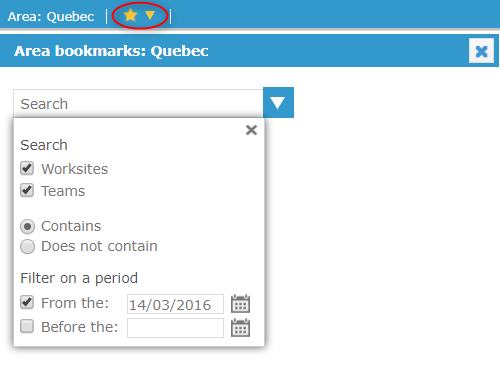
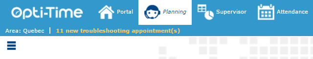
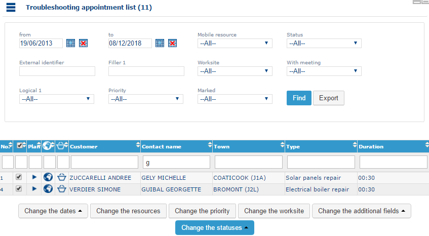
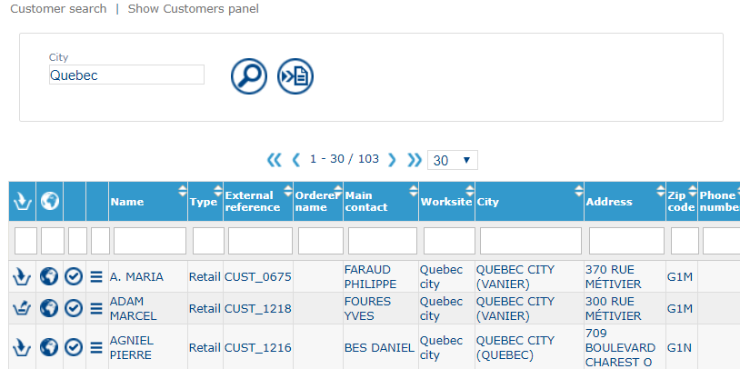

# The Header Bar

In addition to the general functions in the [header bar](https://mynomadia.com/privatedoc/9LLcWh7j74sENa54/optitime-doc/docs/en/otgs-reference-book/bandeau.html), depending on the application configuration, the Planning module offers additional functions to facilitate scheduling.

### Favorites for the area

Click the **star** to activate or deactivate the defined area favourites in the **Favourites Manager** pane. You can filter the selection by **teams** or **worksites**. By default, these selections correspond to those defined in the respective form, but you can modify them here.

Once activated, the selected **resources, teams, and worksites** are automatically restricted throughout the module.

### Recent appointments

As successive browsing actions take place in the planning, the header bar displays appointments viewed recently.

It will then suffice to click on the appointment seen recently to access its form.

### List of urgent appointments

You can configure a predefined search list based on one or more **task types** and specific **appointment characteristics**, such as logical criteria, fulfilment periods, and status fields.

This functionality can be used to quickly identify **urgent appointments**, such as breakdown-related appointments.

The predefined search list can be linked to a **warning counter** displayed in the upper section of the application interface. The counter is incremented each time an appointment that meets the defined criteria is created.

Click on the link in the header bar (or the link in the [information frame](https://mynomadia.com/privatedoc/9LLcWh7j74sENa54/optitime-doc/docs/en/otgs-reference-book/call-center-cadre-info.html)) to display the list of urgent appointments in the form of a [search form](https://mynomadia.com/privatedoc/9LLcWh7j74sENa54/optitime-doc/docs/en/otgs-reference-book/call-center-objets.html#call-center-recherche).

The buttons available in the list of urgent appointments are described [here](https://mynomadia.com/privatedoc/9LLcWh7j74sENa54/optitime-doc/docs/en/otgs-reference-book/call-center-objets.html#call-center-resultat).

|                                                                                                                                                                                                                        |         |
| ---------------------------------------------------------------------------------------------------------------------------------------------------------------------------------------------------------------------- | ------- |
| \[Warning]                                                                                                                                                                                                             | Warning |
| This list can be configured so it is displayed in the header bar (see the [application settings](https://mynomadia.com/privatedoc/9LLcWh7j74sENa54/optitime-doc/docs/en/otgs-reference-book/perso.html#config-appli)). |         |

### List of customers on alert

Similar to urgent appointments, you can define specific criteria for customers and display a corresponding **counter** in the header bar.

The counter is automatically updated whenever a new customer matching the defined criteria is created.

When enabled, the customer counter is displayed in the **header bar**, to the right of the **urgent appointments** counter.

Clicking on this link, a search page displays with the predefined list criteria:

Result

The list of corresponding customers displays in the same way as for a standard [customer search](https://mynomadia.com/privatedoc/9LLcWh7j74sENa54/optitime-doc/docs/en/otgs-reference-book/call-center-menu.html#menu-clients-rechercher).

|                                                                                                                                                                                                                        |         |
| ---------------------------------------------------------------------------------------------------------------------------------------------------------------------------------------------------------------------- | ------- |
| \[Warning]                                                                                                                                                                                                             | Warning |
| This list can be configured so it is displayed in the header bar (see the [application settings](https://mynomadia.com/privatedoc/9LLcWh7j74sENa54/optitime-doc/docs/en/otgs-reference-book/perso.html#config-appli)). |         |
