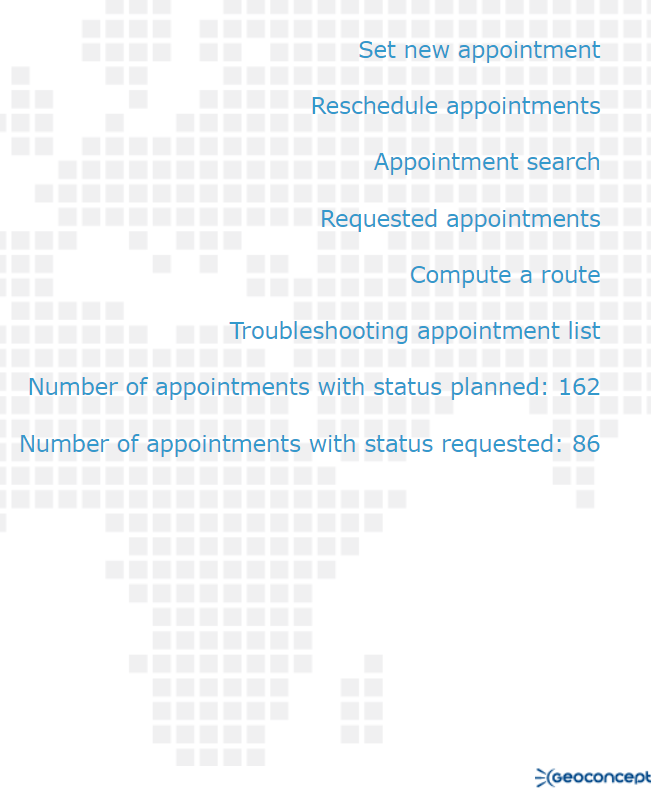
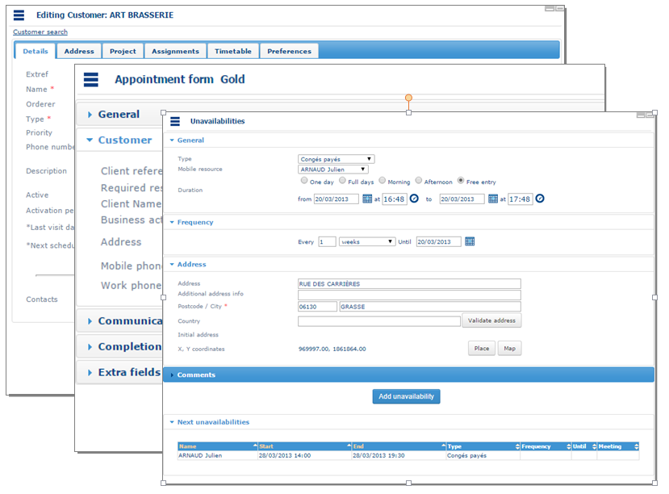
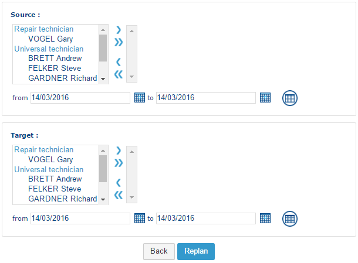
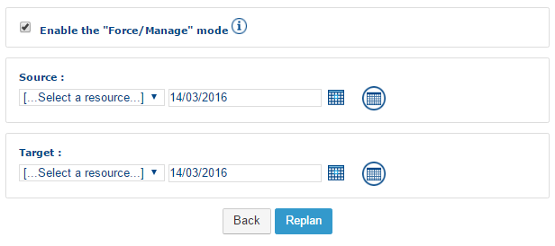
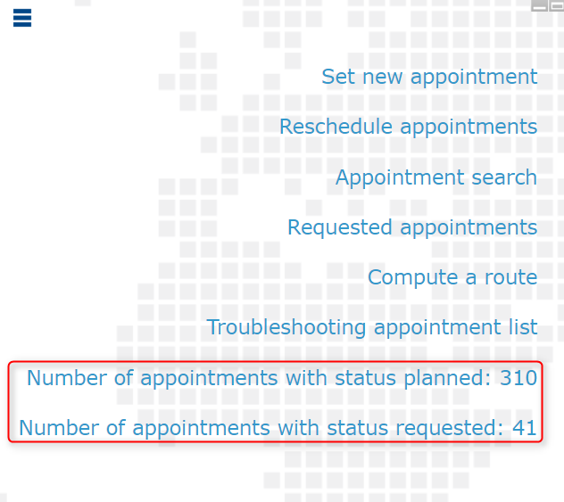

# The Information Pane

The information frame located to the left of the screen of the Planning module is made up of short-cuts corresponding to the [menu](https://mynomadia.com/privatedoc/9LLcWh7j74sENa54/optitime-doc/docs/en/otgs-reference-book/call-center-menu.html) functions. This allows you to [replan several appointments](https://mynomadia.com/privatedoc/9LLcWh7j74sENa54/optitime-doc/docs/en/otgs-reference-book/call-center-cadre-info.html#replanifier) and to display the [appointment counters](https://mynomadia.com/privatedoc/9LLcWh7j74sENa54/optitime-doc/docs/en/otgs-reference-book/call-center-cadre-info.html#compteurs-rdv).

This screen also displays the detailed forms for the appointment, unavailability, customer information, view, search formulas etc.&#x20;

### Replanning appointments

This function replans appointments that have already been planned for other resources or other dates.

* The first part of the screen allows you to select any appointments that will be replanned.
* To do this, select one or several **sources** by selecting them in the list, along with a time interval in dates **from, to**. The  button displays the agendas concerned in the planning pane.
* The second part of the screen functions like the first, except that it concerns the destination agendas (**target**).
* The Back button returns you to the previous screen.
* The Replan button replans the appointments.

Once planning is complete, the number of appointments replanned is displayed at the end of the page.

|                                                                                                                                                                     |     |
| ------------------------------------------------------------------------------------------------------------------------------------------------------------------- | --- |
| \[Tip]                                                                                                                                                              | Tip |
| The higher the number of destination resources and the longer the time interval in terms of dates, the greater chance the appointment will have of being replanned. |     |

**Force / manage mode**

The **Force / Manage** mode allows you to force a replanning operation. To activate it, you need to check the corresponding check-box.

Having first clicked on the Replan button, the list of constraints preventing scheduling from taking place is displayed at the bottom of the screen. It is then possible to force these constraints by clicking on the Force appointment button.

### Appointment counters

The Planning module home page can display a certain number of appointment counters (by status). These counters depend on a centralized [configuration](https://mynomadia.com/privatedoc/9LLcWh7j74sENa54/optitime-doc/docs/en/otgs-reference-book/perso.html#config-appli) to search for appointments in the database fulfilling certain criteria (notably of timescale).&#x20;

It is possible to configure up to 7 counters:

* Number of appointments with status **requested**;
* Number of appointments with status **suspended**;
* Number of appointments with status **planned**;
* Number of appointments with status **reserved**;
* Number of appointments with status **confirmed**;
* Number of appointments with status **fulfilled**;
* Number of appointments with status **cancelled**;

Clicking on these links displays the list of appointments concerned in the form of a [search form](https://mynomadia.com/privatedoc/9LLcWh7j74sENa54/optitime-doc/docs/en/otgs-reference-book/call-center-objets.html#call-center-recherche).

The fields displayed in this list are those of the [appointment form](https://mynomadia.com/privatedoc/9LLcWh7j74sENa54/optitime-doc/docs/en/otgs-reference-book/call-center-objets.html#fiche-rdv), and can be configured if required.

Clicking on a record in the list, you can access the [appointment form](https://mynomadia.com/privatedoc/9LLcWh7j74sENa54/optitime-doc/docs/en/otgs-reference-book/call-center-objets.html#fiche-rdv).

The buttons are described in the chapter concerning the [appointment lists](https://mynomadia.com/privatedoc/9LLcWh7j74sENa54/optitime-doc/docs/en/otgs-reference-book/call-center-objets.html#boutons-liste-rdv).
