# The Planning

The planning pane is located at the bottom right of the Planning screen. Like the other panes, it can be resized as required.

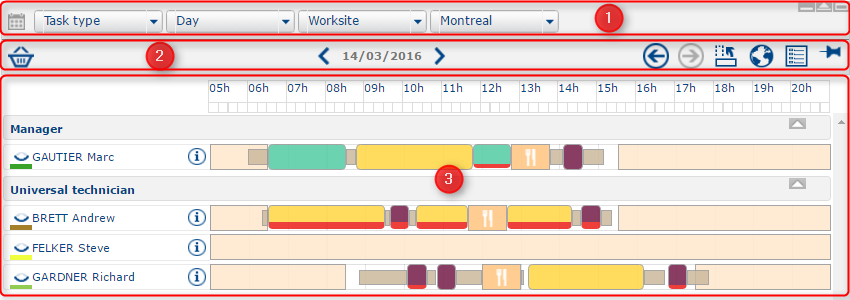

It is composed of three sections:

1. A [selection bar](https://mynomadia.com/privatedoc/9LLcWh7j74sENa54/optitime-doc/docs/en/otgs-reference-book/call-center-agenda.html#selection-vues) for the different views in the plannings.&#x20;
2. A [navigation bar](https://mynomadia.com/privatedoc/9LLcWh7j74sENa54/optitime-doc/docs/en/otgs-reference-book/call-center-agenda.html#planning-navigation), made up of navigation and display buttons.&#x20;
3. The [agenda](https://mynomadia.com/privatedoc/9LLcWh7j74sENa54/optitime-doc/docs/en/otgs-reference-book/call-center-agenda.html#call-center-agenda-rdv) part (composed of appointments, unavailabilities, etc.)

This page allows you to consult, modify, and handle the planning of one or several technicians, sales personnel or resources.

It also allows you to handle plannings at the level of a worksite (team, area,…).

**Hide / Display the planning as a function of the post occupied**

Click on the  button to hide the plannings and resources occupying a single post. Conversely, the  button redisplays any plannings hidden previously.

### Planning views

The user can handle the view of the planning from this page with the help of three main options:

* the agenda kind;
* the period;
* the hierarchical level.

In each of these drop-down menus, type the first letter of a word to arrive directly at the word you are looking for.

The 3 display options for the planning

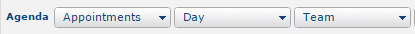

#### Agenda kind

Agenda kinds available

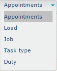

The planning manager can visualise the planning of one or several resources as a function of several kinds:

* **Appointments**: enables visualisation of the planned interventions on the given period as a function of their status (Planned, Reserved, Confirmed, or Fulfilled);
* **Load**: enables visualisation of the planning as a function of the workload for the day (i.e. how fully booked the day is);
* **Job**: allows you to see the planning as a function of the temporary post assigned to a resource on the day, the week, or the month;
* **Task type**: allows you to see the planning as a function of the type of intervention planned or fulfilled;
* **Duty**: allows you to view any on-call duty specified for the given period.

#### Period

Available periods

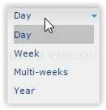

The planning manager can view the planning for one or several resources on 4 different periods (these periods are not all available, as they depend on the kind displayed):

* **Day** (available for all kinds of planning);
* **Week** (available for all kinds of planning);
* **Multi-week** (available for the **Load** and **Post** kinds of planning);
* **Year** (available for the **Load** kind of planning).

|                                                                                                                                                                                   |         |
| --------------------------------------------------------------------------------------------------------------------------------------------------------------------------------- | ------- |
| \[Warning]                                                                                                                                                                        | Warning |
| All these availabilities can be modified in the [Administration](https://mynomadia.com/privatedoc/9LLcWh7j74sENa54/optitime-doc/docs/en/otgs-reference-book/donnees.html) module. |         |

#### Hierarchical level

The planning can also be displayed as a function of several hierarchical levels:

* **Resource**: displays the planning of one resource in particular;
* **Team**: displays the planning of all the resources in one team;
* **Worksite**: displays the planning of all the resources from one worksite;
* **Area**: displays the planning of all the resources in one area;
* **Multi-resources**: displays the planning of several resources, teams, work sites or areas (if no parameters have been set at the outset, the user is directed to a configuration page);
* **Vehicle**: displays the planning for a vehicle.

Depending on the hierarchical level selected, the user can then choose in the drop-down list the resource, the team, the worksite, the area, or the vehicle for which they want to consult the planning.

Finally, a  [tool-tip](https://mynomadia.com/privatedoc/9LLcWh7j74sENa54/optitime-doc/docs/en/otgs-reference-book/call-center-agenda.html#info-bulle-tournee), available only in "Resource" mode, displays information about a route.

#### Route info

The information are displayed in the following form:

Abbreviated form for the resource

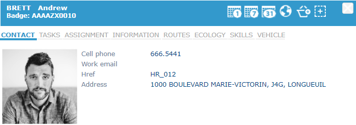

The form comprises the following 8 tabs:

* the Contact tab displays **the address** the **telephone number**, and the **email address** of the resource.
* the Tasks tab displays the **job held** and **level of experience** as well as **intervention types** authorised for the resource.
* the Assignment tab displays the **team** the **main worksite**, the **secondary worksite** and the **intervention sector** for the resource.
* the Infos tab displays **additional information** concerning the resource.
* the Routes tab displays the **travel times** and **kilometers travelled** by the resource. If you display a daily planning, the time and kilometers displayed concern the selected day. If it is a weekly planning, the time and kilometers displayed correspond to the total time and distance travelled for the week (idem for a monthly planning).
* the Ecology tab displays the total **CO2 emissions** attributable to the resource.
* the Skills tab displays the resource’s **skills**.
* the Vehicle tab displays the [**default vehicle used**](https://mynomadia.com/privatedoc/9LLcWh7j74sENa54/optitime-doc/docs/en/otgs-reference-book/donnees.html#RH-vehicule), the **vehicle** and the **equipment** [assigned](https://mynomadia.com/privatedoc/9LLcWh7j74sENa54/optitime-doc/docs/en/otgs-reference-book/mob.html#mob-affectation) to the resource as well as the **period of assignment**.
* The  button displays the daily planning for the resource.
* The  button displays the weekly planning for the resource.
* The  button displays the monthly planning for the resource.
* The  button displays the route.
* The  button puts all the appointments for the route in the [panel](https://mynomadia.com/privatedoc/9LLcWh7j74sENa54/optitime-doc/docs/en/otgs-reference-book/call-center-agenda.html#manipuler-une-intervention-a-partir-du-panier).
* The  button allos you to [select](https://mynomadia.com/privatedoc/9LLcWh7j74sENa54/optitime-doc/docs/en/otgs-reference-book/call-center-menu.html#lister-rdv-select) all the appointments in the route.

### Navigation bar

In addition to the planning visualisation parameters, other tools enable navigation in the planning for the purpose of consulting it.

Bar of viewing functions in the planning

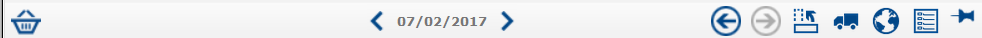

The buttons in this part of the planning are as follows (from left to right in the navigation bar):

* The [panel](https://mynomadia.com/privatedoc/9LLcWh7j74sENa54/optitime-doc/docs/en/otgs-reference-book/call-center-agenda.html#manipuler-une-intervention-a-partir-du-panier) ;
* The buttons to change the date of the [agenda](https://mynomadia.com/privatedoc/9LLcWh7j74sENa54/optitime-doc/docs/en/otgs-reference-book/call-center-agenda.html#agenda-navig) composed of two arrows and a date:
* The [arrows](https://mynomadia.com/privatedoc/9LLcWh7j74sENa54/optitime-doc/docs/en/otgs-reference-book/call-center-agenda.html#agenda-navig-recent) to return to the preceding,  or next,  agenda;
* The [switch agenda](https://mynomadia.com/privatedoc/9LLcWh7j74sENa54/optitime-doc/docs/en/otgs-reference-book/call-center-agenda.html#agenda-bascule)  button;
* The button to display the [position of the resource on the map](https://mynomadia.com/privatedoc/9LLcWh7j74sENa54/optitime-doc/docs/en/otgs-reference-book/call-center-agenda.html#agenda-suivi) ;
* The display of the  [routes on the map](https://mynomadia.com/privatedoc/9LLcWh7j74sENa54/optitime-doc/docs/en/otgs-reference-book/call-center-agenda.html#agenda-tournees);
* The button to display the [legend](https://mynomadia.com/privatedoc/9LLcWh7j74sENa54/optitime-doc/docs/en/otgs-reference-book/call-center-agenda.html#agenda-legende) ;
* The [map pin](https://mynomadia.com/privatedoc/9LLcWh7j74sENa54/optitime-doc/docs/en/otgs-reference-book/call-center-agenda.html#agenda-punaise) .

#### The panel

* If interventions are present in the panel, the number of interventions will be indicated by a symbol on the panel icon: .
* Clicking on this image, the user can visualise the interventions stored in the panel. They are stored by resource and with the relevant identifier(s).

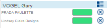

To replan an intervention in the panel and in a planning, simply drag and drop onto a timeslot:

* If the timeslot is free, the intervention is automatically planned;
* If a clash is encountered (unavailability, intervention already planned or a constraint is not respected), the user is warned by a message that summarises the conflict encountered and the choice to force the placement of this intervention or not. The interventions in conflict will then be replanned.

Other options:

1. Moving the orange frame in the panel towards the resource’s planning, the application will try to replan all appointments in this planning. The number of replanned appointments will then be displayed.
2. When you move an appointment from the panel on to the name of the resource, the application chooses the best timeslot in which to position the appointment in the resource’s day.

#### Navigating from one date to another

* To consult the planning for earlier or later periods, the user can click on the  or  buttons.
* Clicking on the date, it will also be possible to select a date directly in the agenda.

|                                                                                                                                                          |     |
| -------------------------------------------------------------------------------------------------------------------------------------------------------- | --- |
| \[Tip]                                                                                                                                                   | Tip |
| In multi-day views, click on a day of the week to display today’s agenda: it will then be possible to move from a week view to a day view of the agenda. |     |

#### Previous or next agenda

* The user can rapidly move to find an agenda viewed recently using the  button, and then return to the next agenda using the  button.
* These buttons navigate through plannings viewed previously in all their forms. For example, if the user has moved from a resource view to a worksite view, they may return to the worksite view simply by clicking on .

|                                                                                                                             |     |
| --------------------------------------------------------------------------------------------------------------------------- | --- |
| \[Tip]                                                                                                                      | Tip |
| These buttons do not permit cancellation of an operation performed earlier, they are exclusively for consultation purposes. |     |

#### Switching the agenda

* By default, the agenda is displayed horizontally with the name of the resource(s) on-line and the time, the day, the weeks or the months in columns.
* Clicking on the  button, the agenda switches into vertical viewing mode.

Example of a vertical agenda

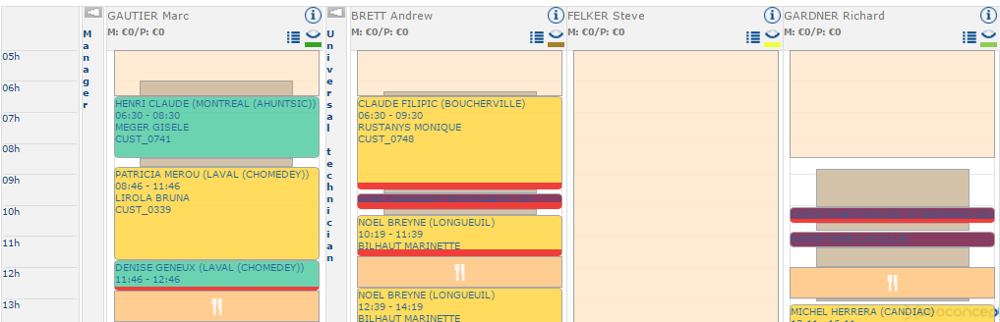

A click on the  button takes you back to the default agenda display.

#### Display the location of the resource in the map

* This button displays the location of the resource on the map.
* In addition to their map position, the user is informed if the position of the resource corresponds or not to the planned itinerary.

#### Display on the map

This button displays routes in the agenda on the map.

|                                                                                                                                                                                     |      |
| ----------------------------------------------------------------------------------------------------------------------------------------------------------------------------------- | ---- |
| \[Note]                                                                                                                                                                             | Note |
| It is only available in [views](https://mynomadia.com/privatedoc/9LLcWh7j74sENa54/optitime-doc/docs/en/otgs-reference-book/call-center-agenda.html#selection-vues) the day or week. |      |

Visualising a route on the map

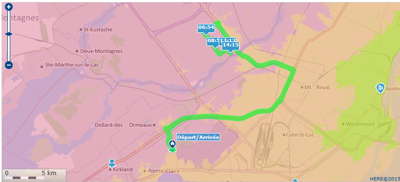

* All resources sheduled for the viewed period are indicated by a tool-tip defining the time of the resource.
* During the display of the routes of several resources, each route is represented by the colour of the corresponding resource.

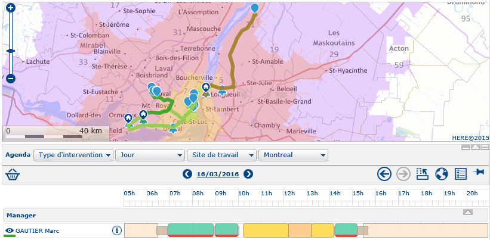

|                                                                                                                          |     |
| ------------------------------------------------------------------------------------------------------------------------ | --- |
| \[Tip]                                                                                                                   | Tip |
| In multi-resource mode, the eye just to the left of the resource name in the planning lets you display / hide the route. |     |

#### Display the legend

Legend

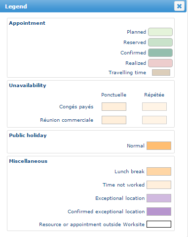

* The legend displays, by [object](https://mynomadia.com/privatedoc/9LLcWh7j74sENa54/optitime-doc/docs/en/otgs-reference-book/call-center-objets.html) type, the colour of the various items in the planning.
* The colours of objects displayed in the planning are [configurable](https://mynomadia.com/privatedoc/9LLcWh7j74sENa54/optitime-doc/docs/en/otgs-reference-book/perso.html#couleurs).

|                                              |     |
| -------------------------------------------- | --- |
| \[Tip]                                       | Tip |
| The legend adapts to fit the displayed view. |     |

#### Map pin

* When performing manipulations on the [information frame](https://mynomadia.com/privatedoc/9LLcWh7j74sENa54/optitime-doc/docs/en/otgs-reference-book/call-center-cadre-info.html) (search for an intervention, for example), the planning is updated automatically to display the agenda concerning the search applied.
* This button serves to fix the planning view and forbid automated updating.

|                                                                                                                                |         |
| ------------------------------------------------------------------------------------------------------------------------------ | ------- |
| \[Warning]                                                                                                                     | Warning |
| All the manipulations in the planning view (display by nature of intervention, periods…) cannot be blocked with this function. |         |

### The agenda

* The agenda part is made up of one or several days of one or several resources.
* The items for this day are displayed in graphical form (either horizontally, or vertically) and a table, at the bottom of the page, displays the detail for these items.
* The colours of items in the planning are described in the [legend](https://mynomadia.com/privatedoc/9LLcWh7j74sENa54/optitime-doc/docs/en/otgs-reference-book/call-center-agenda.html#agenda-legende).

|                                                                                                                                                                                                    |      |
| -------------------------------------------------------------------------------------------------------------------------------------------------------------------------------------------------- | ---- |
| \[Note]                                                                                                                                                                                            | Note |
| The priority levels for appointments are shown by a red line, the thickness of which reflects the level of priority for the appointment in the planning: images/ref/planification/priorite-rdv.png |      |

The agenda appearance will vary depending on the [selected view](https://mynomadia.com/privatedoc/9LLcWh7j74sENa54/optitime-doc/docs/en/otgs-reference-book/call-center-agenda.html#selection-vues):

Day agenda for the worksite

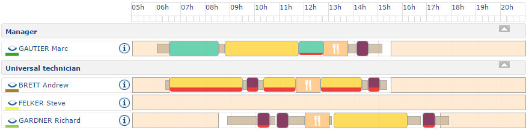

Day agenda for the resource

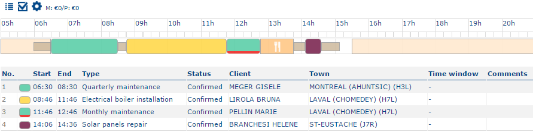

In this view, under the graphical representation of the agenda, a list provides details of all the items in the planning in chronological order, indicating the start and end time, the intervention type, the status, the names of both the appointment and the town in which it is to take place.

Monthly agenda for the resource in workload view

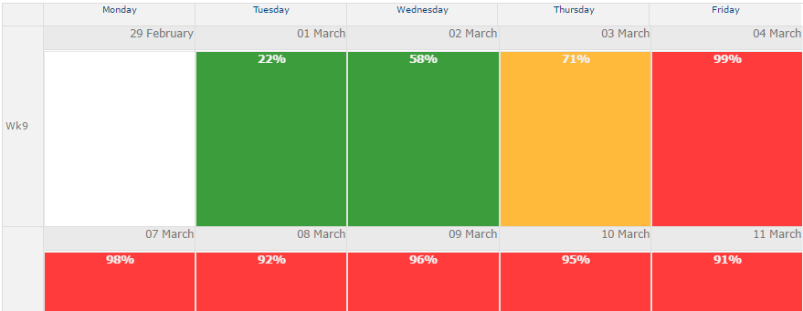

The agenda provides access to functions according to the [user rights](https://mynomadia.com/privatedoc/9LLcWh7j74sENa54/optitime-doc/docs/en/otgs-reference-book/utilisateurs.html#coll-droits):

* [reoptimise a day / week](https://mynomadia.com/privatedoc/9LLcWh7j74sENa54/optitime-doc/docs/en/otgs-reference-book/call-center-agenda.html#reoptim)
* [move or extend](https://mynomadia.com/privatedoc/9LLcWh7j74sENa54/optitime-doc/docs/en/otgs-reference-book/call-center-agenda.html#deplacer-etirer) items (appointments, unavailabilities or exceptional locations)
* [manage appointments](https://mynomadia.com/privatedoc/9LLcWh7j74sENa54/optitime-doc/docs/en/otgs-reference-book/call-center-agenda.html#tool-tip-rdv)
* [manage unavailabilities](https://mynomadia.com/privatedoc/9LLcWh7j74sENa54/optitime-doc/docs/en/otgs-reference-book/call-center-agenda.html#tool-tip-indispo)
* [manage non-worked hours for the resource](https://mynomadia.com/privatedoc/9LLcWh7j74sENa54/optitime-doc/docs/en/otgs-reference-book/call-center-agenda.html#tool-tip-horaire)
* [manage exceptional locations](https://mynomadia.com/privatedoc/9LLcWh7j74sENa54/optitime-doc/docs/en/otgs-reference-book/call-center-agenda.html#tool-tip-loc-except)
* [manage locked agendas](https://mynomadia.com/privatedoc/9LLcWh7j74sENa54/optitime-doc/docs/en/otgs-reference-book/call-center-agenda.html#tool-tip-verr)
* [manage temporary work posts](https://mynomadia.com/privatedoc/9LLcWh7j74sENa54/optitime-doc/docs/en/otgs-reference-book/call-center-agenda.html#tool-tip-postes)
* [fill free timeslots in the agenda](https://mynomadia.com/privatedoc/9LLcWh7j74sENa54/optitime-doc/docs/en/otgs-reference-book/call-center-agenda.html#tool-tip-planning-vide)
* [display information about journey times](https://mynomadia.com/privatedoc/9LLcWh7j74sENa54/optitime-doc/docs/en/otgs-reference-book/call-center-agenda.html#tool-tip-trajet)
* [display information about lunch break](https://mynomadia.com/privatedoc/9LLcWh7j74sENa54/optitime-doc/docs/en/otgs-reference-book/call-center-agenda.html#tool-tip-pause-dej)
* edit the [roadbook](https://mynomadia.com/privatedoc/9LLcWh7j74sENa54/optitime-doc/docs/en/otgs-reference-book/call-center-menu.html#feuille-de-route)
* display [information about the resource](https://mynomadia.com/privatedoc/9LLcWh7j74sENa54/optitime-doc/docs/en/otgs-reference-book/call-center-agenda.html#info-bulle-tournee) by clicking on the  button opposite the name of the resource

#### Reoptimising the day

The  button runs a re-optimisation of the day on a technician directly from their planning. In the window that opens, the user can define from what time the re-optimisation of the day must start, and whether the tool can insert interventions to be planned or only retain those that have already been planned on that day.

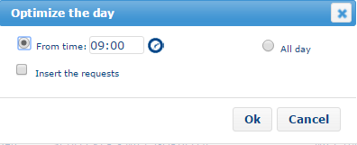

|                                                                                                                                    |      |
| ---------------------------------------------------------------------------------------------------------------------------------- | ---- |
| \[Note]                                                                                                                            | Note |
| The option to reoptimise is also available in the weekly agenda. At this point, all the appointments for the week are reoptimised. |      |

#### Move / extend objects

You can move or extend all objects in the planning ([appointments](https://mynomadia.com/privatedoc/9LLcWh7j74sENa54/optitime-doc/docs/en/otgs-reference-book/call-center-objets.html#objets-rdv), [unavailabilities](https://mynomadia.com/privatedoc/9LLcWh7j74sENa54/optitime-doc/docs/en/otgs-reference-book/call-center-objets.html#centre-d-appel-indisponibilite), non-worked hours, [nights away](https://mynomadia.com/privatedoc/9LLcWh7j74sENa54/optitime-doc/docs/en/otgs-reference-book/call-center-objets.html#localisations-exceptionnelles), [agenda marker](https://mynomadia.com/privatedoc/9LLcWh7j74sENa54/optitime-doc/docs/en/otgs-reference-book/call-center-objets.html#objets-jalons)).

**Moving an object in the planning**

To move an object, simply drag-and-drop to the desired position in the planning.

|                                                                                                                                                                                                                                                                                             |         |
| ------------------------------------------------------------------------------------------------------------------------------------------------------------------------------------------------------------------------------------------------------------------------------------------- | ------- |
| \[Warning]                                                                                                                                                                                                                                                                                  | Warning |
| Not all drag-and-drop operations are authorised. For example, a drag-and-drop of an appointment on a resource who does not have the skills will not work first time around. A windows will open requesting the user if they want to force the insertion of the appointment in the planning. |         |

**Extend an object in the planning**

To extend an object, simply move the mouse to the extremity of the object, and then click and stretch it forward to shorten it, or backwards to make it larger:

Put the mouse cursor at the object’s extremity:

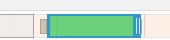

Stretch the object:

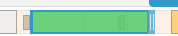

A window then displays to confirm the object extension.

|                                                                                                                                                                                                                                                                                                                                                                                                        |         |
| ------------------------------------------------------------------------------------------------------------------------------------------------------------------------------------------------------------------------------------------------------------------------------------------------------------------------------------------------------------------------------------------------------ | ------- |
| \[Warning]                                                                                                                                                                                                                                                                                                                                                                                             | Warning |
| In some cases, it will not be possible to extend the object. In the case of an appointment for example, if the planning is filled, and the object extension interferes with the feasibility of the the journey to or from the appointment, or to the next appointment for example, it will not be possible to extend the appointment object. A message displays to warn the user: "no solution found". |         |

|                                                                                                                                       |      |
| ------------------------------------------------------------------------------------------------------------------------------------- | ---- |
| \[Note]                                                                                                                               | Note |
| In earlier versions of Opti-Time, to extend / move an object, you had to select the corresponding option in the appointment tool-tip. |      |

#### Managing appointments in the agenda

Moving the mouse cursor over an intervention, the appointment tool-tip displays.

Appointment information popup

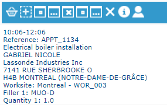

The tool-tip will contain some information from the [appointment](https://mynomadia.com/privatedoc/9LLcWh7j74sENa54/optitime-doc/docs/en/otgs-reference-book/call-center-objets.html#fiche-rdv) such as the customer name, and the intervention address or site.

A series of action buttons serve to apply the following operations to the intervention:

* Put the appointment in the [panel](https://mynomadia.com/privatedoc/9LLcWh7j74sENa54/optitime-doc/docs/en/otgs-reference-book/call-center-agenda.html#manipuler-une-intervention-a-partir-du-panier) ;
* Add the appointment to the [list of selected appointments](https://mynomadia.com/privatedoc/9LLcWh7j74sENa54/optitime-doc/docs/en/otgs-reference-book/call-center-agenda.html) ;
* Reserve / Unconfirm: changes the appointment [status](https://mynomadia.com/privatedoc/9LLcWh7j74sENa54/optitime-doc/docs/en/otgs-reference-book/_the_different_statuses_for_appointments_in_opti_time.html#statuts) to _Reserved_ / previous ;
* Unplan / Suspend an appointment: changes the appointment [status](https://mynomadia.com/privatedoc/9LLcWh7j74sENa54/optitime-doc/docs/en/otgs-reference-book/_the_different_statuses_for_appointments_in_opti_time.html#statuts) to previous / _Suspended_ ;
* Reactivate: changes the appointment [status](https://mynomadia.com/privatedoc/9LLcWh7j74sENa54/optitime-doc/docs/en/otgs-reference-book/_the_different_statuses_for_appointments_in_opti_time.html#statuts) to _Requested_ ;
* Delete: changes the appointment [status](https://mynomadia.com/privatedoc/9LLcWh7j74sENa54/optitime-doc/docs/en/otgs-reference-book/_the_different_statuses_for_appointments_in_opti_time.html#statuts) to _Abandonned_ ;
* Cancels the appointment ;
* Displays the [appointment form](https://mynomadia.com/privatedoc/9LLcWh7j74sENa54/optitime-doc/docs/en/otgs-reference-book/call-center-objets.html#fiche-rdv) ;
* Displays the [customer form](https://mynomadia.com/privatedoc/9LLcWh7j74sENa54/optitime-doc/docs/en/otgs-reference-book/call-center-objets.html#fiche-client) .

|                                                                                                                                                                                                                                                                                                                                                                 |     |
| --------------------------------------------------------------------------------------------------------------------------------------------------------------------------------------------------------------------------------------------------------------------------------------------------------------------------------------------------------------- | --- |
| \[Tip]                                                                                                                                                                                                                                                                                                                                                          | Tip |
| Clicking on an intervention in the planning, the [intervention form](https://mynomadia.com/privatedoc/9LLcWh7j74sENa54/optitime-doc/docs/en/otgs-reference-book/call-center-objets.html#fiche-rdv) opens directly and displays in the [map](https://mynomadia.com/privatedoc/9LLcWh7j74sENa54/optitime-doc/docs/en/otgs-reference-book/call-center-carte.html). |     |

#### Manage unavailabilities in the agenda

Moving the mouse over an unavailability in the agenda, the infobox popup for the unavailability displays.

Infobox for an unavailability

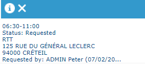

This displays information about the unavailability.

The  button displays the [abbreviated unavailability form](https://mynomadia.com/privatedoc/9LLcWh7j74sENa54/optitime-doc/docs/en/otgs-reference-book/call-center-objets.html#fiche-reduite-indispo).

The  button deletes the unavailability. In the case of a repeated unavailability, a message will display to allow the user to choose between deleting all repetitions or only the selected unavailabilities.

|                                                                                                                                                                                                                                                                                                                                                                                                     |     |
| --------------------------------------------------------------------------------------------------------------------------------------------------------------------------------------------------------------------------------------------------------------------------------------------------------------------------------------------------------------------------------------------------- | --- |
| \[Tip]                                                                                                                                                                                                                                                                                                                                                                                              | Tip |
| Clicking on an unavailability in the planning, the [abbreviated form for the unavailability](https://mynomadia.com/privatedoc/9LLcWh7j74sENa54/optitime-doc/docs/en/otgs-reference-book/call-center-objets.html#fiche-reduite-indispo) opens directly and displays in the [map](https://mynomadia.com/privatedoc/9LLcWh7j74sENa54/optitime-doc/docs/en/otgs-reference-book/call-center-carte.html). |     |

#### Manage non-worked hours in the agenda

Moving the mouse cursor over the non-worked hours of a resource (start or end of the day), an infobox appears showing the different manipulations that are possible:

Infobox for a series of non-worked hours

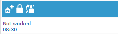

* The  button returns you to the [managing nights away](https://mynomadia.com/privatedoc/9LLcWh7j74sENa54/optitime-doc/docs/en/otgs-reference-book/call-center-agenda.html) page.
* The  /  button allows you to [lock / unlock the day](https://mynomadia.com/privatedoc/9LLcWh7j74sENa54/optitime-doc/docs/en/otgs-reference-book/call-center-agenda.html).
* The  button adds an [unavailability](https://mynomadia.com/privatedoc/9LLcWh7j74sENa54/optitime-doc/docs/en/otgs-reference-book/donnees.html#RH-passage-depot) in the agenda.

#### Manage exceptional locations in the agenda

Moving the mouse over an [exceptional location](https://mynomadia.com/privatedoc/9LLcWh7j74sENa54/optitime-doc/docs/en/otgs-reference-book/call-center-objets.html#localisations-exceptionnelles), the corresponding infobox displays.

Here you will find certain information items from the [exceptional location form](https://mynomadia.com/privatedoc/9LLcWh7j74sENa54/optitime-doc/docs/en/otgs-reference-book/call-center-objets.html#fiche-loc-exceptionnelle).

* The  button displays the [exceptional location form](https://mynomadia.com/privatedoc/9LLcWh7j74sENa54/optitime-doc/docs/en/otgs-reference-book/call-center-objets.html#fiche-loc-exceptionnelle);
* The  button enables deletion of the exceptional location.

#### Managing locked agendas

Clicking on the lock of a locked day 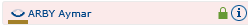, displays the [locked day form](https://mynomadia.com/privatedoc/9LLcWh7j74sENa54/optitime-doc/docs/en/otgs-reference-book/call-center-objets.html#fiche-journee-verrouillee).

#### Handling temporary posts in the agenda

In [posts view](https://mynomadia.com/privatedoc/9LLcWh7j74sENa54/optitime-doc/docs/en/otgs-reference-book/call-center-agenda.html#selection-vues), if you move the mouse over a non-worked timeslot, the posts infobox displays.

The  button allows you to create a [temporary post](https://mynomadia.com/privatedoc/9LLcWh7j74sENa54/optitime-doc/docs/en/otgs-reference-book/call-center-menu.html#gestion-postes-temp).

On an existing post,

* The  button displays the [temporary post form](https://mynomadia.com/privatedoc/9LLcWh7j74sENa54/optitime-doc/docs/en/otgs-reference-book/call-center-objets.html#fiche-poste-temporaire);
* The  button deletes the temporary post.

#### Fill an empty agenda

Gliding the mouse cursor over the empty planning of a resource, an infobox or popup appears with the possibility of various manipulations:

Infobox for an empty planning

1. [Filling the empty planning](https://mynomadia.com/privatedoc/9LLcWh7j74sENa54/optitime-doc/docs/en/otgs-reference-book/call-center-agenda.html#d172e6579)
2. [Adding an appointment](https://mynomadia.com/privatedoc/9LLcWh7j74sENa54/optitime-doc/docs/en/otgs-reference-book/call-center-agenda.html#d172e6644)
3. [Make an appointment for an existing customer](https://mynomadia.com/privatedoc/9LLcWh7j74sENa54/optitime-doc/docs/en/otgs-reference-book/call-center-agenda.html#d172e6656)
4. [Adding an unavailability](https://mynomadia.com/privatedoc/9LLcWh7j74sENa54/optitime-doc/docs/en/otgs-reference-book/call-center-agenda.html#d172e6668)
5. [Creating an express unavailability](https://mynomadia.com/privatedoc/9LLcWh7j74sENa54/optitime-doc/docs/en/otgs-reference-book/call-center-agenda.html#d172e6680)
6. [Add a locked day](https://mynomadia.com/privatedoc/9LLcWh7j74sENa54/optitime-doc/docs/en/otgs-reference-book/call-center-agenda.html#d172e6692)
7. [Add marker](https://mynomadia.com/privatedoc/9LLcWh7j74sENa54/optitime-doc/docs/en/otgs-reference-book/call-center-agenda.html#d172e6709)

|        |                                                                                                                                                                                                                                                                                                                                                                                                                                                   |
| ------ | ------------------------------------------------------------------------------------------------------------------------------------------------------------------------------------------------------------------------------------------------------------------------------------------------------------------------------------------------------------------------------------------------------------------------------------------------- |
| **1.** | **Filling the empty planning**                                                                                                                                                                                                                                                                                                                                                                                                                    |
|        | In the infobox, the user clicks on the images/ref/buttons/bouton-remplir-le-planning.png button. By default, the application searches for all appointments with a [status](https://mynomadia.com/privatedoc/9LLcWh7j74sENa54/optitime-doc/docs/en/otgs-reference-book/_the_different_statuses_for_appointments_in_opti_time.html#statuts) of _Requested_ or _Suspended_ that can be added to the planning.                                        |
| **2.** | **Adding an appointment**                                                                                                                                                                                                                                                                                                                                                                                                                         |
|        | Clicking on the images/ref/buttons/ajouter-une-intervention.png button, this option plans an intervention that does not yet exist in the interventions to be planned. This displays the customer’s [information form](https://mynomadia.com/privatedoc/9LLcWh7j74sENa54/optitime-doc/docs/en/otgs-reference-book/call-center-menu.html#prendre-nouveau-rdv).                                                                                      |
| **3.** | **Make an appointment for an existing customer**                                                                                                                                                                                                                                                                                                                                                                                                  |
|        | When you click on the images/ref/buttons/tooltip-client.png button, this option allows you to schedule an intervention for an existing customer. The customer [search function](https://mynomadia.com/privatedoc/9LLcWh7j74sENa54/optitime-doc/docs/en/otgs-reference-book/call-center-menu.html#rechercher-type-client) then displays.                                                                                                           |
| **4.** | **Adding an unavailability**                                                                                                                                                                                                                                                                                                                                                                                                                      |
|        | Click on the images/ref/buttons/bouton-ajouter-une-indisponibilite.png button to display the [unavailability form](https://mynomadia.com/privatedoc/9LLcWh7j74sENa54/optitime-doc/docs/en/otgs-reference-book/call-center-objets.html#fiche-indispo).                                                                                                                                                                                             |
| **5.** | **Creating an express unavailability**                                                                                                                                                                                                                                                                                                                                                                                                            |
|        | This option is available using the images/ref/buttons/bouton-ajouter-une-indisponibilite-express.png button in the infobox. It will only be useable if an [express unavailability](https://mynomadia.com/privatedoc/9LLcWh7j74sENa54/optitime-doc/docs/en/otgs-reference-book/donnees.html#RH-passage-depot) has been configured beforehand for the resource. The express unavailability is then automatically placed in the resource’s planning. |
| **6.** | **Add a locked day**                                                                                                                                                                                                                                                                                                                                                                                                                              |
|        | Click on the images/ref/buttons/verrou.png / images/ref/buttons/deverrouiller.png button to access the option to [lock / unlock the day](https://mynomadia.com/privatedoc/9LLcWh7j74sENa54/optitime-doc/docs/en/otgs-reference-book/call-center-agenda.html).                                                                                                                                                                                     |
| **7.** | **Add marker**                                                                                                                                                                                                                                                                                                                                                                                                                                    |
|        | By clicking on the images/ref/buttons/jalon.png button, this option lets you [add a marker](https://mynomadia.com/privatedoc/9LLcWh7j74sENa54/optitime-doc/docs/en/otgs-reference-book/call-center-objets.html#objets-jalons).                                                                                                                                                                                                                    |

#### Journey time infobox

Moving the mouse cursor over the journey time between two appointments, for example, an infobox displays the number of kilometers and the journey time.

Any journeys that are not connected with the appointment (for example, the return journey between a night away and the usual return address) can also be displayed in the agenda if the [application configuration](https://mynomadia.com/privatedoc/9LLcWh7j74sENa54/optitime-doc/docs/en/otgs-reference-book/perso.html#config-appli) allows this (Display tab > Calendar > planning.content > _completeWithMoves_). Their duration can be limited in order to force splitting of the appointment, using the _moveMaxDisplayedDuration_ parameter.

#### The lunch break infobox

Moving the mouse cursor over a resource’s lunch break, the corresponding information popup displays.

This displays the duration of the lunch break.

The  /  button allows you to [lock / unlock the day](https://mynomadia.com/privatedoc/9LLcWh7j74sENa54/optitime-doc/docs/en/otgs-reference-book/call-center-agenda.html).
