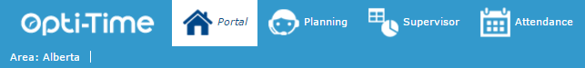

# Portal

The **Portal** is a simplified module of **NFS** designed for mobile staff. It provides access to the essential features they need to manage their appointments and daily activities.

With the Portal, mobile staff can:

* View their appointment schedules and record relevant information in their planning.
* Record visit reports for completed or uncompleted appointments.
* Reschedule appointments that have been placed on hold.
* Record their periods of unavailability.
* Download or view their roadbook.

The Portal also provides team leaders with a monitoring tool. They can view each team member’s planning, monitor appointments, and send emails when issues arise, such as missed or overlooked appointments.

Access the Portal by clicking at the top left of the [site header](https://mynomadia.com/privatedoc/9LLcWh7j74sENa54/optitime-doc/docs/en/otgs-reference-book/bandeau.html).

