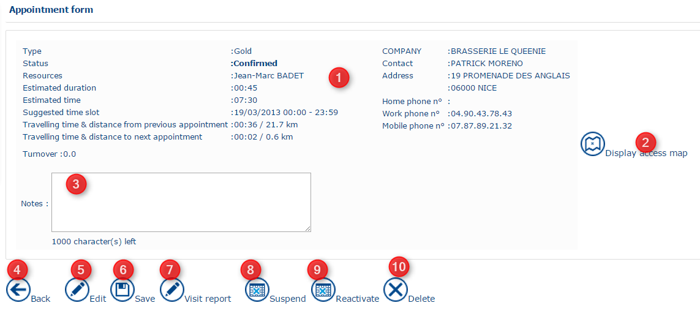
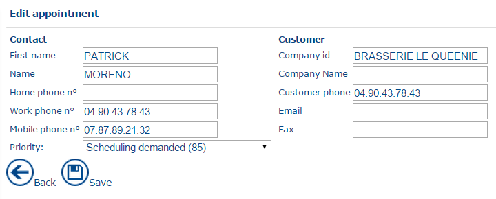

# Application form

Click an appointment in the daily planning to open the corresponding **Appointment** form.

#### Viewing and Editing an Appointment

The **Appointment** form provides access to the information and actions related to the appointment:

1. **Appointment details** – Displays the details of the appointment.
2. **Access map** – Displays a map to help the mobile resource locate the appointment.
3. **Notes** – Allows you to enter comments or additional information related to the appointment.
4. **Back** – Returns to the previously displayed screen.
5. **Edit** – Allows you to enter or modify the contact information, including:
   * First name and surname
   * Home, work, and mobile telephone numbers
   * Title
   * Company name
   * Customer telephone number
   * Fax number
   * Email address

* **Priority** – Use the drop-down menu to select the priority level for the appointment. A higher value indicates a higher priority.
* **Back** – Returns to the previous screen without saving the changes.
* **Save** – Saves the changes made to the appointment form.
* **Visit report** (button visible if the appointment has been fulfilled) displays the [edit visit report](https://mynomadia.com/privatedoc/9LLcWh7j74sENa54/optitime-doc/docs/en/otgs-reference-book/compterendus.html#edition-cpte-rendu) page
* **Suspend** (see [appointment form](https://mynomadia.com/privatedoc/9LLcWh7j74sENa54/optitime-doc/docs/en/otgs-reference-book/call-center-objets.html#fiche-rdv))
* **Reactivate** (see [appointment form](https://mynomadia.com/privatedoc/9LLcWh7j74sENa54/optitime-doc/docs/en/otgs-reference-book/call-center-objets.html#fiche-rdv))
* **Delete** (see [appointment form](https://mynomadia.com/privatedoc/9LLcWh7j74sENa54/optitime-doc/docs/en/otgs-reference-book/call-center-objets.html#fiche-rdv))
