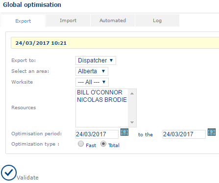

# Global Optimization

This function provides access to optimization management commands (see the **Administration** module), including a command for performing optimization on individual files.

### Export tab

This function performs an optimisation and retrieves the result in à file.

|                                              |     |
| -------------------------------------------- | --- |
| \[Tip]                                       | Tip |
| This function does not modify the plannings. |     |

To run an optimization, select an **area**, specify the **period**, and choose the **optimization type**:

* **Fast** – Optimizes only the selected appointments.
* **Total** – Re-optimizes all planned appointments, except confirmed appointments, and inserts new requests.

The optimization file is created at the specified location.

### Import tab

This function allows you to import a filé for optimization.

|                                                                      |     |
| -------------------------------------------------------------------- | --- |
| \[Tip]                                                               | Tip |
| The result of this optimisation will be imported into the plannings. |     |

First, select a file to import, and then click on Update.

### Automatic tab

(cf [Administration](https://mynomadia.com/privatedoc/9LLcWh7j74sENa54/optitime-doc/docs/en/otgs-reference-book/optimisation.html#optim-service) module)

### Journal tab

(cf [Administration](https://mynomadia.com/privatedoc/9LLcWh7j74sENa54/optitime-doc/docs/en/otgs-reference-book/optimisation.html#optim-journal) module)
