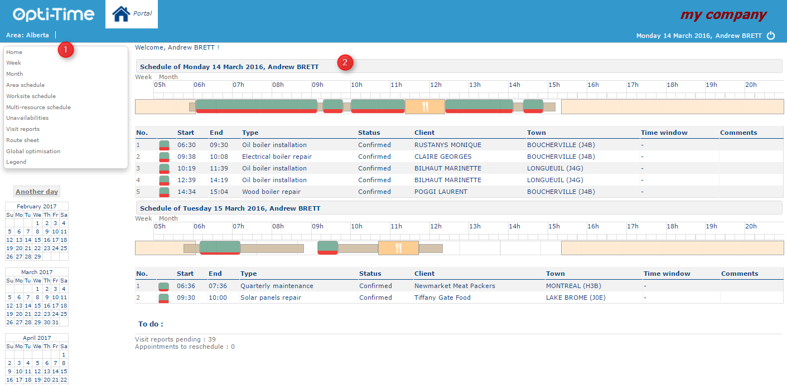

# Home page

Click on Portal menu to open the module home page directly.

#### Main Menu

The **Portal** home page is divided into two sections. The main menu is located in the **top-left corner** of the screen.

The functions available in the menu depend on the user’s access rights:

1. **Today** – Displays the resource’s daily planning and the tasks to be completed. For team leaders, this section also displays **team alerts**. Team leaders can use the **Email alert** button to send an email to the relevant team members.

* [Week](https://mynomadia.com/privatedoc/9LLcWh7j74sENa54/optitime-doc/docs/en/otgs-reference-book/portail-semaine.html)
* [Month](https://mynomadia.com/privatedoc/9LLcWh7j74sENa54/optitime-doc/docs/en/otgs-reference-book/portail-mois.html)
* [Team schedule](https://mynomadia.com/privatedoc/9LLcWh7j74sENa54/optitime-doc/docs/en/otgs-reference-book/portail-plan-equipe.html)
* [Area schedule](https://mynomadia.com/privatedoc/9LLcWh7j74sENa54/optitime-doc/docs/en/otgs-reference-book/portail-plan-reg.html)
* [Worksite schedule](https://mynomadia.com/privatedoc/9LLcWh7j74sENa54/optitime-doc/docs/en/otgs-reference-book/portail-site-trav.html)
* [Multi-resource schedule](https://mynomadia.com/privatedoc/9LLcWh7j74sENa54/optitime-doc/docs/en/otgs-reference-book/portail-multi-res.html)
* [Unavailabilities](https://mynomadia.com/privatedoc/9LLcWh7j74sENa54/optitime-doc/docs/en/otgs-reference-book/indisponibilite.html)
* [Visit reports](https://mynomadia.com/privatedoc/9LLcWh7j74sENa54/optitime-doc/docs/en/otgs-reference-book/compterendus.html)
* [Route sheet](https://mynomadia.com/privatedoc/9LLcWh7j74sENa54/optitime-doc/docs/en/otgs-reference-book/call-center-menu.html#feuille-de-route)
* [Global optimization](https://mynomadia.com/privatedoc/9LLcWh7j74sENa54/optitime-doc/docs/en/otgs-reference-book/portail-optim-glob.html)
* [Legend](https://mynomadia.com/privatedoc/9LLcWh7j74sENa54/optitime-doc/docs/en/otgs-reference-book/portail-legende.html)
* [OTMobile application](https://mynomadia.com/privatedoc/9LLcWh7j74sENa54/optitime-doc/docs/en/otgs-reference-book/portail-otm.html)

2. **Central section** – Displays the information available in the Portal.
