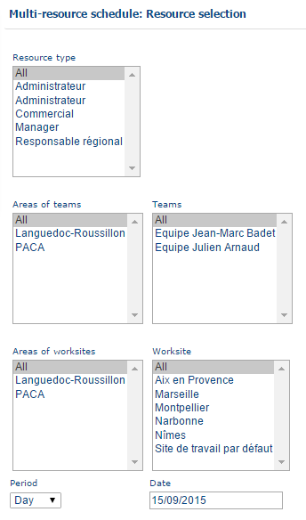
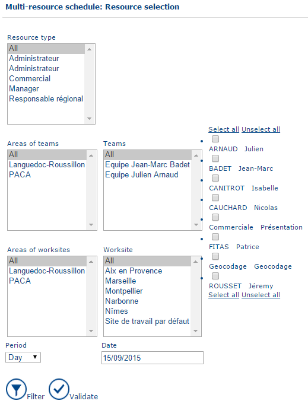

# Multi Resource Scedule

This page displays the planning for one or more resources that are not assigned to the team of the connected user. To access this page, click **Multi-Resource Schedule** in the main menu.

You can filter the resources whose planning you want to display using the following criteria:

* **Resource type**
* **Team affiliation area**
* **Team**
* **Worksite affiliation area**
* **Worksite**
* **Period** – day or week
* **Date**

Use these filters to display the planning for one or more resources assigned to another team.

1. In the **Resource Type** list, select the type of role held by the resource you want to find. Select **All** to search across all resource types.
2. In the **Team Area** list, select the area to which the resource's team is affiliated. Select **All** to search across all team areas.
3. In the **Team** list, select the team to which the resource is affiliated. Select **All** to search across all teams.
4. In the **Worksite Affiliation Area** list, select the area to which the resource's worksite is affiliated. Select **All** to search across all worksite areas.
5. In the **Worksite** list, select the worksite to which the resource is affiliated. Select **All** to search across all worksites.
6. In the **Period** list, select the planning view to display: **Day** or **Week**.
7. In the **Date** field, select the date for which you want to display the planning.
8. Click **Filter** to display the resources matching the selected criteria and choose the resources whose planning you want to view.
9. Click **Validate** to display the planning for the selected resources.

