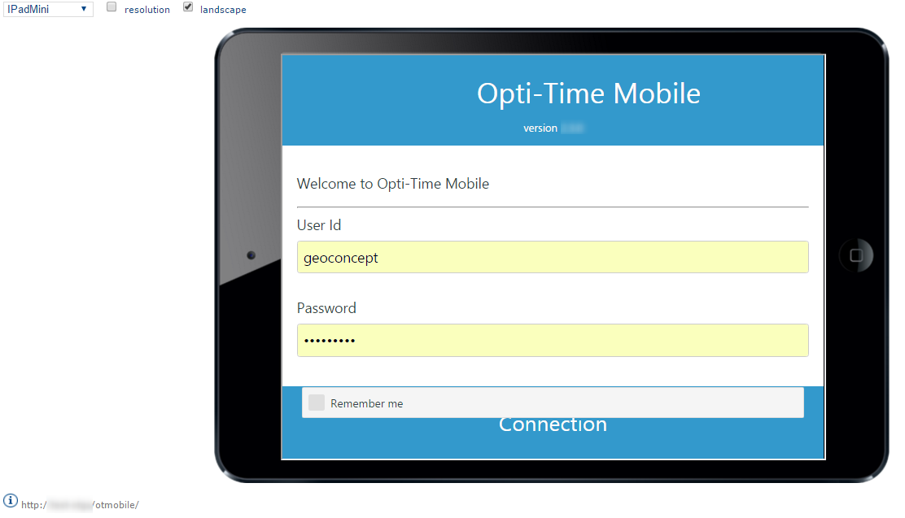
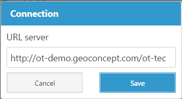

# NFS Mobile Application

This section serves to simulate the NFS application.

Use the options provided to configure how the application is displayed:

* **Device** – Select the device format from the drop-down list. Available options include **iPhone 5**, **iPad Mini**, **iPad**, **Smartphone 5"**, and **Phablet 5.5"**.
* **Resolution** – Select this check box to display the application using the selected device's resolution without the device frame.
* **Landscape** – Select this check box to switch between landscape (horizontal) and portrait (vertical) orientation.

After entering the resource's **login** and **password** in **NFS Mobile**, click **Connection**. The application opens in the configured display format.

Here you should enter the url for the Opti-Time webapp. For example: [http://test-otgs/otgs](http://test-otgs/otgs)

|                                                                                                    |     |
| -------------------------------------------------------------------------------------------------- | --- |
| \[Tip]                                                                                             | Tip |
| To use this function, the **NFS Mobile** webapp must have been installed previously on the server. |     |
