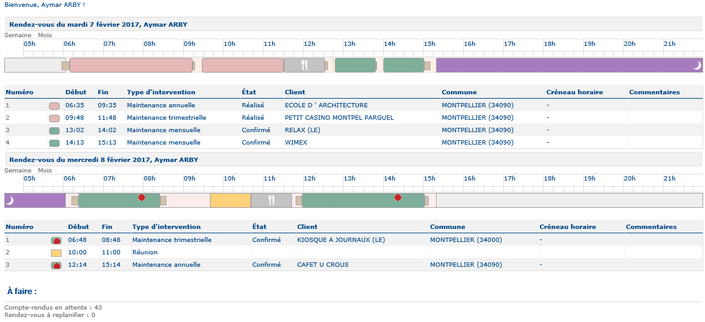
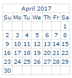

# Planning

The central section automatically displays the plannings for **Today** and **Tomorrow**.

|                                                                                                                                                                                                           |     |
| --------------------------------------------------------------------------------------------------------------------------------------------------------------------------------------------------------- | --- |
| \[Tip]                                                                                                                                                                                                    | Tip |
| Click on [Legend](https://mynomadia.com/privatedoc/9LLcWh7j74sENa54/optitime-doc/docs/en/otgs-reference-book/portail-legende.html) button in the main menu for the key to colour coding for time windows. |     |

Here we find the same items as are present in the [planning in the scheduling module](https://mynomadia.com/privatedoc/9LLcWh7j74sENa54/optitime-doc/docs/en/otgs-reference-book/call-center-agenda.html#call-center-agenda-rdv).

#### Viewing the Planning for Another Day

To view the planning for a day other than **Today** or **Tomorrow**:

1. Click the **date selector** in the lower-left corner of the screen.
2. Select a date from the **current month** or from the **following two months**.
3. The planning for the selected day is displayed.

Click **Another day** to select an earlier or later date from the calendar.

After selecting the desired date, the corresponding planning is displayed. You can then view or edit the appointments scheduled for that day.

Click on the week link to display the [Week Planning](https://mynomadia.com/privatedoc/9LLcWh7j74sENa54/optitime-doc/docs/en/otgs-reference-book/portail-semaine.html).

Click on the month link to display the [month planning](https://mynomadia.com/privatedoc/9LLcWh7j74sENa54/optitime-doc/docs/en/otgs-reference-book/portail-mois.html).
