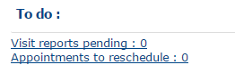
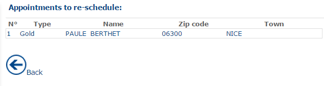
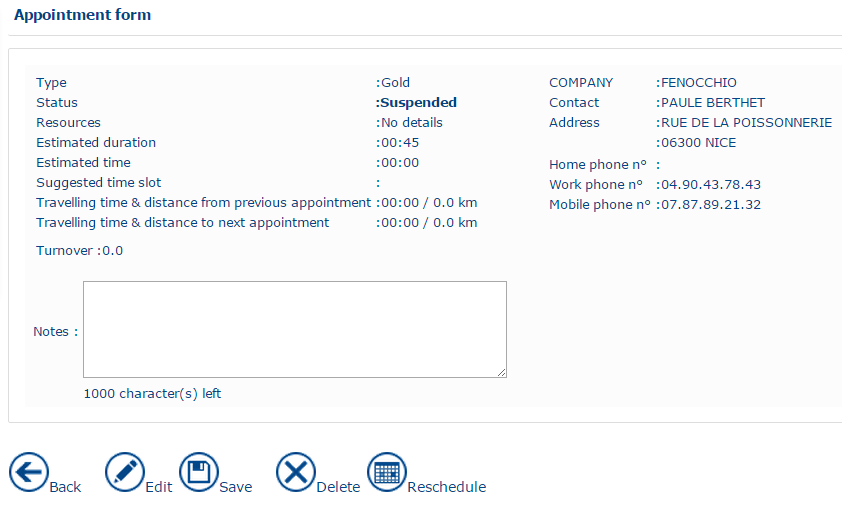
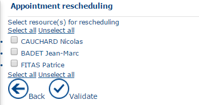
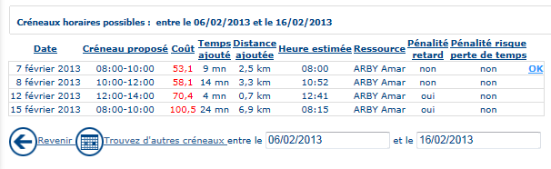
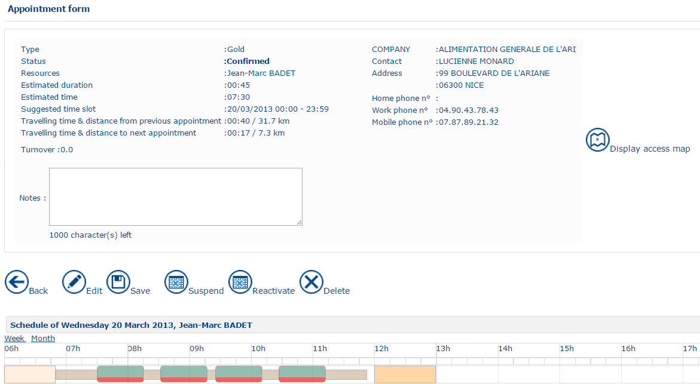

# Tasks to be performed

List of tasks

In the lower part of the home page, there are two types of task to be performed in the list:

* [Visit reports pending](https://mynomadia.com/privatedoc/9LLcWh7j74sENa54/optitime-doc/docs/en/otgs-reference-book/Tacheafaire.html#tacheafaire1);
* [Appointments to reschedule](https://mynomadia.com/privatedoc/9LLcWh7j74sENa54/optitime-doc/docs/en/otgs-reference-book/Tacheafaire.html#rdv-a-replanifier).

### Visit reports pending

This will be the list of queued [visit reports](https://mynomadia.com/privatedoc/9LLcWh7j74sENa54/optitime-doc/docs/en/otgs-reference-book/compterendus.html).

### Appointments to reschedule

A list similar to that containing the [**Visit reports pending**](https://mynomadia.com/privatedoc/9LLcWh7j74sENa54/optitime-doc/docs/en/otgs-reference-book/compterendus.html) is proposed.

|                                                                                       |         |
| ------------------------------------------------------------------------------------- | ------- |
| \[Warning]                                                                            | Warning |
| Only those appointments that have been suspended beforehand are present in this list. |         |

* Click the **sequence number** to open the **Appointment** form and enter the required appointment information.
* Click **Reschedule** to search for a new time window that meets all the constraints associated with the appointment.

* A page is displayed prompting you to select the resource to assign to the appointment in the planning.

|                                                                                                                                     |      |
| ----------------------------------------------------------------------------------------------------------------------------------- | ---- |
| \[Note]                                                                                                                             | Note |
| At this stage, **Opti-Time** has filtered competent resources, and displays a list of resources suggested as being apt for the job. |      |

* The Back button returns to the list of appointments to reschedule, while Validate provides access to the list of suggestions made by the [OTR](https://mynomadia.com/privatedoc/9LLcWh7j74sENa54/optitime-doc/docs/en/otgs-reference-book/Tacheafaire.html). To select the suggestion that best matches the need, click on the OK button to the right of the table.

* The immediate effect of Validation is to position the appointment in the planning of the chosen resource.

