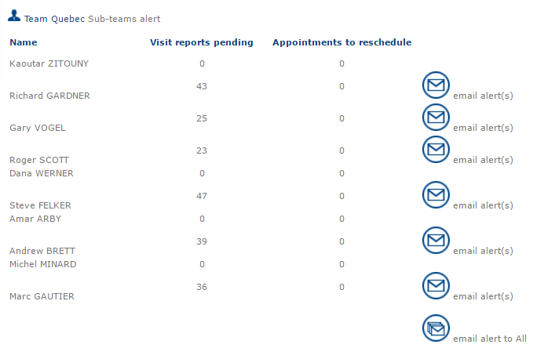
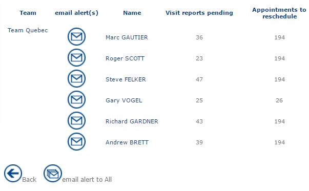

# Team Alerts

This section is primarily intended for **team leaders**. It lists the resources assigned to their team and subordinate teams, referred to as **sister teams**.

For each team, the section displays the number of **pending visit reports** and **appointments to be rescheduled**.

Team leaders can perform the following actions:

* **Resource name** – Click the resource’s name to view their planning for today.
* **Visit reports** – Click the number of pending visit reports to view the complete list of reports that require action.
* **Appointments to reschedule** – Click the number of appointments to reschedule to view the list of appointments that require a new date or time.
* **Email alert(s)** – Sends an email to the selected resource reminding them to complete the two pending tasks.
* **Email alert(s) to all** – Sends an email to all members of the team reminding them to complete the two pending tasks.

#### Managing Sister Teams

When a team leader is responsible for one or more **sister teams**, the **Alert(s) to sister teams** option is available.

Click this option to:

* View the relevant sister teams and their members.
* View their pending visit reports.
* View appointments that need to be rescheduled.
* Send an alert to an individual team or to all members of a selected sister team.

|                                                                                                                                                                                                                                                  |         |
| ------------------------------------------------------------------------------------------------------------------------------------------------------------------------------------------------------------------------------------------------ | ------- |
| \[Warning]                                                                                                                                                                                                                                       | Warning |
| To enable messages to be sent, an SMTP server will be required. Finally, the email address of each resource must be entered in the form for each mobile resource. To do this, go into the Information tab, located in the Administration module. |         |

