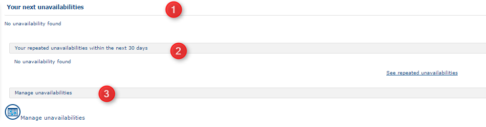
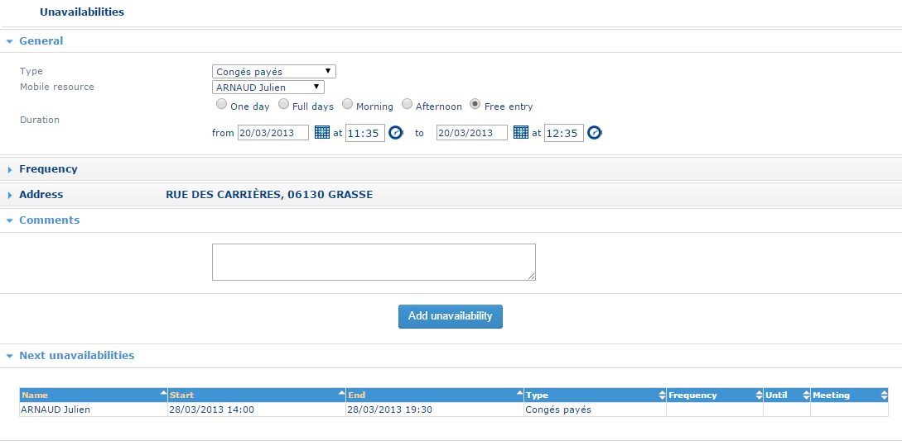
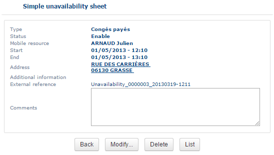

# Un availabilities

This page allows you to **view, add, edit, or delete** unavailabilities for a resource.

The **Unavailabilities** page can be accessed from the **Portal** or **Planning** module, depending on the configuration.

An unavailability is a period during which a resource cannot perform an appointment. Unavailabilities can be either **one-off** or **regular**:

* **One-off unavailability** applies to a specific period, such as sick leave, time off in lieu, or a meeting.
* **Regular unavailability** is repeated at regular intervals over a period of time.

Each unavailability is defined by a **type**, **resource**, **date**, **time window**, and **location**. Some unavailability types have a default location configured for the resource. For example, the default location for a time-off-in-lieu unavailability may be the resource's home address.

If an unavailability overlaps with a scheduled appointment, the appointment is **suspended**.

To access the page, click **Unavailabilities** in the main menu. The page is divided into three sections:

1. The upper dialogue item presents the list of the next one-off unavailability's for the resource.&#x20;
2. This dialogue item shows the list of regular unavailability's for the resource;
3. This dialogue item manages unavailabilities.

### One-off unavailabilities

The table displays all upcoming **one-off unavailabilities** for the resource. For each unavailability, the following information is shown:

* **Start date and time**
* **End date and time**
* **Unavailability type**

All future one-off unavailabilities are displayed.

#### Sort the list

Click a column heading to sort the unavailabilities based on that column. Click the same heading again to reverse the sort order.

#### Edit or delete an unavailability

* Click **Delete** to remove an unavailability. A confirmation message is displayed before the unavailability is deleted.
* Click **Edit Notes** to view or modify the notes associated with an unavailability.

For each unavailability, you can add or modify a saved note.

Click **Save** to save the changes and return to the previous page.

Click **Back** to return to the previous page without saving any changes.

### Regular unavailability's

The table displays the resource's **regular unavailabilities**. For each unavailability, the following information is shown:

* **Start date and time**
* **End date and time**
* **Periodicity**
* **Repeat-until date**
* **Unavailability type**

#### Sort the list

Click a column heading to sort the unavailabilities based on that column. Click the same heading again to reverse the sort order.

#### Edit or delete an unavailability

* Click **Delete** to remove an unavailability. A confirmation message is displayed before the unavailability is deleted.
* Click **Edit Notes** to view or modify the notes associated with an unavailability.

For each unavailability, you can add or modify a saved note.

Click **Save** to save the changes and return to the previous page.

Click **Back** to return to the previous page without saving any changes.

### Handling unavailability's

The Handling unavailability's button opens a new window utilised to add unavailabilities.

The bottom part of the window displays the table of the next lot of unavailabilities. Click on the label in one of the table columns to sort unavailabilities as a function of this column. Click a second time on the same label to reverse the sort applied.

#### Adding an unavailability

To add an unavailability, specify the following details:

* **Resource**
* **Unavailability type**
* **Start and end dates**
* **Start and end times**
* **Periodicity**, if the unavailability is regular
* **Location**
* **Comments**, if required

#### Select the unavailability type and resource

1. In the **Unavailability Type** list, select the type of unavailability. **Non-worked day** is selected by default.
2. If you select **Meeting** or **Training**, the unavailability is considered a **multi-resource unavailability**. For more information, see \[Unavailabilities multi-resource].
3. In the **Resource** list, select the resource concerned by the unavailability.

#### Specify the date and time

4. Enter the **start** and **end dates** in the corresponding fields, or select them using the calendar.
5. Enter the **start** and **end times** in the corresponding fields.

For a regular unavailability, specify the following additional information:

* **Periodicity** – the interval at which the unavailability is repeated, expressed in days, weeks, or months.
* **Repeat-until date** – the date on which the recurrence ends. If no date is specified, the unavailability is repeated indefinitely.

#### Specify the location

6. Enter the **address** where the unavailability occurs.

If a default location is configured for the selected unavailability type, it is automatically suggested. Otherwise, enter the **street**, **postal code**, and **town**, then click **Validate the address**. The application displays a list of addresses matching the information entered. Select the appropriate address.

#### Add comments

7. In the **Comments** field, enter any additional information. The comments are saved as a note associated with the unavailability.
8. Click **Add Unavailability** to save the information and add the unavailability.

The application checks that the new unavailability does not conflict with existing unavailabilities. Once the unavailability is added, the entry window closes and the **Unavailabilities** list is updated.

#### Adding a multi-resource unavailability

If the unavailability is of the **Meeting** or **Training** type it can assign several resources. In this instance we refer to a multi-resource type of unavailability.

A drop-down list allows you to choose the name of the resource concerned by unavailability, and clicking on the  button allows you to select others. The **resources**, **teams** and **profiles** radio-buttons enable faster filtering on a search on the list of resources.

The resource can then choose the **meeting** or training required in a list of existing meetings. The resource can also create a new meeting.

The start and finish dates entered in the corresponding dialogue items (for example, 02/03/2013). These can also be chosen using the calendar.

The start and finish times are entered in the corresponding dialogue items (for example, 10:30).

When a frequency is desired, two additional information items should be added: the periodicity expressed in days, weeks or months, as well as the date until which the unavailability is repeated. Not specifying the date indicates that the unavailability is repeated in a permanent manner.

The resource may also specify the address at which the unavailability occurs. If a default location has been defined for the [type of unavailability](https://mynomadia.com/privatedoc/9LLcWh7j74sENa54/optitime-doc/docs/en/otgs-reference-book/donnees.html#type-indispo) selected, this location is suggested as the location for the unavailability. Otherwise, having specified the name of the street, the post code, and the town, the resource clicks on Validate the address. A list of addresses most closely matching the address entered is suggested.

The _Comments_ dialogue item allows you to add additional information saved in the form of notes with the unavailability.

Simply click on Add unavailability to save the new unavailability.

A newly created meeting is saved and added to the list of existing meetings.

#### Unavailability form

The user can consult the unavailability form by clicking on Create a note.

Click on Delete to delete a one-off unavailability and Back to go back to the **Managing unavailabilities** page.

The dates of regular unavailability's can be modified from the unavailability form by clicking on Modify. The modification is only possible if the unavailability period is in progress, or has not yet begun.

#### Unplanning or reassigning appointments

Appointments that cannot be fulfilled, due to an unavailability, are unplanned or reassigned to another resource who is free, for this time slot.
