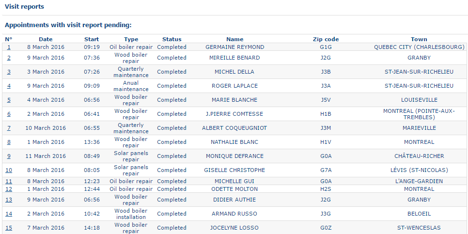
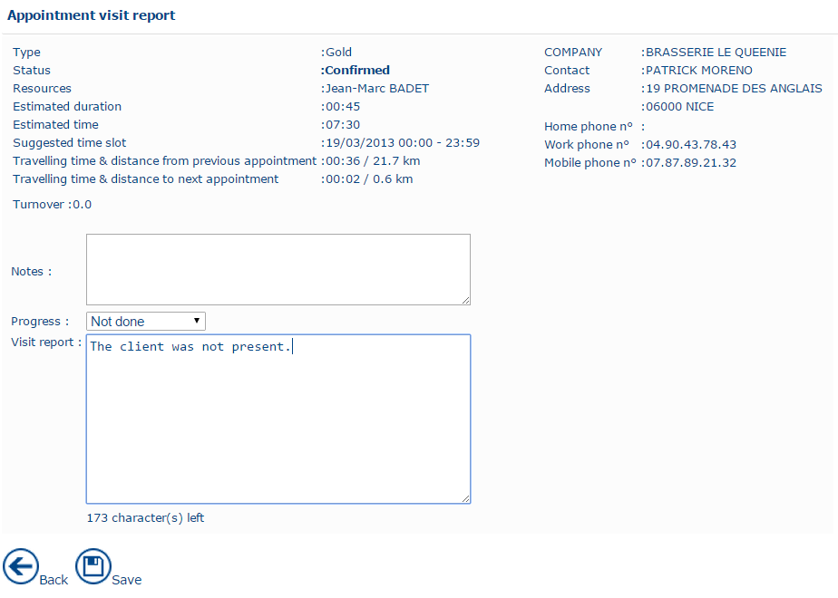

# Visit Reports

Creating a visit report is essential because it informs the application whether an appointment has been completed.

Creating a visit report involves two steps:

* **Update the appointment status** to one of the following:
  * **Unknown**
  * **Unfulfilled**
  * **Fulfilled**
  * **Unable to Fulfill**
* **Create the visit report** to record a brief summary of the appointment.

A visit report can only be created after the appointment has taken place. The **visit report date** must therefore be either before today's date or today's date.

The list of visit reports is displayed only when there are appointments that have already taken place but for which no visit report has been created and the appointment status has not been updated to **Unfulfilled** or **Fulfilled**.

Visit reports to be created are displayed in chronological order. Click the number in the sequence to open the corresponding dialog box.&#x20;

* The visit report dialog provides the following information and options:

#### Appointment details

The upper section displays key information about the appointment, including:

* **Appointment type**
* **Company**
* **Address**
* **Telephone numbers**
* **Appointment status**
* **Date**
* **Estimated time**
* **Proposed time slot**
* **Estimated duration**
* **Travel time**

#### Notes

A series of notes provides additional information that may help the resource complete the appointment. You can also use this section to record any relevant comments or instructions.

#### Appointment status

The **Status** list provides four options. The resource must select the appropriate status after the appointment:

* **Status Unknown** – The resource has not completed the visit report. The appointment status remains unchanged.
* **Unfulfilled** – The appointment did not take place but was not cancelled. The appointment status changes to **Unplanned**.
* **Fulfilled** – The appointment was completed. The appointment status changes to **Fulfilled**.
* **Unable to Fulfill** – The appointment did not take place and will not be completed. The appointment status changes to **Cancelled**.

#### Visit report

The editable **Visit Report** section allows the resource to record information, notes, and comments following the appointment. Use this section to document any actions taken or follow-up required after the appointment.

Click **Save** to save the changes.

Click **Back** to return to the previous screen without saving the changes. The list of visit reports awaiting completion is updated after a visit report is saved.
