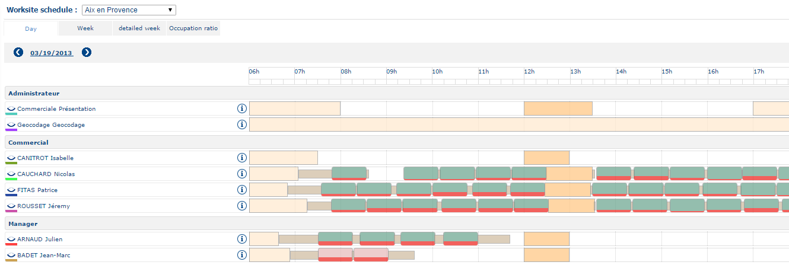
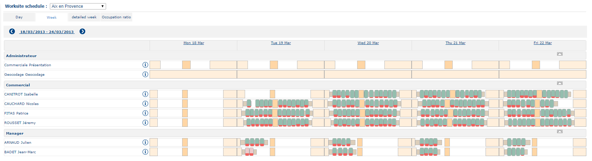
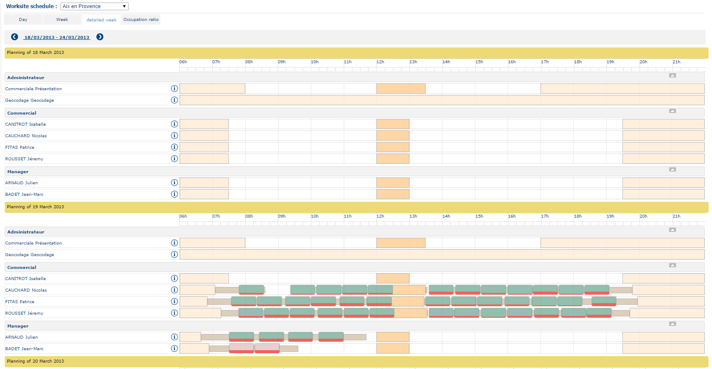
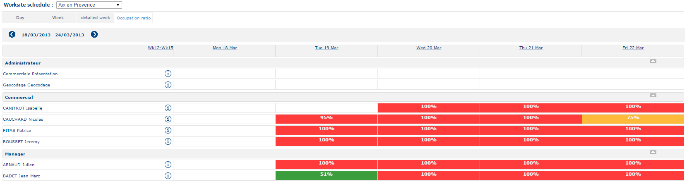
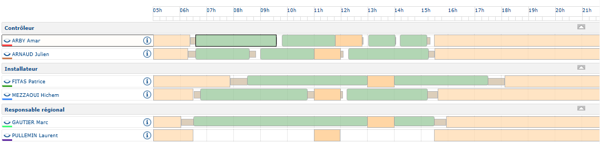

# Worksite Schedule

This page displays the planning for one or more resources based on their assigned worksite. To access it, click **Worksite Schedule** in the main menu.

Depending on the configured rights profile, users can view their own planning, the planning for their assigned worksite, or the planning for all worksites.

|                                                                                                                                    |      |
| ---------------------------------------------------------------------------------------------------------------------------------- | ---- |
| \[Note]                                                                                                                            | Note |
| A resource is assigned systematically to a main worksite. This resource may also be attributed one or several secondary worksites. |      |

Click on  to return to the previous day or click on  to proceed to the next day.\
The Week Planner can be viewed by clicking on the Week tab:

Then click on  to return to the previous week or click on  to go to the next week.\
The Week planning (day by day) can be viewed by clicking on the Detailed Week tab:

Then click on  to return to the previous week or click on  to go to the following week.\
You can display the Work Load Week Planning (cumulated time devoted to all appointments) by clicking on the Occupation ratio tab:

Then click on  to return to the previous week, or click on  to see next week.

|                                                                                                                                          |         |
| ---------------------------------------------------------------------------------------------------------------------------------------- | ------- |
| \[Warning]                                                                                                                               | Warning |
| Depending on the user profile, the choice of worksite may be inactive. By default, it is the user’s worksite that is taken into account. |         |

Depending on the profile of the connected resource, there are three possible scenarios:

* Display plannings for resources affiliated to the main worksite selected;
* Display plannings for resources affiliated to a different main worksite, but having the selected worksite as their secondary worksite;
* Display plannings for resources affiliated to a different main worksite, but having as their secondary worksite the one selected, and making an appointment.

The resources or the appointments may be framed:

* an appointment inside a frame indicates that the appointment is to be executed outside the main worksite;
* a resource inside a pink frame indicates that the resource is not affiliated to the main worksite (this is selected in the interface). However, this site is assigned to the resource as the secondary worksite at which he/she may work.

In the example above, resource ARBY Amar is not affiliated to the main work site of Narbonne. However, Narbonne is his secondary worksite. To distinguish this resource from the others, his name is framed in pink.

Also, this resource has fulfilled an appointment that is not linked to the Narbonne worksite. To indicate that the appointment has been fulfilled outside the worksite, this is framed with a slightly thicker outline.

Finally, this resource has fulfillled an appointment linked to the Narbonne worksite because this has not been framed.
