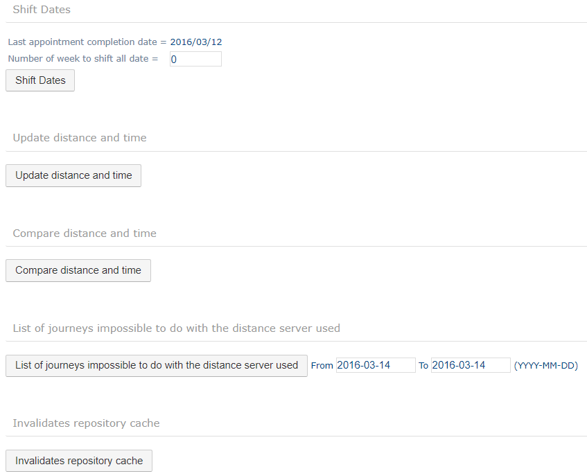
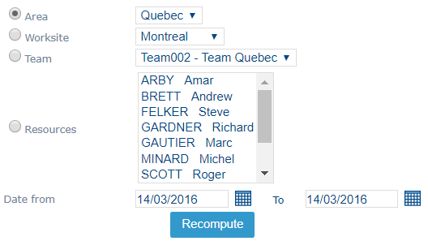
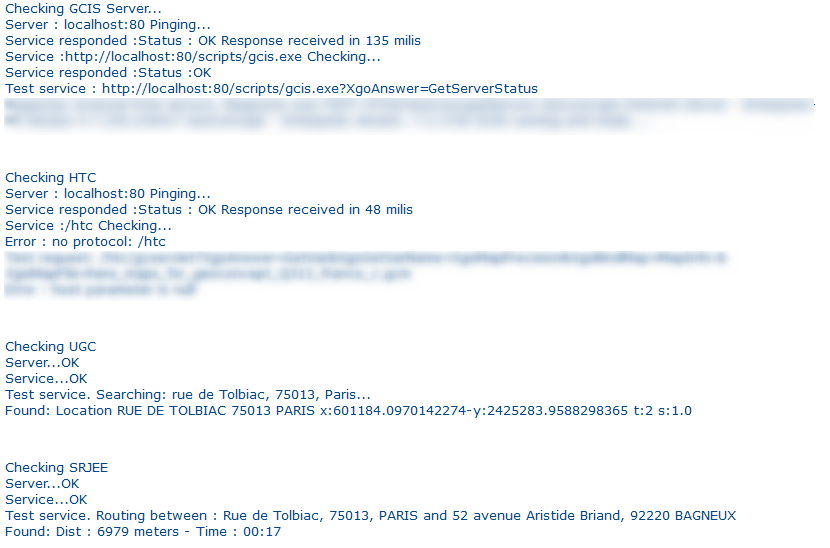
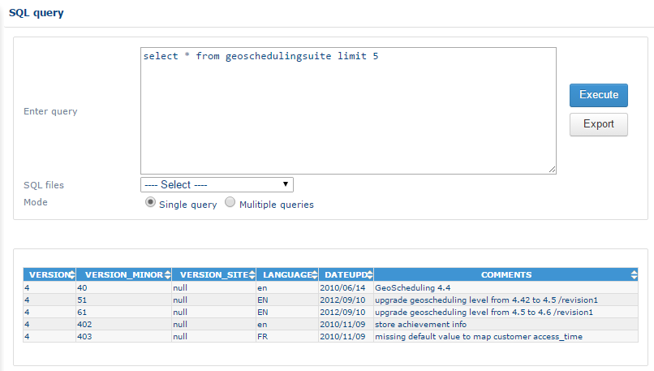
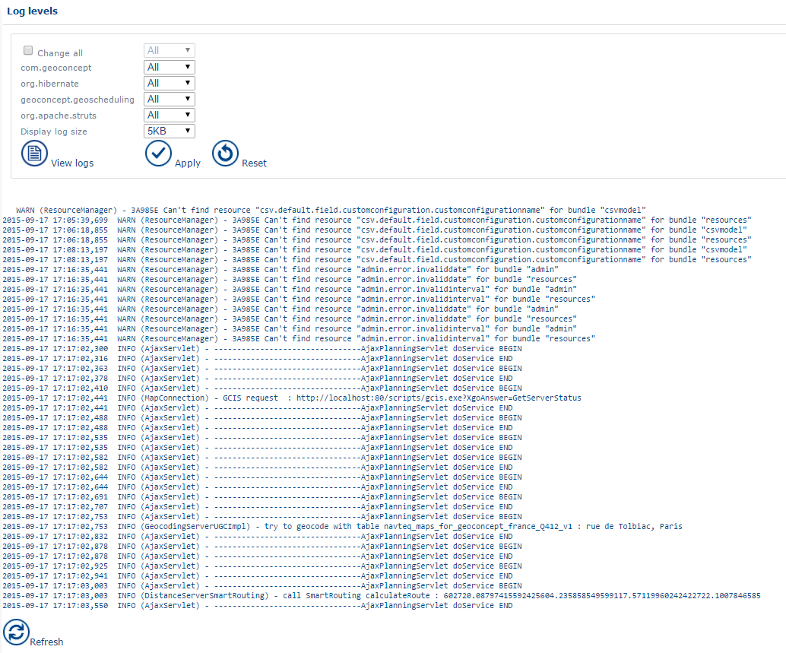

# Tools

|                                                                                                                                  |         |
| -------------------------------------------------------------------------------------------------------------------------------- | ------- |
| \[Warning]                                                                                                                       | Warning |
| This section is reserved for expert administrators. The actions applied in this section can have an irreversible impact on data. |         |

### Advanced tools

Access the function by clicking on the Advanced tools link in the "[Tools](https://mynomadia.com/privatedoc/9LLcWh7j74sENa54/optitime-doc/docs/en/otgs-reference-book/outils.html)" menu.

Interface

This section allows you to apply the following modifications in the database:

#### Stagger dates

This tool allows you to move or delay all appointments by a certain number of days.

|                                                         |         |
| ------------------------------------------------------- | ------- |
| \[Warning]                                              | Warning |
| Do not use this function while in a production context. |         |

#### Update journey distances and times

This function recalculates journey distances and times between appointments.

|                                                                                                                  |         |
| ---------------------------------------------------------------------------------------------------------------- | ------- |
| \[Warning]                                                                                                       | Warning |
| The function recalculates all the journey times for the application, and can take some tens of minutes to do so. |         |

#### List of journeys that are impossible with the distance server used

This function exports a csv file that allows you to detect any appointments that overlap with other elements in the planning. It also allows you to define the number of minutes of overlap, which can be useful for resizing appointments so there are no overlap problems.

#### Renew the repository cache.

Following a database update, allows you to refresh the interface.

### Recompute distance and time

Acccess to this function is by clicking on the Recompute distance link in the [Tools](https://mynomadia.com/privatedoc/9LLcWh7j74sENa54/optitime-doc/docs/en/otgs-reference-book/outils.html) menu.

Interface

This interface allows you to recompute, for a given perimeter (area, site, team or resource for a given period), the journey distances and times between appointments in routes for this perimeter.

This function can be useful, for example, when the speed of travel of a resource has been changed: this tool will allow you to update the corresponding agendas.

### Verify server status

Access the interface for verifying the server status by clicking on the Verification of server status link in the [Tools](https://mynomadia.com/privatedoc/9LLcWh7j74sENa54/optitime-doc/docs/en/otgs-reference-book/outils.html) menu.

Interface

This interface enables verification of the status of geographic services (GCIS), cartographic services (H) and Geocoding services (UGC). The services are functional and their status is OK.

### SQL query

Access the SQL query interface via the SQL Query link in the "[Tools](https://mynomadia.com/privatedoc/9LLcWh7j74sENa54/optitime-doc/docs/en/otgs-reference-book/outils.html)" menu.

Interface

This tool allows you to query the database directly.

### Journals

Access the journals visualisation interface via the Journals link in the "[Tools](https://mynomadia.com/privatedoc/9LLcWh7j74sENa54/optitime-doc/docs/en/otgs-reference-book/outils.html)" menu.

Interface

This tool allows you to view application logs directly in the interface. It also allows you to modify the journalisation mode (to change the level of detail in the logs).

The fields in the interface are as follows:

* **Modify all**: allows update of all drop-down lists at once.
* **org.hibernate**
* **geoconcept.geoscheduling**
* **org.apache.struts**
* **com.geoconcept**
* **Display the journal size**: modifies the number of lines to display

|                                                                                                                                                     |      |
| --------------------------------------------------------------------------------------------------------------------------------------------------- | ---- |
| \[Note]                                                                                                                                             | Note |
| The log levels, from the most detailed to the least detailed are the following: _All_, _Debug_, _Info_, _Alert_, _Warn_, _Error_, _Severe_, _Fatal_ |      |

The See journals button displays the logs.

The Apply button allows you to update the log level.

### JVM thread dump

This function allows you to display the file of JVM threads.

|                                                                                 |     |
| ------------------------------------------------------------------------------- | --- |
| \[Tip]                                                                          | Tip |
| These information items can be requested if you need to resolve a software bug. |     |
