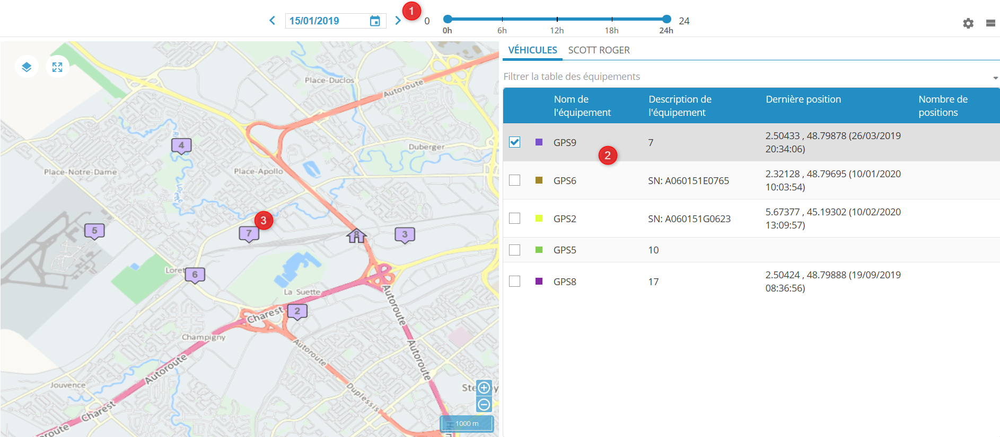
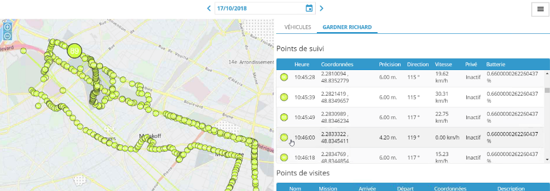

# Tracking

The Tracking module in **Nomada** is accessible only when the [corresponding right](https://mynomadia.com/privatedoc/9LLcWh7j74sENa54/optitime-doc/docs/en/otgs-reference-book/utilisateurs.html#coll-droits) (Tracking tab > Perimeter > **TRACKFLEET\_GUEST** right) is associated to the user profile.

This module allows the user to display, in real time, the GPS positions of [mobile resources](https://mynomadia.com/privatedoc/9LLcWh7j74sENa54/optitime-doc/docs/en/otgs-reference-book/donnees.html#RH-info) assigned to an [vehicle](https://mynomadia.com/privatedoc/9LLcWh7j74sENa54/optitime-doc/docs/en/otgs-reference-book/mob.html#mob-vehicules) and a [tracking device](https://mynomadia.com/privatedoc/9LLcWh7j74sENa54/optitime-doc/docs/en/otgs-reference-book/mob.html#mob-equip-suivi), as a function of the user’s region of affiliation. A filter is also possible depending on the [worksite](https://mynomadia.com/privatedoc/9LLcWh7j74sENa54/optitime-doc/docs/en/otgs-reference-book/donnees.html#site-travail), using the Filter device table link.

|                                                                                                                                                                                                                                                                                                          |     |
| -------------------------------------------------------------------------------------------------------------------------------------------------------------------------------------------------------------------------------------------------------------------------------------------------------- | --- |
| \[Tip]                                                                                                                                                                                                                                                                                                   | Tip |
| The display for items on this page can be horizontal or vertical images/ref/buttons/bouton-tracking-pos.png. It can also be personalised using the **Settings** button images/ref/buttons/bouton-tracking-param.png (filter on the display of position markers, personalisation of table fields, … etc). |     |

1. Select a day and the period.
2. In the **Vehicles** tab, check the resource (resource/vehicle/device) that you would like to track.
3. The map is automatically updated with visit points and the plot of any tracking points for the resource. Moving the mouse over these points brings up an infobox.\
   A second tab under the selected resource name is also displayed and provides details of all the relevant waypoints (visit and tracking).

