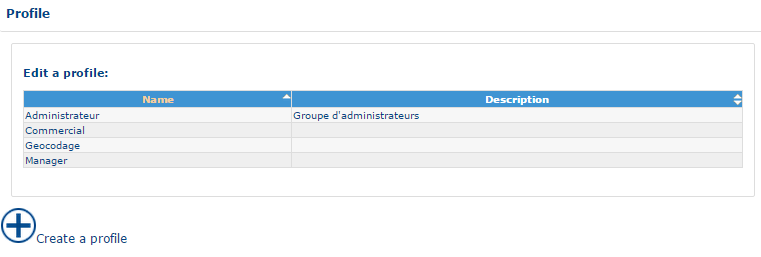
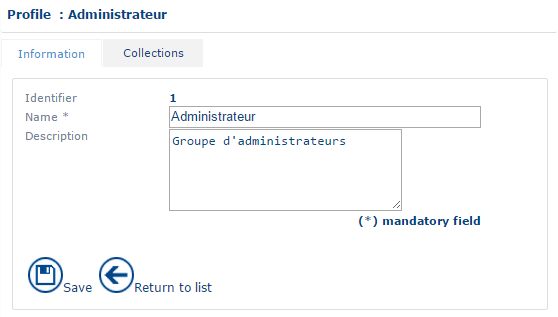
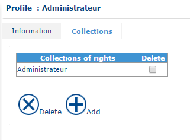
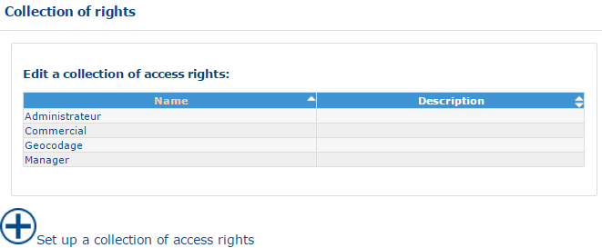
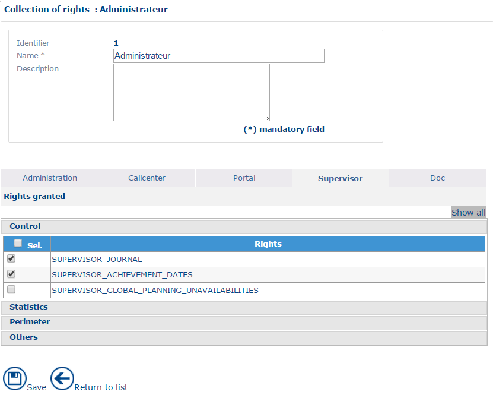
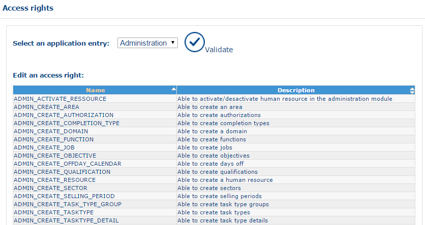
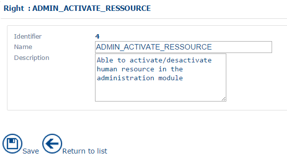
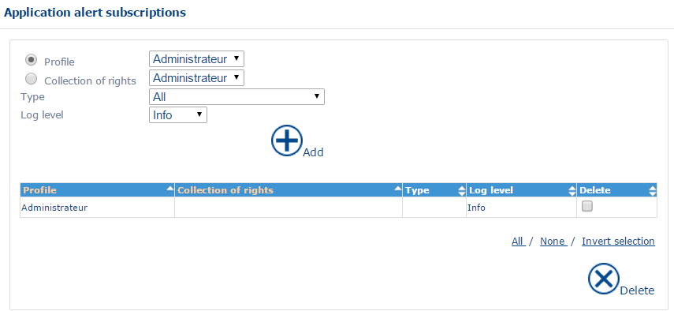

# User Handling

Users are defined in the "[Human Resource](https://mynomadia.com/privatedoc/9LLcWh7j74sENa54/optitime-doc/docs/en/otgs-reference-book/donnees.html#RH)" section in the same way as the resources.

Each resource present in the application can possess a [user profile](https://mynomadia.com/privatedoc/9LLcWh7j74sENa54/optitime-doc/docs/en/otgs-reference-book/utilisateurs.html#profil), or not.

In Opti-Time, each function is managed by user rights. Associating a profile to a user enables definition of the functions that they will have the right to use. All users having the same profile will have the same rights in the application.

The principle for handling user rights depends on two items:

* The [collection of rights](https://mynomadia.com/privatedoc/9LLcWh7j74sENa54/optitime-doc/docs/en/otgs-reference-book/utilisateurs.html#coll-droits), that determines a list of accessible functions
* The [user profile](https://mynomadia.com/privatedoc/9LLcWh7j74sENa54/optitime-doc/docs/en/otgs-reference-book/utilisateurs.html#profil) that regroups a collection of rights, and therefore defines the series of functions accessible to the user having this profile.

|                                                                                                                                                                                                                                                                                                                                                                                         |     |
| --------------------------------------------------------------------------------------------------------------------------------------------------------------------------------------------------------------------------------------------------------------------------------------------------------------------------------------------------------------------------------------- | --- |
| \[Tip]                                                                                                                                                                                                                                                                                                                                                                                  | Tip |
| The planning managers must, even if they do not have an agenda to optimise, be entered in the application, cf. Section "[Human Resource](https://mynomadia.com/privatedoc/9LLcWh7j74sENa54/optitime-doc/docs/en/otgs-reference-book/donnees.html#RH)". Conversely, the mobile resources who do not have a planning role, can have a profile that enables them to consult their agendas. |     |

### Profile

This data item represents all users of the application possessing the same access rights to use the application.

Access to the [list](https://mynomadia.com/privatedoc/9LLcWh7j74sENa54/optitime-doc/docs/en/otgs-reference-book/generalites.html#generalite-liste) of profiles is by clicking on the Profile link in the menu.

It is possible to [create](https://mynomadia.com/privatedoc/9LLcWh7j74sENa54/optitime-doc/docs/en/otgs-reference-book/generalites.html#creation), [consult or edit](https://mynomadia.com/privatedoc/9LLcWh7j74sENa54/optitime-doc/docs/en/otgs-reference-book/generalites.html#modification) an profile.

|                                                                                                                                                                                                                                                                          |     |
| ------------------------------------------------------------------------------------------------------------------------------------------------------------------------------------------------------------------------------------------------------------------------ | --- |
| \[Tip]                                                                                                                                                                                                                                                                   | Tip |
| You can define an Online Advisor Profile, a Supervisor Profile, another Call Centre Manager Profile. The Supervisor and Call Centre manager profiles have, for example, access to the Supervision Module, while the Online Advisor Profile does not have access to this. |     |

#### List of profiles

The interface displays the [list](https://mynomadia.com/privatedoc/9LLcWh7j74sENa54/optitime-doc/docs/en/otgs-reference-book/generalites.html#generalite-liste) of profiles currently saved in the application.

List of profiles

#### Form for a profile

The profile [form](https://mynomadia.com/privatedoc/9LLcWh7j74sENa54/optitime-doc/docs/en/otgs-reference-book/generalites.html#generalite-fiche) is made up of the Information and Collections tabs described below.

**Information tab**

Information tab

The information items stored in each Profile are as follows:

* **Profile Identifier**: this is a read-only unique identifier attributed automatically by the application when validating the creation of the Profile;
* **Profile Name**: Profile name as it will appear in the [resource form](https://mynomadia.com/privatedoc/9LLcWh7j74sENa54/optitime-doc/docs/en/otgs-reference-book/donnees.html#RH-utilisateur);
* **Profile Description**: this is a free text item;

**Collections tab**

The **Collections** tab allows you to associate one or several [collections or rights](https://mynomadia.com/privatedoc/9LLcWh7j74sENa54/optitime-doc/docs/en/otgs-reference-book/utilisateurs.html#coll-droits) to a profile.

Collection of rights associated to the profile

It is possible to [add](https://mynomadia.com/privatedoc/9LLcWh7j74sENa54/optitime-doc/docs/en/otgs-reference-book/generalites.html#ajout) and [delete](https://mynomadia.com/privatedoc/9LLcWh7j74sENa54/optitime-doc/docs/en/otgs-reference-book/generalites.html#suppression) collections of rights.

### Collection of rights

This data item represents the group of Collections of access rights defined at system level. Each Collection of rights is a group of basic access rights that fulfil a generic requirement. For example, one can define an **Edit team planning** Collection of rights for a team manager user.

It is possible to [create](https://mynomadia.com/privatedoc/9LLcWh7j74sENa54/optitime-doc/docs/en/otgs-reference-book/generalites.html#creation), [consult or edit](https://mynomadia.com/privatedoc/9LLcWh7j74sENa54/optitime-doc/docs/en/otgs-reference-book/generalites.html#modification) a collection of rights.

#### List of collections of rights

Access the [list](https://mynomadia.com/privatedoc/9LLcWh7j74sENa54/optitime-doc/docs/en/otgs-reference-book/generalites.html#generalite-liste) of collections of rights by clicking on the Collection of rights link, under the [Users](https://mynomadia.com/privatedoc/9LLcWh7j74sENa54/optitime-doc/docs/en/otgs-reference-book/utilisateurs.html) branch, in the menu.

The interface displays the [list](https://mynomadia.com/privatedoc/9LLcWh7j74sENa54/optitime-doc/docs/en/otgs-reference-book/generalites.html#generalite-liste) of Collections of rights currently saved in the application.

List of collections of rights

#### Form for a collection of rights

Information about a collection of rights

The [form](https://mynomadia.com/privatedoc/9LLcWh7j74sENa54/optitime-doc/docs/en/otgs-reference-book/generalites.html#generalite-fiche) for the collection of rights presents the following information:

* **Identifier** for the Collection of rights: this is a unique identifier in read-only mode, attributed automatically by the application when validating the creation of the Collection of rights.
* **Name** of the Collection of rights: this information is mandatory.
* **Description** of the Collection of rights: this is a free text item. This text appears in a popup on each Collection of rights line in the list of Collections of rights in the Profiles branch.
* **Rights granted**

This section is organised into tabs corresponding to the different modules of the application (Portal, Planning, Supervisor, Attendance, Strategic, Administration, Documentation,…).

Each tab comprises the list of basic [access rights](https://mynomadia.com/privatedoc/9LLcWh7j74sENa54/optitime-doc/docs/en/otgs-reference-book/utilisateurs.html#droits) associated to this tab. The rights checked at the level of the interface are assigned, the rights that remain unchecked are not assigned.

For better legibility, the basic rights have been grouped into themes. The full list of access rights is available in the [appendices](https://mynomadia.com/privatedoc/9LLcWh7j74sENa54/optitime-doc/docs/en/otgs-reference-book/annexes-droits.html).

* **Planning**
  * **Customer**: defines access to customer management functions
  * **Appointment**: defines access to appointment management functions
  * **List of appointments**: defines access to functions present in the lists of appointments
  * **Planning**: defines access to scheduling functions
  * **Interactions with agenda**: defines access to agenda functions
  * **Agenda**: defines access to agenda viewing functions
  * **Communication**: defines access to export and roadbook functions
  * **Cartography**: defines functions available in the map
  * **Night away**: defines access to functions for scheduling nights away
  * **Real time tracking**: defines access to tracking functions for journeys undertaken by resources
  * **Resource management**: determines access to management functions for resource posts
  * **Unavailabilities**: defines access to functions for the scheduling of unavailabilities
  * **Perimeter**: defines access to the module as well as access to the different levels of data (area, domain, team, worksite).
  * **Customized action**
  * **Others**: Other access rights.
* **Portal**
  * **Agenda**: defines access to functions and parameters for the portal agenda
  * **Communication**: defines access to functions related to the road book
  * **Optimisation**: defines access to functions related to optimisations
  * **Unavailabilities**: defines access to functions for scheduling unavailabilities in the portal
  * **Perimeter**: defines access to the module and allows definition of the information levels to which the user has access
* **Supervision**
  * **Control**: defines access to the journalisation functions of the supervisor
  * **Statistics**: defines access to statistics on appointments, unavailabilities, the taking of appointments and the achievement of targets
  * **Perimeter**: defines access to the administration module as well as access to different levels of data (area, domain, team, worksite).
  * **Others**: Other access rights.
* **Attendance**
  * **Perimeter**
  * **Resource**
  * **Post**
  * **On-call duty day**
  * **On-call duty week**
  * **Unavailability**
  * **Marker**
  * **Working day**
  * **Working week**
  * **Reports**
  * **Print**
  * **Communication**
  * **Others**
* **Administration**
  * **Global access**: defines access to the main functions of an administration module
  * **Resource**: defines access to [human resources](https://mynomadia.com/privatedoc/9LLcWh7j74sENa54/optitime-doc/docs/en/otgs-reference-book/donnees.html#RH) management functions
  * **Post**: defines access to management functions for [types of post](https://mynomadia.com/privatedoc/9LLcWh7j74sENa54/optitime-doc/docs/en/otgs-reference-book/donnees.html#type-poste)
  * **Team**: Defines access to management functions for [teams](https://mynomadia.com/privatedoc/9LLcWh7j74sENa54/optitime-doc/docs/en/otgs-reference-book/donnees.html#equipe)
  * **Worksite**: defines access to [worksite](https://mynomadia.com/privatedoc/9LLcWh7j74sENa54/optitime-doc/docs/en/otgs-reference-book/donnees.html#site-travail) management functions
  * **Domain**: defines access to management functions for [domains](https://mynomadia.com/privatedoc/9LLcWh7j74sENa54/optitime-doc/docs/en/otgs-reference-book/donnees.html#domaine)
  * **Sub-contractor**
  * **Equipment**
  * **Area**: defines access to management functions for [areas](https://mynomadia.com/privatedoc/9LLcWh7j74sENa54/optitime-doc/docs/en/otgs-reference-book/donnees.html#region)
  * **Sector**: defines access to management functions for [sectors](https://mynomadia.com/privatedoc/9LLcWh7j74sENa54/optitime-doc/docs/en/otgs-reference-book/donnees.html#secteur)
  * **Unavailability type**: Defines access to [types of unavailability](https://mynomadia.com/privatedoc/9LLcWh7j74sENa54/optitime-doc/docs/en/otgs-reference-book/donnees.html#type-indispo) management functions
  * **On-call duty template**
  * **Product**
  * **Product family**
  * **Vehicle**
  * **Tracking device**
  * **RH vehicle assignment**
  * **Skill**: defines access to [skills](https://mynomadia.com/privatedoc/9LLcWh7j74sENa54/optitime-doc/docs/en/otgs-reference-book/donnees.html#competence) management functions
  * **Authorisation**: defines access to management functions for [authorisations](https://mynomadia.com/privatedoc/9LLcWh7j74sENa54/optitime-doc/docs/en/otgs-reference-book/donnees.html#autorisation)
  * **Intervention type**: defines access to management functions for [types of intervention](https://mynomadia.com/privatedoc/9LLcWh7j74sENa54/optitime-doc/docs/en/otgs-reference-book/donnees.html#type-intervention)
  * **Target**: defines access to management functions for [targets](https://mynomadia.com/privatedoc/9LLcWh7j74sENa54/optitime-doc/docs/en/otgs-reference-book/objectif.html)
  * **Activity tracking**: defines access to [activity tracking](https://mynomadia.com/privatedoc/9LLcWh7j74sENa54/optitime-doc/docs/en/otgs-reference-book/donnees.html#suivi-activite) management functions.
  * **Calendar**: defines access to calendar ([Public holidays](https://mynomadia.com/privatedoc/9LLcWh7j74sENa54/optitime-doc/docs/en/otgs-reference-book/donnees.html#jour-ferie), [day template](https://mynomadia.com/privatedoc/9LLcWh7j74sENa54/optitime-doc/docs/en/otgs-reference-book/donnees.html#modele-jour), [week template](https://mynomadia.com/privatedoc/9LLcWh7j74sENa54/optitime-doc/docs/en/otgs-reference-book/donnees.html#modele-semaine) and [Sales period](https://mynomadia.com/privatedoc/9LLcWh7j74sENa54/optitime-doc/docs/en/otgs-reference-book/donnees.html#periode-vente) functions).
  * **Configuration**: defines access to the management of [XML](https://mynomadia.com/privatedoc/9LLcWh7j74sENa54/optitime-doc/docs/en/otgs-reference-book/CSV.html#XML) and [CSV](https://mynomadia.com/privatedoc/9LLcWh7j74sENa54/optitime-doc/docs/en/otgs-reference-book/CSV.html) files.
  * **Optimisation**: defines access to [optimisation](https://mynomadia.com/privatedoc/9LLcWh7j74sENa54/optitime-doc/docs/en/otgs-reference-book/optimisation.html) management functions
  * **Perimeter**: defines access to the administration module as well as access to different levels of data (area, domain, team, worksite).
  * **Technical exchanges**: defines access to the management of [CSV](https://mynomadia.com/privatedoc/9LLcWh7j74sENa54/optitime-doc/docs/en/otgs-reference-book/CSV.html) files and to TOMTOM export.
  * **Exceptional localisation type**
  * **Typology**
  * **Others**: Other access rights.
* **Modules**
* **Documentation**
  * **Perimeter**: defines access to the on-line documentation and [WalkMe](https://mynomadia.com/privatedoc/9LLcWh7j74sENa54/optitime-doc/docs/en/otgs-reference-book/WM.html) display.
* **My applications**

### Access rights

This data item represents the group of Elementary access rights defined at the level of the system (the full list of access rights is available in [appendices](https://mynomadia.com/privatedoc/9LLcWh7j74sENa54/optitime-doc/docs/en/otgs-reference-book/annexes-droits.html)). Each identifier is pre-saved at the level of the application. Only the names and descriptions are editable.

It is possible to [consult or edit](https://mynomadia.com/privatedoc/9LLcWh7j74sENa54/optitime-doc/docs/en/otgs-reference-book/generalites.html#modification) an access right.

|                                                                                                                                                                                                                                            |         |
| ------------------------------------------------------------------------------------------------------------------------------------------------------------------------------------------------------------------------------------------ | ------- |
| \[Warning]                                                                                                                                                                                                                                 | Warning |
| Given that each right is known by the system exclusively by its identifier and that these are predefined, it is advisable to choose names for rights with great care to try and retain a sense that is equivalent to the original meaning. |         |

#### List of access rights

Access this function by clicking on the Access rights link in the menu.

The interface displays the [list](https://mynomadia.com/privatedoc/9LLcWh7j74sENa54/optitime-doc/docs/en/otgs-reference-book/generalites.html#generalite-liste) of Access rights classified by activity currently saved in the application.

List of access rights

The list includes a **Description** field giving the definition of each right.

#### Access right form

Access right form

The [form](https://mynomadia.com/privatedoc/9LLcWh7j74sENa54/optitime-doc/docs/en/otgs-reference-book/generalites.html#generalite-fiche) for an access right comprises the following information:

* **Identifier** of the Access right: this is a unique identifier in read only mode, attributed permanently by the application.
* **Name** of the Access right: it is advisable NOT to modify the name or, if modifying it, to try and retain the same sense.
* **Description** of the Access right: this is a free text item. This text appears in a popup on each Access right line in the list of Rights granted in the Collection of rights branch.

### Subscription to alerts

Alerts enable users to be warned in certain cases (for example, an error during an import operation, an update of a configuration, the start or end of the process, etc).

They are available in the [Application alerts](https://mynomadia.com/privatedoc/9LLcWh7j74sENa54/optitime-doc/docs/en/otgs-reference-book/call-center-menu.html#alertes) menu in the Planning module.

Subscribing to an alert enables reception of the corresponding flow of information.

It is possible to [add](https://mynomadia.com/privatedoc/9LLcWh7j74sENa54/optitime-doc/docs/en/otgs-reference-book/generalites.html#ajout) or [delete](https://mynomadia.com/privatedoc/9LLcWh7j74sENa54/optitime-doc/docs/en/otgs-reference-book/generalites.html#suppression) a subscription to an alert.

|                                                                                                  |         |
| ------------------------------------------------------------------------------------------------ | ------- |
| \[Warning]                                                                                       | Warning |
| Without the relevant subscription to the service, the user will not see the corresponding alert. |         |

Access the [list](https://mynomadia.com/privatedoc/9LLcWh7j74sENa54/optitime-doc/docs/en/otgs-reference-book/generalites.html#generalite-liste) of subscriptions by clicking on the Subscription to alerts link in the menu.

The interface displays the list of alerts currently saved in the application.

List of alerts

The fields available in the interface are the following;

* **Profile**: Enables choice of a user profile that will follow the alerts. All users with a profile will follow the alerts.
* **Collection of rights**: Enables choice of which collections of rights to associate to alerts. All users possessing this collection of rights will be able to track alerts.
* **Type**: Enables selection of the alert to subscribe to;
  * _All_
  * _Optimization Batch warning_
  * _Export warning_
  * _Import warning_
  * _Entity creation_
  * _Entity disabling or deletion_
  * _Optimization batch error_
  * _Export error_
  * _Import error_
  * _Communication warning event_
  * _Communication error event_
  * _Service call event_
  * _Process start event_
  * _Process end event_
  * _Service failed event_
  * _Service completed event_
  * _Entity update_
  * _Optimization settings updated_
  * _Settings updated_
  * _Export summary_
  * _Import summary_
  * _Optimization batch summary_
  * _Tracking summary_
  * _User session_
* **Level of journalisation**: Enables definition of the level of detail of historical information, from the most detailed to the least detailed: All, Debug, Info, Alert, Warn, Error, Severe, Fatal
